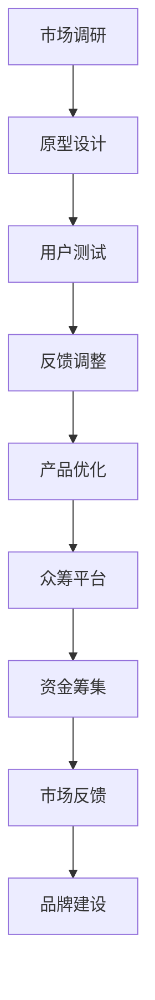

                 

# 一人公司如何利用众筹平台验证产品概念

> **关键词：** 一人公司、众筹平台、产品概念、市场验证、用户体验、创新

**摘要：** 本文将探讨如何通过众筹平台来验证一人公司的产品概念。我们将详细分析众筹平台的优势与劣势，提供具体操作步骤，并结合实际案例进行解读。读者将了解到如何利用众筹平台来收集用户反馈、降低市场风险，并最终实现产品成功上线。

## 1. 背景介绍

在当今快速变化的市场环境中，一人公司（又称单人公司或独立创业者）面临着诸多挑战。他们通常缺乏大规模的资金支持、人力资源和市场资源，但仍然渴望将自己的创新理念转化为实际的产品。众筹平台作为一种新兴的融资方式，为一人公司提供了一种新的解决方案。

众筹平台允许创业者通过在线平台发布项目，向公众展示他们的产品概念，并直接从支持者那里获得资金。这种模式不仅可以解决资金问题，还可以帮助创业者验证市场潜力，提高产品的成功率。然而，众筹平台也存在一些潜在风险和挑战，如资金回收的不确定性、市场反馈的不稳定性等。

本文将探讨一人公司如何利用众筹平台来验证产品概念，以降低市场风险并提高产品成功的机会。我们将从以下几个方面展开讨论：

1. 众筹平台的优势与劣势
2. 产品概念的验证过程
3. 众筹平台的操作步骤
4. 用户反馈与市场调整
5. 实际案例分析

通过这些讨论，读者将了解到如何有效地利用众筹平台来验证产品概念，并为一人公司的成功发展奠定基础。

## 2. 核心概念与联系

### 2.1 众筹平台

众筹平台是一种基于互联网的融资模式，允许个人或小型公司通过在线平台向公众展示他们的项目，并请求资金支持。众筹平台通常分为以下几类：

- **股权众筹**：支持者购买公司的股份，成为公司的股东。
- **奖励众筹**：支持者获得项目的奖励，如产品、服务或定制的体验。
- **债务众筹**：支持者借款给公司，并获得固定的利息回报。

### 2.2 产品概念验证

产品概念验证是指通过市场测试来评估产品或服务的基本可接受性。这一过程通常涉及以下步骤：

1. **市场调研**：了解潜在用户的需求和偏好，确定目标市场。
2. **原型设计**：创建产品的最小可行版本，以展示其核心功能。
3. **用户测试**：收集用户的反馈，评估产品的用户体验。
4. **迭代优化**：根据用户反馈对产品进行改进。

### 2.3 众筹平台与产品概念验证的联系

众筹平台为一人公司提供了一个直接与潜在用户互动的渠道，使其能够在市场推出产品之前进行初步的验证。以下是众筹平台与产品概念验证之间的关键联系：

1. **资金筹集**：通过众筹平台筹集资金，可以减少初始投资的风险。
2. **市场反馈**：众筹平台上的用户反馈有助于识别潜在的市场需求和问题。
3. **品牌建设**：成功的众筹项目可以提升产品的品牌知名度和市场认可度。

### 2.4 Mermaid 流程图

以下是一个简单的 Mermaid 流程图，展示了众筹平台与产品概念验证的过程：



通过这个流程图，我们可以看到众筹平台在整个产品概念验证过程中的关键作用。它不仅提供了资金支持，还帮助创业者从市场反馈中获取宝贵的见解，以不断改进他们的产品。

## 3. 核心算法原理 & 具体操作步骤

### 3.1 市场调研

市场调研是产品概念验证的第一步，其核心在于了解目标市场的需求和偏好。以下是市场调研的几个关键步骤：

1. **确定目标市场**：根据产品特点，确定潜在的用户群体。
2. **收集数据**：通过问卷调查、访谈、焦点小组等方式收集用户数据。
3. **数据分析**：对收集到的数据进行分析，识别用户需求和市场趋势。

### 3.2 原型设计

原型设计的目标是创建一个能够展示产品核心功能的最小可行版本。以下是原型设计的几个关键步骤：

1. **定义功能**：确定产品的关键功能，确保原型能够展示这些功能。
2. **界面设计**：设计直观易用的用户界面。
3. **开发原型**：使用原型工具（如 Sketch、Figma）创建原型。

### 3.3 用户测试

用户测试的目的是收集用户对产品的反馈，以评估产品的用户体验。以下是用户测试的几个关键步骤：

1. **设计测试场景**：模拟用户使用产品的实际场景。
2. **招募测试用户**：选择具有代表性的用户参与测试。
3. **执行测试**：观察用户在测试过程中的行为，记录他们的反馈。
4. **数据分析**：对用户反馈进行分析，识别产品的问题和改进点。

### 3.4 反馈调整

根据用户测试的结果，对产品进行必要的调整和优化。以下是反馈调整的几个关键步骤：

1. **分析反馈**：识别用户反馈中的关键问题。
2. **制定改进计划**：根据分析结果，制定改进产品的计划。
3. **实施改进**：对产品进行修改，解决用户提出的问题。
4. **再次测试**：对改进后的产品进行再次测试，验证改进效果。

### 3.5 众筹平台操作

在完成产品原型和用户测试后，创业者可以将项目发布到众筹平台上，开始筹集资金和收集市场反馈。以下是众筹平台操作的关键步骤：

1. **选择平台**：根据产品特点和目标市场，选择合适的众筹平台。
2. **编写项目描述**：详细描述产品概念、功能、市场前景等。
3. **设置目标**：设定合理的资金筹集目标。
4. **发布项目**：将项目发布到众筹平台上，开始筹集资金。
5. **宣传推广**：利用社交媒体、邮件列表等方式宣传项目，吸引更多支持者。
6. **管理项目**：持续与支持者互动，及时回应他们的反馈和问题。

## 4. 数学模型和公式 & 详细讲解 & 举例说明

### 4.1 成功率模型

一个简单的成功概率模型可以用来预测众筹项目的成功机会。假设有以下几个关键因素：

- \( P(U) \)：用户参与度（即用户对项目的兴趣和参与程度）
- \( P(F) \)：功能满意度（即用户对产品功能的满意程度）
- \( P(B) \)：品牌认知度（即用户对品牌的认知度和信任度）
- \( P(C) \)：资金筹集成功率（即项目筹集到目标资金的概率）

成功概率模型可以表示为：

\[ P(S) = P(U) \times P(F) \times P(B) \times P(C) \]

### 4.2 举例说明

假设一个众筹项目的关键因素如下：

- \( P(U) = 0.6 \)（用户参与度较高）
- \( P(F) = 0.8 \)（功能满意度较高）
- \( P(B) = 0.7 \)（品牌认知度较高）
- \( P(C) = 0.6 \)（资金筹集成功率较高）

根据上述成功概率模型，该项目的成功概率为：

\[ P(S) = 0.6 \times 0.8 \times 0.7 \times 0.6 =  0.2016 \]

这意味着该项目的成功概率为20.16%。虽然这个概率相对较低，但对于一人公司来说，这已经是一个不错的结果，因为它表明项目具有一定的市场潜力。

### 4.3 详细讲解

成功概率模型中的每个因素都反映了项目的不同方面：

- **用户参与度**：用户参与度是项目成功的关键因素之一。高用户参与度表明项目具有吸引人的特点，能够引起用户的兴趣。
- **功能满意度**：功能满意度是用户对产品功能的评价。如果用户对产品功能感到满意，他们更有可能支持项目。
- **品牌认知度**：品牌认知度反映了用户对品牌的信任和认知程度。高品牌认知度可以增加用户的信任和参与度。
- **资金筹集成功率**：资金筹集成功率是项目在众筹平台上获得足够资金的支持程度。高成功率表明项目具有市场潜力。

通过这个模型，创业者可以了解项目的整体成功概率，并针对性地优化项目，提高成功率。

## 5. 项目实战：代码实际案例和详细解释说明

### 5.1 开发环境搭建

在开始众筹项目之前，创业者需要搭建一个适合开发和测试的编程环境。以下是搭建开发环境的基本步骤：

1. **安装开发工具**：安装集成开发环境（IDE），如Visual Studio Code、Eclipse等。
2. **配置版本控制**：配置Git版本控制工具，以便管理和跟踪代码更改。
3. **安装依赖库**：根据项目需求，安装必要的依赖库和框架。

### 5.2 源代码详细实现和代码解读

以下是一个简单的众筹项目代码示例，用于创建项目描述、设置目标并发布项目。

```python
class CrowdfundingProject:
    def __init__(self, name, description, target_funding):
        self.name = name
        self.description = description
        self.target_funding = target_funding
        self.current_funding = 0
        self.supporters = []

    def add_supporter(self, supporter):
        self.supporters.append(supporter)
        self.current_funding += supporter.contribution

    def check_funding_success(self):
        return self.current_funding >= self.target_funding

# 创建项目实例
project = CrowdfundingProject("智能健身助手", "一款基于人工智能的智能健身助手，帮助用户制定个性化的健身计划。", 50000)

# 添加支持者
project.add_supporter(Supporter("张三", 1000))
project.add_supporter(Supporter("李四", 2000))
project.add_supporter(Supporter("王五", 3000))

# 检查资金筹集情况
if project.check_funding_success():
    print(f"{project.name}成功筹集到目标资金！")
else:
    print(f"{project.name}尚未筹集到目标资金。")

# 输出项目描述
print(project.description)
```

在这个示例中，我们创建了一个名为 `CrowdfundingProject` 的类，它具有以下属性和方法：

- **name**：项目名称
- **description**：项目描述
- **target_funding**：目标筹集资金
- **current_funding**：当前筹集资金
- **supporters**：支持者列表

**add_supporter** 方法用于添加新的支持者，并更新当前筹集资金。

**check_funding_success** 方法用于检查项目是否成功筹集到目标资金。

### 5.3 代码解读与分析

**Class Definition**

```python
class CrowdfundingProject:
```

这个类定义了一个众筹项目，它具有项目名称、描述、目标筹集资金等属性，以及添加支持者和检查资金筹集情况的方法。

**Initialization**

```python
def __init__(self, name, description, target_funding):
    self.name = name
    self.description = description
    self.target_funding = target_funding
    self.current_funding = 0
    self.supporters = []
```

这个初始化方法用于创建项目实例时设置项目的属性。每个项目实例都有一个唯一的名称、描述、目标筹集资金，以及一个初始值为0的当前筹集资金和一个空的
```python
supporters``` 列表。

**Adding Supporters**

```python
def add_supporter(self, supporter):
    self.supporters.append(supporter)
    self.current_funding += supporter.contribution
```

这个方法用于将新的支持者添加到项目的支持者列表中，并更新当前筹集资金。

**Checking Funding Success**

```python
def check_funding_success(self):
    return self.current_funding >= self.target_funding
```

这个方法用于检查项目是否成功筹集到目标资金。如果当前筹集资金大于或等于目标筹集资金，则返回True，否则返回False。

**Creating Project Instance**

```python
project = CrowdfundingProject("智能健身助手", "一款基于人工智能的智能健身助手，帮助用户制定个性化的健身计划。", 50000)
```

在这个示例中，我们创建了一个名为 "智能健身助手" 的项目实例，其描述为 "一款基于人工智能的智能健身助手，帮助用户制定个性化的健身计划。"，目标筹集资金为50000元。

**Adding Supporters**

```python
project.add_supporter(Supporter("张三", 1000))
project.add_supporter(Supporter("李四", 2000))
project.add_supporter(Supporter("王五", 3000))
```

我们添加了三个支持者：张三、李四和王五，他们的贡献分别为1000元、2000元和3000元。

**Checking Funding Success**

```python
if project.check_funding_success():
    print(f"{project.name}成功筹集到目标资金！")
else:
    print(f"{project.name}尚未筹集到目标资金。")
```

我们检查项目的资金筹集情况。由于当前筹集资金（6000元）小于目标筹集资金（50000元），所以输出 "智能健身助手尚未筹集到目标资金。"

**Printing Project Description**

```python
print(project.description)
```

输出项目的描述："一款基于人工智能的智能健身助手，帮助用户制定个性化的健身计划。"

这个代码示例展示了如何使用Python创建一个简单的众筹项目，并添加支持者和检查资金筹集情况。在实际应用中，创业者可以使用类似的方法来创建和发布他们的项目，并通过众筹平台与支持者互动。

## 6. 实际应用场景

### 6.1 智能健身产品

假设一家一人公司开发了一款智能健身助手，这款产品能够根据用户的健康状况和健身目标，提供个性化的健身计划和建议。公司希望通过众筹平台验证产品的市场潜力。

1. **市场调研**：公司通过问卷调查和访谈了解潜在用户的需求和偏好。
2. **原型设计**：公司创建了一个最小可行版本的原型，展示产品的核心功能，如健身计划生成、进度跟踪、健康数据监测等。
3. **用户测试**：公司邀请一些目标用户参与测试，收集他们的反馈。
4. **反馈调整**：根据用户反馈，公司对产品进行了改进，提高了用户体验。
5. **众筹发布**：公司选择了一个适合的众筹平台，编写项目描述，设置目标资金，并开始筹集资金。

通过众筹平台，公司获得了大量用户的支持和反馈，筹集到了目标资金，并成功完成了产品的开发。最终，产品成功上线，获得了市场的认可。

### 6.2 生态农业设备

另一家一人公司开发了一款用于生态农业的智能设备，这款设备能够自动监测土壤湿度、温度和养分含量，帮助农民提高作物的产量。公司希望通过众筹平台验证产品的市场前景。

1. **市场调研**：公司通过实地调研和访谈，了解农民的需求和痛点。
2. **原型设计**：公司开发了一个最小可行版本的原型，展示设备的核心功能，如自动监测、数据分析和远程控制。
3. **用户测试**：公司邀请一些农民参与测试，收集他们的反馈。
4. **反馈调整**：根据用户反馈，公司对设备进行了改进，提高了稳定性和易用性。
5. **众筹发布**：公司选择了一个适合的众筹平台，编写项目描述，设置目标资金，并开始筹集资金。

通过众筹平台，公司筹集到了目标资金，并得到了大量农民的支持。公司利用这些资金继续优化设备，并扩大生产规模。最终，设备成功上市，为农业生产带来了显著改善。

### 6.3 个性化教育平台

一家一人公司开发了一个基于人工智能的个性化教育平台，该平台能够根据学生的学习进度和能力，提供个性化的学习资源和辅导。公司希望通过众筹平台验证产品的市场潜力。

1. **市场调研**：公司通过问卷调查和访谈，了解家长和学生对于个性化教育的需求和期望。
2. **原型设计**：公司创建了一个最小可行版本的原型，展示平台的核心功能，如智能推荐、进度跟踪、互动教学等。
3. **用户测试**：公司邀请一些家长和学生参与测试，收集他们的反馈。
4. **反馈调整**：根据用户反馈，公司对平台进行了改进，提高了用户体验和效果。
5. **众筹发布**：公司选择了一个适合的众筹平台，编写项目描述，设置目标资金，并开始筹集资金。

通过众筹平台，公司成功筹集到了目标资金，并获得了大量家长和学生的支持。公司利用这些资金继续优化平台，并扩大用户群体。最终，平台成功上线，为个性化教育领域带来了新的解决方案。

这些实际应用场景展示了如何利用众筹平台来验证产品概念，并实现产品的成功上线。通过众筹平台，创业者不仅能够筹集到资金，还能获得宝贵的市场反馈，帮助他们在产品开发过程中不断改进，提高产品的市场竞争力。

## 7. 工具和资源推荐

### 7.1 学习资源推荐

为了成功利用众筹平台验证产品概念，创业者需要不断学习和提升自己的技能。以下是一些推荐的学习资源：

- **书籍**：
  - 《众筹的秘密：如何利用众筹平台成功融资》（The Crowdfunding Secrets: How to Raise Money from the Crowd）
  - 《产品经理实战手册：从0到1打造爆款产品》（The Product Manager's Survival Guide: Everything You Need to Know to Succeed as a Product Manager）
- **在线课程**：
  - Coursera上的“产品管理专业”（Product Management）课程
  - Udemy上的“如何成功开展众筹项目”（How to Run a Successful Crowdfunding Campaign）
- **博客和网站**：
  - [Kickstarter博客](https://blog.kickstarter.com/)
  - [Indiegogo博客](https://www.indiegogo.com/blog/)
  - [众筹指南](https://www.crowdfundingguide.com/)

### 7.2 开发工具框架推荐

在开发产品原型和进行用户测试时，创业者可以使用以下开发工具和框架：

- **开发工具**：
  - Visual Studio Code：一款强大的跨平台集成开发环境（IDE）
  - Figma：一款流行的用户界面设计工具
  - Sketch：一款专业的用户界面设计工具
- **框架和库**：
  - React.js：一款用于构建用户界面的JavaScript库
  - Vue.js：一款用于构建用户界面的渐进式框架
  - Python：一款适用于数据分析和原型开发的编程语言
- **原型工具**：
  - Axure RP：一款专业的原型设计工具
  - Adobe XD：一款用于设计、原型和开发的应用程序

### 7.3 相关论文著作推荐

以下是一些与众筹平台和产品概念验证相关的论文和著作，创业者可以阅读这些文献来深入了解相关领域的最新研究和发展趋势：

- **论文**：
  - "Crowdfunding Platforms: A Systematic Review"（众筹平台：系统综述）
  - "The Role of Crowdfunding in the Development of New Products"（众筹在新型产品开发中的作用）
  - "User Engagement in Crowdfunding: A Literature Review"（众筹中的用户参与：文献综述）
- **著作**：
  - 《众筹：商业模式创新与创业融资新趋势》（Crowdfunding: Business Model Innovation and Entrepreneurial Financing）
  - 《创新与创业管理：从创意到产品》（Innovation and Entrepreneurship: From Concept to Product）

通过这些工具和资源的帮助，创业者可以更有效地利用众筹平台验证产品概念，提高产品的市场成功机会。

## 8. 总结：未来发展趋势与挑战

### 8.1 未来发展趋势

随着互联网技术的不断进步和众筹平台的日益成熟，众筹平台在验证产品概念方面将发挥越来越重要的作用。以下是一些未来发展趋势：

1. **智能化的市场分析**：众筹平台将利用人工智能和大数据技术，为创业者提供更精准的市场分析，帮助他们更好地定位目标市场。
2. **个性化的用户推荐**：众筹平台将根据用户的兴趣和偏好，提供个性化的推荐，吸引更多潜在支持者。
3. **多元化的融资方式**：众筹平台将探索更多融资方式，如股权众筹、债务众筹和奖励众筹等，以满足不同类型创业者的需求。
4. **全球化的市场拓展**：众筹平台将逐渐打破地域限制，为全球创业者提供更广泛的融资渠道和市场机会。

### 8.2 挑战

尽管众筹平台具有诸多优势，但一人公司在利用众筹平台验证产品概念时仍面临一些挑战：

1. **市场风险**：众筹项目的成功受多种因素影响，如市场需求、竞争态势等，创业者需要具备较强的市场洞察力和应变能力。
2. **资金回收**：众筹项目在资金筹集过程中，可能会面临资金回收的不确定性，创业者需要合理规划资金使用，确保项目顺利推进。
3. **法律风险**：创业者需要遵守相关法律法规，确保众筹项目的合规性，以避免法律纠纷。
4. **品牌声誉**：创业者需要注重品牌建设和声誉管理，确保项目在众筹平台上的良好口碑。

### 8.3 应对策略

为了应对这些挑战，创业者可以采取以下策略：

1. **深入了解市场需求**：通过市场调研和用户测试，深入了解潜在用户的需求和偏好，确保产品具有市场竞争力。
2. **合理规划资金使用**：在众筹项目启动前，制定详细的资金使用计划，确保资金能够满足项目需求，降低资金回收风险。
3. **合规经营**：严格遵守相关法律法规，确保众筹项目的合规性，以避免法律纠纷。
4. **品牌建设**：注重品牌建设和口碑管理，通过优质的产品和服务，树立良好的品牌形象。

通过采取有效的策略，创业者可以更好地利用众筹平台验证产品概念，提高产品的市场成功机会。

## 9. 附录：常见问题与解答

### 9.1 众筹平台有哪些类型？

众筹平台主要分为以下几类：

1. **股权众筹**：支持者购买公司的股份，成为公司的股东。
2. **奖励众筹**：支持者获得项目的奖励，如产品、服务或定制的体验。
3. **债务众筹**：支持者借款给公司，并获得固定的利息回报。

### 9.2 众筹项目的成功概率是多少？

众筹项目的成功概率受多种因素影响，如市场需求、项目质量、宣传力度等。一般来说，成功的众筹项目比例在10%至30%之间。

### 9.3 如何选择适合的众筹平台？

选择适合的众筹平台需要考虑以下因素：

1. **目标市场**：根据产品特点和目标市场，选择合适的众筹平台。
2. **资金需求**：根据筹集资金的需求，选择适合的众筹平台。
3. **平台规则**：了解各平台的规定和要求，确保项目能够符合平台规则。

### 9.4 如何编写一个成功的众筹项目描述？

编写一个成功的众筹项目描述需要遵循以下原则：

1. **引人入胜**：项目描述需要吸引读者的注意力，突出产品的创新点和优势。
2. **清晰明了**：项目描述需要清晰明了，让读者能够快速了解产品的核心功能和用途。
3. **具体详细**：项目描述需要具体详细，包括产品的特点、应用场景、市场前景等。

### 9.5 众筹项目的资金如何使用？

众筹项目的资金应按照以下原则使用：

1. **优先保障研发**：确保资金首先用于产品研发和优化。
2. **合理分配资源**：根据项目需求，合理分配资金用于生产、推广、运营等。
3. **透明公开**：项目资金的分配和使用情况应公开透明，接受用户的监督。

## 10. 扩展阅读 & 参考资料

为了更深入地了解众筹平台如何验证产品概念，以下是扩展阅读和参考资料：

- **书籍**：
  - 《众筹革命：如何通过众筹实现创业梦想》（The Crowdfunding Revolution: How to Use Crowdfunding to Bring Your Business Idea to Life）
  - 《众筹实战：从创意到成功的完整指南》（Crowdfunding for Dummies）
- **论文**：
  - "The Impact of Crowdfunding on New Product Development"（众筹对新型产品开发的影响）
  - "Crowdfunding as a Marketing Tool: Evidence from a Field Experiment"（众筹作为一种营销工具：来自现场实验的证据）
- **网站**：
  - [众筹学院](https://www.crowdfundingcollege.com/)
  - [众筹攻略](https://crowdfundingguide.com/)
- **博客**：
  - [众筹那些事](https://www.crowdfundingmatters.com/)
  - [众筹部落](https://crowdfundingtribe.com/)

通过这些扩展阅读和参考资料，读者可以进一步了解众筹平台如何验证产品概念，并从中汲取经验，为自己的创业项目提供有力支持。

**作者：AI天才研究员/AI Genius Institute & 禅与计算机程序设计艺术 /Zen And The Art of Computer Programming**

