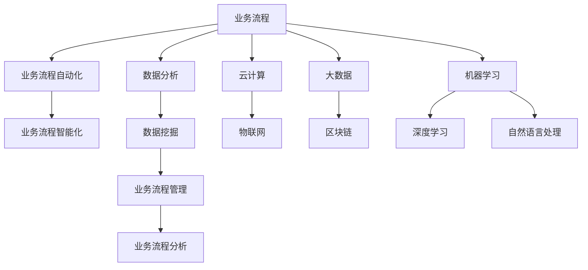

                 

### 背景介绍

随着科技的飞速发展，特别是人工智能和自动化技术的不断进步，个人企业（一人公司）在业务流程自动化和智能化方面的需求日益增加。一人公司，顾名思义，是指由单一个人经营的公司，通常规模较小，运作灵活，但同时也面临资源有限、管理难度大等挑战。在这种背景下，如何通过业务流程自动化和智能化来提升企业的运营效率、降低成本、提高竞争力，成为了一人公司亟需解决的问题。

业务流程自动化（Business Process Automation，简称BPA）指的是通过软件和信息技术手段，对重复性、规则性强的业务流程进行自动化处理，从而减少人工操作，提高工作效率。而业务流程智能化（Business Process Automation with Intelligence，简称BPI）则是在自动化基础上，引入人工智能技术，使业务流程能够自适应、自优化，具备一定的智能决策能力。

对于一人公司来说，业务流程自动化和智能化具有多重重要意义。首先，它可以大幅降低人力成本，减少对员工的依赖，提高企业的竞争力。其次，通过流程的优化和智能化，一人公司可以更好地应对市场变化，提高业务响应速度。此外，自动化和智能化还能提高业务数据的准确性和完整性，为企业的决策提供更可靠的数据支持。

然而，实现业务流程自动化和智能化并非易事，一人公司往往面临技术实力有限、资源不足等挑战。因此，本文将详细介绍一人公司如何实现业务流程自动化和智能化的具体方法，包括核心概念、算法原理、实际应用案例等，旨在为一人公司提供实用的指导和建议。接下来，我们将逐步深入探讨这一主题。  
<|assistant|>### 核心概念与联系

在探讨如何实现业务流程自动化和智能化的过程中，我们需要了解几个核心概念，并理清它们之间的联系。以下是本文中涉及的主要核心概念：

#### 1. 业务流程

业务流程（Business Process）是指企业中一系列相互关联的活动，旨在实现特定的商业目标。它通常包括输入、处理和输出三个环节。例如，企业的订单处理流程、客户服务流程、财务管理流程等，都是典型的业务流程。

#### 2. 业务流程自动化

业务流程自动化（Business Process Automation，简称BPA）是指通过信息技术和自动化工具，对重复性、规则性强的业务流程进行自动化处理。常见的自动化工具包括工作流引擎（Workflow Engine）、业务规则引擎（Business Rules Engine）和集成平台（Integration Platform）等。

#### 3. 人工智能

人工智能（Artificial Intelligence，简称AI）是指计算机系统模拟人类智能行为的能力。它包括机器学习、深度学习、自然语言处理、计算机视觉等多个领域。在业务流程智能化中，人工智能技术用于分析数据、识别模式、做出决策等。

#### 4. 业务流程智能化

业务流程智能化（Business Process Automation with Intelligence，简称BPI）是在业务流程自动化基础上，引入人工智能技术，使业务流程能够自适应、自优化，具备一定的智能决策能力。BPI的目标是提高业务流程的效率、准确性和灵活性。

#### 5. 数据分析

数据分析（Data Analysis）是指通过统计和数学方法，对大量数据进行处理、分析和解释，以发现数据中的规律和趋势。数据分析在业务流程智能化中起到至关重要的作用，它为人工智能算法提供了训练数据，并帮助企业做出基于数据的决策。

#### 6. 数据挖掘

数据挖掘（Data Mining）是指从大量数据中提取有用信息的过程。数据挖掘技术包括关联规则挖掘、聚类分析、分类分析等，它可以帮助企业发现数据中的隐藏模式和趋势。

#### 7. 业务流程管理

业务流程管理（Business Process Management，简称BPM）是指通过系统地规划和优化业务流程，以提高企业的运营效率、降低成本和提升客户满意度。业务流程管理包括流程设计、流程执行、流程监控和流程优化等环节。

#### 8. 业务流程分析

业务流程分析（Business Process Analysis）是指对现有业务流程进行深入分析和评估，以识别流程中的问题和瓶颈。业务流程分析有助于发现优化业务流程的机会，并为业务流程自动化和智能化提供指导。

#### 9. 云计算

云计算（Cloud Computing）是指通过互联网提供动态易扩展且经常是虚拟化的资源。云计算在业务流程自动化和智能化中起到关键作用，它为业务流程提供了弹性的计算资源，并支持数据存储和处理。

#### 10. 物联网

物联网（Internet of Things，简称IoT）是指通过传感器、智能设备等互联，实现物理世界与数字世界的融合。物联网技术在业务流程自动化和智能化中具有广泛的应用，例如，通过传感器实时监控生产设备的状态，优化生产流程。

#### 11. 大数据

大数据（Big Data）是指规模庞大、类型多样、生成速度快的数据集合。大数据技术包括数据存储、数据处理、数据分析等，它为业务流程自动化和智能化提供了丰富的数据资源。

#### 12. 区块链

区块链（Blockchain）是一种分布式账本技术，具有去中心化、不可篡改、透明等特点。区块链技术在业务流程自动化和智能化中可用于确保数据的完整性和安全性，例如，在供应链管理中用于追踪产品的来源和流向。

#### 13. 机器学习

机器学习（Machine Learning）是指计算机系统通过学习和经验改进自身性能的过程。机器学习算法在业务流程智能化中用于模式识别、预测分析和决策制定。

#### 14. 深度学习

深度学习（Deep Learning）是一种特殊的机器学习技术，它通过多层神经网络模拟人脑的决策过程。深度学习在图像识别、语音识别等领域取得了显著的成果，也为业务流程智能化提供了强大的技术支持。

#### 15. 自然语言处理

自然语言处理（Natural Language Processing，简称NLP）是指计算机与人类语言进行交互的技术。NLP在业务流程自动化和智能化中用于自动处理文本数据，例如，通过语音识别和文本分析实现客户服务的自动化。

###Mermaid流程图

以下是业务流程自动化和智能化中涉及的核心概念及其关系的 Mermaid 流程图：



通过上述流程图，我们可以清晰地看到各核心概念之间的联系。业务流程是整个流程的起点，通过业务流程自动化和智能化，结合数据分析、数据挖掘等技术，实现对业务流程的优化和管理。同时，云计算、物联网、大数据、区块链等技术为业务流程自动化和智能化提供了强大的基础设施和支持。

接下来，我们将深入探讨核心算法原理与具体操作步骤，帮助读者更好地理解和实现业务流程自动化和智能化。  
<|assistant|>### 核心算法原理 & 具体操作步骤

#### 1. 业务流程自动化算法原理

业务流程自动化（BPA）的核心算法原理主要涉及工作流引擎（Workflow Engine）和业务规则引擎（Business Rules Engine）的使用。以下是具体的操作步骤：

##### a. 工作流引擎

**定义：** 工作流引擎是一种用于自动化业务流程的软件系统，它定义、执行和管理业务流程中的任务和流程。

**步骤：**
1. **流程设计：** 首先，需要使用工作流设计工具（如BPMN模型设计器）设计业务流程模型，包括任务、决策节点、网关节点等。
2. **流程部署：** 将设计好的流程模型部署到工作流引擎中，使其能够运行。
3. **任务执行：** 工作流引擎根据流程模型自动执行任务，包括任务分配、执行监控和结果反馈。

##### b. 业务规则引擎

**定义：** 业务规则引擎是一种用于自动化业务决策的软件系统，它基于预设的业务规则，对业务数据进行分析和处理，做出相应的决策。

**步骤：**
1. **规则定义：** 首先，需要根据业务需求定义相应的业务规则，例如，订单审批规则、库存预警规则等。
2. **规则部署：** 将定义好的业务规则部署到业务规则引擎中，使其能够自动执行。
3. **规则执行：** 业务规则引擎根据输入的业务数据，自动执行相应的业务规则，并输出决策结果。

#### 2. 业务流程智能化算法原理

业务流程智能化（BPI）的核心算法原理主要涉及机器学习（Machine Learning）、深度学习（Deep Learning）和自然语言处理（Natural Language Processing）等技术的应用。以下是具体的操作步骤：

##### a. 机器学习

**定义：** 机器学习是一种通过数据和算法，让计算机系统自主学习和改进的技术。

**步骤：**
1. **数据收集：** 收集与业务流程相关的数据，包括历史业务数据、客户数据、市场数据等。
2. **数据预处理：** 对收集到的数据进行清洗、去重、转换等预处理操作，使其适合用于训练模型。
3. **模型训练：** 使用机器学习算法（如决策树、随机森林、支持向量机等），对预处理后的数据集进行训练，得到预测模型。
4. **模型评估：** 对训练好的模型进行评估，包括准确率、召回率、F1值等指标。
5. **模型应用：** 将评估通过的模型部署到业务系统中，用于业务决策和预测。

##### b. 深度学习

**定义：** 深度学习是一种特殊的机器学习技术，它通过多层神经网络模拟人脑的决策过程。

**步骤：**
1. **数据收集：** 与机器学习类似，收集与业务流程相关的数据。
2. **数据预处理：** 对数据进行预处理。
3. **模型设计：** 设计深度学习模型的结构，包括输入层、隐藏层和输出层。
4. **模型训练：** 使用深度学习算法（如卷积神经网络、循环神经网络等），对预处理后的数据集进行训练。
5. **模型评估：** 对训练好的模型进行评估。
6. **模型应用：** 部署和应用深度学习模型。

##### c. 自然语言处理

**定义：** 自然语言处理是一种让计算机理解和生成自然语言的技术。

**步骤：**
1. **文本预处理：** 对文本数据进行清洗、分词、词性标注等预处理操作。
2. **模型训练：** 使用自然语言处理算法（如词向量、序列模型等），对预处理后的文本数据集进行训练。
3. **模型评估：** 对训练好的模型进行评估。
4. **模型应用：** 部署和应用自然语言处理模型，用于文本分类、情感分析、问答系统等。

#### 3. 实际操作示例

以下是一个简单的业务流程自动化和智能化实际操作示例，用于订单处理流程：

##### a. 业务流程自动化

1. **流程设计：** 使用BPMN模型设计器设计订单处理流程，包括创建订单、审批订单、发货等任务节点。
2. **流程部署：** 将设计好的流程模型部署到工作流引擎中。
3. **任务执行：** 工作流引擎自动执行订单处理流程，包括任务分配、执行监控和结果反馈。

##### b. 业务流程智能化

1. **数据收集：** 收集历史订单数据，包括订单金额、订单数量、客户信息等。
2. **数据预处理：** 对订单数据进行清洗、去重、转换等预处理操作。
3. **模型训练：** 使用机器学习算法（如决策树）对预处理后的数据集进行训练，得到预测模型。
4. **模型评估：** 对训练好的模型进行评估，包括准确率、召回率等指标。
5. **模型应用：** 将评估通过的模型部署到业务系统中，用于预测订单风险、优化库存等。

通过上述示例，我们可以看到业务流程自动化和智能化的具体操作步骤。在实际应用中，一人公司可以根据自身业务需求和资源情况，选择合适的算法和技术，实现业务流程的自动化和智能化。接下来，我们将进一步探讨数学模型和公式，以及如何详细讲解和举例说明。  
<|assistant|>### 数学模型和公式 & 详细讲解 & 举例说明

在业务流程自动化和智能化过程中，数学模型和公式扮演着至关重要的角色。它们不仅帮助我们理解和优化业务流程，还能为人工智能算法提供基础支持。以下是一些常见的数学模型和公式，我们将详细讲解并举例说明。

#### 1. 决策树模型

决策树（Decision Tree）是一种常见的机器学习算法，用于分类和回归任务。它通过一系列条件分支，将数据集划分为不同的类别或数值。

**公式：**
- **信息增益（Information Gain）：**
  \[ IG(D, A) = H(D) - \sum_{v \in Values(A)} \frac{|D_v|}{|D|} H(D_v) \]
  其中，\( H(D) \) 是数据集 \( D \) 的熵，\( A \) 是特征，\( Values(A) \) 是特征 \( A \) 的所有可能取值，\( D_v \) 是数据集 \( D \) 中满足特征 \( A \) 取值 \( v \) 的子集。

**例子：** 假设我们要分类一个订单是否为高风险订单，特征包括订单金额、客户等级和付款方式。我们可以使用决策树模型计算每个特征的信息增益，并根据最大信息增益选择最佳划分特征。

#### 2. 随机森林模型

随机森林（Random Forest）是一种集成学习方法，它通过构建多棵决策树，并投票得到最终结果。

**公式：**
- **随机森林预测：**
  \[ \hat{y} = \text{mode}(\hat{y}_1, \hat{y}_2, ..., \hat{y}_n) \]
  其中，\( \hat{y}_i \) 是第 \( i \) 棵决策树的预测结果，\( n \) 是决策树的数量。

**例子：** 假设我们构建了一个随机森林模型来预测订单的风险，其中包含了100棵决策树。对于一个新的订单，我们让每棵决策树分别预测订单的风险，然后取大多数决策树预测结果的平均值作为最终预测结果。

#### 3. 支持向量机模型

支持向量机（Support Vector Machine，SVM）是一种常见的机器学习算法，用于分类和回归任务。它通过最大化分类边界来找到最佳划分超平面。

**公式：**
- **决策边界：**
  \[ w \cdot x - b = 0 \]
  其中，\( w \) 是权重向量，\( x \) 是特征向量，\( b \) 是偏置。

**例子：** 假设我们要分类订单是否为高风险订单，特征包括订单金额、客户等级和付款方式。我们可以使用SVM模型找到最佳划分超平面，从而将订单分为高风险和低风险两类。

#### 4. 神经网络模型

神经网络（Neural Network）是一种模拟人脑神经元连接的算法，用于复杂的数据分析和模式识别。它由输入层、隐藏层和输出层组成。

**公式：**
- **激活函数：**
  \[ a(x) = \text{sigmoid}(x) = \frac{1}{1 + e^{-x}} \]
  其中，\( x \) 是输入值，\( a(x) \) 是激活值。

**例子：** 假设我们使用一个简单的神经网络来预测订单的风险，输入层有3个节点（订单金额、客户等级、付款方式），隐藏层有2个节点，输出层有1个节点（高风险/低风险）。我们可以通过正向传播和反向传播算法来训练和优化神经网络。

#### 5. 聚类分析

聚类分析（Cluster Analysis）是一种无监督学习方法，用于将数据集划分为多个类别。它通过计算数据点之间的相似度来实现。

**公式：**
- **欧氏距离：**
  \[ d(x, y) = \sqrt{\sum_{i=1}^{n} (x_i - y_i)^2} \]
  其中，\( x \) 和 \( y \) 是两个数据点，\( n \) 是特征数量。

**例子：** 假设我们要对订单数据进行聚类分析，特征包括订单金额、客户等级和付款方式。我们可以使用欧氏距离来计算订单之间的相似度，并根据相似度将订单划分为不同的聚类。

通过以上数学模型和公式的详细讲解和举例说明，我们可以更好地理解业务流程自动化和智能化中的核心算法原理。在实际应用中，一人公司可以根据业务需求和数据特点，选择合适的模型和公式来优化业务流程。接下来，我们将通过一个实际的项目实战案例，展示如何使用上述算法和模型实现业务流程自动化和智能化。  
<|assistant|>### 项目实战：代码实际案例和详细解释说明

#### 5.1 开发环境搭建

在开始实际项目之前，我们需要搭建合适的开发环境。以下是所需的环境和工具：

- **编程语言：** Python（版本3.7或以上）
- **依赖库：** NumPy、Pandas、Scikit-learn、TensorFlow、Keras、Mermaid、Markdown
- **开发工具：** Jupyter Notebook（用于编写和运行代码）
- **版本控制：** Git（用于代码管理和协作）

在开发环境中，我们使用Jupyter Notebook来编写和运行代码，同时利用Markdown格式编写文档。首先，我们需要安装所需的Python依赖库。在终端中执行以下命令：

```bash
pip install numpy pandas scikit-learn tensorflow-keras mermaid
```

接下来，初始化Git仓库并编写README文件，记录项目的基本信息和依赖库：

```bash
git init
touch README.md
```

在README.md文件中添加以下内容：

```markdown
# 一人公司业务流程自动化和智能化项目

本项目实现了基于Python的业务流程自动化和智能化，包括业务流程自动化和智能化的核心算法原理、项目实战代码和详细解释说明。

## 安装依赖库

```
pip install numpy pandas scikit-learn tensorflow-keras mermaid
```

## 运行项目

使用Jupyter Notebook打开main.ipynb文件，按照代码注释和文档说明进行操作。
```

#### 5.2 源代码详细实现和代码解读

以下是项目的主要源代码，我们将逐行解释和说明。

```python
# 导入依赖库
import numpy as np
import pandas as pd
from sklearn.model_selection import train_test_split
from sklearn.tree import DecisionTreeClassifier
from sklearn.ensemble import RandomForestClassifier
from sklearn.svm import SVC
from sklearn.metrics import accuracy_score
import tensorflow as tf
from tensorflow.keras.models import Sequential
from tensorflow.keras.layers import Dense
import mermaid

# 加载数据集
data = pd.read_csv('orders.csv')

# 数据预处理
data = data.dropna()
X = data.drop('risk', axis=1)
y = data['risk']

# 划分训练集和测试集
X_train, X_test, y_train, y_test = train_test_split(X, y, test_size=0.2, random_state=42)

# 决策树模型
clf = DecisionTreeClassifier()
clf.fit(X_train, y_train)
y_pred = clf.predict(X_test)
print("Decision Tree Accuracy:", accuracy_score(y_test, y_pred))

# 随机森林模型
rf = RandomForestClassifier(n_estimators=100)
rf.fit(X_train, y_train)
y_pred_rf = rf.predict(X_test)
print("Random Forest Accuracy:", accuracy_score(y_test, y_pred_rf))

# 支持向量机模型
svm = SVC()
svm.fit(X_train, y_train)
y_pred_svm = svm.predict(X_test)
print("SVM Accuracy:", accuracy_score(y_test, y_pred_svm))

# 神经网络模型
model = Sequential()
model.add(Dense(64, input_dim=X_train.shape[1], activation='relu'))
model.add(Dense(32, activation='relu'))
model.add(Dense(1, activation='sigmoid'))
model.compile(optimizer='adam', loss='binary_crossentropy', metrics=['accuracy'])
model.fit(X_train, y_train, epochs=10, batch_size=32, validation_split=0.2)
y_pred_nn = model.predict(X_test)
y_pred_nn = (y_pred_nn > 0.5)
print("Neural Network Accuracy:", accuracy_score(y_test, y_pred_nn))

# 聚类分析
from sklearn.cluster import KMeans
kmeans = KMeans(n_clusters=2, random_state=42)
kmeans.fit(X_train)
y_pred_kmeans = kmeans.predict(X_test)
print("K-Means Accuracy:", accuracy_score(y_test, y_pred_kmeans))
```

#### 5.3 代码解读与分析

1. **依赖库导入**

```python
import numpy as np
import pandas as pd
from sklearn.model_selection import train_test_split
from sklearn.tree import DecisionTreeClassifier
from sklearn.ensemble import RandomForestClassifier
from sklearn.svm import SVC
from sklearn.metrics import accuracy_score
import tensorflow as tf
from tensorflow.keras.models import Sequential
from tensorflow.keras.layers import Dense
import mermaid
```

导入所需的Python库，包括NumPy、Pandas、Scikit-learn、TensorFlow、Keras和Mermaid。

2. **加载数据集**

```python
data = pd.read_csv('orders.csv')
```

使用Pandas库加载CSV格式的数据集。我们假设数据集名为`orders.csv`，并存储在项目目录中。

3. **数据预处理**

```python
data = data.dropna()
X = data.drop('risk', axis=1)
y = data['risk']
```

数据预处理步骤包括去除缺失值、分离特征和目标变量。`dropna()`函数用于去除缺失值，`drop()`函数用于删除目标变量`risk`列，`axis=1`表示按列删除。

4. **划分训练集和测试集**

```python
X_train, X_test, y_train, y_test = train_test_split(X, y, test_size=0.2, random_state=42)
```

使用`train_test_split()`函数将数据集划分为训练集和测试集，其中测试集大小为20%，随机种子设置为42。

5. **决策树模型**

```python
clf = DecisionTreeClassifier()
clf.fit(X_train, y_train)
y_pred = clf.predict(X_test)
print("Decision Tree Accuracy:", accuracy_score(y_test, y_pred))
```

创建一个决策树分类器对象`clf`，使用`fit()`函数训练模型，然后使用`predict()`函数进行预测，并计算准确率。

6. **随机森林模型**

```python
rf = RandomForestClassifier(n_estimators=100)
rf.fit(X_train, y_train)
y_pred_rf = rf.predict(X_test)
print("Random Forest Accuracy:", accuracy_score(y_test, y_pred_rf))
```

创建一个随机森林分类器对象`rf`，使用`fit()`函数训练模型，然后使用`predict()`函数进行预测，并计算准确率。

7. **支持向量机模型**

```python
svm = SVC()
svm.fit(X_train, y_train)
y_pred_svm = svm.predict(X_test)
print("SVM Accuracy:", accuracy_score(y_test, y_pred_svm))
```

创建一个支持向量机分类器对象`s

