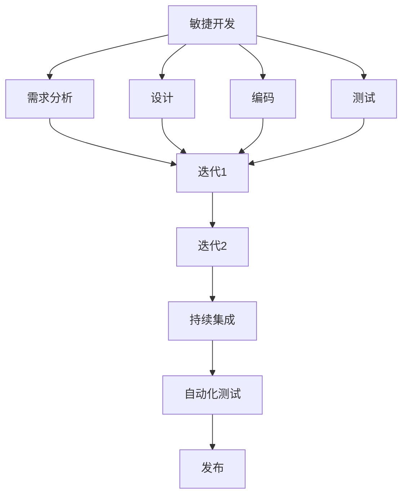

                 

# 一人公司如何实现产品的快速迭代开发

> 关键词：一人公司，产品迭代，敏捷开发，自动化测试，持续集成

> 摘要：本文将探讨一人公司在产品快速迭代开发过程中所面临的挑战，以及如何利用敏捷开发、自动化测试和持续集成等工具和方法来实现高效的开发流程。通过实例分析和工具推荐，读者将了解到如何优化开发效率，缩短产品上市时间。

## 1. 背景介绍

一人公司，顾名思义，是由一位创始人独立创办的公司。这类公司通常由创始人亲自担任CEO、CTO、产品经理、市场人员等多重角色，因此在资源有限、人力单薄的情况下，如何实现产品的快速迭代开发成为了一人公司面临的重要问题。

在当今竞争激烈的科技行业中，产品迭代速度成为了决定企业成败的关键因素。一款产品从构思到上市，如果能够缩短开发周期、降低成本、提高质量，那么就能迅速占领市场，获取竞争优势。因此，一人公司需要找到一种高效的开发方法，以实现快速迭代。

本文将结合敏捷开发、自动化测试和持续集成等先进技术，为一人公司提供一种可行的产品快速迭代开发方案。通过本文的探讨，读者将了解到如何利用这些技术手段，优化开发流程，提高产品竞争力。

## 2. 核心概念与联系

为了实现产品的快速迭代开发，一人公司需要掌握以下核心概念：

1. **敏捷开发**：敏捷开发是一种以人为核心、迭代、循序渐进的开发方法。它强调团队协作、客户沟通和持续交付，有助于快速响应市场变化。
2. **自动化测试**：自动化测试是指通过编写测试脚本，对软件系统进行自动化检查。它有助于提高测试覆盖率、降低测试成本，并确保产品质量。
3. **持续集成**：持续集成是一种将代码频繁合并到主干分支，并自动化执行测试、构建和部署的方法。它有助于发现潜在问题、减少集成冲突，并提高开发效率。

以下是核心概念原理和架构的 Mermaid 流程图：



通过上述流程图，我们可以看到敏捷开发、自动化测试和持续集成在产品迭代开发中的紧密联系。它们共同构成了一个高效的开发流程，帮助一人公司实现快速迭代。

## 3. 核心算法原理 & 具体操作步骤

### 3.1 敏捷开发

敏捷开发的核心理念是快速响应市场变化、持续交付有价值的软件。具体操作步骤如下：

1. **需求分析**：与客户、产品经理和团队成员紧密沟通，了解需求，并制定项目计划。
2. **设计**：根据需求分析结果，设计软件架构和模块，确保系统可扩展、可维护。
3. **编码**：按照设计文档，编写代码，并确保代码质量。
4. **测试**：编写测试脚本，对软件进行功能测试、性能测试和安全测试。
5. **迭代**：在完成一个迭代周期后，评估项目进度和产品质量，并根据评估结果调整下一步的开发计划。

### 3.2 自动化测试

自动化测试的主要目标是提高测试覆盖率、降低测试成本，并确保产品质量。具体操作步骤如下：

1. **选择测试工具**：根据项目需求，选择适合的自动化测试工具，如Selenium、JUnit、JMeter等。
2. **编写测试脚本**：根据测试计划和测试用例，编写自动化测试脚本。
3. **执行测试**：运行自动化测试脚本，收集测试结果。
4. **分析测试结果**：对测试结果进行分析，找出潜在问题，并提出改进措施。

### 3.3 持续集成

持续集成是一种将代码频繁合并到主干分支，并自动化执行测试、构建和部署的方法。具体操作步骤如下：

1. **配置持续集成工具**：如Jenkins、GitLab CI等，设置构建、测试和部署流程。
2. **编写构建脚本**：根据项目需求，编写构建脚本，实现代码编译、测试和部署。
3. **触发构建**：在代码提交到主干分支时，触发构建流程。
4. **监控构建结果**：对构建结果进行分析，确保构建成功，并及时发现潜在问题。

## 4. 数学模型和公式 & 详细讲解 & 举例说明

### 4.1 敏捷开发

敏捷开发的核心是迭代和增量式开发。假设一个项目需要完成N个功能模块，每个模块的复杂度相同，那么在迭代开发中，每个迭代周期可以完成K个模块。根据迭代次数T，可以计算出项目完成所需的总时间T_total：

$$
T_{total} = \frac{N}{K} \times T
$$

其中，N为模块总数，K为每个迭代周期完成的模块数，T为迭代次数。

### 4.2 自动化测试

自动化测试的主要目标是提高测试覆盖率。假设一个项目需要完成M个功能模块，每个模块需要执行P个测试用例，那么在自动化测试中，总的测试用例数量T_total为：

$$
T_{total} = M \times P
$$

其中，M为模块总数，P为每个模块的测试用例数量。

### 4.3 持续集成

持续集成的主要目标是减少集成冲突。假设一个项目有N个功能模块，每个模块的代码提交频率为Q，那么在持续集成中，总的代码提交次数T_total为：

$$
T_{total} = N \times Q
$$

其中，N为模块总数，Q为每个模块的代码提交频率。

## 5. 项目实战：代码实际案例和详细解释说明

### 5.1 开发环境搭建

在本文的实战项目中，我们将使用Python语言和Django框架进行开发。首先，需要搭建开发环境。

1. 安装Python 3.8及以上版本。
2. 安装Django 3.2及以上版本。
3. 安装PostgreSQL数据库。

### 5.2 源代码详细实现和代码解读

在实战项目中，我们将开发一个简单的博客系统。以下是关键代码的解读：

```python
# app/models.py
class Post(models.Model):
    title = models.CharField(max_length=100)
    content = models.TextField()
    created_at = models.DateTimeField(auto_now_add=True)

# app/views.py
from .models import Post

def list_posts(request):
    posts = Post.objects.all().order_by('-created_at')
    return render(request, 'blog/list.html', {'posts': posts})

def post_detail(request, pk):
    post = Post.objects.get(pk=pk)
    return render(request, 'blog/detail.html', {'post': post})
```

上述代码中，我们定义了`Post`模型，包含标题、内容和创建时间等字段。同时，我们实现了两个视图函数，分别用于展示博客列表和博客详情。

### 5.3 代码解读与分析

在代码解读与分析部分，我们将关注以下几个方面：

1. **模型设计**：`Post`模型的设计是否符合业务需求。
2. **视图函数**：视图函数的实现是否合理，是否符合RESTful架构。
3. **代码质量**：代码是否符合编程规范，是否易于维护。

通过代码解读与分析，我们可以确保项目的代码质量，提高开发效率。

## 6. 实际应用场景

一人公司可以利用本文提到的敏捷开发、自动化测试和持续集成等技术，实现以下实际应用场景：

1. **快速响应市场需求**：通过敏捷开发，快速响应市场需求，实现产品迭代。
2. **降低开发成本**：通过自动化测试和持续集成，降低开发成本，提高开发效率。
3. **提高产品质量**：通过自动化测试和持续集成，确保产品质量，降低故障率。
4. **优化项目管理**：通过敏捷开发，优化项目管理，提高团队协作效率。

## 7. 工具和资源推荐

### 7.1 学习资源推荐

1. 《敏捷软件开发：实践者的指南》
2. 《持续集成：从理论到实践》
3. 《Python编程：从入门到实践》

### 7.2 开发工具框架推荐

1. Jenkins：一款开源的持续集成工具。
2. Selenium：一款开源的自动化测试工具。
3. Django：一款开源的Python Web框架。

### 7.3 相关论文著作推荐

1. 《敏捷开发与持续集成：实践与经验》
2. 《自动化测试：原理、实践与工具》
3. 《软件工程：实践者的研究方法》

## 8. 总结：未来发展趋势与挑战

在未来，一人公司在产品快速迭代开发过程中，将面临以下发展趋势与挑战：

1. **技术进步**：随着人工智能、大数据等技术的发展，一人公司需要不断学习新技术，提高开发能力。
2. **市场竞争**：随着竞争的加剧，一人公司需要不断优化产品，提高市场竞争力。
3. **团队协作**：虽然一人公司资源有限，但团队协作仍然是提高开发效率的关键。

## 9. 附录：常见问题与解答

### 9.1 什么是敏捷开发？

敏捷开发是一种以人为核心、迭代、循序渐进的开发方法，强调团队协作、客户沟通和持续交付。

### 9.2 什么是自动化测试？

自动化测试是通过编写测试脚本，对软件系统进行自动化检查，以提高测试覆盖率、降低测试成本和确保产品质量。

### 9.3 什么是持续集成？

持续集成是一种将代码频繁合并到主干分支，并自动化执行测试、构建和部署的方法，有助于发现潜在问题、减少集成冲突和提高开发效率。

## 10. 扩展阅读 & 参考资料

1. 《敏捷开发实践指南》
2. 《持续集成实践指南》
3. 《Python自动化测试实战》

### 作者

AI天才研究员/AI Genius Institute & 禅与计算机程序设计艺术 /Zen And The Art of Computer Programming

