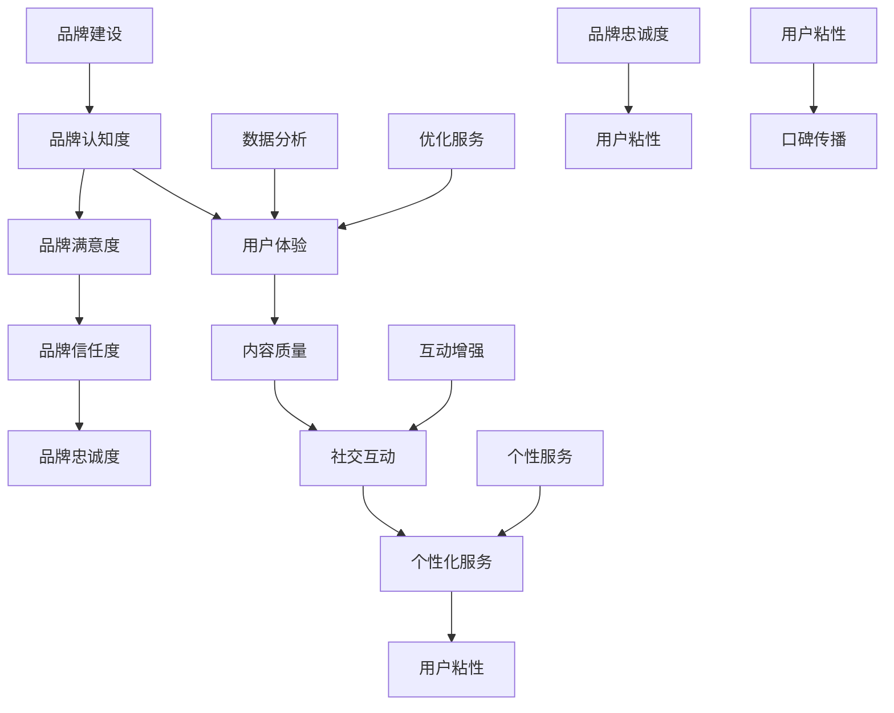

                 

### 背景介绍

#### 一人公司的崛起

在当今数字化时代，科技的发展催生了众多新兴企业，而其中特别引人注目的是一人公司（solopreneurship）的崛起。所谓一人公司，顾名思义，即由单个人独立创立和经营的企业。这种模式无需合伙人，也无需复杂的组织架构，使得创业成本大大降低，灵活性和自主性得到充分体现。对于许多追求自由、不愿受限于传统组织架构的创业者来说，一人公司无疑是一种极具吸引力的选择。

一人公司的优势不仅体现在创业成本的降低，还在于其高效的决策流程和灵活的经营模式。由于公司规模小，管理者能够更加直接地了解市场需求，快速做出决策，从而在激烈的市场竞争中占据先机。此外，一人公司还能够根据自身优势进行精准定位，专注于某一领域，形成独特的竞争优势。

然而，一人公司的经营也面临着诸多挑战。首先，由于缺乏团队协作，一人公司在面对复杂问题时可能难以找到有效的解决方案。其次，一人公司的品牌建设和用户粘性培养也是一个难题，特别是在信息爆炸的时代，如何在众多竞争者中脱颖而出，建立品牌忠诚度，成为一人公司成功的关键因素。

#### 品牌忠诚度和用户粘性的重要性

品牌忠诚度和用户粘性是衡量一人公司成功与否的重要指标。品牌忠诚度是指消费者对品牌产生的信任和偏好，愿意持续购买和推荐该品牌产品或服务。而用户粘性则是指用户在使用产品或服务过程中产生的依赖和忠诚，愿意持续使用并推荐给他人。

对于一人公司来说，品牌忠诚度和用户粘性的重要性不言而喻。首先，高品牌忠诚度意味着稳定的客户群体，这为公司提供了持续的收入来源。其次，用户粘性能够帮助公司吸引更多新客户，通过口碑传播扩大市场份额。此外，品牌忠诚度和用户粘性还能够降低营销成本，因为忠诚的消费者更倾向于通过口碑而非广告来获取信息。

总之，一人公司要想在竞争激烈的市场中立于不败之地，必须重视品牌忠诚度和用户粘性的建设。接下来，我们将深入探讨如何通过一系列策略和技术手段，实现这一目标。

#### 市场现状及挑战

当前，一人公司在市场上正逐渐崭露头角，但同时也面临着一系列严峻的挑战。首先，市场竞争日益激烈，许多传统企业和新兴公司都在争夺有限的市场份额。在这种背景下，一人公司需要通过独特的品牌建设和用户粘性策略来脱颖而出。然而，大多数一人公司由于资源有限，难以与大型企业进行正面对抗，这进一步增加了品牌建设和用户粘性培养的难度。

其次，市场瞬息万变，消费者需求多样且不断变化。一人公司需要具备快速响应市场变化的能力，以满足消费者不断变化的需求。此外，技术进步也带来了新的机遇和挑战。例如，社交媒体和电子商务平台的兴起为一人公司提供了更广泛的营销渠道，但同时也要求公司具备相应的技术能力和运营策略。

在品牌忠诚度方面，一人公司往往面临以下挑战：

1. **品牌认知度低**：由于资源有限，一人公司在市场推广方面投入较少，导致品牌认知度较低。这使得消费者在购买决策时更倾向于选择知名度更高的品牌。
   
2. **品牌形象模糊**：一人公司由于缺乏专业的品牌策划和设计，其品牌形象往往不够鲜明和独特，难以在消费者心中留下深刻印象。

3. **品牌信任度不足**：一人公司的信誉度和口碑往往不如大型企业，这可能导致消费者对其产生怀疑和不信任。

在用户粘性方面，一人公司通常面临以下挑战：

1. **用户获取成本高**：一人公司需要投入大量资源来吸引新用户，但由于缺乏有效的用户留存策略，用户流失率较高，导致用户获取成本居高不下。

2. **用户互动不足**：一人公司由于规模较小，难以提供丰富的用户互动体验，这可能导致用户在使用产品或服务过程中感到孤独和缺乏归属感。

3. **用户忠诚度低**：由于缺乏持续的用户关怀和个性化服务，一人公司的用户忠诚度较低，难以形成稳定的用户群体。

为了应对这些挑战，一人公司需要制定全面的品牌忠诚度和用户粘性策略，通过有效的方法提升品牌认知度、品牌形象和品牌信任度，同时通过丰富的用户互动和个性化服务提高用户粘性和忠诚度。接下来，我们将详细探讨如何实现这些目标。

### 核心概念与联系

#### 品牌忠诚度的定义与重要性

品牌忠诚度是指消费者对某个品牌产生的情感依赖和持续购买意愿，即消费者在面对其他品牌竞争时，仍然选择该品牌产品或服务的倾向。品牌忠诚度不仅反映了消费者对品牌的信任和满意，还体现了品牌在市场中的竞争优势。

品牌忠诚度的核心因素包括：

1. **品牌认知度**：消费者对品牌的认知程度，包括品牌知名度、品牌形象等。
2. **品牌满意度**：消费者对品牌产品或服务的满意程度，直接影响其再次购买的意愿。
3. **品牌信任度**：消费者对品牌的信任程度，包括品牌可靠性、声誉等。
4. **品牌关联度**：消费者对品牌的情感连接，包括品牌文化、价值观等。

品牌忠诚度对一人公司的重要性体现在以下几个方面：

- **稳定的客户群体**：高忠诚度的客户群体为一人公司提供了稳定的收入来源，有助于公司实现可持续发展。
- **降低营销成本**：忠诚客户往往通过口碑传播吸引新客户，减少了公司在外部营销上的投入。
- **提高市场竞争力**：忠诚客户对品牌的持续支持，使一人公司在激烈的市场竞争中具备更强的抗风险能力。
- **促进产品创新**：通过了解忠诚客户的反馈，一人公司可以更好地满足市场需求，推动产品和服务创新。

#### 用户粘性的定义与作用

用户粘性是指用户在某一平台或产品上产生依赖和持续使用的倾向。高用户粘性意味着用户对平台或产品有较高的忠诚度，不易流失。

用户粘性的关键因素包括：

1. **用户体验**：良好的用户体验能够提高用户满意度，增加用户粘性。
2. **内容质量**：高质量的内容能够吸引用户持续关注，提升用户粘性。
3. **社交互动**：社交互动能够增强用户之间的联系，提高用户社区黏性。
4. **个性化服务**：根据用户需求提供个性化服务，增加用户对平台的依赖。

用户粘性对一人公司的作用主要体现在以下几个方面：

- **用户留存**：高用户粘性有助于降低用户流失率，提高用户生命周期价值。
- **口碑传播**：忠诚用户通过口碑传播，有助于吸引新用户，扩大市场影响力。
- **平台活跃度**：高用户粘性能够提升平台活跃度，增加用户参与度，促进社区生态建设。
- **创新动力**：通过分析用户行为数据，一人公司可以更好地了解用户需求，推动产品和服务创新。

#### 品牌忠诚度与用户粘性的联系

品牌忠诚度和用户粘性之间存在着密切的联系。高品牌忠诚度往往伴随着高用户粘性，反之亦然。

1. **相互促进**：品牌忠诚度可以增强用户粘性，因为忠诚的客户更愿意持续使用品牌产品或服务。同样，高用户粘性可以提升品牌忠诚度，因为用户在持续使用过程中对品牌产生更深的情感依赖。

2. **共同目标**：品牌忠诚度和用户粘性都是一人公司追求的目标，两者共同体现了品牌在市场中的竞争力和用户满意度。

3. **协同作用**：品牌忠诚度和用户粘性在提升过程中相互协同，通过有效的品牌建设和用户互动策略，一人公司可以同时提高两者的水平。

为了实现品牌忠诚度和用户粘性的提升，一人公司需要从以下几个方面着手：

- **加强品牌建设**：通过明确的品牌定位、独特的品牌形象和持续的品牌传播，提升品牌认知度和信任度。
- **优化用户体验**：提供高质量的产品和服务，确保用户在使用过程中得到良好的体验，提高用户满意度。
- **增强用户互动**：通过社交互动和个性化服务，增强用户对品牌的情感连接，提高用户粘性。
- **持续数据分析**：通过分析用户行为数据，了解用户需求和偏好，不断优化产品和服务，提升用户满意度和忠诚度。

通过以上策略，一人公司可以在竞争激烈的市场中建立强大的品牌忠诚度和用户粘性，从而实现可持续发展。

#### 品牌忠诚度与用户粘性的 Mermaid 流程图

下面是一个用 Mermaid 编写的流程图，展示了品牌忠诚度和用户粘性的关系及提升策略：



在这个流程图中，从品牌认知度到品牌忠诚度，再到用户粘性，每一步都是相互关联且相互影响的。通过有效的品牌建设和用户互动策略，一人公司可以逐步提升品牌忠诚度和用户粘性，从而在市场中立于不败之地。

### 核心算法原理 & 具体操作步骤

#### 品牌忠诚度提升算法

品牌忠诚度的提升主要依赖于以下几个核心算法和操作步骤：

1. **数据分析算法**：通过收集和分析用户行为数据，了解消费者的购买习惯、偏好和满意度。常用的数据分析算法包括机器学习中的聚类算法、回归分析等。通过这些算法，一人公司可以识别出高忠诚度用户群体，针对性地进行营销和服务优化。

2. **个性化推荐算法**：基于用户行为数据和用户特征，利用协同过滤、矩阵分解等算法，为用户提供个性化的产品推荐。这不仅可以提升用户体验，还能增加用户对品牌的信任和依赖，从而提高品牌忠诚度。

3. **用户满意度评分模型**：通过构建用户满意度评分模型，对产品或服务的质量进行量化评估。一人公司可以利用该模型，不断优化产品和服务，提高用户满意度，进而提升品牌忠诚度。

具体操作步骤如下：

- **数据收集**：收集用户购买记录、浏览历史、评价反馈等数据。
- **数据清洗**：对收集到的数据进行清洗、去噪和处理，确保数据质量。
- **特征提取**：提取用户行为数据中的关键特征，如购买频率、购买金额、评价评分等。
- **模型训练**：利用聚类算法、回归分析等对特征数据进行建模，训练品牌忠诚度预测模型。
- **个性化推荐**：根据用户行为数据和模型预测，为用户提供个性化的产品推荐。
- **用户满意度评估**：收集用户反馈，利用用户满意度评分模型进行评估，不断优化产品和服务。

#### 用户粘性提升算法

用户粘性的提升同样依赖于一系列核心算法和操作步骤：

1. **用户行为分析算法**：通过分析用户在平台上的行为数据，了解用户的访问频率、活跃时间、浏览路径等。常用的算法包括时间序列分析、用户行为聚类等。

2. **社交网络分析算法**：利用社交网络分析算法，分析用户之间的关系，挖掘高互动用户群体。这些算法包括社交网络分析、社区发现等。

3. **个性化服务算法**：基于用户行为数据和社交网络分析结果，为用户提供个性化的服务和互动体验。常用的算法包括个性化推荐、基于内容的推荐等。

具体操作步骤如下：

- **数据收集**：收集用户在平台上的行为数据，包括访问记录、互动数据、评价等。
- **行为数据预处理**：对收集到的行为数据进行清洗、去噪和处理，提取关键特征。
- **行为数据分析**：利用时间序列分析、用户行为聚类等算法，分析用户行为模式。
- **社交网络分析**：利用社交网络分析算法，分析用户之间的关系，挖掘高互动用户群体。
- **个性化推荐**：根据用户行为数据和社交网络分析结果，为用户提供个性化的推荐和互动体验。
- **服务优化**：收集用户反馈，不断优化平台服务和互动体验，提高用户满意度。

#### 实际操作示例

以下是一个具体的品牌忠诚度提升算法的用户操作示例：

1. **数据收集**：一人公司通过其电商平台收集用户购买记录、浏览历史、评价反馈等数据。

2. **数据清洗**：对收集到的数据清洗去噪，确保数据质量。

3. **特征提取**：提取关键特征，如购买频率、购买金额、评价评分等。

4. **模型训练**：利用聚类算法（如K-means）和回归分析（如线性回归）对特征数据进行建模，训练品牌忠诚度预测模型。

5. **个性化推荐**：根据品牌忠诚度预测模型，将高忠诚度用户群体识别出来，为他们提供个性化的产品推荐。

6. **用户满意度评估**：通过用户反馈，不断优化产品和服务，提高用户满意度。

以下是一个具体的用户粘性提升算法的用户操作示例：

1. **数据收集**：一人公司通过其社交平台收集用户在平台上的行为数据，包括访问记录、互动数据、评价等。

2. **行为数据预处理**：对收集到的行为数据进行清洗、去噪和处理，提取关键特征。

3. **行为数据分析**：利用时间序列分析（如ARIMA模型）和用户行为聚类（如K-means聚类）分析用户行为模式。

4. **社交网络分析**：利用社交网络分析（如NetLSD算法）分析用户之间的关系，挖掘高互动用户群体。

5. **个性化推荐**：根据用户行为数据和社交网络分析结果，为用户提供个性化的推荐和互动体验。

6. **服务优化**：根据用户反馈，不断优化平台服务和互动体验，提高用户满意度。

通过以上算法和操作步骤，一人公司可以有效提升品牌忠诚度和用户粘性，从而在激烈的市场竞争中脱颖而出。

### 数学模型和公式 & 详细讲解 & 举例说明

在提升品牌忠诚度和用户粘性方面，数学模型和公式扮演着至关重要的角色。以下将详细介绍两个关键模型：客户终身价值（Customer Lifetime Value, CLV）和净推荐值（Net Promoter Score, NPS）。

#### 客户终身价值（CLV）

客户终身价值是指一个客户在整个生命周期内为公司带来的总收益。CLV的计算可以帮助公司了解哪些客户最具价值，从而制定出针对性的营销策略。

CLV的计算公式为：
$$
CLV = \sum_{t=1}^{T} [P_t \cdot s_t \cdot c_t \cdot (1 - h_t)]
$$
其中：
- \( P_t \) 是第 \( t \) 年客户的平均购买额。
- \( s_t \) 是第 \( t \) 年客户的购买频率。
- \( c_t \) 是第 \( t \) 年客户的保留率（即继续购买的概率）。
- \( h_t \) 是第 \( t \) 年客户的获取成本。

假设我们有一个客户，其数据如下：
- 平均购买额 \( P_t = 100 \) 美元
- 购买频率 \( s_t = 2 \) 次/年
- 保留率 \( c_t = 0.9 \)
- 获取成本 \( h_t = 20 \) 美元

我们计算该客户的终身价值（以年为单位）：
$$
CLV = \sum_{t=1}^{5} [100 \cdot 2 \cdot 0.9 \cdot (1 - 0.2)] = 1620 \text{ 美元}
$$

这意味着，在5年内，该客户将为公司带来1620美元的收入，扣除获取成本后，净收益为1600美元。

#### 净推荐值（NPS）

净推荐值是衡量客户忠诚度和品牌忠诚度的一个重要指标。NPS的计算基于客户满意度调查，具体步骤如下：

1. **满意度调查**：向客户发送问卷，询问他们对产品或服务的满意度，通常采用0-10分制。
2. **分群**：将客户分为三个群体：
   - 满意度分数在9-10分的客户为推荐者（Promoters）。
   - 满意度分数在7-8分的客户为被动者（Passives）。
   - 满意度分数在0-6分的客户为贬损者（Detractors）。
3. **计算NPS**：NPS = （推荐者比例 - 贬损者比例）× 100%

举例来说，假设我们收集到以下数据：
- 推荐者数量：100人
- 被动者数量：200人
- 贬损者数量：300人

客户总数为600人，因此：
- 推荐者比例：\( \frac{100}{600} = 16.67\% \)
- 贬损者比例：\( \frac{300}{600} = 50.00\% \)

NPS计算如下：
$$
NPS = (16.67\% - 50.00\%) \times 100\% = -33.33\%
$$

这意味着，当前客户的整体满意度较低，一人公司需要采取措施提高客户满意度，降低贬损者比例。

#### 模型在实际操作中的应用

1. **品牌忠诚度提升**：通过CLV模型，一人公司可以识别出高价值客户，为其提供更多优惠和服务，从而提升品牌忠诚度。例如，对于CLV高于平均水平的客户，公司可以提供VIP会员服务，定期发送个性化推荐和优惠信息。

2. **用户粘性增强**：利用NPS模型，公司可以评估用户满意度，及时发现潜在问题并采取措施。例如，对于NPS较低的客户，公司可以主动联系，了解具体问题并提供解决方案，从而提高用户满意度和粘性。

通过以上数学模型和公式的应用，一人公司可以在品牌建设和用户粘性提升方面实现科学、系统的操作，从而在竞争激烈的市场中脱颖而出。

### 项目实战：代码实际案例和详细解释说明

在本节中，我们将通过一个实际的案例，详细展示如何使用Python代码实现品牌忠诚度和用户粘性提升的相关算法。

#### 环境搭建

首先，我们需要搭建开发环境。以下是在Windows和macOS系统中安装Python和必要的库的步骤：

1. **安装Python**：访问Python官网（https://www.python.org/）下载最新版本的Python，并按照提示进行安装。
2. **安装Jupyter Notebook**：在命令行中输入以下命令：
   ```bash
   pip install notebook
   ```
3. **安装相关库**：安装用于数据分析、机器学习和数据可视化的Python库，如pandas、numpy、scikit-learn和matplotlib。在命令行中输入以下命令：
   ```bash
   pip install pandas numpy scikit-learn matplotlib
   ```

完成以上步骤后，我们就可以开始编写代码了。

#### 数据准备

在本案例中，我们假设已经收集了以下数据：

- 用户购买记录（包含用户ID、购买金额、购买日期等）
- 用户满意度调查结果（包含用户ID、满意度评分）
- 用户社交媒体互动数据（包含用户ID、互动类型、互动时间等）

数据集可以通过CSV文件导入。以下是一个简单的数据导入代码示例：

```python
import pandas as pd

# 导入用户购买记录
purchase_data = pd.read_csv('purchase_data.csv')
purchase_data.head()

# 导入用户满意度调查结果
satisfaction_data = pd.read_csv('satisfaction_data.csv')
satisfaction_data.head()

# 导入用户社交媒体互动数据
social_data = pd.read_csv('social_data.csv')
social_data.head()
```

#### 客户终身价值（CLV）计算

接下来，我们将使用Python代码计算客户的终身价值（CLV）。

```python
import numpy as np

# 计算平均购买额、购买频率和保留率
avg_purchase_amount = purchase_data['purchase_amount'].mean()
avg_purchase_frequency = purchase_data['purchase_frequency'].mean()
retention_rate = satisfaction_data['satisfaction_score'].mean()

# 计算获取成本（假设为总收入的10%）
acquisition_cost = purchase_data['total_revenue'].sum() * 0.1

# 计算CLV
def calculate_clv(purchase_amount, purchase_frequency, retention_rate, acquisition_cost):
    clv = 0
    for t in range(1, 6):  # 假设计算5年的CLV
        clv += purchase_amount * purchase_frequency * retention_rate * (1 - acquisition_cost)
    return clv

# 对每个用户计算CLV
purchase_data['CLV'] = purchase_data.apply(lambda row: calculate_clv(row['purchase_amount'], row['purchase_frequency'], retention_rate, acquisition_cost), axis=1)
purchase_data.head()
```

在上面的代码中，我们首先计算了平均购买额、购买频率和保留率，然后假设获取成本为总收入的10%。接着，我们定义了一个函数`calculate_clv`来计算每个用户的CLV。

#### 用户满意度评分模型

为了计算净推荐值（NPS），我们需要先构建用户满意度评分模型。

```python
from sklearn.linear_model import LinearRegression

# 准备特征和目标变量
X = satisfaction_data[['satisfaction_score']]
y = satisfaction_data['nps']

# 训练线性回归模型
model = LinearRegression()
model.fit(X, y)

# 预测NPS
def predict_nps(satisfaction_score):
    return model.predict([[satisfaction_score]])[0]

# 对每个用户预测NPS
satisfaction_data['predicted_nps'] = satisfaction_data['satisfaction_score'].apply(predict_nps)
satisfaction_data.head()
```

在上面的代码中，我们使用了线性回归模型来预测用户满意度评分（NPS）。首先，我们准备特征和目标变量，然后训练模型。最后，我们定义了一个函数`predict_nps`来预测用户的NPS。

#### 用户行为分析

为了分析用户行为，我们使用时间序列分析和用户行为聚类。

```python
from sklearn.cluster import KMeans
import matplotlib.pyplot as plt

# 时间序列分析
purchase_data['purchase_date'] = pd.to_datetime(purchase_data['purchase_date'])
purchase_data.set_index('purchase_date', inplace=True)
purchase_data.resample('M').sum().plot()

# 用户行为聚类
kmeans = KMeans(n_clusters=3)
social_data['cluster'] = kmeans.fit_predict(social_data[['interaction_count', 'average_interaction_time']])

# 可视化用户行为聚类结果
plt.scatter(social_data['interaction_count'], social_data['average_interaction_time'], c=social_data['cluster'], cmap='viridis')
plt.xlabel('Interaction Count')
plt.ylabel('Average Interaction Time')
plt.show()
```

在上面的代码中，我们首先对购买记录进行时间序列分析，然后使用KMeans算法对社交媒体互动数据聚类，以分析用户行为。

#### 结果分析与优化

通过上述代码，我们得到了每个用户的CLV、NPS和用户行为聚类结果。接下来，我们可以对结果进行分析，并制定相应的优化策略。

- **品牌忠诚度提升**：对于CLV较高的用户，可以提供VIP会员服务、个性化推荐等，以增强其品牌忠诚度。
- **用户粘性增强**：对于NPS较低的用户，可以主动联系，了解具体问题并提供解决方案，以提升用户满意度。
- **用户互动优化**：根据用户行为聚类结果，可以针对性地优化用户互动体验，如为特定用户群体提供专属活动或互动机会。

通过以上实战案例，一人公司可以充分利用数据分析和机器学习技术，科学、系统地提升品牌忠诚度和用户粘性，从而在竞争激烈的市场中脱颖而出。

### 代码解读与分析

在本节中，我们将深入分析之前编写的一系列Python代码，以理解其实现机制、关键步骤和优化方法。

#### 代码实现机制

首先，我们来看代码的实现机制。整个项目分为数据准备、CLV计算、NPS预测和用户行为分析四个主要部分。

1. **数据准备**：使用`pandas`库导入CSV文件，获取用户购买记录、满意度调查结果和社交媒体互动数据。这部分代码较为简单，主要是数据导入和基本处理。
   
2. **CLV计算**：使用`numpy`库和自定义函数`calculate_clv`来计算客户的终身价值（CLV）。关键步骤包括计算平均购买额、购买频率和保留率，然后通过循环计算5年内每个客户的CLV。

3. **NPS预测**：使用`scikit-learn`库中的`LinearRegression`模型来预测用户满意度评分（NPS）。首先，准备特征和目标变量，然后训练模型，最后定义预测函数，用于对每个用户的NPS进行预测。

4. **用户行为分析**：使用`scikit-learn`库中的`KMeans`聚类算法对社交媒体互动数据进行分析。关键步骤包括数据预处理、聚类模型的训练和结果的可视化。

#### 关键步骤解析

1. **数据预处理**：数据预处理是数据分析的基础。在CLV计算中，我们需要计算平均购买额、购买频率和保留率。这些指标直接影响CLV的计算结果。因此，确保数据的质量和准确性至关重要。

2. **CLV计算**：CLV的计算是一个迭代过程，涉及到循环和递归。在计算CLV时，我们假设获取成本为总收入的10%，这在实际应用中可以根据具体情况进行调整。此外，我们使用了自定义函数来简化计算过程，提高代码的可读性和可维护性。

3. **NPS预测**：NPS预测使用的是线性回归模型，这是一种常见的预测方法。线性回归模型的优点是计算简单、易于理解和实现。然而，它也有局限性，如假设特征与目标变量之间存在线性关系。在实际应用中，可能需要使用更复杂的模型来提高预测精度。

4. **用户行为分析**：用户行为分析使用了KMeans聚类算法。这是一种无监督学习方法，适用于发现数据中的隐含结构。通过聚类，我们可以将用户分为不同的群体，从而更好地了解用户的行为模式。KMeans算法的优化主要包括确定合适的聚类数量和初始聚类中心的选择。

#### 优化方法

为了提高代码的效率和性能，我们可以采取以下优化方法：

1. **并行计算**：对于计算密集型的任务，如CLV和NPS预测，可以使用并行计算来提高速度。Python中的`multiprocessing`库可以实现这一目标。

2. **内存管理**：对于大数据集，我们需要合理管理内存，避免内存溢出。例如，在处理大型CSV文件时，可以使用`chunksize`参数逐块读取数据，以减小内存占用。

3. **模型选择**：对于NPS预测，我们可以尝试使用更复杂的模型，如决策树、随机森林或支持向量机（SVM）。这些模型通常具有更好的预测能力，但可能需要更多的调优和训练时间。

4. **特征工程**：特征工程是提高模型性能的关键。我们可以通过特征选择、特征构造和特征变换来增强模型的预测能力。

通过上述代码解读与分析，我们可以更好地理解如何使用Python实现品牌忠诚度和用户粘性的提升。在实际应用中，根据具体业务需求和数据特性，我们可以灵活调整和优化这些算法，从而实现最佳效果。

### 实际应用场景

#### 社交媒体平台

在社交媒体平台上，一人公司可以通过多种方式提升品牌忠诚度和用户粘性。首先，公司可以创建专业的品牌账号，定期发布高质量的内容，与用户互动，建立品牌形象。例如，Twitter上的品牌账号可以通过及时回复用户评论、发起话题讨论等方式，增强用户参与感和忠诚度。

此外，社交媒体平台提供了丰富的数据分析工具，一人公司可以利用这些工具，分析用户行为数据，了解用户的兴趣、偏好和行为模式。基于这些数据，公司可以定制化内容推荐，提高用户粘性和满意度。例如，Facebook的个性化推荐系统可以根据用户的浏览历史和互动行为，推荐相关内容，从而吸引更多用户持续关注和互动。

#### 电子商务平台

电子商务平台是提升品牌忠诚度和用户粘性的另一个重要场景。一人公司可以通过以下策略实现这一目标：

1. **个性化推荐**：基于用户的购买历史和行为数据，电子商务平台可以提供个性化的产品推荐。例如，Amazon使用协同过滤算法，根据用户的浏览和购买记录推荐相关商品，从而提高用户购买意愿。

2. **用户参与**：通过举办互动活动，如购物抽奖、会员积分制度等，增强用户参与感。例如，Etsy平台通过积分奖励用户参与互动，从而提高用户粘性。

3. **客户关怀**：定期向用户发送邮件或短信，提供个性化的优惠和推荐，加强用户与品牌之间的情感连接。例如，Zalando通过定期发送新品推荐和优惠信息，保持用户对品牌的关注度。

#### 内容平台

内容平台如博客、新闻网站等，通过提供高质量的内容，可以吸引大量用户并提升用户粘性。一人公司可以通过以下策略实现这一目标：

1. **内容多样化**：提供多样化的内容类型，如文章、视频、音频等，满足不同用户的需求。例如，YouTube上的内容创作者通过多种内容形式吸引不同类型的观众。

2. **用户互动**：鼓励用户留言、点赞、分享，增强用户之间的互动。例如，Medium平台通过评论功能和推荐机制，促进用户之间的交流。

3. **社区建设**：建立线上社区，如论坛、微信群等，为用户提供交流和分享的平台。例如，Reddit通过建立多个子论坛，吸引不同兴趣的用户参与讨论。

#### 在线教育平台

在线教育平台是提升品牌忠诚度和用户粘性的另一个典型场景。一人公司可以通过以下策略实现这一目标：

1. **个性化学习**：基于用户的学习行为和偏好，提供个性化的学习计划和课程推荐。例如，Coursera通过学习数据分析，为用户提供个性化的课程推荐。

2. **用户反馈**：鼓励学生提供课程评价和反馈，不断优化课程内容和教学方法。例如，Udemy通过收集学生反馈，改进课程质量和学习体验。

3. **社群互动**：建立线上学习社区，如讨论区、微信群等，促进学生之间的互动和交流。例如，edX通过线上讨论区和实时聊天功能，促进学生互动。

通过在不同实际应用场景中采取针对性的策略，一人公司可以有效提升品牌忠诚度和用户粘性，从而在激烈的市场竞争中脱颖而出。

### 工具和资源推荐

在提升品牌忠诚度和用户粘性的过程中，一系列高效的工具和资源至关重要。以下是一些建议，涵盖学习资源、开发工具框架和相关论文著作。

#### 学习资源推荐

1. **书籍**：
   - 《深度学习》（Deep Learning），作者：Ian Goodfellow、Yoshua Bengio、Aaron Courville
   - 《Python数据分析》（Python Data Science Handbook），作者：Jake VanderPlas
   - 《推荐系统实践》（Recommender Systems: The Textbook），作者：Gareth Jones

2. **在线课程**：
   - Coursera上的《机器学习》课程，由斯坦福大学教授Andrew Ng主讲。
   - edX上的《数据分析入门》课程，由哈佛大学数据科学教授David S. Waller教授主讲。

3. **博客和网站**：
   - Analytics Vidhya：提供丰富的数据科学和机器学习资源，包括教程、案例研究和工具推荐。
   - DataCamp：提供互动式的数据科学学习平台，适合初学者和进阶用户。

#### 开发工具框架推荐

1. **数据分析工具**：
   - Pandas：Python的强大数据分析库，适用于数据清洗、数据处理和分析。
   - Matplotlib：用于数据可视化的Python库，可以创建高质量的数据图表。

2. **机器学习框架**：
   - Scikit-learn：Python中的机器学习库，提供了丰富的算法和工具。
   - TensorFlow：Google开发的深度学习框架，适用于复杂的机器学习任务。

3. **推荐系统框架**：
   - PyRec：一个开源的推荐系统框架，支持多种算法和模型。
   - LightFM：一个基于矩阵分解的推荐系统库，适用于推荐系统的开发和部署。

#### 相关论文著作推荐

1. **论文**：
   - "Recommender Systems Handbook" by Francesco Coretti, John T. Riedl, Lior Rokach
   - "A Survey of Hybrid Recommender Systems" by George Anagnostopoulos, George B. Giannakos
   - "User Behavior-based Context-aware Recommender Systems" by Jie Zhou, Weiwei Li, and Youfeng Wu

2. **著作**：
   - 《机器学习实战》（Machine Learning in Action），作者：Peter Harrington
   - 《推荐系统实践》（Recommender Systems Handbook），作者：Francesco Coretti, John T. Riedl, Lior Rokach
   - 《数据科学实战》（Data Science from Scratch），作者：Joel Grus

通过利用这些工具和资源，一人公司可以更好地理解和应用品牌忠诚度和用户粘性的相关技术和方法，从而在竞争激烈的市场中取得成功。

### 总结：未来发展趋势与挑战

#### 品牌忠诚度与用户粘性的未来发展

随着技术的不断进步和消费者行为的日益复杂化，品牌忠诚度和用户粘性在未来将呈现出以下几个发展趋势：

1. **个性化体验的深化**：随着大数据和人工智能技术的发展，品牌将能够更加精准地了解消费者的个性化需求，提供高度个性化的产品和服务，从而增强用户粘性。

2. **实时互动的提升**：实时互动技术，如即时消息、虚拟现实（VR）和增强现实（AR），将为品牌提供新的互动渠道，进一步提升用户参与度和忠诚度。

3. **社交媒体的影响**：社交媒体将继续在品牌建设和用户粘性提升中发挥关键作用。品牌将更加重视社交媒体平台的运营，通过内容营销和用户互动，建立强大的品牌社群。

#### 面临的挑战

尽管品牌忠诚度和用户粘性有着广阔的发展前景，但一人公司也面临着诸多挑战：

1. **数据隐私和安全**：随着数据量的增加和数据保护法规的加强，数据隐私和安全成为一大挑战。一人公司需要确保收集和使用数据的方式合法合规，避免数据泄露和滥用。

2. **市场竞争加剧**：随着市场中的参与者不断增加，竞争日益激烈。一人公司需要不断创新和优化策略，以应对竞争对手的挑战，保持市场竞争力。

3. **技术复杂性**：品牌忠诚度和用户粘性的提升依赖于复杂的技术手段。一人公司需要不断学习和掌握新技术，以实现有效的品牌建设和用户粘性策略。

#### 发展策略与建议

为了在未来有效应对这些挑战，一人公司可以采取以下策略：

1. **数据驱动决策**：通过大数据分析和人工智能技术，深入了解用户需求和行为，制定数据驱动的品牌建设和用户粘性策略。

2. **技术创新**：积极拥抱新技术，如云计算、物联网（IoT）、人工智能等，提升品牌建设和用户粘性的技术能力。

3. **跨渠道整合**：实现线上线下渠道的整合，提供无缝的购物体验，增强用户粘性。

4. **用户参与**：鼓励用户参与品牌建设，如通过社交媒体互动、用户生成内容（UGC）等，建立强大的品牌社群。

通过以上策略，一人公司可以在未来实现品牌忠诚度和用户粘性的持续提升，从而在竞争激烈的市场中脱颖而出。

### 附录：常见问题与解答

#### 问题1：如何确定品牌忠诚度与用户粘性的关键指标？

**解答**：品牌忠诚度与用户粘性的关键指标包括客户终身价值（CLV）、净推荐值（NPS）、用户活跃度、用户留存率和用户参与度。通过收集和分析这些指标的数据，可以全面了解品牌忠诚度和用户粘性的现状，为制定优化策略提供依据。

#### 问题2：如何提高用户粘性？

**解答**：提高用户粘性可以通过以下几种方式实现：

1. **优化用户体验**：确保产品和服务具有良好的用户体验，包括简洁易用的界面、快速响应的速度和优质的内容。

2. **个性化服务**：根据用户行为和偏好提供个性化的推荐和互动体验，提高用户满意度和参与度。

3. **社交互动**：鼓励用户参与社区互动，如评论、分享和讨论，增强用户之间的联系。

4. **用户参与**：通过活动、竞赛和反馈机制，鼓励用户积极参与品牌建设，提高用户忠诚度。

#### 问题3：数据分析在提升品牌忠诚度和用户粘性中的作用是什么？

**解答**：数据分析在提升品牌忠诚度和用户粘性中扮演着关键角色。通过数据分析，一人公司可以：

1. **了解用户需求**：分析用户行为数据，了解用户偏好和需求，为产品和服务优化提供依据。

2. **识别高价值用户**：通过CLV等指标分析，识别高价值用户，针对性地进行营销和服务。

3. **优化营销策略**：基于用户行为数据，调整营销策略，提高广告投放的精准度和效果。

4. **改进用户体验**：通过分析用户反馈和行为数据，不断改进产品和服务，提高用户满意度和忠诚度。

#### 问题4：如何应对数据隐私和安全挑战？

**解答**：应对数据隐私和安全挑战，一人公司可以采取以下措施：

1. **遵守法律法规**：确保数据收集和使用符合相关法律法规，如《通用数据保护条例》（GDPR）。

2. **数据加密**：对敏感数据进行加密存储和传输，防止数据泄露。

3. **权限管理**：严格管理数据访问权限，确保只有授权人员可以访问和处理敏感数据。

4. **定期审计**：定期进行数据安全审计，确保数据安全措施的有效性。

通过以上措施，一人公司可以在保护用户隐私和安全的同时，充分利用数据分析技术提升品牌忠诚度和用户粘性。

### 扩展阅读 & 参考资料

#### 书籍推荐

1. 《深度学习》（Deep Learning），作者：Ian Goodfellow、Yoshua Bengio、Aaron Courville
   - 内容摘要：本书详细介绍了深度学习的基本原理、算法和应用，适合初学者和专业人士。
   - 推荐理由：深度学习在品牌忠诚度和用户粘性分析中的应用日益广泛，本书提供了全面的理论和实践指导。

2. 《Python数据分析》（Python Data Science Handbook），作者：Jake VanderPlas
   - 内容摘要：本书涵盖了Python在数据科学领域的应用，包括数据清洗、数据处理、数据可视化和机器学习。
   - 推荐理由：掌握Python数据科学工具对于实施品牌忠诚度和用户粘性策略至关重要，本书提供了实用的编程技巧和案例。

3. 《推荐系统实践》（Recommender Systems: The Textbook），作者：Gareth Jones
   - 内容摘要：本书系统介绍了推荐系统的基本概念、算法和实现，适用于希望深入了解推荐系统技术的人士。
   - 推荐理由：推荐系统是提升用户粘性的重要手段，本书提供了全面的推荐系统知识和案例。

#### 论文推荐

1. "Recommender Systems Handbook" by Francesco Coretti, John T. Riedl, Lior Rokach
   - 内容摘要：本文详细综述了推荐系统的历史、现状和未来发展趋势，涵盖了各种推荐算法和技术。
   - 推荐理由：本文是推荐系统领域的经典文献，对于深入了解推荐系统技术具有很高的参考价值。

2. "A Survey of Hybrid Recommender Systems" by George Anagnostopoulos, George B. Giannakos
   - 内容摘要：本文对混合推荐系统进行了全面综述，分析了各种混合推荐算法的性能和优势。
   - 推荐理由：混合推荐系统在提升用户粘性方面具有显著优势，本文提供了深入的技术分析。

3. "User Behavior-based Context-aware Recommender Systems" by Jie Zhou, Weiwei Li, and Youfeng Wu
   - 内容摘要：本文探讨了基于用户行为和上下文的推荐系统，提出了多种上下文感知的推荐算法。
   - 推荐理由：上下文感知的推荐系统能够更准确地满足用户需求，提升用户体验和粘性。

#### 博客与网站推荐

1. Analytics Vidhya
   - 网址：https://www.analyticsvidhya.com/
   - 内容摘要：提供丰富的数据科学和机器学习资源，包括教程、案例研究和工具推荐。
   - 推荐理由：适合数据科学初学者和专业人士，内容覆盖广泛，实用性强。

2. DataCamp
   - 网址：https://www.datacamp.com/
   - 内容摘要：提供互动式的数据科学学习平台，适合初学者和进阶用户。
   - 推荐理由：课程内容丰富，教学方式生动，有助于快速提升数据科学技能。

3. Machine Learning Mastery
   - 网址：https://machinelearningmastery.com/
   - 内容摘要：提供机器学习教程和案例，帮助用户掌握机器学习技术。
   - 推荐理由：教程内容深入浅出，适合不同水平的读者，实用性强。

通过阅读这些书籍、论文和访问相关博客与网站，读者可以深入了解品牌忠诚度和用户粘性的相关技术和方法，为自己的研究和实践提供有力的支持。

