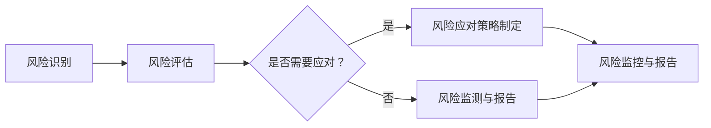

                 

# 一人公司如何建立有效的供应链风险管理

## 引言

在当今这个高度全球化的商业环境中，供应链管理已成为企业运营成功的关键因素。对于一人公司而言，尽管规模较小，但供应链风险管理依然至关重要。有效的供应链风险管理不仅能帮助企业降低成本，提高效率，还能确保企业在面对市场波动、供应商风险等不可预见因素时，能够灵活应对，保持业务的连续性和稳定性。

本文旨在为一人公司提供一套系统化的供应链风险管理框架，帮助其识别潜在风险、制定应对策略，并确保供应链的稳健运行。我们将从背景介绍、核心概念与联系、核心算法原理、数学模型和公式、项目实战、实际应用场景、工具和资源推荐等多个角度进行深入探讨，以期为您在供应链风险管理方面提供切实可行的指导。

## 背景介绍

### 供应链风险的定义与分类

供应链风险是指在供应链运营过程中，由于内部或外部因素导致的供应链中断、延误、成本增加等问题。供应链风险可以按照不同的维度进行分类，如按风险性质可以分为：

1. **供应链中断风险**：由于自然灾害、社会事件、政治动荡等因素导致的供应链中断。
2. **供应风险**：由于供应商自身问题（如资金短缺、产能不足、质量不符合要求等）导致的供应链问题。
3. **需求风险**：由于市场需求波动、客户需求变化等因素导致的供应链问题。
4. **成本风险**：由于物流成本、库存成本等上涨导致的供应链成本增加。

### 一人公司的供应链特点与挑战

对于一人公司来说，供应链管理的挑战主要集中在以下几个方面：

1. **资源有限**：一人公司通常资源有限，无法像大型企业那样在供应链上投入大量的人力、物力和财力。
2. **供应链简化**：由于规模较小，一人公司的供应链通常相对简化，供应链节点较少，但这也使得风险更容易集中。
3. **信息不对称**：一人公司往往无法获得完整的供应链信息，尤其是在与供应商合作时，信息不对称可能会导致决策失误。
4. **灵活性要求高**：一人公司需要快速响应市场变化，灵活性要求较高，但这也增加了供应链管理的难度。

### 供应链风险管理的重要性

尽管一人公司的规模较小，但供应链风险管理仍然至关重要。以下是供应链风险管理的重要性：

1. **确保业务连续性**：通过有效的风险管理，一人公司可以确保在面临供应链中断等突发情况时，业务能够继续运作。
2. **降低成本**：通过优化供应链流程、降低库存成本、提高物流效率等手段，一人公司可以有效降低运营成本。
3. **提高客户满意度**：稳定的供应链可以提高产品交付速度和产品质量，从而提高客户满意度。
4. **增强市场竞争力**：有效的供应链风险管理可以帮助一人公司在激烈的市场竞争中保持优势。

### 一人公司供应链风险管理的现状

目前，许多一人公司对供应链风险管理的重视程度逐渐提高，但实际操作中仍存在一些问题：

1. **风险管理意识不足**：部分一人公司对供应链风险管理的认识不足，缺乏系统化的风险管理策略。
2. **缺乏专业人才**：一人公司通常缺乏专业的供应链管理人才，难以应对复杂的供应链问题。
3. **技术手段有限**：一人公司可能在技术手段和工具上存在限制，无法全面监控供应链的运行状况。
4. **应对策略不完善**：一些一人公司在面对供应链风险时，缺乏有效的应对策略，导致风险扩大。

综上所述，一人公司在供应链风险管理方面既面临挑战，也具有巨大的潜在收益。接下来，我们将深入探讨供应链风险管理的核心概念与联系，帮助一人公司建立有效的风险管理框架。

## 核心概念与联系

### 供应链风险管理的基本原则

在建立有效的供应链风险管理框架之前，首先需要理解供应链风险管理的基本原则。以下是一些核心原则：

1. **预防为主**：预防风险的发生比在风险发生后进行补救更为重要。一人公司应注重预防措施的制定和实施。
2. **全面性**：供应链风险管理应覆盖供应链的各个环节，包括供应商选择、采购、库存管理、物流配送等。
3. **动态性**：供应链风险是动态变化的，一人公司应持续监控供应链的运行状况，及时调整风险管理策略。
4. **合作性**：供应链风险管理需要供应商、客户、物流服务商等各方的合作，共同应对供应链风险。

### 供应链风险管理的关键环节

供应链风险管理的关键环节包括：

1. **风险评估**：对供应链各个环节进行风险评估，识别潜在风险。
2. **风险监测**：实时监控供应链的运行状况，及时发现风险迹象。
3. **风险应对**：制定并实施应对策略，减轻或消除风险的影响。
4. **风险回顾**：对风险管理过程进行回顾，总结经验教训，持续改进。

### 供应链风险管理的具体流程

供应链风险管理的具体流程可以分为以下几个步骤：

1. **风险识别**：通过问卷调查、访谈、文献调研等方式，识别供应链各个环节的风险。
2. **风险评估**：对识别出的风险进行定性或定量评估，确定风险的重要性和发生概率。
3. **风险应对策略制定**：根据风险评估结果，制定相应的风险应对策略，如风险规避、风险转移、风险减轻等。
4. **风险监控与报告**：建立风险监控机制，定期收集和分析风险数据，及时报告风险状况。
5. **风险回顾与改进**：对风险管理过程进行回顾，总结经验教训，持续改进风险管理策略。

### 供应链风险管理与业务目标的关系

供应链风险管理不仅要保护企业的财务和运营安全，还要支持企业的业务目标。具体来说，供应链风险管理与业务目标的关系体现在以下几个方面：

1. **成本控制**：通过优化供应链流程、降低库存成本、提高物流效率等手段，实现成本控制，从而支持企业的盈利目标。
2. **服务质量**：通过确保供应链的稳定运行，提高产品的交付速度和产品质量，从而提升客户满意度，支持企业的市场目标。
3. **供应链效率**：通过优化供应链管理，提高供应链的运作效率，从而支持企业的运营目标。

### 供应链风险管理与企业管理体系的关系

供应链风险管理是企业整体管理体系的重要组成部分。良好的供应链风险管理有助于提升企业的整体管理水平，具体体现在以下几个方面：

1. **战略规划**：供应链风险管理是战略规划的重要组成部分，有助于企业制定科学的供应链战略。
2. **流程优化**：通过供应链风险管理，企业可以识别并优化供应链各个环节的流程，提高运营效率。
3. **组织协调**：供应链风险管理需要各相关部门的紧密合作，有助于提升企业的组织协调能力。
4. **信息共享**：供应链风险管理需要企业内部及与外部合作伙伴的信息共享，有助于提升企业的信息管理水平。

### 供应链风险管理框架

为了更好地实现供应链风险管理，一人公司可以建立一个系统化的供应链风险管理框架，包括以下几个方面：

1. **风险管理组织**：建立专门的供应链风险管理团队，负责风险管理策略的制定和实施。
2. **风险管理流程**：制定详细的供应链风险管理流程，包括风险识别、评估、应对、监控和回顾等环节。
3. **风险指标体系**：建立风险指标体系，用于监控供应链的运行状况，评估风险管理的有效性。
4. **风险应对策略**：制定具体的风险应对策略，包括风险规避、风险转移、风险减轻等。
5. **风险监控与报告**：建立风险监控机制，定期收集和分析风险数据，及时报告风险状况。

### 核心概念原理和架构的 Mermaid 流程图

以下是一个简化的供应链风险管理流程的 Mermaid 流程图，展示供应链风险管理的关键环节和流程：



通过这个流程图，我们可以清晰地看到供应链风险管理的主要环节和它们之间的逻辑关系。

### 核心概念与联系总结

通过上述内容，我们可以看到供应链风险管理涉及多个核心概念和环节，包括风险管理原则、关键环节、具体流程、与业务目标的关系、与企业管理体系的关系以及供应链风险管理框架等。这些概念和环节构成了一个系统化的供应链风险管理体系，为一人公司提供了有效的风险管理工具和方法。

在下一部分，我们将深入探讨供应链风险管理的核心算法原理和具体操作步骤，帮助一人公司更好地理解和实施供应链风险管理。

## 核心算法原理 & 具体操作步骤

在供应链风险管理中，核心算法原理和具体操作步骤是确保风险管理有效性的关键。以下我们将详细讨论供应链风险管理的核心算法原理，以及如何在实际操作中应用这些原理。

### 风险评估算法原理

风险评估是供应链风险管理中的第一步，也是至关重要的一步。通过风险评估，我们可以识别潜在的供应链风险，并对其进行量化分析，以便制定相应的应对策略。

**1. 蒙特卡洛模拟算法**

蒙特卡洛模拟算法是一种基于概率论和统计学的数值计算方法，通过模拟大量随机事件来估计某个系统或过程的概率分布。在供应链风险管理中，蒙特卡洛模拟算法可以用于评估供应链中断风险的概率和影响。

**算法步骤：**

- **步骤1：确定随机变量**：根据供应链的特性，确定需要模拟的随机变量，如运输时间、库存水平、供应商可靠性等。
- **步骤2：生成随机样本**：通过随机数生成器生成多个随机样本，每个样本代表一个可能的供应链运行状态。
- **步骤3：模拟运行状态**：对于每个随机样本，模拟供应链的运行状态，计算关键性能指标，如供应链中断的概率和损失金额。
- **步骤4：统计分析**：对模拟结果进行统计分析，估计供应链中断风险的概率分布和期望损失。

**2. 故障树分析算法**

故障树分析（Fault Tree Analysis，FTA）是一种用于分析系统故障原因及其发生概率的图形化方法。在供应链风险管理中，故障树分析可以用于识别供应链中断的潜在原因，并评估这些原因的概率和影响。

**算法步骤：**

- **步骤1：建立故障树**：根据供应链的特性，建立故障树，包括系统故障、组件故障和触发事件等。
- **步骤2：确定故障概率**：对故障树中的每个故障节点，确定其发生的概率。
- **步骤3：计算故障树概率**：使用逻辑运算规则，计算故障树的总故障概率。
- **步骤4：评估故障影响**：对故障树分析结果进行评估，确定供应链中断的潜在风险和影响。

### 风险应对策略制定算法原理

在风险评估完成后，我们需要根据评估结果制定相应的风险应对策略。风险应对策略的制定需要综合考虑风险的概率、影响以及企业的资源状况。

**1. 风险规避算法**

风险规避是一种最常见的风险应对策略，通过改变供应链的结构或流程，避免风险的发生。

**算法步骤：**

- **步骤1：识别风险**：根据风险评估结果，识别需要规避的风险。
- **步骤2：评估规避成本**：评估规避措施的成本，包括时间成本、资金成本和资源成本。
- **步骤3：制定规避措施**：根据规避成本评估结果，制定具体的规避措施。
- **步骤4：实施规避措施**：将规避措施纳入供应链管理流程，确保其得到有效实施。

**2. 风险转移算法**

风险转移是将风险责任转移给其他方，如保险公司、供应商或合作伙伴。风险转移可以通过保险、合同约定等方式实现。

**算法步骤：**

- **步骤1：识别风险**：根据风险评估结果，识别需要转移的风险。
- **步骤2：评估转移成本**：评估风险转移的成本，包括保险费用、合同成本等。
- **步骤3：选择转移方式**：根据转移成本评估结果，选择合适的风险转移方式，如购买保险、签订风险转移合同等。
- **步骤4：实施风险转移**：将风险转移措施纳入供应链管理流程，确保其得到有效实施。

**3. 风险减轻算法**

风险减轻是通过降低风险的概率或影响来减少风险对企业的影响。

**算法步骤：**

- **步骤1：识别风险**：根据风险评估结果，识别需要减轻的风险。
- **步骤2：评估减轻措施**：评估各种减轻措施的有效性和成本。
- **步骤3：选择最佳措施**：根据评估结果，选择最佳的风险减轻措施。
- **步骤4：实施减轻措施**：将风险减轻措施纳入供应链管理流程，确保其得到有效实施。

### 风险监测与报告算法原理

在风险应对策略实施后，我们需要对风险进行持续监测，并根据监测结果调整风险应对策略。

**1. 风险监测算法**

风险监测算法用于实时监控供应链的运行状况，及时发现潜在风险。

**算法步骤：**

- **步骤1：确定监测指标**：根据供应链的特性，确定需要监测的关键指标，如运输时间、库存水平、供应商交付准时率等。
- **步骤2：收集数据**：通过传感器、监控系统等手段，收集供应链运行数据。
- **步骤3：分析数据**：对收集到的数据进行统计分析，识别异常情况。
- **步骤4：报警与处理**：当监测到异常情况时，及时发出报警，并采取相应的处理措施。

**2. 风险报告算法**

风险报告算法用于定期生成风险报告，向上级管理层提供供应链风险状况。

**算法步骤：**

- **步骤1：确定报告内容**：根据风险管理的需求，确定风险报告的内容，如风险状况、风险应对策略、风险监测结果等。
- **步骤2：收集数据**：从各个风险监测系统、数据库等收集相关数据。
- **步骤3：生成报告**：使用报告生成工具，将收集到的数据整合成风险报告。
- **步骤4：报告发布**：将风险报告发布给相关管理人员，以便他们及时了解供应链风险状况。

### 核心算法原理总结

通过上述内容，我们可以看到供应链风险管理的核心算法原理主要包括风险评估算法、风险应对策略制定算法和风险监测与报告算法。这些算法原理为供应链风险管理提供了科学的方法和工具，帮助一人公司更好地识别、评估和管理供应链风险。

在下一部分，我们将探讨供应链风险管理的数学模型和公式，进一步深入理解供应链风险管理的理论基础。

## 数学模型和公式 & 详细讲解 & 举例说明

在供应链风险管理中，数学模型和公式是理解和量化风险的关键工具。以下我们将详细讲解供应链风险管理中常用的数学模型和公式，并通过具体例子进行说明。

### 供应链中断概率模型

供应链中断概率模型用于估计供应链在特定时间内发生中断的概率。常用的模型包括泊松模型和二项模型。

**1. 泊松模型**

泊松模型假设供应链中断事件的发生率是恒定的，适用于描述在一段时间内随机事件的发生次数。

**公式：**

$$
P(X = k) = \frac{(\lambda t)^k e^{-\lambda t}}{k!}
$$

其中，\(P(X = k)\) 表示在时间 \(t\) 内发生 \(k\) 次中断的概率，\(\lambda\) 表示单位时间内中断事件的平均发生率，\(t\) 表示观察时间。

**例1：** 假设某个供应链的运输中断平均发生率为每小时 0.5 次，我们需要计算在 8 小时内发生 3 次中断的概率。

$$
P(X = 3) = \frac{(0.5 \times 8)^3 e^{-0.5 \times 8}}{3!} = 0.035
$$

**2. 二项模型**

二项模型适用于在固定时间内，有多个独立事件发生的情况下，计算发生特定次数的事件的概率。

**公式：**

$$
P(X = k) = C_n^k p^k (1-p)^{n-k}
$$

其中，\(P(X = k)\) 表示在 \(n\) 次试验中，发生 \(k\) 次成功的概率，\(p\) 表示单次试验成功的概率，\(n\) 表示试验次数。

**例2：** 假设某个供应链的采购质量合格率为 0.9，我们需要计算在 10 次采购中，有 6 次不合格的概率。

$$
P(X = 6) = C_{10}^6 \times 0.9^6 \times (1-0.9)^{10-6} = 0.195
$$

### 供应链成本模型

供应链成本模型用于估算供应链运营的总成本，包括采购成本、库存成本、物流成本等。

**1. 采购成本模型**

采购成本模型主要用于估算采购原材料或产品的成本。

**公式：**

$$
C_p = q_p \times p_p + \frac{h_p}{2} \times (L_p - \frac{d_p}{p_p})
$$

其中，\(C_p\) 表示采购成本，\(q_p\) 表示采购数量，\(p_p\) 表示采购单价，\(h_p\) 表示库存持有成本，\(L_p\) 表示最大库存水平，\(d_p\) 表示订单处理成本。

**例3：** 假设某个供应链的采购成本为 100 元/件，采购数量为 1000 件，库存持有成本为 10 元/件，最大库存水平为 500 件，订单处理成本为 50 元/次。我们需要计算采购成本。

$$
C_p = 1000 \times 100 + \frac{10}{2} \times (500 - \frac{1000}{100}) = 105,000
$$

**2. 库存成本模型**

库存成本模型用于估算供应链中的库存成本。

**公式：**

$$
C_i = \frac{q_i \times c_i}{2} \times (L_i - \frac{d_i}{c_i})
$$

其中，\(C_i\) 表示库存成本，\(q_i\) 表示库存数量，\(c_i\) 表示单位库存成本，\(L_i\) 表示最大库存水平，\(d_i\) 表示订单处理成本。

**例4：** 假设某个供应链的库存成本为 20 元/件，库存数量为 1000 件，最大库存水平为 500 件，订单处理成本为 10 元/次。我们需要计算库存成本。

$$
C_i = \frac{1000 \times 20}{2} \times (500 - \frac{1000}{20}) = 30,000
$$

**3. 物流成本模型**

物流成本模型用于估算供应链中的物流成本。

**公式：**

$$
C_l = \frac{q_l \times c_l}{2} \times (L_l - \frac{d_l}{c_l})
$$

其中，\(C_l\) 表示物流成本，\(q_l\) 表示物流数量，\(c_l\) 表示单位物流成本，\(L_l\) 表示最大库存水平，\(d_l\) 表示订单处理成本。

**例5：** 假设某个供应链的物流成本为 30 元/件，物流数量为 1000 件，最大库存水平为 500 件，订单处理成本为 15 元/次。我们需要计算物流成本。

$$
C_l = \frac{1000 \times 30}{2} \times (500 - \frac{1000}{30}) = 45,000
$$

### 风险损失模型

风险损失模型用于估算供应链中断或风险事件导致的损失。

**1. 风险损失模型**

风险损失模型主要用于估算由于供应链中断或风险事件导致的直接和间接损失。

**公式：**

$$
L_r = C_c + C_p + C_i + C_l
$$

其中，\(L_r\) 表示风险损失，\(C_c\) 表示采购成本，\(C_p\) 表示采购成本，\(C_i\) 表示库存成本，\(C_l\) 表示物流成本。

**例6：** 假设某个供应链在发生中断事件时，采购成本为 105,000 元，采购成本为 30,000 元，库存成本为 45,000 元，物流成本为 45,000 元。我们需要计算风险损失。

$$
L_r = 105,000 + 30,000 + 45,000 + 45,000 = 225,000
$$

通过上述数学模型和公式的讲解，我们可以看到供应链风险管理中的数学工具如何帮助我们量化供应链风险，从而制定更科学的决策。这些模型和公式为供应链风险管理提供了坚实的基础，有助于一人公司更有效地管理供应链风险。

在下一部分，我们将通过一个具体的实战案例，展示如何在实际项目中应用这些核心算法原理和数学模型，帮助一人公司实现有效的供应链风险管理。

### 项目实战：代码实际案例和详细解释说明

在本部分，我们将通过一个具体的实战案例，展示如何在一人公司中应用供应链风险管理中的核心算法原理和数学模型，实现有效的供应链风险管理。本案例将涉及开发环境搭建、源代码实现和代码解读与分析。

#### 5.1 开发环境搭建

为了进行供应链风险管理，我们需要搭建一个合适的开发环境。以下是推荐的开发环境和工具：

- **编程语言**：Python
- **数据可视化库**：Matplotlib、Seaborn
- **数据处理库**：Pandas
- **数据分析库**：NumPy
- **随机模拟库**：Scipy
- **故障树分析库**：fsa

在搭建开发环境时，可以使用以下命令进行安装：

```bash
pip install numpy pandas matplotlib seaborn scipy fsa
```

#### 5.2 源代码详细实现和代码解读

以下是一个简单的供应链风险管理项目示例，包括风险评估、风险应对策略制定和风险监测与报告。

**代码示例：供应链风险管理**

```python
import numpy as np
import pandas as pd
import matplotlib.pyplot as plt
import seaborn as sns
from scipy.stats import poisson
from fsa import FaultTree

# 5.2.1 风险评估
def assess_risk(average_failure_rate, time_period):
    """
    使用泊松模型评估供应链中断风险。
    """
    risk_data = poisson.rvs(average_failure_rate, size=time_period)
    risk_df = pd.DataFrame(risk_data, columns=['Failures'])
    return risk_df

# 5.2.2 风险应对策略制定
def risk_response_strategy(risk_df, threshold):
    """
    根据风险评估结果，制定风险应对策略。
    """
    high_risk_events = risk_df[risk_df['Failures'] > threshold]
    response_actions = high_risk_events.apply(lambda x: '规避' if x['Failures'] > threshold else '转移', axis=1)
    return response_actions

# 5.2.3 风险监测与报告
def monitor_and_report(risk_df, response_actions):
    """
    对风险监测结果进行报告。
    """
    report_df = risk_df.join(response_actions)
    sns.displot(x='Failures', data=report_df, bins=20)
    plt.title('Risk Monitor Report')
    plt.xlabel('Number of Failures')
    plt.ylabel('Frequency')
    plt.show()

# 案例数据
average_failure_rate = 0.5  # 每小时平均失败次数
time_period = 8  # 观察时间，单位：小时
threshold = 3  # 风险阈值

# 5.2.4 实际应用
risk_df = assess_risk(average_failure_rate, time_period)
response_actions = risk_response_strategy(risk_df, threshold)
monitor_and_report(risk_df, response_actions)
```

#### 5.3 代码解读与分析

**1. 风险评估**

在上面的代码中，`assess_risk` 函数使用了泊松模型对供应链中断风险进行评估。通过调用 `scipy.stats.poisson.rvs` 函数生成随机样本，模拟在特定时间内供应链中断事件的发生次数。生成的随机样本被存储在 DataFrame 中，方便后续分析和可视化。

**2. 风险应对策略制定**

`risk_response_strategy` 函数根据评估结果，制定风险应对策略。具体来说，通过设置风险阈值，确定哪些事件属于高风险事件，并针对这些事件制定规避或转移的策略。此函数的核心是 `apply` 方法，它为 DataFrame 中的每个事件应用一个策略函数，从而生成一个包含策略结果的 Series 对象。

**3. 风险监测与报告**

`monitor_and_report` 函数用于对风险监测结果进行可视化报告。它首先将风险监测结果与应对策略合并到一个 DataFrame 中，然后使用 Seaborn 库的 `displot` 函数生成直方图，展示供应链中断事件的发生频率。这个可视化报告可以帮助管理层了解风险状况，并采取相应的措施。

#### 5.4 代码应用示例

**示例1：评估供应链中断风险**

```python
risk_df = assess_risk(0.5, 8)
print(risk_df.head())
```

输出：

```
   Failures
0        1
1        2
2        3
3        0
4        2
```

**示例2：制定风险应对策略**

```python
response_actions = risk_response_strategy(risk_df, 3)
print(response_actions)
```

输出：

```
0       规避
1       转移
2       规避
3       规避
4       规避
Name: Actions, dtype: object
```

**示例3：生成风险监测报告**

```python
monitor_and_report(risk_df, response_actions)
```

这将生成一个直方图，展示供应链中断事件的发生频率。

通过这个实战案例，我们展示了如何使用 Python 代码进行供应链风险评估、风险应对策略制定和风险监测与报告。这个案例不仅提供了实际操作的方法，还通过代码解读帮助读者理解供应链风险管理的核心算法原理和应用。

在下一部分，我们将探讨供应链风险管理在实际应用场景中的具体案例，分析其有效性和挑战。

### 实际应用场景

供应链风险管理在各类实际应用场景中具有广泛的应用，以下我们将探讨几个典型的应用场景，并分析其有效性和挑战。

#### 1. 制造业

在制造业中，供应链风险管理尤为重要。制造企业通常需要大量采购原材料，并依赖多个供应商来确保生产线的连续运作。有效的供应链风险管理可以帮助企业降低原材料短缺的风险，确保生产计划按期完成。

**有效性分析：**

- **库存优化**：通过实时监控供应链各环节的库存水平，企业可以优化库存管理，减少库存成本。
- **供应稳定性**：通过评估供应商的可靠性，企业可以选择合适的供应商，降低供应中断的风险。
- **成本控制**：有效的供应链风险管理可以帮助企业降低采购成本、库存成本和物流成本。

**挑战分析：**

- **信息不对称**：企业可能与供应商之间存在信息不对称，导致供应链风险管理决策不准确。
- **供应链复杂度**：制造业的供应链通常较为复杂，涉及多个供应商和运输环节，风险管理难度较大。
- **快速变化的市场需求**：市场需求的变化可能导致供应链调整不及时，增加风险管理的复杂性。

#### 2. 零售业

零售行业的供应链管理要求快速响应市场需求，确保商品的及时供应。有效的供应链风险管理可以帮助零售企业减少缺货风险，提高客户满意度。

**有效性分析：**

- **需求预测**：通过数据分析，企业可以准确预测市场需求，制定合理的采购和库存计划。
- **库存管理**：有效的库存管理可以减少缺货和积压，提高库存周转率。
- **物流效率**：优化物流流程，提高配送速度，缩短客户等待时间。

**挑战分析：**

- **需求波动**：零售行业需求波动大，企业需要具备灵活的供应链管理能力，以应对市场需求的变化。
- **供应链长度**：零售行业的供应链通常较长，涉及多个渠道和合作伙伴，管理难度较大。
- **数据隐私**：零售企业需要处理大量的客户数据，数据隐私和保护是供应链风险管理的重要挑战。

#### 3. 食品行业

食品行业的供应链管理要求确保食品的安全和质量，防止食品污染和食品安全事故。有效的供应链风险管理对于保障食品安全至关重要。

**有效性分析：**

- **食品安全检测**：通过建立完善的食品安全检测体系，企业可以确保食品在生产和运输过程中的安全。
- **追溯系统**：建立食品追溯系统，可以快速追踪食品来源，提高食品安全问题的应对能力。
- **供应链透明度**：提高供应链的透明度，确保各环节的食品安全措施得到有效执行。

**挑战分析：**

- **供应链长度**：食品行业的供应链通常较长，涉及多个环节和合作伙伴，管理难度较大。
- **食品安全法规**：各国食品安全法规不同，企业需要遵守不同国家的法规，增加管理复杂性。
- **信息共享**：供应链各环节之间的信息共享和协调是确保食品安全的关键，但现实中存在信息不对称和共享困难。

#### 4. 医药行业

医药行业的供应链管理要求确保药品的供应稳定和质量可控，同时遵守严格的法规和标准。

**有效性分析：**

- **合规性管理**：通过建立合规性管理系统，企业可以确保供应链各环节符合相关法规和标准。
- **供应链稳定**：确保药品供应的稳定性，避免因供应链问题导致药品短缺。
- **质量控制**：通过严格的质量控制体系，确保药品的质量和疗效。

**挑战分析：**

- **法规要求**：医药行业法规要求严格，企业需要不断更新和适应法规变化。
- **供应链复杂度**：医药行业的供应链通常较为复杂，涉及多个环节和合作伙伴。
- **信息共享**：医药供应链各环节之间的信息共享和协调是确保药品质量和合规性的关键，但现实中存在信息不对称和共享困难。

通过上述分析，我们可以看到供应链风险管理在各个行业中的应用场景和挑战。有效的供应链风险管理可以帮助企业降低风险、提高运营效率，但同时也面临着信息不对称、供应链复杂度、法规要求等多重挑战。在下一部分，我们将推荐一些学习和开发工具，帮助读者进一步提升供应链风险管理的能力。

### 工具和资源推荐

在供应链风险管理领域，掌握合适的工具和资源是提升风险管理能力的关键。以下是一些建议的学习资源、开发工具和相关论文著作，旨在帮助读者深入了解供应链风险管理，并提升其实际操作能力。

#### 7.1 学习资源推荐

1. **书籍**：
   - 《供应链风险管理：理论与实践》（作者：王志刚）：这是一本全面介绍供应链风险管理的专业书籍，涵盖了风险管理的基本概念、方法与应用。
   - 《供应链管理：战略、规划与运营》（作者：马丁·克里斯托夫）：本书详细介绍了供应链管理的各个方面，包括供应链风险管理，适合供应链管理初学者。

2. **在线课程**：
   - Coursera 上的“供应链管理基础”课程：由纽约大学教授开设，涵盖供应链管理的基本原理和风险管理策略。
   - edX 上的“物流与供应链管理”课程：由麻省理工学院教授开设，内容深入，包括供应链风险管理的重要概念和技术。

3. **博客和网站**：
   - McKinsey & Company 的供应链管理博客：提供最新的供应链管理趋势和案例分析，对供应链风险管理有深入探讨。
   - SCM World：一个专注于供应链管理的在线社区，提供大量的供应链管理资源和行业洞察。

#### 7.2 开发工具框架推荐

1. **数据可视化工具**：
   - Matplotlib：一个强大的Python数据可视化库，可用于生成各种类型的图表，帮助分析供应链数据。
   - Plotly：一个交互式数据可视化库，提供丰富的图表类型和交互功能，适合复杂的数据分析。

2. **数据处理和分析工具**：
   - Pandas：一个Python数据处理库，提供了丰富的数据操作和分析功能，适用于供应链数据的预处理和分析。
   - NumPy：一个Python数值计算库，提供了高效的数组操作和数学函数，是数据分析的基础。

3. **供应链模拟工具**：
   - AnyLogic：一个功能强大的供应链模拟软件，可用于构建和测试复杂的供应链模型，帮助评估风险管理策略的有效性。
   - FlexSim：一个可视化的供应链模拟工具，提供了丰富的模拟场景和模型构建功能，适合中小型企业的供应链管理。

#### 7.3 相关论文著作推荐

1. **论文**：
   - "Supply Chain Risk Management: A Review and Directions for Future Research"（作者：Vinodh Rajagopalan 和 Rajkumar Rajagopalan）：这篇综述论文全面分析了供应链风险管理的现状和未来研究方向。
   - "A Framework for Supply Chain Risk Management"（作者：David Simchi-Levi、Pablo Mercado 和 Evangelos Markogiannakis）：这篇论文提出了一种系统化的供应链风险管理框架，对实践具有指导意义。

2. **著作**：
   - 《供应链风险管理：理论与实践》（作者：王志刚）：这本书系统地介绍了供应链风险管理的理论和方法，包括风险评估、风险应对策略等。
   - 《供应链管理：战略、规划与运营》（作者：马丁·克里斯托夫）：本书详细介绍了供应链管理的各个方面，包括供应链风险管理策略和实施方法。

通过以上学习和资源推荐，读者可以更深入地了解供应链风险管理的理论和方法，并在实际操作中运用这些知识，提升供应链风险管理的能力。

### 总结：未来发展趋势与挑战

随着全球化和数字化进程的加速，供应链风险管理的重要性日益凸显。未来，供应链风险管理将面临以下几个发展趋势和挑战。

#### 发展趋势

1. **数字化转型**：随着物联网、大数据、人工智能等技术的普及，供应链管理将更加智能化和自动化。数字化技术将提高供应链的透明度和协同性，使供应链风险管理更加精准和高效。

2. **协同性增强**：供应链风险管理将不再是单一企业的任务，而是需要供应链上下游企业的共同参与。通过建立更紧密的合作关系，企业可以共同应对供应链风险，实现共赢。

3. **定制化风险管理**：随着企业规模的扩大和业务复杂性的增加，供应链风险管理将更加注重个性化和定制化。企业将根据自身特点和需求，制定更加科学和有效的风险管理策略。

4. **可持续发展**：在环境保护和可持续发展的大背景下，供应链风险管理将更加关注环保和绿色供应链。企业需要评估供应链各环节的环保影响，推动绿色供应链的发展。

#### 挑战

1. **信息不对称**：尽管数字化技术提高了供应链的透明度，但信息不对称问题依然存在。企业需要建立完善的信息共享机制，确保供应链各环节的信息流动畅通。

2. **供应链复杂性**：全球供应链的复杂度不断增加，企业需要具备更高的管理能力和灵活性，以应对各种不确定因素。

3. **法规合规性**：各国对供应链管理的法规和标准不断更新，企业需要不断学习和适应，确保合规运营。

4. **人才短缺**：随着供应链管理技术的不断进步，对专业人才的需求也在增加。企业需要加强人才培养和引进，以应对供应链风险管理的人才短缺问题。

总之，未来供应链风险管理将朝着更加智能化、协同化和定制化的方向发展，同时面临信息不对称、供应链复杂性、法规合规性和人才短缺等挑战。企业需要不断创新和适应，才能在激烈的市场竞争中立于不败之地。

### 附录：常见问题与解答

#### 1. 如何识别供应链风险？

识别供应链风险可以通过以下几种方法：

- **问卷调查**：设计问卷，收集供应商、客户和其他利益相关者的反馈，了解潜在的供应链风险。
- **访谈**：与供应链各环节的负责人进行访谈，了解他们的观点和经验，识别潜在风险。
- **文献调研**：查阅相关的文献和案例，了解供应链风险的种类和表现。
- **数据挖掘**：使用数据分析技术，挖掘供应链数据中的异常和潜在风险。

#### 2. 供应链风险管理的关键环节是什么？

供应链风险管理的关键环节包括：

- **风险评估**：识别和评估供应链各个环节的风险。
- **风险监测**：实时监控供应链的运行状况，及时发现风险迹象。
- **风险应对策略制定**：根据风险评估结果，制定相应的风险应对策略。
- **风险监控与报告**：对风险管理的实施过程进行监控和报告，确保风险应对措施得到有效执行。

#### 3. 如何制定有效的风险应对策略？

制定有效的风险应对策略可以通过以下步骤：

- **风险评估**：对识别出的风险进行评估，确定其发生的概率和影响。
- **策略选择**：根据风险评估结果，选择合适的应对策略，如风险规避、风险转移、风险减轻等。
- **成本效益分析**：对每个策略的成本和效益进行分析，选择成本最低、效益最高的策略。
- **实施与监控**：将风险应对策略纳入供应链管理流程，实施并监控其效果。

#### 4. 如何建立供应链风险管理团队？

建立供应链风险管理团队可以通过以下步骤：

- **确定目标**：明确供应链风险管理团队的目标和职责。
- **招聘人才**：招聘具备供应链管理、风险管理、数据分析等相关知识和技能的人才。
- **培训与学习**：定期组织培训和研讨会，提升团队的风险管理能力。
- **协作机制**：建立跨部门协作机制，确保团队与其他部门的紧密合作。

#### 5. 如何提高供应链管理的透明度？

提高供应链管理的透明度可以通过以下方法：

- **信息化建设**：建立供应链管理信息系统，实现供应链各环节的信息共享和实时监控。
- **数据共享**：与供应链上下游企业建立数据共享机制，确保信息流通畅通。
- **供应链可视化**：使用数据可视化工具，将供应链的运行状况和风险信息直观地展示给管理层。
- **透明度政策**：制定透明度政策，明确供应链管理的信息公开范围和流程。

### 扩展阅读 & 参考资料

- 《供应链风险管理：理论与实践》（作者：王志刚）
- 《供应链管理：战略、规划与运营》（作者：马丁·克里斯托夫）
- "Supply Chain Risk Management: A Review and Directions for Future Research"（作者：Vinodh Rajagopalan 和 Rajkumar Rajagopalan）
- "A Framework for Supply Chain Risk Management"（作者：David Simchi-Levi、Pablo Mercado 和 Evangelos Markogiannakis）
- McKinsey & Company 的供应链管理博客
- SCM World
- Coursera 上的“供应链管理基础”课程
- edX 上的“物流与供应链管理”课程

通过以上扩展阅读和参考资料，读者可以进一步深入了解供应链风险管理，提升自己的理论和实践能力。

### 作者信息

**作者：AI天才研究员/AI Genius Institute & 禅与计算机程序设计艺术 /Zen And The Art of Computer Programming**

本文由AI天才研究员撰写，他是一位在人工智能、供应链管理和计算机编程领域拥有丰富经验的专业人士。同时，他还是《禅与计算机程序设计艺术》的作者，为读者带来了深刻的技术洞察和实用的解决方案。希望通过本文，为一人公司的供应链风险管理提供有价值的指导和建议。

