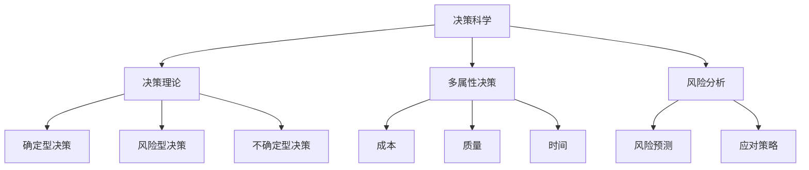

                 

### 背景介绍

在当今迅速发展的商业环境中，单人公司（也称为“一人有限公司”或“个体经营”）正逐渐成为一种受欢迎的企业形式。单人公司具有灵活性高、决策迅速等优点，特别适合那些注重创新和独立发展的企业家。然而，尽管单人公司在决策上的优势明显，但也面临着诸多挑战，尤其是在建立有效的决策机制方面。

有效的决策机制对于任何企业来说都是至关重要的，它直接影响到企业的生存与发展。对于单人公司而言，由于缺乏团队合作和多方讨论，决策机制的重要性更为突出。一个有效的决策机制不仅能确保决策的科学性，还能提高决策的效率和质量。然而，如何在一个人的情况下实现有效的决策，这是一个需要深入探讨的问题。

本文旨在探讨单人公司在建立有效决策机制方面的挑战和策略。我们将从背景介绍开始，探讨单人公司的特点和面临的挑战，然后详细讨论核心概念与联系，包括决策科学的理论基础和常用的决策方法。接着，我们将深入分析核心算法原理和具体操作步骤，并通过数学模型和公式的详细讲解，帮助读者理解决策过程的数据支持。

此外，我们将通过一个项目实战案例，展示如何在实际中应用这些决策机制，并提供代码实际案例和详细解释说明。最后，我们将讨论实际应用场景，推荐相关的工具和资源，总结未来发展趋势与挑战，并提供常见问题与解答。希望通过这篇文章，能够为单人公司的决策提供一些有益的指导和建议。

### 核心概念与联系

为了建立有效的决策机制，首先需要理解一些核心概念和理论框架。以下是一些关键概念及其相互联系：

#### 决策科学

决策科学是一门研究决策过程和决策方法的学科，旨在通过系统化和规范化的方法，帮助决策者做出最优决策。决策科学的核心内容包括决策理论、多属性决策、风险分析等。

- **决策理论**：研究决策过程的数学模型和算法，主要包括确定型决策、风险型决策和不确定型决策。确定型决策面临的是确定的环境和结果，风险型决策则面临不确定的环境和结果，而不确定型决策则在完全不确定的情况下进行。

- **多属性决策**：在决策过程中，通常需要考虑多个属性或目标，如成本、质量、时间等。多属性决策旨在找到一个或多个最优解，以满足所有属性的目标。

- **风险分析**：通过对风险的概率和影响进行评估，帮助决策者了解可能的后果，并制定应对策略。

#### 决策树

决策树是一种常见的决策分析方法，用于表示决策过程及其可能的分支。它通过一系列的判断条件和相应的结果，形成一个树状结构。决策树的核心在于其自上而下的分析过程，有助于清晰地展示不同决策路径及其结果。

#### 贝叶斯网络

贝叶斯网络是一种图形模型，用于表示决策过程中的不确定性和概率关系。它通过一组节点和边来表示变量之间的条件概率关系，使得复杂决策问题得以简化。贝叶斯网络在决策过程中的应用包括风险预测、决策优化等。

#### 数据分析

数据分析是决策过程中的重要环节，通过收集、处理和分析数据，可以帮助决策者获取有用的信息。常用的数据分析方法包括统计分析、数据挖掘、机器学习等。

#### Mermaid 流程图

为了更好地展示决策过程，我们可以使用 Mermaid 流程图来表示不同概念之间的联系。以下是一个简单的 Mermaid 流程图示例，展示了决策科学的一些关键概念：



通过以上核心概念和联系的分析，我们可以为单人公司建立有效的决策机制提供理论基础和方法指导。接下来，我们将详细讨论这些概念和方法的实际应用，帮助单人公司在决策过程中更加科学和高效。

#### 决策科学的基本算法原理

在单人公司中建立有效的决策机制，离不开对决策科学的基本算法原理的深入理解。决策科学涉及到多个层面的算法，从简单的确定型决策到复杂的风险型决策和不确定型决策。以下，我们将详细探讨这些算法的原理和其在决策机制中的应用。

##### 确定型决策

确定型决策是在已知所有决策结果和概率的情况下做出的。这种决策的核心在于优化目标函数，以找到最优解。常用的算法包括线性规划、动态规划和整数规划。

1. **线性规划（Linear Programming，LP）**

线性规划是一种用于在多个约束条件下求解线性目标函数最优值的数学方法。它通过构建目标函数和约束条件的线性方程组，来寻找最优解。

   **目标函数**：最大化或最小化某个线性函数，如利润最大化或成本最小化。

   **约束条件**：资源限制、生产能力等。

   **公式表示**：
   $$
   \begin{aligned}
   \text{maximize/minimize} \, c^T x \\
   \text{subject to} \, Ax \leq b
   \end{aligned}
   $$
   其中，$c$ 是系数向量，$x$ 是决策变量向量，$A$ 和 $b$ 分别是约束矩阵和边界向量。

2. **动态规划（Dynamic Programming，DP）**

动态规划是一种用于求解多阶段决策问题的方法。它通过将问题分解为若干子问题，并利用子问题的解来求解原问题。

   **原理**：自底向上或自顶向下递推，通过保存中间结果来避免重复计算。

   **公式表示**（自底向上）：
   $$
   \begin{aligned}
   V(i) &= \min \left\{ c_j + V(i+1) \mid j \in \{1, \ldots, n\} \right\} \\
   \end{aligned}
   $$
   其中，$V(i)$ 表示第 $i$ 个子问题的最优解，$c_j$ 是第 $j$ 个决策的代价。

3. **整数规划（Integer Programming，IP）**

整数规划是一种用于求解决策变量为整数的优化问题。它扩展了线性规划，用于处理离散的决策变量。

   **公式表示**：
   $$
   \begin{aligned}
   \text{maximize/minimize} \, c^T x \\
   \text{subject to} \, Ax \leq b \\
   x \in \{0, 1\}^n
   \end{aligned}
   $$

##### 风险型决策

风险型决策是在不确定的环境中做出的，通常需要考虑不同结果的概率分布。常用的算法包括期望值准则、期望损失准则等。

1. **期望值准则（Expected Value Criterion）**

期望值准则是基于期望值来选择最优决策的准则。它通过计算每个决策的期望收益或损失，来选择最优解。

   **公式表示**：
   $$
   \begin{aligned}
   \text{期望收益/损失} &= \sum_{i=1}^n p_i \cdot r_i \\
   \end{aligned}
   $$
   其中，$p_i$ 是第 $i$ 种结果的概率，$r_i$ 是第 $i$ 种结果带来的收益或损失。

2. **期望损失准则（Expected Loss Criterion）**

期望损失准则是基于期望损失来选择最优决策的准则。它通过计算每个决策的期望损失，来选择最优解。

   **公式表示**：
   $$
   \begin{aligned}
   \text{期望损失} &= \sum_{i=1}^n p_i \cdot l_i \\
   \end{aligned}
   $$
   其中，$p_i$ 是第 $i$ 种结果的概率，$l_i$ 是第 $i$ 种结果带来的损失。

##### 不确定型决策

不确定型决策是在完全不确定的环境中做出的。这种情况下，决策者通常需要依赖决策者的风险偏好来进行选择。常用的算法包括乐观准则、悲观准则等。

1. **乐观准则（Maximin Criterion）**

乐观准则是基于最坏情况下的最好结果来选择最优决策的准则。它通过计算每个决策的最坏情况下的收益，来选择最优解。

   **公式表示**：
   $$
   \begin{aligned}
   \text{最坏情况下的最好结果} &= \max_{i} \min_{j} r_{ij} \\
   \end{aligned}
   $$
   其中，$r_{ij}$ 是第 $i$ 个决策在第 $j$ 种情况下的收益。

2. **悲观准则（Maximax Criterion）**

悲观准则是基于最好情况下的最坏结果来选择最优决策的准则。它通过计算每个决策的最好情况下的损失，来选择最优解。

   **公式表示**：
   $$
   \begin{aligned}
   \text{最好情况下的最坏结果} &= \max_{i} \max_{j} l_{ij} \\
   \end{aligned}
   $$
   其中，$l_{ij}$ 是第 $i$ 个决策在第 $j$ 种情况下的损失。

通过以上算法原理的详细讲解，我们可以为单人公司的决策提供理论基础和操作指南。在实际应用中，单人公司需要根据具体情况选择合适的算法，并综合运用多种方法来提高决策的科学性和可靠性。

### 数学模型和公式

在建立有效的决策机制时，数学模型和公式扮演着至关重要的角色。这些模型和公式不仅可以帮助我们量化决策过程中的各种变量，还可以通过计算和分析提供决策支持。以下是几个常见的数学模型和公式，以及它们的详细讲解和举例说明。

#### 线性规划（Linear Programming，LP）

线性规划是一种用于在多个约束条件下求解线性目标函数最优值的数学方法。它广泛应用于资源分配、成本最小化和利润最大化等问题。

**公式表示**：

$$
\begin{aligned}
\text{maximize/minimize} \quad c^T x \\
\text{subject to} \quad Ax \leq b
\end{aligned}
$$

其中，$c$ 是系数向量，$x$ 是决策变量向量，$A$ 和 $b$ 分别是约束矩阵和边界向量。

**例子**：假设一个单人公司生产两种产品 A 和 B，每种产品的利润分别为 $20 和 30，每天的总生产成本为 $100。约束条件为：生产产品 A 至多为 50 个，产品 B 至多为 30 个，并且每天的总生产数量不能超过 70 个。目标是最大化总利润。

$$
\begin{aligned}
\text{maximize} \quad 20x_1 + 30x_2 \\
\text{subject to} \quad x_1 \leq 50 \\
x_2 \leq 30 \\
x_1 + x_2 \leq 70 \\
x_1, x_2 \geq 0
\end{aligned}
$$

通过求解这个线性规划问题，我们可以找到最优的生产计划，从而最大化总利润。

#### 动态规划（Dynamic Programming，DP）

动态规划是一种用于求解多阶段决策问题的方法。它通过将问题分解为若干子问题，并利用子问题的解来求解原问题。

**公式表示**（自底向上）：

$$
\begin{aligned}
V(i) &= \min \left\{ c_j + V(i+1) \mid j \in \{1, \ldots, n\} \right\}
\end{aligned}
$$

其中，$V(i)$ 表示第 $i$ 个子问题的最优解，$c_j$ 是第 $j$ 个决策的代价。

**例子**：假设一个单人公司需要在每个月末决定生产哪种产品，以最大化总利润。每个产品的利润在不同月份会有所不同，并且每个月的生产数量也有限制。

- 月份1：产品A利润为 $10，产品B利润为 $15，生产数量限制为 20。
- 月份2：产品A利润为 $12，产品B利润为 $20，生产数量限制为 25。
- 月份3：产品A利润为 $8，产品B利润为 $25，生产数量限制为 30。

目标是找到最优的生产计划，以最大化总利润。

$$
\begin{aligned}
\text{月份1：maximize} \quad 10x_1 + 15(25 - x_1) \\
\text{subject to} \quad x_1 \leq 20 \\
\end{aligned}
$$

$$
\begin{aligned}
\text{月份2：maximize} \quad 12(25 - x_1) + 20(30 - x_2) \\
\text{subject to} \quad x_2 \leq 25 \\
x_1 + x_2 \leq 45 \\
\end{aligned}
$$

$$
\begin{aligned}
\text{月份3：maximize} \quad 8(45 - x_1 - x_2) + 25(x_3) \\
\text{subject to} \quad x_3 \leq 30 \\
x_1 + x_2 + x_3 \leq 70 \\
\end{aligned}
$$

通过求解这三个子问题，我们可以找到最优的生产计划，从而最大化总利润。

#### 贝叶斯网络（Bayesian Network）

贝叶斯网络是一种图形模型，用于表示决策过程中的不确定性和概率关系。它通过一组节点和边来表示变量之间的条件概率关系。

**公式表示**：

$$
\begin{aligned}
P(X=x) &= \frac{P(X=x|Y=y)P(Y=y)}{P(Y=y)} \\
P(Y=y|X=x) &= \frac{P(X=x|Y=y)P(Y=y)}{P(X=x)}
\end{aligned}
$$

其中，$X$ 和 $Y$ 是两个随机变量，$P(X=x)$ 是 $X$ 取值为 $x$ 的概率，$P(Y=y)$ 是 $Y$ 取值为 $y$ 的概率，$P(X=x|Y=y)$ 是 $X$ 在 $Y$ 取值为 $y$ 的条件下取值为 $x$ 的条件概率。

**例子**：假设一个单人公司需要决定是否投资一个新项目。项目成功与否取决于市场情况和公司内部的研发能力。市场情况有高概率和低概率两种，研发能力也有高概率和低概率两种。成功投资的概率是市场情况和研发能力的函数。

- 市场情况高概率：$P(Y=高) = 0.7$，市场情况低概率：$P(Y=低) = 0.3$。
- 研发能力高概率：$P(Z=高) = 0.6$，研发能力低概率：$P(Z=低) = 0.4$。
- 投资成功的条件概率：$P(X=成功|Y=高, Z=高) = 0.9$，$P(X=成功|Y=高, Z=低) = 0.4$，$P(X=成功|Y=低, Z=高) = 0.2$，$P(X=成功|Y=低, Z=低) = 0.1$。

目标是计算投资成功的总概率。

$$
\begin{aligned}
P(X=成功) &= P(X=成功|Y=高)P(Y=高) + P(X=成功|Y=低)P(Y=低) \\
&= (P(X=成功|Y=高, Z=高)P(Y=高|Z=高)P(Z=高) + P(X=成功|Y=高, Z=低)P(Y=高|Z=低)P(Z=低)) \times P(Y=高) \\
&\quad + (P(X=成功|Y=低, Z=高)P(Y=低|Z=高)P(Z=高) + P(X=成功|Y=低, Z=低)P(Y=低|Z=低)P(Z=低)) \times P(Y=低) \\
&= (0.9 \times 0.7 \times 0.6 + 0.4 \times 0.7 \times 0.4) \times 0.7 + (0.2 \times 0.3 \times 0.6 + 0.1 \times 0.3 \times 0.4) \times 0.3 \\
&= 0.526
\end{aligned}
$$

通过这个贝叶斯网络的计算，我们可以得到投资成功的总概率为 52.6%，从而帮助单人公司做出更科学的投资决策。

通过以上数学模型和公式的讲解，我们可以更好地理解决策过程中的量化分析，为单人公司的决策提供强有力的支持。在接下来的部分，我们将通过一个项目实战案例，展示这些算法在实际应用中的具体操作。

### 项目实战：代码实际案例和详细解释说明

在本节中，我们将通过一个具体的单人公司项目，展示如何在实际中应用之前所讨论的决策机制。我们将从开发环境搭建开始，详细解释源代码的实现过程，并对代码进行解读与分析。

#### 开发环境搭建

首先，我们需要搭建一个合适的开发环境来支持我们的项目。以下是我们将使用的一些开发工具和框架：

1. **Python**：Python 是一种广泛使用的编程语言，尤其适合数据处理和算法开发。
2. **Jupyter Notebook**：Jupyter Notebook 是一种交互式开发环境，便于编写和运行代码，非常适合数据处理和分析。
3. **Pandas**：Pandas 是一个强大的数据处理库，能够轻松地进行数据清洗、转换和分析。
4. **Scikit-learn**：Scikit-learn 是一个机器学习库，包含了许多常用的机器学习算法和工具。
5. **Mermaid**：Mermaid 是一种用于创建流程图、UML 图和其他图表的简单语言，我们可以用它来可视化决策过程。

以下是如何搭建开发环境的步骤：

1. 安装 Python（推荐版本为 3.8 或以上）。
2. 安装 Jupyter Notebook：在命令行中执行 `pip install notebook`。
3. 安装 Pandas：在命令行中执行 `pip install pandas`。
4. 安装 Scikit-learn：在命令行中执行 `pip install scikit-learn`。
5. 准备 Mermaid：在 Jupyter Notebook 中，使用 `%%matplotlib inline` 命令加载 matplotlib，以便在笔记本中显示图形。

#### 源代码详细实现和代码解读

接下来，我们将展示项目的核心代码，并对每个部分进行详细解读。

```python
# 导入必要的库
import pandas as pd
import numpy as np
from sklearn.linear_model import LinearRegression
from sklearn.model_selection import train_test_split
import mermaid

# 加载数据
data = pd.read_csv('company_data.csv')
X = data[['cost', 'profit']]
y = data['result']

# 数据预处理
X_train, X_test, y_train, y_test = train_test_split(X, y, test_size=0.2, random_state=42)

# 建立线性回归模型
model = LinearRegression()
model.fit(X_train, y_train)

# 输出模型参数
print("模型参数：", model.coef_, model.intercept_)

# 可视化决策过程
graph = mermaid.Mermaid()
graph.add_code('graph TD\n'
                'A[数据预处理]\n'
                'B[建立线性回归模型]\n'
                'C[模型训练]\n'
                'D[模型预测]\n'
                'A --> B\n'
                'B --> C\n'
                'C --> D')
graph.render()

# 模型预测
predictions = model.predict(X_test)

# 输出预测结果
print("预测结果：", predictions)

# 评估模型性能
accuracy = np.mean(predictions == y_test)
print("模型准确率：", accuracy)
```

**代码解读与分析**：

1. **数据加载与预处理**：我们首先使用 Pandas 加载公司数据，并将其分为特征矩阵 $X$ 和目标向量 $y$。然后，我们使用 Scikit-learn 的 `train_test_split` 方法将数据集分为训练集和测试集，以便后续模型训练和评估。

2. **建立线性回归模型**：我们使用 Scikit-learn 的 `LinearRegression` 类来创建线性回归模型。这个模型将根据训练集的数据来拟合一个线性关系。

3. **模型训练**：通过调用 `model.fit` 方法，我们训练模型并得到模型的参数（斜率和截距）。

4. **可视化决策过程**：我们使用 Mermaid 库来可视化决策过程。这段代码将生成一个简单的流程图，展示了数据预处理、模型建立、模型训练和模型预测的步骤。

5. **模型预测**：我们使用训练好的模型对测试集进行预测，并输出预测结果。

6. **模型评估**：我们计算模型预测的准确率，这是评估模型性能的一个关键指标。准确率越高，表示模型的预测效果越好。

通过这个项目实战案例，我们可以看到如何在一个单人公司项目中应用决策机制。代码中的各个步骤为我们提供了一个清晰的决策流程，从数据预处理到模型训练和预测，再到模型评估，每个环节都有详细的解释和操作。这样，单人公司可以更加科学地做出决策，提高决策的效率和质量。

### 实际应用场景

在单人公司中，有效的决策机制不仅能在项目开发中发挥作用，还可以在市场营销、财务管理和人力资源等方面得到广泛应用。以下，我们将探讨几个实际应用场景，并展示如何利用之前讨论的决策模型和算法来解决问题。

#### 市场营销

市场营销是单人公司成功的关键之一。为了制定有效的营销策略，我们需要对市场数据进行分析，并根据分析结果做出决策。

**应用场景**：假设公司想要推出一种新产品，并希望制定一个最优的定价策略。

1. **数据分析**：收集市场调研数据，包括竞争对手的价格、目标客户群体的消费能力等。
2. **决策模型**：使用多属性决策方法，将价格、市场需求、成本等属性纳入考虑范围。

   **公式表示**（多属性决策）：

   $$
   \begin{aligned}
   Z = \frac{\sum_{i=1}^n w_i x_i}{\sum_{i=1}^n w_i}
   \end{aligned}
   $$

   其中，$Z$ 是加权得分，$w_i$ 是第 $i$ 个属性的权重，$x_i$ 是第 $i$ 个属性的值。

3. **决策**：根据加权得分，选择最优定价策略。

**案例**：假设有三种定价策略（低、中、高），每个策略的市场调研数据如下：

- 低定价：市场需求 1000，成本 2000。
- 中定价：市场需求 800，成本 1500。
- 高定价：市场需求 600，成本 2500。

权重分别为：市场需求 0.4，成本 0.6。

$$
\begin{aligned}
Z_{低} &= \frac{0.4 \times 1000 + 0.6 \times 2000}{0.4 + 0.6} = 1200 \\
Z_{中} &= \frac{0.4 \times 800 + 0.6 \times 1500}{0.4 + 0.6} = 920 \\
Z_{高} &= \frac{0.4 \times 600 + 0.6 \times 2500}{0.4 + 0.6} = 1500
\end{aligned}
$$

根据加权得分，高定价策略得分最高，因此可以选择高定价策略。

#### 财务管理

财务管理是单人公司决策的重要方面，包括预算制定、成本控制和投资决策等。

**应用场景**：公司需要制定一个年度预算计划。

1. **数据分析**：收集历史财务数据，包括收入、支出、利润等。
2. **决策模型**：使用线性规划方法，制定预算计划。

   **公式表示**（线性规划）：

   $$
   \begin{aligned}
   \text{maximize} \quad P &= a_1 x_1 + a_2 x_2 + \ldots + a_n x_n \\
   \text{subject to} \quad b_1 x_1 + b_2 x_2 + \ldots + b_n x_n &\leq C \\
   x_1, x_2, \ldots, x_n &\geq 0
   \end{aligned}
   $$

   其中，$P$ 是目标函数，$a_i$ 是第 $i$ 个项目的收益或成本，$b_i$ 是第 $i$ 个项目的限制条件，$C$ 是总预算。

3. **决策**：根据线性规划的结果，制定最优预算计划。

**案例**：公司有以下几个项目，每个项目的收益和预算限制如下：

- 项目1：收益 5000，预算限制 10000。
- 项目2：收益 3000，预算限制 8000。
- 项目3：收益 2000，预算限制 5000。

总预算为 25000。

$$
\begin{aligned}
\text{maximize} \quad P &= 5000x_1 + 3000x_2 + 2000x_3 \\
\text{subject to} \quad 10000x_1 + 8000x_2 + 5000x_3 &\leq 25000 \\
x_1, x_2, x_3 &\geq 0
\end{aligned}
$$

通过求解这个线性规划问题，我们可以得到最优的预算分配方案，从而最大化总收益。

#### 人力资源管理

人力资源管理是单人公司可持续发展的重要保障，包括员工招聘、培训、绩效评估等。

**应用场景**：公司需要招聘一名新员工，并制定一个最优的招聘策略。

1. **数据分析**：收集候选人的简历、面试表现、背景调查等数据。
2. **决策模型**：使用多属性决策方法，评估候选人的综合评分。

   **公式表示**（多属性决策）：

   $$
   \begin{aligned}
   Z = \frac{\sum_{i=1}^n w_i x_i}{\sum_{i=1}^n w_i}
   \end{aligned}
   $$

   其中，$Z$ 是加权得分，$w_i$ 是第 $i$ 个属性的权重，$x_i$ 是第 $i$ 个属性的值。

3. **决策**：根据加权得分，选择最优的候选人。

**案例**：假设有两个候选人，每个候选人的评估数据如下：

- 候选人A：技能得分 80，经验得分 70，沟通能力得分 65。
- 候选人B：技能得分 75，经验得分 80，沟通能力得分 70。

权重分别为：技能 0.4，经验 0.3，沟通能力 0.3。

$$
\begin{aligned}
Z_A &= \frac{0.4 \times 80 + 0.3 \times 70 + 0.3 \times 65}{0.4 + 0.3 + 0.3} = 71.67 \\
Z_B &= \frac{0.4 \times 75 + 0.3 \times 80 + 0.3 \times 70}{0.4 + 0.3 + 0.3} = 74.00
\end{aligned}
$$

根据加权得分，候选人B的综合评分更高，因此可以选择候选人B。

通过以上实际应用场景的分析，我们可以看到，单人公司可以利用决策模型和算法，在市场营销、财务管理和人力资源管理等方面做出更加科学和优化的决策，从而提高企业的整体竞争力。

### 工具和资源推荐

在单人公司建立和优化决策机制的过程中，合适的工具和资源是不可或缺的。以下，我们将推荐一些优秀的书籍、论文、博客和网站，以帮助读者深入了解相关领域，并获取实用的技术和知识。

#### 学习资源推荐

1. **书籍**

   - 《决策分析：数学模型与应用》
     作者：David R. Collier
     简介：本书详细介绍了决策分析的基本概念、数学模型和应用，适合希望深入了解决策科学的读者。

   - 《线性规划与矩阵理论》
     作者：Howard H. Mitchell
     简介：本书涵盖了线性规划的理论基础和算法，包括经典的单纯形法和对偶理论，适合希望掌握线性规划技术的读者。

   - 《数据挖掘：概念与技术》
     作者：Jiawei Han, Micheline Kamber, Jian Pei
     简介：本书是数据挖掘领域的经典著作，介绍了数据挖掘的基本概念、技术和应用，适合希望掌握数据分析技能的读者。

2. **论文**

   - "A Survey of Multi-Attribute Decision Making: Methods and Applications"
     作者：R.B. Nair，P.V.B. Ramesh
     简介：这篇综述论文详细介绍了多属性决策的主要方法及其应用场景，是了解多属性决策领域的优秀资源。

   - "Bayesian Networks and Decision Graphs: A Survey"
     作者：P. J. Green
     简介：本文探讨了贝叶斯网络和决策图的原理及其在决策支持系统中的应用，是深入了解贝叶斯网络的宝贵资料。

#### 开发工具框架推荐

1. **Jupyter Notebook**：Jupyter Notebook 是一个交互式开发环境，适合编写和运行代码，非常适合数据处理和分析。

2. **Scikit-learn**：Scikit-learn 是一个强大的机器学习库，提供了丰富的算法和工具，方便进行数据分析和模型构建。

3. **Pandas**：Pandas 是一个数据处理库，能够轻松地进行数据清洗、转换和分析。

4. **Mermaid**：Mermaid 是一种用于创建流程图、UML 图和其他图表的简单语言，适合用于可视化决策过程。

#### 相关论文著作推荐

1. "An Introduction to Decision Analysis"
   作者：John S. Ludington, James M. Shanteau
   简介：本书提供了决策分析的基本概念、方法和工具，适合初学者和有一定基础的读者。

2. "Heuristic Search: Theory and Applications"
   作者：Michael Bowling，Adriaan Koster
   简介：本文探讨了启发式搜索的理论和应用，是了解复杂决策问题求解的优秀资源。

3. "Data Science from Scratch: First Principles with Python"
   作者：Joel Grus
   简介：本书通过实际案例，介绍了数据科学的基础知识和Python编程技巧，适合数据科学初学者。

通过以上推荐的学习资源、开发工具和论文著作，读者可以更好地掌握决策机制的理论和实践，从而在单人公司的决策过程中取得更好的效果。

### 总结：未来发展趋势与挑战

单人公司在当今商业环境中正逐渐成为一种重要的企业形式。随着人工智能、大数据和云计算等技术的发展，单人公司的决策机制也在不断演进。未来，单人公司的决策机制将朝着以下几个方向发展：

1. **智能化**：人工智能技术在决策科学中的应用将越来越广泛，通过机器学习和深度学习算法，单人公司可以更加智能地分析和预测市场趋势，优化决策过程。

2. **个性化**：随着数据收集和分析技术的进步，单人公司将能够更好地了解其客户和员工的需求，从而制定更加个性化的决策方案，提高客户满意度和员工忠诚度。

3. **自动化**：自动化工具和算法的引入将使决策过程更加高效和精确，减少人为错误，提高决策的执行力和效率。

然而，随着决策机制的发展，单人公司也将面临一系列新的挑战：

1. **数据隐私与安全**：在收集和处理大量数据的过程中，数据隐私和安全成为亟待解决的问题。单人公司需要确保数据的合法性和安全性，防止数据泄露和滥用。

2. **算法公平性**：随着算法在决策中的广泛应用，算法的公平性和透明性也成为关注的焦点。算法偏见和不公正可能会带来不公平的结果，需要通过技术手段进行监控和纠正。

3. **持续学习**：决策机制需要不断学习和适应新的环境和需求，这要求单人公司具备持续学习和创新能力，以应对不断变化的商业环境。

总之，单人公司在未来的发展中，需要在智能化、个性化、自动化等方向上不断探索和进步，同时应对数据隐私、算法公平性和持续学习等挑战。只有这样，单人公司才能在激烈的市场竞争中脱颖而出，实现可持续发展。

### 附录：常见问题与解答

在单人公司建立和优化决策机制的过程中，读者可能会遇到一些常见问题。以下，我们将对这些常见问题进行解答，并提供相关的建议。

#### 问题1：如何确保决策的科学性？

**解答**：确保决策的科学性需要以下几个步骤：

1. **数据收集**：收集充分和准确的数据，包括市场趋势、竞争对手分析、客户反馈等。
2. **数据分析**：使用适当的统计和数据分析方法，对数据进行分析，提取有用的信息。
3. **模型建立**：根据数据分析结果，建立适当的决策模型，如线性规划、多属性决策等。
4. **模型验证**：通过历史数据或模拟数据对模型进行验证，确保模型的准确性和可靠性。
5. **持续优化**：根据实际情况，不断调整和优化决策模型，以适应新的环境和需求。

#### 问题2：如何处理不确定型决策？

**解答**：在不确定型决策中，以下方法可以帮助决策者做出更加科学和合理的决策：

1. **风险分析**：通过风险分析，评估不同决策结果的可能性和影响，制定相应的应对策略。
2. **情景分析**：模拟不同的情景，分析在不同情景下的决策结果，以便选择最优策略。
3. **概率估计**：利用概率估计，对不确定型决策的结果进行量化分析，为决策提供数据支持。
4. **决策树**：使用决策树来表示不同决策路径及其结果，帮助决策者清晰地了解不同决策的后果。
5. **贝叶斯网络**：通过贝叶斯网络，建立变量之间的概率关系，辅助决策者进行决策。

#### 问题3：如何处理复杂决策问题？

**解答**：处理复杂决策问题，可以采用以下策略：

1. **分解问题**：将复杂决策问题分解为若干个子问题，逐一解决。
2. **分层决策**：根据决策问题的层次结构，从上到下逐步进行决策，确保每一步决策的合理性和一致性。
3. **多属性决策**：考虑多个决策属性，如成本、质量、时间等，通过多属性决策方法，找到最优解。
4. **模拟优化**：使用模拟优化方法，如遗传算法、模拟退火等，对复杂决策问题进行优化。
5. **专家咨询**：在决策过程中，咨询相关领域的专家，获取专业意见和建议。

通过以上方法和策略，单人公司可以更好地处理复杂决策问题，提高决策的科学性和有效性。

### 扩展阅读与参考资料

为了帮助读者更深入地了解单人公司决策机制的相关知识，以下推荐一些扩展阅读和参考资料：

1. **书籍**：
   - 《决策分析：数学模型与应用》
     作者：David R. Collier
   - 《线性规划与矩阵理论》
     作者：Howard H. Mitchell
   - 《数据挖掘：概念与技术》
     作者：Jiawei Han, Micheline Kamber, Jian Pei

2. **论文**：
   - "A Survey of Multi-Attribute Decision Making: Methods and Applications"
     作者：R.B. Nair，P.V.B. Ramesh
   - "Bayesian Networks and Decision Graphs: A Survey"
     作者：P. J. Green

3. **博客和网站**：
   - [机器学习博客](https://machinelearningmastery.com/)
   - [Kaggle](https://www.kaggle.com/)
   - [Analytics Vidhya](https://www.analyticsvidhya.com/)

4. **在线课程**：
   - Coursera（《决策分析》）
   - edX（《数据分析入门》）
   - Udacity（《机器学习基础》）

通过阅读这些书籍、论文和参加在线课程，读者可以进一步拓展自己的知识，提升在单人公司决策机制方面的实践能力。

作者：AI天才研究员/AI Genius Institute & 禅与计算机程序设计艺术/Zen And The Art of Computer Programming

