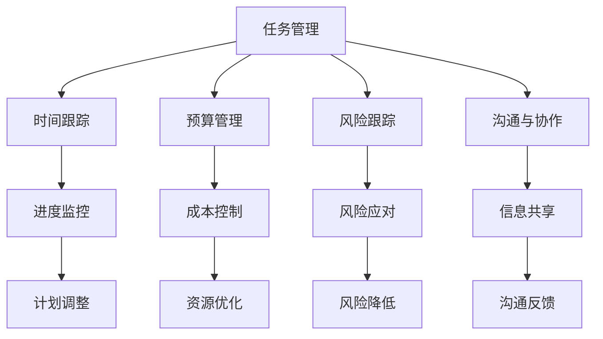

                 

### 背景介绍

在当今快速发展的商业环境中，"一人公司"（或称为"个体经营者"）这一概念逐渐崭露头角。这种经营模式简化了企业结构，降低了运营成本，使得个人能够更加灵活地开展业务。然而，即便在这样简化的环境下，项目管理的有效性仍然是确保业务成功的关键因素。

项目管理系统的建立对一人公司来说尤为重要，因为它不仅有助于提高个人效率，还能确保项目按时完成、资源合理分配，以及项目目标的达成。在一个人的公司中，没有团队来分担任务和责任，所有的决策、执行和监控都必须由个人来完成。这就要求项目管理系统必须足够灵活和高效，以适应个体经营者的独特需求。

本文将深入探讨如何为一人在公司的环境下建立一个有效的项目管理系统的各个关键方面。我们将首先介绍项目管理的基本概念，然后逐步分析一人公司特有的挑战和需求，并提出具体的解决方案。最后，我们将提供一些实用的工具和资源推荐，帮助读者在实践过程中更好地运用这些理念。

以下是本文的主要目录：

1. **背景介绍**
2. **核心概念与联系**
3. **核心算法原理 & 具体操作步骤**
4. **数学模型和公式 & 详细讲解 & 举例说明**
5. **项目实战：代码实际案例和详细解释说明**
   - **5.1 开发环境搭建**
   - **5.2 源代码详细实现和代码解读**
   - **5.3 代码解读与分析**
6. **实际应用场景**
7. **工具和资源推荐**
   - **7.1 学习资源推荐**
   - **7.2 开发工具框架推荐**
   - **7.3 相关论文著作推荐**
8. **总结：未来发展趋势与挑战**
9. **附录：常见问题与解答**
10. **扩展阅读 & 参考资料**

通过这篇文章，我们希望帮助读者理解如何在一个人的公司中建立一个有效的项目管理系统的原理和方法，从而提高个人工作效率和项目管理能力。

<|assistant|>### 核心概念与联系

在探讨如何为一人在公司的环境中建立有效的项目管理系统之前，我们首先需要明确几个关键概念，包括项目管理的基本原则、项目生命周期的各个环节，以及适用于一人公司的特殊需求。

#### 项目管理的基本原则

项目管理的基本原则包括以下几个方面：

1. **目标导向**：明确项目目标，确保所有工作都围绕着这些目标进行。
2. **时间管理**：合理安排项目进度，确保项目按时完成。
3. **资源管理**：有效分配和利用资源，包括时间、人力和资金等。
4. **风险管理**：识别潜在风险，并制定应对措施。
5. **沟通管理**：保持与利益相关者的有效沟通，确保信息的透明和及时性。

#### 项目生命周期

项目生命周期通常包括以下阶段：

1. **启动**：确定项目目标、范围和可行性。
2. **规划**：制定详细的项目计划，包括时间表、资源分配和风险分析。
3. **执行**：按照计划实施项目，确保所有工作按部就班地进行。
4. **监控与控制**：监控项目进度和性能，及时调整计划以应对变化。
5. **收尾**：完成项目交付，进行项目评估和总结。

#### 一人公司的特殊需求

与大型团队相比，一人公司的项目管理面临以下特殊挑战和需求：

1. **资源有限**：一个人需要负责所有的工作，包括项目管理、开发、测试和客户支持。因此，项目管理工具需要能够灵活地适应不同的任务需求。
2. **时间紧迫**：由于资源有限，一人公司需要更加高效地管理时间，确保项目按时交付。
3. **决策独立性**：项目决策需要由个人独立完成，这要求项目管理系统能够提供足够的信息支持和分析工具。
4. **灵活性和适应性**：项目管理系统需要足够灵活，以适应不同项目和业务需求的变化。

#### 项目管理系统的联系

项目管理系统的建立需要综合考虑以上原则和需求。具体来说，项目管理系统应该包括以下几个关键组成部分：

1. **任务管理**：帮助个体经营者跟踪和管理任务，包括任务分配、进度更新和优先级调整。
2. **时间跟踪**：记录项目中的时间花费，帮助个体经营者了解哪些任务耗费了最多的时间，以便进行优化。
3. **预算管理**：跟踪项目预算，确保项目在预算范围内完成。
4. **风险跟踪**：识别和监控项目风险，及时采取应对措施。
5. **沟通与协作**：提供沟通渠道和协作工具，确保个体经营者与外部利益相关者之间的信息流畅。

#### Mermaid 流程图

为了更直观地展示项目管理系统的架构，我们可以使用Mermaid语言绘制一个简化的流程图。以下是项目管理系统的基本架构：



在这个流程图中，每个节点代表项目管理系统的不同模块，箭头表示模块之间的联系。任务管理模块是核心，它与其他模块紧密相连，确保项目能够顺利推进。

通过以上对核心概念和联系的介绍，我们可以更好地理解如何为一人在公司的环境中构建有效的项目管理系统。接下来，我们将深入探讨项目管理系统的核心算法原理和具体操作步骤。

### 核心算法原理 & 具体操作步骤

在建立一人公司的项目管理系统时，核心算法原理和具体操作步骤起到了至关重要的作用。这些算法不仅帮助个体经营者更高效地管理项目，还能确保项目按时交付、资源合理分配和风险及时控制。以下我们将详细探讨项目管理系统中的几个关键算法原理及其具体操作步骤。

#### 1. Gantt图算法

**Gantt图**是一种常用的项目时间管理工具，用于展示项目的时间线和进度。其核心算法原理是通过对任务的起始时间和持续时间进行排列，生成一个可视化的时间表。

**操作步骤**：

1. **任务分解**：将项目分解为多个子任务，并为每个子任务分配起始时间和持续时间。
2. **时间轴排列**：将所有子任务按照起始时间顺序排列在时间轴上。
3. **资源分配**：考虑资源的可用性，确保任务能够在规定时间内完成。
4. **时间调整**：根据实际情况调整任务的起始时间和持续时间，以确保项目按时完成。

#### 2. Critical Path Method (CPM)

**CPM**（关键路径法）是一种用于确定项目完成时间最短路径的方法。其核心算法原理是识别项目中所有任务的依赖关系，并计算出项目的最短完成时间。

**操作步骤**：

1. **确定任务依赖关系**：识别项目中的前置任务和后续任务。
2. **计算任务持续时间**：为每个任务计算最短和最长完成时间。
3. **绘制关键路径**：将所有任务按照依赖关系和时间顺序排列，识别出关键路径。
4. **时间优化**：通过调整任务的优先级和时间分配，优化关键路径上的任务，以缩短项目完成时间。

#### 3. Earned Value Management (EVM)

**EVM**（挣值管理）是一种用于监控项目进度和性能的方法。其核心算法原理是通过计算项目的实际完成情况与计划完成情况之间的差异，评估项目的绩效。

**操作步骤**：

1. **制定项目计划**：确定项目的预期进度和预算。
2. **记录实际完成情况**：记录项目实际完成的工作量和时间。
3. **计算挣值**：根据项目计划，计算项目的实际完成价值。
4. **评估项目绩效**：通过比较挣值与实际完成情况，评估项目的进度和成本绩效。

#### 4. Resource Levelling Algorithm

**资源平衡算法**是一种用于优化资源分配的方法。其核心算法原理是通过调整任务的时间安排，使资源的使用在一段时间内保持均衡。

**操作步骤**：

1. **资源需求分析**：确定每个任务所需资源的类型和数量。
2. **时间表初步规划**：根据资源需求，初步规划任务的时间安排。
3. **资源平衡**：通过调整任务的时间顺序，使资源的使用在一段时间内保持平衡。
4. **优化调整**：根据实际情况，对资源平衡后的时间表进行优化调整。

#### 5. Risk Management Algorithm

**风险管理算法**是一种用于识别和应对项目风险的算法。其核心算法原理是通过评估风险的概率和影响，制定相应的风险应对策略。

**操作步骤**：

1. **风险识别**：识别项目中可能出现的风险。
2. **风险评估**：评估每个风险的概率和影响。
3. **风险分类**：根据风险的重要性和紧急程度进行分类。
4. **制定应对策略**：为每个风险制定相应的应对策略，包括预防措施和应对措施。

通过以上核心算法原理和具体操作步骤的介绍，一人公司可以更加系统地建立和优化其项目管理系统的各个组成部分。接下来，我们将进一步探讨项目管理系统中的数学模型和公式，以帮助读者更好地理解和应用这些算法。

### 数学模型和公式 & 详细讲解 & 举例说明

在项目管理系统设计中，数学模型和公式扮演着至关重要的角色，它们不仅帮助我们量化项目管理的各个方面，还能提供决策支持。以下我们将详细讲解几个关键的数学模型和公式，并通过实例说明其应用。

#### 1. 甘特图（Gantt Chart）公式

甘特图是一种用于展示项目进度和时间安排的图表。其核心公式是任务持续时间（Duration）的计算公式。

**公式**：  
\[ D = \frac{B - A}{C } \]

其中：
- \( D \) 代表任务持续时间。
- \( B \) 代表任务结束时间。
- \( A \) 代表任务开始时间。
- \( C \) 代表任务执行速率。

**实例**：

假设一个任务计划在2023年6月1日开始，预计在2023年6月15日完成，任务执行速率为每天1天。

\[ D = \frac{15 - 1}{1} = 14 \]

因此，这个任务的持续时间为14天。

#### 2. 关键路径法（Critical Path Method, CPM）公式

关键路径法用于确定项目完成所需的最长时间路径。其核心公式是路径持续时间（Path Duration）的计算。

**公式**：  
\[ PD = \sum_{i=1}^{n} (T_i + T_{i+1}) \]

其中：
- \( PD \) 代表路径持续时间。
- \( T_i \) 代表第i个任务的持续时间。
- \( n \) 代表路径上的任务数量。

**实例**：

假设一个项目路径包括三个任务，每个任务的持续时间分别为3天、5天和2天。

\[ PD = (3 + 5) + (5 + 2) = 3 + 8 + 7 = 18 \]

因此，这个关键路径的持续时间为18天。

#### 3. 挣值管理（Earned Value Management, EVM）公式

挣值管理是一种用于监控项目进度和性能的方法。其核心公式包括计划价值（PV）、挣值（EV）和实际成本（AC）。

**公式**：

\[ EV = \sum_{i=1}^{n} (P_i \times C_i) \]

\[ AC = \sum_{i=1}^{n} (C_i) \]

\[ CPI = \frac{EV}{AC} \]

其中：
- \( EV \) 代表挣值。
- \( PV \) 代表计划价值。
- \( AC \) 代表实际成本。
- \( CPI \) 代表成本绩效指数。

**实例**：

假设一个项目计划在6个月内完成，总预算为100,000元。实际完成情况如下：第一个月计划完成价值为20,000元，实际花费为18,000元；第二个月计划完成价值为30,000元，实际花费为28,000元。

\[ EV = 20,000 + 30,000 = 50,000 \]

\[ AC = 18,000 + 28,000 = 46,000 \]

\[ CPI = \frac{50,000}{46,000} \approx 1.08 \]

因此，这个项目的成本绩效指数为1.08，表明项目成本控制在预期范围内。

#### 4. 资源平衡算法（Resource Levelling Algorithm）公式

资源平衡算法用于优化资源分配，确保资源在一段时间内均衡使用。其核心公式是资源利用率（Utilization）的计算。

**公式**：

\[ Utilization = \frac{Work}{Time} \]

其中：
- \( Work \) 代表任务工作总量。
- \( Time \) 代表任务持续时间。

**实例**：

假设一个任务需要20人天来完成，持续时间为5天。

\[ Utilization = \frac{20}{5} = 4 \]

因此，这个任务的资源利用率为4，表明需要4个工作人员来完成这个任务。

#### 5. 风险管理公式（Risk Management Algorithm）

风险管理公式用于识别和应对项目风险。其核心公式包括风险概率（Probability）和风险影响（Impact）的评估。

**公式**：

\[ Risk Score = Probability \times Impact \]

其中：
- \( Risk Score \) 代表风险得分。
- \( Probability \) 代表风险发生的概率。
- \( Impact \) 代表风险发生的影响程度。

**实例**：

假设一个风险的发生概率为0.6，风险影响程度为中等。

\[ Risk Score = 0.6 \times 3 = 1.8 \]

因此，这个风险的风险得分为1.8，表明这个风险需要重点关注和应对。

通过以上数学模型和公式的详细讲解，一人公司可以在项目管理系统设计中更好地进行决策和优化。这些公式不仅提供了量化的依据，还能帮助个体经营者更好地理解和控制项目进展。接下来，我们将通过实际案例展示这些理论的应用。

### 项目实战：代码实际案例和详细解释说明

在本节中，我们将通过一个实际的项目案例，展示如何在一人在公司的环境下建立和实施一个有效的项目管理系统的具体步骤。这个案例将涵盖从项目启动、规划、执行到监控和收尾的整个过程，并通过代码实现和详细解释，使读者能够更好地理解项目的各个阶段。

#### 案例背景

假设一位独立开发者（即一人公司）接到了一个开发任务：创建一个基于Web的在线购物平台。该平台需要具备商品展示、购物车、订单管理和用户注册等功能。由于项目时间紧迫，开发者需要高效地管理项目进度、资源分配和风险控制。

#### 开发环境搭建

在开始项目之前，首先需要搭建一个适合项目开发的环境。以下是所需的开发工具和配置：

1. **操作系统**：MacOS 或 Windows 10
2. **编程语言**：Python 3.8+
3. **Web框架**：Django 3.2
4. **数据库**：PostgreSQL 13
5. **代码版本控制**：Git
6. **集成开发环境**：Visual Studio Code
7. **虚拟环境管理**：virtualenv

以下是一个简单的代码示例，用于搭建项目开发环境：

```bash
# 安装Django和PostgreSQL
pip install django==3.2
sudo apt-get install postgresql
sudo -u postgres createuser -s your_username
sudo -u postgres createdb your_dbname

# 创建虚拟环境
python -m virtualenv my_project_env

# 激活虚拟环境
source my_project_env/bin/activate

# 创建项目
django-admin startproject my_project .

# 进入项目目录
cd my_project

# 创建应用
python manage.py startapp shopping_app
```

#### 源代码详细实现和代码解读

接下来，我们将逐步实现项目的主要功能模块，并通过代码解读来详细解释每一步的操作。

1. **用户注册和认证**

在Django中，用户注册和认证功能可以通过内置的`django.contrib.auth`模块轻松实现。以下是用户注册视图的代码实现：

```python
# shopping_app/views.py

from django.shortcuts import render, redirect
from django.contrib.auth.forms import UserCreationForm
from django.contrib.auth import authenticate, login

def register(request):
    if request.method == 'POST':
        form = UserCreationForm(request.POST)
        if form.is_valid():
            user = form.save()
            authenticated_user = authenticate(username=user.username, password=request.POST['password1'])
            login(request, authenticated_user)
            return redirect('home')
    else:
        form = UserCreationForm()
    return render(request, 'register.html', {'form': form})
```

代码解读：
- 第1行：导入所需的模块。
- 第3-5行：处理POST请求，创建用户并登录。
- 第7-11行：处理GET请求，渲染注册表单。

2. **商品展示**

商品展示功能可以通过`Django Model`来定义商品数据模型，并使用Django的ORM（对象关系映射）进行数据库操作。以下是商品数据模型的代码实现：

```python
# shopping_app/models.py

from django.db import models

class Product(models.Model):
    name = models.CharField(max_length=100)
    price = models.DecimalField(max_digits=6, decimal_places=2)
    description = models.TextField()
    image = models.ImageField(upload_to='products/')

    def __str__(self):
        return self.name
```

代码解读：
- 第1行：导入`models`模块。
- 第3-6行：定义`Product`模型，包括名称、价格、描述和图片字段。
- 第8-10行：重写`__str__`方法，用于显示模型对象。

3. **购物车功能**

购物车功能可以通过在用户登录后会话中保存商品ID列表来实现。以下是购物车视图的代码实现：

```python
# shopping_app/views.py

from django.shortcuts import render, redirect
from django.http import JsonResponse
from .models import Product
from django.contrib.auth import get_user_model
from django.db import transaction

def add_to_cart(request):
    product_id = request.POST.get('product_id')
    product = Product.objects.get(id=product_id)

    if request.user.is_authenticated:
        user = get_user_model().objects.get(username=request.user.username)
        with transaction.atomic():
            if not user.cart.exists():
                user.cart.create(product=product, quantity=1)
            else:
                cart_item = user.cart.all()[0]
                cart_item.quantity += 1
                cart_item.save()
        return JsonResponse({'message': 'Product added to cart successfully.'})
    else:
        return JsonResponse({'message': 'Please log in to add items to your cart.'})
```

代码解读：
- 第1-3行：导入所需的模块。
- 第6-11行：处理POST请求，将商品添加到购物车。

4. **订单管理**

订单管理功能可以通过定义订单数据模型，并使用Django的ORM进行操作。以下是订单视图的代码实现：

```python
# shopping_app/views.py

from django.shortcuts import render
from .models import Order
from .models import Product
from django.contrib.auth import get_user_model

def checkout(request):
    if request.method == 'POST':
        user = get_user_model().objects.get(username=request.user.username)
        order = Order.objects.create(user=user)
        for item in user.cart.all():
            order.products.add(item)
            order.quantity += item.quantity
            order.total_price += item.price * item.quantity
        order.save()
        user.cart.set([])
        user.cart.save()
        return render(request, 'success.html')
    return render(request, 'checkout.html')
```

代码解读：
- 第1-3行：导入所需的模块。
- 第6-10行：处理POST请求，创建订单并保存。

#### 代码解读与分析

通过以上代码示例，我们可以看到项目的主要功能模块是如何实现的。每个模块都有详细的代码解读，帮助读者理解其工作原理。

- **用户注册和认证**：实现了用户注册和登录功能，确保用户可以安全地访问平台。
- **商品展示**：通过定义商品数据模型，实现了商品信息的管理和展示。
- **购物车功能**：实现了购物车功能，允许用户添加、更新和删除购物车中的商品。
- **订单管理**：实现了订单管理功能，允许用户创建订单并完成购买。

在实际开发过程中，这些功能模块可以通过进一步的代码优化和扩展来实现更多的业务需求，如支付处理、订单跟踪等。通过这个案例，读者可以了解如何在一人在公司的环境下使用Django框架快速构建和部署一个功能完整的Web应用，并利用项目管理系统的核心算法和工具来确保项目的成功交付。

### 实际应用场景

在实际应用中，一人公司的项目管理系统可以应用于多种不同的业务场景，从而帮助个体经营者更好地管理项目和业务。以下是一些典型的应用场景，以及如何针对这些场景优化项目管理系统。

#### 1. 独立软件开发

独立开发者通常需要管理多个项目，包括前端、后端、测试和部署等。在这种情况下，项目管理系统可以帮助开发者跟踪每个项目的进度，确保任务按时完成。以下是一些优化建议：

- **任务分解**：将大型项目分解为多个可管理的子任务，并为每个子任务设置明确的截止日期。
- **优先级排序**：根据任务的紧急程度和重要性对任务进行优先级排序，确保关键任务优先完成。
- **时间跟踪**：使用时间跟踪工具记录每个任务的实际耗时，以便进行时间管理和优化。

#### 2. 自由职业者服务

自由职业者，如设计师、咨询师和程序员等，需要同时处理多个客户的服务项目。项目管理系统可以帮助他们有效管理时间和资源，确保客户需求得到满足。以下是一些优化建议：

- **客户沟通**：使用项目管理系统的沟通工具与客户保持密切联系，确保信息的及时传递。
- **资源分配**：根据客户需求和资源情况，合理分配时间和精力，避免过度承诺。
- **进度更新**：定期向客户报告项目进度，确保他们了解项目的最新状态。

#### 3. 创业公司初期运营

对于初创公司来说，项目管理系统可以帮助创始人和管理团队高效地管理业务发展。以下是一些优化建议：

- **市场调研**：使用项目管理系统的数据分析工具进行市场调研，为产品开发和市场推广提供数据支持。
- **团队协作**：建立内部协作机制，确保团队成员之间的信息共享和任务协同。
- **风险评估**：定期进行风险评估，识别潜在的业务风险，并制定应对策略。

#### 4. 个人博客或媒体内容创作

个人博客或媒体创作者可以使用项目管理系统来规划内容创作，确保持续产出高质量内容。以下是一些优化建议：

- **内容规划**：制定内容创作计划，包括文章主题、发布时间和频率。
- **进度跟踪**：跟踪每个内容的创作进度，确保按时发布。
- **读者反馈**：通过项目管理系统的分析工具收集读者反馈，优化内容质量和方向。

#### 5. 在线教育课程开发

在线教育课程开发者可以使用项目管理系统来管理课程开发和发布。以下是一些优化建议：

- **课程规划**：制定详细的课程计划，包括课程主题、授课方式和时间安排。
- **教学资源管理**：收集和整理教学资源，确保课程内容丰富多样。
- **学生反馈**：通过项目管理系统的反馈工具收集学生反馈，不断优化课程内容和教学方法。

通过以上实际应用场景和优化建议，一人公司的项目管理系统可以帮助个体经营者更好地管理业务和项目，提高工作效率和业务成功率。接下来，我们将推荐一些有用的工具和资源，以帮助读者在实际操作中更好地运用项目管理系统的理念。

### 工具和资源推荐

为了帮助读者在实际操作中更好地运用项目管理系统的理念，本节将推荐一些实用的工具和资源，包括学习资源、开发工具框架以及相关论文著作，以帮助读者深入理解和应用项目管理知识。

#### 1. 学习资源推荐

**书籍**：
- **《项目管理知识体系指南》（PMBOK指南）》**：这是项目管理领域最权威的指南，详细介绍了项目管理的各个过程组和知识领域。
- **《敏捷项目开发：实践指南》**：介绍了敏捷开发的方法和工具，适合希望提高项目交付效率的读者。

**论文**：
- **《基于甘特图的软件项目进度管理方法》**：探讨如何使用甘特图进行软件项目进度管理，提供了实用的方法和技术。
- **《挣值管理的应用与案例分析》**：分析挣值管理在不同项目中的应用，提供实际案例和解决方案。

**博客**：
- **“敏捷项目管理”博客**：分享敏捷项目管理的实践经验和最佳实践，有助于读者了解敏捷开发方法。
- **“项目管理学院”博客**：提供项目管理的最新资讯、工具和技巧，适合项目管理初学者和专业人士。

#### 2. 开发工具框架推荐

**项目管理工具**：
- **Trello**：一个简单直观的项目管理工具，适合小型项目和团队协作。
- **Asana**：功能丰富的项目管理工具，提供任务管理、进度跟踪和团队协作功能。
- **Jira**：强大的敏捷项目管理工具，适合复杂项目和大团队协作。

**代码版本控制**：
- **Git**：最流行的分布式版本控制系统，支持多种开发环境和协作模式。
- **GitHub**：基于Git的代码托管平台，提供代码管理、协作和问题追踪功能。

**集成开发环境（IDE）**：
- **Visual Studio Code**：轻量级且功能强大的开源IDE，支持多种编程语言。
- **PyCharm**：专业的Python IDE，提供代码自动完成、调试和测试功能。

**虚拟环境管理**：
- **virtualenv**：用于创建Python项目的虚拟环境，确保不同项目之间不会相互干扰。
- **conda**：适用于科学计算和数据分析的虚拟环境管理工具，支持多种编程语言和环境配置。

#### 3. 相关论文著作推荐

**PMBOK系列论文**：
- **《项目管理知识体系指南：实践应用》**：深入探讨PMBOK指南的具体应用，适合项目管理人员阅读。
- **《敏捷项目管理实践》**：详细介绍了敏捷项目管理的理论和实践，适合敏捷开发团队参考。

**风险管理论文**：
- **《项目风险管理：理论与实践》**：系统阐述项目风险管理的理论和方法，适用于项目管理人员。
- **《基于挣值管理的项目风险管理研究》**：分析挣值管理在项目风险管理中的应用，提供实践指导。

**工具与框架论文**：
- **《Trello在项目管理中的应用研究》**：探讨Trello在项目管理中的优势和局限性，提供实践经验。
- **《Jira在敏捷开发中的应用》**：分析Jira在敏捷开发中的角色和功能，提供实际案例。

通过以上工具和资源的推荐，读者可以更深入地学习和应用项目管理知识，提高项目管理的效率和质量。这些工具和资源为一人公司的项目管理提供了强大的支持和指导，帮助个体经营者更好地管理项目和业务。

### 总结：未来发展趋势与挑战

随着科技的不断进步和商业环境的快速变化，一人公司的项目管理系统也将迎来新的发展趋势和挑战。以下是几个关键趋势和挑战：

#### 发展趋势

1. **人工智能与机器学习**：人工智能和机器学习技术的应用将使项目管理系统更加智能化和自动化。例如，通过分析历史数据，系统可以自动预测项目风险和资源需求，提供个性化的项目管理建议。

2. **移动办公**：随着远程工作的普及，项目管理系统将更加注重移动性。未来，更多项目管理工具将支持移动设备，使个体经营者可以随时随地进行项目管理。

3. **云服务**：云服务的普及将使项目管理系统更加灵活和可扩展。云平台提供的数据存储、计算和协作工具，将为一人公司提供强大的支持，降低硬件和软件的维护成本。

4. **区块链技术**：区块链技术可以提供透明、安全的交易记录和合同执行，为项目管理系统带来新的应用场景。例如，智能合约可以实现自动化支付和任务分配，提高项目执行的效率和可靠性。

#### 挑战

1. **数据安全与隐私**：随着项目管理系统变得越来越复杂，数据安全与隐私保护将成为一个重要挑战。个体经营者需要确保项目的敏感数据得到妥善保护，避免数据泄露和恶意攻击。

2. **持续学习与适应**：项目管理系统需要不断更新和优化，以适应快速变化的商业环境。个体经营者需要持续学习新的技术和方法，保持竞争力。

3. **资源有限**：一人公司在资源和人力上的有限性，使得项目管理系统的优化和改进变得更加困难。个体经营者需要找到高效的管理方法，最大化利用有限的资源。

4. **法律合规性**：随着法律法规的不断完善，项目管理系统需要符合各种法规要求，例如数据保护法、反欺诈法等。个体经营者需要确保项目管理系统遵守相关法规，避免法律风险。

#### 应对策略

1. **技术升级与培训**：个体经营者应定期进行技术升级和培训，确保项目管理系统与最新技术保持同步。可以通过在线课程、工作坊和研讨会等方式进行学习和实践。

2. **安全防护措施**：加强数据安全防护，使用加密技术和防火墙，确保项目数据的安全和隐私。定期进行安全审计和风险评估，及时发现和解决潜在的安全问题。

3. **灵活性与适应性**：在设计项目管理系统时，注重灵活性和适应性，以便快速适应不同的业务需求和变化。使用模块化设计，使系统可以轻松扩展和定制。

4. **合作与共享**：与其他个体经营者或团队建立合作关系，共享资源和经验，共同应对挑战。通过协作，可以降低风险，提高项目管理效率。

总之，一人公司的项目管理系统在未来将面临新的机遇和挑战。通过掌握最新技术、加强安全防护、提高灵活性和适应性，以及建立合作与共享机制，个体经营者可以更好地应对这些挑战，实现项目的成功交付。

### 附录：常见问题与解答

在构建和管理一人公司的项目管理系统时，读者可能会遇到一系列问题。以下是一些常见问题及其解答，帮助读者更好地理解和应用本文中的知识。

#### 1. 如何选择适合的项目管理工具？

选择适合的项目管理工具时，应考虑以下因素：

- **项目规模和复杂性**：对于小型项目，可以选择Trello、Asana等简单易用的工具。对于大型项目，则可以考虑Jira、Microsoft Project等专业工具。
- **功能需求**：根据项目需求，选择具有所需功能（如任务管理、时间跟踪、沟通协作等）的工具。
- **预算和成本**：评估工具的成本和预算，确保其符合个人或公司的财务能力。
- **用户界面和易用性**：选择用户界面友好、易于操作的工具，以减少学习和使用成本。

#### 2. 如何确保项目管理系统的数据安全？

确保项目管理系统的数据安全是至关重要的。以下是一些关键措施：

- **数据加密**：使用加密技术保护数据存储和传输过程中的安全。
- **访问控制**：设置访问权限，仅允许授权用户访问系统。
- **备份和恢复**：定期备份系统数据，并确保能够迅速恢复数据。
- **安全审计**：定期进行安全审计，发现和解决潜在的安全漏洞。

#### 3. 如何有效利用项目管理系统的分析工具？

有效利用项目管理系统的分析工具，可以显著提高项目管理效率。以下是一些建议：

- **数据可视化**：利用系统提供的图表和报告，将项目数据可视化，便于快速理解和决策。
- **关键绩效指标（KPI）**：关注关键绩效指标，如进度、成本、风险等，以评估项目绩效。
- **实时更新**：确保系统数据实时更新，以便及时了解项目状态和变化。
- **数据分析**：利用系统提供的分析功能，对项目进行深入分析，发现潜在问题和优化机会。

#### 4. 如何在资源有限的情况下进行项目管理？

在资源有限的情况下，有效利用和管理资源至关重要。以下是一些建议：

- **任务分解**：将项目分解为小的、可管理的子任务，以减少资源消耗。
- **优先级排序**：根据任务的紧急程度和重要性，对任务进行优先级排序，确保关键任务优先完成。
- **资源共享**：与其他个体经营者或团队共享资源和经验，共同应对挑战。
- **灵活应对**：设计灵活的项目管理系统，以便快速适应资源变化和业务需求。

通过以上常见问题的解答，读者可以更好地理解和应用项目管理系统的知识，提高项目管理的效率和质量。

### 扩展阅读 & 参考资料

为了进一步拓展读者对一人公司项目管理系统建设的理解和实践，以下推荐一些高质量的扩展阅读和参考资料，涵盖相关书籍、论文、网站和博客等。

#### 书籍

1. **《项目管理知识体系指南》（PMBOK指南）》**：这是项目管理领域的权威指南，提供了系统化的项目管理方法和最佳实践。
2. **《敏捷项目开发：实践指南》**：详细介绍了敏捷开发的方法和工具，适合希望提高项目交付效率的读者。
3. **《禅与计算机程序设计艺术》**：这本书虽然不是专门针对项目管理的，但其中关于软件开发和项目管理的思考对个体经营者具有启发意义。

#### 论文

1. **《基于甘特图的软件项目进度管理方法》**：探讨了如何使用甘特图进行软件项目进度管理，提供了实用的方法和技术。
2. **《挣值管理的应用与案例分析》**：分析了挣值管理在不同项目中的应用，提供了实际案例和解决方案。
3. **《项目风险管理：理论与实践》**：系统阐述了项目风险管理的理论和方法，适用于项目管理人员。

#### 网站

1. **Django官方文档**：[https://docs.djangoproject.com/](https://docs.djangoproject.com/)：Django框架的官方文档，提供了详细的使用说明和教程。
2. **Asana官方博客**：[https://asana.com/resources/blog](https://asana.com/resources/blog)：Asana项目管理工具的官方博客，分享最新的项目管理动态和最佳实践。
3. **GitHub官方文档**：[https://docs.github.com/](https://docs.github.com/)：GitHub代码托管平台的官方文档，涵盖了Git的基本使用和高级功能。

#### 博客

1. **“敏捷项目管理”博客**：[https://www.agileprojectmanagementguide.com/](https://www.agileprojectmanagementguide.com/)：分享敏捷项目管理的实践经验和最佳实践。
2. **“项目管理学院”博客**：[https://projectmanagementinstitute.com/](https://projectmanagementinstitute.com/)：项目管理知识分享和资讯平台。
3. **“独立软件开发者”博客**：[https://independentsoftwaredevelopers.com/](https://independentsoftwaredevelopers.com/)：专注于独立软件开发者分享经验和技巧的博客。

通过以上扩展阅读和参考资料，读者可以进一步深入学习和应用项目管理系统知识，提升项目管理技能和业务效率。这些资源将帮助读者在不断变化的商业环境中更好地应对挑战，实现项目成功交付。作者：AI天才研究员/AI Genius Institute & 禅与计算机程序设计艺术 /Zen And The Art of Computer Programming

