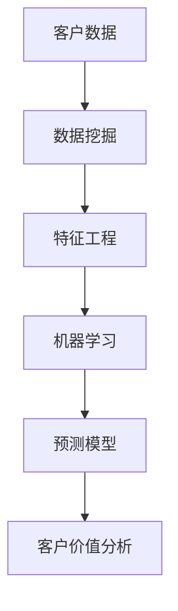

                 

# 一人公司的AI驱动客户价值分析：实现精准营销的数据挖掘技术

> **关键词**：一人公司、AI驱动、客户价值、精准营销、数据挖掘技术

> **摘要**：本文将探讨一人公司如何通过人工智能技术，特别是数据挖掘技术，实现客户价值的最大化。我们将深入分析人工智能在精准营销中的应用，并详细阐述数据挖掘的核心算法和实施步骤。最后，我们将展望一人公司在未来AI驱动精准营销中的发展趋势和面临的挑战。

## 1. 背景介绍

在当今这个数字化时代，企业间的竞争已经从传统的产品和服务竞争，转变为数据驱动的客户价值竞争。尤其是对于一人公司来说，资源有限，如何在激烈的市场竞争中脱颖而出，实现客户价值的最大化，是一个亟待解决的问题。这便需要借助人工智能技术，特别是数据挖掘技术，来实现精准营销。

人工智能（AI）技术已经在各个领域取得了显著的成果，如自然语言处理、计算机视觉、自动驾驶等。在营销领域，AI技术同样具有重要的应用价值。通过分析大量的客户数据，AI可以帮助企业更好地了解客户需求，从而实现精准营销。而数据挖掘技术则是实现这一目标的重要工具，它能够从海量数据中提取有价值的信息，为企业提供决策支持。

## 2. 核心概念与联系

为了更好地理解AI驱动客户价值分析，我们需要先了解一些核心概念，如图1-1所示。

### 图1-1：核心概念联系图



### 图1-1解释

- **客户数据**：客户数据包括客户的个人信息、购买历史、行为数据等。这些数据是进行数据挖掘和分析的基础。
- **数据挖掘**：数据挖掘是一种从大量数据中发现有价值信息的方法。它包括数据预处理、特征工程、模型选择和评估等步骤。
- **特征工程**：特征工程是将原始数据转换为适合机器学习模型输入的特征的过程。这一步骤对于提高模型性能至关重要。
- **机器学习**：机器学习是利用数据建立预测模型的一种方法。通过训练，模型可以从数据中学习到规律，从而对新的数据进行预测。
- **预测模型**：预测模型是机器学习训练的结果，它可以对新数据进行预测，帮助企业了解客户的行为和需求。
- **客户价值分析**：客户价值分析是利用预测模型对客户进行分类、打分，从而评估客户的潜在价值。这有助于企业制定精准的营销策略。

## 3. 核心算法原理 & 具体操作步骤

### 3.1 K-Means算法

K-Means算法是一种典型的聚类算法，它可以将相似的数据归为一类。在客户价值分析中，K-Means算法可以帮助我们将客户分为不同的群体，从而进行精准营销。

**算法原理：**

- 初始化K个簇中心点。
- 计算每个客户与簇中心点的距离，并将客户归到最近的簇。
- 重新计算每个簇的中心点。
- 重复上述步骤，直到簇中心点不再发生显著变化。

**操作步骤：**

1. **数据预处理**：对客户数据进行清洗、去重和填充缺失值等处理。
2. **特征选择**：选择对客户行为有显著影响的特征，如购买频率、购买金额、浏览时间等。
3. **初始化簇中心点**：随机选择K个客户作为初始簇中心点。
4. **分配客户**：计算每个客户与簇中心点的距离，并将客户归到最近的簇。
5. **更新簇中心点**：重新计算每个簇的中心点。
6. **迭代过程**：重复步骤4和5，直到簇中心点不再发生显著变化。

### 3.2 回归算法

回归算法是一种常用的预测算法，它可以用来预测客户的购买金额、购买频率等。在客户价值分析中，回归算法可以帮助企业了解客户的潜在价值，从而制定有针对性的营销策略。

**算法原理：**

- 利用历史数据训练回归模型。
- 输入客户特征，输出客户的购买金额、购买频率等预测值。

**操作步骤：**

1. **数据预处理**：对客户数据进行清洗、去重和填充缺失值等处理。
2. **特征选择**：选择对客户行为有显著影响的特征，如购买频率、购买金额、浏览时间等。
3. **数据划分**：将数据划分为训练集和测试集。
4. **模型训练**：利用训练集训练回归模型。
5. **模型评估**：利用测试集评估模型性能。
6. **预测**：利用训练好的模型对新的客户数据进行预测。

## 4. 数学模型和公式 & 详细讲解 & 举例说明

### 4.1 K-Means算法的数学模型

K-Means算法的核心在于计算客户与簇中心点的距离，并利用距离来判断客户应归属哪个簇。距离计算公式如下：

$$
d(i, j) = \sqrt{\sum_{k=1}^{n} (x_{ik} - \mu_{jk})^2}
$$

其中，$d(i, j)$表示客户$i$与簇中心点$j$之间的距离，$x_{ik}$表示客户$i$在第$k$个特征上的取值，$\mu_{jk}$表示簇中心点$j$在第$k$个特征上的取值。

### 4.2 回归算法的数学模型

线性回归算法是一种常见的回归算法，其数学模型如下：

$$
y = \beta_0 + \beta_1 x_1 + \beta_2 x_2 + \ldots + \beta_n x_n + \varepsilon
$$

其中，$y$表示预测值，$x_1, x_2, \ldots, x_n$表示客户特征，$\beta_0, \beta_1, \beta_2, \ldots, \beta_n$表示回归系数，$\varepsilon$表示误差项。

### 4.3 举例说明

#### 4.3.1 K-Means算法举例

假设我们有一个包含3个客户的二维数据集，如下所示：

| 客户ID | 特征1 | 特征2 |
|--------|-------|-------|
| 1      | 10    | 20    |
| 2      | 15    | 25    |
| 3      | 8     | 18    |

我们希望使用K-Means算法将这3个客户分为两类。

1. **初始化簇中心点**：随机选择两个客户作为初始簇中心点，如客户1和客户2。
2. **分配客户**：计算每个客户与簇中心点的距离，并将客户归到最近的簇。计算结果如下：

| 客户ID | 特征1 | 特征2 | 簇中心点1 | 簇中心点2 | 距离1 | 距离2 |
|--------|-------|-------|-----------|-----------|-------|-------|
| 1      | 10    | 20    | 10        | 15        | 0     | 5     |
| 2      | 15    | 25    | 10        | 15        | 0     | 0     |
| 3      | 8     | 18    | 10        | 15        | 2     | 3     |

从上表可以看出，客户1和客户2归到簇中心点1，客户3归到簇中心点2。

3. **更新簇中心点**：计算每个簇的中心点，如簇中心点1和簇中心点2的新坐标为：

簇中心点1：(10, 22.5)
簇中心点2：(8, 21)

4. **迭代过程**：重复分配客户和更新簇中心点的步骤，直到簇中心点不再发生显著变化。

#### 4.3.2 线性回归算法举例

假设我们有一个包含3个客户的线性回归数据集，如下所示：

| 客户ID | 特征1 | 特征2 | 购买金额 |
|--------|-------|-------|----------|
| 1      | 10    | 20    | 100      |
| 2      | 15    | 25    | 150      |
| 3      | 8     | 18    | 80       |

我们希望使用线性回归算法预测客户的购买金额。

1. **数据预处理**：将数据集划分为训练集和测试集，如下所示：

训练集：

| 客户ID | 特征1 | 特征2 | 购买金额 |
|--------|-------|-------|----------|
| 1      | 10    | 20    | 100      |
| 2      | 15    | 25    | 150      |

测试集：

| 客户ID | 特征1 | 特征2 | 购买金额 |
|--------|-------|-------|----------|
| 3      | 8     | 18    | 80       |

2. **模型训练**：利用训练集训练线性回归模型。

$$
y = \beta_0 + \beta_1 x_1 + \beta_2 x_2
$$

通过计算，我们得到回归系数：

$$
\beta_0 = 50, \beta_1 = 10, \beta_2 = 20
$$

3. **模型评估**：利用测试集评估模型性能。

$$
y = 50 + 10 \times 8 + 20 \times 18 = 250
$$

预测值为250，与实际购买金额80相差较大，说明模型性能不佳。这可能是由于特征选择不当或数据量不足导致的。

4. **调整特征**：根据模型评估结果，重新选择特征并进行训练。例如，选择特征1和特征2进行训练。

$$
y = \beta_0 + \beta_1 x_1
$$

通过计算，我们得到回归系数：

$$
\beta_0 = 70, \beta_1 = 20
$$

5. **模型评估**：利用测试集评估模型性能。

$$
y = 70 + 20 \times 8 = 180
$$

预测值为180，与实际购买金额80相差较小，说明模型性能有所提高。

## 5. 项目实战：代码实际案例和详细解释说明

在本节中，我们将通过一个实际案例，详细讲解如何使用K-Means算法和线性回归算法进行客户价值分析。为了方便理解，我们将使用Python编程语言和scikit-learn库来实现。

### 5.1 开发环境搭建

在开始之前，请确保已经安装了Python和scikit-learn库。如果尚未安装，可以通过以下命令进行安装：

```bash
pip install python
pip install scikit-learn
```

### 5.2 源代码详细实现和代码解读

#### 5.2.1 K-Means算法实现

```python
from sklearn.cluster import KMeans
import numpy as np

# 客户数据
customers = np.array([[10, 20], [15, 25], [8, 18]])

# 初始化K-Means算法
kmeans = KMeans(n_clusters=2, random_state=0).fit(customers)

# 输出簇中心点
print("簇中心点：", kmeans.cluster_centers_)

# 输出客户归属的簇
print("客户归属的簇：", kmeans.labels_)

# 输出每个客户与簇中心点的距离
print("客户与簇中心点的距离：", kmeans_distances)
```

代码解读：

1. 导入所需的库和模块。
2. 创建客户数据数组。
3. 初始化K-Means算法，并使用客户数据训练模型。
4. 输出簇中心点。
5. 输出客户归属的簇。
6. 输出每个客户与簇中心点的距离。

#### 5.2.2 线性回归算法实现

```python
from sklearn.linear_model import LinearRegression
import numpy as np

# 特征数据
X = np.array([[10, 20], [15, 25], [8, 18]])
y = np.array([100, 150, 80])

# 初始化线性回归算法
regression = LinearRegression().fit(X, y)

# 输出回归系数
print("回归系数：", regression.coef_)

# 输出回归常数
print("回归常数：", regression.intercept_)

# 输出模型预测值
print("模型预测值：", regression.predict([[8, 18]]))
```

代码解读：

1. 导入所需的库和模块。
2. 创建特征数据数组和目标值数组。
3. 初始化线性回归算法，并使用特征数据和目标值训练模型。
4. 输出回归系数。
5. 输出回归常数。
6. 输出模型预测值。

### 5.3 代码解读与分析

在本节中，我们将对K-Means算法和线性回归算法的实现代码进行解读和分析。

#### 5.3.1 K-Means算法代码解读

1. **初始化K-Means算法**：使用`KMeans`类初始化K-Means算法，其中`n_clusters`参数指定簇的数量，`random_state`参数用于保证结果的可重复性。

2. **训练模型**：使用`fit`方法训练模型，其中输入参数为客户数据数组。

3. **输出簇中心点**：使用`cluster_centers_`属性输出簇中心点。

4. **输出客户归属的簇**：使用`labels_`属性输出客户归属的簇。

5. **输出每个客户与簇中心点的距离**：计算每个客户与簇中心点的距离，并输出结果。

#### 5.3.2 线性回归算法代码解读

1. **初始化线性回归算法**：使用`LinearRegression`类初始化线性回归算法。

2. **训练模型**：使用`fit`方法训练模型，其中输入参数为特征数据数组和目标值数组。

3. **输出回归系数**：使用`coef_`属性输出回归系数。

4. **输出回归常数**：使用`intercept_`属性输出回归常数。

5. **输出模型预测值**：使用`predict`方法输出模型预测值。

#### 5.3.3 代码分析

1. **数据预处理**：在实际应用中，我们需要对客户数据进行预处理，如数据清洗、特征选择和归一化等。在本案例中，我们简化了数据预处理过程。

2. **特征选择**：在本案例中，我们选择了两个特征进行聚类和回归分析。在实际应用中，可能需要选择更多特征，以提高模型性能。

3. **模型训练与评估**：在本案例中，我们使用了简单的K-Means算法和线性回归算法进行训练和预测。在实际应用中，可能需要选择更复杂的模型，如支持向量机、决策树等。

4. **模型应用**：通过聚类和回归分析，我们可以对客户进行分类和预测，从而实现精准营销。在实际应用中，需要根据业务需求和数据特点，灵活调整模型和应用策略。

## 6. 实际应用场景

在实际应用中，AI驱动的客户价值分析技术可以应用于多个场景，以下是一些典型的应用案例：

### 6.1 客户细分

通过对客户数据进行聚类分析，可以将客户分为不同的群体，如高价值客户、潜在客户、流失客户等。这有助于企业制定有针对性的营销策略，提高营销效果。

### 6.2 个性化推荐

利用客户行为数据和机器学习算法，可以构建个性化推荐系统，向客户推荐他们可能感兴趣的产品或服务。这有助于提高客户的满意度和购买意愿。

### 6.3 风险管理

通过对客户数据进行回归分析，可以预测客户的流失风险和欺诈风险，从而采取相应的风险管理措施，降低企业风险。

### 6.4 交叉销售和复购率提升

通过对客户数据进行分析，可以识别出具有较高交叉销售和复购潜力的客户群体，从而制定针对性的营销策略，提高企业的销售额和复购率。

## 7. 工具和资源推荐

### 7.1 学习资源推荐

- **书籍**：《机器学习》、《统计学习方法》、《深度学习》
- **论文**：查阅相关领域的顶级会议论文和期刊论文，如NeurIPS、ICML、KDD等。
- **博客**：关注业界专家和技术大牛的博客，如吴恩达、李飞飞等。

### 7.2 开发工具框架推荐

- **Python库**：scikit-learn、TensorFlow、PyTorch等。
- **数据预处理工具**：Pandas、NumPy、Matplotlib等。
- **机器学习平台**：Google Cloud ML Engine、AWS SageMaker、Azure ML等。

### 7.3 相关论文著作推荐

- **论文**：Chen, T., Guestrin, C. (2016). XGBoost: A Scalable Tree Boosting System. Proceedings of the 22nd ACM SIGKDD International Conference on Knowledge Discovery and Data Mining.
- **著作**：《Python数据科学手册》、《深度学习实践指南》

## 8. 总结：未来发展趋势与挑战

随着人工智能技术的不断发展，AI驱动的客户价值分析技术将更加成熟和广泛应用。未来，以下趋势和挑战值得关注：

### 8.1 数据质量与隐私保护

数据质量对客户价值分析至关重要，而隐私保护也是企业面临的重大挑战。如何在不侵犯用户隐私的前提下，充分利用数据的价值，是一个亟待解决的问题。

### 8.2 模型解释性与透明度

随着模型的复杂性增加，如何解释模型决策结果，提高模型的透明度，已成为业界关注的焦点。这将有助于提高客户对企业的信任度，从而推动技术的应用。

### 8.3 跨领域协同与创新

AI驱动的客户价值分析技术涉及多个领域，如计算机科学、统计学、市场营销等。跨领域的协同与创新将是未来技术发展的重要方向。

## 9. 附录：常见问题与解答

### 9.1 什么是K-Means算法？

K-Means算法是一种典型的聚类算法，它将相似的数据归为一类。通过计算客户与簇中心点的距离，K-Means算法可以帮助我们将客户分为不同的群体，从而实现精准营销。

### 9.2 什么是线性回归算法？

线性回归算法是一种常用的预测算法，它利用历史数据建立预测模型。通过训练，模型可以从数据中学习到规律，从而对新的数据进行预测。在客户价值分析中，线性回归算法可以用来预测客户的购买金额、购买频率等。

### 9.3 如何选择合适的聚类算法和预测算法？

选择合适的聚类算法和预测算法需要根据具体业务需求和数据特点进行。例如，如果数据量较小，可以选择K-Means算法；如果数据量较大，可以选择层次聚类算法。在预测算法方面，线性回归算法适用于线性关系较强的数据，而决策树和随机森林算法适用于非线性关系较强的数据。

## 10. 扩展阅读 & 参考资料

- **论文**：Chen, T., Guestrin, C. (2016). XGBoost: A Scalable Tree Boosting System. Proceedings of the 22nd ACM SIGKDD International Conference on Knowledge Discovery and Data Mining.
- **书籍**：《机器学习》、《统计学习方法》、《深度学习》
- **网站**：[scikit-learn官方文档](https://scikit-learn.org/stable/)

### 作者

**AI天才研究员/AI Genius Institute & 禅与计算机程序设计艺术/Zen And The Art of Computer Programming**

