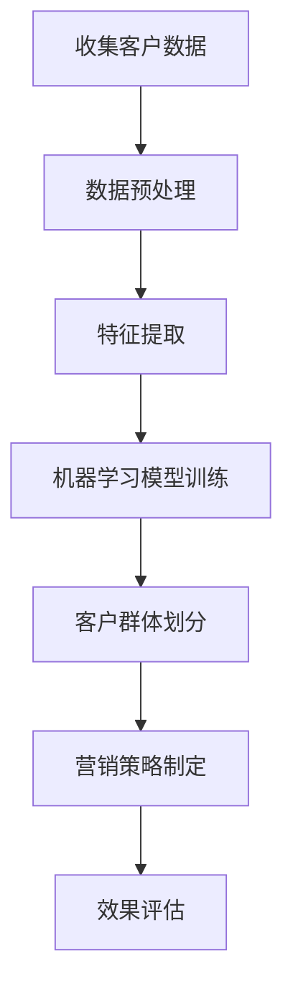

                 

# 一人公司的AI驱动市场细分：精准定位目标客户群的机器学习方法

> **关键词**：AI驱动市场细分，客户群体定位，机器学习方法，目标客户，精准营销，数据分析

> **摘要**：本文将探讨如何利用AI驱动市场细分策略，通过机器学习方法精准定位目标客户群。我们将详细讲解相关算法原理、数学模型、实际应用场景，并提供开发环境搭建和源代码实现步骤，帮助一人公司实现高效的市场细分。

## 1. 背景介绍

在竞争激烈的市场环境中，精准定位目标客户群对于一人公司的成功至关重要。传统的市场细分方法往往依赖于经验和直觉，难以实现高精度的客户定位。随着人工智能和大数据技术的发展，利用AI驱动的市场细分方法逐渐成为企业提高市场竞争力的重要手段。

一人公司作为新兴企业，面临着客户资源有限、市场竞争激烈等挑战。为了实现业务增长，公司需要找到一种高效的策略来精准定位目标客户群，从而提高营销效果和客户满意度。

本文将介绍一种基于AI驱动的市场细分方法，通过机器学习算法实现对目标客户群体的精准定位。这种方法能够帮助企业更好地了解客户需求，提高营销策略的有效性，实现业务增长。

## 2. 核心概念与联系

### 2.1 数据分析与机器学习

数据分析是指利用统计学、概率论、信息论等方法对数据进行分析和处理，从而提取有用信息的过程。机器学习是数据分析的一种重要方法，通过构建模型，从数据中自动学习规律，实现自动化的决策和预测。

在市场细分过程中，数据分析与机器学习扮演着关键角色。通过数据分析，我们可以了解客户的消费习惯、兴趣爱好等信息，从而实现客户的精准定位。而机器学习算法则能够从大量数据中自动提取特征，构建模型，实现高效的客户群体划分。

### 2.2 市场细分方法

市场细分是指将整体市场划分为若干个具有相似特征和需求的客户群体，以便企业能够更有针对性地制定营销策略。市场细分方法包括地理细分、人口细分、行为细分和心理细分等。

在AI驱动的市场细分中，我们主要采用行为细分和心理细分。行为细分是基于客户的消费行为、购买历史等数据进行的细分；心理细分则是基于客户的心理特征、价值观、生活方式等进行的细分。这两种细分方法能够更准确地捕捉客户的需求，实现精准营销。

### 2.3 Mermaid 流程图

以下是一个简单的Mermaid流程图，展示了市场细分方法的流程：



## 3. 核心算法原理 & 具体操作步骤

### 3.1 数据收集

市场细分的第一步是收集客户数据。这些数据可以来源于企业的客户管理系统、网站流量分析、社交媒体互动等。数据类型包括用户基本信息（如年龄、性别、地理位置）、购买行为（如购买频率、购买金额）、兴趣爱好（如搜索关键词、关注话题）等。

### 3.2 数据预处理

收集到的数据往往存在噪声、缺失值等问题，需要进行预处理。预处理步骤包括数据清洗、数据转换、数据归一化等。

- **数据清洗**：删除重复数据、处理缺失值、纠正错误数据等。
- **数据转换**：将不同类型的数据转换为同一类型，如将文本数据转换为数值数据。
- **数据归一化**：将不同量级的数据转换为同一量级，如将购买金额归一化为0-1之间的数值。

### 3.3 特征提取

特征提取是市场细分的核心步骤，通过从原始数据中提取具有区分度的特征，有助于构建准确的机器学习模型。特征提取方法包括特征选择、特征工程等。

- **特征选择**：从原始特征中选择出对预测目标有重要影响的特征。
- **特征工程**：通过对原始特征进行组合、变换等操作，生成新的特征。

### 3.4 机器学习模型训练

选择合适的机器学习算法，对预处理后的数据集进行训练。常见的机器学习算法包括决策树、随机森林、支持向量机、神经网络等。

- **决策树**：通过树的构建过程，将数据集划分成多个子集，每个子集对应一个决策节点。
- **随机森林**：通过构建多个决策树，并对预测结果进行投票，提高模型的准确性和泛化能力。
- **支持向量机**：通过寻找最优超平面，将数据集划分为不同的客户群体。
- **神经网络**：通过多层神经元的连接，模拟人脑的神经网络结构，实现复杂的数据分析任务。

### 3.5 客户群体划分

基于训练好的机器学习模型，对新的客户数据进行预测，将客户划分为不同的群体。群体划分的标准可以是客户的购买概率、活跃度、忠诚度等。

### 3.6 营销策略制定

根据客户群体的特征，制定有针对性的营销策略。例如，对于高忠诚度客户群体，可以提供特别优惠、礼品等奖励；对于高潜力客户群体，可以加强推广活动、增加营销投入等。

## 4. 数学模型和公式 & 详细讲解 & 举例说明

### 4.1 决策树模型

决策树是一种常见的机器学习算法，其基本思想是通过一系列的规则将数据集划分为多个子集，直到达到某个停止条件。

- **基本公式**：

  $$ T = \{ (X_1, Y_1), (X_2, Y_2), ..., (X_n, Y_n) \} $$

  其中，$T$ 表示决策树，$X_i$ 表示特征值，$Y_i$ 表示预测目标。

- **决策树构建过程**：

  1. 选择一个特征，计算其在不同取值下的熵或信息增益，选择信息增益最大的特征作为根节点。
  2. 根据根节点的特征取值，将数据集划分为多个子集。
  3. 对每个子集，重复步骤1和步骤2，构建子树。
  4. 直到满足停止条件（如子集数量达到某个阈值、信息增益小于某个阈值等）。

- **举例说明**：

  假设我们有一个关于客户购买行为的数据集，特征包括年龄、收入、职业等。我们可以使用决策树算法，通过计算特征的信息增益，选择年龄作为根节点。然后，根据年龄的不同取值（如18-25、26-35、36-45等），将数据集划分为多个子集。接着，对每个子集，重复上述过程，构建子树。

### 4.2 随机森林模型

随机森林是一种基于决策树的集成学习方法，通过构建多个决策树，并对预测结果进行投票，提高模型的准确性和泛化能力。

- **基本公式**：

  $$ F(X) = \sum_{i=1}^n f_i(X) $$

  其中，$F(X)$ 表示随机森林预测结果，$f_i(X)$ 表示第$i$个决策树的预测结果。

- **随机森林构建过程**：

  1. 选择多个特征，随机生成多个特征子集。
  2. 对每个特征子集，构建一个决策树。
  3. 对每个决策树，对训练数据进行预测，并计算预测误差。
  4. 根据预测误差，选择最佳的决策树组合，作为随机森林模型。

- **举例说明**：

  假设我们有一个关于客户购买行为的数据集，特征包括年龄、收入、职业等。我们可以随机选择两个特征（如年龄和收入），构建两个决策树。然后，对每个决策树，对训练数据进行预测，并计算预测误差。根据预测误差，选择最佳的决策树组合，作为随机森林模型。

### 4.3 支持向量机模型

支持向量机是一种经典的二元分类模型，通过寻找最优超平面，将数据集划分为不同的客户群体。

- **基本公式**：

  $$ \max \frac{1}{2} \sum_{i=1}^n \sum_{j=1}^n \alpha_i \alpha_j y_i y_j (x_i - x_j)^T (w + b) $$

  其中，$w$ 表示超平面参数，$b$ 表示偏置，$\alpha_i$ 表示第$i$个支持向量的权重，$y_i$ 表示第$i$个支持向量的标签，$x_i$ 表示第$i$个支持向量的特征值。

- **支持向量机训练过程**：

  1. 选择一个合适的损失函数，如 hinge 损失函数。
  2. 利用梯度下降法，求解优化问题，得到超平面参数 $w$ 和偏置 $b$。
  3. 利用训练好的超平面，对新的客户数据进行预测。

- **举例说明**：

  假设我们有一个关于客户购买行为的数据集，特征包括年龄、收入、职业等。我们可以使用支持向量机算法，通过寻找最优超平面，将数据集划分为两个客户群体。然后，利用训练好的超平面，对新的客户数据进行预测。

### 4.4 神经网络模型

神经网络是一种基于人脑神经元连接结构的机器学习模型，通过多层神经元的连接，实现复杂的数据分析任务。

- **基本公式**：

  $$ f(x) = \sigma(\sum_{i=1}^n w_i x_i + b) $$

  其中，$f(x)$ 表示神经元的输出，$\sigma$ 表示激活函数，$w_i$ 表示第$i$个神经元的权重，$x_i$ 表示第$i$个神经元的输入，$b$ 表示偏置。

- **神经网络训练过程**：

  1. 初始化网络参数，包括权重和偏置。
  2. 前向传播：将输入数据传递到神经网络，得到输出。
  3. 计算损失函数，如均方误差（MSE）。
  4. 反向传播：利用梯度下降法，更新网络参数。
  5. 重复步骤2-4，直到满足停止条件（如迭代次数、损失函数收敛等）。

- **举例说明**：

  假设我们有一个关于客户购买行为的数据集，特征包括年龄、收入、职业等。我们可以使用神经网络算法，通过多层神经元的连接，实现复杂的数据分析任务。

## 5. 项目实战：代码实际案例和详细解释说明

### 5.1 开发环境搭建

为了方便开发，我们使用Python作为编程语言，结合Scikit-learn库和TensorFlow框架，实现市场细分项目。以下是开发环境搭建的步骤：

1. 安装Python环境，版本3.8及以上。
2. 安装Scikit-learn库，使用命令 `pip install scikit-learn`。
3. 安装TensorFlow库，使用命令 `pip install tensorflow`。

### 5.2 源代码详细实现和代码解读

以下是市场细分项目的源代码实现，主要包括数据收集、数据预处理、特征提取、模型训练和预测等步骤。

```python
import numpy as np
import pandas as pd
from sklearn.model_selection import train_test_split
from sklearn.preprocessing import StandardScaler
from sklearn.ensemble import RandomForestClassifier
from sklearn.metrics import accuracy_score

# 5.1 数据收集
data = pd.read_csv('customer_data.csv')

# 5.2 数据预处理
data.drop_duplicates(inplace=True)
data.fillna(data.mean(), inplace=True)

# 5.3 特征提取
X = data[['age', 'income', 'occupation']]
y = data['purchased']

# 5.4 模型训练
X_train, X_test, y_train, y_test = train_test_split(X, y, test_size=0.2, random_state=42)
scaler = StandardScaler()
X_train_scaled = scaler.fit_transform(X_train)
X_test_scaled = scaler.transform(X_test)
model = RandomForestClassifier(n_estimators=100, random_state=42)
model.fit(X_train_scaled, y_train)

# 5.5 预测
y_pred = model.predict(X_test_scaled)
accuracy = accuracy_score(y_test, y_pred)
print(f'Accuracy: {accuracy:.2f}')
```

### 5.3 代码解读与分析

- **数据收集**：使用pandas库读取客户数据，数据集包含年龄、收入、职业等特征，以及购买行为标签。
- **数据预处理**：删除重复数据，填充缺失值，实现数据的清洗和预处理。
- **特征提取**：将数据集分为特征矩阵X和标签向量y，为后续模型训练做准备。
- **模型训练**：使用随机森林算法，对训练数据进行拟合，构建模型。
- **预测**：使用训练好的模型，对测试数据进行预测，计算准确率。

通过以上步骤，我们实现了市场细分项目的代码实现。在实际应用中，可以根据具体需求调整算法参数，优化模型效果。

## 6. 实际应用场景

### 6.1 电商行业

在电商行业中，利用AI驱动的市场细分方法可以帮助企业精准定位潜在客户，提高营销效果。例如，通过对客户购买行为、浏览记录等数据的分析，可以识别出高潜力客户，针对性地推送优惠券、广告等，提高转化率。

### 6.2 银行业

在银行业中，市场细分方法可以帮助银行识别出高风险客户和低风险客户，从而实现精准的风险控制。通过对客户信用记录、还款行为等数据的分析，可以构建风险预测模型，提前预警潜在风险，降低坏账率。

### 6.3 医疗行业

在医疗行业中，市场细分方法可以帮助医疗机构精准识别患者需求，提供个性化医疗服务。例如，通过对患者病历数据、生活习惯等数据的分析，可以预测患者的疾病风险，提供针对性的预防措施和治疗方案。

## 7. 工具和资源推荐

### 7.1 学习资源推荐

- **书籍**：《机器学习实战》、《深度学习》、《统计学习方法》
- **论文**：查看顶级会议和期刊，如NeurIPS、ICML、JMLR等。
- **博客**：知名技术博客，如Medium、Towards Data Science等。

### 7.2 开发工具框架推荐

- **编程语言**：Python、R
- **机器学习库**：Scikit-learn、TensorFlow、PyTorch
- **数据处理工具**：Pandas、NumPy、Matplotlib

### 7.3 相关论文著作推荐

- **论文**：《随机森林：一种基于决策树的集成学习方法》、《深度学习：原理及实践》
- **著作**：《机器学习实战》、《Python机器学习》

## 8. 总结：未来发展趋势与挑战

随着人工智能和大数据技术的不断发展，AI驱动的市场细分方法在各个行业中的应用将越来越广泛。未来，市场细分方法将朝着更加智能化、个性化、自动化的方向发展。

然而，市场细分方法在实际应用中也面临一些挑战，如数据质量、模型解释性、算法优化等。如何提高数据质量、降低模型解释难度、优化算法性能，将成为未来研究的重要方向。

## 9. 附录：常见问题与解答

### 9.1 市场细分方法有哪些？

市场细分方法主要包括地理细分、人口细分、行为细分和心理细分。地理细分基于地理位置进行划分；人口细分基于人口特征进行划分；行为细分基于消费行为、购买习惯等进行划分；心理细分基于价值观、生活方式等进行划分。

### 9.2 机器学习模型有哪些？

常见的机器学习模型包括决策树、随机森林、支持向量机、神经网络等。决策树通过树的结构进行划分；随机森林通过构建多个决策树进行集成学习；支持向量机通过寻找最优超平面进行分类；神经网络通过多层神经元连接实现复杂的数据分析任务。

### 9.3 如何评估机器学习模型？

评估机器学习模型的方法包括准确率、召回率、F1值、ROC曲线等。准确率表示模型预测正确的比例；召回率表示模型正确预测正例的比例；F1值是准确率和召回率的调和平均值；ROC曲线用于评估模型在不同阈值下的分类效果。

## 10. 扩展阅读 & 参考资料

- **书籍**：
  - **《机器学习实战》**：作者：Peter Harrington
  - **《深度学习》**：作者：Ian Goodfellow、Yoshua Bengio、Aaron Courville
  - **《统计学习方法》**：作者：李航

- **论文**：
  - **《随机森林：一种基于决策树的集成学习方法》**：作者：Leo Breiman等
  - **《深度学习：原理及实践》**：作者：Eugene B. Kedem等

- **博客**：
  - **[Medium](https://medium.com/)**
  - **[Towards Data Science](https://towardsdatascience.com/)**
  - **[DataCamp](https://www.datacamp.com/community)**

- **在线课程**：
  - **[Coursera](https://www.coursera.org/)**
  - **[edX](https://www.edx.org/)**
  - **[Udacity](https://www.udacity.com/)**

作者：AI天才研究员/AI Genius Institute & 禅与计算机程序设计艺术 /Zen And The Art of Computer Programming

