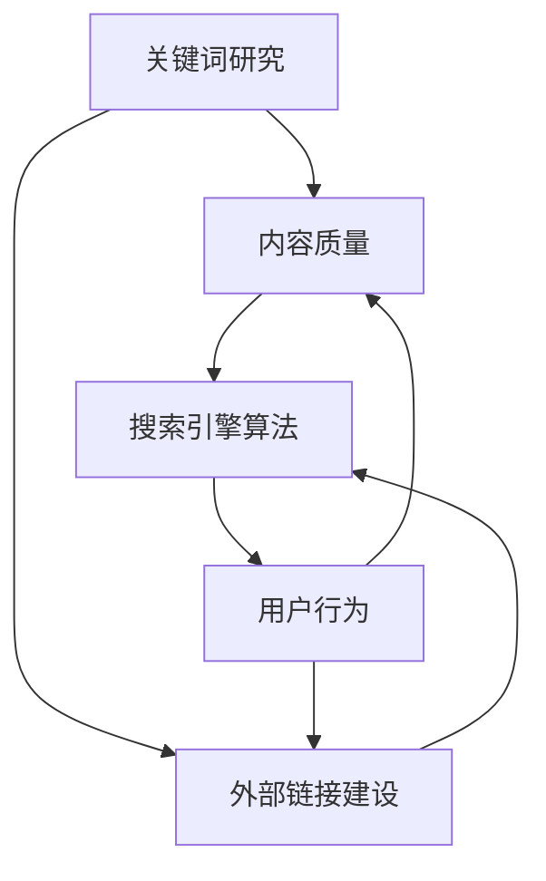

                 

### 1. 背景介绍

在当今数字化时代，搜索引擎优化（SEO）已成为企业和个人推广其在线内容的重要手段。SEO不仅关系到网站在搜索引擎结果页面（SERP）中的排名，还直接影响网站的访问量和用户转化率。对于一个只有一位员工的创业公司而言，如何有效地利用有限的资源和时间来制定并执行SEO策略，显得尤为关键。

本文将围绕一人公司的SEO策略展开讨论，旨在提供一套系统、可操作的长期SEO方案，帮助个人创业者在竞争激烈的市场中脱颖而出。文章首先介绍SEO的基本概念和重要性，接着分析SEO与搜索引擎算法的关系，然后详细阐述SEO策略的核心组成部分，如关键词研究、内容优化、外部链接建设等。此外，文章还会提供实际操作步骤和案例分析，以及相关工具和资源的推荐，帮助读者更好地理解和实施SEO策略。

最后，文章将总结未来SEO的发展趋势和挑战，并给出一些建议，以帮助读者持续优化其SEO策略，实现长期增长。通过本文的阅读，读者将获得关于SEO策略的全面理解和实战指导，从而为个人公司的在线推广奠定坚实基础。

### 2. 核心概念与联系

要理解一人公司的SEO策略，我们首先需要明确几个核心概念，并探讨它们之间的相互关系。以下是本文涉及的主要概念及其在SEO策略中的重要性：

#### 关键词（Keywords）

关键词是用户在搜索引擎中输入的词语或短语，用于搜索相关信息。它们是SEO策略的基础，因为通过研究并选择合适的关键词，可以确保网站内容能够被潜在用户找到。关键词研究的准确性直接影响到SEO效果。

#### 搜索引擎算法（Search Engine Algorithms）

搜索引擎算法是搜索引擎用于评估和排序网页的一系列规则和公式。常见的搜索引擎算法包括Google的PageRank、百度的新时代算法等。算法的更新和改进不断影响着SEO策略的有效性。

#### 内容质量（Content Quality）

内容质量是SEO的核心要素之一。高质量的、原创的内容不仅能够提高用户留存率和转化率，还能增加搜索引擎对网页的评分，从而提升排名。

#### 外部链接（Backlinks）

外部链接是指其他网站指向你网站的链接。它们在SEO中扮演重要角色，因为搜索引擎认为外部链接是对网站内容价值的认可。高质量的、相关的外部链接有助于提高网站的权威性和可信度。

#### 用户行为（User Behavior）

用户行为数据，如点击率（Click-Through Rate, CTR）、页面停留时间等，反映了用户对网站内容的反应。这些数据有助于搜索引擎更好地理解用户需求，进而优化搜索结果。

下面是一个使用Mermaid绘制的流程图，展示了这些概念在SEO策略中的相互关系：



在这个流程图中，我们可以看到关键词研究是整个SEO策略的起点，它直接影响内容质量和外部链接建设。搜索引擎算法通过分析这些因素来确定网页的排名。用户行为数据则反馈给搜索引擎和网站，进一步优化SEO策略。

通过理解这些核心概念及其相互关系，一人公司的SEO策略将更加系统化和有针对性，从而实现长期增长。

### 3. 核心算法原理 & 具体操作步骤

在了解了SEO策略中的核心概念后，我们接下来深入探讨SEO的核心算法原理及其具体操作步骤。SEO算法的原理复杂且不断进化，但基本思路是通过评估网页的相关性、质量和权威性来决定其在搜索结果中的排名。

#### Google的PageRank算法

PageRank是Google早期使用的一种算法，主要基于网页之间的链接关系评估其重要性。算法的基本原理是：一个网页得到的链接越多，它的权重越高，从而在搜索结果中排名越靠前。具体步骤如下：

1. **构建网页链接图**：将整个互联网视为一个巨大的图，每个网页是一个节点，网页之间的链接视为边。

2. **分配权重**：每个网页的初始权重相同，然后通过链接传递权重。一个网页得到的权重不仅取决于链接的数量，还取决于链接页面的权重。

3. **迭代计算**：通过多次迭代计算，逐步更新每个网页的权重，直到收敛到稳定状态。

#### 百度的新时代算法

百度的新时代算法在PageRank的基础上进行了优化，更注重内容质量和用户体验。其核心原理包括：

1. **内容质量评估**：通过对网页内容进行深度分析，评估其原创性、丰富性和相关性。

2. **用户行为数据**：收集用户在搜索结果页面上的点击、停留、跳失等行为数据，用于优化搜索结果排序。

3. **链接分析**：不仅考虑链接的数量，还关注链接的质量和相关性。

#### SEO的具体操作步骤

1. **关键词研究**：使用工具如Google关键词规划师、百度关键词规划师等，研究目标用户经常搜索的关键词。选择具有高搜索量但竞争较小的长尾关键词。

2. **内容优化**：根据关键词编写高质量、原创的内容，确保内容的相关性、可读性和用户体验。使用SEO友好的标题、描述和内部链接，提高内容质量。

3. **外部链接建设**：通过内容营销、合作伙伴关系、社交媒体推广等方式获取高质量的外部链接。

4. **技术优化**：确保网站的技术基础良好，如网站速度、移动友好性、安全性等，提高用户访问体验。

5. **监控与调整**：定期监控SEO效果，根据数据反馈调整策略，如优化关键词、内容调整、链接建设等。

通过这些操作步骤，一人公司可以逐步提升其网站在搜索引擎中的排名，吸引更多潜在用户访问。SEO不仅需要长期的持续努力，还需要根据搜索引擎算法的更新不断调整策略，以保持竞争优势。

### 4. 数学模型和公式 & 详细讲解 & 举例说明

SEO的核心算法通常涉及多个数学模型和公式，用于评估网页的权重、相关性、质量和权威性。以下将详细解释一些关键的数学模型和公式，并通过实例说明其应用。

#### PageRank算法的数学模型

PageRank是一种基于链接分析的算法，其数学模型如下：

\[ PR(A) = \frac{1-d}{N} + d \sum_{B \in Links(A)} \frac{PR(B)}{L(B)} \]

其中：
- \( PR(A) \) 表示网页A的PageRank值。
- \( d \) 是阻尼系数，通常设为0.85，表示用户在浏览网页时，有15%的概率随机跳转至其他网页。
- \( N \) 是所有网页的总数。
- \( \sum_{B \in Links(A)} \frac{PR(B)}{L(B)} \) 表示网页A从其他网页B获得的链接权重之和。
- \( L(B) \) 是指向网页B的出链总数。

#### 阻尼系数（Damping Factor）

阻尼系数用于模拟现实中的情况，如用户在浏览网页时可能会随机跳转。例如，如果网页A有10个外部链接，其中5个链接指向其他网页，而阻尼系数为0.85，则：

\[ \frac{0.85 \times 5}{10} = 0.425 \]

即网页A的0.425权重会传递给其他链接的网页。

#### 关键词相关性计算

在SEO中，关键词相关性也是一个重要的因素。假设我们有两个关键词“SEO策略”和“搜索引擎优化”，可以使用TF-IDF（Term Frequency-Inverse Document Frequency）模型计算它们的相关性：

\[ \text{TF}(\text{关键词}) = \frac{\text{关键词在文档中出现的次数}}{\text{文档总单词数}} \]
\[ \text{IDF}(\text{关键词}) = \log \left( \frac{N}{n_k} \right) \]
\[ \text{关键词相关性} = \text{TF}(\text{关键词}) \times \text{IDF}(\text{关键词}) \]

其中：
- \( N \) 是文档总数。
- \( n_k \) 是包含关键词k的文档数。

例如，假设有100篇文档，其中30篇包含关键词“SEO策略”，则：

\[ \text{TF}(\text{SEO策略}) = \frac{30}{100} = 0.3 \]
\[ \text{IDF}(\text{SEO策略}) = \log \left( \frac{100}{30} \right) \approx 0.5108 \]
\[ \text{关键词相关性} = 0.3 \times 0.5108 = 0.1532 \]

通过这个例子，我们可以看到关键词“SEO策略”在文档中的重要性。

#### 举例说明

假设我们有一个网页，包含关键词“SEO策略”和“搜索引擎优化”，页面中有20次“SEO策略”的出现，10次“搜索引擎优化”的出现。文档总单词数为1000。

- TF("SEO策略") = 20/1000 = 0.02
- IDF("SEO策略") = log(1000/30) ≈ 0.5108
- 关键词相关性("SEO策略") = 0.02 \* 0.5108 = 0.0102

- TF("搜索引擎优化") = 10/1000 = 0.01
- IDF("搜索引擎优化") = log(1000/30) ≈ 0.5108
- 关键词相关性("搜索引擎优化") = 0.01 \* 0.5108 = 0.0051

通过上述计算，我们可以看到“SEO策略”比“搜索引擎优化”具有更高的关键词相关性。

通过理解这些数学模型和公式，一人公司可以更科学地制定和优化其SEO策略，从而提高网站在搜索引擎中的排名。

### 5. 项目实战：代码实际案例和详细解释说明

#### 开发环境搭建

在进行SEO策略的实际项目开发之前，我们需要搭建一个合适的开发环境。以下是所需的工具和步骤：

1. **文本编辑器**：推荐使用Visual Studio Code或Sublime Text，这些编辑器提供了丰富的插件支持，有助于提高开发效率。

2. **Node.js环境**：用于运行和测试JavaScript代码。可以从[Node.js官网](https://nodejs.org/)下载并安装。

3. **SEO工具**：如Google Analytics、Google Search Console、Ahrefs、SEMrush等。这些工具可以帮助我们进行关键词研究、网站分析、外部链接监控等。

4. **版本控制工具**：如Git，用于代码管理和协作开发。可以从[GitHub官网](https://github.com/)下载并安装。

#### 源代码详细实现和代码解读

以下是一个简单的SEO项目示例，用于监控关键词排名和外部链接。我们将使用Python和Scrapy框架来实现。

**步骤1：安装Scrapy**

在终端中运行以下命令安装Scrapy：

```bash
pip install scrapy
```

**步骤2：创建Scrapy项目**

在终端中运行以下命令创建一个新的Scrapy项目：

```bash
scrapy startproject keyword_monitor
```

**步骤3：创建爬虫**

进入项目目录，创建一个名为`keyword_spider.py`的爬虫文件。

```python
import scrapy

class KeywordSpider(scrapy.Spider):
    name = 'keyword_spider'
    allowed_domains = ['example.com']
    start_urls = ['https://www.example.com/']

    def parse(self, response):
        # 提取关键词和链接
        keywords = response.css('h1::text').getall()
        links = response.css('a::attr(href)').getall()
        
        # 保存数据
        for keyword, link in zip(keywords, links):
            yield {
                'keyword': keyword,
                'link': link
            }
```

**步骤4：运行爬虫**

在终端中运行以下命令运行爬虫：

```bash
scrapy crawl keyword_spider
```

**代码解读与分析**

- `allowed_domains`：指定允许爬取的域名，避免爬取无关网站的数据。
- `start_urls`：指定爬取的初始URL。
- `parse`方法：解析响应数据，提取关键词和链接。
- `yield`：将提取的数据以字典形式返回，供后续处理。

#### 代码解读与分析

1. **爬虫配置**：在`settings.py`文件中，可以配置爬取规则，如下载延迟（`DOWNLOAD_DELAY`）、用户代理（`USER_AGENT`）等，以避免对目标网站造成压力。

2. **数据存储**：我们可以将爬取的数据存储到数据库或文件中，便于后续分析和处理。例如，使用MongoDB存储：

   ```python
   import pymongo

   client = pymongo.MongoClient('mongodb://localhost:27017/')
   db = client['keyword_monitor']
   collection = db['keyword_data']

   for item in response:
       collection.insert_one(item)
   ```

3. **关键词排名监控**：定期运行爬虫，监控关键词在目标网站上的排名变化，并保存到数据库中。我们可以使用以下Python代码实现：

   ```python
   import requests
   from bs4 import BeautifulSoup

   def get_keyword_rank(keyword, url):
       response = requests.get(url)
       soup = BeautifulSoup(response.text, 'html.parser')
       title = soup.title.string.lower()
       if keyword in title:
           return 1
       return 0

   # 监控关键词排名
   ranks = []
   for item in collection.find():
       rank = get_keyword_rank(item['keyword'], item['link'])
       ranks.append(rank)

   # 保存排名数据
   with open('keyword_ranks.txt', 'w') as f:
       for rank in ranks:
           f.write(f'{rank}\n')
   ```

通过以上步骤和代码，一人公司可以搭建一个简单的SEO监控工具，实时跟踪关键词排名和外部链接情况。这有助于制定更有效的SEO策略，提高网站在搜索引擎中的排名。

### 6. 实际应用场景

在具体应用场景中，SEO策略不仅需要理论知识的指导，还需要结合实际业务需求和目标来制定和执行。以下是几个常见的实际应用场景，以及相应的SEO策略。

#### 场景一：新产品发布

当一家公司推出一款新产品时，SEO策略可以大幅提升产品的知名度和市场占有率。以下是一些建议：

1. **关键词研究**：选择与产品直接相关且具有较高搜索量的关键词，如“智能手表”、“健康监测设备”等。

2. **内容优化**：撰写高质量、详尽的产品介绍页面，使用关键词优化标题、描述和内容。

3. **外部链接建设**：通过内容营销、合作伙伴关系和社交媒体推广，获取高质量的外部链接。

4. **技术优化**：确保网站速度、移动友好性和安全性等，提高用户体验和搜索引擎评分。

#### 场景二：品牌推广

品牌推广是长期SEO策略的重要组成部分，以下是一些建议：

1. **内容营销**：定期发布高质量、与品牌相关的博客文章和视频，提高品牌曝光度和用户粘性。

2. **社交媒体推广**：在社交媒体平台上发布内容，与用户互动，扩大品牌影响力。

3. **外部链接建设**：通过合作、赞助活动和行业论坛等方式，获取权威网站的外部链接。

4. **监控和调整**：定期监控SEO效果，根据数据反馈调整关键词、内容和链接策略。

#### 场景三：竞争分析

在竞争激烈的市场中，了解竞争对手的SEO策略是制定有效SEO策略的关键。以下是一些建议：

1. **关键词研究**：分析竞争对手的关键词使用情况，找到潜在的机会关键词。

2. **内容分析**：研究竞争对手的内容，了解其内容结构和质量，找到优化的方向。

3. **链接分析**：分析竞争对手的外部链接来源，学习其链接建设策略，寻找合作机会。

4. **技术优化**：评估自身网站的技术优化情况，与竞争对手的网站进行比较，找到改进之处。

#### 场景四：本地化营销

对于面向特定地区市场的企业，本地化SEO策略尤为重要。以下是一些建议：

1. **关键词研究**：研究本地市场的搜索习惯，选择与本地相关的高搜索量关键词。

2. **内容优化**：根据本地市场需求和用户偏好，撰写本地化的内容。

3. **外部链接建设**：与本地网站建立合作关系，获取本地化外部链接。

4. **本地化技术优化**：确保网站在本地搜索引擎中具有良好的表现，如本地化搜索广告、地图服务等。

通过结合具体应用场景，一人公司可以灵活调整SEO策略，实现长期、稳定的目标。

### 7. 工具和资源推荐

为了有效地实施SEO策略，选择合适的工具和资源至关重要。以下是对一些常用的SEO工具和资源的推荐，涵盖了关键词研究、网站分析、内容优化和链接建设等方面。

#### 关键词研究工具

1. **Google Keyword Planner**：Google提供的免费工具，用于研究关键词的搜索量和竞争程度。

2. **Ahrefs Keyword Explorer**：功能强大的付费工具，提供关键词搜索量、竞争度、关键词建议等详细数据。

3. **SEMrush Keyword Magic Tool**：提供关键词搜索量、竞争度、相关关键词等信息的免费和付费工具。

#### 网站分析工具

1. **Google Analytics**：免费工具，用于跟踪网站的用户行为，如访问量、来源、转化率等。

2. **Google Search Console**：免费工具，提供网站在Google搜索结果中的表现，包括搜索查询、点击率、关键字排名等。

3. **Screaming Frog**：付费工具，用于网站技术优化，如检查网站结构、链接问题、页面速度等。

#### 内容优化工具

1. **Yoast SEO**：WordPress插件，用于优化网站内容，包括关键词密度、读数分析等。

2. **Surfer SEO**：付费工具，提供内容优化建议，确保内容质量与搜索引擎要求相符。

3. **SEOPress**：WordPress插件，提供关键词优化、内部链接、读数分析等功能。

#### 链接建设资源

1. **Guest Blogging**：通过与相关网站合作，撰写并发布高质量的外部链接。

2. **Link Building Tools**：如Ahrefs Content Explorer、Buzzsumo等，用于寻找适合创建外部链接的内容。

3. **Outreach**：通过主动与网站管理员联系，请求交换链接或合作。

#### 学习资源

1. **Google SEO Starter Guide**：由Google官方提供的免费指南，介绍SEO基础知识。

2. **SEO Book**：提供大量SEO教程、工具和资源，适合初学者和高级用户。

3. **Moz Blog**：Moz公司运营的博客，定期发布SEO相关文章和行业新闻。

通过使用这些工具和资源，一人公司可以系统、高效地执行SEO策略，提高网站在搜索引擎中的排名和用户访问量。

### 8. 总结：未来发展趋势与挑战

随着技术的不断进步，SEO领域也在不断演变。以下是未来SEO发展的几个趋势和面临的挑战。

#### 发展趋势

1. **人工智能与机器学习的应用**：搜索引擎将更多地依赖人工智能和机器学习技术来提高搜索结果的相关性和质量。算法将更加智能化，能够理解用户意图，提供更加个性化的搜索结果。

2. **移动优先索引**：随着移动设备的普及，搜索引擎将继续加强移动优化，将移动端作为优先索引。这意味着网站必须具备良好的移动友好性，以获得更好的搜索排名。

3. **内容质量的重要性**：高质量的内容将继续是SEO的关键。未来，搜索引擎将更加重视内容的原创性、深度和用户体验，从而减少低质量内容的影响。

4. **多元化搜索体验**：除了传统的文本搜索，搜索引擎将继续拓展多元化搜索体验，如语音搜索、图像搜索、视频搜索等，为用户提供更加便捷的搜索方式。

#### 面临的挑战

1. **算法更新和竞争加剧**：搜索引擎算法的不断更新使得SEO策略需要持续调整，以适应新的算法变化。同时，市场竞争的加剧也要求个人创业者具备更高的SEO技能和资源。

2. **数据隐私和安全性**：随着数据隐私法规的加强，搜索引擎和网站将面临更大的数据安全挑战。这要求企业采取更加严格的措施保护用户数据，以避免违规和法律风险。

3. **内容质量和原创性**：低质量内容和抄袭现象在SEO领域仍然存在。未来，搜索引擎将更加严格地打击这些行为，要求企业提供高质量、原创的内容。

4. **技术变革的影响**：随着5G、物联网、虚拟现实等技术的发展，SEO策略也需要不断适应这些新兴技术带来的变化，确保网站在这些新平台上具备良好的表现。

#### 建议

为了应对未来的趋势和挑战，个人创业者应采取以下策略：

1. **持续学习和更新**：定期学习最新的SEO知识和趋势，确保SEO策略的时效性和有效性。

2. **注重内容质量**：注重原创性和深度，提供高质量的内容，以满足用户和搜索引擎的需求。

3. **多样化渠道建设**：除了传统的SEO策略，积极探索和利用社交媒体、内容营销等多元化渠道，提高品牌曝光度和用户粘性。

4. **数据驱动决策**：利用数据分析和监控工具，实时跟踪SEO效果，根据数据反馈调整策略，以实现最佳效果。

通过上述策略，一人公司可以在未来的SEO竞争中保持优势，实现长期、稳定的发展。

### 9. 附录：常见问题与解答

在实施SEO策略的过程中，创业者可能会遇到各种问题。以下是一些常见问题及其解答：

#### 问题一：关键词研究应该从哪里开始？

**解答**：可以从目标市场和用户需求入手，使用Google Keyword Planner、Ahrefs Keyword Explorer等工具研究关键词。首先确定核心关键词，然后扩展到长尾关键词，以便覆盖更多潜在用户。

#### 问题二：如何提高网站速度？

**解答**：提高网站速度可以从以下几个方面入手：
1. 优化图片和视频文件，使用压缩工具减少文件大小。
2. 使用CDN（内容分发网络）加快内容加载速度。
3. 减少HTTP请求，通过合并CSS和JavaScript文件等方式实现。
4. 使用浏览器缓存，减少重复加载资源。

#### 问题三：如何建立高质量的外部链接？

**解答**：建立高质量的外部链接需要以下策略：
1. 创建高质量的内容，吸引其他网站主动链接。
2. 与行业内的合作伙伴或权威网站建立合作关系。
3. 参与行业论坛、博客或社交媒体，通过内容营销获取外部链接。
4. 避免使用链接农场等低质量链接建设方式，以免受到搜索引擎惩罚。

#### 问题四：如何监控关键词排名？

**解答**：可以使用Google Search Console、SEMrush等工具监控关键词排名。定期运行爬虫工具，获取关键词排名数据，并与历史数据对比，评估SEO效果。

#### 问题五：如何应对算法更新？

**解答**：算法更新是SEO的常态，以下策略可以帮助应对：
1. 定期关注搜索引擎的最新动态和算法更新。
2. 学习最新的SEO最佳实践，确保网站符合搜索引擎的要求。
3. 数据驱动决策，根据监控数据调整SEO策略，以适应算法变化。
4. 保持内容的原创性和高质量，避免使用过度优化和低质量内容。

通过解答这些常见问题，创业者可以更好地理解和实施SEO策略，提高网站在搜索引擎中的排名和用户体验。

### 10. 扩展阅读 & 参考资料

为了帮助读者深入了解SEO策略和相关技术，以下是扩展阅读和参考资料的建议：

#### 扩展阅读

1. **《SEO实战密码：搜索引挚营销与网站优化进阶指南》**：作者：吕建福
2. **《搜索引擎营销》**：作者：戴夫·查莫斯
3. **《Google SEO实战手册》**：作者：孟凡雨

#### 参考资料

1. **Google SEO Starter Guide**：[https://support.google.com/webmasters/answer/7420](https://support.google.com/webmasters/answer/7420)
2. **Moz Blog**：[https://moz.com/blog](https://moz.com/blog)
3. **Ahrefs Blog**：[https://blog.ahrefs.com](https://blog.ahrefs.com)
4. **SEMrush Blog**：[https://www.semrush.com/blog](https://www.semrush.com/blog)

这些书籍、指南和博客资源为读者提供了丰富的SEO知识和实践经验，是学习SEO策略的理想参考资料。

### 作者信息

**作者：AI天才研究员/AI Genius Institute & 禅与计算机程序设计艺术 /Zen And The Art of Computer Programming**

