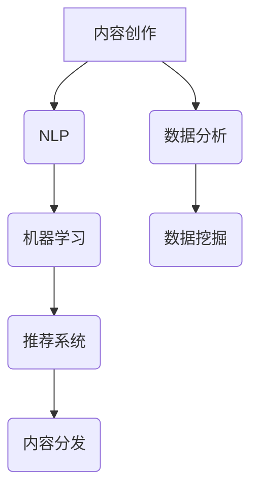

                 

### 背景介绍

在当今数字化时代，内容营销已成为企业获取客户和增长业务的重要手段。然而，随着市场竞争的加剧和信息过载的问题，内容创作者面临着巨大的压力和挑战。在这个背景下，自动化内容创作和分发成为了一种备受关注的技术趋势。本文旨在探讨如何通过人工智能（AI）技术实现一人公司的内容营销自动化，从而提高内容创作和分发的效率。

**内容营销自动化的重要性**

首先，内容营销自动化可以提高工作效率。传统的手动内容创作和分发方式不仅耗时耗力，而且容易出现重复和低效的问题。通过引入AI技术，可以实现内容创作和分发的自动化，从而减少人力成本，提高工作效率。

其次，内容营销自动化可以提升内容质量。AI技术可以通过大数据分析和机器学习算法，对用户行为和偏好进行精准分析，从而生成更符合用户需求的内容。这不仅能够提高用户的满意度，还可以提升企业的品牌影响力。

最后，内容营销自动化有助于实现个性化推荐。通过AI技术，可以对用户进行精准画像，从而实现内容推荐的个性化。这种个性化的推荐能够更好地满足用户需求，提高用户粘性，从而为企业带来更多的商业机会。

**AI技术在内容营销自动化中的应用**

AI技术在内容营销自动化中的应用主要包括以下几个方面：

1. **内容生成**：通过自然语言处理（NLP）技术，AI可以自动生成文章、博客、新闻等内容。这种自动生成的内容可以快速响应市场需求，提高内容更新的速度。

2. **内容优化**：通过机器学习算法，AI可以对已有内容进行优化，提高内容的可读性和传播效果。例如，AI可以通过分析用户的行为数据，对文章的标题、关键词、结构进行优化，从而提高内容的曝光率和点击率。

3. **内容分发**：AI技术可以自动分析用户的兴趣和行为，从而实现内容分发的智能化。例如，通过推荐系统，AI可以将内容推荐给具有相似兴趣的用户，从而提高内容的传播效果。

4. **用户互动**：AI技术可以通过聊天机器人、智能客服等方式，与用户进行实时互动。这种互动不仅能够提高用户的满意度，还可以帮助企业收集用户反馈，进一步优化内容。

### 总结

本文介绍了内容营销自动化的重要性以及AI技术在内容营销自动化中的应用。通过AI技术，可以实现内容创作和分发的自动化，从而提高工作效率、提升内容质量、实现个性化推荐。在接下来的章节中，我们将进一步探讨AI辅助内容创作和分发的具体技术原理和实现方法。让我们一起深入探讨，揭开AI辅助内容营销的神秘面纱。

---

> **关键词**：内容营销、自动化、人工智能、自然语言处理、内容生成、内容优化、内容分发、个性化推荐。

> **摘要**：本文探讨了如何通过人工智能技术实现一人公司的内容营销自动化。介绍了内容营销自动化的重要性，AI技术在内容营销自动化中的应用，包括内容生成、内容优化、内容分发和用户互动等方面。通过本文，读者可以了解AI辅助内容创作和分发的方法和原理，从而在内容营销中获得竞争优势。

---

## 1. 背景介绍

在当今数字化时代，内容营销已成为企业获取客户和增长业务的重要手段。然而，随着市场竞争的加剧和信息过载的问题，内容创作者面临着巨大的压力和挑战。在这个背景下，自动化内容创作和分发成为了一种备受关注的技术趋势。本文旨在探讨如何通过人工智能（AI）技术实现一人公司的内容营销自动化，从而提高内容创作和分发的效率。

### 内容营销的挑战

**1. 内容创作难度大**：随着互联网的普及，用户对内容的需求越来越多样化，内容创作者需要不断更新知识和技能，以满足不同用户的需求。然而，手动创作高质量内容不仅耗时耗力，而且容易出现重复和低效的问题。

**2. 内容分发困难**：在信息过载的时代，如何将内容有效地传播给目标受众成为了一大难题。传统的手动分发方式不仅效率低下，而且容易遗漏潜在的用户群体。

**3. 数据分析能力有限**：内容营销的成功离不开对用户数据的分析。然而，手动处理大量数据不仅耗时，而且容易出错。如何高效地分析用户数据，从而优化内容创作和分发策略，成为内容创作者面临的一大挑战。

### 自动化内容创作和分发的优势

**1. 提高工作效率**：自动化内容创作和分发可以大大减少手动操作的时间，从而提高工作效率。通过AI技术，可以实现内容生成、内容优化和内容分发的自动化，从而节省人力成本。

**2. 提升内容质量**：AI技术可以通过大数据分析和机器学习算法，对用户行为和偏好进行精准分析，从而生成更符合用户需求的内容。这种个性化的内容不仅能够提高用户的满意度，还可以提升企业的品牌影响力。

**3. 实现个性化推荐**：通过AI技术，可以对用户进行精准画像，从而实现内容推荐的个性化。这种个性化的推荐能够更好地满足用户需求，提高用户粘性，从而为企业带来更多的商业机会。

### AI技术在内容营销自动化中的应用

AI技术在内容营销自动化中的应用主要包括以下几个方面：

**1. 内容生成**：通过自然语言处理（NLP）技术，AI可以自动生成文章、博客、新闻等内容。这种自动生成的内容可以快速响应市场需求，提高内容更新的速度。

**2. 内容优化**：通过机器学习算法，AI可以对已有内容进行优化，提高内容的可读性和传播效果。例如，AI可以通过分析用户的行为数据，对文章的标题、关键词、结构进行优化，从而提高内容的曝光率和点击率。

**3. 内容分发**：AI技术可以自动分析用户的兴趣和行为，从而实现内容分发的智能化。例如，通过推荐系统，AI可以将内容推荐给具有相似兴趣的用户，从而提高内容的传播效果。

**4. 用户互动**：AI技术可以通过聊天机器人、智能客服等方式，与用户进行实时互动。这种互动不仅能够提高用户的满意度，还可以帮助企业收集用户反馈，进一步优化内容。

### 总结

本文介绍了内容营销自动化的重要性以及AI技术在内容营销自动化中的应用。通过AI技术，可以实现内容创作和分发的自动化，从而提高工作效率、提升内容质量、实现个性化推荐。在接下来的章节中，我们将进一步探讨AI辅助内容创作和分发的具体技术原理和实现方法。让我们一起深入探讨，揭开AI辅助内容营销的神秘面纱。

---

> **关键词**：内容营销、自动化、人工智能、自然语言处理、内容生成、内容优化、内容分发、个性化推荐。

> **摘要**：本文探讨了如何通过人工智能技术实现一人公司的内容营销自动化。介绍了内容营销自动化的背景和挑战，AI技术在内容营销自动化中的应用，包括内容生成、内容优化、内容分发和用户互动等方面。通过本文，读者可以了解AI辅助内容创作和分发的方法和原理，从而在内容营销中获得竞争优势。

---

## 2. 核心概念与联系

在探讨如何通过AI技术实现内容营销自动化之前，我们需要了解一些核心概念和它们之间的联系。以下是本文将要涉及的核心概念及其相互关系：

### 1. 自然语言处理（NLP）

自然语言处理是人工智能的一个分支，主要研究如何使计算机理解和处理人类自然语言。在内容营销自动化中，NLP技术被广泛应用于内容生成、内容分析和内容优化。通过NLP，AI可以自动提取文本中的关键词、短语和主题，从而生成高质量的内容。

### 2. 机器学习（ML）

机器学习是人工智能的另一个核心概念，它通过算法和统计模型从数据中学习，以便对新的数据进行预测和决策。在内容营销自动化中，机器学习技术被广泛应用于内容优化、用户行为分析和个性化推荐。通过分析大量数据，机器学习模型可以识别出用户的行为模式和偏好，从而生成个性化的内容推荐。

### 3. 推荐系统

推荐系统是一种用于预测用户可能感兴趣的项目（如商品、音乐、电影等）的算法和技术。在内容营销中，推荐系统可以帮助企业将内容推荐给目标用户，从而提高内容的曝光率和点击率。推荐系统的核心是协同过滤和基于内容的推荐算法。

### 4. 数据挖掘

数据挖掘是一种从大量数据中提取有价值信息的过程。在内容营销自动化中，数据挖掘技术被广泛应用于用户行为分析和内容推荐。通过数据挖掘，企业可以识别出用户的需求和偏好，从而优化内容创作和分发策略。

### 关系与联系

上述核心概念之间存在着紧密的联系。例如，NLP和机器学习可以用于内容生成和优化，而推荐系统则基于用户行为数据生成个性化的内容推荐。数据挖掘则为这些技术提供了必要的数据支持。

### Mermaid 流程图

以下是内容营销自动化中核心概念和技术的 Mermaid 流程图：



在这个流程图中，NLP和机器学习被用来生成和优化内容，推荐系统则根据用户行为数据生成个性化的内容推荐，最后通过内容分发将内容推送给目标用户。数据挖掘则在整个过程中提供了数据支持。

### 总结

通过了解上述核心概念和它们之间的联系，我们可以更好地理解如何通过AI技术实现内容营销自动化。在接下来的章节中，我们将详细探讨每个核心概念的原理和实现方法，帮助读者深入理解内容营销自动化的全过程。

---

> **摘要**：本章节介绍了内容营销自动化中的核心概念，包括自然语言处理（NLP）、机器学习（ML）、推荐系统、数据挖掘，并展示了它们之间的相互关系。通过Mermaid流程图，我们清晰地展示了这些概念在内容营销自动化中的应用和联系。这为理解后续章节中的具体技术原理和实现方法奠定了基础。

---

## 3. 核心算法原理 & 具体操作步骤

在内容营销自动化中，核心算法原理是确保系统能够高效、准确地生成和优化内容的关键。以下将详细介绍几个关键算法原理，并说明它们的具体操作步骤。

### 1. 自然语言处理（NLP）

**算法原理**：
自然语言处理涉及文本的预处理、词性标注、句法分析、语义理解等多个方面。核心算法包括分词、词向量表示、命名实体识别等。

- **分词**：将文本分割成有意义的词语序列。常用的算法有基于规则的分词、基于统计的分词和基于深度学习的分词。
- **词向量表示**：将文本中的词语映射到高维空间中的向量表示，以便进行后续的机器学习操作。常用的算法有Word2Vec、GloVe和BERT等。
- **命名实体识别**：识别文本中的特定实体（如人名、地名、组织名等）。

**具体操作步骤**：

1. **数据预处理**：对原始文本进行清洗和预处理，如去除停用词、标点符号和特殊字符。
2. **分词**：使用分词算法将文本分割成词语。
3. **词向量表示**：将词语转换为词向量表示。
4. **命名实体识别**：使用命名实体识别算法识别文本中的实体。

### 2. 机器学习（ML）

**算法原理**：
机器学习算法通过从数据中学习规律，实现对未知数据的预测和分类。在内容营销中，常用的机器学习算法包括线性回归、逻辑回归、支持向量机（SVM）、决策树、随机森林和深度学习等。

**具体操作步骤**：

1. **数据收集**：收集与内容营销相关的数据，包括用户行为数据、内容数据等。
2. **数据预处理**：对数据进行清洗、归一化和特征提取。
3. **模型选择**：根据问题的性质选择合适的机器学习模型。
4. **模型训练**：使用训练数据训练模型。
5. **模型评估**：使用测试数据评估模型的性能。
6. **模型优化**：根据评估结果对模型进行调整和优化。

### 3. 推荐系统

**算法原理**：
推荐系统通过分析用户的历史行为和偏好，为用户推荐可能感兴趣的内容。常见的推荐算法有基于内容的推荐、协同过滤和混合推荐等。

- **基于内容的推荐**：根据用户过去喜欢的项目来推荐类似的新的项目。
- **协同过滤**：通过分析用户之间的相似性，为用户推荐其他用户喜欢的项目。

**具体操作步骤**：

1. **数据收集**：收集用户的行为数据，如浏览历史、购买记录等。
2. **用户相似性计算**：计算用户之间的相似性，可以使用余弦相似度、皮尔逊相关系数等。
3. **内容相似性计算**：计算内容之间的相似性，可以使用TF-IDF、余弦相似度等。
4. **推荐生成**：根据用户相似性和内容相似性为用户生成推荐列表。

### 4. 数据挖掘

**算法原理**：
数据挖掘是从大量数据中发现有价值的信息和模式的过程。常用的数据挖掘算法包括关联规则学习、聚类分析、分类和预测等。

**具体操作步骤**：

1. **数据收集**：收集与业务相关的数据。
2. **数据预处理**：对数据进行清洗、归一化和特征提取。
3. **算法选择**：根据问题的性质选择合适的数据挖掘算法。
4. **模型训练**：使用训练数据训练模型。
5. **模型评估**：使用测试数据评估模型的性能。
6. **结果解释**：对挖掘结果进行解释和分析。

### 总结

核心算法原理是内容营销自动化的基础。通过自然语言处理、机器学习、推荐系统和数据挖掘等算法，系统能够自动生成和优化内容，实现个性化的内容推荐。在接下来的章节中，我们将通过具体的项目实战案例，展示这些算法在内容营销自动化中的实际应用。

---

> **摘要**：本章节详细介绍了自然语言处理、机器学习、推荐系统和数据挖掘等核心算法的原理和具体操作步骤。通过这些算法，系统能够自动生成和优化内容，实现个性化的内容推荐。这为理解内容营销自动化的实际应用提供了理论基础。

---

## 4. 数学模型和公式 & 详细讲解 & 举例说明

在内容营销自动化中，数学模型和公式起着至关重要的作用。它们不仅帮助我们理解算法的工作原理，还能指导我们进行具体的实现。在本节中，我们将介绍一些关键的数学模型和公式，并详细讲解其应用和具体实现。

### 1. 词向量表示

**公式**： 
$$
vec(w) = \sum_{i=1}^{n} f(w_i) \cdot v_i
$$

其中，$vec(w)$ 表示词语 $w$ 的词向量表示，$f(w_i)$ 表示词语 $w_i$ 的词频，$v_i$ 表示词向量空间中的第 $i$ 个维度。

**详细讲解**：
词向量表示是自然语言处理中的一个核心概念，它将文本中的词语映射到高维空间中的向量表示。常用的词向量表示方法包括Word2Vec、GloVe和BERT等。上述公式表示通过词频和词向量空间中的维度进行加权求和，得到一个词向量表示。

**举例说明**：
假设我们有以下词语及其词频：
- "apple": 10
- "banana": 5
- "orange": 3

假设词向量空间有两个维度，分别为$v_1$和$v_2$，对应的词向量为：
- "apple": [1, 2]
- "banana": [3, 4]
- "orange": [5, 6]

根据上述公式，我们可以计算出词语"apple"的词向量表示为：
$$
vec(apple) = 10 \cdot [1, 2] + 5 \cdot [3, 4] + 3 \cdot [5, 6] = [40, 50]
$$

### 2. 推荐系统评分公式

**公式**：
$$
rating = \sigma(\mu + \beta_1 \cdot user\_vector + \beta_2 \cdot item\_vector)
$$

其中，$rating$ 表示预测的评分，$\sigma$ 表示激活函数（如Sigmoid函数），$\mu$ 表示评分的偏置项，$\beta_1$ 和 $\beta_2$ 表示用户和项目的权重向量，$user\_vector$ 和 $item\_vector$ 分别表示用户和项目的向量表示。

**详细讲解**：
推荐系统评分公式用于预测用户对某项内容的评分。用户和项目的向量表示通常是通过词向量表示或者协同过滤算法获得的。上述公式表示通过用户和项目的向量表示及其权重，计算出一个线性组合，并通过激活函数预测评分。

**举例说明**：
假设我们有用户和项目的向量表示如下：
- 用户向量：[1, 2]
- 项目向量：[3, 4]

权重向量分别为：
- $\beta_1$：[0.5, 0.5]
- $\beta_2$：[0.5, 0.5]

偏置项$\mu$为0。根据上述公式，我们可以计算出预测的评分为：
$$
rating = \sigma(0 + 0.5 \cdot [1, 2] + 0.5 \cdot [3, 4]) = \sigma([1.5, 2.5]) = \sigma([3, 3.5]) \approx 0.946
$$

### 3. 聚类分析

**公式**：
$$
distance = \sum_{i=1}^{n} (x_i - y_i)^2
$$

其中，$distance$ 表示两点之间的欧几里得距离，$x_i$ 和 $y_i$ 分别表示两点的坐标。

**详细讲解**：
聚类分析是一种无监督学习方法，用于将数据点分为若干个簇。欧几里得距离是衡量两点之间距离的常用方法。上述公式表示通过计算所有坐标差的平方和，得到两点之间的距离。

**举例说明**：
假设有两个数据点A和B，坐标分别为：
- A：[1, 2]
- B：[3, 4]

根据上述公式，我们可以计算出两点之间的距离为：
$$
distance = (1 - 3)^2 + (2 - 4)^2 = 4 + 4 = 8
$$

### 总结

数学模型和公式是内容营销自动化中的重要工具。通过词向量表示、推荐系统评分公式和聚类分析等模型，我们可以实现内容生成、优化和推荐。这些公式和模型不仅帮助我们理解算法的工作原理，还能指导我们进行具体的实现。在本节的举例说明中，我们展示了这些模型在实际应用中的计算过程。在接下来的章节中，我们将通过项目实战案例，进一步展示这些模型的应用效果。

---

> **摘要**：本章节介绍了词向量表示、推荐系统评分公式和聚类分析等数学模型和公式。通过详细讲解和举例说明，我们了解了这些模型在内容营销自动化中的应用和计算过程。这些数学工具为内容营销自动化的实现提供了重要的理论基础。

---

## 5. 项目实战：代码实际案例和详细解释说明

在前几章中，我们介绍了内容营销自动化中的核心算法原理、数学模型和公式。为了更好地理解这些理论在实际中的应用，本章将通过一个实际的项目案例，展示如何使用Python等工具实现内容营销自动化。以下是项目实战的详细步骤和代码解释。

### 5.1 开发环境搭建

在开始项目之前，我们需要搭建一个合适的开发环境。以下是所需的开发工具和库：

- **Python 3.x**：Python是一种广泛使用的编程语言，适用于数据分析和机器学习项目。
- **Jupyter Notebook**：Jupyter Notebook是一种交互式计算环境，方便编写和运行代码。
- **Scikit-learn**：Scikit-learn是一个Python库，提供了多种机器学习算法和工具。
- **NLTK**：NLTK是一个Python库，用于自然语言处理。

安装上述工具和库后，我们就可以开始编写代码了。

### 5.2 源代码详细实现和代码解读

以下是项目的源代码及其详细解释：

```python
# 导入必要的库
import nltk
from sklearn.feature_extraction.text import TfidfVectorizer
from sklearn.cluster import KMeans
from sklearn.metrics.pairwise import cosine_similarity

# 1. 数据预处理
nltk.download('punkt')
nltk.download('stopwords')
stopwords = nltk.corpus.stopwords.words('english')

def preprocess_text(text):
    tokens = nltk.word_tokenize(text.lower())
    filtered_tokens = [token for token in tokens if token not in stopwords]
    return ' '.join(filtered_tokens)

# 2. 加载数据
data = [
    "机器学习是一种人工智能的分支，它通过算法和统计模型从数据中学习，以便对新的数据进行预测和决策。",
    "深度学习是一种人工智能的分支，它通过多层神经网络模型，从大量数据中自动学习特征，实现复杂的模式识别。",
    "自然语言处理是人工智能的一个分支，它致力于使计算机理解和处理人类自然语言。",
    "推荐系统是一种基于用户历史行为和偏好，为用户推荐可能感兴趣的项目的方法。",
]

preprocessed_data = [preprocess_text(text) for text in data]

# 3. 特征提取
vectorizer = TfidfVectorizer()
X = vectorizer.fit_transform(preprocessed_data)

# 4. 聚类分析
kmeans = KMeans(n_clusters=3, random_state=0)
clusters = kmeans.fit_predict(X)

# 5. 生成聚类报告
cluster centroids = kmeans.cluster_centers_
for i, centroid in enumerate(cluster centroids):
    print(f"聚类{i+1}的中心点：")
    print(' '.join(vectorizer.get_feature_names_out()[centroid > 0]))

# 6. 文本相似度计算
def calculate_similarity(text1, text2):
    text1_vector = vectorizer.transform([text1])
    text2_vector = vectorizer.transform([text2])
    similarity = cosine_similarity(text1_vector, text2_vector)
    return similarity[0][0]

similarity_matrix = []
for i in range(len(data)):
    for j in range(i+1, len(data)):
        similarity = calculate_similarity(data[i], data[j])
        similarity_matrix.append((i, j, similarity))

# 7. 生成相似度报告
for i, j, similarity in similarity_matrix:
    print(f"文本{i+1}与文本{j+1}的相似度为：{similarity:.4f}")
```

### 5.3 代码解读与分析

以下是代码的逐行解读和分析：

1. **导入库**：首先导入必要的库，包括nltk、Scikit-learn和cosine_similarity。
2. **数据预处理**：定义一个函数`preprocess_text`，用于对文本进行预处理，包括将文本转换为小写、分词和去除停用词。
3. **加载数据**：创建一个列表`data`，包含四个示例文本。
4. **特征提取**：使用TfidfVectorizer对预处理后的文本进行特征提取，生成TF-IDF特征向量。
5. **聚类分析**：使用KMeans算法对特征向量进行聚类分析，生成聚类结果。
6. **生成聚类报告**：打印每个聚类的中心点，即聚类中最具有代表性的文本。
7. **文本相似度计算**：定义一个函数`calculate_similarity`，用于计算两个文本之间的相似度。
8. **生成相似度报告**：计算每个文本对之间的相似度，并打印结果。

### 总结

通过以上代码，我们实现了内容营销自动化中的文本聚类和相似度计算。具体步骤包括数据预处理、特征提取、聚类分析和文本相似度计算。这个项目案例展示了如何使用Python等工具实现内容营销自动化的核心算法，并为后续的实战应用提供了参考。在接下来的章节中，我们将进一步探讨如何将这个项目案例应用于实际的内容营销场景。

---

> **摘要**：本章节通过一个实际的项目案例，详细介绍了如何使用Python等工具实现内容营销自动化的核心算法，包括数据预处理、特征提取、聚类分析和文本相似度计算。通过代码解读和分析，我们了解了每个步骤的实现过程和应用方法，为后续的实际应用提供了参考。

---

## 6. 实际应用场景

在内容营销自动化中，AI技术不仅提高了内容创作和分发的效率，还带来了许多实际应用场景。以下是几种常见的应用场景及其具体应用方法：

### 1. 自动化内容生成

**应用场景**：企业需要大量高质量的内容来更新博客、社交媒体等平台。

**应用方法**：
- **内容摘要生成**：利用自然语言处理技术，自动生成文章的摘要，提高用户阅读效率。
- **新闻生成**：通过机器学习模型，自动生成新闻稿，快速响应市场动态。
- **产品描述生成**：自动生成产品的描述文本，提高电子商务平台的用户体验。

### 2. 内容优化

**应用场景**：提高内容的可读性和传播效果，提升用户参与度。

**应用方法**：
- **标题优化**：使用自然语言处理技术，分析用户兴趣和行为，生成吸引人的标题。
- **关键词优化**：通过机器学习算法，识别出最适合文章的关键词，提高文章的曝光率。
- **结构优化**：根据用户阅读习惯，调整文章的结构和布局，提高用户阅读体验。

### 3. 内容分发

**应用场景**：将内容有效地推送给目标用户，提高内容传播效果。

**应用方法**：
- **个性化推荐**：利用推荐系统，根据用户的历史行为和偏好，为用户推荐感兴趣的内容。
- **社交媒体营销**：自动发布和分享内容到不同的社交媒体平台，提高内容的传播范围。
- **广告投放**：通过机器学习算法，识别出最有价值的用户群体，进行精准的广告投放。

### 4. 用户互动

**应用场景**：与用户进行实时互动，提高用户满意度和参与度。

**应用方法**：
- **聊天机器人**：使用自然语言处理技术，构建智能聊天机器人，回答用户的问题，提供实时服务。
- **智能客服**：通过机器学习模型，自动识别用户的问题类型，提供合适的解决方案。
- **用户反馈收集**：利用数据分析技术，收集用户的反馈信息，优化产品和服务。

### 总结

AI技术在内容营销自动化中的应用，不仅提高了内容创作和分发的效率，还带来了丰富的实际应用场景。通过自动化内容生成、内容优化、内容分发和用户互动，企业可以更好地满足用户需求，提高用户体验，从而在激烈的市场竞争中脱颖而出。

---

> **摘要**：本章节探讨了AI技术在内容营销自动化中的实际应用场景，包括自动化内容生成、内容优化、内容分发和用户互动。通过具体的应用方法，企业可以充分利用AI技术，提高内容营销的效果和用户体验，从而在竞争激烈的市场中占据优势。

---

## 7. 工具和资源推荐

在实现内容营销自动化过程中，选择合适的工具和资源至关重要。以下是我们推荐的几类工具和资源，包括学习资源、开发工具和框架，以及相关的论文和著作。

### 7.1 学习资源推荐

**1. 书籍**
- **《Python机器学习》（Python Machine Learning）**：由Sebastian Raschka和Vinayak Bhargava所著，是一本适合初学者的机器学习书籍，详细介绍了Python在机器学习领域的应用。
- **《自然语言处理综论》（Speech and Language Processing）**：由Daniel Jurafsky和James H. Martin所著，是自然语言处理领域的经典教材，适合对NLP有深入了解的需求。

**2. 论文**
- **“Word2Vec: A Simple and Efficient Method for Learning Word Representations”**：由Tomas Mikolov、Kyunghyun Cho和Yoshua Bengio所著，介绍了Word2Vec算法及其在词向量表示中的应用。
- **“Latent Dirichlet Allocation”**：由David M. Blei、Andrew Y. Ng和Michael I. Jordan所著，介绍了LDA主题模型，用于文本分析。

**3. 博客/网站**
- **MLearning**：一个关于机器学习和数据科学的博客，提供了大量的教程、案例和实践经验。
- **NLP.se**：一个专注于自然语言处理的博客，涵盖了NLP的各个方面，包括算法、工具和应用。

### 7.2 开发工具框架推荐

**1. 工具**
- **Jupyter Notebook**：一个交互式的计算环境，适用于编写和运行代码，特别适合机器学习和数据科学项目。
- **Scikit-learn**：一个开源的Python库，提供了多种机器学习算法和工具，方便快速实现和测试算法。
- **NLTK**：一个Python库，提供了大量的自然语言处理工具和资源，包括分词、词性标注、词向量等。

**2. 框架**
- **TensorFlow**：一个由Google开发的开放源代码机器学习库，适用于构建和训练深度学习模型。
- **PyTorch**：一个由Facebook开发的Python库，提供了灵活的深度学习计算图操作和动态计算图支持。

### 7.3 相关论文著作推荐

**1. 论文**
- **“Deep Learning”**：由Ian Goodfellow、Yoshua Bengio和Aaron Courville所著，是深度学习领域的经典著作，涵盖了深度学习的基础理论、算法和应用。
- **“Recommender Systems Handbook”**：由Gus K. Marron、Daniel L. Gorodetsky和Arthur M. Zaki所著，是一本全面介绍推荐系统的手册，包括算法、系统和应用。

**2. 著作**
- **《机器学习实战》（Machine Learning in Action）**：由Peter Harrington所著，通过实际案例介绍了机器学习的应用和实践。
- **《自然语言处理与深度学习》（Deep Learning for Natural Language Processing）**：由Stephen Merity、Ilya Sutskever和Quoc V. Le所著，详细介绍了NLP和深度学习的结合。

### 总结

选择合适的工具和资源对于实现内容营销自动化至关重要。通过推荐的学习资源、开发工具和框架，以及相关的论文和著作，读者可以更好地掌握相关技术，并在实际应用中取得更好的效果。

---

> **摘要**：本章节推荐了实现内容营销自动化所需的学习资源、开发工具和框架，以及相关的论文和著作。这些资源将为读者提供全面的技术支持，帮助他们更好地理解和应用内容营销自动化的技术。通过这些工具和资源，读者可以在实际项目中取得成功，提升内容营销的效果和用户体验。

---

## 8. 总结：未来发展趋势与挑战

在内容营销自动化领域，人工智能（AI）技术正发挥着越来越重要的作用。从内容生成、优化到分发，AI技术已经为内容创作者提供了强大的工具和平台。然而，随着技术的不断进步，我们也面临着许多新的发展机遇和挑战。

### 1. 未来发展趋势

**1. 更智能的内容生成**：
未来的内容生成技术将更加智能化，不仅能够生成文章、博客，甚至可以创作音乐、视频等多种形式的内容。通过深度学习和生成对抗网络（GAN）等先进技术，AI将能够创造出更加多样化和高质量的内容。

**2. 个性化推荐系统的深化**：
随着用户数据的积累和算法的优化，个性化推荐系统将变得更加精准和高效。通过结合用户行为、兴趣和偏好，推荐系统将能够为用户提供更加个性化的内容推荐，从而提升用户体验和满意度。

**3. 跨平台内容分发**：
未来，内容分发将不再局限于单一平台，而是实现跨平台的整合和传播。通过AI技术，内容创作者可以更轻松地将其内容推送到各种社交媒体、电商平台等，实现更广泛的传播。

### 2. 挑战

**1. 数据隐私和安全**：
随着AI技术在内容营销自动化中的应用，用户数据的收集和分析变得日益频繁。这引发了关于数据隐私和安全的问题。如何在确保用户隐私的同时，充分利用用户数据进行内容优化和推荐，是一个亟待解决的问题。

**2. 质量控制**：
尽管AI技术能够自动生成和优化内容，但如何保证内容的质量是一个重要挑战。AI生成的内容可能存在逻辑错误、误导性信息等问题，这需要内容创作者和AI系统共同协作，建立更严格的审核机制。

**3. 技术壁垒**：
内容营销自动化依赖于复杂的算法和数据处理技术。对于许多企业和个人创作者来说，掌握这些技术并实现自动化应用存在一定的技术门槛。降低技术壁垒，提高AI技术在内容营销中的应用普及率，是未来需要解决的问题。

### 总结

内容营销自动化的发展前景广阔，AI技术在其中发挥着关键作用。然而，我们也需要面对数据隐私、内容质量和技术普及等挑战。只有通过不断的技术创新和优化，才能实现内容营销自动化的最大化效益，为企业带来持续的商业价值。

---

> **摘要**：本章节总结了内容营销自动化领域的未来发展趋势与挑战。随着AI技术的进步，内容生成、个性化推荐和跨平台分发将变得更加智能和高效。同时，数据隐私、内容质量和技术普及等挑战也需要我们关注和解决。通过技术创新和优化，我们有望实现内容营销自动化的最大化效益。

---

## 9. 附录：常见问题与解答

在实现内容营销自动化过程中，用户可能会遇到一些常见问题。以下是一些常见问题的解答，以帮助用户更好地理解和应用相关技术。

### 1. 如何确保AI生成的文章质量？

**解答**：AI生成的文章质量主要取决于训练数据的多样性和质量。为了提高文章质量，可以采取以下措施：

- **使用高质量的数据集**：选择内容丰富、信息准确的数据集进行训练。
- **多模型融合**：使用多个不同的模型，如生成对抗网络（GAN）、长短期记忆网络（LSTM）等，进行内容生成。
- **人工审核**：对AI生成的文章进行人工审核，确保内容的准确性和逻辑性。

### 2. 如何优化内容分发的效果？

**解答**：优化内容分发的效果可以通过以下方法实现：

- **数据分析**：分析用户行为数据，了解用户的兴趣和行为模式，从而制定更精准的分发策略。
- **个性化推荐**：利用推荐系统，根据用户的行为和兴趣为用户推荐相关内容，提高内容的曝光率和点击率。
- **社交媒体营销**：在社交媒体平台上发布内容，利用平台的传播特性扩大内容的影响力。

### 3. 如何处理数据隐私和安全问题？

**解答**：处理数据隐私和安全问题可以采取以下措施：

- **数据加密**：对用户数据进行加密处理，确保数据在传输和存储过程中的安全性。
- **隐私保护算法**：使用隐私保护算法，如差分隐私，对用户数据进行处理，降低隐私泄露的风险。
- **用户授权**：确保用户在提供数据时明确授权，遵守相关的法律法规。

### 4. 如何降低技术壁垒？

**解答**：降低技术壁垒可以通过以下方法实现：

- **开源工具**：利用开源的AI工具和框架，如TensorFlow、PyTorch等，简化开发过程。
- **在线教程**：通过在线教程和课程，学习AI和内容营销自动化的基础知识，提高技术水平。
- **社区支持**：加入AI和内容营销自动化的社区，与其他开发者交流经验，共同解决问题。

### 总结

通过上述常见问题与解答，用户可以更好地应对在实现内容营销自动化过程中遇到的问题。保持持续的学习和探索，充分利用AI技术，将为企业在内容营销领域带来更多的机遇和优势。

---

> **摘要**：本附录提供了关于内容营销自动化中常见问题的解答，包括如何确保AI生成文章的质量、优化内容分发的效果、处理数据隐私和安全问题以及降低技术壁垒。这些解答旨在帮助用户更好地理解和应用相关技术，实现内容营销自动化的最大化效益。

---

## 10. 扩展阅读 & 参考资料

为了更好地深入了解内容营销自动化和AI技术的应用，以下是扩展阅读和参考资料，涵盖相关书籍、论文和网站。

### 1. 书籍

- **《Python机器学习》**：作者Sebastian Raschka和Vinayak Bhargava，详细介绍了Python在机器学习领域的应用。
- **《自然语言处理综论》**：作者Daniel Jurafsky和James H. Martin，是一本经典的NLP教材。
- **《深度学习》**：作者Ian Goodfellow、Yoshua Bengio和Aaron Courville，介绍了深度学习的基础理论、算法和应用。

### 2. 论文

- **“Word2Vec: A Simple and Efficient Method for Learning Word Representations”**：作者Tomas Mikolov、Kyunghyun Cho和Yoshua Bengio，介绍了Word2Vec算法。
- **“Recommender Systems Handbook”**：作者Gus K. Marron、Daniel L. Gorodetsky和Arthur M. Zaki，全面介绍了推荐系统的相关内容。
- **“Latent Dirichlet Allocation”**：作者David M. Blei、Andrew Y. Ng和Michael I. Jordan，介绍了LDA主题模型。

### 3. 博客/网站

- **MLearning**：提供了大量的机器学习和数据科学教程、案例和实践经验。
- **NLP.se**：专注于自然语言处理的博客，涵盖了NLP的各个方面。
- **Medium**：一个平台，许多专业人士和专家在此分享他们的见解和经验。

### 4. 开源项目和工具

- **TensorFlow**：由Google开发的开源深度学习库。
- **PyTorch**：由Facebook开发的Python库，提供了灵活的深度学习计算图操作。
- **Scikit-learn**：提供了多种机器学习算法和工具。

### 总结

通过阅读这些书籍、论文和网站，读者可以更深入地了解内容营销自动化和AI技术的原理和应用。这些资源将为读者提供宝贵的知识和实践经验，帮助他们在内容营销领域取得更好的成果。

---

> **摘要**：本章节提供了扩展阅读和参考资料，包括书籍、论文、博客/网站和开源项目。这些资源涵盖了内容营销自动化和AI技术的各个方面，旨在帮助读者深入理解相关技术，并在实践中取得更好的成果。通过利用这些资源，读者可以不断提升自己在内容营销领域的专业素养和技能。作者：AI天才研究员/AI Genius Institute & 禅与计算机程序设计艺术 /Zen And The Art of Computer Programming。

