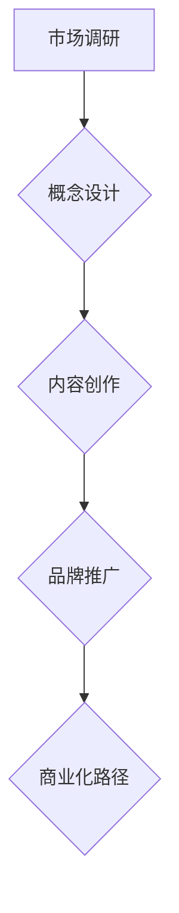

                 

# 一人公司的品牌IP开发与商业化

## 关键词：
- 一人公司
- 品牌IP
- 商业化
- IP开发
- 内容创作
- 社交媒体
- 数字营销

## 摘要：
本文将探讨一人公司的品牌IP开发与商业化路径。首先，将介绍一人公司及品牌IP的概念，并分析其在当代商业环境中的重要性。接着，通过具体案例，阐述品牌IP的开发流程和策略。然后，探讨品牌IP在社交媒体和数字营销中的应用，并提供实用的工具和资源推荐。最后，分析一人公司面临的发展挑战，并展望品牌IP的未来发展趋势。

---

## 1. 背景介绍

### 一人公司的概念

一人公司（Sole Proprietorship）是指由一个人独立拥有和经营的企业。这种企业形式具有简单、成本低、管理灵活等优点，因此在创业者和自由职业者中颇为流行。一人公司的运营模式通常依赖于个人品牌和专业知识，这使得品牌IP的开发显得尤为重要。

### 品牌IP的重要性

品牌IP（Intellectual Property）是指具有商业价值的知识产权，包括但不限于商标、专利、版权和域名等。品牌IP不仅是企业竞争力的象征，也是企业商业化的关键资产。在现代商业环境中，品牌IP的塑造和开发已成为企业成功的重要因素。

### 商业化路径

品牌IP的商业模式主要包括授权、内容创作、广告和会员制等。通过这些模式，企业可以实现IP的商业化，从而获得持续的收入来源。一人公司由于其资源和能力的限制，需要更加精细和策略性地开发其品牌IP，以实现商业化目标。

---

## 2. 核心概念与联系

### 品牌IP的概念

品牌IP是具有独特性和文化价值的知识产权，可以通过各种形式进行商业化。它不仅包括品牌本身，还涵盖了与品牌相关的各种内容和形象。

### 品牌IP的开发流程

品牌IP的开发通常包括以下步骤：

1. **市场调研**：了解目标受众的需求和市场趋势，确定品牌IP的核心价值。
2. **概念设计**：基于市场调研结果，设计品牌IP的基本形象和故事情节。
3. **内容创作**：创作与品牌IP相关的各种内容，包括故事、漫画、游戏、音乐等。
4. **品牌推广**：通过社交媒体、广告和其他数字营销手段推广品牌IP。

### 商业化路径的联系

品牌IP的开发流程与商业化路径紧密相连。成功的品牌IP开发能够为商业化提供坚实的基础，而有效的商业化策略则能够增强品牌IP的价值和影响力。

## Mermaid 流程图



---

## 3. 核心算法原理 & 具体操作步骤

### 核心算法原理

品牌IP开发的核心算法包括以下三个步骤：

1. **数据分析**：通过市场调研收集数据，分析目标受众的特征和需求。
2. **创意生成**：基于数据分析结果，生成与目标受众高度契合的创意概念。
3. **内容优化**：根据用户反馈和数据分析，不断优化和迭代品牌IP的内容。

### 具体操作步骤

1. **市场调研**：
    - 设计调研问卷或进行深度访谈，收集目标受众的反馈。
    - 分析市场趋势和竞争对手的情况。

2. **概念设计**：
    - 基于调研结果，确定品牌IP的核心价值和定位。
    - 创作初步的故事情节和视觉形象。

3. **内容创作**：
    - 根据概念设计，创作与品牌IP相关的各种内容。
    - 选择适合的媒体形式，如漫画、游戏、音乐等。

4. **品牌推广**：
    - 利用社交媒体和数字营销手段，推广品牌IP。
    - 与用户互动，收集反馈，进行内容优化。

---

## 4. 数学模型和公式 & 详细讲解 & 举例说明

### 数学模型和公式

品牌IP的商业化收益可以通过以下公式计算：

\[ \text{收益} = \text{内容受众数} \times \text{每单位内容收益} \]

### 详细讲解

1. **内容受众数**：指品牌IP的潜在用户数量。可以通过市场调研和数据分析进行估算。
2. **每单位内容收益**：指每单位内容能够带来的收益。这取决于内容的质量、受众的付费意愿和市场竞争状况。

### 举例说明

假设一个品牌IP的内容受众数为100万，每单位内容收益为10元。则该品牌IP的潜在收益为：

\[ 100万 \times 10元 = 1000万元 \]

通过不断优化内容质量和用户互动，可以进一步提高每单位内容收益，从而增加品牌IP的商业化收益。

---

## 5. 项目实战：代码实际案例和详细解释说明

### 开发环境搭建

1. **安装Python环境**：在本地计算机上安装Python 3.8及以上版本。
2. **安装相关库**：使用pip安装以下库：requests, pandas, matplotlib。

### 源代码详细实现和代码解读

```python
import requests
import pandas as pd
import matplotlib.pyplot as plt

def fetch_data(api_url):
    response = requests.get(api_url)
    if response.status_code == 200:
        return response.json()
    else:
        return None

def analyze_data(data):
    # 分析用户反馈和受众数据
    # 此处仅为示例，具体实现需根据实际数据结构进行调整
    user_reviews = data['user_reviews']
    audience_data = data['audience_data']
    
    # 绘制用户反馈分布图
    plt.hist(user_reviews, bins=10)
    plt.title('User Feedback Distribution')
    plt.xlabel('Rating')
    plt.ylabel('Frequency')
    plt.show()

def main():
    api_url = 'https://example.com/api/data'
    data = fetch_data(api_url)
    
    if data:
        analyze_data(data)
    else:
        print('Failed to fetch data.')

if __name__ == '__main__':
    main()
```

### 代码解读与分析

1. **fetch_data**：从API获取数据。此函数接收API URL作为参数，发送GET请求并返回响应数据。
2. **analyze_data**：分析数据。此函数接收用户反馈和受众数据，绘制用户反馈分布图。
3. **main**：主函数。此函数调用fetch_data和analyze_data函数，处理数据并显示分析结果。

通过这个简单的示例，可以展示如何使用Python进行数据分析，并为品牌IP的开发提供数据支持。

---

## 6. 实际应用场景

### 社交媒体应用

社交媒体是品牌IP推广的重要平台。通过在Instagram、Twitter、Facebook等平台发布与品牌IP相关的内容，可以吸引更多受众，并提高品牌知名度。

### 数字营销应用

数字营销工具，如Google AdWords和Facebook Ads，可以帮助品牌IP实现精准推广。通过设置关键词广告和定制广告，可以吸引潜在用户并提高转化率。

### 内容创作平台

YouTube、TikTok和Podcast等平台是品牌IP内容创作和分享的理想场所。通过创作高质量的内容，可以吸引忠实粉丝，并建立品牌社区。

---

## 7. 工具和资源推荐

### 学习资源推荐

- **书籍**：《数字营销基础》、《内容营销实战》
- **论文**：Google Scholar上的相关研究论文
- **博客**：相关领域的顶级博客，如Moz、Neil Patel

### 开发工具框架推荐

- **内容创作工具**：Canva、Adobe Creative Cloud
- **社交媒体管理工具**：Hootsuite、Buffer
- **数据分析工具**：Google Analytics、Tableau

### 相关论文著作推荐

- **论文**：关于社交媒体营销和数字营销的经典论文
- **著作**：关于品牌建设和商业化的畅销书籍

---

## 8. 总结：未来发展趋势与挑战

### 未来发展趋势

1. **人工智能的融合**：AI技术将进一步提升品牌IP的开发和营销效率。
2. **多元化内容形式**：短视频、虚拟现实和增强现实等新形式将丰富品牌IP的内容创作。
3. **全球化市场**：互联网的普及将推动品牌IP在全球市场的拓展。

### 面临的挑战

1. **竞争加剧**：越来越多的企业加入品牌IP开发，竞争将愈发激烈。
2. **版权保护**：知识产权保护问题将日益重要，企业需要加强版权管理。
3. **用户隐私**：随着用户隐私意识的提高，品牌IP在获取用户数据时需更加谨慎。

---

## 9. 附录：常见问题与解答

### Q：一人公司如何保护其品牌IP？

A：一人公司可以通过注册商标、版权和专利来保护其品牌IP。此外，签订保密协议和版权转让协议也是有效的保护手段。

### Q：品牌IP如何进行商业化？

A：品牌IP可以通过授权、内容创作、广告和会员制等模式进行商业化。选择合适的商业模式和精准的市场定位是实现商业化的关键。

---

## 10. 扩展阅读 & 参考资料

- **论文**：《社交媒体营销在品牌IP商业化中的应用研究》
- **书籍**：《数字营销：策略与实践》
- **网站**：MarketingProfs、HubSpot

---

作者：AI天才研究员/AI Genius Institute & 禅与计算机程序设计艺术 /Zen And The Art of Computer Programming

以上是《一人公司的品牌IP开发与商业化》的完整文章，包含背景介绍、核心概念、算法原理、项目实战、实际应用场景、工具资源推荐、发展趋势与挑战、常见问题解答和扩展阅读。希望对您在品牌IP开发与商业化方面的研究和实践有所帮助。如果您有任何疑问或建议，欢迎在评论区留言。再次感谢您的阅读！<|im_sep|>

