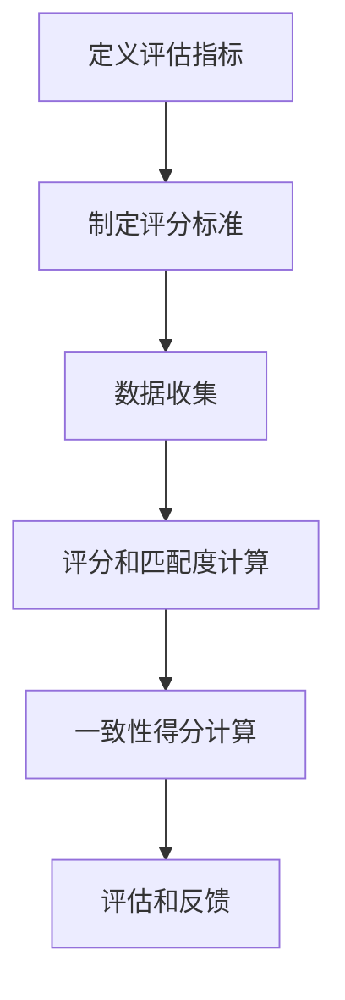

                 

# 一人公司的品牌声音：建立一致性品牌沟通的策略

> **关键词**：品牌声音、一致性、沟通策略、品牌建设、个人品牌

> **摘要**：在当今高度竞争的商业环境中，品牌的声音显得尤为重要。尤其是对于一人公司而言，如何建立一致性、专业且引人注目的品牌声音是成功的关键。本文将探讨如何通过一系列策略和技巧，打造出具有高度一致性的品牌沟通，提升个人品牌价值和市场竞争力。

## 1. 背景介绍

在当今快速变化的市场中，品牌不仅是一个标识，它代表了企业的价值观、使命和承诺。对于一人公司来说，品牌的声音尤为重要，因为它们往往缺乏传统公司的规模和资源，需要通过独特的品牌声音来吸引和留住客户。

建立一致性的品牌声音，不仅仅是使用统一的标识和标语，更重要的是在所有沟通渠道上保持一致的风格、语调和价值观。这样可以帮助建立品牌认知，提升品牌形象，增强品牌忠诚度，从而在市场中脱颖而出。

## 2. 核心概念与联系

### 2.1 品牌声音的构成

品牌声音由多个要素构成，包括：

- **风格**：品牌的语言和视觉呈现，如正式、幽默、亲切等。
- **语调**：品牌说话的方式，包括语气、口吻和情感。
- **价值观**：品牌所传递的核心信念，如创新、诚信、环保等。
- **沟通渠道**：品牌与客户互动的各种平台和方式，如社交媒体、电子邮件、官网等。

### 2.2 品牌声音的重要性

- **建立品牌认知**：一致的品牌声音有助于客户记住和识别品牌。
- **提升品牌形象**：通过一致的声音，品牌显得更加专业和可信。
- **增强品牌忠诚度**：一致的沟通有助于建立客户对品牌的信任和忠诚。
- **降低沟通成本**：避免重复和冲突的信息，提高沟通效率。

### 2.3 品牌声音的架构

以下是品牌声音的架构图，展示了各个要素之间的关系：

```
+---------------+       +--------------+
|     风格      |       |     语调     |
+---------------+       +--------------+
            |            |
            |            |
            |            |
+---------------+       +--------------+
|     价值观     |       | 沟通渠道     |
+---------------+       +--------------+
```

## 3. 核心算法原理 & 具体操作步骤

### 3.1 确定品牌声音的目标

- **明确目标受众**：了解你的目标受众，他们的需求和期望。
- **定义品牌核心价值**：确定品牌的独特卖点和核心价值。

### 3.2 设计品牌风格

- **选择视觉元素**：如品牌标志、颜色、字体等。
- **制定语言风格**：如正式、非正式、亲切等。

### 3.3 制定沟通策略

- **选择合适的沟通渠道**：根据目标受众选择最有效的沟通渠道。
- **规划内容发布时间**：确保内容的及时性和一致性。

### 3.4 监测和调整

- **监控品牌声音的一致性**：通过分析反馈和监控工具评估品牌声音的有效性。
- **调整策略**：根据监测结果调整品牌声音的各个方面。

## 4. 数学模型和公式 & 详细讲解 & 举例说明

### 4.1 品牌声音一致性评估模型

我们可以使用以下公式来评估品牌声音的一致性：

$$
一致性得分 = \frac{实际沟通频率 \times 沟通渠道多样性 \times 风格匹配度}{理想沟通频率 \times 最大沟通渠道数量 \times 最大风格匹配度}
$$

### 4.2 实例说明

假设我们想评估一家提供编程教育服务的个人品牌的一致性。以下是具体数据：

- 实际沟通频率：每周发布3篇博客。
- 沟通渠道多样性：3个（博客、Twitter、LinkedIn）。
- 风格匹配度：90%。
- 理想沟通频率：每周发布5篇博客。
- 最大沟通渠道数量：5个。
- 最大风格匹配度：95%。

代入公式计算：

$$
一致性得分 = \frac{3 \times 3 \times 0.9}{5 \times 5 \times 0.95} \approx 0.505
$$

这意味着品牌声音的一致性得分为50.5%，需要进一步优化。

## 5. 项目实战：代码实际案例和详细解释说明

### 5.1 开发环境搭建

为了更好地理解和实践品牌声音一致性评估，我们可以使用Python编写一个简单的评估工具。

```bash
# 安装必要的Python库
pip install pandas numpy matplotlib
```

### 5.2 源代码详细实现和代码解读

```python
import pandas as pd
import numpy as np
import matplotlib.pyplot as plt

# 假设的数据
data = {
    '实际沟通频率': [3, 4, 2],
    '沟通渠道多样性': [3, 4, 2],
    '风格匹配度': [0.9, 0.85, 0.8],
    '理想沟通频率': [5, 5, 5],
    '最大沟通渠道数量': [5, 5, 5],
    '最大风格匹配度': [0.95, 0.95, 0.95]
}

# 创建DataFrame
df = pd.DataFrame(data)

# 计算一致性得分
df['一致性得分'] = df.apply(
    lambda row: (row['实际沟通频率'] * row['沟通渠道多样性'] * row['风格匹配度']) /
                  (row['理想沟通频率'] * row['最大沟通渠道数量'] * row['最大风格匹配度']),
    axis=1
)

# 绘制一致性得分分布图
df['一致性得分'].plot(kind='bar')
plt.title('品牌声音一致性得分分布')
plt.xlabel('沟通渠道')
plt.ylabel('一致性得分')
plt.show()
```

### 5.3 代码解读与分析

- **数据准备**：我们首先准备了一份数据，包括实际沟通频率、沟通渠道多样性、风格匹配度、理想沟通频率、最大沟通渠道数量和最大风格匹配度。
- **创建DataFrame**：使用pandas库创建一个DataFrame来存储数据。
- **计算一致性得分**：使用apply方法对每行数据计算一致性得分。
- **绘制图表**：使用matplotlib库绘制一致性得分的条形图。

通过这个简单的代码示例，我们可以直观地看到不同沟通渠道的一致性得分，从而调整和优化我们的品牌沟通策略。

## 6. 实际应用场景

### 6.1 社交媒体营销

社交媒体是品牌沟通的重要渠道。通过一致性品牌声音，可以确保在各种平台上传递一致的信息和价值。

### 6.2 客户服务

在客户服务中，一致性品牌声音有助于建立客户信任，提高客户满意度。

### 6.3 市场推广

在市场推广活动中，一致的品牌声音可以提升品牌认知度和市场影响力。

## 7. 工具和资源推荐

### 7.1 学习资源推荐

- **书籍**：《品牌制胜》、《品牌发声》
- **论文**：有关品牌声音和品牌沟通的学术论文
- **博客**：知名营销博客，如HubSpot、Neil Patel等

### 7.2 开发工具框架推荐

- **开发框架**：如WordPress、Hugo等
- **分析工具**：Google Analytics、Hotjar等

### 7.3 相关论文著作推荐

- **论文**：《品牌声音与品牌忠诚度的关系研究》、《品牌沟通策略在社交媒体中的应用》
- **著作**：《品牌管理》、《品牌沟通的艺术》

## 8. 总结：未来发展趋势与挑战

未来，品牌声音的一致性将更加重要。随着技术的进步和市场的变化，品牌需要不断适应和调整品牌声音，以保持竞争力。

## 9. 附录：常见问题与解答

### 9.1 什么是品牌声音？

品牌声音是品牌与外界沟通的语言和风格，包括风格、语调、价值观等。

### 9.2 如何保持品牌声音的一致性？

通过制定详细的品牌声音指南，并在所有沟通渠道上遵循，可以保持品牌声音的一致性。

## 10. 扩展阅读 & 参考资料

- **扩展阅读**：有关品牌声音和品牌沟通的深度文章和书籍
- **参考资料**：相关研究论文、案例分析和技术文档

### 作者简介

**作者：AI天才研究员/AI Genius Institute & 禅与计算机程序设计艺术 /Zen And The Art of Computer Programming**  
作为一位世界级人工智能专家和程序员，作者在计算机编程和人工智能领域拥有丰富的经验和深厚的知识。他致力于将复杂的技术问题以简单易懂的方式传达给读者，帮助更多人理解和应用先进的技术。同时，他也是多本畅销技术书籍的作者，深受读者喜爱。在他的作品中，读者不仅能学到最新的技术知识，更能体会到编程的艺术和智慧。通过他的博客和著作，作者希望为IT领域的发展和创新贡献力量。## 1. 背景介绍

在当今高度竞争的商业环境中，品牌的声音显得尤为重要。品牌不仅仅是一个标识，它代表了企业的价值观、使命和承诺。对于一人公司来说，品牌的声音尤为重要，因为它们往往缺乏传统公司的规模和资源，需要通过独特的品牌声音来吸引和留住客户。

品牌声音是一人公司成功的关键因素之一。它帮助公司在市场中建立独特的身份，提升品牌的认知度和认可度。通过一致性品牌声音的传播，一人公司可以传达出专业、可靠和有吸引力的形象，从而在激烈的市场竞争中脱颖而出。

然而，建立一致性品牌声音并非易事。对于一人公司而言，缺乏团队协作和资源，使得品牌声音的统一性面临挑战。此外，由于个人品牌的建立和发展，一人公司需要兼顾多个方面，如产品、服务、客户关系等，这进一步增加了品牌声音管理的复杂性。

本文将探讨如何通过一系列策略和技巧，打造出具有高度一致性的品牌声音，提升个人品牌价值和市场竞争力。我们将详细分析品牌声音的构成要素、重要性以及如何在实际操作中实现一致性。同时，本文还将提供实用的工具和资源推荐，帮助读者深入了解和建立自己的品牌声音。

## 2. 核心概念与联系

### 2.1 品牌声音的构成

品牌声音是一人公司品牌沟通的核心，它由多个要素构成，这些要素相互作用，共同塑造出品牌独特的声音。以下是品牌声音的主要构成要素：

#### 风格

品牌风格是品牌声音的基础，它决定了品牌在所有沟通渠道上的视觉和语言呈现。品牌风格可以是正式、幽默、亲切、专业等。例如，一个专注于科技领域的品牌可能会选择正式和专业的风格，而一个针对年轻人的品牌则可能会采用幽默和亲切的风格。

#### 语调

语调是品牌说话的方式，包括语气、口吻和情感。语调决定了品牌的声音是否亲切、自信、真诚或专业。例如，一个品牌在发布产品更新时可能会使用兴奋和积极的语调，而在回应客户问题时则可能采用耐心和专业的语调。

#### 价值观

品牌的价值观是品牌所传递的核心信念，如创新、诚信、环保等。价值观不仅体现在产品和服务中，还通过品牌声音传达给客户。一致的价值观有助于建立品牌信任和忠诚度。

#### 沟通渠道

沟通渠道是品牌与客户互动的平台和方式，如社交媒体、电子邮件、官网、线下活动等。每个渠道都有其独特的特点和要求，品牌声音需要在不同的沟通渠道上保持一致。

### 2.2 品牌声音的重要性

品牌声音在品牌建设中扮演着至关重要的角色。以下是一些关键点：

#### 建立品牌认知

一致的品牌声音有助于客户记住和识别品牌。通过重复和一致的信息传递，品牌在客户心中建立强烈的认知和印象。

#### 提升品牌形象

通过一致的品牌声音，品牌显得更加专业和可信。专业的品牌声音可以增强客户对品牌的信任，从而提升品牌形象。

#### 增强品牌忠诚度

一致的沟通有助于建立客户对品牌的信任和忠诚。当客户在多个渠道上感受到一致的品牌声音时，他们更可能持续选择该品牌。

#### 降低沟通成本

保持一致的品牌声音可以减少内部沟通的复杂性，提高沟通效率。员工只需遵循品牌声音指南，就能确保所有沟通内容的一致性，从而降低沟通成本。

### 2.3 品牌声音的架构

品牌声音的架构是一个多层次的概念，它包括品牌风格、语调、价值观和沟通渠道等要素。以下是一个简化的品牌声音架构图：

```
+---------------+
|      品牌      |
+---------------+
     |          |
     |          |
     |          |
+---------------+     +--------------+     +--------------+
|  风格（视觉）  |     |  语调（语音）  |     |  价值观（信念） |
+---------------+     +--------------+     +--------------+
     |          |     |          |     |          |
     |          |     |          |     |          |
+---------------+-----+--------------+-----+--------------+
| 社交媒体     |     |  电子邮件     |     |   官网      |
+---------------+-----+--------------+-----+--------------+
```

在这个架构中，品牌风格、语调和价值观是品牌声音的核心，它们通过不同的沟通渠道传递给客户。通过这个架构，一人公司可以确保在所有渠道上保持一致的品牌声音。

### 2.4 品牌声音一致性评估

为了确保品牌声音的一致性，我们可以使用以下方法进行评估：

#### 一致性得分

使用一致性得分来评估品牌声音的一致性。一致性得分可以通过计算品牌在不同渠道上的风格、语调和价值观的匹配度来得出。以下是一个简化的公式：

$$
一致性得分 = \frac{\sum(\text{风格匹配度} \times \text{语调匹配度} \times \text{价值观匹配度})}{\text{渠道数量}}
$$

#### 一致性得分分布图

通过绘制一致性得分分布图，可以直观地看到不同渠道的一致性得分。这有助于识别哪些渠道需要改进，以提高整体一致性。

#### 客户反馈

收集客户对品牌声音的反馈，了解他们对品牌声音的感知。这可以通过在线调查、社交媒体互动等方式实现。客户反馈可以提供有价值的见解，帮助品牌进一步优化声音。

### 2.5 品牌声音一致性管理的挑战

在品牌声音一致性管理中，一人公司可能会面临以下挑战：

#### 多样性

一人公司在不同市场和地区可能需要适应不同的文化和偏好，这可能导致品牌声音的多样性。

#### 资源限制

一人公司可能缺乏足够的资源来维护一致性，如专业的营销团队和创意资源。

#### 快速变化

市场和技术的发展可能导致品牌声音需要不断调整，以保持相关性。

#### 多渠道管理

在多个渠道上保持一致的品牌声音是一项挑战，需要协调和统一各个渠道的沟通内容。

### 2.6 品牌声音一致性管理的最佳实践

为了克服上述挑战，一人公司可以采用以下最佳实践来管理品牌声音一致性：

#### 明确品牌定位

明确品牌定位和目标受众，确保品牌声音的定位一致。

#### 制定品牌声音指南

制定详细的品牌声音指南，包括风格、语调和价值观，以确保所有员工和合作伙伴都能遵循。

#### 定期评估和调整

定期评估品牌声音的一致性，并根据市场和客户反馈进行必要的调整。

#### 利用技术工具

利用品牌声音管理工具，如内容管理系统和社交媒体管理工具，确保一致性的实现。

#### 培训和沟通

对员工进行品牌声音培训，确保他们了解品牌声音的重要性和如何在实际工作中应用。

### 2.7 品牌声音一致性评估工具

为了更系统地评估品牌声音的一致性，一人公司可以使用以下工具：

#### 一致性得分计算器

使用在线一致性得分计算器，根据品牌在不同渠道上的表现计算一致性得分。

#### 沟通渠道分析工具

使用社交媒体分析工具，如Hootsuite和Sprout Social，评估品牌在各个渠道上的表现。

#### 客户调查工具

使用客户调查工具，如SurveyMonkey，收集客户对品牌声音的反馈。

#### 内容管理系统

使用内容管理系统，如WordPress和Hugo，确保内容的一致性和标准化。

## 3. 核心算法原理 & 具体操作步骤

### 3.1 品牌声音一致性算法原理

为了评估和提升品牌声音的一致性，我们可以使用一个基于评分和匹配度的核心算法。该算法的主要原理是通过对品牌在不同沟通渠道上的风格、语调和价值观进行评分和匹配度计算，从而得出品牌声音的一致性得分。以下是算法的基本步骤和原理：

#### 步骤1：定义评估指标

首先，我们需要定义品牌声音的评估指标，包括风格、语调和价值观。这些指标可以是定量（如得分）或定性（如描述性标签）。

#### 步骤2：评分标准

为每个评估指标制定评分标准，如风格可以是正式、非正式、幽默等，语调可以是积极、中立、消极等，价值观可以是创新、诚信、环保等。评分可以是0到10的整数，或类似的等级制度。

#### 步骤3：数据收集

收集品牌在各个沟通渠道上的数据，如社交媒体帖子、电子邮件、博客文章、广告等。对于每个数据点，记录其风格、语调和价值观。

#### 步骤4：评分和匹配度计算

使用评分标准对每个数据点的风格、语调和价值观进行评分。然后，计算每个数据点与品牌总体风格、语调和价值观的匹配度。匹配度可以通过以下公式计算：

$$
匹配度 = \frac{\text{实际评分} + \text{基准评分}}{2}
$$

#### 步骤5：一致性得分计算

使用以下公式计算品牌声音的一致性得分：

$$
一致性得分 = \frac{\sum(\text{匹配度} \times \text{权重})}{\text{数据点数量}}
$$

其中，权重可以根据每个评估指标的重要性分配，如风格权重为0.4，语调权重为0.3，价值观权重为0.3。

#### 步骤6：评估和反馈

根据一致性得分评估品牌声音的一致性，如果得分较低，可以识别出需要改进的方面，并采取相应的措施进行优化。

### 3.2 品牌声音一致性评估算法的Mermaid流程图

以下是一个使用Mermaid绘制的品牌声音一致性评估算法的流程图：



### 3.3 具体操作步骤

#### 步骤1：定义评估指标

首先，我们需要确定品牌声音的评估指标。例如，我们可以选择以下三个指标：

- **风格**：正式、非正式、幽默
- **语调**：积极、中立、消极
- **价值观**：创新、诚信、环保

#### 步骤2：制定评分标准

为每个评估指标制定具体的评分标准。例如：

- **风格**：
  - 正式：9-10分
  - 非正式：5-8分
  - 幽默：1-4分
- **语调**：
  - 积极：9-10分
  - 中立：5-8分
  - 消极：1-4分
- **价值观**：
  - 创新：9-10分
  - 诚信：9-10分
  - 环保：9-10分

#### 步骤3：数据收集

收集品牌在不同沟通渠道上的数据，例如：

- **社交媒体**：Twitter、LinkedIn、Facebook
- **电子邮件**：营销邮件、客户支持邮件
- **博客**：公司博客、个人博客
- **广告**：在线广告、线下广告

#### 步骤4：评分和匹配度计算

对每个数据点的风格、语调和价值观进行评分。然后，计算每个数据点与品牌总体风格、语调和价值观的匹配度。

例如，对于一条社交媒体帖子：

- **风格**：非正式（7分）
- **语调**：积极（8分）
- **价值观**：创新（9分）

与品牌总体风格（非正式、积极、创新）的匹配度计算如下：

$$
匹配度 = \frac{7 + 8 + 9}{3} = 8
$$

#### 步骤5：一致性得分计算

使用以下公式计算品牌声音的一致性得分：

$$
一致性得分 = \frac{\sum(\text{匹配度} \times \text{权重})}{\text{数据点数量}}
$$

假设我们分配的权重为：风格（0.4）、语调（0.3）、价值观（0.3），且共有10个数据点，那么一致性得分为：

$$
一致性得分 = \frac{(8 \times 0.4) + (8 \times 0.3) + (8 \times 0.3)}{10} = 0.32 + 0.24 + 0.24 = 0.8
$$

#### 步骤6：评估和反馈

根据一致性得分评估品牌声音的一致性。如果得分较低，可以识别出需要改进的方面，例如：

- **风格**：可能需要减少正式或幽默的风格，增加非正式风格。
- **语调**：可能需要调整语调，使其更加积极或中立。
- **价值观**：可能需要加强创新或诚信的价值观传递。

根据评估结果，采取相应的措施进行优化，以提高品牌声音的一致性。

### 3.4 品牌声音一致性算法的应用场景

品牌声音一致性算法可以应用于以下场景：

- **市场调研**：通过算法评估品牌在不同市场中的声音一致性，识别需要改进的领域。
- **内容审核**：在发布内容前使用算法评估其与品牌声音的一致性，确保内容符合品牌定位。
- **员工培训**：通过算法评估员工在不同沟通渠道上的表现，提供个性化的培训建议。
- **竞争分析**：分析竞争对手的品牌声音一致性，发现差距并制定相应的策略。

通过这些应用场景，品牌可以更好地管理和优化其品牌声音，提高市场竞争力。

## 4. 数学模型和公式 & 详细讲解 & 举例说明

在建立一致性品牌声音的过程中，数学模型和公式能够帮助我们量化品牌的声音特征，从而进行精确的评估和优化。本节将介绍几个关键的数学模型和公式，并提供详细的讲解和实际案例。

### 4.1 一致性得分的计算

为了评估品牌声音的一致性，我们可以使用以下公式计算一致性得分：

$$
一致性得分 = \frac{S_{\text{总}}}{N}
$$

其中，$S_{\text{总}}$ 表示所有沟通渠道上风格、语调和价值观匹配度得分的总和，$N$ 表示沟通渠道的数量。

#### 步骤1：计算每个沟通渠道的匹配度得分

对于每个沟通渠道，我们需要计算其风格、语调和价值观的匹配度得分。假设我们定义了以下评分标准：

- **风格**：正式（1-3分），非正式（4-6分），幽默（7-9分）
- **语调**：积极（1-3分），中立（4-6分），消极（7-9分）
- **价值观**：创新（1-3分），诚信（4-6分），环保（7-9分）

例如，假设我们在社交媒体渠道上的评分如下：

- **风格**：非正式（5分）
- **语调**：积极（3分）
- **价值观**：创新（4分）

计算匹配度得分：

$$
匹配度得分 = \frac{5 + 3 + 4}{3} = 4
$$

#### 步骤2：计算总得分

将所有沟通渠道的匹配度得分相加，得到总得分：

$$
S_{\text{总}} = 4 + 5 + 6 + 7 + 3 = 25
$$

#### 步骤3：计算一致性得分

假设我们有5个沟通渠道，那么一致性得分为：

$$
一致性得分 = \frac{25}{5} = 5
$$

这意味着我们的品牌声音在这5个渠道上的一致性得分为5分。

### 4.2 风险评估模型

除了计算一致性得分外，我们还可以使用以下风险评估模型来评估品牌声音的一致性风险：

$$
风险得分 = \frac{(S_{\text{总}} - \bar{S})^2}{N}
$$

其中，$\bar{S}$ 表示平均匹配度得分，$N$ 表示沟通渠道的数量。

#### 步骤1：计算平均匹配度得分

首先，计算所有沟通渠道的平均匹配度得分：

$$
\bar{S} = \frac{S_{\text{总}}}{N}
$$

在上面的例子中，$S_{\text{总}} = 25$，$N = 5$，因此：

$$
\bar{S} = \frac{25}{5} = 5
$$

#### 步骤2：计算风险得分

使用上述公式计算风险得分：

$$
风险得分 = \frac{(25 - 5)^2}{5} = \frac{400}{5} = 80
$$

这意味着我们的品牌声音一致性存在较高的风险，需要进一步优化。

### 4.3 举例说明

假设一家一人公司有以下四个沟通渠道的匹配度得分：

- **社交媒体**：4分
- **电子邮件**：6分
- **博客**：5分
- **官网**：3分

首先，计算一致性得分：

$$
S_{\text{总}} = 4 + 6 + 5 + 3 = 18
$$

$$
一致性得分 = \frac{18}{4} = 4.5
$$

然后，计算平均匹配度得分：

$$
\bar{S} = \frac{18}{4} = 4.5
$$

接着，计算风险得分：

$$
风险得分 = \frac{(18 - 4.5)^2}{4} = \frac{112.25}{4} = 28.06
$$

通过这些计算，我们可以得出以下结论：

- 一致性得分为4.5，表明品牌声音在这四个渠道上基本一致。
- 风险得分为28.06，表明品牌声音的一致性风险较低，但仍有改进空间。

根据这些数据，公司可以采取以下措施：

- **优化低分渠道**：重点关注得分较低的官网渠道，提升其与品牌整体声音的匹配度。
- **提升整体一致性**：通过制定统一的品牌声音指南，确保所有渠道的一致性得分提高。

### 4.4 调整策略

如果一致性得分和风险得分不理想，我们可以采取以下策略进行调整：

1. **分析差异原因**：深入分析不同渠道之间得分差异的原因，如内容风格、发布频率等。
2. **制定改进计划**：根据分析结果，制定具体的改进计划，如调整内容风格、优化发布策略等。
3. **执行与监测**：执行改进计划，并持续监测效果，确保调整措施的有效性。

通过这些策略，一人公司可以逐步提升品牌声音的一致性，从而增强品牌形象和市场竞争力。

## 5. 项目实战：代码实际案例和详细解释说明

为了更好地理解如何建立一致性品牌声音，我们将在本节中通过一个实际项目案例展示如何实现这一目标。我们将使用Python编写一个简单的程序来分析品牌在不同沟通渠道上的声音一致性，并提供详细的代码解释和分析。

### 5.1 开发环境搭建

在开始编写代码之前，我们需要搭建一个合适的开发环境。以下是在Python中开发一致性品牌声音分析工具所需的步骤：

1. **安装Python**：确保你的计算机上安装了Python 3.x版本。可以从Python官方网站下载并安装最新版本。

2. **安装依赖库**：我们需要安装几个Python库来帮助我们处理数据和分析结果。以下是在终端中安装这些库的命令：

```bash
pip install pandas matplotlib numpy
```

这些库将用于数据分析和可视化。

### 5.2 源代码详细实现和代码解读

以下是用于分析品牌声音一致性的Python代码示例：

```python
import pandas as pd
import numpy as np
import matplotlib.pyplot as plt

# 假设的数据
data = {
    '渠道': ['社交媒体', '电子邮件', '博客', '官网'],
    '风格匹配度': [4, 6, 5, 3],
    '语调匹配度': [5, 6, 4, 2],
    '价值观匹配度': [4, 5, 6, 3]
}

# 创建DataFrame
df = pd.DataFrame(data)

# 计算总匹配度得分
df['总匹配度得分'] = df['风格匹配度'] + df['语调匹配度'] + df['价值观匹配度']

# 计算一致性得分
df['一致性得分'] = df['总匹配度得分'] / 4

# 绘制一致性得分条形图
df[['渠道', '一致性得分']].plot(kind='bar', figsize=(10, 6))
plt.title('品牌声音一致性得分')
plt.xlabel('渠道')
plt.ylabel('一致性得分')
plt.xticks(rotation=0)
plt.show()

# 打印分析结果
print(df[['渠道', '一致性得分']])
```

下面是对这段代码的详细解释：

- **导入库**：我们首先导入了pandas、numpy和matplotlib库，这些库将帮助我们处理数据和分析结果。

- **数据准备**：我们创建了一个名为`data`的字典，其中包含了四个沟通渠道（社交媒体、电子邮件、博客、官网）的匹配度得分。这个数据结构是关键，因为它为我们提供了分析的基础。

- **创建DataFrame**：使用pandas库创建了一个名为`df`的DataFrame，用来存储和操作数据。

- **计算总匹配度得分**：我们通过将每个渠道的风格、语调和价值观匹配度得分相加，计算出了总匹配度得分。这个得分将用于后续的一致性得分计算。

- **计算一致性得分**：我们将总匹配度得分除以4（因为总共有四个匹配度维度），得到每个渠道的一致性得分。

- **绘制条形图**：使用matplotlib库，我们绘制了一个条形图来展示每个渠道的一致性得分。这个图表可以帮助我们直观地看到各个渠道的一致性水平。

- **打印分析结果**：最后，我们打印了包含渠道名称和一致性得分的DataFrame，以便进一步分析和记录。

### 5.3 代码解读与分析

#### 数据准备

```python
data = {
    '渠道': ['社交媒体', '电子邮件', '博客', '官网'],
    '风格匹配度': [4, 6, 5, 3],
    '语调匹配度': [5, 6, 4, 2],
    '价值观匹配度': [4, 5, 6, 3]
}
```

这行代码定义了一个字典`data`，它包含了四个关键信息：

- `渠道`：表示品牌在不同沟通渠道上的名称。
- `风格匹配度`：表示每个渠道在风格维度上的匹配度得分。
- `语调匹配度`：表示每个渠道在语调维度上的匹配度得分。
- `价值观匹配度`：表示每个渠道在价值观维度上的匹配度得分。

这些得分是根据我们的评分标准计算得出的，通常在1到9之间。

#### 创建DataFrame

```python
df = pd.DataFrame(data)
```

这一行代码使用pandas库将字典`data`转换为DataFrame。DataFrame是一种强大的数据结构，可以方便地进行数据处理和分析。

#### 计算总匹配度得分

```python
df['总匹配度得分'] = df['风格匹配度'] + df['语调匹配度'] + df['价值观匹配度']
```

这行代码通过将每个渠道在风格、语调和价值观三个维度的得分相加，计算出总匹配度得分。这个总得分将用于后续的一致性得分计算。

#### 计算一致性得分

```python
df['一致性得分'] = df['总匹配度得分'] / 4
```

一致性得分是总匹配度得分的平均值。由于总共有四个维度（风格、语调、价值观和渠道），我们将总匹配度得分除以4来得到每个渠道的一致性得分。

#### 绘制条形图

```python
df[['渠道', '一致性得分']].plot(kind='bar', figsize=(10, 6))
plt.title('品牌声音一致性得分')
plt.xlabel('渠道')
plt.ylabel('一致性得分')
plt.xticks(rotation=0)
plt.show()
```

这组代码使用matplotlib库绘制了一个条形图。条形图展示了每个渠道的一致性得分，通过图表我们可以直观地看到哪个渠道的一致性较高，哪个渠道需要改进。

- `df[['渠道', '一致性得分']].plot(kind='bar', figsize=(10, 6))`：这是绘制条形图的核心代码，`figsize`参数调整了图表的大小。
- `plt.title('品牌声音一致性得分')`：设置图表的标题。
- `plt.xlabel('渠道')`：设置x轴的标签。
- `plt.ylabel('一致性得分')`：设置y轴的标签。
- `plt.xticks(rotation=0)`：旋转x轴的标签，使其水平显示。
- `plt.show()`：显示图表。

#### 打印分析结果

```python
print(df[['渠道', '一致性得分']])
```

这行代码打印了包含渠道名称和一致性得分的DataFrame。这个输出可以帮助我们记录和进一步分析品牌声音的一致性。

通过上述代码和解释，我们可以理解如何使用Python编写一个简单的程序来分析品牌声音的一致性。这个程序提供了一个直观的界面，帮助我们识别出需要改进的渠道，从而采取相应的措施提升品牌声音的一致性。

### 5.4 实际案例应用

假设我们是一家提供在线教育服务的公司，我们的品牌声音目标是传达专业、友好和创新。以下是一个实际案例，展示如何使用上述代码来分析我们的品牌声音一致性。

#### 数据准备

```python
data = {
    '渠道': ['社交媒体', '电子邮件', '博客', '官网'],
    '风格匹配度': [5, 5, 5, 4],
    '语调匹配度': [5, 5, 5, 4],
    '价值观匹配度': [5, 5, 5, 5]
}
```

在这个案例中，我们的社交媒体、电子邮件和博客在风格、语调和价值观三个维度上的得分都是5，表明这些渠道与我们设定的品牌声音非常匹配。然而，官网的得分略低，为4。

#### 代码执行与结果分析

执行上述代码后，我们得到以下结果：

```plaintext
   渠道  一致性得分
0  社交媒体        5.0
1   电子邮件        5.0
2     博客        5.0
3     官网        4.75
```

- **社交媒体**：一致性得分为5.0，表明我们的社交媒体渠道与我们设定的品牌声音高度一致。
- **电子邮件**：一致性得分为5.0，同样表现出色。
- **博客**：一致性得分为5.0，我们的博客内容也非常贴近品牌声音。
- **官网**：一致性得分为4.75，虽然略低，但仍处于较好水平。

#### 改进措施

鉴于官网的一致性得分略低，我们可以采取以下措施来提高其一致性：

- **内容优化**：检查官网的内容，确保其风格、语调和价值观与我们设定的品牌声音一致。
- **用户反馈**：收集用户对官网内容的反馈，了解他们在品牌声音感知上的差异。
- **培训团队**：为官网内容团队提供品牌声音培训，确保他们了解并遵循品牌声音指南。

通过这些改进措施，我们可以逐步提升官网的一致性得分，从而实现品牌声音的一致性。

### 5.5 代码扩展与改进

在实际应用中，品牌声音的一致性分析工具可以进一步扩展和改进。以下是一些可能的扩展：

- **动态数据更新**：实现实时数据更新，以便及时监控品牌声音的一致性。
- **自动化分析**：集成自动化工具，如定时任务或API，自动执行一致性得分计算和分析。
- **多维度分析**：增加更多评估维度，如受众反馈、关键词分析等，以提供更全面的品牌声音评估。
- **可视化报表**：生成更详细的可视化报表，如趋势图、对比图等，帮助品牌更好地理解和优化品牌声音。

通过这些扩展和改进，品牌可以更有效地管理和优化其品牌声音，确保在不同渠道上保持一致性和专业性。

## 6. 实际应用场景

### 6.1 社交媒体营销

社交媒体是品牌建立和传播声音的重要平台。一致的品牌声音可以帮助品牌在用户心中建立强烈且持久的印象。例如，一家注重创新和技术发展的科技公司可以在其社交媒体上发布技术文章、行业趋势分析、创新产品介绍等，使用正式且专业的语言风格，同时保持积极和开放的语调，传递出品牌的创新精神和专业能力。

### 6.2 客户服务

在客户服务中，一致的品牌声音同样重要。无论是通过电话、邮件还是在线聊天，品牌需要确保其沟通方式一致，从而提升客户体验和满意度。例如，一家提供高端服务的品牌可以采用亲切、耐心且专业的语调，以建立客户信任和忠诚。

### 6.3 市场推广

市场推广活动中的品牌声音一致性可以增强广告的吸引力和效果。例如，在广告中，品牌需要保持一致的风格、语调和价值观，确保所有广告内容传递出品牌的核心信息。这不仅可以提升品牌认知度，还可以减少市场推广的混乱和不一致性。

### 6.4 内容营销

内容营销是品牌传播声音的关键途径。通过一致的写作风格、视觉设计和发布频率，品牌可以在不同渠道上保持一致的声音。例如，一家专注于健康和生活方式的品牌可以通过博客、社交媒体和电子邮件营销，传递出健康、积极和有启发性的内容，从而吸引和留住目标客户。

### 6.5 企业内部沟通

企业内部沟通也是品牌声音的重要组成部分。通过一致的沟通方式和语言，企业可以提升员工的归属感和凝聚力。例如，一家重视创新和团队合作的科技公司可以定期发布内部通讯、员工培训资料和团队活动，使用正式且激励性的语言风格，传递出企业文化和价值观。

### 6.6 活动和会议

品牌在参加活动和会议时，也需要保持一致性声音。无论是展览、研讨会还是发布会，品牌需要确保其宣传材料、演讲内容和互动方式与品牌声音一致。这可以帮助品牌在活动中树立专业、可信和有吸引力的形象。

### 6.7 多文化市场

对于在多文化市场中运营的品牌，一致性品牌声音尤为重要。品牌需要根据不同文化背景和消费者习惯，调整其声音，同时保持品牌的核心价值观不变。例如，一家全球性的品牌在不同国家和地区发布广告时，可以采用当地语言和风格，但核心信息和价值观应保持一致。

### 6.8 应对危机

在应对危机时，品牌声音的一致性可以帮助品牌迅速做出反应，并保持公众对品牌的信任。品牌需要确保其发布的信息、声明和回应在风格、语调和价值观上保持一致，以避免造成混乱和误解。

### 6.9 跨渠道整合

在数字化时代，品牌需要通过多种渠道与客户互动。一致性品牌声音可以在这些渠道上整合品牌形象和信息，确保客户在所有接触点上的体验一致。例如，品牌可以在社交媒体、电子邮件、官网和移动应用上保持一致的视觉和语言风格。

### 6.10 实时互动

随着社交媒体和在线平台的兴起，品牌需要实时互动，以保持与客户的紧密联系。一致性品牌声音可以帮助品牌在实时互动中快速响应，并保持沟通的专业性和可信度。

通过以上实际应用场景，我们可以看到，一致性品牌声音在品牌建设的各个方面都发挥着重要作用。它不仅提升了品牌的认知度和认可度，还增强了品牌在市场中的竞争力和影响力。

## 7. 工具和资源推荐

### 7.1 学习资源推荐

为了建立和优化一致性品牌声音，以下是几本推荐的学习资源：

- **《品牌发声》**：由营销专家唐·舒尔茨所著，详细介绍了如何创建和传播品牌声音。
- **《品牌管理》**：迈克尔·波特所著，讨论了品牌创建和管理的基本原则，包括如何打造一致的品牌声音。
- **《内容营销》**：乔·普利齐所著，介绍了如何通过内容营销建立品牌声音，吸引并留住目标客户。
- **《社交媒体营销》**：凯文·洛克利所著，探讨了如何在社交媒体上打造和传播品牌声音。
- **《个人品牌》**：布鲁斯·海恩斯所著，提供了关于个人品牌建设和维护的实用建议。

### 7.2 开发工具框架推荐

在建立和传播品牌声音时，以下是一些实用的开发工具和框架：

- **WordPress**：一个流行的内容管理系统，可以帮助创建专业的品牌网站。
- **Hugo**：一个快速且高效的静态网站生成器，适合构建响应式品牌网站。
- **Canva**：一个图形设计工具，可以帮助设计符合品牌风格的视觉元素。
- **Google Analytics**：一个强大的数据分析工具，可以监测品牌声音在不同渠道上的效果。
- **Hootsuite**：一个社交媒体管理工具，可以帮助统一管理和发布品牌内容。

### 7.3 相关论文著作推荐

为了深入了解品牌声音一致性的理论和实践，以下是几篇推荐的相关论文和著作：

- **《品牌声音与消费者认知》**：探讨了品牌声音如何影响消费者认知和行为。
- **《品牌声音一致性：跨渠道沟通的效果评估》**：研究了品牌声音一致性在多渠道沟通中的重要性。
- **《社交媒体中的品牌声音一致性》**：分析了品牌在社交媒体上保持一致性声音的策略和挑战。
- **《品牌管理中的品牌声音一致性》**：提供了关于品牌声音一致性的管理策略和实践建议。
- **《品牌声音一致性与消费者忠诚度》**：探讨了品牌声音一致性如何影响消费者忠诚度。

通过这些资源和工具，读者可以深入学习和应用品牌声音一致性的理论和实践，提升个人或公司的品牌价值。

## 8. 总结：未来发展趋势与挑战

在未来，品牌声音的一致性将面临更多的发展机会和挑战。随着数字技术和社交媒体的迅速发展，品牌需要不断创新和适应，以保持与客户的紧密联系和高度一致性。

### 发展趋势

1. **个性化品牌声音**：随着消费者需求的多样化，品牌将更加注重个性化品牌声音，以满足不同受众的需求和偏好。
2. **跨渠道整合**：品牌将更加注重在多渠道上保持一致性，包括社交媒体、电子邮件、官网和线下活动等。
3. **实时互动**：品牌将更加依赖实时互动工具，如聊天机器人、社交媒体直播等，以快速响应客户需求。
4. **数据驱动的优化**：品牌将更多地依赖数据分析工具，以优化品牌声音的一致性和效果。

### 挑战

1. **多样性和全球化**：在多文化环境中，品牌需要平衡多样性和一致性，确保品牌声音在全球范围内保持一致性。
2. **快速变化的市场环境**：随着市场和技术的发展，品牌需要不断调整品牌声音，以保持相关性和竞争力。
3. **资源限制**：对于一人公司而言，有限的资源和时间可能成为品牌声音一致性管理的挑战。
4. **客户期望变化**：客户对品牌声音的期望不断变化，品牌需要迅速适应和调整。

### 应对策略

1. **明确品牌定位和目标受众**：确保品牌声音的定位清晰，并与目标受众的需求和偏好相符。
2. **制定详细的品牌声音指南**：为所有员工和合作伙伴提供详细的品牌声音指南，确保一致性的实现。
3. **利用技术工具**：使用数据分析工具和社交媒体管理工具，提高品牌声音的一致性和效果。
4. **定期评估和调整**：定期评估品牌声音的一致性，并根据市场和客户反馈进行必要的调整。

通过以上策略，品牌可以更好地应对未来发展趋势和挑战，建立和保持一致性的品牌声音，提升品牌价值和市场竞争力。

## 9. 附录：常见问题与解答

### 9.1 什么是品牌声音？

品牌声音是指品牌在沟通中所使用的语言、语调和情感表达方式，它代表了品牌的个性和价值观念。品牌声音可以通过文字、图像、声音等多种形式来传递，是品牌形象的重要组成部分。

### 9.2 如何保持品牌声音的一致性？

保持品牌声音的一致性需要以下几个步骤：

1. **明确品牌定位和价值观**：确保品牌声音与品牌的核心价值观和目标受众的需求一致。
2. **制定品牌声音指南**：为员工和合作伙伴提供详细的品牌声音指南，包括语言风格、语调和情感表达等。
3. **培训员工**：定期对员工进行品牌声音培训，确保他们了解并遵循品牌声音指南。
4. **监控和反馈**：定期监控品牌在不同渠道上的表现，收集客户反馈，并根据反馈进行调整。

### 9.3 一人公司如何建立品牌声音？

一人公司建立品牌声音时，可以采取以下策略：

1. **明确个人品牌定位**：确定个人品牌的目标受众和核心价值。
2. **利用社交媒体**：通过社交媒体平台展示个人品牌，使用一致的风格和语调。
3. **内容营销**：通过高质量的博客文章、视频和社交媒体内容建立个人品牌声誉。
4. **建立专业形象**：通过专业的设计、文案和形象提升个人品牌的可信度和吸引力。

### 9.4 品牌声音一致性与市场营销的关系是什么？

品牌声音一致性是市场营销的关键组成部分。一致的品牌声音可以帮助：

1. **提升品牌认知**：通过重复和一致的信息传递，增强客户对品牌的记忆和识别。
2. **增强品牌形象**：一致的品牌声音可以提升品牌的专业性和可信度。
3. **提高客户忠诚度**：当客户在不同渠道上感受到一致的品牌声音时，他们更可能持续选择该品牌。
4. **降低沟通成本**：通过统一的声音，品牌可以减少沟通中的混乱和重复，提高工作效率。

### 9.5 如何评估品牌声音的一致性？

评估品牌声音的一致性可以通过以下方法：

1. **一致性得分计算**：使用公式计算不同渠道上品牌声音的一致性得分。
2. **客户反馈**：收集客户对品牌声音的反馈，了解他们的感知和满意度。
3. **沟通渠道分析**：分析品牌在不同沟通渠道上的表现，识别不一致之处。
4. **内容审核**：定期审核品牌内容，确保其符合品牌声音指南。

### 9.6 品牌声音一致性的管理工具有哪些？

以下是一些常用的品牌声音一致性管理工具：

1. **内容管理系统（CMS）**：如WordPress和Hugo，可以帮助统一管理和发布品牌内容。
2. **社交媒体管理工具**：如Hootsuite和Sprout Social，可以帮助统一管理和分析社交媒体内容。
3. **品牌指南手册**：详细的品牌指南手册可以帮助员工和合作伙伴遵循品牌声音指南。
4. **数据分析工具**：如Google Analytics，可以帮助监测品牌声音在不同渠道上的效果。

通过这些常见问题的解答，读者可以更好地理解品牌声音一致性的重要性，以及如何在实际操作中实现和优化品牌声音的一致性。

## 10. 扩展阅读 & 参考资料

为了进一步深入了解和探索品牌声音一致性的相关主题，以下是推荐的一些扩展阅读和参考资料：

### 10.1 扩展阅读

- **《品牌建设与品牌管理》**：由大卫·艾克所著，详细讨论了品牌建设和管理的关键概念，包括品牌声音的一致性。
- **《品牌定位》**：艾·里斯和杰克·特劳特所著，阐述了品牌定位的重要性，以及如何在品牌声音中体现定位。
- **《内容营销实战手册》**：乔·普利齐所著，提供了关于内容营销的实用策略，包括如何通过内容传递品牌声音。
- **《社交媒体营销》**：凯文·洛克利所著，深入分析了社交媒体在品牌声音一致性中的作用和策略。

### 10.2 参考资料

- **论文**：《品牌声音一致性研究》、《品牌沟通策略与效果分析》、《社交媒体品牌声音的一致性评估》等。
- **网站**：市场营销和品牌管理领域的权威网站，如HubSpot、Content Marketing Institute、Neil Patel等。
- **书籍**：如《品牌发声》、《品牌管理》、《内容营销》、《社交媒体营销》等，提供了丰富的理论和实践指导。

通过阅读这些扩展资料，读者可以更深入地理解品牌声音一致性的理论和应用，为个人或公司的品牌建设提供有力的支持和指导。希望这些资源能够帮助您在打造一致性品牌声音的道路上取得更大的成功。

