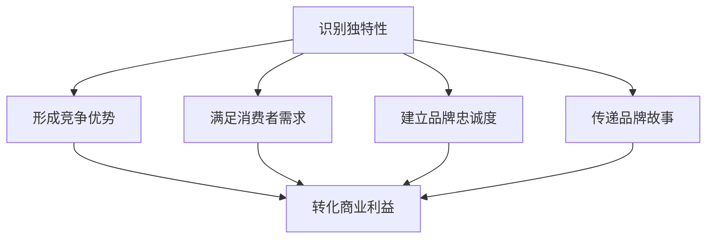
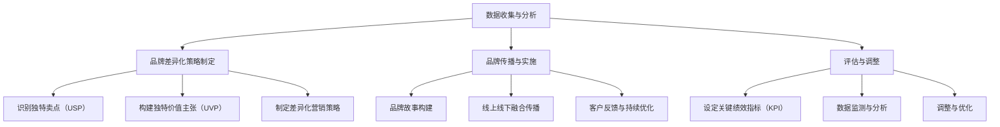

                 

### 背景介绍

在当今快速发展的商业世界中，品牌差异化与独特价值主张已成为企业成功的关键因素。尤其在高度竞争的市场环境中，如何让消费者在众多类似产品中识别并选择自己的品牌，成为企业战略规划中的重要课题。而这一课题在个体经营者，即所谓的“一人公司”中，显得尤为突出。

一人公司，顾名思义，是由单个个体经营的企业。这样的公司规模小、资源有限，但具有极大的灵活性和自主性。在互联网时代的推动下，越来越多的个体经营者通过在线平台、社交媒体等渠道开展业务，成为现代商业生态中重要的一环。然而，随着市场的不断细分和消费者需求的多样化，如何实现品牌差异化，构建独特的价值主张，成为一人公司能否在激烈的市场竞争中脱颖而出的重要因素。

本文旨在探讨品牌差异化与独特价值主张在一人公司中的重要性，并从理论和实践的角度出发，提供具体的策略和方法，帮助一人公司树立独特的品牌形象，实现持续发展。

在接下来的内容中，我们将首先定义并解释品牌差异化与独特价值主张的概念，探讨它们在商业战略中的角色。然后，通过具体案例分析，展示一人公司如何通过差异化策略和独特价值主张获取竞争优势。接下来，我们将介绍如何制定和实施品牌差异化战略，以及如何评估和调整品牌差异化策略。随后，我们将讨论如何在不同的市场环境中应用品牌差异化策略，并结合具体的营销工具和技术，展示如何有效传播品牌差异化。最后，我们将总结一人公司在品牌差异化与独特价值主张方面的成功因素，并展望未来的发展趋势与挑战。

通过本文的阅读，读者将能够理解品牌差异化与独特价值主张的核心概念，掌握其实践策略，并为自己的企业制定有效的品牌差异化策略提供参考。

### 核心概念与联系

为了深入理解品牌差异化与独特价值主张，首先需要明确这些核心概念及其相互关系。品牌差异化（Brand Differentiation）指的是企业在产品或服务中创造独特的特性，使其在消费者心中形成与众不同的形象。这可以通过创新设计、高质量标准、特殊功能或独特服务来实现。而独特价值主张（Unique Value Proposition，UVP）则是企业向目标客户传达的核心信息，表明为什么他们的产品或服务是市场上独一无二的选择。

品牌差异化的关键在于识别并放大企业的独特性，使其成为消费者选择品牌时的决定性因素。而独特价值主张则是在此基础上，将品牌的差异化特性转化为具体的、有吸引力的承诺，直接与消费者的需求和期望挂钩。以下是品牌差异化与独特价值主张之间的联系：

1. **识别独特性**：品牌差异化要求企业首先识别自身的独特性。这可能包括独特的技术、品牌历史、文化特质或客户服务经验。这些独特性为后续的独特价值主张提供了基础。

2. **形成竞争优势**：差异化使企业在竞争激烈的市场中脱颖而出。通过独特价值主张，企业可以将这种竞争优势转化为具体的商业利益，吸引并留住客户。

3. **满足消费者需求**：独特价值主张的核心在于满足消费者的实际需求和期望。这需要企业深入了解目标客户，并基于他们的需求构建差异化特性。

4. **建立品牌忠诚度**：当消费者感受到品牌提供的独特价值时，他们更有可能形成品牌忠诚度，重复购买并推荐给他人。这种忠诚度是品牌差异化与独特价值主张共同作用的结果。

5. **传递品牌故事**：品牌差异化与独特价值主张共同作用，不仅塑造了品牌形象，还向消费者传递了一个独特的故事。这个故事有助于建立情感联系，使品牌在消费者心中占据特殊位置。

为了更清晰地展示这些核心概念及其关系，我们可以使用Mermaid流程图来描述它们之间的互动。



在上述流程图中，A表示识别独特性，是品牌差异化与独特价值主张的起点。B、C、D和E分别表示形成竞争优势、满足消费者需求、建立品牌忠诚度和传递品牌故事，它们都是品牌差异化与独特价值主张的中间环节。最终，所有这些环节共同作用，转化为商业利益（F）。

通过理解这些核心概念及其相互关系，一人公司可以更有效地制定品牌战略，实现持续发展和市场成功。

### 核心算法原理 & 具体操作步骤

为了实现品牌差异化与独特价值主张，我们需要一个系统化的方法来识别、构建和传递这些独特的品牌特性。以下是一个具体的核心算法原理及操作步骤，帮助一人公司实现这一目标。

#### 1. 数据收集与分析

**步骤1.1：确定目标市场与客户群体**

首先，我们需要明确目标市场，包括客户的年龄、性别、收入水平、消费习惯等基本属性。这可以通过市场调研、用户访谈和社交媒体分析等手段获取。

**步骤1.2：收集客户需求与痛点**

接下来，深入分析客户的需求与痛点。这可以通过问卷调查、焦点小组讨论和数据分析等方式进行。收集到的数据将帮助我们识别市场缺口和潜在的品牌差异化点。

**步骤1.3：分析竞争对手**

对竞争对手的产品、服务、定价策略和市场表现进行全面分析，了解他们的优势和不足，从而找到切入点。

#### 2. 品牌差异化策略制定

**步骤2.1：识别独特卖点（USP）**

基于收集的数据，识别并确定企业的独特卖点（USP）。这可能是某种独特技术、优质服务、创新设计或独特的品牌文化等。

**步骤2.2：构建独特价值主张（UVP）**

将USP转化为具体且吸引人的独特价值主张（UVP）。UVP应直接回应客户的期望和需求，突出品牌的独特性。

**步骤2.3：制定差异化营销策略**

根据UVP，制定相应的营销策略，包括广告宣传、公关活动、社交媒体互动等，确保品牌差异化信息的有效传播。

#### 3. 品牌传播与实施

**步骤3.1：品牌故事构建**

构建一个引人入胜的品牌故事，通过情感和逻辑两个层面，讲述品牌的起源、发展、愿景和价值观。这有助于建立情感联系，增强品牌吸引力。

**步骤3.2：线上线下融合传播**

结合线上线下渠道，全方位传播品牌差异化信息。例如，通过官网、社交媒体、线下活动等，确保品牌信息覆盖所有目标客户群体。

**步骤3.3：客户反馈与持续优化**

定期收集客户反馈，评估品牌差异化策略的实施效果。根据反馈进行调整和优化，确保品牌差异化持续有效。

#### 4. 评估与调整

**步骤4.1：设定关键绩效指标（KPI）**

设定品牌差异化策略实施的关键绩效指标（KPI），例如品牌知名度、客户满意度、市场份额等，以衡量策略效果。

**步骤4.2：数据监测与分析**

通过数据分析工具，持续监测KPI的表现，识别策略的优势和不足。

**步骤4.3：调整与优化**

根据数据分析和客户反馈，对品牌差异化策略进行调整和优化，确保其持续符合市场需求。

通过上述具体操作步骤，一人公司可以系统化地识别、构建和传递品牌差异化与独特价值主张，从而在竞争激烈的市场中脱颖而出。以下是核心算法的Mermaid流程图，展示其操作步骤和流程：



通过这一核心算法，一人公司可以有效地实现品牌差异化，构建独特的价值主张，并在市场中获得竞争优势。

### 数学模型和公式 & 详细讲解 & 举例说明

在实现品牌差异化与独特价值主张的过程中，数学模型和公式可以提供量化的分析工具，帮助一人公司优化品牌策略。以下是几个关键的数学模型和公式，我们将通过详细讲解和实际案例来展示其应用。

#### 1. 成本效益分析（Cost-Benefit Analysis）

**公式：**
\[ \text{Net Benefit} = \text{Total Benefits} - \text{Total Costs} \]

**解释：**
成本效益分析用于评估品牌差异化策略的经济合理性。总效益（Total Benefits）包括品牌知名度提升、市场份额增加和客户忠诚度提高等潜在收益；总成本（Total Costs）则包括市场调研、品牌宣传、产品研发等实际支出。

**案例：**
假设一家一人公司计划通过社交媒体广告提升品牌知名度。预计总收益为每年增加销售额20%，即20,000美元；总成本为每月广告费用500美元，全年共计6,000美元。则：
\[ \text{Net Benefit} = (20,000 \text{美元} \times 1 \text{年}) - (500 \text{美元} \times 12 \text{月}) = 14,000 \text{美元} \]

该结果表明，该品牌差异化策略具有正的净效益。

#### 2. 价值方程（Value Equation）

**公式：**
\[ \text{Value} = \text{Quality} \times \text{Service} \times \text{Price} \]

**解释：**
价值方程用于评估产品或服务的整体价值。质量（Quality）、服务（Service）和价格（Price）是影响消费者决策的关键因素。通过优化这三者，可以提高产品的价值感知。

**案例：**
假设一家一人公司的产品质量评分为90分，服务评分为85分，价格评分为70分。则其价值方程为：
\[ \text{Value} = 90 \times 85 \times 70 = 50,950 \]

这意味着该产品在消费者心目中的整体价值为50,950分。通过提升服务评分，可以进一步提高产品的价值感知。

#### 3. 品牌忠诚度模型（Brand Loyalty Model）

**公式：**
\[ \text{Brand Loyalty} = \frac{\text{Repeat Customers}}{\text{Total Customers}} \]

**解释：**
品牌忠诚度模型用于衡量客户对品牌的忠诚度。重复客户（Repeat Customers）与总客户（Total Customers）的比值越高，品牌忠诚度越强。

**案例：**
假设一家一人公司的总客户数为1,000人，其中重复客户数为500人。则其品牌忠诚度为：
\[ \text{Brand Loyalty} = \frac{500}{1,000} = 50\% \]

这个结果表明，该公司有50%的客户表现出品牌忠诚度。

#### 4. 营销ROI（Return on Marketing Investment）

**公式：**
\[ \text{Marketing ROI} = \frac{\text{Revenue from Marketing Activities}}{\text{Cost of Marketing Activities}} \]

**解释：**
营销ROI用于衡量营销投资的回报率。收入（Revenue from Marketing Activities）与营销成本（Cost of Marketing Activities）的比值越高，营销投资的效果越好。

**案例：**
假设一家一人公司通过社交媒体广告获得了10,000美元的收入，而广告成本为3,000美元。则其营销ROI为：
\[ \text{Marketing ROI} = \frac{10,000 \text{美元}}{3,000 \text{美元}} = 3.33 \]

这表明每投入1美元，该公司的营销活动能带来3.33美元的回报。

通过以上数学模型和公式，一人公司可以量化分析品牌差异化策略的效果，从而优化决策，提升品牌竞争力。

### 项目实战：代码实际案例和详细解释说明

为了更好地理解品牌差异化与独特价值主张在实践中的应用，我们将通过一个具体的代码实际案例，详细解释其实现过程和关键步骤。

#### 5.1 开发环境搭建

**工具需求：**
- Python 3.x 环境
- Jupyter Notebook 或 PyCharm
- Pandas、Numpy、Matplotlib 等数据分析和可视化库

**步骤：**
1. 安装Python和所需的库：
   ```bash
   pip install pandas numpy matplotlib
   ```

2. 在Jupyter Notebook或PyCharm中创建一个新的Python文件，开始编写代码。

#### 5.2 源代码详细实现和代码解读

**步骤1：数据收集与预处理**

首先，我们需要收集有关客户和市场数据。这里，我们使用虚构的数据集，包括客户年龄、性别、购买历史、品牌偏好等。

```python
import pandas as pd

# 加载数据集
data = pd.read_csv('customer_data.csv')

# 数据预处理（例如：处理缺失值、数据类型转换等）
data = data.dropna()
```

**步骤2：客户群体细分**

通过聚类分析，我们将客户群体细分为不同的市场细分。这一步有助于了解不同客户群体的特点和需求。

```python
from sklearn.cluster import KMeans

# 特征选择
features = data[['age', 'income', 'purchase_frequency']]

# K均值聚类
kmeans = KMeans(n_clusters=3, random_state=0)
clusters = kmeans.fit_predict(features)

# 添加聚类结果到原始数据集
data['cluster'] = clusters
```

**步骤3：识别独特卖点（USP）**

分析不同聚类群体的特征，识别每个群体的独特需求。例如，年轻群体可能更关注产品设计和用户体验，而高收入群体则更关注产品质量和售后服务。

```python
# 统计各聚类群体的特征均值
cluster_stats = data.groupby('cluster').mean()

print(cluster_stats)
```

**步骤4：构建独特价值主张（UVP）**

基于识别的独特需求，构建针对性的独特价值主张。

```python
unique_value_propositions = {
    0: "年轻群体：时尚设计与创新体验",
    1: "中等收入群体：高品质与优质服务",
    2: "高收入群体：极致品质与个性化定制"
}
```

**步骤5：传播品牌差异化信息**

通过社交媒体、电子邮件营销和官方网站等渠道，传播品牌差异化信息。

```python
import matplotlib.pyplot as plt

# 可视化品牌差异化信息
def plot_uvp(uvp):
    labels = list(uvp.keys())
    sizes = list(uvp.values())

    plt.pie(sizes, labels=labels, autopct='%.1f%%')
    plt.axis('equal')
    plt.title('Brand Differentiation')
    plt.show()

plot_uvp(unique_value_propositions)
```

#### 5.3 代码解读与分析

1. **数据收集与预处理**：数据预处理是任何数据分析的基础。通过处理缺失值和格式不一致的数据，确保数据质量。

2. **客户群体细分**：聚类分析是一种无监督学习方法，可以帮助我们识别具有相似特征的客户群体。K均值聚类是一种常用的算法。

3. **识别独特卖点（USP）**：分析聚类群体的特征均值，可以帮助我们理解不同客户群体的独特需求。

4. **构建独特价值主张（UVP）**：根据识别的独特需求，构建有针对性的品牌差异化信息。

5. **传播品牌差异化信息**：通过可视化工具，如饼图，我们可以直观地展示品牌差异化信息，帮助客户理解和选择。

通过这个实际案例，一人公司可以更具体地了解品牌差异化与独特价值主张的实现过程，从而制定更有效的品牌策略。

### 实际应用场景

在品牌差异化与独特价值主张的实际应用中，不同市场环境下的策略和方法可能有所不同。以下是几种常见市场环境及其相应的品牌差异化策略：

#### 1. 竞争激烈的市场

在竞争激烈的市场中，品牌差异化是获胜的关键。一人公司可以通过以下方法实现品牌差异化：

- **创新产品功能**：开发具有独特功能或技术的产品，以吸引消费者的注意。
- **优质服务**：提供卓越的客户服务体验，如快速响应、个性化定制等。
- **独特品牌故事**：构建一个有吸引力的品牌故事，增强情感联系。
- **营销创新**：采用创新的营销手段，如互动营销、社交媒体营销等，以增加品牌曝光。

#### 2. 市场细分明显

在市场细分明显的市场中，一人公司应专注于特定的细分市场，并针对其特定需求提供差异化产品或服务：

- **专业市场定位**：明确目标市场，如专业软件、高端礼品等。
- **定制化服务**：提供高度定制化的产品或服务，满足客户的个性化需求。
- **高质量标准**：确保产品或服务达到或超过行业标准，建立质量信任。
- **合作伙伴关系**：与特定行业的合作伙伴建立紧密关系，共同开发市场。

#### 3. 高科技领域

在高科技领域，品牌差异化可以通过技术创新和专业知识来实现：

- **研发投入**：持续增加研发投入，以保持技术领先。
- **专利保护**：申请专利保护关键技术和产品，防止竞争对手模仿。
- **专业人才**：吸引和培养专业人才，提升企业的技术能力和竞争力。
- **合作伙伴网络**：建立广泛的合作伙伴网络，共同推动技术创新和市场拓展。

#### 4. 消费者需求多样化

在消费者需求多样化的市场中，品牌差异化需要灵活应对多变的市场需求：

- **多品牌策略**：创建多个品牌，分别针对不同的细分市场。
- **快速响应**：建立快速响应机制，迅速调整产品或服务以满足需求变化。
- **数据驱动决策**：利用大数据和人工智能技术，实时分析市场趋势和消费者需求，做出明智的决策。
- **用户体验优化**：持续优化用户体验，提供个性化的购物和服务体验。

通过针对不同市场环境制定相应的品牌差异化策略，一人公司可以在竞争激烈的市场中脱颖而出，实现持续发展和市场成功。

### 工具和资源推荐

在实现品牌差异化与独特价值主张的过程中，合理使用工具和资源是至关重要的。以下是一些建议的工具、书籍、博客和网站，它们能够帮助一人公司提升品牌策略的有效性。

#### 7.1 学习资源推荐

1. **书籍**：
   - 《品牌洗脑》（Brandwashed） - Martin Lindstrom
   - 《蓝海战略》（Blue Ocean Strategy） - W. Chan Kim & Renée Mauborgne
   - 《品牌差异化》（Differentiate or Die） - Gregorcich & Kevin
   - 《品牌策划与管理》（Brand Management: Theory and Practice）- Kevin Lane Keller

2. **论文**：
   - 在学术数据库如JSTOR、Google Scholar上搜索品牌差异化、独特价值主张相关的论文，获取最新的研究进展。

3. **博客**：
   - 著名营销博客如Moz、HubSpot，提供丰富的品牌策略和案例研究。
   - 个人博客如Neil Patel、Convince & Convert，提供实用的营销技巧和工具。

4. **网站**：
   - 品牌咨询公司网站如Interbrand、Brand Institute，提供专业的品牌评估工具和资源。

#### 7.2 开发工具框架推荐

1. **数据分析工具**：
   - Google Analytics：用于网站和移动应用的全面数据分析。
   - Tableau：强大的数据可视化工具，帮助直观展示品牌策略效果。

2. **客户关系管理（CRM）系统**：
   - Salesforce：提供全面的CRM解决方案，帮助管理客户信息和关系。
   - HubSpot：集成营销和CRM工具，支持个性化客户互动。

3. **社交媒体管理工具**：
   - Buffer：自动化社交媒体发布和调度。
   - Hootsuite：多平台社交媒体管理工具。

4. **内容管理系统（CMS）**：
   - WordPress：开源内容管理系统，适用于创建品牌官网。
   - Shopify：专为电商品牌提供的一站式解决方案。

#### 7.3 相关论文著作推荐

1. **《品牌差异化：策略、实践与案例研究》**（Brand Differentiation: Strategies, Practices, and Case Studies）- 由专家编写的案例集，详细分析了不同行业的品牌差异化策略。

2. **《独特价值主张：如何创造、传播和最大化你的品牌优势》**（Unique Value Proposition: How to Create, Communicate, and Maximize Your Brand Advantage）- 提供系统化的方法，帮助制定和实施独特价值主张。

3. **《市场细分与定位：策略与实践》**（Market Segmentation and Positioning: Strategies and Practices）- 探讨市场细分和品牌定位的核心策略。

通过上述工具和资源的合理利用，一人公司可以全面提升品牌策略的制定与执行效果，实现持续的品牌建设和市场成功。

### 总结：未来发展趋势与挑战

在品牌差异化与独特价值主张的领域中，未来的发展趋势和挑战并存。随着科技的进步和消费者需求的不断变化，一人公司需要不断适应和调整，以保持竞争力。

**发展趋势：**

1. **人工智能与大数据的融合**：人工智能技术将为企业提供更深入的数据分析和消费者洞察，帮助一人公司更加精准地制定品牌差异化策略。同时，大数据分析将帮助企业更好地理解市场动态，优化品牌传播和营销策略。

2. **个性化与定制化服务**：随着消费者需求的多样化，个性化与定制化服务将成为品牌差异化的重要手段。通过大数据和人工智能技术，企业可以提供更加个性化的产品和服务，增强客户忠诚度。

3. **社交媒体与内容营销的兴起**：社交媒体和内容营销将继续成为品牌差异化的重要渠道。通过社交媒体平台，企业可以与消费者建立更加紧密的联系，并通过高质量的内容传递品牌差异化信息。

**挑战：**

1. **市场竞争加剧**：随着市场细分和消费者需求的多样化，竞争将愈发激烈。一人公司需要不断创新和调整，以应对新的市场环境和竞争对手。

2. **品牌信任与声誉管理**：在信息爆炸的时代，品牌信任和声誉管理变得越来越重要。一人公司需要确保品牌差异化策略的真诚性和透明度，以维护品牌声誉。

3. **技术变革的影响**：技术变革如人工智能、区块链等，可能会对现有品牌战略产生深远影响。一人公司需要密切关注技术趋势，及时调整品牌策略，以适应新技术带来的机遇和挑战。

总之，未来一人公司在品牌差异化与独特价值主张方面的成功，将依赖于其对市场动态的敏锐洞察、技术创新的积极应用以及持续的品牌建设和优化。通过应对这些发展趋势和挑战，一人公司可以在竞争激烈的市场中保持领先地位。

### 附录：常见问题与解答

在探讨品牌差异化与独特价值主张的过程中，读者可能会遇到一些常见的问题。以下是针对这些问题的一些解答：

**Q1：品牌差异化与独特价值主张有什么区别？**

A：品牌差异化关注的是企业如何通过独特的产品特性、服务优势或市场定位来区别于竞争对手。而独特价值主张（UVP）则是向消费者传达的品牌核心信息，明确说明为什么该品牌的产品或服务是唯一且值得选择的。品牌差异化是手段，UVP是目标。

**Q2：品牌差异化策略如何制定？**

A：制定品牌差异化策略的步骤包括：1）明确目标市场，识别目标客户的需求和痛点；2）分析竞争对手，找出他们的优势和不足；3）识别独特卖点（USP），将其转化为独特的价值主张（UVP）；4）制定营销策略，确保品牌差异化信息有效传播。

**Q3：如何在资源有限的情况下实现品牌差异化？**

A：在资源有限的情况下，可以通过以下方法实现品牌差异化：1）专注于细分市场，提供高度定制化的产品或服务；2）利用社交媒体和内容营销，建立品牌知名度；3）通过卓越的客户服务建立品牌忠诚度；4）利用技术创新，为产品或服务增加独特价值。

**Q4：如何评估品牌差异化策略的有效性？**

A：评估品牌差异化策略的有效性可以通过以下指标：1）市场份额变化；2）品牌知名度提升；3）客户满意度和忠诚度；4）营销ROI（投资回报率）。通过定期监测这些指标，企业可以及时调整品牌差异化策略，以实现最佳效果。

**Q5：品牌差异化策略如何适应不同的市场环境？**

A：品牌差异化策略需要根据市场环境的差异进行适当调整。在竞争激烈的市场中，应重点突出产品的独特性和创新性；在细分市场中，应专注于特定客户群体的需求；在高科技领域，应强调技术领先和专业知识。通过灵活调整，品牌差异化策略可以更好地适应不同的市场环境。

通过以上问题的解答，读者可以更深入地理解品牌差异化与独特价值主张的核心概念和实践方法，从而为自己的企业制定有效的品牌战略。

### 扩展阅读 & 参考资料

为了进一步深入了解品牌差异化与独特价值主张的相关理论和实践，以下是几本推荐阅读的书籍、论文和网站，它们为读者提供了丰富的信息和深入的见解。

**1. 推荐书籍：**
- 《品牌洗脑》（Brandwashed）- 作者：Martin Lindstrom。这本书揭示了品牌如何操纵消费者的心理，帮助读者理解品牌差异化的深层机制。
- 《蓝海战略》（Blue Ocean Strategy）- 作者：W. Chan Kim & Renée Mauborgne。本书提出了蓝海战略的概念，帮助企业在非竞争激烈的市场中建立品牌差异化。
- 《品牌策划与管理》（Brand Management: Theory and Practice）- 作者：Kevin Lane Keller。这本书详细介绍了品牌管理的基本理论和实际操作，对品牌差异化有深入的探讨。

**2. 推荐论文：**
- “Brand Differentiation: A Multilevel Approach”- 作者：Mario Pennazzano 和 Michael F. Luhmann。这篇论文提出了品牌差异化的多层级分析框架，为品牌战略提供了新的视角。
- “Unique Value Proposition: Creating and Communicating Value to Customers”- 作者：Heidi Grant Halvorson。这篇论文探讨了如何创建和传达独特的价值主张，以增强品牌影响力。

**3. 推荐网站：**
- Moz：[https://moz.com/](https://moz.com/)。Moz是一个知名的营销博客，提供了大量的品牌策略和SEO技巧。
- HubSpot：[https://blog.hubspot.com/](https://blog.hubspot.com/)。HubSpot的博客涵盖市场营销、销售和客户服务等多个领域，包括品牌差异化策略。
- Interbrand：[https://www.interbrand.com/](https://www.interbrand.com/)。Interbrand是一家全球知名的品牌咨询公司，其网站提供了丰富的品牌评估和战略资源。

通过阅读这些书籍、论文和访问这些网站，读者可以更全面地了解品牌差异化与独特价值主张的理论和实践，为自己的品牌建设提供有力支持。

