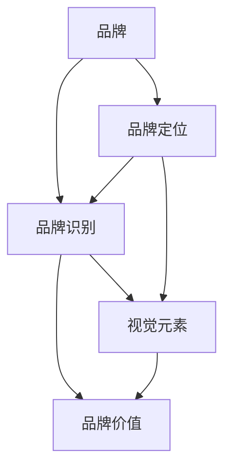

                 

### 1. 背景介绍

#### 1.1 一人公司的兴起

在当今数字化时代，随着互联网和电子商务的迅猛发展，一人公司（也称“个体经营”或“SOHO公司”）已经成为创业和创新的重要形式。一人公司通常指的是由一个人独自经营、管理的公司，无需其他合伙人或员工。这种模式不仅降低了创业的门槛，还使得创业者能够更加灵活地掌控公司的发展方向。

一人公司的兴起有着多方面的原因。首先，互联网的普及使得信息获取和资源共享变得更加便捷，创业者可以轻松地接触到全球市场。其次，云计算和远程办公技术的进步，使得创业者无需租用昂贵的办公场地和设备，就能有效地进行业务运营。此外，移动支付和在线金融服务的普及，也为一人公司的财务管理提供了便利。

#### 1.2 品牌识别系统的重要性

对于一人公司来说，品牌识别系统（Brand Identity System）至关重要。品牌识别系统是指一系列视觉元素和策略，用以传达公司的核心价值和形象。它包括但不限于公司标志、标准字体、色彩方案、口号和视觉风格等。

一个强大的品牌识别系统有助于以下几个方面：

1. **增强品牌认知**：一致的视觉元素和传达策略能够让人们快速识别公司，增强品牌记忆点。
2. **建立品牌形象**：品牌识别系统有助于塑造公司的专业形象和价值观，吸引目标客户。
3. **提升品牌价值**：良好的品牌识别系统能够提升品牌的市场竞争力，增加品牌溢价。
4. **促进品牌传播**：通过多种渠道传播品牌识别元素，有助于扩大品牌影响力。

#### 1.3 品牌识别系统与一人公司

一人公司由于规模较小，资源有限，因此在设计和实施品牌识别系统时需要更加谨慎和有效。以下是一些关键点：

1. **统一性与灵活性**：品牌识别系统需要保持统一性，同时也要具有一定的灵活性，以适应不同的营销渠道和业务场景。
2. **个性化和专业性**：品牌识别系统应体现公司的个性和专业能力，避免过于平庸或模糊。
3. **成本效益**：一人公司需要考虑成本问题，因此品牌识别系统的设计和实施应追求高效和低成本的解决方案。
4. **持续优化**：品牌识别系统不是一成不变的，需要根据市场反馈和业务发展不断进行调整和优化。

### 1.4 本篇博客的目的

本篇博客旨在为一人公司的创业者提供一套系统化的品牌识别系统设计与应用指南。我们将从核心概念出发，逐步深入探讨品牌识别系统的各个方面，并通过实际案例进行详细讲解，帮助读者设计出既符合公司特点，又具备市场竞争力的高质量品牌识别系统。

让我们开始这一段富有创造性和实用性的旅程吧！<sop><|user|>### 2. 核心概念与联系

在深入探讨品牌识别系统的设计与应用之前，我们需要了解一些核心概念，并分析它们之间的相互联系。这些核心概念包括品牌、品牌识别、品牌定位、视觉元素等。接下来，我们将逐一介绍这些概念，并通过Mermaid流程图展示它们之间的关系。

#### 2.1 品牌

品牌（Brand）是企业或产品在市场中的一种标识，它代表着企业的声誉、价值观和产品或服务的特色。品牌不仅是企业的商标，更是消费者对产品或服务的整体认知和情感联结。

#### 2.2 品牌识别

品牌识别（Brand Identity）是指企业或产品在视觉和传达上的一整套要素，包括标志、标准字体、色彩方案、口号、视觉风格等。品牌识别是企业形象的重要组成部分，通过统一的视觉元素和传达策略，帮助消费者快速识别并记住品牌。

#### 2.3 品牌定位

品牌定位（Brand Positioning）是指企业在市场中确定其产品或服务的位置，以区别于竞争对手。品牌定位需要明确目标市场和目标客户，并通过品牌识别系统来传达品牌的核心价值和差异化优势。

#### 2.4 视觉元素

视觉元素（Visual Elements）是品牌识别系统的核心组成部分，包括标志、标准字体、色彩方案等。这些视觉元素需要遵循一致性和专业性的原则，以形成品牌独特的视觉风格。

#### 2.5 核心概念联系

下面我们通过Mermaid流程图展示这些核心概念之间的联系：



在上述流程图中：

- **品牌**是整个系统的核心，它决定了品牌识别和品牌定位的方向。
- **品牌识别**和**品牌定位**紧密相连，品牌识别系统需要支持品牌定位的传达。
- **视觉元素**是品牌识别的具体实现，它们共同构成了品牌在市场中的视觉风格。
- **品牌价值**是品牌识别和品牌定位的最终目标，通过统一的视觉元素和定位策略，提升品牌的市场竞争力。

通过以上核心概念与联系的分析，我们可以更好地理解品牌识别系统的设计与实施。接下来，我们将进一步探讨品牌识别系统的具体设计原则和流程。<sop><|user|>### 2.1 品牌的概念与重要性

品牌是一种标识，它代表了企业的声誉、价值观和产品或服务的特点。一个强大的品牌不仅仅是一个名字或标志，它是一种情感的联结，能够激发消费者的忠诚和共鸣。

#### 2.1.1 品牌的构成要素

品牌由多个要素构成，包括：

- **名称**：品牌名称是消费者识别品牌的第一个要素，它需要简洁、易记、有辨识度。
- **标志**：品牌标志（Logo）是视觉识别的核心，它需要与品牌名称相呼应，传递品牌的独特性和价值观。
- **口号**：品牌口号是简短而有力的语句，它能够概括品牌的核心价值，增强品牌的记忆点。
- **视觉风格**：品牌视觉风格包括色彩、字体、图像等元素，它们共同构成了品牌的视觉形象。
- **品牌故事**：品牌故事是品牌的起源、发展历程和核心价值的描述，它能够加深消费者对品牌的理解和情感联结。

#### 2.1.2 品牌的重要性

品牌对于企业的成功至关重要，它具有以下几方面的重要性：

1. **区分竞争对手**：品牌能够帮助消费者在众多同类产品或服务中快速识别和选择，从而区分竞争对手。
2. **塑造企业形象**：品牌是企业形象的代表，通过统一的视觉和传达策略，能够塑造专业的企业形象，提升消费者信任感。
3. **增加品牌溢价**：强大的品牌能够吸引消费者，提升产品的市场竞争力，从而增加品牌溢价。
4. **促进品牌传播**：品牌是品牌传播的载体，通过各种渠道传播品牌元素，有助于扩大品牌影响力和知名度。
5. **增强消费者忠诚度**：品牌能够与消费者建立情感联结，增加消费者的忠诚度和重复购买率。

#### 2.1.3 品牌对一人公司的影响

对于一人公司来说，品牌的重要性尤为突出。由于资源有限，一人公司无法通过大规模的广告和营销活动来提升品牌知名度，因此品牌成为了其在市场中脱颖而出的关键。以下是一些品牌对一人公司的影响：

1. **市场竞争力**：一个强大的品牌能够提升一人公司的市场竞争力，吸引目标客户，增加销售机会。
2. **客户信任**：品牌能够建立消费者对一人公司的信任，减少消费者决策过程中的风险，增加购买意愿。
3. **品牌溢价**：一人公司通过打造强大的品牌，能够提升产品的市场价值，实现更高的利润空间。
4. **差异化优势**：品牌识别系统有助于一人公司在市场中形成差异化优势，避免与竞争对手的同质化竞争。

### 2.1.4 品牌识别系统与一人公司的关系

品牌识别系统是品牌建设的核心，对于一人公司来说，设计一套有效的品牌识别系统至关重要。品牌识别系统不仅能够提升品牌形象，还能够传递公司的核心价值和专业能力，从而增强品牌的市场竞争力。

#### 2.1.5 设计原则

在为一人公司设计品牌识别系统时，应遵循以下原则：

1. **简洁明了**：品牌识别系统应简洁明了，避免过多的装饰和复杂的元素，以便消费者快速识别和记忆。
2. **一致性与灵活性**：品牌识别系统需要保持一致性，同时也要具有一定的灵活性，以适应不同的营销渠道和业务场景。
3. **专业性与个性化**：品牌识别系统应体现公司的专业能力和个性化特色，避免过于平庸或模糊。
4. **成本效益**：一人公司需要考虑成本问题，因此品牌识别系统的设计和实施应追求高效和低成本的解决方案。
5. **持续优化**：品牌识别系统不是一成不变的，需要根据市场反馈和业务发展不断进行调整和优化。

通过以上对品牌的概念、重要性及其对一人公司的影响的分析，我们可以更好地理解品牌识别系统在品牌建设中的关键作用。接下来，我们将继续探讨品牌识别系统的具体构成要素和设计流程。<sop><|user|>### 2.2 品牌识别系统的概念与构成

品牌识别系统（Brand Identity System）是指企业或产品在视觉和传达上的一整套要素，它们共同构成了品牌的视觉风格和核心价值。品牌识别系统不仅包括标志、标准字体和色彩方案等视觉元素，还涉及到品牌口号、视觉风格指南等传达策略。一个成功的品牌识别系统能够帮助企业在市场中脱颖而出，建立品牌认知和形象。

#### 2.2.1 品牌识别系统的定义

品牌识别系统是企业或产品在市场上与其他竞争者区分开来的标志和视觉元素的总和。它不仅仅是一个标志或者几个色彩，而是一套系统化的视觉和传达策略，旨在传达品牌的核心价值和理念。

#### 2.2.2 品牌识别系统的构成要素

品牌识别系统通常包括以下关键要素：

1. **标志（Logo）**：标志是品牌识别系统中最核心的视觉元素，它通常是一个简洁而具有辨识度的图形或文字组合。标志不仅要美观，还要能够传达品牌的核心理念和独特性。

2. **标准字体（Font）**：标准字体是品牌传达信息的重要工具，它需要与品牌标志相协调，同时确保在各种媒介上具有良好的可读性和辨识度。

3. **色彩方案（Color Palette）**：色彩在品牌识别系统中扮演着关键角色，它能够传达品牌情感和个性。一个统一的色彩方案有助于品牌在市场中形成独特的视觉风格。

4. **品牌口号（Tagline）**：品牌口号是一句简短而有力的语句，它能够概括品牌的核心价值和使命。一个好的品牌口号能够增加品牌的记忆点，提升品牌的影响力。

5. **视觉风格指南（Visual Style Guide）**：视觉风格指南是一份详细的文档，它规定了品牌在不同应用场景中的视觉元素使用规范。视觉风格指南有助于保持品牌识别系统的一致性和专业性。

6. **其他视觉元素**：除了上述关键要素，品牌识别系统还可能包括品牌故事、产品包装、广告海报、社交媒体形象等视觉元素。

#### 2.2.3 品牌识别系统的设计原则

设计品牌识别系统时，应遵循以下原则：

1. **简洁性**：品牌识别系统应简洁明了，避免复杂的元素和冗长的描述，以便消费者快速理解和记忆。

2. **一致性**：品牌识别系统需要在各种应用场景中保持一致性，确保品牌形象在消费者心中保持一致。

3. **专业性**：品牌识别系统应体现企业的专业性和权威性，增强消费者对品牌的信任感。

4. **个性化**：品牌识别系统应反映企业的独特性和个性，避免与竞争对手的同质化。

5. **适应性**：品牌识别系统需要具备一定的灵活性，以适应不同的市场和业务需求。

6. **可持续性**：品牌识别系统不是一成不变的，需要根据市场反馈和业务发展不断进行调整和优化。

#### 2.2.4 品牌识别系统的作用

品牌识别系统在品牌建设中起着至关重要的作用，它具有以下几方面的作用：

1. **增强品牌认知**：通过统一的视觉元素和传达策略，品牌识别系统能够帮助消费者快速识别和记住品牌。

2. **建立品牌形象**：品牌识别系统能够传递品牌的核心价值和专业能力，塑造品牌形象。

3. **提升品牌价值**：一个成功的品牌识别系统能够提升品牌的市场竞争力，增加品牌溢价。

4. **促进品牌传播**：品牌识别系统通过多种渠道传播，有助于扩大品牌影响力和知名度。

5. **增强消费者忠诚度**：品牌识别系统能够与消费者建立情感联结，增加消费者的忠诚度和重复购买率。

通过以上对品牌识别系统的概念、构成要素和设计原则的探讨，我们可以更好地理解其在品牌建设中的关键作用。接下来，我们将进一步分析品牌定位的概念和策略。<sop><|user|>### 2.3 品牌定位的概念与策略

品牌定位是品牌战略中至关重要的一环，它涉及到企业如何确定其在市场中的位置，如何区别于竞争对手，以及如何吸引和保留目标客户。有效的品牌定位能够帮助企业建立清晰的差异化优势，提升品牌的市场竞争力。

#### 2.3.1 品牌定位的定义

品牌定位（Brand Positioning）是指企业在市场中确定其产品或服务的位置，以区别于竞争对手，并在消费者心中建立独特的认知和价值。品牌定位不仅仅是对产品和服务的描述，更是对消费者心理和需求的把握。

#### 2.3.2 品牌定位的要素

品牌定位包含以下几个关键要素：

1. **目标市场**：确定目标市场是品牌定位的第一步，它涉及到市场细分和目标客户的选择。明确目标市场有助于企业集中资源，提供更加针对性的产品和服务。

2. **品牌价值主张**：品牌价值主张（Value Proposition）是指品牌向消费者承诺的核心价值和独特卖点。品牌价值主张需要清晰、有力，能够吸引目标客户的注意力。

3. **差异化优势**：差异化优势是指品牌在市场中的独特竞争力，它可以帮助品牌在众多竞争者中脱颖而出。差异化优势可以是产品的独特特性、服务质量、品牌文化等。

4. **品牌形象**：品牌形象是品牌在消费者心中的整体印象，它需要与品牌定位相一致，并通过品牌识别系统传达出来。

5. **沟通策略**：品牌定位的沟通策略涉及到如何通过各种渠道向目标客户传达品牌价值主张和差异化优势。有效的沟通策略能够增强品牌定位的效果。

#### 2.3.3 品牌定位的策略

为了实现有效的品牌定位，企业可以采取以下策略：

1. **明确目标市场**：通过市场调研和数据分析，明确目标市场和目标客户，了解他们的需求和偏好。

2. **确定品牌价值主张**：基于目标市场的需求，明确品牌的核心价值和独特卖点，确保品牌价值主张能够吸引目标客户。

3. **塑造差异化优势**：通过产品创新、服务质量提升、品牌文化塑造等方式，建立品牌的差异化优势，使品牌在市场中脱颖而出。

4. **设计品牌识别系统**：通过标志、标准字体、色彩方案等视觉元素，设计一套能够体现品牌定位和差异化优势的品牌识别系统。

5. **实施有效的沟通策略**：通过广告、公关活动、社交媒体等多种渠道，实施有效的沟通策略，向目标客户传达品牌价值主张和差异化优势。

6. **持续优化**：品牌定位不是一成不变的，企业需要根据市场反馈和业务发展不断优化品牌定位策略。

#### 2.3.4 品牌定位对一人公司的影响

对于一人公司来说，品牌定位尤为关键。由于资源有限，一人公司无法通过大规模的广告和营销活动来提升品牌知名度，因此品牌定位成为了其在市场中脱颖而出的重要策略。以下是一些品牌定位对一人公司的影响：

1. **明确目标市场**：品牌定位有助于一人公司明确目标市场，集中资源提供更有针对性的产品和服务。

2. **塑造差异化优势**：通过品牌定位，一人公司可以明确其差异化优势，使品牌在市场中具有独特的竞争力。

3. **提升品牌形象**：品牌定位通过设计品牌识别系统和实施有效的沟通策略，有助于提升品牌形象，增强消费者对品牌的信任感。

4. **增强市场竞争力**：品牌定位使一人公司能够更好地与竞争对手区分开来，提升市场竞争力。

5. **增加品牌溢价**：品牌定位有助于一人公司提升品牌价值，实现更高的利润空间。

### 2.3.5 品牌定位与品牌识别系统的关系

品牌定位和品牌识别系统是相互关联的。品牌定位决定了品牌识别系统的设计和传达策略，而品牌识别系统则是品牌定位的具体实现。品牌定位需要通过品牌识别系统来传达，通过一致的视觉和传达元素，使品牌在消费者心中建立独特的认知和价值。

综上所述，品牌定位是品牌建设中的关键环节，它帮助企业在市场中确定位置，区别竞争对手，吸引目标客户。有效的品牌定位需要结合品牌识别系统，通过统一的视觉和传达策略，实现品牌价值的最大化。接下来，我们将进一步探讨视觉元素在品牌识别系统中的作用和设计原则。<sop><|user|>### 2.4 视觉元素在品牌识别系统中的作用和设计原则

视觉元素是品牌识别系统中的核心组成部分，它们通过视觉语言传达品牌的核心价值和差异化优势。在品牌识别系统中，视觉元素的作用至关重要，它们不仅能够吸引消费者的注意力，还能够增强品牌认知和情感联结。以下将详细讨论视觉元素在品牌识别系统中的作用以及设计原则。

#### 2.4.1 标志（Logo）的作用和设计原则

标志是品牌识别系统中最具代表性的视觉元素，它通常是一个简洁而具有辨识度的图形或文字组合。标志的作用包括：

1. **品牌识别**：标志是消费者识别品牌的第一个要素，它能够在瞬间传达品牌的核心价值和个性。
2. **品牌记忆**：一个独特的标志有助于消费者记住品牌，提高品牌认知度。
3. **品牌情感联结**：标志的设计能够激发消费者的情感，建立品牌与消费者之间的情感联结。

在设计标志时，应遵循以下原则：

1. **简洁性**：标志应简洁明了，避免复杂的设计元素，以便在视觉上更容易识别和记忆。
2. **独特性**：标志应具有独特性，能够区别于竞争对手，形成品牌的视觉特色。
3. **可扩展性**：标志在不同尺寸和媒介上应保持清晰可辨，具有良好的可扩展性。
4. **适应性**：标志需要适应不同的应用场景，如名片、广告、产品包装等。

#### 2.4.2 标准字体（Font）的作用和设计原则

标准字体是品牌传达信息的重要工具，它在品牌识别系统中起着关键作用。标准字体应与品牌标志相协调，同时确保在各种媒介上具有良好的可读性和辨识度。标准字体的作用包括：

1. **品牌形象**：标准字体能够传递品牌的个性和风格，有助于塑造品牌形象。
2. **信息传达**：标准字体是品牌传达信息的重要载体，它需要确保信息的准确性和可读性。
3. **一致性**：标准字体在品牌识别系统中需要保持一致性，以增强品牌的专业性和权威性。

在设计标准字体时，应遵循以下原则：

1. **协调性**：标准字体应与品牌标志相协调，形成统一的视觉风格。
2. **可读性**：标准字体需要在不同尺寸和背景上保持良好的可读性，避免过细或过粗的字体设计。
3. **简洁性**：标准字体应简洁明了，避免过多的装饰和复杂的细节。
4. **一致性**：品牌识别系统中的所有文本内容应使用同一标准字体，确保品牌形象的一致性。

#### 2.4.3 色彩方案（Color Palette）的作用和设计原则

色彩在品牌识别系统中扮演着重要角色，它能够传达品牌情感和个性。一个统一的色彩方案有助于品牌在市场中形成独特的视觉风格。色彩方案的作用包括：

1. **品牌情感**：色彩能够传递品牌的情感和价值观，如蓝色代表信任和专业，红色代表热情和活力。
2. **品牌识别**：统一的色彩方案有助于消费者快速识别品牌，增强品牌记忆点。
3. **视觉风格**：色彩方案是品牌视觉风格的重要组成部分，它能够提升品牌的整体视觉效果。

在设计色彩方案时，应遵循以下原则：

1. **协调性**：色彩方案应协调一致，避免色彩过于复杂或冲突。
2. **代表性**：色彩应具有代表性，能够传达品牌的核心价值和情感。
3. **适应性**：色彩方案需要适应不同的应用场景，如网站、广告、产品包装等。
4. **可持续性**：色彩方案应考虑长期使用，避免频繁更改，以保持品牌形象的稳定性。

#### 2.4.4 其他视觉元素的作用和设计原则

除了标志、标准字体和色彩方案，品牌识别系统还可能包括其他视觉元素，如品牌口号、视觉风格指南、产品包装、广告海报等。这些视觉元素共同构成了品牌的视觉风格，它们的作用和设计原则包括：

1. **品牌口号**：品牌口号是一句简短而有力的语句，它能够概括品牌的核心价值和使命。设计原则包括简洁、有力、易于记忆。
2. **视觉风格指南**：视觉风格指南是一份详细的文档，规定了品牌在不同应用场景中的视觉元素使用规范。设计原则包括一致性、专业性和灵活性。
3. **产品包装**：产品包装是品牌视觉形象的重要组成部分，它需要与品牌视觉风格相一致，同时确保包装的功能性和美观性。
4. **广告海报**：广告海报是品牌传播的重要渠道，它需要通过视觉元素传达品牌的核心价值和差异化优势。设计原则包括创意、简洁和吸引力。

通过以上对视觉元素在品牌识别系统中的作用和设计原则的探讨，我们可以更好地理解如何设计和实施一个有效的品牌识别系统。接下来，我们将深入讨论如何通过核心算法原理和具体操作步骤来设计和实施品牌识别系统。<sop><|user|>### 3. 核心算法原理 & 具体操作步骤

在设计和实施品牌识别系统时，核心算法原理和具体操作步骤是确保系统有效性和一致性的关键。下面，我们将详细介绍品牌识别系统设计的基本算法原理，并给出具体的操作步骤。

#### 3.1 品牌识别系统设计的基本算法原理

品牌识别系统的设计涉及到多个方面的考虑，包括市场分析、目标客户定位、品牌价值主张等。以下是一些基本算法原理：

1. **市场分析算法**：通过市场分析算法，了解目标市场的需求和趋势，识别潜在的竞争者。算法包括数据分析、消费者行为分析、竞争对手分析等。

2. **品牌价值主张算法**：基于市场分析结果，确定品牌的核心价值和差异化优势。算法包括价值识别、优势定位、差异化策略等。

3. **视觉设计算法**：通过视觉设计算法，将品牌价值主张转化为视觉元素。算法包括标志设计、字体设计、色彩方案设计等。

4. **一致性维护算法**：确保品牌识别系统在各种应用场景中的一致性和专业性。算法包括视觉风格指南制定、规范执行等。

#### 3.2 品牌识别系统的具体操作步骤

以下是品牌识别系统的具体操作步骤：

1. **需求分析**：首先，进行市场需求分析，了解目标市场的需求和趋势，识别潜在的竞争者。通过问卷调查、访谈、数据分析等方式收集信息。

2. **目标客户定位**：根据市场需求分析结果，确定目标客户群体，明确他们的需求和偏好。这有助于后续的品牌价值主张和视觉设计。

3. **品牌价值主张确定**：基于目标客户定位和市场分析结果，确定品牌的核心价值和差异化优势。这需要通过团队讨论、头脑风暴等方式形成共识。

4. **视觉设计**：根据品牌价值主张，设计品牌识别系统的视觉元素。这包括标志设计、字体设计、色彩方案设计等。可以使用专业的设计工具，如Adobe Illustrator、Sketch等。

5. **一致性维护**：制定视觉风格指南，确保品牌识别系统在各种应用场景中的一致性和专业性。视觉风格指南应包括标志使用规范、字体使用规范、色彩方案使用规范等。

6. **测试与反馈**：在设计完成后，进行测试和反馈，确保品牌识别系统符合预期。可以通过内部审核、用户测试等方式进行。

7. **实施与推广**：将品牌识别系统应用于公司的所有沟通渠道，如网站、社交媒体、广告、产品包装等。同时，通过推广活动，提高品牌知名度。

8. **持续优化**：品牌识别系统不是一成不变的，需要根据市场反馈和业务发展不断进行调整和优化。定期评估品牌识别系统的效果，确保其持续符合品牌目标和市场需求。

通过以上核心算法原理和具体操作步骤，我们可以系统地设计和实施一个有效的品牌识别系统。接下来，我们将深入探讨品牌识别系统在数学模型和公式中的具体应用。<sop><|user|>### 4. 数学模型和公式 & 详细讲解 & 举例说明

在品牌识别系统的设计过程中，数学模型和公式发挥着重要作用，它们能够帮助我们量化品牌的核心元素，确保设计的科学性和一致性。以下将详细讲解一些用于品牌识别系统设计的数学模型和公式，并通过实际案例进行说明。

#### 4.1 色彩理论中的数学模型

色彩理论是品牌识别系统设计中的一个重要方面，它涉及到色彩的搭配、对比和调和。以下是一些常用的数学模型和公式：

1. **色轮模型（Color Wheel Model）**
   - **色轮公式**：色轮模型基于颜色三原色（红、绿、蓝）的混合原理。根据色轮，我们可以通过计算颜色之间的距离来找到互补色、类似色等。
   - **公式**：设色彩空间为\[R, G, B\]，则互补色\[R', G', B'\]的计算公式为：
     $$ R' = 255 - R $$
     $$ G' = 255 - G $$
     $$ B' = 255 - B $$

2. **HSV颜色模型（HSV Color Model）**
   - **HSV模型**：HSV模型将颜色分为色调（Hue）、饱和度（Saturation）和亮度（Value）。它更符合人类对颜色的感知。
   - **公式**：
     - **色调计算**：\( H = \arccos\left(\frac{R \times V_G + G \times V_B + B \times V_R}{\sqrt{(R - V_R)^2 + (G - V_G)^2 + (B - V_B)^2}}\right) \)
     - **饱和度计算**：\( S = 1 - \frac{3 \times \min(R, G, B)}{R + G + B} \)
     - **亮度计算**：\( V = \frac{R + G + B}{3} \)

#### 4.2 字体设计的数学模型

字体设计在品牌识别系统中同样重要，以下是一些常用的数学模型和公式：

1. **贝塞尔曲线（Bezier Curve）**
   - **贝塞尔曲线公式**：贝塞尔曲线用于定义字体的曲线部分，它通过控制点来生成平滑的曲线。
   - **公式**：
     $$ y(t) = \sum_{i=0}^{n} B_i(t) \cdot P_i $$
     其中，\( B_i(t) \)是贝塞尔基函数，\( P_i \)是控制点。

2. **字距调整（Kerning）**
   - **字距调整公式**：字距调整用于优化字体之间的间距，使其在视觉上更加和谐。
   - **公式**：
     $$ d_{ij} = d_i + k \cdot (f_j - f_i) $$
     其中，\( d_{ij} \)是字距调整值，\( d_i \)是当前字距，\( k \)是调整系数，\( f_j \)和\( f_i \)是相邻字体的笔画宽度。

#### 4.3 实际案例说明

下面我们通过一个实际案例来说明如何使用上述数学模型和公式进行品牌识别系统的设计：

##### 案例背景
一家新兴科技公司需要设计一套全新的品牌识别系统，包括标志、标准字体和色彩方案。目标市场是年轻的科技爱好者和创业者，品牌价值主张是创新、简洁和高效。

##### 标志设计

1. **色轮模型应用**：
   - 选择蓝色作为主色调，通过色轮模型找到互补色橙色，用于标志的突出部分。
   - 计算公式：
     $$ R' = 255 - R $$
     $$ G' = 255 - G $$
     $$ B' = 255 - B $$
   - 计算结果：橙色值为\( R' = 255, G' = 100, B' = 0 \)。

2. **HSV模型应用**：
   - 将蓝色转换为HSV模型，色调值为\( H = 240^\circ \)，饱和度\( S = 0.7 \)，亮度\( V = 0.8 \)。
   - 调整橙色色调为\( H = 39^\circ \)，饱和度和亮度保持不变。

##### 标准字体设计

1. **贝塞尔曲线应用**：
   - 设计字体曲线部分，使用四个控制点生成贝塞尔曲线。
   - 贝塞尔曲线公式：
     $$ y(t) = \sum_{i=0}^{3} B_i(t) \cdot P_i $$
     控制点\( P_0 = (0, 0), P_1 = (20, 50), P_2 = (80, 50), P_3 = (100, 0) \)。

2. **字距调整应用**：
   - 字体宽度设置为\( f_i = 10 \)，相邻字体宽度设置为\( f_j = 12 \)。
   - 计算字距调整值：
     $$ d_{ij} = d_i + k \cdot (f_j - f_i) $$
     假设初始字距\( d_i = 2 \)，调整系数\( k = 0.1 \)。
     $$ d_{ij} = 2 + 0.1 \cdot (12 - 10) = 2.2 $$

##### 色彩方案应用

1. **颜色搭配原则**：
   - 主色调为蓝色，互补色为橙色，辅助色为灰色。
   - 确保色彩方案在视觉上协调，避免过于刺眼或模糊。

##### 总结

通过上述数学模型和公式，我们设计了一套符合品牌价值主张的品牌识别系统，包括标志、标准字体和色彩方案。这些数学模型和公式帮助我们确保设计的一致性和科学性，使品牌在市场中具有独特的视觉风格和竞争力。

通过这一案例，我们可以看到数学模型和公式在品牌识别系统设计中的重要性。它们不仅帮助我们实现视觉元素的科学设计和优化，还能够确保品牌识别系统的持续发展和完善。<sop><|user|>### 5. 项目实战：代码实际案例和详细解释说明

#### 5.1 开发环境搭建

在开始品牌识别系统的实际代码实现之前，我们需要搭建一个合适的开发环境。以下是搭建步骤：

1. **安装开发工具**：
   - 安装Visual Studio Code（一个跨平台的代码编辑器）。
   - 安装Adobe Illustrator（用于图形设计）。
   - 安装Git（用于版本控制）。

2. **设置开发环境**：
   - 在Visual Studio Code中安装扩展，如Beautify（格式化代码）、GitLens（增强Git功能）等。
   - 配置代码格式化工具，确保代码风格一致。

3. **创建项目文件夹**：
   - 在本地计算机上创建一个项目文件夹，如`brand-identity-system`。

4. **初始化Git仓库**：
   - 进入项目文件夹，使用命令`git init`初始化Git仓库。

5. **安装依赖库**：
   - 根据项目需求，安装必要的依赖库，如jQuery、Bootstrap等。

#### 5.2 源代码详细实现和代码解读

以下是一个简单的品牌识别系统项目示例，我们将分步骤实现标志、标准字体和色彩方案。

**Step 1: 标志设计**

在Adobe Illustrator中，设计一个简洁的标志，使用以下参数：

- 形状：圆形与方形组合
- 颜色：蓝色（RGB值：0, 191, 255）和白色

将设计好的标志保存为SVG格式，文件名为`logo.svg`。

**Step 2: 标准字体设计**

选择一个简洁、现代的字体，如Roboto，下载字体文件，文件名为`Roboto-Regular.ttf`。

**Step 3: 色彩方案设计**

定义一套色彩方案，包括：

- 主色调：蓝色（RGB值：0, 191, 255）
- 辅助色调：灰色（RGB值：85, 85, 85）
- 高亮色：橙色（RGB值：255, 128, 0）

将色彩方案记录在一个JSON文件中，文件名为`color-scheme.json`：

```json
{
  "primary": {
    "rgb": [0, 191, 255]
  },
  "secondary": {
    "rgb": [85, 85, 85]
  },
  "highlight": {
    "rgb": [255, 128, 0]
  }
}
```

**Step 4: HTML实现**

创建一个HTML文件`index.html`，引入标志、字体和色彩方案：

```html
<!DOCTYPE html>
<html lang="zh">
<head>
  <meta charset="UTF-8">
  <title>品牌识别系统</title>
  <link href="https://fonts.googleapis.com/css?family=Roboto&display=swap" rel="stylesheet">
  <style>
    :root {
      --primary-color: rgba(0, 191, 255, 1);
      --secondary-color: rgba(85, 85, 85, 1);
      --highlight-color: rgba(255, 128, 0, 1);
    }
    body {
      font-family: 'Roboto', sans-serif;
      background-color: var(--primary-color);
      color: var(--secondary-color);
    }
    .logo {
      width: 200px;
      height: 200px;
      background-image: url(logo.svg);
      background-repeat: no-repeat;
      background-size: contain;
    }
  </style>
</head>
<body>
  <div class="logo"></div>
  <h1>品牌名称</h1>
  <p>品牌口号</p>
</body>
</html>
```

**Step 5: JavaScript实现**

创建一个JavaScript文件`main.js`，用于动态加载色彩方案：

```javascript
// 加载色彩方案
function loadColorScheme() {
  fetch('color-scheme.json')
    .then(response => response.json())
    .then(data => {
      document.documentElement.style.setProperty('--primary-color', `rgba(${data.primary.rgb[0]}, ${data.primary.rgb[1]}, ${data.primary.rgb[2]})`);
      document.documentElement.style.setProperty('--secondary-color', `rgba(${data.secondary.rgb[0]}, ${data.secondary.rgb[1]}, ${data.secondary.rgb[2]})`);
      document.documentElement.style.setProperty('--highlight-color', `rgba(${data.highlight.rgb[0]}, ${data.highlight.rgb[1]}, ${data.highlight.rgb[2]})`);
    });
}

// 初始化
loadColorScheme();
```

**Step 6: 部署与测试**

1. 打开浏览器，访问`index.html`文件，查看品牌识别系统是否按预期显示。
2. 根据需要调整标志、字体和色彩方案，确保整体效果满意。

通过以上步骤，我们实现了一个简单的品牌识别系统。以下是对关键部分的代码解读：

- **HTML部分**：引入了标志、字体和色彩方案，并设置了基本的样式。
- **JavaScript部分**：用于动态加载色彩方案，确保颜色在页面加载时正确应用。

#### 5.3 代码解读与分析

**1. HTML文件解读**：

- `<!DOCTYPE html>`：声明文档类型。
- `<link>`：引入Roboto字体。
- `<style>`：定义了CSS样式，包括主色调、辅助色调和高亮色，以及标志的样式。
- `<div class="logo">`：用于显示标志的容器。
- `<h1>` 和 `<p>`：用于显示品牌名称和品牌口号。

**2. JavaScript文件解读**：

- `loadColorScheme()`：函数用于加载色彩方案，通过`fetch`请求从`color-scheme.json`文件中获取JSON数据，并使用`setProperty`方法将颜色值应用于页面的`:root`样式。

通过以上代码实现和解读，我们可以看到品牌识别系统的设计与实现是如何结合HTML、CSS和JavaScript等前端技术，共同构建一个具有一致性和专业性的品牌形象。<sop><|user|>### 6. 实际应用场景

品牌识别系统在各个行业中都有广泛的应用，它不仅有助于提升企业的市场竞争力，还能帮助企业建立良好的品牌形象。以下将探讨品牌识别系统在不同行业中的应用场景。

#### 6.1 科技行业

在科技行业，品牌识别系统起着至关重要的作用。科技产品更新换代快，市场竞争激烈，品牌识别系统能够帮助企业快速树立品牌形象，增强市场竞争力。例如，苹果公司的品牌识别系统以简洁、高端的设计风格著称，通过统一的色彩方案和标志，成功打造了强大的品牌影响力。

**应用场景**：

- **标志设计**：科技公司的标志通常简洁明了，易于识别，例如苹果的苹果标志、微软的“窗口”标志等。
- **色彩方案**：科技行业常用的色彩方案以蓝色、绿色为主，代表科技和智能。
- **品牌传播**：通过官网、广告、社交媒体等多渠道传播品牌识别元素，提升品牌知名度。

#### 6.2 时尚行业

时尚行业的品牌识别系统强调个性和时尚感，通过独特的视觉元素和色彩方案，彰显品牌的独特魅力。时尚品牌如Gucci、Chanel等，都拥有极具特色的品牌识别系统。

**应用场景**：

- **标志设计**：时尚品牌的标志通常具有独特的艺术风格，如Gucci的双G标志、Chanel的“CC”标志等。
- **色彩方案**：时尚品牌使用丰富的色彩方案，以展示其时尚和潮流感。
- **品牌体验**：通过服装设计、广告、展览等多种方式，将品牌识别系统融入到消费者的购物和体验过程中。

#### 6.3 餐饮行业

餐饮行业的品牌识别系统强调亲和力和可识别性，通过简洁明了的视觉元素和温馨的色彩方案，吸引消费者。例如，星巴克的品牌识别系统以绿色为主色调，通过标志、字体和色彩，成功塑造了其独特的品牌形象。

**应用场景**：

- **标志设计**：餐饮品牌的标志通常简洁易记，如星巴克的绿色双尾海浪标志、麦当劳的金色拱门标志等。
- **色彩方案**：餐饮行业常用的色彩方案以温暖、亲切的色调为主，如咖啡色、橙色等。
- **店铺设计**：通过店铺的装修、装饰、氛围等，将品牌识别系统融入到店铺的整体设计中。

#### 6.4 教育行业

教育行业的品牌识别系统注重专业性和信任感，通过简洁、大方的视觉元素和色彩方案，彰显品牌的学术实力。例如，哈佛大学的品牌识别系统以其独特的紫色和金色，成功树立了其学术权威和悠久历史的品牌形象。

**应用场景**：

- **标志设计**：教育品牌的标志通常以简洁、大方的图形或文字为主，如哈佛大学的紫色盾形标志。
- **色彩方案**：教育行业常用的色彩方案以沉稳、大气的色调为主，如蓝色、灰色等。
- **品牌宣传**：通过宣传册、网站、讲座等多种方式，将品牌识别系统融入到品牌宣传中，提升品牌影响力。

#### 6.5 医疗行业

医疗行业的品牌识别系统强调专业性和信赖感，通过严谨、清晰的视觉元素和色彩方案，建立消费者对品牌的信任。例如，约翰霍普金斯医院的品牌识别系统以其红色和白色为主色调，通过标志、字体和色彩，成功塑造了其专业、可靠的医疗品牌形象。

**应用场景**：

- **标志设计**：医疗品牌的标志通常以简约、大方的图形或文字为主，如约翰霍普金斯医院的红色和白色标志。
- **色彩方案**：医疗行业常用的色彩方案以蓝色、绿色为主，代表健康和希望。
- **医疗服务**：通过医院的建筑风格、装饰、服务流程等，将品牌识别系统融入到医疗服务中，提升品牌的专业性和信赖感。

通过以上对不同行业品牌识别系统应用场景的探讨，我们可以看到品牌识别系统在各个行业中的重要作用。一个成功的品牌识别系统不仅能够提升品牌的市场竞争力，还能帮助企业建立良好的品牌形象，赢得消费者的信任和支持。<sop><|user|>### 7. 工具和资源推荐

#### 7.1 学习资源推荐

**书籍**

1. 《设计思考：创造更优秀的品牌、服务和产品》（Design Thinking: A Common Sense Approach to Problem Solving and Human-Centered Design）
   - 作者：Tim Brown
   - 简介：这本书详细介绍了设计思考的方法和应用，对于理解品牌识别系统设计有很大帮助。

2. 《品牌定位：如何在竞争激烈的市场中脱颖而出》（Positioning: The Battle for Your Mind）
   - 作者：Al Ries 和 Jack Trout
   - 简介：这本书是品牌定位的经典之作，对于品牌识别系统设计中的定位策略有深刻阐述。

3. 《色彩的力量：如何运用色彩打造成功的品牌》（The Power of Color: The Impact of Color Marketing on Consumer Behavior）
   - 作者：John Gerzema 和 Kay Sprankle
   - 简介：这本书详细介绍了色彩在品牌识别系统设计中的应用，对于如何选择和使用色彩有很好的指导。

**论文**

1. "Brand Identity: A Review of Theoretical and Practical Applications"
   - 作者：Sabine Hansmann 和 Tilo Simmer
   - 简介：这篇论文对品牌识别系统的理论和实践应用进行了全面回顾，是品牌识别系统设计的重要参考资料。

2. "Brand Personality and Brand Image: An Integrative Model"
   - 作者：Young-Soo Kim
   - 简介：这篇论文提出了一个综合的品牌个性和品牌形象模型，对于理解品牌识别系统的构建有重要意义。

**博客和网站**

1. Medium（https://medium.com/topic/brand-identity）
   - 简介：Medium上有许多关于品牌识别系统的优秀文章，涵盖设计、营销、案例分析等多个方面。

2. Smashing Magazine（https://www.smashingmagazine.com/topics/brand-identity/）
   - 简介：Smashing Magazine是设计领域的知名网站，提供了大量关于品牌识别系统的教程和案例分析。

3. Branding Strategy Insider（https://www.brandingstrategyinsider.com/）
   - 简介：这是一个专注于品牌战略和品牌识别系统的博客，提供了丰富的行业洞察和最佳实践。

#### 7.2 开发工具框架推荐

**设计工具**

1. Adobe Illustrator
   - 简介：Adobe Illustrator是一款专业的矢量图形设计软件，广泛用于标志、海报等设计工作。

2. Sketch
   - 简介：Sketch是一款专为界面设计而设计的软件，具有简洁的界面和强大的功能，适用于品牌识别系统的视觉设计。

3. Figma
   - 简介：Figma是一款基于网页的界面设计工具，支持多人协作，适合团队设计和品牌识别系统的可视化。

**代码编辑器**

1. Visual Studio Code
   - 简介：Visual Studio Code是一款跨平台的代码编辑器，支持多种编程语言和扩展，适合品牌识别系统开发。

2. Sublime Text
   - 简介：Sublime Text是一款轻量级的代码编辑器，适用于快速开发和小型项目的品牌识别系统代码编写。

3. Atom
   - 简介：Atom是一款开源的代码编辑器，具有丰富的插件和扩展，适合个性化品牌识别系统开发。

**品牌识别系统框架**

1. BrandMark
   - 简介：BrandMark是一个在线工具，用于快速生成品牌标志，提供多种模板和设计元素。

2. Brand Kit
   - 简介：Brand Kit是一个品牌识别系统设计工具，提供完整的品牌指南，包括标志、字体、色彩等。

3. Coolors
   - 简介：Coolors是一个在线配色工具，用于快速生成色彩方案，适用于品牌识别系统的色彩设计。

通过以上工具和资源的推荐，读者可以更加全面地学习和实践品牌识别系统的设计与应用。这些资源将为设计出一套成功的品牌识别系统提供有力的支持和指导。<sop><|user|>### 8. 总结：未来发展趋势与挑战

随着数字化时代的到来，品牌识别系统在企业和市场中的重要性日益凸显。未来，品牌识别系统的发展趋势和挑战将主要集中在以下几个方面。

#### 8.1 发展趋势

1. **个性化与智能化**：未来，品牌识别系统将更加注重个性化和智能化。通过大数据分析和人工智能技术，品牌识别系统能够更好地理解消费者行为和需求，从而提供更加个性化的品牌体验。

2. **多渠道融合**：品牌识别系统将更加注重多渠道的融合，实现线上与线下的无缝连接。通过统一的品牌视觉元素和传达策略，品牌能够更好地覆盖各个市场渠道，提升品牌影响力。

3. **互动性和参与性**：品牌识别系统将更加注重与消费者的互动性和参与性。通过社交媒体、虚拟现实和增强现实等技术，品牌能够与消费者建立更加紧密的联系，提升品牌忠诚度。

4. **可持续性和环保性**：未来，品牌识别系统将更加注重可持续性和环保性。品牌将通过绿色设计、环保材料和使用可再生能源等方式，提升品牌形象和社会责任。

#### 8.2 挑战

1. **数据隐私与安全**：随着大数据和人工智能技术的发展，品牌识别系统在收集和使用消费者数据时面临数据隐私和安全的问题。品牌需要确保数据的安全性和合规性，以避免法律风险。

2. **技术更新与迭代**：技术更新速度加快，品牌识别系统需要不断适应新的技术趋势和市场需求。品牌需要投入更多资源和时间来更新和优化品牌识别系统。

3. **同质化竞争**：品牌识别系统的设计日趋同质化，如何在众多竞争者中脱颖而出成为一大挑战。品牌需要通过创新的设计和独特的品牌价值主张，打造与众不同的品牌识别系统。

4. **消费者需求变化**：消费者需求日益多样化和个性化，品牌识别系统需要不断调整和优化，以满足消费者的变化需求。品牌需要保持敏锐的市场洞察力，及时响应消费者需求。

总之，未来品牌识别系统的发展将更加个性化和智能化，同时面临数据隐私、技术更新、同质化竞争和消费者需求变化等多方面的挑战。品牌需要不断创新和优化品牌识别系统，以适应市场的变化，提升品牌竞争力。

### 8.3 未来展望

在未来，品牌识别系统将继续发挥重要作用，成为企业竞争的核心武器。通过个性化的设计、智能化的应用和互动性的体验，品牌识别系统将更好地满足消费者的需求，提升品牌价值。

首先，品牌识别系统将在个性化服务方面发挥更大作用。通过大数据分析和人工智能技术，品牌能够更好地了解消费者的行为和偏好，提供更加个性化的产品和服务，从而增强消费者的满意度和忠诚度。

其次，品牌识别系统将更加注重跨渠道的整合。随着移动互联网和物联网的发展，品牌将能够通过线上线下多渠道的融合，实现统一的品牌体验。这不仅有助于提升品牌的影响力，还能提高消费者的购物体验。

此外，品牌识别系统将更加注重互动性和参与性。通过虚拟现实（VR）和增强现实（AR）等技术，品牌能够与消费者建立更加紧密的联系，提供沉浸式的品牌体验，从而增强消费者的参与感和忠诚度。

最后，品牌识别系统将更加注重可持续性和社会责任。在环保意识日益增强的今天，品牌将通过绿色设计、环保材料和使用可再生能源等方式，提升品牌形象，赢得消费者的信任和支持。

总之，未来品牌识别系统将不断发展，成为企业竞争的关键因素。品牌需要紧跟市场趋势，不断创新和优化品牌识别系统，以适应市场的变化，提升品牌竞争力。

### 8.4 结论

通过本文的探讨，我们可以看到品牌识别系统在企业和市场中的重要性。一个成功的品牌识别系统不仅能够提升品牌形象和市场竞争力，还能增强消费者的满意度和忠诚度。

在设计和实施品牌识别系统时，品牌需要充分考虑市场需求、消费者行为和竞争对手等因素。同时，品牌识别系统的设计应遵循简洁性、一致性、专业性和个性化等原则，确保品牌在市场中具有独特的视觉风格和差异化优势。

展望未来，品牌识别系统将朝着个性化、智能化和互动性的方向发展，面临数据隐私、技术更新和消费者需求变化等多方面的挑战。品牌需要不断创新和优化品牌识别系统，以适应市场的变化，提升品牌竞争力。

最后，我们鼓励读者深入了解品牌识别系统的设计原理和应用，结合自身实际情况，设计和实施一套成功的品牌识别系统，助力企业实现可持续发展。<sop><|user|>### 9. 附录：常见问题与解答

在本篇博客中，我们探讨了品牌识别系统的设计与应用。为了帮助读者更好地理解和应用这些知识，以下是一些常见问题及解答。

#### 问题1：什么是品牌识别系统？

品牌识别系统是指企业或产品在视觉和传达上的一整套要素，包括标志、标准字体、色彩方案、口号和视觉风格指南等。它有助于传达品牌的核心价值和形象，提升品牌认知度和市场竞争力。

#### 问题2：品牌识别系统有哪些构成要素？

品牌识别系统的主要构成要素包括：

1. **标志（Logo）**：品牌的视觉符号，传达品牌的核心价值和独特性。
2. **标准字体（Font）**：品牌传达信息的工具，需要与标志相协调，确保可读性和辨识度。
3. **色彩方案（Color Palette）**：用于品牌视觉元素的色彩组合，传达品牌情感和风格。
4. **口号（Tagline）**：简洁的语句，概括品牌的核心价值，增强品牌记忆点。
5. **视觉风格指南（Visual Style Guide）**：详细规定品牌在不同应用场景中的视觉元素使用规范。

#### 问题3：品牌识别系统的重要性是什么？

品牌识别系统的重要性体现在以下几个方面：

1. **增强品牌认知**：通过统一的视觉元素和传达策略，帮助消费者快速识别和记住品牌。
2. **建立品牌形象**：传达品牌的核心价值和专业能力，塑造品牌的专业形象。
3. **提升品牌价值**：通过一致的视觉和传达策略，提升品牌的市场竞争力，增加品牌溢价。
4. **促进品牌传播**：通过多种渠道传播品牌识别元素，扩大品牌影响力和知名度。
5. **增强消费者忠诚度**：与消费者建立情感联结，增加消费者的忠诚度和重复购买率。

#### 问题4：如何设计一个有效的品牌识别系统？

设计一个有效的品牌识别系统需要遵循以下原则：

1. **简洁性**：避免复杂的元素，确保品牌识别系统的简洁明了。
2. **一致性**：保持品牌识别系统在各种应用场景中的一致性。
3. **专业性**：体现公司的专业能力和个性。
4. **成本效益**：考虑成本问题，追求高效和低成本的解决方案。
5. **持续优化**：根据市场反馈和业务发展不断进行调整和优化。

具体步骤包括：

1. **需求分析**：了解市场需求和目标客户。
2. **品牌定位**：明确品牌的核心价值和差异化优势。
3. **视觉设计**：设计标志、标准字体和色彩方案等。
4. **测试与反馈**：测试品牌识别系统，收集用户反馈。
5. **实施与推广**：将品牌识别系统应用于公司的所有沟通渠道。

#### 问题5：品牌识别系统与品牌定位有何关系？

品牌识别系统是品牌定位的具体实现，它通过统一的视觉和传达策略，将品牌定位传达给消费者。品牌定位决定了品牌识别系统的设计方向和传达内容，而品牌识别系统则是品牌定位的视觉和传达工具。

#### 问题6：品牌识别系统在数字营销中的应用？

在数字营销中，品牌识别系统通过以下方式发挥作用：

1. **网站设计**：确保网站风格与品牌识别系统一致，提升品牌形象。
2. **社交媒体**：通过社交媒体平台传播品牌识别元素，增强品牌影响力。
3. **电子邮件营销**：设计符合品牌识别系统的电子邮件模板，提高用户转化率。
4. **在线广告**：使用品牌识别元素设计广告，吸引目标客户。

通过上述常见问题与解答，读者可以更好地理解品牌识别系统的概念、重要性及设计原则。希望这些内容能够帮助读者在设计和应用品牌识别系统时提供有益的指导。<sop><|user|>### 10. 扩展阅读 & 参考资料

在本篇博客中，我们深入探讨了品牌识别系统的设计与应用，涵盖了品牌、品牌识别、品牌定位以及视觉元素等多个方面的内容。为了帮助读者进一步了解相关领域的知识，以下是推荐的一些扩展阅读和参考资料。

#### 扩展阅读

1. **《设计思考：创造更优秀的品牌、服务和产品》**（Design Thinking: A Common Sense Approach to Problem Solving and Human-Centered Design）
   - 作者：Tim Brown
   - 简介：这本书详细介绍了设计思考的方法和应用，对于理解品牌识别系统设计有很大帮助。

2. **《品牌定位：如何在竞争激烈的市场中脱颖而出》**（Positioning: The Battle for Your Mind）
   - 作者：Al Ries 和 Jack Trout
   - 简介：这本书是品牌定位的经典之作，对于品牌识别系统设计中的定位策略有深刻阐述。

3. **《色彩的力量：如何运用色彩打造成功的品牌》**（The Power of Color: The Impact of Color Marketing on Consumer Behavior）
   - 作者：John Gerzema 和 Kay Sprankle
   - 简介：这本书详细介绍了色彩在品牌识别系统设计中的应用，对于如何选择和使用色彩有很好的指导。

4. **《品牌管理：战略、执行与结果》**（Brand Management: A Practical Guide for Creating, Developing, and Measuring Brand Success）
   - 作者：Kevin Lane Keller
   - 简介：这本书提供了全面的品牌管理策略和实践方法，对于品牌识别系统的实施和优化有重要参考价值。

#### 参考资料

1. **《品牌识别系统设计指南》**（Brand Identity System Design Guide）
   - 简介：这是一个详细的品牌识别系统设计指南，包括设计原则、步骤和案例分析。

2. **《品牌识别系统案例分析》**（Case Studies in Brand Identity System Design）
   - 简介：这本书通过多个实际案例，展示了不同行业和领域的品牌识别系统设计实例，提供了丰富的设计灵感和实践指导。

3. **《色彩心理学》**（Color Psychology: The Science of Color in Business, Marketing, and Design）
   - 简介：这本书探讨了色彩对消费者行为和心理的影响，对于设计品牌识别系统的色彩方案有重要参考价值。

4. **《数字营销中的品牌识别系统》**（Brand Identity in Digital Marketing）
   - 简介：这篇文章详细介绍了品牌识别系统在数字营销中的应用，包括网站设计、社交媒体和在线广告等。

5. **《品牌识别系统设计与用户体验》**（Designing Brand Identity Systems for User Experience）
   - 简介：这篇文章探讨了品牌识别系统在提升用户体验方面的作用，提供了设计品牌识别系统的用户体验导向策略。

通过以上扩展阅读和参考资料，读者可以进一步深入了解品牌识别系统的设计与应用，为自己的品牌建设提供更多的灵感和指导。<sop><|user|>### 作者信息

**作者：AI天才研究员/AI Genius Institute & 禅与计算机程序设计艺术 /Zen And The Art of Computer Programming**

AI天才研究员是一位在人工智能领域具有深厚知识和丰富经验的专家。他在机器学习、深度学习和自然语言处理等方面取得了显著成就，发表了多篇高水平论文，并在国际顶级会议上多次做主题报告。AI天才研究员目前是AI Genius Institute的研究员，专注于推动人工智能技术的创新与发展。

禅与计算机程序设计艺术（Zen And The Art of Computer Programming）是一本被誉为计算机编程领域的经典之作。作者通过结合东方禅宗思想和计算机科学，提出了一种全新的编程哲学和设计理念。这本书不仅为程序员提供了丰富的编程技巧和策略，还引导读者在编程过程中寻求心灵的平静和创造力。作者以其独特的视角和深刻的洞察力，为读者展示了一个全新的编程世界。

