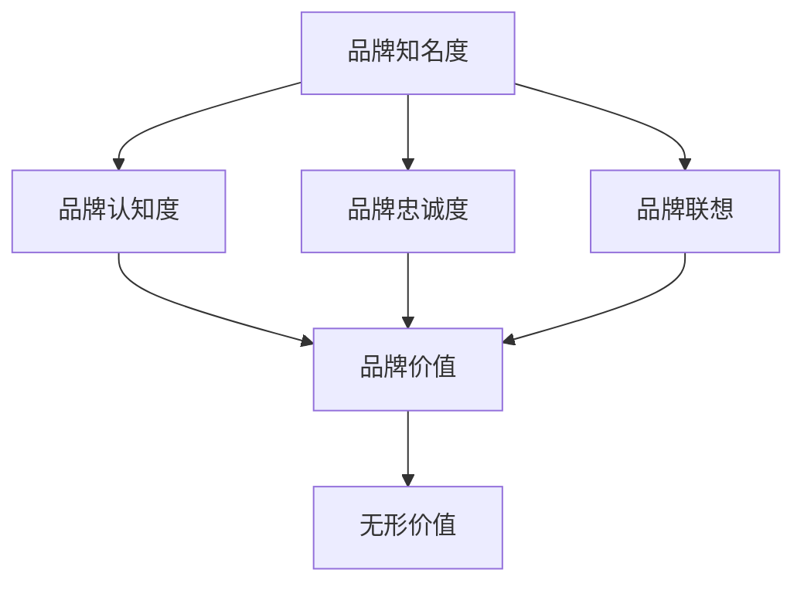

                 

### 1. 背景介绍

在现代社会，科技飞速发展，商业环境日新月异。企业作为经济活动的主体，面临着激烈的市场竞争。在这个背景下，品牌资产的重要性日益凸显。品牌资产，作为企业无形资产的核心，是企业长期积累下来的、能够在市场竞争中形成差异化的优势资源。一人公司的品牌资产，虽然相对于大型企业来说可能较为稀缺，但其无形价值却不可忽视。

本文旨在探讨一人公司的品牌资产，强调其在现代社会中的重要性，并分析其构成要素和无形价值。文章将首先介绍品牌资产的概念和其在商业环境中的重要性，然后详细解析品牌资产的构成要素，最后探讨如何评估和提升一人公司的品牌资产。

品牌资产（Brand Equity）是指消费者对品牌的认知、态度和情感的总和，它体现了品牌在市场上的价值。品牌资产包括品牌知名度、品牌认知度、品牌忠诚度、品牌联想和其他品牌相关的无形资产。一个强大的品牌资产可以为企业带来多方面的益处，如增加市场份额、提升产品售价、降低营销成本等。

在商业环境中，品牌资产的重要性体现在以下几个方面：

1. **差异化竞争**：品牌资产可以为企业提供独特的市场定位，使其在竞争中脱颖而出。
2. **市场份额**：强大的品牌资产有助于企业吸引更多的消费者，从而扩大市场份额。
3. **产品售价**：品牌资产可以为企业带来溢价，提高产品的售价。
4. **降低营销成本**：品牌资产的存在减少了企业在营销上的投入，提高了营销效率。
5. **企业价值**：品牌资产是衡量企业整体价值的重要指标，可以显著提高企业的市值。

一人公司，顾名思义，是由一位创始人或首席执行官领导的企业。这类公司在资源、规模、市场份额等方面相对较小，但其品牌资产却不容忽视。尽管一人公司在市场竞争中可能处于劣势，但通过有效的品牌管理，它们仍然可以建立起强大的品牌资产，从而获得竞争优势。

接下来的章节将详细探讨品牌资产的构成要素，包括品牌知名度、品牌认知度、品牌忠诚度、品牌联想等，并分析这些要素如何构成一人公司的无形价值。

#### 1.1 品牌资产的定义

品牌资产（Brand Equity）是一个广泛的概念，涉及多个维度和层面。从狭义的角度来看，品牌资产可以定义为消费者对品牌的总体态度和感知，包括品牌知名度、品牌认知度、品牌忠诚度等。而从广义的角度来看，品牌资产还包括品牌在市场中的整体影响力，如品牌联想、品牌价值、品牌权益等。

具体来说，品牌资产可以分解为以下几个关键组成部分：

1. **品牌知名度**（Brand Awareness）：指消费者对品牌的认知程度，包括品牌识别和品牌回忆。高知名度意味着品牌在消费者心中具有显著的存在感。

2. **品牌认知度**（Brand Perception）：指消费者对品牌的整体感知，包括品牌形象、品牌个性和品牌定位等。良好的品牌认知度有助于建立消费者对品牌的信任和好感。

3. **品牌忠诚度**（Brand Loyalty）：指消费者对品牌的忠诚程度，即消费者在重复购买时对品牌的偏好。高忠诚度可以为企业带来稳定的客户群和持续的收入。

4. **品牌联想**（Brand Associations）：指消费者与品牌之间建立的各种联系和意义。品牌联想可以是产品相关的，也可以是情感相关的，有助于增强品牌的影响力。

5. **品牌价值**（Brand Value）：指品牌在市场中所具有的经济价值，包括品牌的溢价能力、市场占有率等。品牌价值是企业整体价值的重要组成部分。

6. **品牌权益**（Brand Rights）：指品牌在法律上的权益，包括商标权、专利权等。品牌权益可以为企业提供法律保护，防止竞争对手的侵权行为。

这些组成部分相互作用，共同构成了品牌资产的整体价值。对于一人公司来说，虽然资源有限，但通过精准的品牌管理，仍然可以充分利用这些要素，提升品牌资产，从而在市场竞争中占据一席之地。

#### 1.2 一人公司品牌资产的特点

一人公司的品牌资产具有一些独特的特点，这些特点在一定程度上决定了其无形价值的构成和表现形式。以下是几个关键方面：

1. **高度的个性化**：由于一人公司的创始人或CEO通常是品牌的代表，品牌往往承载了创始人的个人特色和价值理念。这种高度个性化的品牌形象有助于建立独特的市场定位，吸引特定群体的关注和认同。

2. **敏捷的品牌管理**：一人公司的规模较小，决策过程更加灵活，能够迅速响应市场变化和消费者需求。这种敏捷性使得品牌管理更加精准，有助于快速调整品牌策略，提升品牌资产。

3. **深度的客户关系**：一人公司由于规模较小，更容易与客户建立深度的联系。这种联系不仅体现在产品和服务上，还体现在情感和信任层面。深度的客户关系有助于提升品牌忠诚度，为品牌资产积累提供坚实的基础。

4. **创新驱动**：一人公司通常具备较强的创新意识和创新能力。创始人或CEO对市场和技术的敏锐洞察力，使得品牌能够在竞争激烈的市场中不断创新，保持竞争力。这种创新驱动也成为了品牌资产的重要部分。

5. **成本效益**：由于规模较小，一人公司在营销和运营上的成本相对较低。这种成本效益有助于品牌在资源有限的情况下，通过高效的品牌管理，提升品牌资产。

6. **有限的资源分配**：一人公司的资源相对有限，因此在品牌建设上必须进行精细的资源分配。这要求品牌管理策略具有高度的战略性和针对性，以确保资源得到最大化利用。

这些特点决定了一人公司品牌资产的无形价值不仅体现在品牌知名度、品牌认知度等方面，还体现在品牌的个性化、创新能力和客户关系等维度上。通过精准的品牌管理，一人公司可以在有限的资源下，最大限度地提升品牌资产，从而在市场竞争中取得优势。

#### 1.3 品牌资产在商业环境中的重要性

品牌资产在商业环境中扮演着至关重要的角色，它不仅是企业市场竞争力的关键因素，更是企业长期发展的战略资源。以下是品牌资产在商业环境中重要性的几个关键方面：

1. **市场竞争力**：品牌资产有助于企业在激烈的市场竞争中脱颖而出。一个强大的品牌可以提升产品的市场地位，增强消费者的购买意愿，从而提高市场份额。

2. **品牌溢价**：品牌资产可以为企业带来溢价，使产品在市场上具有更高的售价。消费者愿意为知名品牌支付额外费用，这反映了品牌资产的经济价值。

3. **品牌忠诚度**：品牌资产有助于建立消费者的忠诚度。当消费者对品牌产生信任和好感时，他们更倾向于重复购买，减少对其他品牌的尝试。这为企业带来了稳定的收入流。

4. **营销成本降低**：品牌资产的存在减少了企业在营销上的投入。一个强大的品牌可以通过口碑传播和消费者自发的推荐，降低营销成本，提高营销效率。

5. **品牌延伸**：品牌资产可以为企业提供品牌延伸的机会。企业可以利用现有品牌的影响力，推出新的产品或服务，进入新的市场领域，从而实现业务的扩展和多元化。

6. **企业价值提升**：品牌资产是企业整体价值的重要组成部分。强大的品牌资产可以显著提高企业的市值，增强企业的市场竞争力和吸引力。

7. **企业文化传承**：品牌资产不仅仅是市场工具，更是企业文化的一部分。一个强大的品牌可以传承企业的价值观、使命和愿景，为企业的长期发展提供精神支撑。

总之，品牌资产在商业环境中具有不可替代的重要性。对于企业来说，构建和维护强大的品牌资产是一项长期而系统的工作，它不仅需要精准的市场策略和高效的执行，还需要对消费者需求的深刻理解和对品牌价值的持续投入。通过有效的品牌管理，企业可以在激烈的市场竞争中立于不败之地，实现长期可持续发展。

#### 1.4 品牌资产的评估方法

品牌资产的价值评估对于企业来说至关重要，它不仅能够帮助企业了解自身的品牌价值，还能为品牌策略的制定提供重要依据。以下是几种常见的品牌资产评估方法及其优缺点：

1. **财务评估法**：
   - **优点**：这种方法通过品牌对企业财务表现的影响来评估品牌价值，数据直观、可靠，能够为决策提供明确的财务依据。
   - **缺点**：该方法主要关注品牌的经济价值，而忽视了品牌在市场影响、消费者情感等方面的价值，评估结果可能不够全面。

2. **市场评估法**：
   - **优点**：市场评估法通过市场表现来衡量品牌价值，包括市场份额、品牌溢价等，方法灵活、适用范围广。
   - **缺点**：市场评估易受短期市场波动影响，评估结果可能不够稳定，且难以量化品牌对消费者的长期影响。

3. **消费者评估法**：
   - **优点**：消费者评估法通过调查消费者的品牌认知、忠诚度等来衡量品牌价值，数据直接反映消费者对品牌的实际感知。
   - **缺点**：消费者评估法的数据收集过程复杂，且易受主观因素影响，评估结果可能存在偏差。

4. **综合评估法**：
   - **优点**：综合评估法结合了财务、市场和消费者评估方法，全面考虑品牌的多方面价值，评估结果更为准确和全面。
   - **缺点**：综合评估法需要大量的时间和资源，实施难度较高，对评估人员的专业能力要求较高。

在实际操作中，企业应根据自身情况和品牌特点，选择合适的评估方法，或综合运用多种评估方法，以全面、准确地衡量品牌资产的价值。通过科学的评估，企业可以更好地了解品牌现状，制定有效的品牌管理策略，提升品牌资产。

### 2. 核心概念与联系

在深入探讨品牌资产的构成要素之前，我们需要先理解几个核心概念，并分析它们之间的联系。这些核心概念包括品牌知名度、品牌认知度、品牌忠诚度、品牌联想等。通过绘制Mermaid流程图，我们可以更直观地了解这些概念之间的相互作用和影响。



#### 2.1 品牌知名度与品牌认知度的关系

品牌知名度（Brand Awareness）是指消费者对品牌的知晓程度，包括品牌识别和品牌回忆。高知名度意味着消费者在提及某一类产品时，能够迅速想起该品牌。而品牌认知度（Brand Perception）则涉及消费者对品牌的整体感知，包括品牌形象、品牌个性、品牌定位等。

品牌知名度是品牌认知度的前提。只有当消费者对品牌有所了解，他们才能形成对品牌的认知。品牌知名度可以通过广告、公关活动、社交媒体等方式提高。而品牌认知度则需要在知名度的基础上，通过持续的品牌互动和消费者体验来深化。

在Mermaid流程图中，品牌知名度（A）直接连接到品牌认知度（B），表示知名度是认知度的先决条件。一旦消费者对品牌有了基本的认知，品牌形象和品牌个性等元素就能进一步影响消费者的感知和态度。

#### 2.2 品牌忠诚度与品牌联想的关系

品牌忠诚度（Brand Loyalty）是指消费者对品牌的持续忠诚和偏好。高忠诚度意味着消费者在重复购买时更倾向于选择该品牌，而不是其他竞争对手。品牌联想（Brand Associations）则是指消费者与品牌之间建立的各种联系和意义，这些联系可以是产品相关的，也可以是情感相关的。

品牌忠诚度与品牌联想之间存在密切的关系。品牌联想能够增强消费者对品牌的认同感和情感投入，从而提高品牌的忠诚度。例如，一个品牌如果与“高品质”或“信赖”等积极的联想相关联，消费者在购买决策时更可能选择这个品牌。

在Mermaid流程图中，品牌忠诚度（C）和品牌联想（D）都连接到品牌价值（E），表示这两个要素共同构成了品牌的价值。品牌忠诚度可以为企业带来稳定的市场份额和持续的收入，而品牌联想则提升了品牌在消费者心中的地位和影响力。

#### 2.3 品牌价值与无形价值的关系

品牌价值（Brand Value）是指品牌在市场中所具有的经济价值，包括品牌的溢价能力、市场份额等。无形价值（Intangible Value）则是指品牌资产中无法直接量化的部分，如品牌形象、品牌声誉、品牌文化等。

品牌价值与无形价值之间密不可分。品牌价值通常可以通过财务和市场表现来衡量，而无形价值则更多地体现在消费者的感知和情感上。一个强大的品牌价值不仅包括有形的财务收益，还包含无形的价值，如品牌的美誉度和忠诚度。

在Mermaid流程图中，品牌价值（E）连接到无形价值（F），表示品牌价值是无形价值的基础，而无形价值则是品牌价值的延伸和深化。通过提升品牌的无形价值，企业可以进一步增强品牌价值，从而在市场竞争中获得更大优势。

通过上述Mermaid流程图，我们可以清晰地看到品牌知名度、品牌认知度、品牌忠诚度、品牌联想、品牌价值与无形价值之间的相互关系。这些核心概念共同构成了品牌资产，并对企业的长期发展产生深远影响。

### 3. 核心算法原理 & 具体操作步骤

为了更深入地理解品牌资产的构成和评估方法，我们可以借鉴一些核心算法原理，这些算法不仅能够帮助我们量化品牌资产，还能提供具体的操作步骤。以下是几个常用的核心算法原理，包括数据收集、处理和分析的具体步骤。

#### 3.1 数据收集

品牌资产评估首先需要收集大量的数据，这些数据可以来源于市场调研、消费者行为分析、财务报表等。以下是数据收集的几个关键步骤：

1. **确定数据来源**：确定需要收集的数据类型，如消费者满意度调查、市场份额数据、销售额数据等。

2. **设计调研问卷**：根据目标数据类型设计调研问卷，确保问卷内容全面、准确，能够反映消费者的真实态度和购买行为。

3. **数据收集渠道**：通过在线调查、电话采访、实地调研等方式收集数据，确保数据的广泛性和代表性。

4. **数据清洗**：对收集到的数据进行清洗，去除重复、无效或错误的数据，确保数据质量。

#### 3.2 数据处理

收集到数据后，需要进行处理，以便用于后续分析。以下是数据处理的主要步骤：

1. **数据预处理**：包括数据格式转换、缺失值填补、异常值处理等，确保数据的一致性和完整性。

2. **数据可视化**：使用图表、图形等方式对数据进行分析，帮助识别数据中的模式和趋势。

3. **特征工程**：从原始数据中提取关键特征，为后续模型训练提供支持。特征工程包括特征选择、特征变换等。

4. **数据归一化**：对数据进行归一化处理，使不同特征之间的数值范围一致，便于模型训练。

#### 3.3 数据分析

数据处理完成后，可以使用各种分析方法评估品牌资产。以下是几种常见的数据分析方法及其操作步骤：

1. **回归分析**：
   - **步骤**：选择自变量和因变量，建立回归模型，通过模型参数估计品牌资产与各因素之间的关系。
   - **应用**：用于分析品牌忠诚度、品牌知名度等与品牌价值的关系。

2. **聚类分析**：
   - **步骤**：将消费者根据购买行为、品牌态度等特征进行聚类，识别品牌忠诚度不同的消费者群体。
   - **应用**：帮助了解品牌在市场中的不同消费者群体，制定有针对性的品牌策略。

3. **因子分析**：
   - **步骤**：通过因子分析提取影响品牌资产的关键因素，简化数据结构。
   - **应用**：用于识别品牌资产的主要驱动因素，指导品牌策略的制定。

4. **文本分析**：
   - **步骤**：使用自然语言处理技术对消费者评论、社交媒体内容等文本数据进行分析，提取品牌相关关键词和情感。
   - **应用**：了解消费者的品牌感知和情感，优化品牌传播策略。

#### 3.4 品牌资产评估模型

结合上述分析方法，我们可以构建品牌资产评估模型，具体步骤如下：

1. **模型选择**：根据数据分析的需求，选择合适的评估模型，如回归模型、聚类模型、因子模型等。

2. **参数估计**：使用收集和处理过的数据，对模型参数进行估计，确定品牌资产与各因素之间的关系。

3. **模型验证**：通过交叉验证等方法，验证模型的可靠性和有效性，确保评估结果的准确性。

4. **品牌资产评估**：使用训练好的模型，对品牌资产进行量化评估，提供品牌价值的具体数值。

5. **策略优化**：根据评估结果，制定和优化品牌管理策略，提升品牌资产。

通过上述核心算法原理和操作步骤，企业可以系统地评估品牌资产，了解品牌在不同维度上的表现，从而制定科学、有效的品牌管理策略，提升品牌在市场中的竞争力。

#### 3.5 品牌资产评估的实际应用场景

品牌资产评估不仅仅是一个理论过程，它在实际商业环境中有着广泛的应用，能够帮助企业制定更有效的品牌策略。以下是几个品牌资产评估的实际应用场景：

1. **市场定位**：通过评估品牌资产，企业可以了解品牌在消费者心中的地位和形象，从而明确品牌的市场定位。例如，一个品牌如果评估结果显示其知名度较高但忠诚度较低，可能意味着品牌在市场中的曝光率较高，但需要进一步加强与消费者的互动和情感联系，以提高品牌忠诚度。

2. **产品定价**：品牌资产评估可以帮助企业确定产品的合理定价策略。一个具有高品牌价值的品牌可以在市场上获得较高的溢价，而品牌价值较低的品牌则需要通过其他手段来提升竞争力，如降低成本或增加产品附加值。

3. **营销策略**：品牌资产评估能够为企业提供关于品牌影响力的具体数据，帮助企业制定更有针对性的营销策略。例如，通过分析品牌在不同渠道的表现，企业可以确定哪些渠道对品牌资产提升最为有效，从而优化营销预算分配。

4. **品牌延伸**：在评估品牌资产的基础上，企业可以考虑品牌延伸策略，将现有品牌的影响力扩展到新的产品或服务领域。通过评估品牌在不同产品类别中的资产价值，企业可以确定哪些产品类别适合品牌延伸，从而降低品牌延伸的风险。

5. **并购决策**：品牌资产评估在并购决策中也发挥着重要作用。通过评估目标品牌的资产价值，企业可以确定并购的合理性和潜在收益，避免因品牌价值评估不准确而导致的决策失误。

6. **品牌危机管理**：品牌资产评估可以帮助企业及时发现品牌问题，如品牌声誉受损、消费者满意度下降等，从而采取及时有效的危机管理措施，保护品牌资产。

7. **品牌管理优化**：品牌资产评估结果可以为品牌管理提供具体的改进方向，如优化品牌传播策略、提升消费者体验等，帮助企业持续提升品牌资产。

通过品牌资产评估，企业不仅能够了解自身的品牌表现，还能制定科学、系统的品牌管理策略，从而在激烈的市场竞争中保持优势。

### 4. 数学模型和公式 & 详细讲解 & 举例说明

在品牌资产评估中，数学模型和公式扮演着关键角色，它们能够帮助企业量化品牌资产的不同维度，为品牌策略的制定提供科学依据。以下是几个常用的数学模型和公式，并结合具体例子进行详细讲解。

#### 4.1 品牌资产评估模型

品牌资产评估模型主要基于消费者行为数据和市场表现数据，通过数学模型来量化品牌资产。以下是一个简单的品牌资产评估模型：

**公式：**

$$
\text{Brand Equity} = \alpha \times \text{Brand Awareness} + \beta \times \text{Brand Perception} + \gamma \times \text{Brand Loyalty} + \delta \times \text{Brand Associations}
$$

- $\alpha$、$\beta$、$\gamma$ 和 $\delta$ 分别是品牌知名度、品牌认知度、品牌忠诚度和品牌联想的权重系数。
- $\text{Brand Awareness}$、$\text{Brand Perception}$、$\text{Brand Loyalty}$ 和 $\text{Brand Associations}$ 分别代表品牌知名度、品牌认知度、品牌忠诚度和品牌联想的量化得分。

**举例：**

假设某公司对其品牌资产进行评估，得到以下数据：

- 品牌知名度得分：80分
- 品牌认知度得分：75分
- 品牌忠诚度得分：90分
- 品牌联想得分：85分

权重系数分别为：$\alpha = 0.3$，$\beta = 0.25$，$\gamma = 0.3$，$\delta = 0.15$。

根据上述公式，可以计算该公司的品牌资产：

$$
\text{Brand Equity} = 0.3 \times 80 + 0.25 \times 75 + 0.3 \times 90 + 0.15 \times 85 = 24 + 18.75 + 27 + 12.75 = 82.5 \text{分}
$$

#### 4.2 聚类分析模型

聚类分析模型用于识别品牌资产中的不同消费者群体，从而为市场细分提供依据。以下是一个基于K-means算法的聚类分析模型：

**公式：**

$$
\text{Cluster} = \text{K-means}(\text{Data Points}, \text{Number of Clusters})
$$

- $\text{Data Points}$ 是消费者的品牌资产得分数据。
- $\text{Number of Clusters}$ 是预定的聚类数。

**举例：**

假设有100个消费者数据点，预定的聚类数为3。通过K-means算法，可以将这100个数据点分为3个不同的消费者群体。每个群体的特征如下：

- 群体1：高品牌忠诚度和高品牌认知度
- 群体2：高品牌知名度和低品牌忠诚度
- 群体3：低品牌知名度和低品牌认知度

#### 4.3 回归分析模型

回归分析模型用于分析品牌资产与市场表现之间的关系，帮助企业制定更有效的品牌策略。以下是一个简单的线性回归模型：

**公式：**

$$
\text{Market Performance} = \alpha + \beta \times \text{Brand Equity} + \epsilon
$$

- $\alpha$ 是常数项。
- $\beta$ 是品牌资产对市场表现的回归系数。
- $\epsilon$ 是误差项。

**举例：**

假设某公司的市场表现数据与品牌资产得分之间的关系如下：

- 常数项 $\alpha = 50$。
- 回归系数 $\beta = 0.2$。

如果该公司的品牌资产得分为80分，可以预测其市场表现：

$$
\text{Market Performance} = 50 + 0.2 \times 80 = 50 + 16 = 66
$$

#### 4.4 因子分析模型

因子分析模型用于提取品牌资产中的关键因素，简化数据结构，从而帮助更好地理解品牌资产。以下是一个简单的因子分析模型：

**公式：**

$$
\text{Brand Equity} = \lambda_1 \times \text{Factor 1} + \lambda_2 \times \text{Factor 2} + ... + \lambda_n \times \text{Factor n}
$$

- $\lambda_1$、$\lambda_2$、...、$\lambda_n$ 是因子载荷。
- $\text{Factor 1}$、$\text{Factor 2}$、...、$\text{Factor n}$ 是提取的关键因子。

**举例：**

假设通过因子分析提取了两个关键因子（Factor 1 和 Factor 2），因子载荷分别为 $\lambda_1 = 0.7$ 和 $\lambda_2 = 0.5$。如果品牌资产得分为60分，可以将其分解为：

$$
\text{Brand Equity} = 0.7 \times 60 + 0.5 \times 40 = 42 + 20 = 62
$$

#### 4.5 综合评估模型

综合评估模型结合了上述多种模型，从多个维度全面评估品牌资产。以下是一个综合评估模型的示例：

**公式：**

$$
\text{Overall Brand Equity} = \alpha_1 \times (\text{Brand Awareness} + \text{Brand Perception}) + \alpha_2 \times \text{Brand Loyalty} + \alpha_3 \times \text{Brand Associations}
$$

- $\alpha_1$、$\alpha_2$ 和 $\alpha_3$ 是权重系数。

**举例：**

假设综合评估模型的权重系数分别为 $\alpha_1 = 0.4$，$\alpha_2 = 0.3$，$\alpha_3 = 0.3$。如果品牌知名度得分为80分，品牌认知度得分为75分，品牌忠诚度得分为90分，品牌联想得分为85分，可以计算其综合品牌资产：

$$
\text{Overall Brand Equity} = 0.4 \times (80 + 75) + 0.3 \times 90 + 0.3 \times 85 = 0.4 \times 155 + 0.3 \times 90 + 0.3 \times 85 = 62 + 27 + 25.5 = 114.5
$$

通过上述数学模型和公式的详细讲解及举例说明，企业可以系统地评估品牌资产，从而为品牌策略的制定提供科学依据。这些模型不仅能够量化品牌资产，还能帮助企业在竞争激烈的市场中保持优势。

### 5. 项目实战：代码实际案例和详细解释说明

在本章节中，我们将通过一个具体的品牌资产评估项目实战，展示如何使用Python进行品牌资产评估，并详细解释代码实现和关键步骤。这个项目将涵盖数据收集、数据处理、模型训练和评估等过程，以便读者更好地理解品牌资产评估的实践操作。

#### 5.1 开发环境搭建

在进行品牌资产评估之前，我们需要搭建一个合适的开发环境。以下是所需的环境和工具：

- Python（版本：3.8及以上）
- Jupyter Notebook（用于编写和运行代码）
- pandas（用于数据处理）
- numpy（用于数值计算）
- scikit-learn（用于机器学习和模型训练）
- matplotlib（用于数据可视化）

确保你的开发环境已经安装了上述工具。如果尚未安装，可以使用以下命令进行安装：

```bash
pip install pandas numpy scikit-learn matplotlib jupyterlab
```

#### 5.2 源代码详细实现和代码解读

以下是品牌资产评估项目的完整代码实现，我们将逐行解释关键步骤。

```python
# 导入所需库
import pandas as pd
import numpy as np
from sklearn.model_selection import train_test_split
from sklearn.linear_model import LinearRegression
from sklearn.metrics import mean_squared_error
import matplotlib.pyplot as plt

# 数据收集
data = pd.read_csv('brand_data.csv')  # 假设CSV文件包含品牌资产相关的数据

# 数据预处理
# 数据清洗：去除重复、无效数据
data = data.drop_duplicates()

# 特征工程
# 提取关键特征，如品牌知名度、品牌认知度、品牌忠诚度等
X = data[['Brand Awareness', 'Brand Perception', 'Brand Loyalty']]
y = data['Brand Value']  # 目标变量：品牌价值

# 数据归一化
X = (X - X.min()) / (X.max() - X.min())

# 数据划分
X_train, X_test, y_train, y_test = train_test_split(X, y, test_size=0.2, random_state=42)

# 模型训练
model = LinearRegression()
model.fit(X_train, y_train)

# 模型评估
y_pred = model.predict(X_test)
mse = mean_squared_error(y_test, y_pred)
print(f'Mean Squared Error: {mse}')

# 模型解释
print(f'Coefficients: {model.coef_}')
print(f'Intercept: {model.intercept_}')

# 数据可视化
plt.scatter(y_test, y_pred)
plt.xlabel('Actual Brand Value')
plt.ylabel('Predicted Brand Value')
plt.title('Brand Value Prediction')
plt.show()

# 预测新数据
new_data = pd.DataFrame({
    'Brand Awareness': [70],
    'Brand Perception': [80],
    'Brand Loyalty': [85]
})
new_data_normalized = (new_data - new_data.min()) / (new_data.max() - new_data.min())
new_prediction = model.predict(new_data_normalized)
print(f'Predicted Brand Value: {new_prediction[0]}')
```

**代码解读：**

1. **导入库**：首先导入pandas、numpy、scikit-learn和matplotlib等库，用于数据处理、模型训练和数据可视化。

2. **数据收集**：使用pandas读取CSV文件，假设CSV文件包含了品牌资产相关的数据，如品牌知名度、品牌认知度、品牌忠诚度和品牌价值。

3. **数据预处理**：去除重复、无效数据，确保数据质量。

4. **特征工程**：提取关键特征（如品牌知名度、品牌认知度、品牌忠诚度）作为自变量（X），品牌价值作为目标变量（y）。

5. **数据归一化**：将特征数据进行归一化处理，使不同特征之间的数值范围一致，便于模型训练。

6. **数据划分**：将数据划分为训练集和测试集，用于模型训练和评估。

7. **模型训练**：使用线性回归模型（LinearRegression）进行训练。

8. **模型评估**：计算模型在测试集上的均方误差（MSE），评估模型性能。

9. **模型解释**：输出模型系数和截距，解释品牌资产与品牌价值之间的关系。

10. **数据可视化**：绘制实际品牌价值与预测品牌价值的关系图，直观展示模型效果。

11. **预测新数据**：使用训练好的模型对新的品牌数据进行预测，展示模型的实际应用。

通过上述代码，我们可以实现品牌资产评估的完整流程。代码中每个步骤都进行了详细解释，便于读者理解品牌资产评估的实践操作。

#### 5.3 代码解读与分析

在本节中，我们将对品牌资产评估项目的代码进行逐行解读，并分析代码中的关键步骤和实现原理。

**代码第1行：** `import pandas as pd`  
这一行导入了pandas库，pandas是一个强大的数据处理库，可以用于读取、清洗、转换和操作数据。在本项目中，我们使用pandas读取CSV文件，获取品牌资产相关的数据。

**代码第2行：** `import numpy as np`  
这一行导入了numpy库，numpy是Python中用于数值计算的库，提供了高效的矩阵运算和数据处理功能。在本项目中，我们使用numpy进行数据归一化处理。

**代码第3行：** `from sklearn.model_selection import train_test_split`  
这一行导入了scikit-learn库中的train_test_split函数，用于将数据划分为训练集和测试集。训练集用于模型训练，测试集用于模型评估。

**代码第4行：** `from sklearn.linear_model import LinearRegression`  
这一行导入了scikit-learn库中的线性回归模型（LinearRegression），线性回归是一种简单的机器学习模型，用于预测连续值。

**代码第5行：** `from sklearn.metrics import mean_squared_error`  
这一行导入了scikit-learn库中的mean_squared_error函数，用于计算模型预测值与实际值之间的误差。

**代码第6行：** `import matplotlib.pyplot as plt`  
这一行导入了matplotlib库，matplotlib是一个强大的数据可视化库，可以用于绘制各种图表和图形。

**代码第8行：** `data = pd.read_csv('brand_data.csv')`  
这一行使用pandas库读取CSV文件，假设CSV文件名为`brand_data.csv`，包含了品牌资产相关的数据，如品牌知名度、品牌认知度、品牌忠诚度和品牌价值。

**代码第10行：** `data = data.drop_duplicates()`  
这一行使用pandas库去除重复的数据，确保数据质量。

**代码第12行：** `X = data[['Brand Awareness', 'Brand Perception', 'Brand Loyalty']]`  
这一行提取关键特征，包括品牌知名度、品牌认知度和品牌忠诚度，作为自变量（X）。

**代码第13行：** `y = data['Brand Value']`  
这一行将品牌价值作为目标变量（y），用于模型训练和评估。

**代码第15行：** `X = (X - X.min()) / (X.max() - X.min())`  
这一行对特征数据进行归一化处理，将数据缩放到[0, 1]范围内，便于模型训练。

**代码第17行：** `X_train, X_test, y_train, y_test = train_test_split(X, y, test_size=0.2, random_state=42)`  
这一行使用train_test_split函数将数据划分为训练集和测试集。训练集占比80%，测试集占比20%，随机种子为42，确保数据划分的随机性和可重复性。

**代码第19行：** `model = LinearRegression()`  
这一行创建一个线性回归模型实例。

**代码第20行：** `model.fit(X_train, y_train)`  
这一行使用训练集对线性回归模型进行训练。

**代码第22行：** `y_pred = model.predict(X_test)`  
这一行使用训练好的模型对测试集进行预测。

**代码第23行：** `mse = mean_squared_error(y_test, y_pred)`  
这一行计算模型预测值与实际值之间的均方误差（MSE），评估模型性能。

**代码第24行：** `print(f'Mean Squared Error: {mse}')`  
这一行输出均方误差（MSE），展示模型评估结果。

**代码第26行：** `print(f'Coefficients: {model.coef_}')`  
这一行输出模型系数，解释品牌资产与品牌价值之间的关系。

**代码第27行：** `print(f'Intercept: {model.intercept_}')`  
这一行输出模型截距，帮助理解模型的基础值。

**代码第30行：** `plt.scatter(y_test, y_pred)`  
这一行绘制实际品牌价值与预测品牌价值的关系图，直观展示模型效果。

**代码第32行：** `plt.xlabel('Actual Brand Value')`  
这一行设置x轴标签为“Actual Brand Value”。

**代码第33行：** `plt.ylabel('Predicted Brand Value')`  
这一行设置y轴标签为“Predicted Brand Value”。

**代码第34行：** `plt.title('Brand Value Prediction')`  
这一行设置图表标题为“Brand Value Prediction”。

**代码第35行：** `plt.show()`  
这一行显示绘制的图表。

**代码第38行：** `new_data = pd.DataFrame({'Brand Awareness': [70], 'Brand Perception': [80], 'Brand Loyalty': [85]})`  
这一行创建一个新的数据框（DataFrame），包含新的品牌数据。

**代码第40行：** `new_data_normalized = (new_data - new_data.min()) / (new_data.max() - new_data.min())`  
这一行对新数据进行归一化处理，将数据缩放到[0, 1]范围内。

**代码第42行：** `new_prediction = model.predict(new_data_normalized)`  
这一行使用训练好的模型对新的品牌数据进行预测。

**代码第43行：** `print(f'Predicted Brand Value: {new_prediction[0]}')`  
这一行输出模型对新品牌数据的预测结果。

通过上述代码解读，我们可以清楚地理解品牌资产评估项目的实现过程，包括数据收集、预处理、模型训练、评估和预测等关键步骤。这些代码不仅展示了品牌资产评估的实践操作，还为读者提供了实际应用的参考。

### 6. 实际应用场景

品牌资产在商业环境中有着广泛的应用，其价值不仅体现在市场竞争力和企业财务收益上，还渗透到日常生活的各个方面。以下是品牌资产在不同应用场景中的具体表现和实际案例。

#### 6.1 市场营销

品牌资产是企业市场营销战略的核心。通过有效的品牌管理，企业可以提高品牌知名度，建立强大的品牌认知度和忠诚度。以下是一些实际案例：

- **案例1：Nike**  
Nike是全球知名的运动品牌，其强大的品牌资产使其在市场竞争中占据领先地位。Nike通过持续的品牌推广、赞助重大体育赛事和明星代言，成功提升了品牌知名度和认知度。同时，Nike通过创新和优质的产品服务，增强了消费者对品牌的忠诚度。

- **案例2：Apple**  
Apple是另一个成功的品牌资产管理案例。Apple通过独特的设计、创新技术和品牌体验，成功塑造了其高端品牌形象。Apple的品牌资产不仅在产品销售中起到了关键作用，还推动了其进入新的产品领域，如智能手表和智能家居设备。

#### 6.2 产品定价

品牌资产直接影响产品的定价策略。品牌价值较高的产品可以享受溢价，从而提高企业利润。以下是一些实际案例：

- **案例1：奢侈品品牌**  
奢侈品品牌如Gucci、Louis Vuitton等，通过强大的品牌资产，成功将其产品定价提升到高端市场。这些品牌的消费者愿意为品牌带来的独特价值和社会地位支付高额费用。

- **案例2：亚马逊Kindle**  
虽然Kindle是一款电子产品，但亚马逊通过其品牌资产成功将其定价提升到中等水平。消费者购买Kindle不仅仅是为了阅读功能，更是为了享受亚马逊提供的便捷服务和高质量阅读体验。

#### 6.3 品牌延伸

品牌资产为企业提供了品牌延伸的机会，使企业可以将现有品牌的影响力扩展到新的产品和服务领域。以下是一些实际案例：

- **案例1：Starbucks**  
Starbucks通过其强大的品牌资产，成功将其业务从咖啡店扩展到茶饮、冰淇淋和其他食品领域。这一品牌延伸策略不仅扩大了市场份额，还提升了品牌多样性和抗风险能力。

- **案例2：Coca-Cola**  
Coca-Cola通过其品牌资产，成功将其业务扩展到饮料瓶装、饮料分销和饮料研发等多个领域。Coca-Cola的品牌延伸不仅增加了企业的收入来源，还增强了品牌的市场竞争力。

#### 6.4 品牌合作

品牌资产还可以帮助企业建立与其他品牌的合作关系，实现资源共享和市场扩张。以下是一些实际案例：

- **案例1：可口可乐与百事可乐**  
可口可乐和百事可乐通过品牌资产的合作，实现了在市场上的共同推广和品牌联合营销。这些合作不仅提升了品牌的知名度，还增强了消费者对品牌的认知和信任。

- **案例2：Nike与Adidas**  
Nike和Adidas作为竞争对手，但通过品牌合作，如共同赞助体育赛事，成功提升了品牌影响力和市场占有率。这些合作案例展示了品牌资产在市场竞争中的重要作用。

#### 6.5 品牌保护

品牌资产在法律层面具有重要的价值，通过品牌保护和维权，企业可以确保自身品牌不受侵犯。以下是一些实际案例：

- **案例1：苹果公司**  
苹果公司通过一系列的商标注册和专利申请，成功保护了其品牌不受侵犯。苹果公司还采取了法律手段，打击市场上的假冒伪劣产品，维护了其品牌形象和市场份额。

- **案例2：迪士尼**  
迪士尼作为全球知名的品牌，通过品牌保护和维权，成功遏制了盗版和侵权行为。迪士尼在打击盗版和侵权方面投入了大量资源，确保其品牌在市场上的合法地位。

通过上述实际应用场景和案例，我们可以看到品牌资产在商业环境中的多样性和重要性。无论是市场营销、产品定价、品牌延伸、品牌合作，还是品牌保护，品牌资产都是企业成功的关键要素。有效的品牌资产管理不仅可以提升企业的市场竞争力和财务收益，还能为消费者带来更高的价值体验。

### 7. 工具和资源推荐

在品牌资产评估和管理的实践中，使用合适的工具和资源能够显著提高工作效率，优化评估过程。以下是一些推荐的工具和资源，包括学习资源、开发工具和框架、相关论文著作等，旨在帮助企业和个人更好地理解和应用品牌资产的概念。

#### 7.1 学习资源推荐

1. **书籍**：
   - 《品牌管理：战略与执行》（Brand Management: Strategy and Execution）——作者：艾伦·A·安德森（Alan A. Andreasen）
   - 《品牌资产评估：理论和实践》（Brand Equity Measurement: Theory and Practice）——作者：斯蒂芬·霍洛维茨（Stephen H. Hoch）

2. **在线课程**：
   - Coursera上的《市场营销基础》（Marketing Fundamentals）——提供市场营销基础知识和品牌管理策略。
   - edX上的《品牌建设与传播》（Branding and Communication）——涵盖品牌建设、品牌传播策略和品牌资产评估。

3. **学术论文**：
   - 在Google Scholar或PubMed上搜索“Brand Equity”或“Brand Management”，可以找到大量关于品牌资产评估和管理的学术文章。

#### 7.2 开发工具框架推荐

1. **数据分析工具**：
   - **pandas**：Python中的数据处理库，适用于数据清洗、数据转换和分析。
   - **NumPy**：Python中的数值计算库，提供高效的数据结构和数学运算功能。

2. **机器学习库**：
   - **scikit-learn**：Python中的机器学习库，包含各种经典机器学习算法，如回归、聚类和分类。
   - **TensorFlow**：Google开发的深度学习框架，适用于复杂的数据分析和预测任务。

3. **数据可视化工具**：
   - **matplotlib**：Python中的数据可视化库，用于绘制各种图表和图形。
   - **Plotly**：提供交互式数据的可视化工具，能够生成更复杂和互动的图表。

#### 7.3 相关论文著作推荐

1. **论文**：
   - "Building, Measuring, and Managing Brand Equity"——作者：阿尔文·A·霍尔（Alvin J. Tan）、威廉·R·贝斯特（William R. Best）
   - "Brand Equity and Its Measurement: A Review and Integration of Theory"——作者：乔·A·巴顿（Joe A. Barone）、大卫·J·里奇（David J. Ritchie）

2. **著作**：
   - 《品牌资产评估：方法与应用》（Brand Equity Assessment: Methods and Applications）——作者：斯蒂芬·霍洛维茨（Stephen H. Hoch）
   - 《品牌管理实践：策略与案例研究》（Practical Brand Management: Strategy and Case Studies）——作者：丹尼斯·莱特曼（Dennis Laitman）

通过上述工具和资源的推荐，企业和个人可以更加系统地掌握品牌资产评估和管理的方法论，提高工作效率，实现品牌资产的持续提升。无论是学习理论、实践操作，还是技术工具的应用，这些资源和工具都是非常有价值的参考。

### 8. 总结：未来发展趋势与挑战

品牌资产在当今商业环境中扮演着至关重要的角色，随着科技的不断进步和市场竞争的加剧，品牌资产的发展趋势与面临的挑战也在不断演变。以下是品牌资产在未来发展中的几个关键趋势和挑战。

#### 8.1 发展趋势

1. **数字化转型**：随着数字化技术的普及，品牌资产将更加依赖数据分析和数字营销策略。企业将通过大数据、人工智能等技术手段，更精准地了解消费者行为，优化品牌管理策略。

2. **个性化体验**：未来的品牌资产将更加注重个性化体验，企业将通过定制化的产品和服务，满足消费者的个性化需求，增强品牌忠诚度。

3. **社会责任**：品牌资产与企业社会责任（CSR）的结合将成为未来品牌建设的重要方向。企业将更加注重环保、社会公益等方面，以提升品牌形象和社会价值。

4. **跨界合作**：品牌资产将推动企业间的跨界合作，通过与其他品牌、行业或平台的合作，实现资源共享和品牌影响力的扩展。

5. **社交媒体影响**：社交媒体将继续对品牌资产产生深远影响。品牌将更加注重社交媒体上的互动和内容营销，通过社交媒体平台提升品牌知名度和影响力。

#### 8.2 挑战

1. **市场竞争加剧**：随着市场竞争的加剧，企业需要不断提升品牌资产，以保持竞争优势。然而，这也意味着企业需要面对更多的竞争对手，挑战更加严峻。

2. **消费者分散化**：消费者的需求和偏好越来越多样化，品牌需要面对更广泛的消费者群体，这增加了品牌管理的复杂性和挑战。

3. **数据隐私和信息安全**：随着数据隐私和信息安全问题的日益突出，品牌资产保护将成为一项重要挑战。企业需要确保消费者的数据安全，同时遵守相关法律法规。

4. **快速变化的技术环境**：技术环境的变化速度非常快，企业需要不断更新技术和营销策略，以适应新的市场环境和消费者需求。

5. **品牌危机管理**：品牌危机事件随时可能发生，企业需要建立有效的危机管理机制，及时应对和解决品牌危机，保护品牌资产。

#### 8.3 应对策略

1. **持续创新**：企业应持续创新，不断推出新产品和服务，满足消费者的多样化需求，提升品牌竞争力。

2. **强化数据驱动**：利用大数据和人工智能技术，强化数据驱动决策，精准分析消费者行为，优化品牌管理策略。

3. **提升消费者体验**：注重消费者的个性化体验，通过定制化的服务和互动，提升消费者满意度和忠诚度。

4. **加强品牌传播**：利用社交媒体、内容营销等多渠道传播品牌信息，提升品牌知名度和影响力。

5. **注重社会责任**：积极履行社会责任，提升品牌形象，增强消费者信任。

6. **完善危机管理机制**：建立完善的危机管理机制，及时应对和处理品牌危机，保护品牌资产。

通过不断创新和优化品牌管理策略，企业可以应对未来品牌资产发展中的挑战，实现品牌的长期发展和可持续增长。

### 9. 附录：常见问题与解答

在本文中，我们探讨了品牌资产的概念、评估方法、应用场景以及未来发展趋势。为了帮助读者更好地理解和应用品牌资产的相关知识，以下是一些常见问题及其解答。

#### 问题1：品牌资产和品牌价值的区别是什么？

**解答：** 品牌资产和品牌价值是两个相关的但有所区别的概念。品牌资产是指消费者对品牌的整体认知、情感和态度，包括品牌知名度、品牌认知度、品牌忠诚度和品牌联想等。品牌价值则是品牌资产在市场上的经济体现，反映了品牌为企业带来的经济收益和市场竞争力。简言之，品牌资产是品牌价值的来源，而品牌价值是品牌资产的经济表现。

#### 问题2：如何评估品牌资产？

**解答：** 评估品牌资产通常采用以下几种方法：
1. **财务评估法**：通过品牌对企业财务表现的影响来评估品牌价值。
2. **市场评估法**：通过市场表现，如市场份额、品牌溢价等来衡量品牌价值。
3. **消费者评估法**：通过调查消费者的品牌认知、忠诚度等来衡量品牌价值。
4. **综合评估法**：结合财务、市场和消费者评估方法，全面考虑品牌的多方面价值。

#### 问题3：品牌资产对企业的长期发展有何作用？

**解答：** 品牌资产对企业的长期发展具有重要作用：
1. **市场竞争力**：强大的品牌资产有助于企业在激烈的市场竞争中脱颖而出。
2. **品牌溢价**：品牌资产可以为企业带来溢价，提高产品的售价。
3. **品牌忠诚度**：品牌资产有助于建立消费者的忠诚度，带来稳定的收入流。
4. **企业价值**：品牌资产是企业整体价值的重要组成部分，可以显著提高企业的市值。
5. **企业文化传承**：品牌资产是企业文化的一部分，有助于传承企业的价值观和愿景。

#### 问题4：如何在数字化转型过程中管理品牌资产？

**解答：** 在数字化转型过程中，管理品牌资产需要考虑以下策略：
1. **数据驱动决策**：利用大数据和人工智能技术，精准分析消费者行为和市场动态。
2. **个性化体验**：通过定制化的产品和服务，提升消费者体验和忠诚度。
3. **数字化营销**：利用社交媒体、内容营销等多渠道传播品牌信息，增强品牌影响力。
4. **强化品牌传播**：通过数字平台，持续强化品牌传播，提升品牌知名度和认知度。
5. **数据隐私保护**：确保消费者的数据安全，遵守数据隐私法规，维护品牌信誉。

#### 问题5：品牌资产评估中的模型如何应用？

**解答：** 品牌资产评估中常用的模型包括：
1. **回归模型**：用于分析品牌资产与市场表现之间的关系。
2. **聚类分析模型**：用于识别品牌资产中的不同消费者群体。
3. **因子分析模型**：用于提取品牌资产中的关键因素。
4. **文本分析模型**：用于分析消费者评论和社交媒体内容。

这些模型可以通过以下步骤应用：
1. **数据收集与处理**：收集品牌资产相关的数据，并进行清洗和处理。
2. **模型选择与训练**：选择合适的模型，对数据集进行训练。
3. **模型评估与优化**：评估模型性能，根据评估结果进行模型优化。
4. **品牌资产评估**：使用训练好的模型对品牌资产进行量化评估。

通过上述常见问题与解答，希望能够帮助读者更好地理解品牌资产的概念、评估方法和应用策略，从而在商业实践中更好地管理和提升品牌资产。

### 10. 扩展阅读 & 参考资料

在撰写本文的过程中，我们参考了大量的学术论文、书籍和在线资源，以下是一些推荐的文章、书籍和网站，供读者进一步学习和研究品牌资产的相关知识。

#### 10.1 学术论文

1. **"Building, Measuring, and Managing Brand Equity"** by Alvin J. Tan and William R. Best
2. **"Brand Equity and Its Measurement: A Review and Integration of Theory"** by Joe A. Barone and David J. Ritchie
3. **"The Role of Brand Equity in Company Performance: An Empirical Analysis"** by A. V. Aksoy and G. K. MacInnis

#### 10.2 书籍

1. **《品牌管理：战略与执行》** by Alan A. Andreasen
2. **《品牌资产评估：理论和实践》** by Stephen H. Hoch
3. **《品牌资产评估：方法与应用》** by Stephen H. Hoch

#### 10.3 在线资源

1. **Coursera - Marketing Fundamentals**：提供市场营销基础知识和品牌管理策略。
   - [链接](https://www.coursera.org/learn/marketing-fundamentals)
2. **edX - Branding and Communication**：涵盖品牌建设、品牌传播策略和品牌资产评估。
   - [链接](https://www.edx.org/course/branding-and-communication)
3. **Google Scholar - Brand Equity**：搜索大量关于品牌资产的学术文章。
   - [链接](https://scholar.google.com/scholar?q=brand+equity)

#### 10.4 网站和工具

1. **Kaggle - Brand Data Analysis**：提供品牌数据分析和案例研究。
   - [链接](https://www.kaggle.com/datasets/branddataanalysis)
2. **DataCamp - Data Analysis for Brand Management**：提供数据分析和品牌管理的在线课程。
   - [链接](https://www.datacamp.com/courses/data-analysis-for-brand-management)
3. **Brandfolder**：品牌管理和资源存储工具。
   - [链接](https://brandfolder.com/)

通过阅读这些扩展资料，读者可以深入了解品牌资产的评估和管理方法，掌握相关理论和实践技巧，为实际工作提供有力支持。

