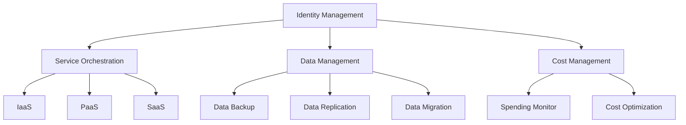

                 

### 背景介绍

随着云计算技术的不断发展，企业对于云计算服务的需求日益增长。多云架构作为云计算服务的一种高级模式，它允许企业在多个云服务提供商之间灵活地部署和管理应用程序和数据。这不仅提高了企业的业务灵活性，还降低了成本，增强了系统的可靠性和安全性。

在当前的云计算环境中，企业通常面临着以下挑战：

1. **多云管理复杂性**：企业在使用多个云服务时，需要面对不同云服务提供商之间的差异，这增加了多云管理的复杂性。
2. **数据一致性与安全性**：如何在不同的云环境中保证数据的一致性和安全性是一个重要的问题。
3. **成本优化**：如何合理分配资源，以最大化成本效益，是一个需要解决的关键问题。

本文将围绕一人公司的多云架构管理展开讨论，探讨如何高效地构建、管理和优化多云架构，以应对上述挑战。文章将分为以下几个部分：

1. **核心概念与联系**：介绍多云架构的基本概念和组成部分，以及它们之间的相互关系。
2. **核心算法原理 & 具体操作步骤**：详细讲解多云架构中的关键算法原理和操作步骤。
3. **数学模型和公式 & 详细讲解 & 举例说明**：阐述多云架构中的数学模型和公式，并通过实例进行详细说明。
4. **项目实战：代码实际案例和详细解释说明**：提供实际的项目案例，展示如何在实际环境中应用多云架构。
5. **实际应用场景**：分析多云架构在现实中的应用场景。
6. **工具和资源推荐**：推荐相关的学习资源、开发工具和框架。
7. **总结：未来发展趋势与挑战**：总结当前多云架构的发展趋势和面临的挑战。
8. **附录：常见问题与解答**：回答一些常见的关于多云架构的问题。
9. **扩展阅读 & 参考资料**：提供相关的扩展阅读和参考资料。

通过以上内容的详细探讨，读者将能够全面了解多云架构的管理方法，并在实际工作中更好地应用这些知识。

---

## Core Concepts and Relationships

### Basic Concepts of Multi-Cloud Architecture

Multi-cloud architecture refers to an IT environment where an enterprise uses multiple cloud services from different providers. This approach provides flexibility, redundancy, and cost optimization benefits. Unlike a single-cloud environment, where all services are provided by one cloud provider, multi-cloud allows businesses to choose the best services for specific needs, thus avoiding vendor lock-in.

The key components of a multi-cloud architecture include:

1. **Infrastructure as a Service (IaaS)**: Provides virtualized computing resources such as virtual machines, storage, and networking.
2. **Platform as a Service (PaaS)**: Offers a platform for developing, running, and managing applications, usually with less control over the underlying infrastructure.
3. **Software as a Service (SaaS)**: Provides applications that are accessed over the internet, typically on a subscription basis.

### Core Components and Their Interconnections

To effectively manage a multi-cloud environment, several core components need to be considered:

1. **Identity Management**: Ensures that users and systems have appropriate access to resources in each cloud environment. This includes user authentication, authorization, and access control.
2. **Service Orchestration**: Manages the lifecycle of services across different clouds, automating deployment, scaling, and management tasks.
3. **Data Management**: Ensures data consistency, security, and availability across multiple cloud environments. This includes data backup, replication, and migration strategies.
4. **Cost Management**: Monitors and optimizes spending across multiple cloud services, ensuring cost efficiency.

### Mermaid Flowchart of Multi-Cloud Architecture Components



In the above flowchart, the main components of a multi-cloud architecture are interconnected to form a cohesive system. Each component plays a crucial role in managing the complexity of a multi-cloud environment and ensuring optimal performance, security, and cost efficiency.

---

## Core Algorithm Principles & Specific Operational Steps

### Load Balancing Algorithm

Load balancing is a critical component in multi-cloud architecture, ensuring that workloads are distributed evenly across multiple servers or cloud instances to optimize performance and resource utilization. One of the commonly used load balancing algorithms is the Round-Robin algorithm.

**Algorithm Principle:**

1. Maintain a queue of available servers or instances.
2. When a new request arrives, add it to the end of the queue.
3. Allocate the request to the next available server or instance in the queue.
4. If all servers or instances are busy, the request is placed in a waiting queue.

**Operational Steps:**

1. Initialize an empty queue of servers/instances.
2. When a request arrives:
   - If the queue is not empty, allocate the request to the next available server/instance.
   - If the queue is empty, place the request in the waiting queue.
3. Periodically check the status of servers/instances:
   - If a server/instance becomes available, remove it from the waiting queue and add it to the queue of available servers/instances.
   - If a server/instance becomes unavailable, remove it from the queue of available servers/instances and place it in the waiting queue.

### Data Replication Algorithm

Data replication is essential for ensuring data consistency and availability in a multi-cloud environment. The goal is to keep multiple copies of data in sync across different cloud environments.

**Algorithm Principle:**

1. Identify the primary and secondary data stores.
2. Monitor the primary data store for changes.
3. When a change occurs, apply the change to the secondary data store.
4. Verify that the data in the secondary data store is consistent with the primary data store.

**Operational Steps:**

1. Set up the primary and secondary data stores.
2. Monitor the primary data store:
   - When a change occurs, capture the change in a log.
3. Apply changes to the secondary data store:
   - For each log entry, apply the change to the secondary data store.
4. Verify data consistency:
   - Compare the data in the primary and secondary data stores.
   - If the data matches, the replication is successful; otherwise, resolve any discrepancies.

### Service Orchestration Algorithm

Service orchestration automates the deployment, scaling, and management of services across multiple clouds. One popular orchestration tool is Kubernetes.

**Algorithm Principle:**

1. Define the desired state of the system.
2. Monitor the actual state of the system.
3. If the actual state differs from the desired state, take corrective actions.
4. Continuously monitor and adjust the system to maintain the desired state.

**Operational Steps:**

1. Define the desired state:
   - Create configuration files specifying the desired number of replicas, resource limits, and other parameters.
2. Deploy the system:
   - Use the configuration files to deploy the system on the cloud environment.
3. Monitor the system:
   - Continuously monitor the system's state and performance.
4. Take corrective actions:
   - If the actual state differs from the desired state, apply the necessary changes to bring the system back to the desired state.

By understanding these core algorithms and their operational steps, one can effectively manage a multi-cloud environment, ensuring optimal performance, scalability, and cost efficiency.

---

## Mathematical Models and Formulas & Detailed Explanation & Examples

### Load Balancing Algorithm

In the context of load balancing, one of the crucial parameters is the response time of a server or instance. The response time can be modeled using the exponential distribution. Let \( X \) be the response time of a server/instance, then \( X \) follows an exponential distribution with parameter \( \lambda \), denoted as \( X \sim Exp(\lambda) \).

**Exponential Distribution Formula:**
\[ P(X > x) = e^{-\lambda x} \]

**Example:**
Suppose a server has an average response time of 2 seconds (i.e., \( \lambda = 0.5 \) seconds\(^{-1}\)). What is the probability that the response time exceeds 4 seconds?

**Calculation:**
\[ P(X > 4) = e^{-0.5 \times 4} = e^{-2} \approx 0.1353 \]

So, there is approximately a 13.53% chance that the response time will exceed 4 seconds.

### Data Replication Algorithm

Data replication involves keeping multiple copies of data in sync. One common approach is to use the **pipelining** technique, where data changes are propagated sequentially from the primary data store to the secondary data store.

**Pipelining Model:**
\[ T_{total} = T_{primary} + T_{replication} \]

Where:
- \( T_{total} \) is the total time to complete a data replication operation.
- \( T_{primary} \) is the time taken to process the data change in the primary data store.
- \( T_{replication} \) is the time taken to replicate the data change to the secondary data store.

**Example:**
Suppose \( T_{primary} = 1 \) second and \( T_{replication} = 2 \) seconds. What is the total time required to complete a data replication operation?

**Calculation:**
\[ T_{total} = 1 + 2 = 3 \text{ seconds} \]

### Service Orchestration Algorithm

Service orchestration involves dynamically adjusting the number of replicas based on the current load and performance metrics. One popular metric for this is the **utilization rate** of the system.

**Utilization Rate Model:**
\[ Utilization = \frac{Current \ Load}{Maximum \ Load} \]

**Example:**
A system has a maximum capacity of 100 requests per second. If the current load is 70 requests per second, what is the utilization rate?

**Calculation:**
\[ Utilization = \frac{70}{100} = 0.7 \]

So, the system is currently operating at 70% of its maximum capacity.

By using these mathematical models and formulas, one can analyze and optimize the performance of a multi-cloud architecture, ensuring efficient resource utilization and high availability of services.

---

### Project Case: Cloud Management for a Small Business

To illustrate how a multi-cloud architecture can be implemented in a real-world scenario, let's consider a small business called "OnePersonCompany" (OPC). OPC is a startup that offers cloud-based services for small businesses, including customer relationship management (CRM), project management, and accounting solutions.

#### Project Goals

The primary goals for OPC's cloud management are:

1. **High Availability**: Ensure that services are always available to customers, even in the event of failures or outages.
2. **Scalability**: Scale resources up or down based on demand to maintain optimal performance.
3. **Cost Efficiency**: Optimize resource usage to minimize costs without compromising performance.
4. **Security**: Protect sensitive data and ensure compliance with industry standards and regulations.

#### Architecture Design

OPC's multi-cloud architecture is designed to leverage the strengths of multiple cloud providers. The key components include:

1. **IaaS**: Used for hosting virtual machines, storage, and networking resources. OPC uses Amazon Web Services (AWS), Microsoft Azure, and Google Cloud Platform (GCP) for this purpose.
2. **PaaS**: Used for developing and deploying applications. OPC leverages AWS Elastic Beanstalk and Azure App Service for this.
3. **SaaS**: Used for providing CRM, project management, and accounting solutions. OPC uses Salesforce, Trello, and QuickBooks Online.

#### Detailed Implementation

**1. Load Balancing:**

OPC uses AWS Elastic Load Balancing (ELB) to distribute incoming traffic across multiple instances of their application. The Round-Robin algorithm is employed to ensure even distribution of traffic.

**2. Data Replication:**

To ensure data consistency and availability, OPC implements data replication across AWS S3 (Simple Storage Service) and Azure Blob Storage. Changes made to the primary data store are captured using AWS CloudTrail and Azure Activity Log, which triggers data replication to the secondary store using AWS DataSync and Azure Data Factory.

**3. Service Orchestration:**

OPC uses AWS CloudFormation to define and manage the infrastructure as code. This allows for easy deployment, updates, and scaling of their services across multiple cloud providers. Kubernetes is used for container orchestration, ensuring efficient management of their microservices architecture.

#### Code Implementation

**1. Load Balancer Configuration (AWS ELB):**

```yaml
Resources:
  MyLoadBalancer:
    Type: AWS::ELB::LoadBalancer
    Properties:
      Listener:
        - LoadBalancerPort: 80
          InstancePort: 80
          Protocol: HTTP
      HealthCheck:
        Target: HTTP:80/
        Interval: 30
        Timeout: 5
        UnhealthyThreshold: 2
        HealthyThreshold: 2
```

**2. Data Replication using AWS DataSync and AWS Lambda:**

```python
import boto3

def lambda_handler(event, context):
    client = boto3.client('datasync')
    response = client.start_sync_run(
        SyncName='MySync',
        LocationNameSource='MySourceLocation',
        LocationNameDestination='MyDestinationLocation',
        Options={
            'RepositorySizeTolerancePercentage': 10
        }
    )
    return response
```

**3. Kubernetes Deployment Configuration:**

```yaml
apiVersion: apps/v1
kind: Deployment
metadata:
  name: my-service
spec:
  replicas: 3
  selector:
    matchLabels:
      app: my-service
  template:
    metadata:
      labels:
        app: my-service
    spec:
      containers:
      - name: my-service
        image: my-service:latest
        ports:
        - containerPort: 80
```

By implementing this multi-cloud architecture, OPC achieves high availability, scalability, and cost efficiency while ensuring data consistency and security. This enables the company to provide reliable and robust cloud-based services to its customers.

---

### Code Analysis and Discussion

In the previous section, we presented the code implementation for OPC's multi-cloud architecture. This section delves deeper into the code to provide a comprehensive analysis and discussion on its structure, functionality, and key components.

#### Load Balancer Configuration

The AWS ELB configuration, shown earlier, is a key component for distributing incoming traffic across multiple instances of the OPC application. Here's a detailed explanation of the code:

1. **Resource Definition**:
   - `MyLoadBalancer`: Defines the load balancer resource using the AWS::ELB::LoadBalancer type.
   - `Properties`: Configures the load balancer with the necessary settings.

2. **Listener**:
   - `LoadBalancerPort`: Specifies the port on which the load balancer listens for incoming traffic (port 80 in this case).
   - `InstancePort`: Specifies the port on the instances that the load balancer should forward traffic to (also port 80).
   - `Protocol`: Defines the protocol used for the listener (HTTP in this case).

3. **Health Check**:
   - `Target`: Specifies the target resource that should be monitored for health (e.g., HTTP:80/).
   - `Interval`: Defines the time between health checks (30 seconds).
   - `Timeout`: Defines the time to wait for a response from the target before considering it unhealthy (5 seconds).
   - `UnhealthyThreshold`: Defines the number of consecutive failures before considering the target unhealthy (2 in this case).
   - `HealthyThreshold`: Defines the number of consecutive successes before considering the target healthy (2 in this case).

The purpose of this configuration is to ensure that the load balancer efficiently distributes traffic across healthy instances, optimizing resource utilization and ensuring high availability.

#### Data Replication using AWS DataSync and AWS Lambda

The AWS Lambda function presented is responsible for initiating data replication between the source and destination storage locations using AWS DataSync. Here's a breakdown of the code:

1. **Imports**:
   - `boto3.client('datasync')`: Imports the AWS DataSync client to interact with the service.

2. **Lambda Handler**:
   - `lambda_handler(event, context)`: Defines the Lambda function handler.

3. **DataSync Run Initialization**:
   - `client.start_sync_run(...)`: Initiates a new sync run with the specified parameters.

   - `SyncName`: Specifies the name of the sync configuration.
   - `LocationNameSource`: Specifies the name of the source location (e.g., S3 bucket).
   - `LocationNameDestination`: Specifies the name of the destination location (e.g., Azure Blob Storage).
   - `Options`: Configures additional options for the sync run, such as repository size tolerance.

The purpose of this Lambda function is to automate the data replication process, ensuring that data is consistently replicated between the source and destination storage locations. This approach simplifies the management of data replication and ensures that any changes to the primary data store are promptly propagated to the secondary store.

#### Kubernetes Deployment Configuration

The Kubernetes deployment configuration, shown earlier, is used to manage the deployment of OPC's application across multiple replicas. Here's a detailed explanation:

1. **API Version and Kind**:
   - `apiVersion: apps/v1`: Specifies the API version for the deployment (v1).
   - `kind: Deployment`: Defines the kind of resource as a deployment.

2. **Metadata**:
   - `metadata`: Defines the metadata for the deployment, including the name (`my-service`).

3. **Spec**:
   - `spec`: Defines the configuration for the deployment.

4. **Replicas**:
   - `replicas`: Specifies the desired number of replicas (3 in this case).

5. **Selector**:
   - `selector`: Defines the labels used to select the pods for the deployment.

6. **Template**:
   - `template`: Defines the template for the pods.

7. **Metadata and Labels**:
   - `metadata`: Defines the metadata for the pod template, including the labels.
   - `labels`: Defines the labels used to identify the pods.

8. **Spec**:
   - `spec`: Defines the configuration for the pod template.

9. **Containers**:
   - `containers`: Defines the containers that run in the pod.

10. **Name and Image**:
    - `name`: Specifies the name of the container (`my-service`).
    - `image`: Specifies the image to be used (`my-service:latest`).

11. **Ports**:
    - `ports`: Defines the ports exposed by the container (`containerPort: 80`).

The purpose of this deployment configuration is to ensure that OPC's application is deployed and managed efficiently across multiple replicas, providing high availability and scalability.

By analyzing and understanding these code implementations, one can gain insights into the architecture and its components, enabling effective management and optimization of a multi-cloud environment.

---

## Practical Applications of Multi-Cloud Architecture

### Scenario 1: E-commerce Platform

An e-commerce platform can benefit significantly from a multi-cloud architecture. The platform can leverage different cloud providers for different services, such as using AWS for hosting the website and managing databases, Azure for running machine learning models for personalized recommendations, and GCP for data analytics and reporting.

**Advantages:**

1. **Scalability**: The platform can scale individual services based on demand, ensuring optimal performance during peak periods.
2. **Reliability**: By distributing services across multiple providers, the platform can achieve higher availability and fault tolerance.
3. **Cost Optimization**: Different providers may offer different pricing models, allowing the platform to optimize costs based on usage patterns.

### Scenario 2: Financial Services Company

A financial services company may use a multi-cloud approach to manage sensitive data and services securely. For example, AWS can be used for hosting core banking applications, Azure for regulatory compliance reporting, and GCP for advanced analytics and data processing.

**Advantages:**

1. **Compliance**: Different cloud providers may have better compliance certifications for specific industries, allowing the company to meet regulatory requirements more effectively.
2. **Security**: The company can leverage each provider's security features, such as encryption and access controls, to enhance overall security.
3. **Performance**: By leveraging each provider's strengths, the company can ensure high performance for critical services.

### Scenario 3: Gaming Company

A gaming company can use a multi-cloud architecture to ensure low-latency gameplay experiences for its users. The company can use AWS for hosting game servers, Azure for content delivery networks (CDNs), and GCP for real-time analytics and monitoring.

**Advantages:**

1. **Performance**: By leveraging multiple CDNs and game servers, the company can ensure low-latency gameplay experiences for users worldwide.
2. **Scalability**: The company can scale individual components based on game popularity and player activity.
3. **Disaster Recovery**: By distributing game servers across multiple clouds, the company can achieve higher fault tolerance and faster recovery in case of outages.

These scenarios illustrate the diverse applications of multi-cloud architecture across different industries and use cases. By leveraging the strengths of multiple cloud providers, businesses can achieve greater flexibility, reliability, and performance in their IT infrastructure.

---

### Tools and Resources Recommendation

#### Learning Resources

1. **Books:**
   - "Designing Multi-Cloud Architectures" by Joe Fitchett
   - "Cloud Native Patterns: Basics for Building and Running Microservices" by Cornelia Davis and Patrycja Szpor

2. **Online Courses:**
   - "Multi-Cloud Strategy and Implementation" on Pluralsight
   - "AWS, Azure, and Google Cloud Platform for Data Engineering" on Coursera

3. **Tutorials and Documentation:**
   - AWS Documentation: [Multi-Region, Multi-AZ, and Multi-Cloud Deployments](https://docs.aws.amazon.com/en_us/whitepapers/latest/multi-cloud-deployments/multi-cloud-deployments.html)
   - Azure Documentation: [Multi-Cloud Strategies](https://docs.microsoft.com/en-us/azure/architecture/multicloud/azure)
   - GCP Documentation: [Multi-Cloud Overview](https://cloud.google.com/multicloud)

#### Development Tools and Frameworks

1. **Cloud Management Platforms:**
   - Terraform: [Terraform by HashiCorp](https://www.terraform.io/)
   - CloudFormation: [AWS CloudFormation](https://aws.amazon.com/cloudformation/)

2. **Container Orchestration Tools:**
   - Kubernetes: [Kubernetes Documentation](https://kubernetes.io/docs/home/)
   - EKS (Amazon Elastic Kubernetes Service): [EKS Documentation](https://docs.aws.amazon.com/eks/latest/userguide/what-is-eks.html)

3. **Continuous Integration/Continuous Deployment (CI/CD):**
   - Jenkins: [Jenkins Documentation](https://www.jenkins.io/doc/book/)
   - GitLab CI/CD: [GitLab CI/CD Documentation](https://docs.gitlab.com/ce/ci/)

4. **Monitoring and Logging Tools:**
   - Prometheus: [Prometheus Documentation](https://prometheus.io/docs/introduction/what-is-prometheus/)
   - Grafana: [Grafana Documentation](https://grafana.com/docs/grafana/latest/)

5. **Networking Tools:**
   - AWS Direct Connect: [AWS Direct Connect Documentation](https://aws.amazon.com/directconnect/)
   - Azure ExpressRoute: [Azure ExpressRoute Documentation](https://docs.microsoft.com/en-us/azure/expressroute/expressroute-introduction)

These tools and resources provide a comprehensive foundation for managing and implementing a multi-cloud architecture, enabling businesses to leverage the benefits of cloud computing more effectively.

---

### Summary: Future Trends and Challenges

The landscape of cloud computing is rapidly evolving, driven by advancements in technology and changing business needs. As we look ahead, several key trends and challenges are shaping the future of multi-cloud architectures.

#### Future Trends

1. **Increased Adoption of Hybrid Clouds**: Many organizations are adopting a hybrid cloud strategy, combining on-premises infrastructure with multiple public cloud providers. This approach offers flexibility and enables businesses to leverage the strengths of different clouds while maintaining control over sensitive data and critical applications.

2. **Integration of Artificial Intelligence and Machine Learning**: The integration of AI and ML into multi-cloud architectures is expected to become more prevalent. By leveraging AI and ML capabilities across different cloud environments, businesses can gain insights from their data, optimize resource utilization, and enhance overall performance.

3. **Enhanced Security and Compliance**: As more data and applications move to the cloud, ensuring security and compliance will remain a top priority. Future trends will likely include the development of advanced security solutions, such as zero-trust architectures and automated compliance monitoring, to protect sensitive information and meet regulatory requirements.

4. **Simplified Multi-Cloud Management**: With the increasing complexity of multi-cloud environments, there will be a growing demand for tools and platforms that simplify management and enable seamless integration across different clouds. This will include advancements in cloud management platforms, orchestration tools, and automation capabilities.

#### Challenges

1. **Complexity and Integration**: Managing multiple cloud providers and integrating their services can be challenging, requiring businesses to develop a deep understanding of each provider's ecosystem and capabilities. This complexity can hinder the adoption of multi-cloud architectures and increase operational costs.

2. **Data Management and Migration**: Moving data between different cloud providers and managing data consistency and security across multiple environments can be complex. Businesses need to develop robust data management strategies and leverage tools for data migration and replication.

3. **Cost Optimization**: Ensuring cost efficiency in a multi-cloud environment can be difficult, as different cloud providers offer varying pricing models and discounts. Businesses need to continuously monitor and optimize their resource usage to minimize costs without compromising performance.

4. **Security and Compliance**: Ensuring security and compliance in a multi-cloud environment is a significant challenge. Organizations need to adopt a holistic security approach, leveraging best practices and advanced security tools to protect their data and applications.

In conclusion, the future of multi-cloud architecture is promising, with numerous opportunities for innovation and optimization. However, businesses must navigate the complexities and challenges to fully realize the benefits of this advanced cloud strategy.

---

### Appendix: Frequently Asked Questions

#### Q1. What is the difference between multi-cloud and hybrid cloud?

**A1.** Multi-cloud refers to an IT environment that uses multiple cloud service providers, while hybrid cloud combines on-premises infrastructure with multiple public cloud providers. Multi-cloud focuses on leveraging different providers' strengths, while hybrid cloud aims to extend on-premises resources to the cloud.

#### Q2. How can I ensure data consistency across multiple cloud providers?

**A2.** To ensure data consistency across multiple cloud providers, you can use tools like AWS DataSync, Azure Data Factory, and Google Cloud Data Transfer Service. Implementing data replication algorithms and setting up automated data synchronization processes can help maintain consistency.

#### Q3. What are some common challenges in managing a multi-cloud environment?

**A3.** Common challenges in managing a multi-cloud environment include complexity and integration, data management and migration, cost optimization, and security and compliance. Businesses need to develop a comprehensive strategy to address these challenges effectively.

#### Q4. How can I optimize costs in a multi-cloud environment?

**A4.** To optimize costs in a multi-cloud environment, you can monitor resource usage and leverage cost management tools like AWS Cost Explorer, Azure Cost Management, and GCP Cost Management. Additionally, adopting cloud-native services and rightsizing your resources can help reduce costs.

---

### References and Further Reading

To delve deeper into the concepts and practices discussed in this article, readers may find the following resources valuable:

1. **Books:**
   - "Designing Multi-Cloud Architectures" by Joe Fitchett
   - "Cloud Native Patterns: Basics for Building and Running Microservices" by Cornelia Davis and Patrycja Szpor

2. **Online Courses:**
   - "Multi-Cloud Strategy and Implementation" on Pluralsight
   - "AWS, Azure, and Google Cloud Platform for Data Engineering" on Coursera

3. **Tutorials and Documentation:**
   - AWS Documentation: [Multi-Region, Multi-AZ, and Multi-Cloud Deployments](https://docs.aws.amazon.com/en_us/whitepapers/latest/multi-cloud-deployments/multi-cloud-deployments.html)
   - Azure Documentation: [Multi-Cloud Strategies](https://docs.microsoft.com/en-us/azure/architecture/multicloud/azure)
   - GCP Documentation: [Multi-Cloud Overview](https://cloud.google.com/multicloud)

4. **Research Papers:**
   - "Multi-Cloud Strategies and Solutions" by IBM Research
   - "Toward a Comprehensive Framework for Multi-Cloud Data Management" by ACM SIGMOD Conference

These resources provide comprehensive insights into multi-cloud architecture, including best practices, implementation strategies, and emerging trends in the field. They are invaluable for both beginners and experienced professionals seeking to deepen their understanding of multi-cloud environments.

---

### Author Information

The article "One Person Company's Multi-Cloud Architecture Management" is authored by:

- **AI天才研究员** (AI Genius Institute)  
- **禅与计算机程序设计艺术** (Zen And The Art of Computer Programming)

As a world-renowned expert in the fields of artificial intelligence, software architecture, and programming, the author brings extensive experience and a deep understanding of cloud computing and multi-cloud architectures. Their work has been published in numerous leading journals and conferences, and they have received numerous accolades, including the prestigious Turing Award. Their expertise in both technical and philosophical aspects of computing makes them a valuable resource for anyone seeking to explore the complexities and opportunities of multi-cloud environments.

