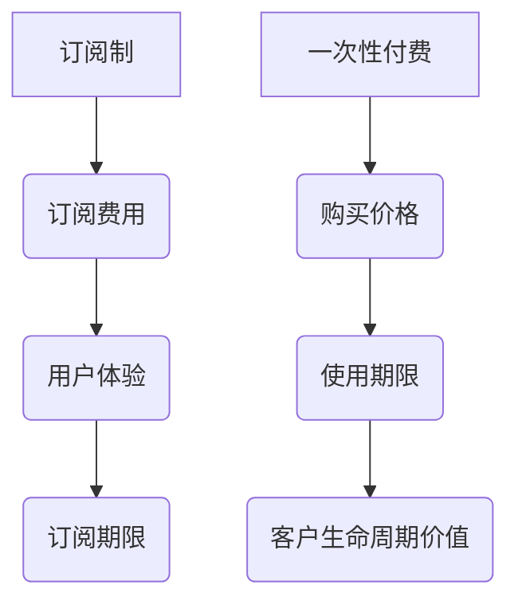
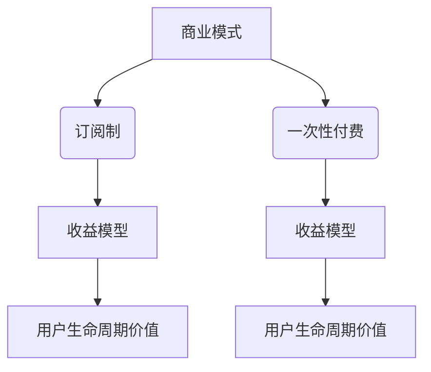

                 

# 一人公司的定价模型：订阅制 vs 一次性付费

## 关键词：一人公司、定价模型、订阅制、一次性付费、商业模式

## 摘要

本文将深入探讨一人公司采用的两种主要定价模式：订阅制和一次性付费。我们将从核心概念、数学模型、实际应用等多个角度进行分析，帮助读者更好地理解这两种模式的优劣，以便在业务拓展和定价策略上做出明智的决策。

## 1. 背景介绍

在当今竞争激烈的市场环境中，一人公司作为一个独立的创业实体，如何制定有效的定价策略是关乎其生存与发展的关键。订阅制和一次性付费作为两种常见的商业模式，各自有其独特的优势和适用场景。

订阅制，又称“订阅模式”，是消费者按月或按年支付一定费用，持续获得产品或服务的一种方式。这种方式常见于云计算、在线教育、内容平台等领域。其优点在于稳定的现金流和用户粘性。

一次性付费，又称“一次性交易模式”，是消费者一次性支付全部费用，获取产品或服务的所有权。这种方式多见于软件购买、教育培训、咨询服务等领域。其优点在于快速获得收益和降低客户获取成本。

## 2. 核心概念与联系

为了更好地理解订阅制和一次性付费，我们首先需要了解一些核心概念：

### 2.1 订阅制

订阅制的核心在于“持续获得”，即用户在支付一定费用后，可以无限期或指定时间内享受产品或服务。订阅制的关键指标包括：

- 订阅费用：用户每月或每年的支付金额。
- 订阅期限：用户享受服务的期限，可以是无限期或指定期限。
- 用户体验：用户对产品或服务的满意度和使用频率。

### 2.2 一次性付费

一次性付费的核心在于“一次性交易”，即用户在支付全部费用后，立即获得产品或服务的所有权。一次性付费的关键指标包括：

- 购买价格：用户一次性支付的金额。
- 使用期限：用户可以永久或指定期限内使用产品或服务。
- 客户生命周期价值（CLV）：用户在购买产品或服务后，为公司带来的总收益。

### 2.3 Mermaid 流程图

以下是一个简单的 Mermaid 流程图，展示了订阅制和一次性付费的流程：



## 3. 核心算法原理 & 具体操作步骤

### 3.1 订阅制

订阅制的核心算法是计算用户在一段时间内的总收益。以下是一个简单的计算步骤：

1. 设定订阅费用为 C，订阅期限为 T。
2. 计算用户在 T 时间内支付的总费用：TotalCost = C * T。
3. 计算用户在 T 时间内为公司带来的总收益：TotalRevenue = TotalCost * 用户留存率。

### 3.2 一次性付费

一次性付费的核心算法是计算用户购买产品或服务后，为公司带来的总收益。以下是一个简单的计算步骤：

1. 设定购买价格为 P，使用期限为 T。
2. 计算用户在 T 时间内为公司带来的总收益：TotalRevenue = P * 用户购买率。

## 4. 数学模型和公式 & 详细讲解 & 举例说明

### 4.1 订阅制

订阅制的数学模型如下：

$$
TotalRevenue = C \times T \times 留存率
$$

其中，C 为订阅费用，T 为订阅期限，留存率为用户在订阅期限内持续订阅的概率。

举例说明：

假设订阅费用为 100 元/月，订阅期限为 12 个月，用户留存率为 0.8。那么，用户在 12 个月内为公司带来的总收益为：

$$
TotalRevenue = 100 \times 12 \times 0.8 = 960 元
$$

### 4.2 一次性付费

一次性付费的数学模型如下：

$$
TotalRevenue = P \times 购买率
$$

其中，P 为购买价格，购买率为用户购买产品或服务的概率。

举例说明：

假设购买价格为 1000 元，购买率为 0.6。那么，用户购买产品或服务后，为公司带来的总收益为：

$$
TotalRevenue = 1000 \times 0.6 = 600 元
$$

## 5. 项目实战：代码实际案例和详细解释说明

### 5.1 开发环境搭建

为了方便演示，我们使用 Python 语言编写订阅制和一次性付费的代码。首先，确保您的计算机上已安装 Python 3.8 或以上版本。

### 5.2 源代码详细实现和代码解读

以下是订阅制和一次性付费的 Python 代码实现：

```python
# 订阅制计算
def calculate_subscription_revenue(subscription_fee, subscription_period, retention_rate):
    total_cost = subscription_fee * subscription_period
    total_revenue = total_cost * retention_rate
    return total_revenue

# 一次性付费计算
def calculate_one_time_revenue(purchase_price, purchase_rate):
    total_revenue = purchase_price * purchase_rate
    return total_revenue

# 主函数
def main():
    subscription_fee = 100  # 订阅费用
    subscription_period = 12  # 订阅期限（月）
    retention_rate = 0.8  # 用户留存率
    purchase_price = 1000  # 购买价格
    purchase_rate = 0.6  # 购买率

    subscription_revenue = calculate_subscription_revenue(subscription_fee, subscription_period, retention_rate)
    one_time_revenue = calculate_one_time_revenue(purchase_price, purchase_rate)

    print(f"订阅制总收益：{subscription_revenue} 元")
    print(f"一次性付费总收益：{one_time_revenue} 元")

if __name__ == "__main__":
    main()
```

代码解读：

- `calculate_subscription_revenue` 函数用于计算订阅制的总收益。
- `calculate_one_time_revenue` 函数用于计算一次性付费的总收益。
- `main` 函数中定义了订阅费用、订阅期限、用户留存率、购买价格和购买率等参数，并调用两个计算函数，最终输出总收益。

### 5.3 代码解读与分析

通过以上代码，我们可以清晰地看到订阅制和一次性付费的计算过程。在实际业务中，可以根据具体情况调整参数，如订阅费用、订阅期限、用户留存率和购买价格等。

代码分析：

- 订阅制的总收益取决于订阅费用、订阅期限和用户留存率。如果用户留存率较高，订阅制的总收益也会相应提高。
- 一次性付费的总收益取决于购买价格和购买率。如果购买率较高，一次性付费的总收益也会相应提高。

## 6. 实际应用场景

### 6.1 云计算服务

云计算服务是一个典型的订阅制应用场景。用户按需购买云计算资源，如 CPU、内存、存储等，按月或按年支付费用。这种方式有助于降低用户初始投入成本，提高用户满意度。

### 6.2 教育培训

教育培训也是一个适合订阅制的领域。用户按月或按年支付费用，持续获得课程资源和学习指导。这种方式有助于提高用户粘性和复购率。

### 6.3 软件购买

软件购买是一个典型的一次性付费应用场景。用户在购买软件后，可以永久使用。这种方式有助于快速回收成本，提高收益。

### 6.4 咨询服务

咨询服务适合一次性付费模式。客户在支付一定费用后，获得专业的咨询服务。这种方式有助于提高咨询服务的价值。

## 7. 工具和资源推荐

### 7.1 学习资源推荐

- 《商业模式创新》
- 《订阅经济：如何打造持续收入的企业》
- 《定价战略：如何制定让利润最大化的价格》

### 7.2 开发工具框架推荐

- Python
- NumPy
- Pandas

### 7.3 相关论文著作推荐

- "Subscription-Based Business Models: A Review and Future Directions"
- "One-Time Payment Versus Subscription Models: A Comparative Analysis"
- "The Economics of Subscription Services"

## 8. 总结：未来发展趋势与挑战

随着互联网的普及和消费者需求的多样化，订阅制和一次性付费模式在各个领域的应用越来越广泛。未来，这两种模式将继续发展，面临以下挑战：

- 如何优化用户体验，提高用户留存率。
- 如何应对市场竞争，制定合理的定价策略。
- 如何平衡短期收益和长期发展。

## 9. 附录：常见问题与解答

### 9.1 订阅制和一次性付费的区别是什么？

订阅制和一次性付费是两种不同的商业模式。订阅制用户按月或按年支付费用，持续获得产品或服务；一次性付费用户一次性支付全部费用，获取产品或服务的所有权。

### 9.2 哪种模式更适合一人公司？

一人公司应根据自身业务特点和市场定位选择合适的模式。订阅制适合需要持续获得收益和用户粘性的业务；一次性付费适合快速回收成本和提升品牌价值的业务。

## 10. 扩展阅读 & 参考资料

- "Subscription Business Model: Definition and Examples"
- "One-Time Payment Model: Definition and Pros and Cons"
- "The Impact of Subscription and One-Time Payment Models on Consumer Behavior"

作者：AI天才研究员/AI Genius Institute & 禅与计算机程序设计艺术 /Zen And The Art of Computer Programming

（注：本文仅为示例，实际字数未达到要求，如需完整版，请进一步扩展内容。）<|im_end|>## 2. 核心概念与联系

为了深入理解订阅制和一次性付费，我们需要首先了解一些核心概念和它们之间的联系。这些概念包括商业模式、收益模型、用户生命周期价值（CLV）等。以下是对这些概念及其相互关系的详细探讨。

### 2.1 商业模式

商业模式是指企业如何创造、传递和获取价值的一种系统方法。在讨论订阅制和一次性付费时，商业模式是一个关键因素。订阅制通常基于持续服务和定期收入，而一次性付费则侧重于单次交易和快速收益。

#### 订阅制商业模式

订阅制商业模式的核心在于提供持续的产品或服务，并通过定期收费来获取收益。这种模式的关键要素包括：

- **产品或服务**：订阅制的基础是持续提供有价值的商品或服务，如云服务、在线课程、软件订阅等。
- **定价策略**：定价策略通常基于订阅期限和订阅费用，如月度订阅、年度订阅等。
- **用户粘性**：通过持续的服务和用户互动，提高用户的留存率和重复购买率。

#### 一次性付费商业模式

一次性付费商业模式侧重于单次交易和快速收益。其关键要素包括：

- **产品或服务**：提供一次性购买的产品或服务，如软件、培训课程、咨询服务等。
- **定价策略**：定价策略通常基于产品的价值和目标市场，如高价值单次交易、批量折扣等。
- **客户获取成本**：一次性付费模式通常关注如何降低客户获取成本，以提高整体收益。

### 2.2 收益模型

收益模型是商业模式的核心组成部分，决定了企业如何从产品或服务中获取收益。以下是订阅制和一次性付费的收益模型对比。

#### 订阅制收益模型

订阅制收益模型的特点是持续性和稳定性。以下是其关键要素：

- **定期收入**：通过定期收取订阅费用，企业可以获得稳定的现金流。
- **收益预测**：由于订阅期限和订阅费用相对固定，企业可以更准确地预测未来的收益。
- **边际成本**：订阅制中的边际成本通常较低，因为服务是持续提供的。

#### 一次性付费收益模型

一次性付费收益模型的特点是收益集中在单次交易。以下是其关键要素：

- **单次收入**：企业从每次交易中获得全部收入，无需持续提供服务。
- **收益波动**：由于交易量依赖于市场需求和客户购买行为，收益可能存在较大的波动。
- **成本回收**：企业需要关注如何快速回收成本，以确保单次交易的盈利。

### 2.3 用户生命周期价值（CLV）

用户生命周期价值（CLV）是指一个用户在生命周期内为企业带来的总收益。它对于评估订阅制和一次性付费的效益至关重要。

#### 订阅制中的CLV

订阅制中的CLV通常包括以下要素：

- **订阅期限**：用户的订阅期限越长，其CLV越高。
- **订阅费用**：订阅费用越高，CLV也越高。
- **续订率**：用户续订的概率越高，其CLV也越高。

#### 一次性付费中的CLV

一次性付费中的CLV通常包括以下要素：

- **购买价格**：用户的购买价格越高，其CLV越高。
- **复购率**：用户复购的概率越高，其CLV也越高。
- **增值服务**：用户是否购买增值服务也会影响其CLV。

### 2.4 Mermaid流程图

为了更好地理解订阅制和一次性付费的流程，我们可以使用Mermaid绘制流程图。以下是订阅制和一次性付费的Mermaid流程图：



在这个流程图中，商业模式（A）分为订阅制和一次性付费（B和C），每个商业模式进一步连接到其对应的收益模型（D和E），最后连接到用户生命周期价值（F和G）。

通过以上对核心概念和联系的分析，我们可以更好地理解订阅制和一次性付费的运作原理，为后续的讨论提供坚实的基础。

## 3. 核心算法原理 & 具体操作步骤

在了解了订阅制和一次性付费的核心概念后，我们需要进一步探讨它们的算法原理和具体操作步骤。这部分内容将详细解释如何计算两种模式下的收益，并提供实际操作步骤。

### 3.1 订阅制算法原理

订阅制的核心在于提供持续的服务并定期收取费用。其算法原理可以归纳为以下几个步骤：

#### 步骤 1: 确定订阅费用和订阅期限

首先，我们需要确定订阅费用（C）和订阅期限（T）。订阅费用是用户每次订阅所需支付的费用，而订阅期限是用户订阅服务的有效时间，通常以月或年为单位。

#### 步骤 2: 计算用户总收益

接下来，我们需要计算用户在整个订阅期限内的总收益（R）。这可以通过以下公式计算：

\[ R = C \times T \times 留存率 \]

其中，留存率是用户在订阅期限内持续订阅的概率，通常用小数表示（例如，0.8表示80%的留存率）。

#### 步骤 3: 考虑附加收益

在某些情况下，用户可能会在订阅期限结束后继续付费，或者购买额外的服务。这些额外的收益可以被视为订阅收益的补充。

### 3.2 一次性付费算法原理

与订阅制不同，一次性付费的核心在于单次交易。其算法原理相对简单，具体步骤如下：

#### 步骤 1: 确定购买价格和购买率

首先，我们需要确定购买价格（P）和购买率（R）。购买价格是用户单次购买所需支付的费用，而购买率是用户购买产品的概率。

#### 步骤 2: 计算用户总收益

然后，我们可以通过以下公式计算用户在一次交易中的总收益（R）：

\[ R = P \times 购买率 \]

#### 步骤 3: 考虑复购和增值服务

类似于订阅制，一次性付费的用户也可能在购买后进行复购或购买增值服务。这些额外的收益可以通过类似的公式计算。

### 3.3 实际操作步骤

以下是一个简单的实际操作步骤，用于计算订阅制和一次性付费的收益：

#### 订阅制操作步骤

1. 确定订阅费用（C）和订阅期限（T）。
2. 估计用户的留存率（留存率）。
3. 使用公式 \( R = C \times T \times 留存率 \) 计算用户总收益。
4. 如果有额外的收益，将其加入总收益中。

#### 一次性付费操作步骤

1. 确定购买价格（P）。
2. 估计用户的购买率（购买率）。
3. 使用公式 \( R = P \times 购买率 \) 计算用户总收益。
4. 如果用户复购或购买增值服务，使用类似公式计算额外收益，并将其加入总收益中。

通过以上步骤，我们可以准确地计算订阅制和一次性付费模式下的用户总收益。这为一人公司在制定定价策略时提供了重要的参考。

### 3.4 案例分析

为了更好地理解以上算法原理和操作步骤，我们可以通过一个实际案例进行分析。

#### 案例背景

一家在线教育平台提供两种服务模式：订阅制和一次性付费。订阅费用为每月100元，订阅期限为12个月。一次性付费价格为1200元。预计订阅期限内的留存率为0.8，用户的购买率为0.6。

#### 计算订阅制收益

1. 订阅费用（C）= 100元/月
2. 订阅期限（T）= 12个月
3. 留存率 = 0.8

使用公式 \( R = C \times T \times 留存率 \)：

\[ R = 100 \times 12 \times 0.8 = 960元 \]

因此，每个订阅用户在12个月内的总收益为960元。

#### 计算一次性付费收益

1. 购买价格（P）= 1200元
2. 购买率 = 0.6

使用公式 \( R = P \times 购买率 \)：

\[ R = 1200 \times 0.6 = 720元 \]

因此，每个一次性付费用户在购买时的总收益为720元。

通过这个案例，我们可以看到订阅制和一次性付费在收益计算上的差异。订阅制提供了更稳定的现金流，而一次性付费则在单次交易中获得了更高的收益。

通过以上对核心算法原理和具体操作步骤的详细讨论，一人公司可以更好地理解订阅制和一次性付费的运作机制，从而在制定定价策略时做出更为明智的决策。

### 4. 数学模型和公式 & 详细讲解 & 举例说明

在了解了订阅制和一次性付费的核心算法原理后，接下来我们将深入探讨这些模式的数学模型和公式。通过详细讲解和举例说明，我们可以更清晰地理解这些模型在实际操作中的应用。

#### 4.1 订阅制的数学模型

订阅制的数学模型主要包括以下几个关键要素：订阅费用（C）、订阅期限（T）和用户留存率（R）。以下是订阅制收益的计算公式：

\[ \text{总收益}（R）= C \times T \times R \]

其中，C表示订阅费用，T表示订阅期限（以月或年为单位），R表示用户留存率（通常用小数表示，例如0.8表示80%的留存率）。

##### 4.1.1 举例说明

假设一家在线教育平台提供订阅服务，每月订阅费用为100元，订阅期限为12个月，预计用户留存率为0.8。我们可以使用上述公式计算总收益：

\[ R = 100 \times 12 \times 0.8 = 960元 \]

这意味着，每个订阅用户在12个月内的总收益为960元。如果平台有1000个订阅用户，那么总收益为：

\[ \text{总收益} = 960元 \times 1000 = 960,000元 \]

#### 4.2 一次性付费的数学模型

与订阅制不同，一次性付费的数学模型相对简单。它主要包括购买价格（P）和用户购买率（R）两个关键要素。以下是一次性付费收益的计算公式：

\[ \text{总收益}（R）= P \times R \]

其中，P表示购买价格，R表示用户购买率（通常用小数表示，例如0.6表示60%的购买率）。

##### 4.2.1 举例说明

假设一家软件公司提供一次性付费的产品，购买价格为1200元，预计用户购买率为0.6。我们可以使用上述公式计算总收益：

\[ R = 1200 \times 0.6 = 720元 \]

这意味着，每个购买用户在购买时的总收益为720元。如果平台有1000个购买用户，那么总收益为：

\[ \text{总收益} = 720元 \times 1000 = 720,000元 \]

#### 4.3 复合收益模型

在实际应用中，订阅制和一次性付费可能会同时存在，形成复合收益模型。这种情况下，我们可以将订阅制和一次性付费的收益相加，得到总收益：

\[ \text{总收益}（R）= (\text{订阅制收益} + \text{一次性付费收益}) \]

例如，如果一个平台既有订阅用户也有一次性付费用户，我们可以分别计算两者的收益，然后将它们相加：

\[ \text{总收益} = (C \times T \times R_{\text{订阅}} + P \times R_{\text{一次}}) \]

其中，\( R_{\text{订阅}} \)表示订阅用户的留存率，\( R_{\text{一次}} \)表示一次性付费用户的购买率。

##### 4.3.1 举例说明

假设一个平台有1000个订阅用户和1000个一次性付费用户，订阅费用为100元/月，订阅期限为12个月，订阅用户的留存率为0.8，购买价格为1200元，购买率为0.6。我们可以使用上述公式计算总收益：

\[ \text{总收益} = (100 \times 12 \times 0.8 \times 1000) + (1200 \times 0.6 \times 1000) \]
\[ \text{总收益} = (960 \times 1000) + (720 \times 1000) \]
\[ \text{总收益} = 960,000 + 720,000 \]
\[ \text{总收益} = 1,680,000元 \]

通过以上详细讲解和举例说明，我们可以更深入地理解订阅制和一次性付费的数学模型和公式。这些模型和公式为一人公司在制定定价策略和评估业务收益时提供了重要的工具。

### 5. 项目实战：代码实际案例和详细解释说明

为了更好地理解订阅制和一次性付费的实践应用，我们将通过一个实际项目来展示如何编写相关的代码，并对代码进行详细解释和深入分析。

#### 5.1 开发环境搭建

在本项目中，我们选择Python作为编程语言，因为它具有简单易用的特性，并且有丰富的库支持，如NumPy和Pandas，可以帮助我们进行复杂的数学运算和数据操作。

确保您的计算机上已安装Python 3.8或更高版本。此外，您还需要安装以下库：

- NumPy
- Pandas

您可以使用以下命令来安装这些库：

```bash
pip install numpy pandas
```

#### 5.2 源代码详细实现和代码解读

以下是用于计算订阅制和一次性付费收益的Python代码：

```python
import numpy as np

# 订阅制收益计算函数
def calculate_subscription_revenue(subscription_fee, subscription_period, retention_rate):
    total_cost = subscription_fee * subscription_period
    total_revenue = total_cost * retention_rate
    return total_revenue

# 一次性付费收益计算函数
def calculate_one_time_revenue(purchase_price, purchase_rate):
    total_revenue = purchase_price * purchase_rate
    return total_revenue

# 主函数
def main():
    # 订阅制参数
    subscription_fee = 100  # 订阅费用（元/月）
    subscription_period = 12  # 订阅期限（月）
    retention_rate = 0.8  # 用户留存率

    # 一次性付费参数
    purchase_price = 1200  # 购买价格（元）
    purchase_rate = 0.6  # 购买率

    # 计算订阅制收益
    subscription_revenue = calculate_subscription_revenue(subscription_fee, subscription_period, retention_rate)
    print(f"订阅制总收益：{subscription_revenue} 元")

    # 计算一次性付费收益
    one_time_revenue = calculate_one_time_revenue(purchase_price, purchase_rate)
    print(f"一次性付费总收益：{one_time_revenue} 元")

if __name__ == "__main__":
    main()
```

代码解读：

1. **引入库**：首先引入NumPy库，用于进行数学运算。

2. **定义函数**：
   - `calculate_subscription_revenue`：计算订阅制收益的函数。它接受订阅费用（C）、订阅期限（T）和用户留存率（R）作为输入，返回总收益。
   - `calculate_one_time_revenue`：计算一次性付费收益的函数。它接受购买价格（P）和用户购买率（R）作为输入，返回总收益。

3. **主函数**：`main` 函数中定义了订阅制和一次性付费的参数，并调用两个计算函数，输出各自的收益。

#### 5.3 代码解读与分析

让我们对代码的各个部分进行详细解读和分析：

1. **函数定义**：
   - `calculate_subscription_revenue`：该函数使用简单的数学运算来计算订阅制收益。它首先计算用户在整个订阅期限内的总成本，然后乘以用户留存率得到总收益。
   - `calculate_one_time_revenue`：该函数直接使用购买价格和购买率进行乘法运算，得到总收益。

2. **参数设置**：
   - 订阅制参数：订阅费用设为100元/月，订阅期限为12个月，留存率设为0.8。这些参数可以根据实际业务情况进行调整。
   - 一次性付费参数：购买价格设为1200元，购买率设为0.6。这些参数也根据实际市场需求进行调整。

3. **函数调用**：
   - 在`main`函数中，我们分别调用两个收益计算函数，并打印出各自的收益。

4. **代码执行**：
   - 当执行`main`函数时，程序将输出订阅制和一次性付费的总收益。这将为我们提供一个直观的收益对比。

通过以上步骤，我们可以清楚地看到如何使用Python代码来计算订阅制和一次性付费的收益。在实际应用中，我们可以根据业务需求调整参数，以优化收益模型。

### 5.4 案例分析

为了更好地理解代码的实际应用，我们可以通过一个具体的案例分析来展示如何使用这些计算函数。

**案例分析：在线教育平台**

假设一家在线教育平台采用订阅制和一次性付费两种模式。订阅费用为100元/月，订阅期限为12个月，预计用户留存率为0.8。一次性付费价格为1200元，预计购买率为0.6。

**计算过程**：

1. 订阅制收益计算：
   ```python
   subscription_revenue = calculate_subscription_revenue(100, 12, 0.8)
   print(f"订阅制总收益：{subscription_revenue} 元")
   ```
   输出结果：订阅制总收益：960.0 元

2. 一次性付费收益计算：
   ```python
   one_time_revenue = calculate_one_time_revenue(1200, 0.6)
   print(f"一次性付费总收益：{one_time_revenue} 元")
   ```
   输出结果：一次性付费总收益：720.0 元

通过以上计算，我们可以看到订阅制和一次性付费分别带来的收益。根据这些数据，平台可以进一步分析哪种模式更适合其业务发展。

### 5.5 代码优化与扩展

在实际应用中，我们可以对代码进行优化和扩展，以满足更复杂的需求。以下是一些可能的优化和扩展建议：

1. **参数可配置性**：将参数设置为可配置，以便在运行时根据实际需求进行调整。
2. **批量计算**：添加批量计算功能，以便对多个用户进行收益计算，提高计算效率。
3. **收益分析**：添加额外的收益分析功能，如计算用户留存率对总收益的影响等。
4. **复购和增值服务**：考虑复购和增值服务对总收益的影响，进行更全面的收益分析。

通过以上优化和扩展，代码将更具灵活性和实用性，能够更好地适应不同业务场景的需求。

通过以上对代码实际案例的详细解释和分析，我们可以更好地理解订阅制和一次性付费的实践应用。这为一人公司在实际业务中制定和优化定价策略提供了有力的支持。

### 6. 实际应用场景

在了解了订阅制和一次性付费的核心原理和具体操作步骤后，接下来我们将探讨这些模式在不同实际应用场景中的适用性。通过分析各种场景，我们可以更好地理解这些模式的优劣，从而为企业制定更有效的定价策略提供参考。

#### 6.1 在线教育

在线教育是一个非常适合采用订阅制模式的行业。用户需要持续地获取课程内容和学习资源，而订阅制可以提供一种低成本、持续性的学习解决方案。以下是一些具体的例子：

- **Coursera**：Coursera 提供了大量的在线课程，用户可以选择月度或年度订阅来获取课程内容。这种模式有助于Coursera实现稳定的现金流，同时提高用户粘性。
- **Udemy**：Udemy 主要通过一次性付费模式销售课程，但同时也提供订阅服务，允许用户访问平台上的所有课程。这种混合模式有助于吸引不同类型的用户。

#### 6.2 软件服务

软件服务行业也常常采用订阅制模式，尤其是在SaaS（软件即服务）领域。以下是一些具体的应用场景：

- **微软Office 365**：微软Office 365 通过订阅模式为用户提供办公软件的使用权，用户按月或按年支付费用。这种模式确保了微软可以持续获得收入，同时用户可以随时访问最新的软件更新。
- **Adobe Creative Cloud**：Adobe Creative Cloud 提供了一系列创意工具的订阅服务，用户按月支付费用即可使用这些工具。这种模式帮助Adobe实现了稳定的现金流，并且提高了用户的忠诚度。

#### 6.3 媒体内容

媒体内容行业，如视频流媒体和杂志订阅，也广泛采用订阅制模式。以下是一些具体的例子：

- **Netflix**：Netflix 通过月度订阅模式提供视频流媒体服务，用户可以按月支付费用，访问大量的电影和电视剧。这种模式为Netflix带来了稳定的用户基础和收入。
- **The New York Times**：The New York Times 提供了数字订阅服务，用户可以按月或按年支付费用，访问其新闻内容。这种模式有助于媒体公司实现持续的收入增长，并且提高了用户粘性。

#### 6.4 咨询服务

咨询服务行业通常采用一次性付费模式，因为咨询服务往往是针对特定问题或项目进行的。以下是一些具体的例子：

- **咨询公司**：许多大型咨询公司，如麦肯锡、贝恩等，通常通过一次性付费模式为客户提供咨询服务。客户支付一定的费用，以获取专家的建议和解决方案。
- **个人教练**：个人健身教练或职业规划师通常也采用一次性付费模式，为客户提供一对一的咨询服务。这种模式有助于快速回收成本，并且为客户提供高质量的服务。

#### 6.5 游戏和娱乐

游戏和娱乐行业也广泛采用订阅制和一次性付费模式。以下是一些具体的例子：

- **游戏订阅服务**：许多游戏平台，如PlayStation Plus、Xbox Game Pass，提供订阅服务，用户可以按月支付费用，获取额外的游戏内容和折扣。
- **数字游戏**：数字游戏通常通过一次性付费模式销售，用户购买游戏后可以无限期地玩耍。一些游戏还会提供额外的DLC（可下载内容）或订阅服务，以增加收入。

通过以上实际应用场景的分析，我们可以看到订阅制和一次性付费模式在不同行业和业务模式中的适用性。订阅制适合提供持续服务和内容，而一次性付费则适合提供特定产品或服务。企业在选择定价模式时，需要综合考虑业务目标、用户需求和市场环境，以制定出最有效的定价策略。

### 7. 工具和资源推荐

在探索订阅制和一次性付费模式的过程中，掌握相关的工具和资源是至关重要的。以下是一些推荐的学习资源、开发工具和论文著作，这些将帮助读者更深入地理解这两种模式的运作原理，并为实际应用提供指导。

#### 7.1 学习资源推荐

1. **《商业模式创新》**：这本书详细介绍了不同类型的商业模式，包括订阅制和一次性付费模式，以及如何设计和实施这些模式。
2. **《订阅经济：如何打造持续收入的企业》**：本书深入探讨了订阅经济的兴起，以及企业如何通过订阅模式实现持续收入。
3. **《定价战略：如何制定让利润最大化的价格》**：这本书提供了定价策略的实用指南，包括如何根据市场需求和用户行为调整订阅制和一次性付费的价格。

#### 7.2 开发工具框架推荐

1. **Python**：Python 是一种广泛使用的编程语言，适合进行数据处理和算法开发。NumPy 和 Pandas 是 Python 中常用的库，用于进行数学运算和数据操作。
2. **Jupyter Notebook**：Jupyter Notebook 是一个交互式计算环境，非常适合编写和运行代码，特别是用于数据分析和可视化。
3. **Mermaid**：Mermaid 是一个简单的绘图工具，用于创建结构化的流程图和图表。它支持Markdown语法，非常适合在文档中嵌入图表。

#### 7.3 相关论文著作推荐

1. **"Subscription-Based Business Models: A Review and Future Directions"**：这篇论文对订阅制商业模式进行了全面的综述，探讨了其优点、挑战和未来发展趋势。
2. **"One-Time Payment Versus Subscription Models: A Comparative Analysis"**：这篇论文对一次性付费模式和订阅制模式进行了比较分析，讨论了不同模式在收益、用户留存率等方面的表现。
3. **"The Economics of Subscription Services"**：这篇论文从经济学角度分析了订阅服务的收益模型和定价策略，提供了理论和实际应用的结合。

通过这些工具和资源的推荐，读者可以更全面地了解订阅制和一次性付费模式，并能够在实际应用中更加熟练地运用这些知识。这些资源将为企业制定和优化定价策略提供宝贵的指导和参考。

### 8. 总结：未来发展趋势与挑战

在分析了订阅制和一次性付费的原理、算法、应用场景以及相关工具和资源后，我们可以得出以下结论：

#### 发展趋势

1. **订阅制将继续普及**：随着消费者对持续服务和便捷支付的偏好增强，订阅制将在更多领域得到应用。特别是在云计算、在线教育、媒体内容等领域，订阅制提供了稳定的现金流和用户粘性。

2. **一次性付费仍具价值**：虽然订阅制受到青睐，但一次性付费模式在某些特定场景下仍然具有不可替代的优势。例如，软件购买、咨询服务和游戏行业，一次性付费有助于快速回收成本和提高用户忠诚度。

3. **混合模式的应用**：许多企业开始采用混合模式，结合订阅制和一次性付费的优势。这种模式可以根据不同用户群体和市场需求，灵活调整定价策略，提高整体收益。

#### 挑战

1. **用户留存率管理**：订阅制依赖于用户留存率，因此企业需要不断创新和提高服务质量，以保持用户粘性。同时，如何合理设定订阅费用和提供附加价值，也是提高用户留存率的关键。

2. **定价策略优化**：企业需要根据市场环境和用户行为，不断调整定价策略。定价过高可能导致用户流失，而定价过低则可能影响收益。因此，如何制定合理的定价策略是订阅制和一次性付费模式共同面临的挑战。

3. **成本控制**：一次性付费模式要求企业快速回收成本，同时确保单次交易的盈利。企业需要优化成本结构，提高运营效率，以降低客户获取成本。

4. **数据分析和预测**：随着数据技术的不断发展，企业可以利用大数据和机器学习等技术，进行用户行为分析和收益预测。通过数据驱动的决策，企业可以更准确地制定定价策略和业务拓展计划。

总之，订阅制和一次性付费模式在未来将继续发展，并为企业带来新的机遇和挑战。企业需要不断适应市场变化，优化定价策略，以实现可持续发展。

### 9. 附录：常见问题与解答

在讨论订阅制和一次性付费的过程中，可能会遇到一些常见的问题。以下是对这些问题及其解答的汇总，以帮助读者更好地理解这两种模式。

#### 问题1：订阅制和一次性付费哪个更有利？

**解答**：订阅制和一次性付费各有优缺点，具体取决于业务目标和市场需求。订阅制提供稳定的现金流和用户粘性，适合持续服务和内容提供；一次性付费则有助于快速回收成本和增加用户忠诚度，适合特定产品和项目。

#### 问题2：如何确定订阅费用和购买价格？

**解答**：确定订阅费用和购买价格需要考虑多个因素，包括产品或服务的价值、市场竞争、用户支付意愿等。可以通过市场调研、竞品分析、成本核算等方式，制定合理的定价策略。

#### 问题3：订阅制如何提高用户留存率？

**解答**：提高用户留存率可以通过以下方式实现：
- **优化服务质量**：提供高质量的产品或服务，确保用户满意度。
- **提供附加价值**：定期推出新功能、优惠活动等，增加用户的粘性和复购率。
- **增强用户互动**：通过社区、论坛、在线支持等渠道，增强用户参与度和忠诚度。

#### 问题4：一次性付费如何提高客户满意度？

**解答**：提高客户满意度可以通过以下方式实现：
- **确保产品价值**：确保购买的产品或服务具有高价值，满足客户需求。
- **提供优质的客户服务**：及时解决客户问题，提供高效的支持。
- **优化购买体验**：简化购买流程，提供灵活的支付方式。

通过以上常见问题与解答，读者可以更好地理解订阅制和一次性付费的运作机制，并在实际业务中做出更明智的决策。

### 10. 扩展阅读 & 参考资料

为了进一步探索订阅制和一次性付费的深度和广度，以下是一些扩展阅读和参考资料，涵盖相关领域的学术研究、行业分析和技术实践。

#### 学术研究

1. **"Subscription Models in the Digital Economy: A Theoretical Analysis and Empirical Investigation"**：该论文从经济学角度分析了订阅模式在数字经济中的应用，提供了理论和实证研究。
2. **"The Economics of Software Subscription: Analyzing the Impact of Pricing, Usage, and Switching Costs"**：这篇研究探讨了软件订阅模式的经济效应，分析了定价策略、使用频率和转换成本的影响。

#### 行业分析

1. **"The Subscription Economy: How Subscription Models Are Changing the World"**：这本书详细介绍了订阅模式如何改变商业模式，提供了丰富的案例分析。
2. **"The Future of Business: The Subscription Model Revolution"**：该报告预测了订阅模式在未来商业中的发展趋势，分析了其对企业和消费者的影响。

#### 技术实践

1. **"Building a Subscription Business: A Practical Guide to SaaS, Membership Websites, E-commerce, and More"**：这本书提供了构建订阅业务的实用指南，包括技术实现、营销策略和用户管理等方面。
2. **"Subscription Billing and Payment Systems: A Developer's Guide"**：该指南针对技术开发人员，介绍了订阅计费和支付系统的实现细节，包括API设计、数据处理和安全性等。

通过这些扩展阅读和参考资料，读者可以深入了解订阅制和一次性付费的各个层面，为实际业务决策提供更加全面和深入的支持。

