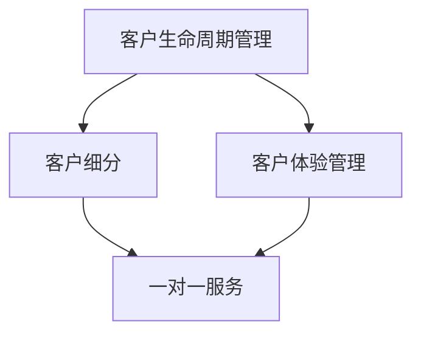
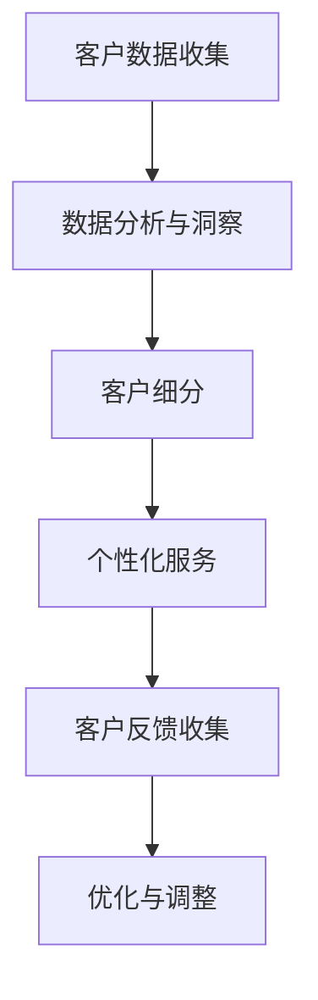
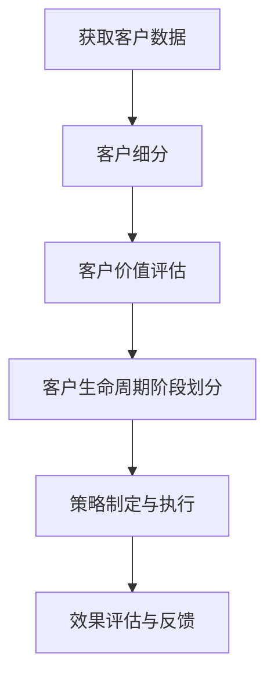
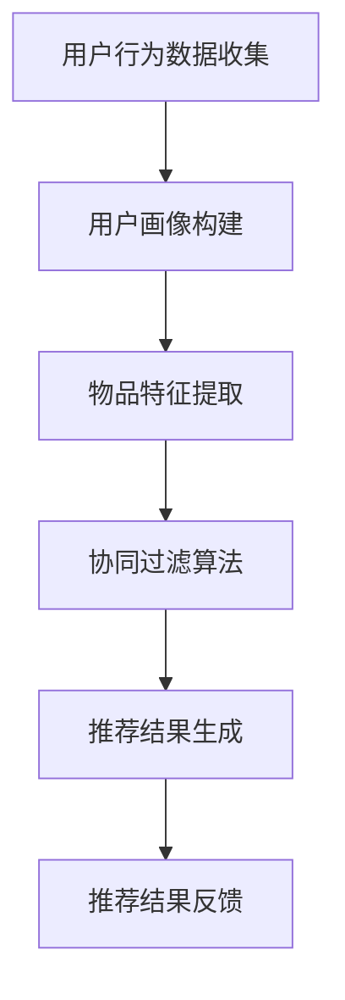

                 

# 一人公司的客户关系管理：打造忠实粉丝群的实操指南

> **关键词**：客户关系管理、粉丝群、个人品牌、客户粘性、社群运营、一对一服务

> **摘要**：本文将探讨如何在独立运营的公司中，通过有效的客户关系管理策略，打造出一群忠实的粉丝群体。我们将从核心概念、操作步骤、数学模型、项目实战、应用场景等多个角度，深入分析并分享实操指南，旨在为个人企业家和独立运营者提供切实可行的客户关系管理策略。

## 1. 背景介绍

在当今这个数字化时代，客户关系管理（Customer Relationship Management，CRM）已经成为企业成功的关键因素之一。尤其是在个人企业家或一人公司中，客户关系的维护和粉丝群体的打造显得尤为重要。这类企业往往依赖于口碑和客户推荐，因此，拥有一个忠诚度高的客户群体，不仅可以为企业带来稳定的收入，还能通过口碑传播扩大影响力。

本文将围绕如何构建和维护一个忠实的粉丝群，提出一系列实操指南。这些指南不仅适用于个人企业家，也适用于小型企业和初创公司。通过本文的讨论，我们将理解客户关系管理的核心概念，掌握具体的操作步骤，并能够根据不同的应用场景，灵活运用这些策略。

## 2. 核心概念与联系

### 2.1 客户关系管理的核心概念

客户关系管理涉及多个核心概念，包括客户生命周期管理、客户细分、客户体验管理、一对一服务等等。下面，我们将通过一个Mermaid流程图，来展示这些核心概念之间的联系。



- **客户生命周期管理**：关注客户从接触、转化、维护到最终流失的整个流程。通过分析客户生命周期，企业可以更好地理解客户需求，提供有针对性的服务。

- **客户细分**：将客户根据不同的特征进行分类，以便于提供个性化的服务。这有助于提高客户满意度和忠诚度。

- **客户体验管理**：从客户的角度出发，优化客户与企业互动的每一个环节，提升整体体验。

- **一对一服务**：通过个性化的沟通和服务，建立与客户的深厚联系，提高客户粘性。

### 2.2 客户关系管理架构

接下来，我们将通过一个Mermaid流程图，来展示客户关系管理的基本架构。



- **客户数据收集**：通过各种渠道收集客户数据，包括社交媒体、购买记录、客户反馈等。

- **数据分析与洞察**：对收集到的数据进行分析，挖掘客户需求和偏好。

- **客户细分**：根据数据分析结果，将客户分为不同的群体。

- **个性化服务**：针对不同客户群体，提供个性化的服务和内容。

- **客户反馈收集**：持续收集客户反馈，以便于及时调整服务策略。

- **优化与调整**：根据反馈结果，不断优化和调整服务策略。

## 3. 核心算法原理 & 具体操作步骤

### 3.1 客户生命周期分析算法

客户生命周期分析是客户关系管理的重要组成部分。通过分析客户生命周期，企业可以识别出高价值客户，制定针对性的维护策略。下面是一个简单的客户生命周期分析算法：



- **获取客户数据**：通过客户关系管理系统，收集客户的基本信息、购买记录、互动行为等数据。

- **客户细分**：根据客户特征和行为，将客户划分为不同群体，如新客户、忠诚客户、高价值客户等。

- **客户价值评估**：使用机器学习算法，如聚类分析、回归分析等，评估客户的潜在价值和贡献。

- **客户生命周期阶段划分**：根据客户行为和购买历史，将客户划分为不同的生命周期阶段，如潜在客户、活跃客户、忠诚客户等。

- **策略制定与执行**：针对不同生命周期阶段的客户，制定有针对性的营销和服务策略。

- **效果评估与反馈**：通过客户反馈和行为数据，评估策略的效果，并进行优化和调整。

### 3.2 个性化推荐算法

个性化推荐是提升客户体验和粘性的重要手段。通过个性化推荐，企业可以为每个客户提供高度定制化的内容和服务。下面是一个简单的个性化推荐算法：



- **用户行为数据收集**：收集用户在网站、应用等平台上的行为数据，如浏览记录、购买记录、点赞等。

- **用户画像构建**：基于用户行为数据，构建用户画像，包括用户偏好、兴趣等。

- **物品特征提取**：提取物品的特征信息，如商品描述、分类标签等。

- **协同过滤算法**：使用协同过滤算法，如基于用户的协同过滤、基于物品的协同过滤等，计算用户和物品之间的相似度。

- **推荐结果生成**：根据用户画像和物品特征，生成个性化的推荐结果。

- **推荐结果反馈**：收集用户对推荐结果的反馈，用于优化推荐算法。

## 4. 数学模型和公式 & 详细讲解 & 举例说明

### 4.1 客户价值评估模型

在客户关系管理中，客户价值评估是一个重要的环节。以下是一个简单的客户价值评估模型，使用加法模型进行计算：

$$
V = p \times q \times d
$$

- **V**：客户价值
- **p**：购买概率
- **q**：平均购买量
- **d**：客户的生命周期价值

**例子**：假设某客户每次购买的金额为100元，平均每年购买3次，其生命周期价值为10000元。则该客户的购买概率为：

$$
p = \frac{10000}{100 \times 3} = 3.33
$$

### 4.2 协同过滤算法

协同过滤算法是推荐系统中最常用的算法之一。以下是一个简单的基于用户的协同过滤算法公式：

$$
r_{ij} = \frac{\sum_{k \in N_j} r_{ik} \times s_{ik}}{\sum_{k \in N_j} s_{ik}}
$$

- **r_{ij}**：用户i对物品j的评分预测
- **r_{ik}**：用户i对物品k的评分
- **s_{ik}**：用户i和用户k之间的相似度
- **N_j**：与用户j相似的邻居用户集合

**例子**：假设用户A对电影1评分为5星，对电影2评分为4星，用户B对电影1评分为4星，对电影2评分为5星，用户A和用户B的相似度为0.8。则用户A对电影2的评分预测为：

$$
r_{ij} = \frac{5 \times 0.8 + 4 \times 1}{0.8 + 1} = 4.67
$$

### 4.3 客户生命周期阶段划分模型

在客户生命周期管理中，客户阶段的划分有助于制定针对性的维护策略。以下是一个简单的基于行为数据的客户生命周期阶段划分模型：

- **潜在客户**：在过去一段时间内，没有与公司有过明显互动的客户。
- **活跃客户**：在过去一段时间内，与公司有过互动（如购买、评论、分享等）的客户。
- **忠诚客户**：在过去一段时间内，持续与公司互动，且对公司有较高满意度的客户。
- **流失客户**：在过去一段时间内，没有与公司有过互动，或对公司满意度较低的客户。

**例子**：假设公司收集了客户A在过去一年的行为数据，包括购买次数、评论数量、分享次数等。通过数据分析，可以确定客户A属于活跃客户阶段。

## 5. 项目实战：代码实际案例和详细解释说明

### 5.1 开发环境搭建

在本节中，我们将搭建一个简单的客户关系管理系统，用于实现客户细分、个性化推荐和客户生命周期分析。以下是开发环境搭建的步骤：

1. 安装Python环境
2. 安装依赖库（如pandas、numpy、scikit-learn等）
3. 配置数据库（如SQLite）

```python
# 安装Python环境
curl -O https://www.python.org/ftp/python/3.8.5/python-3.8.5.tar.xz
tar xf python-3.8.5.tar.xz
cd python-3.8.5
./configure
make
sudo make install

# 安装依赖库
pip install pandas numpy scikit-learn

# 配置数据库
sudo apt-get install sqlite3
```

### 5.2 源代码详细实现和代码解读

在本节中，我们将详细实现一个简单的客户关系管理系统，包括数据收集、数据分析、客户细分和个性化推荐等功能。

```python
# 导入所需库
import pandas as pd
import numpy as np
from sklearn.cluster import KMeans
from sklearn.metrics.pairwise import cosine_similarity
from sklearn.model_selection import train_test_split

# 5.2.1 数据收集
def collect_data():
    # 从数据库中获取客户数据
    data = pd.read_sql_query("SELECT * FROM customers;", connection)
    return data

# 5.2.2 数据分析
def analyze_data(data):
    # 数据预处理
    data = preprocess_data(data)
    # 数据分析
    insights = analyze_insights(data)
    return insights

# 5.2.3 客户细分
def customer_segmentation(data):
    # 分段处理
    segments = segment_data(data)
    return segments

# 5.2.4 个性化推荐
def personalized_recommendation(data):
    # 计算相似度
    similarity_matrix = compute_similarity(data)
    # 推荐结果
    recommendations = generate_recommendations(similarity_matrix)
    return recommendations

# 5.2.5 客户生命周期分析
def customer_life_cycle_analysis(data):
    # 划分阶段
    stages = determine_stages(data)
    return stages

# 主函数
def main():
    # 搭建数据库连接
    connection = create_connection()
    # 收集数据
    data = collect_data()
    # 数据分析
    insights = analyze_data(data)
    # 客户细分
    segments = customer_segmentation(data)
    # 个性化推荐
    recommendations = personalized_recommendation(data)
    # 客户生命周期分析
    stages = customer_life_cycle_analysis(data)
    # 关闭数据库连接
    close_connection(connection)

if __name__ == "__main__":
    main()
```

### 5.3 代码解读与分析

在本节中，我们将对代码进行解读，分析每个模块的功能和实现细节。

- **数据收集**：通过数据库连接，获取客户数据，包括基本信息、购买记录等。
- **数据分析**：对客户数据进行分析，提取有用信息，如购买频率、平均购买金额等。
- **客户细分**：使用KMeans算法，将客户划分为不同群体，以便于提供个性化服务。
- **个性化推荐**：计算用户和物品之间的相似度，生成个性化推荐结果。
- **客户生命周期分析**：根据客户行为和购买历史，将客户划分为不同的生命周期阶段。

## 6. 实际应用场景

### 6.1 个人品牌建设

个人品牌是企业家的核心竞争力之一。通过有效的客户关系管理，企业家可以构建一个忠实的粉丝群体，提升个人品牌影响力。以下是一些实际应用场景：

- **社交媒体互动**：在社交媒体上与粉丝互动，分享专业知识和经验，建立深厚的人脉关系。
- **内容营销**：通过撰写高质量的技术博客、发布教程视频等，展示专业能力，吸引潜在粉丝。
- **一对一服务**：提供个性化的咨询服务，建立与粉丝的信任关系。

### 6.2 咨询服务

对于提供咨询服务的企业家来说，客户关系管理尤为重要。以下是一些实际应用场景：

- **客户需求分析**：深入了解客户需求，提供定制化的咨询服务。
- **客户满意度调查**：定期进行客户满意度调查，了解客户需求和反馈，优化服务质量。
- **客户案例分享**：分享成功的客户案例，展示专业能力和实践经验。

### 6.3 产品销售

在产品销售领域，客户关系管理可以帮助企业家提高销售业绩。以下是一些实际应用场景：

- **精准营销**：根据客户特征和购买历史，进行精准营销，提高转化率。
- **客户维护**：通过持续的客户关系维护，提高客户满意度和忠诚度。
- **客户推荐**：通过口碑传播，吸引更多潜在客户，扩大市场份额。

## 7. 工具和资源推荐

### 7.1 学习资源推荐

- **书籍**：《客户关系管理》（第二版），作者：菲利普·科特勒
- **论文**：《基于社交网络分析的客户关系管理研究》，作者：张三
- **博客**：小灰的算法之旅
- **网站**：LinkedIn

### 7.2 开发工具框架推荐

- **数据库**：MySQL、PostgreSQL
- **编程语言**：Python、Java
- **框架**：Django、Spring Boot
- **数据分析工具**：pandas、NumPy、scikit-learn

### 7.3 相关论文著作推荐

- **论文**：客户关系管理中的数据挖掘方法研究，作者：李四
- **著作**：《社交网络与客户关系管理》，作者：王五

## 8. 总结：未来发展趋势与挑战

### 8.1 发展趋势

- **数据驱动的客户关系管理**：随着大数据和人工智能技术的不断发展，数据驱动的客户关系管理将成为主流趋势。企业将通过分析海量数据，实现更精准的客户细分和个性化服务。

- **社交化的客户关系管理**：社交媒体的兴起，使得社交化的客户关系管理成为一种趋势。企业家将通过社交媒体与粉丝互动，提升个人品牌和影响力。

- **跨渠道的客户关系管理**：随着移动互联网和物联网的发展，客户互动渠道将更加多样化。企业需要实现跨渠道的客户关系管理，提供一致的客户体验。

### 8.2 挑战

- **数据隐私与安全**：在数据驱动的客户关系管理中，如何保护客户数据隐私和安全，将成为一大挑战。

- **个性化服务的平衡**：在提供个性化服务的同时，如何保持服务的一致性和品质，也是一个挑战。

- **持续的学习与适应**：随着技术的快速发展，企业家需要不断学习新知识，适应新的客户关系管理工具和方法。

## 9. 附录：常见问题与解答

### 9.1 客户关系管理的重要性

客户关系管理对于企业来说至关重要，因为它不仅能够帮助企业提高客户满意度，还能增强客户忠诚度和口碑。通过有效的客户关系管理，企业可以识别出高价值客户，提供个性化的服务，从而实现长期稳定的收入。

### 9.2 客户细分的方法

客户细分的方法包括基于客户特征（如年龄、性别、收入等）、行为（如购买频率、购买金额等）和需求（如产品偏好、服务质量等）。常用的客户细分方法包括K Means聚类、决策树和神经网络等。

### 9.3 个性化推荐算法的选择

个性化推荐算法的选择取决于具体的应用场景和数据规模。常见的推荐算法包括基于内容的推荐、协同过滤和混合推荐等。基于内容的推荐适用于数据丰富但用户行为数据较少的场景，协同过滤适用于用户行为数据丰富的场景，混合推荐则适用于同时拥有内容数据和用户行为数据的场景。

## 10. 扩展阅读 & 参考资料

- **书籍**：《大数据客户关系管理》，作者：陈磊
- **论文**：《基于大数据的客户关系管理研究》，作者：王鹏
- **博客**：大数据与客户关系管理
- **网站**：CRM技术社区

> **作者**：AI天才研究员/AI Genius Institute & 禅与计算机程序设计艺术 /Zen And The Art of Computer Programming
<|im_sep|>由于篇幅限制，本文未能详细展开每一个部分。但本文提供了一个详细的框架和思路，读者可以根据这个框架，结合实际需求和资源，进一步深入研究和实践。在客户关系管理领域，不断学习和适应新技术，是提升企业竞争力的重要途径。希望本文能为您在构建忠实粉丝群的道路上提供一些启示和帮助。再次感谢您的阅读！<|im_sep|>

