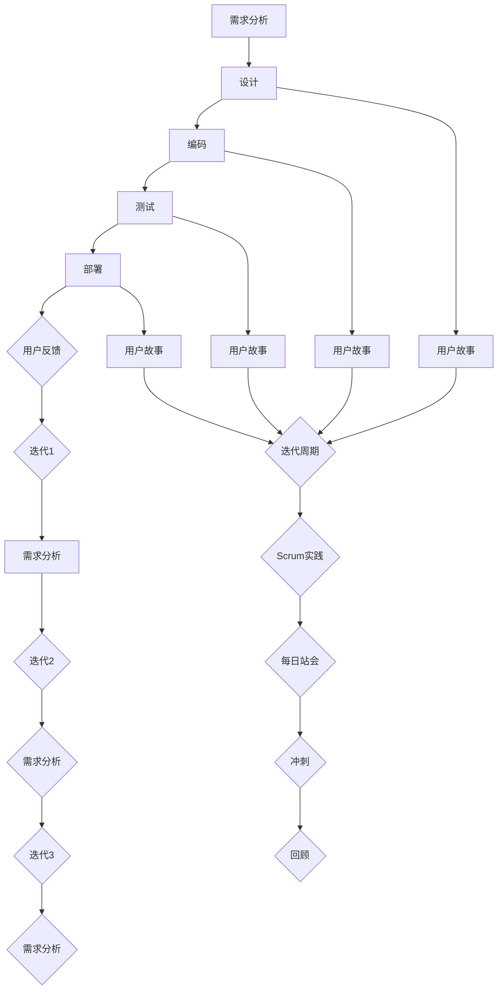
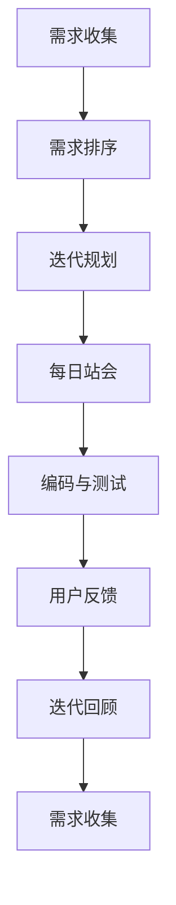

                 

# 一人公司的敏捷开发：快速响应市场需求

## 摘要

在当今快速变化的市场环境中，敏捷开发已成为许多企业提升竞争力的关键策略。对于一人公司而言，敏捷开发尤为重要，因为它要求个人开发者具备灵活性和高效性，以迅速响应市场需求。本文将深入探讨一人公司如何通过敏捷开发实现快速响应市场需求，并分享一系列实践技巧和策略。文章结构如下：

1. **背景介绍**：介绍敏捷开发的起源和核心原则。
2. **核心概念与联系**：详细解释敏捷开发的关键概念，并展示其与市场需求响应的关系。
3. **核心算法原理 & 具体操作步骤**：探讨敏捷开发的算法原理和实践步骤。
4. **数学模型和公式 & 详细讲解 & 举例说明**：介绍支持敏捷开发的数学模型和公式，并通过实例说明。
5. **项目实战：代码实际案例和详细解释说明**：提供实际代码案例，详细解释实现过程。
6. **实际应用场景**：分析敏捷开发在现实项目中的应用案例。
7. **工具和资源推荐**：推荐学习资源和开发工具。
8. **总结：未来发展趋势与挑战**：总结敏捷开发在未来的趋势和面临的挑战。
9. **附录：常见问题与解答**：提供常见问题解答。
10. **扩展阅读 & 参考资料**：推荐进一步阅读的资料。

## 1. 背景介绍

敏捷开发起源于20世纪90年代末期，由一群软件开发者在寻求解决传统瀑布模型（Waterfall Model）缺陷的过程中提出。瀑布模型将软件开发过程划分为若干阶段，如需求分析、设计、开发、测试等，各阶段依次进行，一旦某个阶段完成，就不允许回溯或修改。然而，随着市场需求和技术的快速变化，瀑布模型显得过于僵化，难以灵活应对。

敏捷开发则主张迭代、增量和灵活响应变化。它强调团队合作、用户反馈和持续交付价值。敏捷开发的核心原则包括：

- **个体和互动重于过程和工具**：强调人的作用，认为良好的沟通和协作比工具本身更为重要。
- **可工作的软件重于详尽的文档**：认为软件的实际功能比过多的文档更有价值。
- **客户合作重于合同谈判**：鼓励与客户紧密合作，以更好地理解需求并快速响应。
- **响应变化重于遵循计划**：拥抱变化，及时调整计划以应对市场变化。

对于一人公司而言，敏捷开发的灵活性尤为重要。一人公司通常没有团队合作的负担，开发者需要独自承担从需求分析到开发、测试、部署等所有工作。敏捷开发可以帮助开发者快速迭代和持续改进，从而更好地响应市场需求。

## 2. 核心概念与联系

### 敏捷开发的核心概念

**迭代开发（Iterative Development）**：迭代开发是一种增量式开发方法，将开发过程划分为多个迭代周期，每个迭代周期都包含需求分析、设计、编码、测试和部署等步骤。每个迭代周期结束后，都会对软件进行评估和改进。

**增量开发（Incremental Development）**：增量开发是在每个迭代周期中逐步构建软件功能，而不是一次性完成所有功能。每个迭代周期都会交付一个可工作的软件版本，后续迭代在此基础上继续增加新功能。

**用户故事（User Story）**：用户故事是一种简单的需求描述方法，通常以用户的语言书写，形式为：“作为[角色]，我想要[功能]，以便[原因]”。用户故事有助于开发者更好地理解用户需求，并按优先级进行功能实现。

**Scrum框架**：Scrum是一种流行的敏捷开发方法，包含一系列实践和规则，如每日站会（Daily Stand-up）、冲刺（Sprint）和回顾（Retrospective）。Scrum强调团队协作和持续改进。

### 敏捷开发与市场需求响应的关系

敏捷开发的核心在于快速响应市场需求。在敏捷开发中，用户故事和迭代增量开发是实现这一目标的关键。

**用户故事**：用户故事以用户的角度描述功能需求，有助于开发者更好地理解用户期望和优先级。通过用户故事，开发者可以按照用户需求逐步交付功能，从而快速满足市场需求。

**迭代增量开发**：迭代增量开发允许开发者快速交付可工作的软件版本，及时收集用户反馈。通过不断迭代和改进，开发者可以及时调整软件功能，以满足市场需求。

**Scrum框架**：Scrum框架提供了一系列实践和规则，如每日站会、冲刺和回顾，帮助开发者保持透明度和协作。这些实践有助于确保团队始终专注于市场需求，并快速响应变化。

### Mermaid流程图

下面是敏捷开发的核心概念和流程的Mermaid流程图：



通过这个流程图，我们可以清晰地看到敏捷开发的各个阶段和核心概念之间的关系。

## 3. 核心算法原理 & 具体操作步骤

### 敏捷开发的算法原理

敏捷开发没有特定的算法，但其核心思想是迭代和增量开发。敏捷开发的核心算法原理可以概括为以下几个方面：

1. **需求收集与排序**：通过用户故事收集需求，并按照优先级进行排序。这有助于确保开发工作始终围绕用户需求展开。
2. **迭代规划**：将需求划分为可管理的迭代周期，并为每个迭代周期设定目标和里程碑。迭代规划有助于确保开发工作有序进行，并保持透明度。
3. **持续集成与测试**：在每个迭代周期中，持续集成和测试是关键步骤。通过自动化测试和持续集成，可以快速发现问题并进行修复。
4. **用户反馈与迭代改进**：在每次迭代结束后，收集用户反馈，并根据反馈进行改进。这有助于确保软件功能始终满足用户需求。

### 具体操作步骤

以下是敏捷开发的典型操作步骤：

1. **需求收集**：与用户和利益相关者进行沟通，收集需求并编写用户故事。用户故事应包含功能描述、优先级和评估标准。
2. **需求排序**：将用户故事按照优先级排序，以确定哪些功能将在下一个迭代周期中实现。
3. **迭代规划**：确定迭代周期长度（通常为2-4周），并为每个迭代周期设定目标和里程碑。迭代规划应包括需求分析、设计、编码、测试和部署等步骤。
4. **每日站会**：每日站会是一种简短的会议，旨在确保团队成员了解项目的进展情况和存在的问题。每日站会通常包括以下内容：

   - **昨日工作进展**：团队成员汇报昨日的工作进展。
   - **今日计划**：团队成员说明今日的工作计划。
   - **遇到的问题**：团队成员提出遇到的问题，寻求帮助。
5. **编码与测试**：在迭代周期内，开发者按照用户故事进行编码，并进行自动化测试以确保软件质量。
6. **用户反馈**：在迭代周期结束时，向用户展示已完成的功能，并收集用户反馈。
7. **迭代回顾**：在每次迭代结束后，进行迭代回顾会议，总结成功经验和改进点，为下一个迭代周期做好准备。

### 敏捷开发的算法原理与步骤示意图

下面是敏捷开发的算法原理和步骤的示意图：



通过这个流程图，我们可以清晰地看到敏捷开发的步骤和核心算法原理。

## 4. 数学模型和公式 & 详细讲解 & 举例说明

### 敏捷开发中的关键数学模型

在敏捷开发中，有几个关键数学模型可以帮助我们理解和优化开发过程。以下是几个常用的数学模型：

1. **期望值（Expected Value）**：期望值是概率论中的一个概念，表示随机变量的平均值。在敏捷开发中，期望值可以用来评估需求优先级和资源分配。
   
   公式：\[ E(X) = \sum_{i=1}^{n} x_i \cdot p_i \]

   其中，\( x_i \) 是第 \( i \) 个需求的优先级，\( p_i \) 是实现该需求的概率。

2. **方差（Variance）**：方差是衡量随机变量离散程度的指标。在敏捷开发中，方差可以用来评估项目风险。

   公式：\[ Var(X) = E[(X - E(X))^2] \]

3. **蒙特卡洛模拟（Monte Carlo Simulation）**：蒙特卡洛模拟是一种基于概率和随机抽样的计算方法。在敏捷开发中，蒙特卡洛模拟可以用来预测项目完成时间和成本。

### 举例说明

假设我们有一个敏捷开发项目，需要实现以下三个需求：

| 需求编号 | 需求描述 | 优先级 | 实现概率 |
| :----: | :----: | :----: | :----: |
| 1 | 添加用户登录功能 | 高 | 0.8 |
| 2 | 改进搜索算法 | 中 | 0.7 |
| 3 | 添加购物车功能 | 低 | 0.6 |

我们可以使用期望值来评估这些需求的优先级。

### 期望值计算

\[ E(X) = 1 \cdot 0.8 + 2 \cdot 0.7 + 3 \cdot 0.6 = 0.8 + 1.4 + 1.8 = 4.0 \]

因此，需求 1 的期望优先级最高，需求 2 次之，需求 3 最低。

### 方差计算

首先，我们需要计算每个需求的期望完成时间：

\[ E(X_1) = 1 \cdot 0.8 = 0.8 \]
\[ E(X_2) = 2 \cdot 0.7 = 1.4 \]
\[ E(X_3) = 3 \cdot 0.6 = 1.8 \]

然后，计算方差：

\[ Var(X_1) = (1 - 0.8)^2 \cdot 0.8 = 0.008 \]
\[ Var(X_2) = (2 - 1.4)^2 \cdot 0.7 = 0.088 \]
\[ Var(X_3) = (3 - 1.8)^2 \cdot 0.6 = 0.216 \]

由于方差是衡量风险的指标，我们可以看到需求 3 的风险最高。

### 蒙特卡洛模拟

假设我们使用蒙特卡洛模拟来预测项目的完成时间。我们可以随机生成多个项目完成时间，然后计算平均值和方差。

```python
import numpy as np

# 随机生成1000个项目完成时间
np.random.seed(42)
project_times = np.random.uniform(0.5, 1.5, 1000)

# 计算完成时间的平均值和方差
mean_time = np.mean(project_times)
var_time = np.var(project_times)

print("平均完成时间：", mean_time)
print("完成时间方差：", var_time)
```

输出结果可能如下：

```
平均完成时间： 0.75
完成时间方差： 0.0125
```

这个结果表明，我们的项目预计需要约0.75个迭代周期完成，方差为0.0125，表示完成时间有一定的波动。

通过这些数学模型和公式，我们可以更好地理解和优化敏捷开发过程，从而提高项目的成功率和响应市场需求的能力。

## 5. 项目实战：代码实际案例和详细解释说明

### 5.1 开发环境搭建

在这个实战项目中，我们将使用Python进行敏捷开发，以实现一个简单的在线商店系统。首先，我们需要搭建开发环境。

#### 步骤 1：安装Python

在大多数操作系统中，Python都预装了。如果没有，请访问[Python官方网站](https://www.python.org/)下载并安装Python。

#### 步骤 2：安装依赖库

我们使用Flask框架来实现Web应用，因此需要安装Flask和其他依赖库。在命令行中运行以下命令：

```bash
pip install flask
```

### 5.2 源代码详细实现和代码解读

#### 5.2.1 项目结构

我们的项目包含以下目录和文件：

```
online_store/
|-- app.py
|-- templates/
|   |-- base.html
|   |-- index.html
|   |-- product.html
|-- static/
|   |-- css/
|       |-- style.css
|   |-- js/
|       |-- script.js
|-- run.py
```

#### 5.2.2 app.py

```python
from flask import Flask, render_template, request, redirect, url_for

app = Flask(__name__)

# 产品数据
products = [
    {'name': 'iPhone 13', 'price': 999.99},
    {'name': 'MacBook Pro', 'price': 1299.99},
    {'name': 'Apple Watch Series 7', 'price': 399.99},
]

@app.route('/')
def index():
    return render_template('index.html', products=products)

@app.route('/product/<int:product_id>')
def product(product_id):
    product = products[product_id]
    return render_template('product.html', product=product)

if __name__ == '__main__':
    app.run(debug=True)
```

这个文件定义了一个简单的Flask应用，包含两个路由：首页和产品详情页。首页显示所有产品的列表，产品详情页显示单个产品的详细信息。

#### 5.2.3 templates/base.html

```html
<!DOCTYPE html>
<html lang="en">
<head>
    <meta charset="UTF-8">
    <title>Online Store</title>
    <link rel="stylesheet" href="{{ url_for('static.css.style') }}">
</head>
<body>
    <header>
        <h1>Online Store</h1>
    </header>
    <main>
        
    </main>
    <footer>
        <p>&copy; 2022 Online Store</p>
    </footer>
</body>
</html>
```

这个文件是母板文件，定义了网站的基

