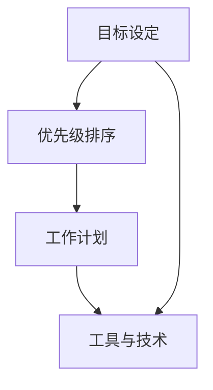

                 

# 一家公司的时间管理与自律

在当今快速发展的商业环境中，时间管理对于任何公司，尤其是对于只有一位员工的公司（通常称为“一人公司”）来说，至关重要。本篇文章将探讨一人公司在时间管理和自律方面的挑战，以及如何通过科学的方法来优化个人工作流程和提升工作效率。

## 关键词
- 时间管理
- 自律
- 一人公司
- 工作效率
- 个人发展

## 摘要
本文首先介绍了时间管理和自律的重要性，特别针对一人公司的特点，分析了他们在时间管理方面所面临的挑战。接着，文章探讨了如何通过设置明确的目标、合理安排工作时间、使用有效的工具和技术来提高个人工作效率。最后，文章总结了未来发展的趋势和面临的挑战，并提供了一些常见的解决方案和建议。

### 1. 背景介绍

一人公司，顾名思义，就是由一个独立个体运营的公司。这种模式在近年来逐渐流行，尤其是在数字化时代，许多自由职业者、企业家和创意人士选择以一人公司的形式开展业务。这种模式的好处包括灵活性、成本效益和决策效率。然而，随之而来的挑战是时间管理和自律的困难。

对于一人公司来说，时间管理尤为重要。因为公司的所有事务都由一个人承担，所以合理分配时间、确保每项任务都能按时完成，是保持业务运转的关键。同时，自律也是至关重要的。一人公司缺乏团队协作和外部监督，因此需要依靠个人的自律来维持工作节奏和效率。

### 2. 核心概念与联系

为了有效地管理时间并保持自律，一人公司需要理解并实践以下几个核心概念：

#### 2.1 目标设定
设定明确的目标是时间管理的基础。目标应该具体、可衡量、可实现、相关性强且有时间限制（SMART原则）。例如，一个具体的目标可以是“每天上午9点到下午5点专注于客户开发，下午5点到晚上9点进行财务管理”。

#### 2.2 优先级排序
了解哪些任务最重要，并按照优先级进行排序，可以确保时间的有效利用。优先级排序有助于识别哪些任务需要立即处理，哪些可以推迟。

#### 2.3 工作计划
制定详细的工作计划可以帮助你按照预定的步骤进行工作。这不仅可以避免浪费时间，还可以提高工作的连续性和效率。

#### 2.4 工具与技术
使用合适的工具和技术可以大大提高工作效率。例如，时间跟踪工具可以帮助你了解自己的时间使用情况，项目管理工具可以帮助你管理任务和项目。

下面是一个使用Mermaid绘制的流程图，展示了这些核心概念之间的关系：



### 3. 核心算法原理 & 具体操作步骤

为了有效地管理时间和保持自律，一人公司可以采用以下几个核心算法原理和操作步骤：

#### 3.1. 目标设定

1. **确定长期目标**：首先，确定你希望在未来一段时间内实现的目标。这些目标应该是具体和可衡量的。
2. **分解目标**：将长期目标分解为短期目标，以便可以逐步实现。例如，如果你的长期目标是“在一年内增加收入100万元”，那么你可以设定短期目标，如“每月增加收入5万元”。
3. **设定截止日期**：为每个目标设定一个明确的截止日期，以确保有明确的期限来推动自己。

#### 3.2. 优先级排序

1. **紧急与重要矩阵**：使用紧急与重要矩阵（Eisenhower Matrix）来区分任务的优先级。紧急且重要的任务应立即处理；重要但不紧急的任务应安排在日程中；紧急但不重要的任务可以委托或推迟；不紧急且不重要的任务可以忽略。
2. **优先级排序**：将任务按照优先级排序，并确保最重要的任务首先完成。

#### 3.3. 工作计划

1. **每日计划**：每天开始前，列出当天的任务清单，并按照优先级排序。
2. **时间块**：将工作时间划分为不同的时间块，并为每个时间块分配特定的任务。
3. **预留休息时间**：确保在计划中预留休息时间，以避免疲劳和工作效率下降。

#### 3.4. 工具与技术

1. **时间跟踪工具**：使用时间跟踪工具，如Toggl或RescueTime，来记录你的时间使用情况，并帮助你识别时间浪费的领域。
2. **项目管理工具**：使用项目管理工具，如Trello或Asana，来跟踪任务和项目的进展情况。
3. **待办事项列表**：使用待办事项列表，如Wunderlist或Notion，来记录和跟踪任务。

### 4. 数学模型和公式 & 详细讲解 & 举例说明

在时间管理和自律中，以下数学模型和公式可以帮助一人公司更科学地安排工作和时间：

#### 4.1. 优先级公式

使用优先级公式（如Eisenhower Matrix）来计算每个任务的优先级：

\[ \text{优先级} = (\text{紧急性} \times \text{重要性}) \]

- 紧急性：任务必须在多长时间内完成，越短紧急性越高。
- 重要性：任务对公司或个人目标的贡献程度，贡献越大重要性越高。

#### 4.2. 工作负荷计算

使用工作负荷计算公式来评估你的工作负担：

\[ \text{工作负荷} = \frac{\text{任务数量}}{\text{可用时间}} \]

- 任务数量：你需要完成的任务总数。
- 可用时间：你可以用于工作的时间。

如果工作负荷大于1，则意味着你的时间安排过于紧张，需要重新规划。

#### 4.3. 举例说明

假设你是一名自由职业者，每月需要完成以下任务：

- 客户开发：每天2小时，每月20天
- 项目开发：每天4小时，每月20天
- 财务管理：每周4小时，每月4次

根据上述数据，我们可以计算出每月的工作时间：

\[ \text{每月工作时间} = (2 \text{小时/天} \times 20 \text{天}) + (4 \text{小时/天} \times 20 \text{天}) + (4 \text{小时/周} \times 4 \text{周}) = 120 \text{小时} \]

根据上述数据，我们可以设定以下目标：

- 每天专注于客户开发2小时，项目开发4小时，财务管理预留休息时间。

根据优先级公式，我们可以计算出每个任务的优先级：

\[ \text{客户开发优先级} = (2 \times 4) = 8 \]
\[ \text{项目开发优先级} = (4 \times 4) = 16 \]
\[ \text{财务管理优先级} = (0 \times 0) = 0 \]

### 5. 项目实战：代码实际案例和详细解释说明

为了更好地展示如何将时间管理和自律应用于实践，我们提供了一个简单的Python代码案例，用于管理每日任务和跟踪时间。

#### 5.1. 开发环境搭建

首先，确保你已经安装了Python和文本编辑器（如VSCode或PyCharm）。接下来，安装必要的库，例如`datetime`和`os`。

```bash
pip install datetime
```

#### 5.2. 源代码详细实现和代码解读

以下是一个简单的Python脚本，用于管理每日任务和跟踪时间：

```python
import datetime
import os

# 任务列表
tasks = {
    "客户开发": 2,
    "项目开发": 4,
    "财务管理": 0
}

# 当天日期
current_date = datetime.datetime.now().date()

# 每日任务计划
daily_plan = {
    "客户开发": 0,
    "项目开发": 0,
    "财务管理": 0
}

# 检查任务完成情况
def check_task_completion(task, time_spent):
    daily_plan[task] += time_spent
    print(f"{task}任务已完成：{time_spent}小时。")

# 记录时间
def record_time(task, time_spent):
    with open("time_log.txt", "a") as file:
        file.write(f"{current_date} - {task}: {time_spent}小时\n")
    check_task_completion(task, time_spent)

# 主程序
def main():
    print(f"今日日期：{current_date}")
    print("请按照任务优先级进行工作。")

    while True:
        task = input("请输入任务名称（输入'退出'结束）：")
        if task == "退出":
            break

        time_spent = float(input("请输入完成任务所需时间（小时）："))
        record_time(task, time_spent)

    print("所有任务已完成。")
    print("今日时间记录如下：")
    with open("time_log.txt", "r") as file:
        print(file.read())

if __name__ == "__main__":
    main()
```

**代码解读：**

- **任务列表**：定义了每日需要完成的任务及其所需时间。
- **每日任务计划**：跟踪每日任务的完成情况。
- **检查任务完成情况**：更新每日任务计划并打印完成情况。
- **记录时间**：将任务和时间记录到文件中。
- **主程序**：提示用户输入任务和时间，并调用记录时间函数。

#### 5.3. 代码解读与分析

该代码提供了一个简单的框架，用于记录每日任务和时间。以下是代码的主要组成部分：

- **任务列表**：使用字典定义任务和所需时间，这有助于轻松更新和管理任务。
- **每日任务计划**：使用字典跟踪任务的完成情况，这有助于确保所有任务都得到完成。
- **检查任务完成情况**：更新每日任务计划并打印完成情况，这有助于用户了解任务的完成进度。
- **记录时间**：将任务和时间记录到文件中，这有助于长期跟踪和分析时间使用情况。
- **主程序**：循环提示用户输入任务和时间，并调用记录时间函数，这确保了用户可以持续记录任务和时间。

### 6. 实际应用场景

在实际应用中，一人公司可以通过以下几个场景来提升时间管理和自律：

#### 6.1. 个人项目管理

使用任务管理工具，如Trello或Asana，来跟踪个人项目和任务。这些工具可以帮助你清晰地了解项目的进展情况，确保每个任务都按时完成。

#### 6.2. 工作计划制定

每天制定详细的工作计划，包括具体的任务和时间表。这有助于你更好地管理时间，确保每天都能专注于最重要的任务。

#### 6.3. 时间跟踪

使用时间跟踪工具，如Toggl或RescueTime，来记录你的时间使用情况。这有助于你了解时间的分配情况，识别时间浪费的领域。

#### 6.4. 自律训练

通过自律训练，如使用番茄工作法，来提高专注力和工作效率。番茄工作法是一种时间管理技巧，通过将工作时间划分为25分钟的工作周期和5分钟的休息周期，来提高工作效率。

### 7. 工具和资源推荐

为了有效地管理时间和保持自律，以下是几个推荐的工具和资源：

#### 7.1. 学习资源推荐

- 书籍：《时间管理：如何更高效地工作和生活》
- 论文：《自律：如何培养和保持自律的习惯》
- 博客：《个人项目管理：如何更有效地管理任务》
- 网站：Trello（任务管理），Toggl（时间跟踪）

#### 7.2. 开发工具框架推荐

- 项目管理工具：Trello、Asana
- 时间跟踪工具：Toggl、RescueTime
- 待办事项列表：Wunderlist、Notion

#### 7.3. 相关论文著作推荐

- 《时间管理：理论与实践》
- 《自律：如何培养自律的习惯》
- 《个人项目管理：方法与实践》

### 8. 总结：未来发展趋势与挑战

在未来，一人公司的数量将继续增加，这将对时间管理和自律提出更高的要求。以下是一些发展趋势和挑战：

#### 8.1. 发展趋势

- 数字化工具的普及：更多的数字化工具将被开发出来，以帮助一人公司更高效地管理时间和任务。
- 自律培训的重视：随着一人公司的发展，自律培训将成为一项重要任务，以帮助员工更好地适应这种工作模式。

#### 8.2. 挑战

- 时间管理技能的提升：一人公司需要不断提高时间管理技能，以确保高效地完成工作任务。
- 自律习惯的培养：培养自律习惯是一项长期且具有挑战性的任务，需要持续的努力和实践。

### 9. 附录：常见问题与解答

#### 9.1. 为什么要进行时间管理？

时间管理可以帮助你更高效地完成工作任务，减少时间浪费，提高个人和公司的整体效率。

#### 9.2. 如何保持自律？

通过设定明确的目标、制定详细的计划、使用有效的工具和技术，以及持续的自律训练，可以帮助你保持自律。

#### 9.3. 一个人如何管理多个项目？

通过使用任务管理工具，如Trello或Asana，可以有效地管理多个项目。确保每个项目都有明确的优先级和截止日期，并合理安排时间。

### 10. 扩展阅读 & 参考资料

- 《时间管理：如何更高效地工作和生活》
- 《自律：如何培养和保持自律的习惯》
- 《个人项目管理：如何更有效地管理任务》
- Trello（任务管理）：https://trello.com/
- Toggl（时间跟踪）：https://toggl.com/
- RescueTime（时间跟踪）：https://www.rescuetime.com/

### 作者

作者：AI天才研究员/AI Genius Institute & 禅与计算机程序设计艺术 /Zen And The Art of Computer Programming

本文由AI天才研究员撰写，旨在帮助一人公司在时间管理和自律方面取得更好的成果。如果您有任何问题或建议，欢迎在评论区留言。感谢您的阅读！<|im_sep|>

