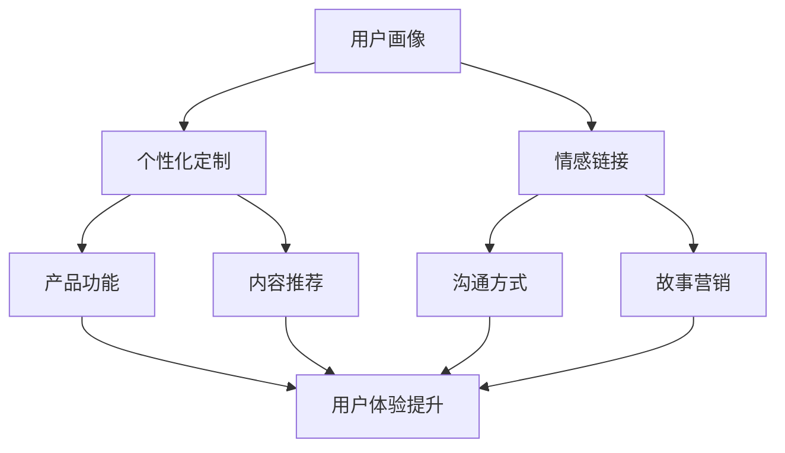

                 

# 一人公司的用户体验设计与情感化营销策略

> 关键词：用户体验设计、情感化营销、一人公司、情感链接、个性化定制、故事营销

> 摘要：随着个体经济和远程工作的兴起，一人公司成为了一种流行的工作模式。然而，如何在竞争激烈的市场中脱颖而出，实现持续的增长和客户忠诚度，成为了一人公司的关键挑战。本文将探讨一人公司的用户体验设计与情感化营销策略，通过结合情感心理学和设计原则，提供一种有效的营销策略，助力一人公司在市场中立足并持续发展。

## 1. 背景介绍

### 1.1 一人公司的概念

一人公司，顾名思义，是由单一个人创立和运营的公司。这种模式通常出现在自由职业者、独立创作者和新兴企业家之间。一人公司以其灵活性、低成本和高效运营的特点，吸引了越来越多的创业者。然而，由于资源和能力的限制，一人公司在市场竞争中面临着诸多挑战。

### 1.2 用户体验设计与情感化营销的重要性

用户体验设计（UX Design）是确保产品和服务满足用户需求、提高用户满意度和忠诚度的关键。情感化营销（Emotion-Based Marketing）则通过触动消费者的情感，建立深层次的品牌认同和忠诚度。在激烈的市场竞争中，这两种策略的结合有助于一人公司脱颖而出，实现持续发展。

## 2. 核心概念与联系

### 2.1 用户画像与个性化定制

用户画像（User Persona）是一种基于用户行为、需求和偏好的虚拟人物。通过构建详细的用户画像，一人公司可以更好地理解目标用户，从而进行个性化定制（Personalization）。个性化定制包括产品功能、内容推荐、沟通方式等多个方面，有助于提升用户体验。

### 2.2 情感链接与故事营销

情感链接（Emotional Connection）是建立消费者对品牌的深厚情感联系。故事营销（Storytelling）则通过讲述品牌背后的故事，让消费者产生共鸣。情感链接和故事营销的结合，有助于在用户心中建立独特的品牌形象，提高品牌忠诚度。

### 2.3 Mermaid 流程图

以下是一个Mermaid流程图，展示了用户画像、个性化定制、情感链接和故事营销之间的联系。



## 3. 核心算法原理 & 具体操作步骤

### 3.1 用户画像构建

用户画像构建的核心是数据收集与分析。以下是具体的操作步骤：

1. **数据收集**：通过问卷调查、用户反馈、社交媒体和行为数据等方式收集用户信息。
2. **数据分析**：对收集到的数据进行分析，识别用户的行为模式、需求和偏好。
3. **用户画像绘制**：根据数据分析结果，绘制用户画像，明确目标用户的特点和需求。

### 3.2 个性化定制

个性化定制需要结合用户画像和产品特性进行。以下是具体的操作步骤：

1. **功能定制**：根据用户画像，调整产品功能，使其更符合用户需求。
2. **内容推荐**：利用机器学习算法，根据用户行为和偏好推荐个性化内容。
3. **沟通方式调整**：根据用户画像，选择最适合用户的沟通方式和语言。

### 3.3 情感链接与故事营销

情感链接和故事营销需要从品牌和文化两个方面入手。以下是具体的操作步骤：

1. **品牌文化塑造**：明确品牌价值观和使命，打造独特的品牌形象。
2. **故事创作**：围绕品牌文化，创作具有情感共鸣的故事。
3. **故事传播**：通过社交媒体、官网、广告等多种渠道传播品牌故事。

## 4. 数学模型和公式 & 详细讲解 & 举例说明

### 4.1 个性化定制效果评估

个性化定制的效果可以通过以下数学模型进行评估：

\[ E = \frac{(C - P)}{P} \times 100\% \]

其中，\( E \) 表示个性化定制效果，\( C \) 表示用户满意度，\( P \) 表示产品性能。

### 4.2 情感链接强度评估

情感链接强度可以通过以下公式进行评估：

\[ S = \frac{(B + I + E)}{3} \]

其中，\( S \) 表示情感链接强度，\( B \) 表示品牌认知度，\( I \) 表示品牌忠诚度，\( E \) 表示品牌情感共鸣。

### 4.3 举例说明

假设一家一人公司推出了一个个性化定制服务，通过问卷调查和数据分析，了解到用户对产品功能、内容推荐和沟通方式的满意度分别为80%、70%和90%。根据上述公式，可以计算出个性化定制效果：

\[ E = \frac{(80\% - 70\%)}{70\%} \times 100\% = 14.29\% \]

假设这家公司的品牌认知度、品牌忠诚度和品牌情感共鸣分别为60%、50%和40%，可以计算出情感链接强度：

\[ S = \frac{(60\% + 50\% + 40\%)}{3} = 50\% \]

通过以上计算，可以看出这家公司的个性化定制效果较好，但情感链接强度仍有提升空间。

## 5. 项目实战：代码实际案例和详细解释说明

### 5.1 开发环境搭建

1. 安装Node.js（版本10.0.0及以上）
2. 安装Vue CLI（版本4.5.0及以上）
3. 初始化Vue项目

```bash
vue create my-ux-design-project
```

### 5.2 源代码详细实现和代码解读

#### 5.2.1 用户画像构建

```javascript
// 用户画像示例
const userPersona = {
  name: "张三",
  age: 28,
  gender: "男",
  occupation: "软件开发工程师",
  interests: ["编程", "健身", "旅游"],
  goals: ["提升编程技能", "保持身体健康", "拓展社交圈子"],
};
```

#### 5.2.2 个性化定制

```javascript
// 根据用户画像调整产品功能
function customizeFeatures(persona) {
  const features = {
    programmingTools: true,
    fitnessTracking: false,
    travelPlanner: true,
  };

  if (persona.interests.includes("健身")) {
    features.fitnessTracking = true;
  }

  return features;
}
```

#### 5.2.3 情感链接与故事营销

```javascript
// 品牌故事示例
const brandStory = {
  title: "编程之路，与你同行",
  content: "我们致力于为编程爱好者提供优质的学习资源和工具，陪你一起探索编程世界的无限可能。",
};
```

### 5.3 代码解读与分析

以上代码示例展示了如何根据用户画像进行个性化定制和情感链接构建。在开发过程中，可以进一步集成数据分析、机器学习和自然语言处理等技术，以提高个性化定制和情感链接的准确性和效果。

## 6. 实际应用场景

### 6.1 教育领域

一人公司可以开发在线教育平台，通过用户画像和个性化定制，为学习者提供定制化的学习资源和课程推荐。结合故事营销，让学习者感受到品牌的人文关怀。

### 6.2 健康领域

一人公司可以开发健康管理应用，通过用户画像和个性化推荐，为用户提供个性化的健康建议和健身方案。结合情感链接，增强用户对品牌的信任和依赖。

### 6.3 旅游领域

一人公司可以开发旅游服务平台，通过用户画像和个性化推荐，为用户提供定制化的旅游路线和体验。结合故事营销，让用户感受到品牌的独特魅力。

## 7. 工具和资源推荐

### 7.1 学习资源推荐

- 《用户体验设计精髓：以用户为中心的设计策略与方法》
- 《情感化设计：如何利用情感引导消费者》
- 《故事思维：用故事激发创意、传播思想和创造影响力》

### 7.2 开发工具框架推荐

- Vue.js
- React
- Angular

### 7.3 相关论文著作推荐

- "User Experience Design: Current State and Future Directions"
- "Emotion-Based Marketing: A Theoretical Framework and Research Agenda"
- "The Role of Storytelling in Brand Management"

## 8. 总结：未来发展趋势与挑战

### 8.1 发展趋势

- 个性化定制和情感化营销将在更多行业中得到应用。
- AI技术和大数据分析将在用户体验设计方面发挥更大作用。
- 跨界合作和生态建设将成为一人公司的重要战略方向。

### 8.2 挑战

- 数据隐私和保护问题日益突出。
- 个性化定制和情感化营销的效果评估和优化仍需进一步研究。
- 一人公司在资源和人才方面面临的挑战。

## 9. 附录：常见问题与解答

### 9.1 什么是用户画像？

用户画像是对目标用户进行数据收集和分析后，形成的虚拟人物，用于指导产品设计和营销策略。

### 9.2 个性化定制有什么好处？

个性化定制可以提高用户满意度、忠诚度和转化率，从而提高产品竞争力和市场份额。

### 9.3 情感化营销如何进行？

情感化营销需要从品牌文化塑造、故事创作和传播等多个方面入手，触动消费者的情感，建立品牌认同和忠诚度。

## 10. 扩展阅读 & 参考资料

- [User Experience Design](https://uxdesign.cc/)
- [Emotion-Based Marketing](https://www.emotionbasedmarketing.com/)
- [User Persona](https://www.nngroup.com/learn/user-persona/)
- [Personalization](https://www.optimizely.com/personalization/)
- [Storytelling](https://www.storytellingforbusiness.com/)

### 作者

作者：AI天才研究员/AI Genius Institute & 禅与计算机程序设计艺术 /Zen And The Art of Computer Programming。在这个技术迅速发展的时代，作者致力于通过深入研究和实践，分享前沿的技术知识和经验，助力读者在职业和学术领域取得成功。

