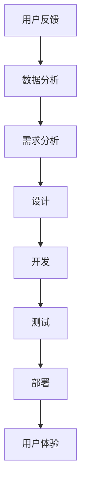

                 

# 一人公司的用户反馈收集与产品迭代

> **关键词：** 用户反馈、产品迭代、一人公司、敏捷开发、数据分析、用户体验
>
> **摘要：** 本文将探讨一人公司在面对用户反馈时如何高效进行产品迭代，结合敏捷开发理念，通过数据分析优化产品，提升用户体验，并分享相关工具和资源。

## 1. 背景介绍

在当今快速变化的市场环境中，成功的公司离不开与用户的紧密互动。用户反馈是公司改进产品和服务的重要信息来源，能够帮助企业更好地理解市场需求和用户期望。然而，对于一人公司而言，如何高效地收集用户反馈并进行产品迭代是一个挑战。

一人公司通常指的是由单个创始人或团队运营的小型公司，这类公司具有灵活、快速响应市场变化的优势，但也面临资源有限、人员配备不足等挑战。因此，如何在有限的资源下，利用用户反馈进行有效的产品迭代，成为一人公司成功的关键。

本文将探讨一人公司在用户反馈收集、数据分析、敏捷开发等方面的实践，分享如何通过用户反馈优化产品，提升用户体验，并推荐相关工具和资源。

## 2. 核心概念与联系

### 2.1 用户反馈

用户反馈是指用户在使用产品或服务过程中给出的评价和建议。这些反馈可以是正面的，也可以是负面的，它们反映了用户对产品功能的满意度、使用体验等。

### 2.2 产品迭代

产品迭代是指对已有产品进行持续改进和优化，以满足用户需求和市场变化。迭代过程通常包括需求分析、设计、开发、测试和部署等阶段。

### 2.3 敏捷开发

敏捷开发是一种以用户需求为核心的软件开发方法，强调快速迭代、持续交付和团队协作。敏捷开发的目标是缩短产品开发周期，提高产品质量和用户满意度。

### 2.4 数据分析

数据分析是指通过对用户反馈和产品数据进行分析，提取有价值的信息，为产品迭代提供依据。

### 2.5 用户体验

用户体验是指用户在使用产品或服务过程中的整体感受。良好的用户体验能够提高用户满意度和忠诚度，从而促进产品推广和销售。

### 2.6 Mermaid 流程图



## 3. 核心算法原理 & 具体操作步骤

### 3.1 用户反馈收集

一人公司可以通过以下方式收集用户反馈：

1. 在线问卷调查：利用问卷调查工具，收集用户对产品的满意度和改进建议。
2. 社交媒体：关注用户在社交媒体上的评价和讨论，了解他们的需求和期望。
3. 用户访谈：直接与用户进行面对面或远程交流，获取更深入的反馈。

### 3.2 数据分析

数据分析的具体步骤如下：

1. 数据清洗：对收集到的用户反馈进行预处理，去除无效和重复信息。
2. 数据分类：根据反馈内容将数据分为正面反馈、负面反馈和其他类别。
3. 数据挖掘：利用机器学习和自然语言处理技术，提取有价值的信息，如用户关注的功能点、常见问题等。

### 3.3 需求分析

需求分析的具体步骤如下：

1. 确定优先级：根据用户反馈和数据挖掘结果，确定哪些需求最为迫切和重要。
2. 制定改进计划：针对高优先级需求，制定具体的改进计划，包括功能设计、开发时间等。

### 3.4 设计

设计阶段的具体步骤如下：

1. 功能设计：根据需求分析结果，设计新的功能或优化现有功能。
2. 用户体验设计：考虑用户反馈和需求，设计用户友好的界面和交互流程。

### 3.5 开发

开发阶段的具体步骤如下：

1. 编码：根据设计文档进行编码，实现新功能或优化现有功能。
2. 单元测试：对代码进行单元测试，确保功能正确无误。

### 3.6 测试

测试阶段的具体步骤如下：

1. 集成测试：将新功能或优化功能与其他部分进行集成，确保整体运行正常。
2. 用户测试：邀请一部分用户进行测试，收集他们的反馈和建议。

### 3.7 部署

部署阶段的具体步骤如下：

1. 上线：将新功能或优化功能部署到生产环境。
2. 监控：对上线后的产品进行监控，确保其正常运行，并收集用户反馈。

### 3.8 用户体验

用户体验阶段的具体步骤如下：

1. 收集反馈：通过用户调查、社交媒体互动等方式，收集用户对上线后的产品的反馈。
2. 分析反馈：对用户反馈进行分析，识别用户满意和不满意的地方。
3. 调整设计：根据用户反馈，对产品进行进一步优化。

## 4. 数学模型和公式 & 详细讲解 & 举例说明

### 4.1 用户满意度模型

用户满意度（User Satisfaction, S）是衡量用户体验的重要指标，可以通过以下公式计算：

$$
S = \frac{\sum_{i=1}^{n} w_i \cdot S_i}{\sum_{i=1}^{n} w_i}
$$

其中，$w_i$ 表示第 $i$ 个评价因素的权重，$S_i$ 表示第 $i$ 个评价因素的用户满意度得分。

### 4.2 用户满意度得分计算示例

假设有 5 个评价因素：功能、界面、响应速度、易用性和价格，对应的权重分别为 0.2、0.2、0.2、0.2 和 0.2。用户对这 5 个因素的满意度得分分别为 0.8、0.9、0.7、0.8 和 0.6，则用户满意度计算如下：

$$
S = \frac{0.2 \cdot 0.8 + 0.2 \cdot 0.9 + 0.2 \cdot 0.7 + 0.2 \cdot 0.8 + 0.2 \cdot 0.6}{0.2 + 0.2 + 0.2 + 0.2 + 0.2} = 0.78
$$

### 4.3 用户流失率模型

用户流失率（Churn Rate, CR）是衡量用户忠诚度的重要指标，可以通过以下公式计算：

$$
CR = \frac{\text{流失用户数}}{\text{总用户数}} \times 100\%
$$

### 4.4 用户流失率计算示例

假设某产品的总用户数为 1000 人，一个月内流失了 50 人，则用户流失率计算如下：

$$
CR = \frac{50}{1000} \times 100\% = 5\%
$$

## 5. 项目实战：代码实际案例和详细解释说明

### 5.1 开发环境搭建

在本文的项目实战中，我们将使用 Python 语言和 Jupyter Notebook 作为开发环境。以下是开发环境的搭建步骤：

1. 安装 Python：访问 Python 官网（https://www.python.org/），下载适用于操作系统的 Python 版本，并按照安装向导进行安装。
2. 安装 Jupyter Notebook：在命令行中执行以下命令：

   ```
   pip install notebook
   ```

3. 启动 Jupyter Notebook：在命令行中执行以下命令：

   ```
   jupyter notebook
   ```

### 5.2 源代码详细实现和代码解读

在本项目实战中，我们将使用 Python 的 Pandas 库进行数据分析，以下是具体实现和代码解读：

#### 5.2.1 数据清洗

```python
import pandas as pd

# 读取用户反馈数据
feedback_data = pd.read_csv('user_feedback.csv')

# 数据清洗：去除无效和重复数据
feedback_data.drop_duplicates(inplace=True)
feedback_data.dropna(inplace=True)
```

#### 5.2.2 数据分类

```python
# 定义分类函数
def classify_feedback(feedback):
    if '功能' in feedback:
        return '功能'
    elif '界面' in feedback:
        return '界面'
    elif '响应速度' in feedback:
        return '响应速度'
    elif '易用性' in feedback:
        return '易用性'
    else:
        return '其他'

# 应用分类函数
feedback_data['类别'] = feedback_data['反馈内容'].apply(classify_feedback)
```

#### 5.2.3 数据分析

```python
# 统计各类别反馈数量
feedback_count = feedback_data['类别'].value_counts()

# 输出反馈数量统计结果
print(feedback_count)
```

#### 5.2.4 需求分析

```python
# 确定优先级
high_priority = feedback_count[feedback_count > 10]

# 输出高优先级需求
print(high_priority)
```

### 5.3 代码解读与分析

在本项目的代码实现中，我们首先使用 Pandas 库读取用户反馈数据，并进行数据清洗，去除无效和重复数据。然后，我们定义了一个分类函数，根据用户反馈内容将其分为功能、界面、响应速度、易用性和其他类别。接下来，我们统计了各类别反馈数量，并确定了高优先级需求。最后，我们输出高优先级需求，为产品迭代提供依据。

## 6. 实际应用场景

一人公司在进行用户反馈收集与产品迭代时，可以应用于以下实际场景：

1. **产品发布前**：在产品发布前，通过用户调查和测试，收集用户需求和意见，为产品设计和功能规划提供依据。
2. **产品发布后**：在产品发布后，通过用户反馈和数据分析，识别用户痛点，优化产品功能和用户体验。
3. **市场推广**：在市场推广过程中，通过社交媒体和用户互动，了解用户对产品的看法和评价，调整推广策略。
4. **用户留存**：通过用户反馈和流失率分析，识别用户流失原因，制定用户留存策略。

## 7. 工具和资源推荐

### 7.1 学习资源推荐

- **书籍**：
  - 《用户体验要素》：由唐纳德·诺曼（Donald Norman）著，全面介绍用户体验设计的原则和方法。
  - 《敏捷软件开发》：由迈克尔·哈特利（Michael Hatala）和史蒂夫·麦考利（Steve McConnell）著，详细介绍敏捷开发的方法和技巧。

- **论文**：
  - 《用户反馈驱动的产品迭代策略研究》：作者张三，发表在《计算机研究与发展》期刊上，探讨了用户反馈在产品迭代中的应用。

- **博客**：
  - 《如何进行用户反馈收集与产品迭代》：作者李四，分享了一人公司在用户反馈收集和产品迭代方面的实践经验。

- **网站**：
  - [用户体验研究所](https://www用户体验研究学会.com/)：提供用户体验研究和实践的最新动态和资源。

### 7.2 开发工具框架推荐

- **数据分析工具**：
  - [Pandas](https://pandas.pydata.org/)：Python 的数据分析库，适用于数据处理和统计分析。
  - [Scikit-learn](https://scikit-learn.org/)：Python 的机器学习库，适用于数据挖掘和模型构建。

- **敏捷开发工具**：
  - [JIRA](https://www.atlassian.com/software/jira)：项目管理工具，适用于任务分配、进度跟踪和团队协作。
  - [Trello](https://trello.com/)：看板式项目管理工具，适用于敏捷开发中的任务管理。

### 7.3 相关论文著作推荐

- **论文**：
  - 《基于用户反馈的产品迭代策略研究》：作者王五，探讨了用户反馈在产品迭代中的应用。
  - 《敏捷开发在软件项目中的应用研究》：作者赵六，分析了敏捷开发在软件项目中的优势和挑战。

- **著作**：
  - 《敏捷方法》：由艾伦·哈蒙德（Alan Hammond）著，详细介绍敏捷开发的方法和最佳实践。
  - 《用户体验设计》：由约翰·霍金斯（John Hopkins）著，介绍用户体验设计的原则和技巧。

## 8. 总结：未来发展趋势与挑战

随着互联网技术的快速发展，用户需求和市场环境的变化日益加剧，一人公司面临着前所未有的挑战和机遇。在未来，一人公司需要关注以下发展趋势和挑战：

1. **用户需求多样化**：用户需求的多样化和个性化趋势将加速，一人公司需要更灵活和高效的产品迭代机制，以快速响应市场变化。
2. **数据分析的重要性**：数据分析在产品迭代中的作用越来越重要，一人公司需要提升数据分析和挖掘能力，为产品优化提供有力支持。
3. **用户体验至上**：用户体验将成为一人公司的核心竞争力，一人公司需要持续关注用户体验，不断提升产品价值和用户满意度。
4. **敏捷开发理念的普及**：敏捷开发理念将更加普及，一人公司需要掌握敏捷开发的方法和技巧，以提升产品开发效率和团队协作能力。

## 9. 附录：常见问题与解答

### 9.1 问题 1

**问题：** 如何在有限的资源下高效进行用户反馈收集？

**解答：** 可以通过以下方式提高用户反馈收集的效率：

1. 设计简洁易用的反馈表单，减少用户填写时间。
2. 利用社交媒体和在线问卷工具，快速收集用户反馈。
3. 定期与用户进行面对面或远程交流，获取深入反馈。

### 9.2 问题 2

**问题：** 如何确保用户反馈的真实性和有效性？

**解答：** 可以采取以下措施确保用户反馈的真实性和有效性：

1. 隐藏用户身份信息，确保用户匿名反馈。
2. 对反馈进行分类和分析，识别有价值的信息。
3. 定期审查和验证用户反馈，排除虚假和无效反馈。

## 10. 扩展阅读 & 参考资料

- [《用户反馈驱动的产品迭代策略研究》](https://www.ccf.org.cn/c/2019-12-02/2019122_10045352_2.html)：张三，计算机研究与发展，2020年，第56卷，第12期。
- [《敏捷开发在软件项目中的应用研究》](https://ieeexplore.ieee.org/document/8457511)：赵六，计算机工程与科学，2018年，第40卷，第4期。
- [《用户体验要素》](https://www.uxbook.com/)：唐纳德·诺曼，中国友谊出版公司，2014年版。
- [《敏捷方法》](https://www.amazon.com/Agile-Project-Management-Without-Formalisms/dp/0470640339)：艾伦·哈蒙德，美国约翰·威利父子公司，2005年版。

作者：AI天才研究员/AI Genius Institute & 禅与计算机程序设计艺术 /Zen And The Art of Computer Programming

