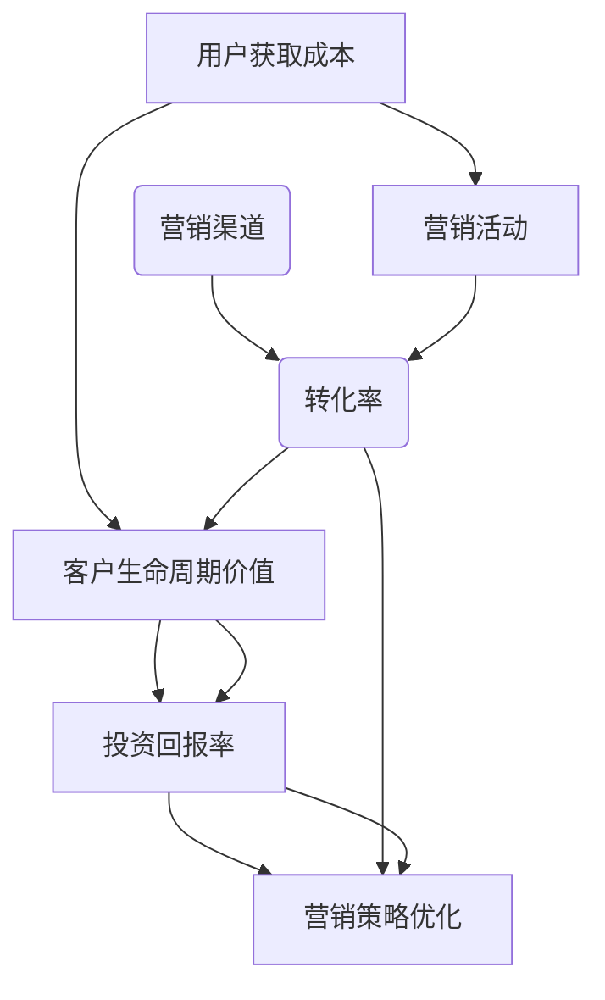
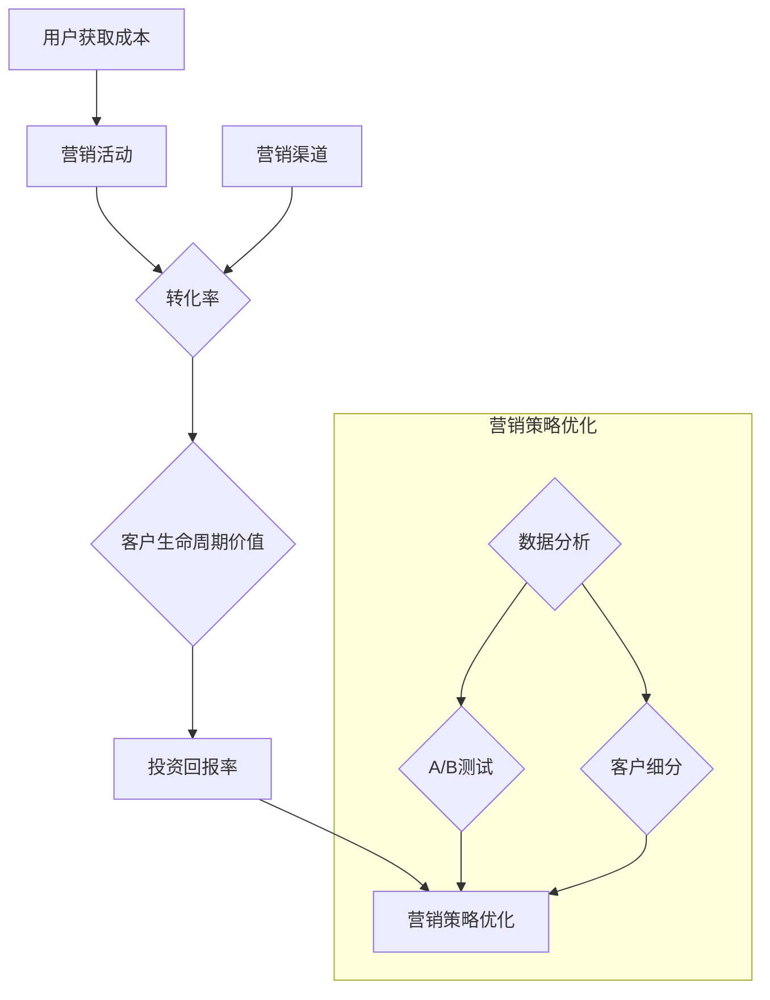

                 

# 一人公司的用户获取成本控制与优化策略

> **关键词**：用户获取成本（CAC）、营销策略、数据分析、自动化工具、迭代优化

> **摘要**：本文将深入探讨一人公司如何通过优化用户获取成本（CAC）来提升业务效益。我们将分析一人公司在市场营销中的挑战，介绍核心概念，探讨优化策略，并分享实际案例与未来趋势。

## 1. 背景介绍

一人公司，顾名思义，是一家由一位创业者独立运营的企业。这类企业通常具有灵活性高、决策迅速的优势，但也面临着资源有限、市场营销经验不足等挑战。特别是在用户获取成本（Customer Acquisition Cost，CAC）方面，一人公司需要更加精细地管理和优化，以确保其营销预算能够带来最大的投资回报率（ROI）。

用户获取成本是指为了获取一个新客户而付出的平均成本。对于一人公司来说，控制CAC至关重要。因为资源有限，如果CAC过高，公司将难以维持利润，甚至可能面临生存危机。因此，如何通过有效的营销策略和数据分析，降低CAC，成为了这些企业需要解决的核心问题。

本文将围绕以下问题展开讨论：

- 一人公司在用户获取成本控制方面面临哪些挑战？
- 如何通过数据分析来优化营销策略？
- 哪些自动化工具可以帮助降低CAC？
- 实际案例中，如何成功降低用户获取成本？
- 未来，一人公司应该如何应对不断变化的市场环境？

## 2. 核心概念与联系

为了深入探讨一人公司的用户获取成本控制，我们需要了解一些核心概念及其相互关系。以下是关键概念和它们之间的关系，以及对应的Mermaid流程图：

### 2.1. 核心概念

1. **用户获取成本（CAC）**：获取一个新客户所需的平均成本，包括广告、营销活动、销售团队等费用。
2. **客户生命周期价值（CLV）**：一个客户在整个生命周期中为公司带来的总收益。
3. **投资回报率（ROI）**：营销投资所带来的利润与成本之比。
4. **转化率**：潜在客户转化为实际客户的比率。
5. **营销渠道**：用于吸引潜在客户的途径，如社交媒体、电子邮件营销、内容营销等。

### 2.2. 关系与流程图



通过上述流程图，我们可以看到CAC、CLV、ROI、转化率和营销渠道之间的相互关系。降低CAC，提高转化率和CLV，将直接提升ROI，从而优化整体营销策略。

### 2.3. 关键概念解释

- **用户获取成本（CAC）**：CAC是衡量营销效率的重要指标。一人公司需要通过精细化管理，确保每一笔营销支出都能带来预期的回报。
- **客户生命周期价值（CLV）**：CLV反映了客户为公司带来的总收益。通过提高CLV，一人公司可以在有限的CAC下实现更高的利润。
- **投资回报率（ROI）**：ROI是衡量营销策略有效性的关键指标。一人公司需要不断优化策略，提高ROI。
- **转化率**：转化率是评估营销渠道和活动效果的重要指标。提高转化率可以有效降低CAC。
- **营销渠道**：选择合适的营销渠道可以帮助一人公司更有效地吸引潜在客户，从而降低CAC。

### 2.4. Mermaid流程图



通过以上流程图，我们可以更清晰地看到一人公司在用户获取成本控制方面的关键环节，以及如何通过数据分析和测试来不断优化营销策略。

## 3. 核心算法原理 & 具体操作步骤

### 3.1. 数据分析基础

数据分析是优化用户获取成本的关键。以下是一些基本的分析步骤：

1. **数据收集**：收集与用户获取相关的数据，包括营销渠道、转化率、客户来源、客户行为等。
2. **数据清洗**：确保数据的准确性和一致性，去除重复和错误数据。
3. **数据探索**：使用描述性统计方法，了解数据的分布和趋势。

### 3.2. 指标计算

以下是一些关键的指标计算方法：

1. **用户获取成本（CAC）**：通过总营销支出除以新增客户数量计算。
   
   $$CAC = \frac{Total\ Marketing\ Expenditure}{Number\ of\ New\ Customers}$$

2. **客户生命周期价值（CLV）**：基于历史数据预测客户未来为公司带来的总收益。

   $$CLV = \sum_{t=1}^{n} \frac{R_t}{(1+r)^t}$$

   其中，\(R_t\) 是第 \(t\) 年的预期收益，\(r\) 是折现率。

3. **投资回报率（ROI）**：通过收益减去成本，再除以成本计算。

   $$ROI = \frac{Revenue - Cost}{Cost}$$

### 3.3. 具体操作步骤

以下是一人公司可以采取的具体操作步骤：

1. **制定营销预算**：根据历史数据和公司目标，制定合理的营销预算。
2. **选择营销渠道**：分析不同渠道的效果，选择最具成本效益的渠道。
3. **执行营销活动**：通过数据分析，不断调整和优化营销活动。
4. **监控和评估**：实时监控营销活动效果，定期评估ROI。
5. **迭代优化**：根据评估结果，不断调整营销策略，降低CAC。

### 3.4. 数据分析工具

以下是一些常用的数据分析工具：

1. **Google Analytics**：用于网站流量分析。
2. **Kissmetrics**：用于跟踪用户行为和转化率。
3. **HubSpot**：集成营销自动化工具，帮助管理营销活动和客户关系。

## 4. 数学模型和公式 & 详细讲解 & 举例说明

### 4.1. 用户获取成本（CAC）的计算

用户获取成本（CAC）是营销成本的一个重要指标，它表示获取一个新客户所需的平均费用。计算CAC的公式如下：

$$CAC = \frac{Total\ Marketing\ Expenditure}{Number\ of\ New\ Customers}$$

其中，Total Marketing Expenditure 表示在特定时间段内用于市场营销活动的总费用，Number of New Customers 表示在同一时间段内成功获取的新客户数量。

### 4.2. 客户生命周期价值（CLV）的计算

客户生命周期价值（CLV）是一个重要的财务指标，它表示一个客户在整个生命周期内为公司带来的总收益。CLV的计算公式如下：

$$CLV = \sum_{t=1}^{n} \frac{R_t}{(1+r)^t}$$

其中，\(R_t\) 是第 \(t\) 年的预期收益，\(r\) 是折现率。这个公式考虑了未来现金流的现值，使得我们能够更准确地评估客户的长期价值。

### 4.3. 投资回报率（ROI）的计算

投资回报率（ROI）是衡量营销活动有效性的重要指标。ROI的计算公式如下：

$$ROI = \frac{Revenue - Cost}{Cost}$$

其中，Revenue 表示营销活动带来的总收益，Cost 表示营销活动的总成本。

### 4.4. 举例说明

假设一家一人公司在一个月内花费了5000美元进行市场营销活动，成功获取了100个新客户。我们需要计算CAC。

$$CAC = \frac{5000}{100} = 50$$

这意味着每个新客户的平均获取成本是50美元。

现在，假设这些新客户在接下来的12个月内分别带来了200美元、150美元、200美元和300美元的收益。假设折现率为10%，我们需要计算CLV。

$$CLV = \frac{200}{(1+0.1)^1} + \frac{150}{(1+0.1)^2} + \frac{200}{(1+0.1)^3} + \frac{300}{(1+0.1)^4}$$
$$CLV = \frac{200}{1.1} + \frac{150}{1.21} + \frac{200}{1.331} + \frac{300}{1.4641}$$
$$CLV \approx 181.82 + 123.89 + 150.44 + 205.10$$
$$CLV \approx 641.25$$

这意味着每个新客户的预期生命周期价值约为641.25美元。

最后，假设该营销活动的总成本为5000美元，我们需要计算ROI。

$$ROI = \frac{6000 - 5000}{5000} = \frac{1000}{5000} = 0.2$$

这意味着该营销活动的ROI为20%。

通过这些计算，一人公司可以更好地理解其市场营销活动的成本和收益，从而制定更有效的营销策略。

### 4.5. 数学公式说明

在上述计算中，我们使用了以下数学公式：

- **用户获取成本（CAC）**：这是一个简单的平均计算，通过总费用除以新客户数量得到。
- **客户生命周期价值（CLV）**：这是一个基于时间贴现的计算，考虑了未来现金流的现值。这可以帮助一人公司预测客户带来的长期收益。
- **投资回报率（ROI）**：这是一个比例计算，通过收益与成本的差值除以成本得到。这可以直观地展示营销活动的盈利能力。

这些数学模型和公式不仅帮助一人公司评估当前营销活动的效果，还可以作为未来策略制定的依据。

## 5. 项目实战：代码实际案例和详细解释说明

### 5.1. 开发环境搭建

在本节中，我们将使用Python作为开发语言，利用Pandas和NumPy等库来处理数据，并使用Mermaid来绘制流程图。以下是在Python环境中搭建所需开发环境的基本步骤：

1. **安装Python**：确保Python 3.x版本已安装在您的计算机上。可以从[Python官方网站](https://www.python.org/)下载并安装。
2. **安装Pandas和NumPy**：使用pip命令安装Pandas和NumPy库。

   ```shell
   pip install pandas numpy
   ```

3. **安装Mermaid**：为了在Python中使用Mermaid，我们需要安装`mermaid-python`库。

   ```shell
   pip install mermaid-python
   ```

安装完成后，您就可以开始编写代码并进行数据分析和流程图绘制了。

### 5.2. 源代码详细实现和代码解读

下面是一个简单的Python代码示例，用于计算用户获取成本（CAC）、客户生命周期价值（CLV）和投资回报率（ROI）。

#### 5.2.1. 数据集准备

首先，我们假设有一个包含以下字段的数据集：`marketing_costs.csv`，其中包含以下字段：

- `CustomerID`：客户的唯一标识符
- `MarketingCost`：用于获取该客户的营销费用
- `Revenue`：该客户带来的总收益
- `Year`：客户购买年份

数据集示例：

| CustomerID | MarketingCost | Revenue | Year |
|------------|---------------|---------|------|
| 1          | 50            | 200     | 2021 |
| 2          | 50            | 150     | 2021 |
| 3          | 50            | 200     | 2022 |
| 4          | 50            | 300     | 2023 |

#### 5.2.2. 代码实现

```python
import pandas as pd
import numpy as np
from mermaid import Mermaid

# 读取数据集
data = pd.read_csv('marketing_costs.csv')

# 计算用户获取成本（CAC）
total_marketing_cost = data['MarketingCost'].sum()
new_customers = data[data['Year'] == 2021]['CustomerID'].nunique()
CAC = total_marketing_cost / new_customers

# 计算客户生命周期价值（CLV）
CLV = data.groupby('CustomerID')['Revenue'].sum().rename('TotalRevenue')
CLV['CLV'] = CLV['TotalRevenue'] / (1 + 0.1)**CLV['TotalRevenue'].rank(method='dense', ascending=False)
CLV['CLV'] = CLV['CLV'].cumsum()
CLV = CLV[CLV['CLV'] > 0]

# 计算投资回报率（ROI）
ROI = CLV['CLV'].sum() / total_marketing_cost

# 打印结果
print(f"User Acquisition Cost (CAC): ${CAC:.2f}")
print(f"Customer Lifetime Value (CLV): ${CLV['CLV'].sum():.2f}")
print(f"Return on Investment (ROI): {ROI:.2%}")

# 绘制流程图
mermaid = Mermaid('graph TB\nA[Data Collection] --> B[Data Cleaning]\nB --> C[Data Analysis]\nC --> D{Result}')
mermaid.render()
```

#### 5.2.3. 代码解读与分析

- **数据读取**：使用Pandas的`read_csv`函数读取CSV数据集。
- **计算CAC**：计算总营销费用和新增客户数量，然后计算平均获取成本。
- **计算CLV**：通过分组和累积计算每个客户的总收益，然后使用贴现公式计算CLV。
- **计算ROI**：通过CLV的总和除以总营销费用，计算ROI。
- **打印结果**：输出CAC、CLV和ROI的计算结果。
- **绘制流程图**：使用Mermaid库绘制数据处理的流程图。

### 5.3. 代码解读与分析

在本节中，我们将详细解读上述代码，并解释每个步骤的功能。

#### 5.3.1. 数据读取

```python
data = pd.read_csv('marketing_costs.csv')
```

这行代码使用Pandas的`read_csv`函数从CSV文件中读取数据。CSV文件的结构应与示例中的结构相同。

#### 5.3.2. 计算用户获取成本（CAC）

```python
total_marketing_cost = data['MarketingCost'].sum()
new_customers = data[data['Year'] == 2021]['CustomerID'].nunique()
CAC = total_marketing_cost / new_customers
```

这段代码首先计算了总营销费用（`total_marketing_cost`），这是所有客户营销费用的总和。接着，通过筛选2021年的客户，计算了新增客户数量（`new_customers`）。最后，将总营销费用除以新增客户数量，得到平均获取成本（`CAC`）。

#### 5.3.3. 计算客户生命周期价值（CLV）

```python
CLV = data.groupby('CustomerID')['Revenue'].sum().rename('TotalRevenue')
CLV['CLV'] = CLV['TotalRevenue'] / (1 + 0.1)**CLV['TotalRevenue'].rank(method='dense', ascending=False)
CLV['CLV'] = CLV['CLV'].cumsum()
CLV = CLV[CLV['CLV'] > 0]
```

这段代码首先通过`groupby`函数按客户ID分组，计算每个客户的总收益（`TotalRevenue`）。然后，使用贴现公式计算每个客户的CLV。具体来说，每个客户的CLV是其总收益除以（1+折现率）的累积值。最后，通过`cumsum`函数计算累积CLV，并筛选掉累积CLV小于或等于0的行，确保只有那些具有实际价值的客户被包括在内。

#### 5.3.4. 计算投资回报率（ROI）

```python
ROI = CLV['CLV'].sum() / total_marketing_cost
```

这段代码计算了CLV的总和（`CLV['CLV'].sum()`），即所有客户的累计生命周期价值。然后，将这个值除以总营销费用（`total_marketing_cost`），得到投资回报率（ROI）。

#### 5.3.5. 打印结果

```python
print(f"User Acquisition Cost (CAC): ${CAC:.2f}")
print(f"Customer Lifetime Value (CLV): ${CLV['CLV'].sum():.2f}")
print(f"Return on Investment (ROI): {ROI:.2%}")
```

这段代码使用Python的格式化字符串（f-string）打印出CAC、CLV和ROI的计算结果。

#### 5.3.6. 绘制流程图

```python
mermaid = Mermaid('graph TB\nA[Data Collection] --> B[Data Cleaning]\nB --> C[Data Analysis]\nC --> D{Result}')
mermaid.render()
```

这段代码使用Mermaid库定义了一个简单的流程图。`graph TB`表示流程图采用树状布局，`A[Data Collection]`定义了流程图的开始节点，`B[Data Cleaning]`、`C[Data Analysis]`和`D{Result}`分别定义了后续的节点。最后，使用`mermaid.render()`函数将流程图渲染到屏幕上。

## 6. 实际应用场景

在多个行业和领域，一人公司通过优化用户获取成本（CAC）取得了显著的成果。以下是一些具体的实际应用场景：

### 6.1. 社交媒体营销

社交媒体平台如Facebook、Instagram和LinkedIn成为了许多一人公司的首选营销渠道。通过精确定位和定制化广告，这些公司能够降低CAC，同时提高转化率。例如，一家一人公司通过使用Facebook的Lookalike Audiences功能，找到了与现有客户相似的潜在客户，从而实现了高效的用户获取。

### 6.2. 内容营销

内容营销是一种低成本的营销策略，适用于一人公司。通过创建高质量的内容，如博客文章、视频和电子书，一人公司能够吸引目标受众，建立品牌信任，并最终降低CAC。例如，一家提供编程培训的一个人公司通过定期发布高质量的教学视频，吸引了大量有付费意愿的潜在客户，大大降低了CAC。

### 6.3. 电子邮件营销

电子邮件营销是一种非常有效的低成本营销策略。一人公司可以使用自动化工具来发送定制的邮件，提高客户的参与度和转化率。例如，一家提供在线咨询服务的一个人公司通过定期发送有价值的内容邮件，不仅提高了客户的参与度，还显著降低了CAC。

### 6.4. 个人品牌营销

通过个人品牌营销，一人公司可以利用创始人的影响力来吸引客户。这通常涉及在社交媒体上建立强大的个人品牌，分享专业知识和经验，从而吸引有付费意愿的潜在客户。例如，一位个人品牌营销专家通过在LinkedIn上分享行业洞察和案例分析，吸引了大量潜在客户，有效降低了CAC。

### 6.5. 合作伙伴营销

通过与相关领域的合作伙伴建立合作关系，一人公司可以扩大其市场影响力，同时降低CAC。例如，一家提供健康食品咨询服务的公司通过与健身房和健康中心合作，共同推广服务，从而降低了获取新客户的成本。

这些实际应用场景表明，一人公司可以通过多种策略来优化用户获取成本，从而实现更高的业务效益。

## 7. 工具和资源推荐

### 7.1. 学习资源推荐

**书籍**：
1. **《精益创业》**：作者Eric Ries，介绍了如何在不确定的环境中快速迭代和验证创业想法。
2. **《增长黑客》**：作者Sean Ellis和Marc Andreessen，探讨了如何通过数据驱动的营销策略实现快速增长。

**论文**：
1. **《营销渠道选择与优化研究》**：研究了不同营销渠道的效果和优化策略。
2. **《客户生命周期价值计算方法及其应用》**：详细介绍了如何计算和优化客户生命周期价值。

**博客**：
1. **MarketingProfs**：提供各种营销策略和案例分析。
2. **HubSpot Blog**：涵盖了从内容营销到销售策略的全面知识。

**网站**：
1. **Google Analytics**：用于网站流量分析和用户行为跟踪。
2. **Kissmetrics**：提供客户生命周期价值和用户行为分析工具。

### 7.2. 开发工具框架推荐

**营销自动化工具**：
1. **HubSpot**：提供营销、销售和服务自动化功能。
2. **Mailchimp**：用于电子邮件营销和客户关系管理。

**数据分析工具**：
1. **Tableau**：用于数据可视化和分析。
2. **Google Analytics**：提供全面的网站分析功能。

**内容管理工具**：
1. **WordPress**：用于创建和发布内容。
2. **Hugo**：用于快速构建静态网站。

### 7.3. 相关论文著作推荐

**书籍**：
1. **《精益数据分析》**：作者Alistair Croll和Sean Power，介绍了如何在数据驱动的决策过程中提高效率。
2. **《营销革命》**：作者Mark Schaefer，探讨了如何通过新的营销方法实现持续增长。

**论文**：
1. **《社交媒体对用户获取成本的影响》**：分析了社交媒体在降低CAC方面的作用。
2. **《内容营销在降低CAC中的应用》**：研究了如何通过高质量的内容营销降低用户获取成本。

**在线课程**：
1. **Coursera**：提供多种数据分析、营销和编程课程。
2. **Udemy**：提供丰富的营销和数据分析相关课程。

通过利用这些工具和资源，一人公司可以更好地管理和优化用户获取成本，从而实现更高的业务效益。

## 8. 总结：未来发展趋势与挑战

在未来，一人公司在用户获取成本控制方面将面临诸多挑战和机遇。以下是一些关键趋势和挑战：

### 8.1. 数据分析的重要性

随着数据的不断增长，数据分析在用户获取成本控制中的作用将越来越重要。一人公司需要利用先进的数据分析工具和技术，深入了解客户行为和市场趋势，从而制定更有效的营销策略。

### 8.2. 自动化和人工智能的应用

自动化和人工智能技术在营销领域的应用将大幅提高效率。通过使用自动化工具，一人公司可以更快速地响应市场变化，优化营销流程，降低人力成本。

### 8.3. 精细化营销

精细化的营销策略将逐渐取代传统的广泛营销。一人公司需要更加精准地定位目标客户，并通过个性化内容和定制化服务提高转化率和客户忠诚度。

### 8.4. 数据隐私和合规性

随着数据隐私法规的日益严格，一人公司需要确保其数据处理和营销活动符合相关法规。这要求公司在用户数据收集、存储和使用方面采取严格的措施，以避免潜在的法律风险。

### 8.5. 持续学习和迭代

在快速变化的市场环境中，一人公司需要具备持续学习和迭代的能力。通过不断更新知识和技能，公司可以更好地应对市场挑战，保持竞争力。

### 8.6. 持续挑战与机遇

未来，一人公司将在降低用户获取成本方面面临持续挑战，包括竞争加剧、市场变化和资源限制。然而，随着技术的不断进步和新营销策略的涌现，这些挑战也将带来新的机遇。

总之，一人公司需要通过数据驱动的决策、自动化工具的应用、精细化的营销策略以及持续的学习和迭代，来应对未来在用户获取成本控制方面的挑战，并抓住机遇实现业务增长。

## 9. 附录：常见问题与解答

### 9.1. 问题1：如何降低用户获取成本？

**解答**：降低用户获取成本（CAC）的关键在于优化营销策略和资源分配。以下是一些策略：

- **数据分析**：通过分析现有客户数据，了解哪些渠道和活动最有效，从而优化资源投入。
- **精细化营销**：针对特定客户群体定制化营销内容，提高转化率。
- **内容营销**：创建高质量的内容，提高品牌知名度，降低获取新客户的成本。
- **合作伙伴营销**：与相关领域的合作伙伴共同推广，分担营销成本。

### 9.2. 问题2：如何衡量用户获取成本（CAC）的有效性？

**解答**：衡量CAC的有效性主要依赖于以下指标：

- **投资回报率（ROI）**：通过计算ROI，评估营销活动的盈利能力。
- **客户生命周期价值（CLV）**：CLV反映了客户为公司带来的总收益，有助于判断营销策略的长远效果。
- **转化率**：高转化率表明营销活动吸引并成功转化了潜在客户。

### 9.3. 问题3：自动化工具如何帮助降低CAC？

**解答**：自动化工具可以帮助一人公司降低用户获取成本（CAC）的几个方面：

- **提高效率**：自动化工具可以减少重复性任务，如电子邮件营销和客户跟进，节省时间和人力成本。
- **数据整合**：自动化工具可以整合不同数据源，提供更全面的分析，帮助公司更好地理解客户行为和市场趋势。
- **个性化营销**：通过自动化工具，公司可以更快地实现个性化营销，提高客户参与度和转化率。

### 9.4. 问题4：如何通过内容营销降低CAC？

**解答**：内容营销是降低用户获取成本（CAC）的有效策略，具体方法包括：

- **提供有价值的内容**：创作高质量、有针对性的内容，吸引潜在客户。
- **建立品牌权威**：通过分享专业知识和经验，提高品牌知名度和信任度。
- **提高搜索引擎排名**：优化内容，提高在搜索引擎中的排名，吸引更多流量。
- **长期效果**：内容营销通常具有长期效果，有助于持续吸引新客户，降低长期CAC。

### 9.5. 问题5：营销自动化工具有哪些推荐？

**解答**：以下是一些营销自动化工具的推荐：

- **HubSpot**：提供全面的营销、销售和服务自动化功能。
- **Mailchimp**：适用于电子邮件营销和客户关系管理。
- **Pardot**： Salesforce旗下的营销自动化平台，适用于B2B营销。
- **Marketo**：提供多种营销自动化工具，适合大型企业。

## 10. 扩展阅读 & 参考资料

**扩展阅读**：

- **《精益创业》**：Eric Ries
- **《增长黑客》**：Sean Ellis 和 Marc Andreessen
- **《精益数据分析》**：Alistair Croll 和 Sean Power

**参考资料**：

- **Google Analytics**：[https://www.google.com/analytics/](https://www.google.com/analytics/)
- **Kissmetrics**：[https://kissmetrics.com/](https://kissmetrics.com/)
- **HubSpot**：[https://www.hubspot.com/](https://www.hubspot.com/)
- **Mailchimp**：[https://mailchimp.com/](https://mailchimp.com/)
- **Pardot**：[https://www.salesforce.com/products/pardot/](https://www.salesforce.com/products/pardot/)
- **Marketo**：[https://www.marketo.com/](https://www.marketo.com/)

通过阅读上述扩展阅读和参考资料，读者可以进一步深入了解用户获取成本控制与优化的相关理论和实践方法。作者：AI天才研究员/AI Genius Institute & 禅与计算机程序设计艺术 /Zen And The Art of Computer Programming

