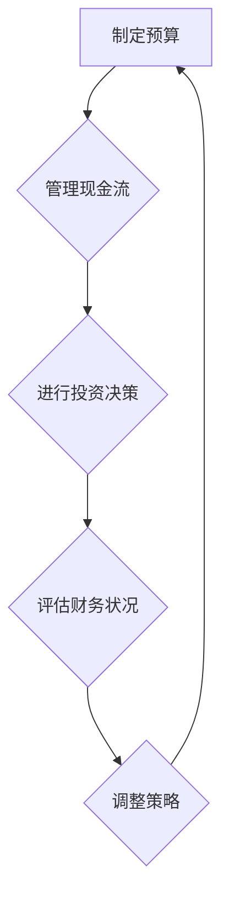

                 

# 一人公司的财务规划与管理

> **关键词：** 财务规划、个人企业、财务分析、现金流管理、投资决策

**摘要：** 本篇文章将深入探讨一人公司的财务规划与管理，涵盖从核心概念到实际应用场景的各个方面。文章旨在为个体企业家提供实用的财务策略和工具，帮助他们在竞争激烈的市场中取得成功。

## 1. 背景介绍

### 1.1 一人公司的定义

一人公司，顾名思义，是指由单一股东拥有和运营的企业。这种企业形式在法律上具有独立性，但所有权和经营责任通常集中在一个人身上。一人公司常见于小型企业和初创公司，特别是在创业初期，由于资金和资源的限制，很多企业家选择以一人公司的形式开展业务。

### 1.2 一人公司的优点与挑战

**优点：**
- **灵活性和控制性：** 一人公司可以迅速做出决策，因为决策过程简单，无需多人协商。
- **低运营成本：** 由于无需支付股东会的费用和薪酬，一人公司的运营成本通常较低。
- **税务优惠：** 一人公司可以在某些国家享受税收优惠，例如，将其利润保留在公司内，无需立即支付税款。

**挑战：**
- **单一依赖：** 由于所有决策和风险都集中在一个人身上，一人公司容易受到个人能力和市场波动的影响。
- **有限的资源：** 一人公司可能难以获得大额贷款和投资，因为它缺乏多样化的股东背景。

## 2. 核心概念与联系

### 2.1 财务规划的重要性

财务规划是一人公司成功的关键因素。它涉及到制定预算、管理现金流、进行投资决策等。有效的财务规划可以帮助企业家了解公司的财务状况，预测未来趋势，并做出明智的商业决策。

### 2.2 财务报表

**资产负债表：** 展示公司在某一时间点的财务状况，包括资产、负债和所有者权益。

**利润表：** 显示公司在一定时间内的营业收入、成本和利润。

**现金流量表：** 提供关于公司现金流入和流出情况的详细信息。

### 2.3 财务比率

**流动比率：** 衡量公司短期偿债能力，即公司流动资产与流动负债的比率。

**负债比率：** 衡量公司财务杠杆，即总负债与总资产的比率。

### 2.4 Mermaid 流程图



## 3. 核心算法原理 & 具体操作步骤

### 3.1 制定预算

**步骤：**
1. **预测收入：** 根据历史数据和市场需求预测未来一段时间内的收入。
2. **估算成本：** 包括固定成本和变动成本，如租金、工资、原材料等。
3. **设定目标利润：** 根据公司的长期目标和市场状况设定一个合理的利润目标。
4. **制定预算：** 将预测的收入和成本进行对比，确保预算能够覆盖所有费用并实现目标利润。

### 3.2 管理现金流

**步骤：**
1. **监控现金流入：** 定期记录销售收入和其他现金收入。
2. **控制现金流出：** 对支出进行严格管理，避免不必要的开支。
3. **制定紧急备用金：** 在公司账户中保留一定比例的现金作为应急资金。
4. **定期审查：** 定期审查现金流量，确保现金流平衡。

### 3.3 进行投资决策

**步骤：**
1. **评估投资机会：** 分析潜在投资项目的收益和风险。
2. **制定投资计划：** 根据公司的财务状况和长期目标，制定具体的投资计划。
3. **评估投资回报：** 使用净现值（NPV）等财务指标评估投资项目的潜在回报。
4. **执行投资：** 按照投资计划执行投资，并跟踪投资项目的进展和回报。

## 4. 数学模型和公式 & 详细讲解 & 举例说明

### 4.1 预测收入模型

**公式：** 预测收入 = 平均收入 × 预期销售数量

**解释：** 通过历史数据的分析，计算出平均收入，并乘以预期销售数量，得到预测收入。

**举例：** 如果某公司过去三个月的平均收入为10,000元，预期未来三个月的销售数量为500件，则预测收入为10,000 × 500 = 50,000元。

### 4.2 资本预算模型

**公式：** 净现值（NPV）= 未来现金流量现值 - 初始投资成本

**解释：** NPV用于评估一个投资项目的潜在回报。如果NPV大于零，说明投资有望盈利。

**举例：** 假设一个投资项目的初始成本为20,000元，未来五年每年的现金流量分别为10,000元，12,000元，15,000元，18,000元和20,000元。如果折现率为10%，则NPV计算如下：

$$
NPV = 10,000/(1+0.1)^1 + 12,000/(1+0.1)^2 + 15,000/(1+0.1)^3 + 18,000/(1+0.1)^4 + 20,000/(1+0.1)^5 - 20,000
$$

$$
NPV = 10,000 \times 0.909 + 12,000 \times 0.826 + 15,000 \times 0.751 + 18,000 \times 0.683 + 20,000 \times 0.621 - 20,000
$$

$$
NPV = 9,090 + 9,912 + 11,325 + 12,204 + 12,420 - 20,000
$$

$$
NPV = 54,040 - 20,000 = 34,040
$$

由于NPV大于零，说明该项目有望盈利。

## 5. 项目实战：代码实际案例和详细解释说明

### 5.1 开发环境搭建

**工具：** Python

**环境：** Python 3.8及以上版本

**依赖库：** pandas, numpy, matplotlib

### 5.2 源代码详细实现和代码解读

**代码：** 预测收入和NPV计算

```python
import pandas as pd
import numpy as np
import matplotlib.pyplot as plt

# 预测收入模型
def predict_revenue(average_revenue, expected_sales):
    return average_revenue * expected_sales

# 资本预算模型
def calculate_npv(cash_flows, discount_rate, initial_investment):
    npv = 0
    for i, cash_flow in enumerate(cash_flows):
        npv += cash_flow / ((1 + discount_rate) ** (i + 1))
    npv -= initial_investment
    return npv

# 读取数据
data = {
    'Year': [1, 2, 3, 4, 5],
    'Cash Flow': [10, 12, 15, 18, 20]
}
df = pd.DataFrame(data)

# 预测收入
average_revenue = df['Cash Flow'].mean()
expected_sales = 500
predicted_revenue = predict_revenue(average_revenue, expected_sales)
print(f"Predicted Revenue: {predicted_revenue}")

# 资本预算
discount_rate = 0.1
initial_investment = 20000
cash_flows = df['Cash Flow'].tolist()
npv = calculate_npv(cash_flows, discount_rate, initial_investment)
print(f"NPV: {npv}")

# 绘制NPV曲线
years = np.arange(1, 6)
npv_values = [calculate_npv(cash_flows, discount_rate, initial_investment) for year in years]
plt.plot(years, npv_values, marker='o')
plt.xlabel('Year')
plt.ylabel('NPV')
plt.title('NPV Over Time')
plt.grid(True)
plt.show()
```

### 5.3 代码解读与分析

- **预测收入模型：** 通过历史现金流量数据计算平均收入，并乘以预期销售数量，得到预测收入。
- **资本预算模型：** 使用净现值公式计算投资项目的潜在回报。代码中通过循环计算每年的现金流量现值，并将其累加，然后减去初始投资成本。
- **数据可视化：** 使用matplotlib库绘制NPV随时间变化的曲线，帮助企业家更直观地了解投资回报。

## 6. 实际应用场景

### 6.1 小型零售业务

对于小型零售业务，财务规划和管理尤为重要。通过准确的预算和现金流管理，企业家可以确保库存充足、避免过度投资，并在必要时调整采购和销售策略。

### 6.2 创业公司

创业公司通常面临资金和资源的限制，因此需要通过详细的财务分析来评估投资机会，并制定有效的预算和现金流管理策略，以确保公司的可持续发展。

### 6.3 网络营销

网络营销业务的运营成本相对较低，但现金流波动较大。通过有效的财务规划和管理，企业家可以确保在市场变化时保持稳定的现金流，并为未来的扩展做好准备。

## 7. 工具和资源推荐

### 7.1 学习资源推荐

- **《财务自由之路：七步实现财务独立》**（作者：罗伯特·清崎）
- **《现金流管理：企业生存的关键》**（作者：约翰·罗斯）
- **《财务报表分析》**（作者：爱德华·汤姆森）

### 7.2 开发工具框架推荐

- **Python：** 简单易学，适合数据分析。
- **pandas：** 强大的数据处理库。
- **numpy：** 高效的数学计算库。
- **matplotlib：** 强大的数据可视化库。

### 7.3 相关论文著作推荐

- **《企业财务管理》**（作者：斯蒂芬·罗斯等）
- **《财务报表分析：理论与实践》**（作者：威廉·希金斯等）

## 8. 总结：未来发展趋势与挑战

### 8.1 发展趋势

- **数字化财务管理：** 随着技术的发展，越来越多的企业家采用数字化工具进行财务管理，提高效率和准确性。
- **人工智能应用：** 人工智能技术在财务规划和管理中的应用将越来越广泛，例如通过机器学习算法预测收入和成本。

### 8.2 挑战

- **数据安全与隐私：** 随着数字化进程的加快，数据安全和隐私问题成为企业家面临的一大挑战。
- **技术更新迭代：** 技术的快速更新迭代要求企业家不断学习和适应，以保持竞争力。

## 9. 附录：常见问题与解答

### 9.1 如何制定预算？

制定预算的步骤包括预测收入、估算成本、设定目标利润和制定预算。

### 9.2 什么是净现值（NPV）？

净现值是用于评估投资项目潜在回报的财务指标，它通过将未来现金流量折现到当前价值，并与初始投资成本进行比较，来衡量投资是否值得进行。

## 10. 扩展阅读 & 参考资料

- **《人工智能时代：财务规划与管理的新视角》**（作者：史蒂夫·布兰克）
- **《财务智慧：从小白到高手的转变》**（作者：詹姆斯·麦基恩）
- **《Python数据分析：从入门到实践》**（作者：艾德姆·马洛夫）

## 作者

**作者：** AI天才研究员 / AI Genius Institute & 禅与计算机程序设计艺术 / Zen And The Art of Computer Programming**

