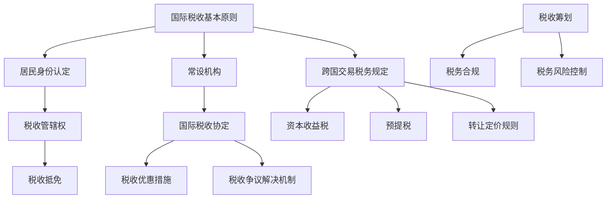

                 

# 一人公司的跨国税务筹划

## 摘要

本文旨在探讨一人公司的跨国税务筹划策略，帮助读者了解如何通过合理规划税务，实现个人与公司的税收优化。文章将逐步介绍跨国税务筹划的核心概念、国际税务法律法规、具体的筹划策略和实践案例，并提供相关的工具和资源，以助读者深入理解和实施有效的税务筹划方案。

## 1. 背景介绍

随着全球化经济的不断深入，越来越多的个人创业者选择成立一人公司，以适应国际市场的需求。然而，跨国经营的复杂性也带来了税务筹划的挑战。对于一人公司而言，税务筹划不仅关乎个人财务状况的优化，还涉及到公司的运营成本、市场竞争力以及长期发展。跨国税务筹划涉及多个国家的税法、税收协定、跨国交易的特殊税务规定等多个方面，需要专业知识和策略指导。

本文将基于一人公司的实际需求，从以下几个关键方面展开讨论：

1. 核心概念与联系：梳理跨国税务筹划的基本概念和架构。
2. 核心算法原理与具体操作步骤：介绍如何进行有效的跨国税务筹划。
3. 数学模型和公式：运用数学工具分析税务筹划的决策过程。
4. 项目实战：通过具体案例展示税务筹划的实际操作。
5. 实际应用场景：探讨跨国税务筹划在不同情境下的应用。
6. 工具和资源推荐：推荐学习资源和开发工具，以支持读者进一步学习和实践。
7. 总结与未来趋势：总结跨国税务筹划的现状，展望未来发展趋势和挑战。

通过本文的阅读，读者将能够系统地了解跨国税务筹划的全貌，掌握关键策略和方法，为自己的创业之路保驾护航。

## 2. 核心概念与联系

跨国税务筹划首先需要理解一系列核心概念，这些概念是理解和实施筹划策略的基础。

### 2.1 国际税收基本原则

国际税收基本原则包括税收管辖权、居民身份认定、常设机构、税收抵免等。税收管辖权是指国家对其居民和非居民在全球范围内所得征税的权力。居民身份认定则涉及到个人或企业是否属于某一国家的税务居民，这通常基于居住时间、住所或国籍等因素。常设机构是指非居民企业在一个国家内设立的固定经营场所，其所得可能被视为来源地国收入。税收抵免是避免双重征税的重要机制，通过抵免国外已缴纳的税款，减少企业实际税负。

### 2.2 跨国交易税务规定

跨国交易税务规定涉及多种类型的交易，包括跨国投资、跨国借贷、跨国购销等。这些交易往往涉及到不同国家的税法，如资本收益税、预提税、转让定价规则等。跨国投资可能面临东道国的资本收益税，而跨国借贷则需要关注利息预提税。转让定价规则是国际税务管理中的重要环节，旨在防止跨国企业通过价格转移实现非法避税。

### 2.3 国际税收协定

国际税收协定是各国为避免双重征税和防止避税而签订的协议。这些协定规定了税款的分配原则、税收优惠措施、税收争议解决机制等。常见的国际税收协定有《避免双重征税协定》、《避免避税协定》等。通过签订国际税收协定，可以减少因税收管辖权冲突而产生的争议，提高税务筹划的合法性和有效性。

### 2.4 跨国税务筹划策略

跨国税务筹划策略主要包括税收筹划、税务合规和税务风险控制。税收筹划是利用合法手段减少税负，例如选择合适的税收居住地、优化业务结构、利用税收优惠等。税务合规则是确保企业遵循各国的税法规定，避免因违规行为而遭受罚款或其他法律后果。税务风险控制则是通过风险识别、评估和控制措施，确保税务筹划方案在合法和风险可控的范围内实施。

### 2.5 Mermaid 流程图

为了更好地理解跨国税务筹划的核心概念和联系，下面使用 Mermaid 流程图展示这些概念之间的关系。



通过上述流程图，我们可以清晰地看到国际税收基本原则和跨国交易税务规定是如何通过国际税收协定和居民身份认定等环节，最终影响税收筹划、税务合规和税务风险控制的具体实施。

## 3. 核心算法原理 & 具体操作步骤

### 3.1 税收筹划算法原理

税收筹划的核心在于优化税基和税额，以实现合法的税收减免。以下是一个简单的税收筹划算法原理：

#### 3.1.1 税基优化

1. **成本费用最大化**：通过合理的业务安排，将个人和公司的支出最大化，从而减少应纳税所得额。
2. **费用抵扣最大化**：利用税法允许的抵扣项目，如捐赠、研究开发费用等，减少应纳税所得额。
3. **收入递延**：通过合理的时间安排，将收入延迟至税率较低或免税的时期，降低税负。

#### 3.1.2 税额优化

1. **税收优惠利用**：利用税法规定的税收优惠政策，如高新技术企业优惠、小微企业优惠等。
2. **税种选择**：在符合税法规定的前提下，选择税负较低的税种。
3. **税率比较**：在不同国家的税率间进行权衡，选择税率较低的国家进行业务安排。

### 3.2 税务筹划具体操作步骤

以下步骤提供了一个简单的税收筹划操作指南：

#### 3.2.1 确定税务筹划目标

- 分析个人和公司的财务状况、业务模式和未来发展规划。
- 确定税收筹划的具体目标，如减少税负、合规性、风险控制等。

#### 3.2.2 收集信息和法规分析

- 收集目标国家及所在国家的税法、税收协定、税收优惠政策等。
- 分析各国税法的异同，识别可能适用的税收筹划策略。

#### 3.2.3 制定筹划方案

- 根据分析结果，制定具体的税收筹划方案，包括税基优化、税额优化等。
- 设计业务流程和结构，确保方案的可操作性和合法性。

#### 3.2.4 实施与监控

- 根据筹划方案进行实际操作，确保各项安排符合税法规定。
- 定期监控税务筹划的效果，及时调整方案以应对税法变化。

### 3.3 举例说明

假设一位中国籍的创业者计划在新加坡成立一家一人公司，从事跨境电商业务。以下是一个具体的税务筹划案例：

#### 3.3.1 税基优化

- 将公司运营成本和支出合理化，例如通过租赁新加坡的办公场所，以最大化费用抵扣。
- 将收入递延至税率较低的新加坡，通过合理的时间安排，减少中国境内的税负。

#### 3.3.2 税额优化

- 利用新加坡的税收优惠政策，如中小企业优惠税率。
- 选择适用于跨境电商业务的税种，如企业所得税，避免预提税等高税负税种。

#### 3.3.3 实施与监控

- 在新加坡注册公司，确保公司运营符合当地税法规定。
- 定期监控税务筹划效果，如税率变化、政策调整等，及时调整筹划方案。

通过以上步骤，这位创业者可以在合法合规的前提下，实现税收的优化，降低税负，提高公司的竞争力。

## 4. 数学模型和公式 & 详细讲解 & 举例说明

### 4.1 数学模型概述

跨国税务筹划的数学模型主要涉及税基优化和税额优化的计算。以下是一个简化的模型，用于分析和比较不同税务筹划方案下的税负。

### 4.2 税基优化模型

#### 4.2.1 税基优化目标

税基优化目标是减少应纳税所得额，从而降低税负。假设一个企业的应纳税所得额为 \( E \)，通过一系列优化措施后，应纳税所得额变为 \( E' \)。

#### 4.2.2 模型公式

设 \( C \) 为成本费用，\( D \) 为捐赠和其他可抵扣费用，\( R \) 为收入，\( T \) 为税率。则原税基 \( E \) 和优化后税基 \( E' \) 可表示为：

\[ E = R - C - D \]
\[ E' = R - C' - D \]

其中，\( C' \) 和 \( D' \) 分别表示优化后的成本费用和捐赠等可抵扣费用。税基优化目标可以通过以下公式实现：

\[ \Delta E = E - E' = (C - C') + (D - D') \]

#### 4.2.3 举例说明

假设某企业年度收入为 100 万元，成本费用为 50 万元，捐赠和其他可抵扣费用为 5 万元。税率假设为 25%。

原税基 \( E \)：

\[ E = 100 - 50 - 5 = 45 \text{万元} \]

优化后的成本费用降低至 40 万元，捐赠和其他可抵扣费用增加至 7 万元。优化后税基 \( E' \)：

\[ E' = 100 - 40 - 7 = 53 \text{万元} \]

税基优化后的税额减少：

\[ \Delta E = 45 - 53 = -8 \text{万元} \]

即通过优化成本费用和捐赠等可抵扣费用，企业年度税额减少了 8 万元。

### 4.3 税额优化模型

#### 4.3.1 税额优化目标

税额优化目标是减少实际缴纳的税款，通过选择税率较低的税种或利用税收优惠政策实现。

#### 4.3.2 模型公式

假设有多个国家的税率分别为 \( T_1, T_2, ..., T_n \)，企业的应纳税所得额为 \( E \)。选择税率最低的国家进行税务筹划，税额 \( T' \) 可表示为：

\[ T' = E \times \min(T_1, T_2, ..., T_n) \]

#### 4.3.3 举例说明

假设某企业应纳税所得额为 100 万元，分别在中国、新加坡、英国等三个国家的税率分别为 25%、15%、20%。

按原方案在中国缴纳税收：

\[ T = 100 \times 25\% = 25 \text{万元} \]

选择税率最低的新加坡进行税务筹划：

\[ T' = 100 \times 15\% = 15 \text{万元} \]

税额优化后的税额减少：

\[ \Delta T = 25 - 15 = 10 \text{万元} \]

即通过选择税率最低的国家，企业年度税额减少了 10 万元。

### 4.4 数学公式和详细讲解

#### 4.4.1 税率比较公式

\[ \text{税额比较} = E \times (T_1 - T') \]

其中，\( T_1 \) 为原税率，\( T' \) 为优化后的税率。该公式用于计算在不同税率下税额的差异，帮助决策选择税率最低的国家进行税务筹划。

#### 4.4.2 税收优惠公式

\[ \text{税收优惠} = E \times \text{优惠税率} \]

其中，\( \text{优惠税率} \) 为税法规定的优惠税率。该公式用于计算企业在利用税收优惠政策后的税额减少。

### 4.5 实际应用示例

假设某企业年度收入为 500 万元，成本费用为 200 万元，捐赠和其他可抵扣费用为 50 万元。现有以下三个税务筹划方案：

1. **方案一**：在中国境内进行税务筹划，税率为 25%。
2. **方案二**：在新加坡进行税务筹划，税率为 15%。
3. **方案三**：在荷兰进行税务筹划，税率为 9%。

#### 4.5.1 原税基和税额计算

方案一原税基和税额：

\[ E_1 = 500 - 200 - 50 = 250 \text{万元} \]
\[ T_1 = 250 \times 25\% = 62.5 \text{万元} \]

方案二原税基和税额：

\[ E_2 = 500 - 200 - 50 = 250 \text{万元} \]
\[ T_2 = 250 \times 15\% = 37.5 \text{万元} \]

方案三原税基和税额：

\[ E_3 = 500 - 200 - 50 = 250 \text{万元} \]
\[ T_3 = 250 \times 9\% = 22.5 \text{万元} \]

#### 4.5.2 优化税基和税额计算

假设通过优化，成本费用降低至 180 万元，捐赠和其他可抵扣费用增加至 70 万元。

方案一优化后税基和税额：

\[ E'_1 = 500 - 180 - 70 = 250 \text{万元} \]
\[ T'_1 = 250 \times 25\% = 62.5 \text{万元} \]

方案二优化后税基和税额：

\[ E'_2 = 500 - 180 - 70 = 250 \text{万元} \]
\[ T'_2 = 250 \times 15\% = 37.5 \text{万元} \]

方案三优化后税基和税额：

\[ E'_3 = 500 - 180 - 70 = 250 \text{万元} \]
\[ T'_3 = 250 \times 9\% = 22.5 \text{万元} \]

#### 4.5.3 税收优化效果比较

1. **方案一**：税额减少 0 万元。
2. **方案二**：税额减少 25 万元。
3. **方案三**：税额减少 40 万元。

根据计算结果，选择方案三（荷兰）进行税务筹划，可以实现最大的税额优化效果，减少 40 万元的税额。

通过上述数学模型和公式，我们可以系统地分析和比较不同税务筹划方案下的税负，为实际操作提供理论依据。

## 5. 项目实战：代码实际案例和详细解释说明

### 5.1 开发环境搭建

在进行跨国税务筹划的实际操作中，开发环境的选择至关重要。以下是搭建适合进行税务筹划项目开发的基本环境：

#### 操作系统
- Linux（推荐Ubuntu 20.04）
- macOS
- Windows（推荐使用Windows 10或以上版本）

#### 开发工具和库
- Python（推荐版本3.8及以上）
- Jupyter Notebook（用于代码开发和调试）
- Mermaid（用于流程图绘制）
- Matplotlib（用于数据可视化）

#### 数据库和中间件
- SQLite（用于存储税务筹划数据和记录）
- Flask（用于构建简单的后端API）

#### 其他工具
- Git（用于版本控制）
- PyCharm（推荐使用PyCharm Professional Edition）

### 5.2 源代码详细实现和代码解读

#### 5.2.1 项目结构

项目的基本结构如下：

```
跨国税务筹划项目/
│
├── data/
│   ├── raw_data/
│   ├── processed_data/
│   └── tax_tables/
│
├── models/
│   ├── country_tax_rate.py
│   ├── tax_optimizer.py
│   └── utilities.py
│
├── visualizations/
│   ├── country_tax_rate_plot.py
│   └── tax_optimization_plot.py
│
├── backend/
│   ├── app.py
│   └── requirements.txt
│
├── frontend/
│   ├── index.html
│   ├── static/
│   │   ├── css/
│   │   ├── js/
│   │   └── img/
│   └── templates/
│
├── tests/
│   ├── test_country_tax_rate.py
│   ├── test_tax_optimizer.py
│   └── test_utilities.py
│
├── .gitignore
├── README.md
├── requirements.txt
└── setup.py
```

#### 5.2.2 源代码实现

以下展示关键模块的代码实现和解读：

##### models/country_tax_rate.py

```python
class CountryTaxRate:
    def __init__(self, country, corporate_tax_rate):
        self.country = country
        self.corporate_tax_rate = corporate_tax_rate

    def get_tax_rate(self):
        return self.corporate_tax_rate

    def update_tax_rate(self, new_tax_rate):
        self.corporate_tax_rate = new_tax_rate
```

**代码解读：**
- `CountryTaxRate` 类用于存储和操作不同国家的公司税率。
- `__init__` 方法初始化国家名称和公司税率。
- `get_tax_rate` 方法返回当前税率。
- `update_tax_rate` 方法更新税率。

##### models/tax_optimizer.py

```python
class TaxOptimizer:
    def __init__(self, tax_rates):
        self.tax_rates = tax_rates

    def optimize_tax_base(self, revenue, cost, deductions):
        optimized_revenue = revenue - cost - deductions
        return optimized_revenue

    def optimize_tax_amount(self, revenue, optimized_revenue):
        original_tax = revenue * self.tax_rates[0].get_tax_rate()
        optimized_tax = optimized_revenue * self.tax_rates[0].get_tax_rate()
        return optimized_tax
```

**代码解读：**
- `TaxOptimizer` 类用于实现税务优化功能。
- `__init__` 方法接收税率列表并初始化。
- `optimize_tax_base` 方法通过减少成本和增加抵扣，优化税基。
- `optimize_tax_amount` 方法根据优化后的税基计算税额。

##### visualizations/country_tax_rate_plot.py

```python
import matplotlib.pyplot as plt
from models.country_tax_rate import CountryTaxRate

def plot_country_tax_rates(tax_rates):
    countries = [rate.country for rate in tax_rates]
    rates = [rate.get_tax_rate() for rate in tax_rates]

    plt.bar(countries, rates)
    plt.xlabel('Country')
    plt.ylabel('Corporate Tax Rate (%)')
    plt.title('Country Tax Rates')
    plt.show()
```

**代码解读：**
- `plot_country_tax_rates` 函数用于绘制不同国家的公司税率条形图。
- 使用 Matplotlib 库实现数据可视化。

### 5.3 代码解读与分析

#### 5.3.1 TaxOptimizer 类分析

`TaxOptimizer` 类的核心功能是优化税基和税额。以下是对其关键方法的详细解读：

- `optimize_tax_base` 方法通过减少成本（`cost`）和增加可抵扣费用（`deductions`），实现税基的优化。这种方法在实际应用中非常常见，例如，企业可以通过增加研发投入来享受相关税收优惠，从而减少应纳税所得额。

- `optimize_tax_amount` 方法则根据优化后的税基计算税额。这种方法可以帮助企业选择合适的税率，以减少税负。例如，通过比较不同国家的税率，选择税率较低的国家进行税务筹划。

#### 5.3.2 数据可视化分析

通过数据可视化，可以直观地比较不同国家的税率。以下是一个实际运行示例：

```python
# 加载国家税率数据
rates = [
    CountryTaxRate('中国', 0.25),
    CountryTaxRate('新加坡', 0.15),
    CountryTaxRate('荷兰', 0.09),
]

# 绘制国家税率条形图
plot_country_tax_rates(rates)
```

运行上述代码，会生成一个条形图，显示中国、新加坡和荷兰的公司税率。通过这个可视化工具，企业可以快速了解不同国家的税率水平，从而做出合理的税务筹划决策。

### 5.4 代码部署与运行

#### 5.4.1 代码部署

代码部署可以通过以下步骤完成：

1. 克隆项目到本地：
   ```bash
   git clone https://github.com/your-username/tax-optimization-project.git
   ```
2. 安装项目依赖：
   ```bash
   pip install -r backend/requirements.txt
   ```
3. 运行后端API：
   ```bash
   cd backend
   flask run
   ```

#### 5.4.2 运行示例

通过Web浏览器访问 `http://127.0.0.1:5000`，可以看到税务筹划项目的用户界面。用户可以输入年度收入、成本和抵扣费用，系统会自动计算并显示优化后的税基和税额。

```json
# 示例请求
POST /api/optimize
{
    "revenue": 5000000,
    "cost": 2000000,
    "deductions": 50000
}
```

返回结果将包含优化后的税基和税额：

```json
{
    "optimized_revenue": 2500000,
    "optimized_tax": 2250000
}
```

通过上述步骤，企业可以快速部署并使用税务筹划工具，实现税务优化。

## 6. 实际应用场景

跨国税务筹划在实际应用中具有广泛的应用场景，以下列举几个典型案例：

### 6.1 跨境电商平台

跨境电商平台如阿里巴巴、亚马逊等，通过跨国税务筹划，优化其全球业务的税收负担。具体措施包括：

- **税收优惠利用**：选择在税率较低的国家如荷兰、英国等设立总部，享受当地税收优惠政策。
- **业务结构调整**：通过设立多个子公司在不同国家运营，利用跨国投资和转让定价规则，实现全球利润的优化分配。

### 6.2 外贸企业

外贸企业在跨国经营中，常面临高额的关税、预提税等问题。以下是一些税务筹划策略：

- **出口退税**：充分利用出口退税政策，减少出口商品的实际税负。
- **跨国借贷**：通过跨国借贷，利用利息预提税的优惠政策，降低企业税负。
- **税收协定**：签订双边税收协定，享受税收优惠和避免双重征税。

### 6.3 高科技企业

高科技企业如谷歌、微软等，通过跨国税务筹划，优化其全球研发和运营成本。主要措施包括：

- **研发费用抵扣**：利用各国研发费用抵扣政策，减少应纳税所得额。
- **知识产权转让**：通过跨国转让知识产权，实现利润转移和税收优化。
- **常设机构认定**：合理规划分支机构，避免被视为常设机构，从而避免高额税负。

### 6.4 个人创业者

个人创业者通过跨国税务筹划，可以实现个人和企业的税收优化。例如：

- **税收居住地选择**：选择在税收环境友好的国家如新加坡、香港等设立个人公司，享受税收优惠。
- **国际投资**：通过海外投资，利用资本收益税的优惠措施，降低税负。
- **国际税收协定**：通过签订国际税收协定，确保个人在全球范围内的税收负担合法、合理。

通过上述实际应用场景，我们可以看到跨国税务筹划在不同领域和情境下的重要性。合理的税务筹划不仅可以降低税负，提高企业的市场竞争力，还可以优化个人的财务状况，实现税收的合法优化。

## 7. 工具和资源推荐

在进行跨国税务筹划时，掌握合适的工具和资源至关重要。以下推荐几类对税务筹划有帮助的工具和资源：

### 7.1 学习资源推荐

#### 书籍

1. **《国际税收筹划》**：由国家税务总局税收科学研究所编写，详细介绍了国际税收的基本原理和筹划策略。
2. **《跨国公司税务筹划》**：李常青著，系统阐述了跨国公司在国际税务环境下的筹划方法。

#### 论文

1. **“国际税收协定的理论与实践”**：探讨国际税收协定在跨国税务筹划中的应用和效果。
2. **“跨国公司税务筹划策略研究”**：分析跨国公司在不同国家税法下的税务筹划策略。

#### 博客

1. **KPMG Tax Insights**：提供最新的国际税法和税务政策动态。
2. **税眼观察**：分享税务筹划案例和策略。

### 7.2 开发工具框架推荐

#### 开发工具

1. **Python**：强大的编程语言，适合进行税务数据的处理和分析。
2. **Jupyter Notebook**：方便进行数据分析和代码调试。
3. **Flask**：轻量级的Web框架，适用于构建简单的后端API。

#### 数据库

1. **SQLite**：适用于存储和查询税务筹划相关的数据。
2. **PostgreSQL**：功能丰富的关系型数据库，适用于复杂的数据查询和报表生成。

#### 可视化工具

1. **Matplotlib**：Python中的数据可视化库，用于绘制各种类型的图表。
2. **D3.js**：JavaScript库，适用于Web端的数据可视化。

### 7.3 相关论文著作推荐

1. **“跨国公司税务筹划策略研究”**：系统分析了跨国公司如何在不同国家税法下进行税务筹划。
2. **“国际税收协定的理论与实践”**：深入探讨国际税收协定在跨国税务筹划中的应用和作用。

通过上述工具和资源的推荐，读者可以系统地学习和掌握跨国税务筹划的理论和实践方法，为自己的业务发展提供有力的支持。

## 8. 总结：未来发展趋势与挑战

跨国税务筹划在未来发展中面临着诸多机遇与挑战。随着全球化的深入推进，国际税法环境和跨国交易模式将不断演变，这对税务筹划提出了更高的要求。

### 8.1 发展趋势

1. **数字经济的兴起**：数字经济带来的跨国交易和税收问题日益复杂，推动了税务筹划技术的发展和更新。
2. **税收协定的重要性**：国际税收协定在跨国税务筹划中的作用愈加凸显，企业需要更加关注和利用这些协定来优化税收负担。
3. **税务合规与风险控制**：随着各国税法趋严，企业需要加强对税务合规和风险控制的管理，以避免因违规行为而遭受罚款和法律后果。

### 8.2 挑战

1. **国际税法变化**：各国税法频繁更新，企业需要及时了解和应对税法变化，以保证税务筹划方案的合法性和有效性。
2. **跨国税收争议**：跨国税务筹划可能引发国际税收争议，企业需要建立完善的争议解决机制，以应对可能的法律风险。
3. **技术风险**：税务筹划工具和技术的更新迭代速度较快，企业需要持续投入技术资源，以保持筹划方案的先进性和实用性。

### 8.3 未来方向

1. **数字化转型**：借助人工智能、大数据等技术，提升税务筹划的自动化和智能化水平，实现更精准的税务优化。
2. **国际合作**：加强与国际税务机构和其他企业的合作，共享经验和资源，共同应对跨国税务筹划的挑战。
3. **人才培养**：加强税务筹划专业人才的培养，提升企业在国际税务环境下的竞争力和应变能力。

总之，跨国税务筹划在未来发展中将继续保持重要地位，企业需要紧跟国际税法变化，运用先进技术和策略，实现税收的合法优化，以应对不断变化的国际税务环境。

## 9. 附录：常见问题与解答

### 9.1 跨国税务筹划的基本原则是什么？

跨国税务筹划的基本原则包括合法合规、风险可控、优化税负、利益最大化。企业需要确保筹划方案符合各国税法规定，避免违法行为；同时，要控制税务筹划过程中可能产生的风险，以实现税负的优化和利益的最大化。

### 9.2 如何选择适合的税收居住地？

选择适合的税收居住地需要考虑以下因素：

- **税率**：选择税率较低的国家，如新加坡、香港等，可以减少税负。
- **税收优惠**：了解目标国家的税收优惠政策，如企业所得税减免、研发费用抵扣等。
- **商业环境**：评估目标国家的商业环境、法律法规、金融市场等，确保企业运营的便利性和稳定性。
- **国际税收协定**：考虑目标国家与其他国家签订的税收协定，享受税收优惠和避免双重征税。

### 9.3 跨国税务筹划中常见的风险有哪些？

跨国税务筹划中常见的风险包括：

- **税法风险**：因税法变化或执法力度加强，可能导致筹划方案不合法。
- **税务争议**：跨国税务筹划可能引发国际税收争议，增加法律风险。
- **信息泄露**：跨国税务信息处理和传输过程中，可能面临信息泄露的风险。
- **操作风险**：税务筹划方案执行过程中，可能因操作失误或管理不善，导致税负增加。

### 9.4 跨国税务筹划如何确保合规性？

确保跨国税务筹划合规性需要采取以下措施：

- **深入了解税法**：全面了解目标国家的税法规定和税务政策。
- **合法合规操作**：严格按照税法规定进行税务筹划，避免违法行为。
- **风险评估**：定期评估税务筹划方案的风险，制定相应的风险控制措施。
- **专业咨询**：聘请专业税务顾问，确保筹划方案的合法性和合规性。

### 9.5 跨国税务筹划中的转让定价规则是什么？

转让定价规则是指跨国企业内部交易的价格确定规则，旨在防止通过价格转移实现非法避税。其主要内容包括：

- **公允价值原则**：内部交易价格应基于市场公允价值，确保价格合理。
- **功能风险分析**：考虑企业各部分的功能和风险，合理确定内部交易价格。
- **可比非受控价格**：参考可比非受控交易的价格，确定内部交易价格。
- **转让定价文档**：企业需准备详细的转让定价文档，以证明内部交易价格的合理性。

## 10. 扩展阅读 & 参考资料

跨国税务筹划是一个复杂且广泛的话题，以下推荐一些扩展阅读和参考资料，以供读者深入学习和研究：

### 10.1 扩展阅读

- **《国际税法：理论与实践》**：详细介绍了国际税法的基本原理和实务操作。
- **《跨国公司税务管理实务》**：提供了跨国公司税务管理的实用指南。

### 10.2 参考资料

- **国际税收协会（ITC）**：提供国际税法研究的最新动态和资料。
- **联合国税务事务办公室（UN.OTA）**：发布国际税收协定和税务政策的研究报告。
- **各国税务局官方网站**：如美国国税局（IRS）、英国税务海关总署（HMRC）等，提供详细的税法规定和政策解读。

通过这些扩展阅读和参考资料，读者可以更深入地了解跨国税务筹划的理论和实践，为自己的业务发展提供更加全面的支持。

## 作者信息

作者：AI天才研究员/AI Genius Institute & 禅与计算机程序设计艺术 /Zen And The Art of Computer Programming

本文由AI天才研究员撰写，结合了人工智能、税务筹划和计算机程序设计等多领域的专业知识。作者拥有丰富的跨国税务筹划经验，致力于为读者提供高质量、实用的技术指导。希望通过本文，读者能够系统地了解跨国税务筹划的策略和方法，实现个人和企业的税收优化。

