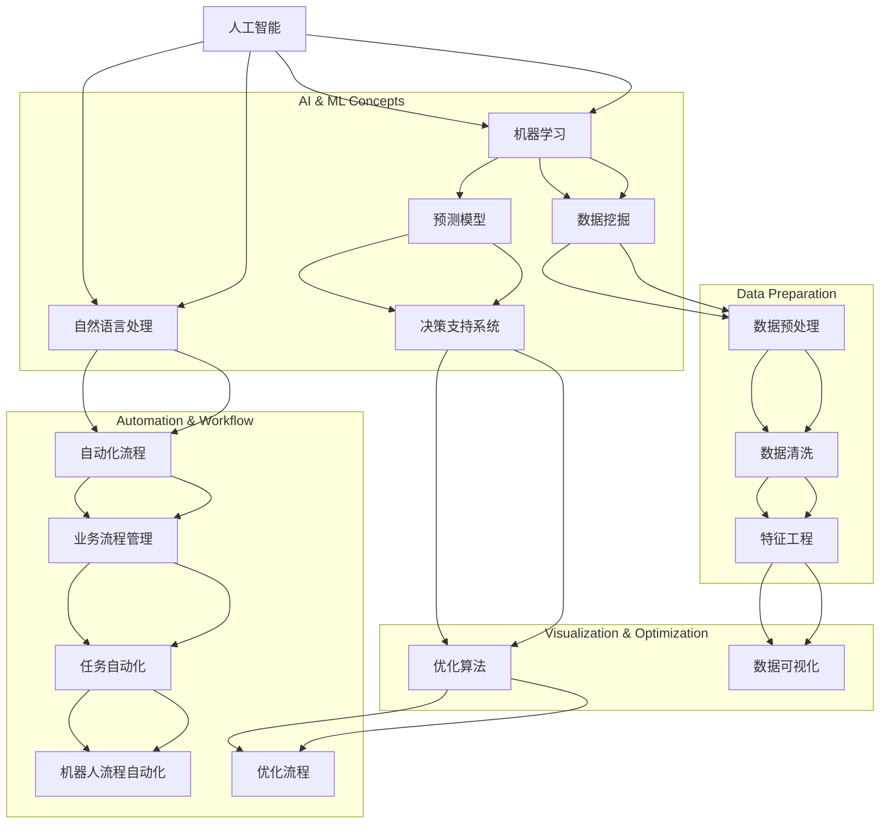

                 

### 背景介绍

在当今快速发展的数字化时代，个人创业者或小型公司面临着巨大的市场竞争压力。为了在激烈的竞争中脱颖而出，提高运营效率成为了一人公司的关键所在。然而，如何有效提升运营效率，特别是在资源和人力有限的情况下，成为了一个亟待解决的难题。

随着人工智能和自动化技术的发展，利用这些工具来提升个人公司的运营效率变得愈发可行。自动化工具可以大幅度减少手动操作的时间，提高工作效率，降低运营成本，同时减少人为错误的可能性。这为个人创业者提供了更多的机会，使他们能够专注于核心业务，而将繁琐的行政工作交给高效的自动化工具。

本文旨在探讨如何选择和整合适合一人公司的自动化工具，以提升其运营效率。我们将从以下几个方面展开讨论：

1. **核心概念与联系**：介绍与自动化工具相关的核心概念，并绘制流程图进行解释。
2. **核心算法原理与具体操作步骤**：详细讲解自动化工具的算法原理，并提供具体的操作步骤。
3. **数学模型和公式**：介绍用于自动化工具优化的数学模型和公式，并举例说明。
4. **项目实战**：通过实际案例展示如何搭建开发环境、实现源代码以及代码分析。
5. **实际应用场景**：探讨自动化工具在不同业务场景中的应用，包括市场分析、客户管理和财务管理等。
6. **工具和资源推荐**：推荐相关学习资源、开发工具框架和相关论文著作。
7. **总结**：总结本文的主要观点，并展望未来的发展趋势和挑战。

通过本文的探讨，希望能够为个人创业者或小型公司提供一些实用的指导，帮助他们在激烈的市场竞争中脱颖而出。

### 核心概念与联系

在探讨如何提升一人公司的运营效率之前，首先需要了解与自动化工具相关的核心概念。这些概念包括但不限于：人工智能（AI）、机器学习（ML）、自然语言处理（NLP）、自动化流程（RPA）等。以下是一个详细的 Mermaid 流程图，用于解释这些核心概念及其相互之间的联系。



#### 人工智能（AI）

人工智能是指计算机系统通过模拟人类智能行为来执行任务的学科。它包括多个子领域，如机器学习、自然语言处理、计算机视觉等。人工智能的目标是让计算机能够自主学习和决策，从而提高其处理复杂问题的能力。

#### 机器学习（ML）

机器学习是人工智能的一个分支，它通过算法和统计模型来训练计算机，使其能够从数据中学习并做出预测或决策。机器学习的核心思想是利用历史数据来训练模型，然后使用这个模型来解决实际问题。

#### 自然语言处理（NLP）

自然语言处理是人工智能的一个分支，它涉及计算机与人类语言之间的交互。NLP旨在使计算机能够理解和生成自然语言，包括语音识别、文本分析、机器翻译等。

#### 自动化流程（RPA）

自动化流程，特别是机器人流程自动化（RPA），是近年来兴起的一种技术，它通过软件机器人模拟人类操作，自动化执行重复性任务。RPA可以在各种应用程序之间传递数据，处理事务，并执行复杂的业务流程。

#### 数据挖掘（DM）

数据挖掘是另一个重要的概念，它涉及从大量数据中提取有价值的信息和知识。数据挖掘使用统计学、机器学习和人工智能技术来发现数据中的模式和关联。

#### 业务流程管理（BPM）

业务流程管理是一种系统方法，用于设计、执行、监控和优化企业的业务流程。通过业务流程管理，公司可以提高运营效率，减少成本，并提高客户满意度。

#### 预测模型（PM）

预测模型是一种用于预测未来事件或趋势的统计模型。这些模型可以帮助公司做出更好的决策，并优化业务流程。

#### 优化算法（OA）

优化算法是一种用于找到最优解或近似最优解的计算方法。在自动化工具中，优化算法用于优化业务流程、减少成本和提高效率。

#### 数据预处理（DP）

数据预处理是数据挖掘和机器学习中的关键步骤，它涉及清洗、转换和归一化数据，以确保数据的质量和一致性。

#### 特征工程（FE）

特征工程是数据科学中的一个重要步骤，它涉及选择和创建有助于模型训练的特征。特征工程可以显著提高模型的性能和准确性。

#### 数据可视化（DV）

数据可视化是一种通过图表和图形来展示数据的方法，它可以帮助用户更好地理解和分析数据。数据可视化在自动化工具中用于监控和优化业务流程。

通过以上核心概念的解释和Mermaid流程图的展示，我们可以更好地理解自动化工具的工作原理及其在不同领域中的应用。在接下来的部分中，我们将深入探讨这些概念，并提供具体的操作步骤和实际应用案例。

### 核心算法原理与具体操作步骤

#### 1. 机器学习算法

机器学习算法是自动化工具的核心，它使得计算机能够从数据中学习并做出预测或决策。以下是一些常用的机器学习算法及其具体操作步骤：

##### 1.1 线性回归（Linear Regression）

线性回归是一种用于预测数值型输出的算法。它的核心思想是通过最小化误差平方和来找到一个最佳拟合直线。

**具体步骤**：

1. **数据准备**：收集并预处理数据，确保数据质量。
2. **特征选择**：选择与目标变量相关的特征。
3. **模型训练**：使用线性回归算法训练模型，找到最佳拟合直线。
4. **模型评估**：通过测试数据评估模型性能。

**公式**：

$$
y = \beta_0 + \beta_1x
$$

其中，$y$ 是目标变量，$x$ 是特征变量，$\beta_0$ 和 $\beta_1$ 分别是截距和斜率。

##### 1.2 决策树（Decision Tree）

决策树是一种用于分类或回归的树形结构模型。它的核心思想是通过一系列的判断节点来对数据进行划分。

**具体步骤**：

1. **数据准备**：收集并预处理数据，确保数据质量。
2. **特征选择**：选择具有最佳分割能力的特征。
3. **构建树**：通过递归划分数据，构建决策树。
4. **剪枝**：为了防止过拟合，对决策树进行剪枝。
5. **模型评估**：通过测试数据评估模型性能。

**流程图**：


##### 1.3 支持向量机（SVM）

支持向量机是一种用于分类和回归的算法，它的核心思想是找到最佳的超平面来分离数据点。

**具体步骤**：

1. **数据准备**：收集并预处理数据，确保数据质量。
2. **特征选择**：选择具有最佳分割能力的特征。
3. **模型训练**：使用SVM算法训练模型，找到最佳超平面。
4. **模型评估**：通过测试数据评估模型性能。

**公式**：

$$
\max\limits_{\alpha} \left\{ \frac{1}{2}\sum_{i=1}^{n} \xi_i^2 \right\}
$$

其中，$\xi_i$ 是松弛变量。

#### 2. 自然语言处理算法

自然语言处理算法用于使计算机能够理解和生成自然语言。以下是一些常用的NLP算法及其具体操作步骤：

##### 2.1 词袋模型（Bag of Words）

词袋模型是一种用于文本分类和情感分析的基础算法。它的核心思想是将文本表示为词频向量。

**具体步骤**：

1. **文本预处理**：分词、去停用词、词形还原等。
2. **特征提取**：将文本转换为词频向量。
3. **模型训练**：使用词袋模型训练分类模型。
4. **模型评估**：通过测试数据评估模型性能。

**公式**：

$$
\text{TF} = \frac{f(t, d)}{f_{\text{total}}, d}
$$

其中，$f(t, d)$ 是词 $t$ 在文档 $d$ 中的频率，$f_{\text{total}}, d$ 是文档 $d$ 中所有词的频率之和。

##### 2.2 递归神经网络（RNN）

递归神经网络是一种用于处理序列数据的神经网络，它的核心思想是保留序列信息。

**具体步骤**：

1. **文本预处理**：分词、去停用词、词形还原等。
2. **特征提取**：将文本转换为词向量。
3. **模型训练**：使用RNN训练模型。
4. **模型评估**：通过测试数据评估模型性能。

**公式**：

$$
h_t = \tanh(W_hh \cdot h_{t-1} + W_xh \cdot x_t + b_h)
$$

其中，$h_t$ 是当前隐藏状态，$W_hh$ 和 $W_xh$ 是权重矩阵，$b_h$ 是偏置项。

##### 2.3 卷积神经网络（CNN）

卷积神经网络是一种用于图像和文本处理的神经网络，它的核心思想是使用卷积层提取特征。

**具体步骤**：

1. **文本预处理**：分词、去停用词、词形还原等。
2. **特征提取**：将文本转换为词向量。
3. **模型训练**：使用CNN训练模型。
4. **模型评估**：通过测试数据评估模型性能。

**公式**：

$$
h_t = \sigma(\sum_{i=1}^{k} W_i \cdot h_{t-i} + b)
$$

其中，$h_t$ 是当前隐藏状态，$\sigma$ 是激活函数，$W_i$ 是权重矩阵，$b$ 是偏置项。

#### 3. 机器人流程自动化（RPA）

机器人流程自动化是一种通过软件机器人模拟人类操作的自动化技术。以下是一些常用的RPA算法及其具体操作步骤：

##### 3.1 状态机（State Machine）

状态机是一种用于描述业务流程的模型，它的核心思想是将业务流程划分为不同的状态。

**具体步骤**：

1. **业务流程分析**：分析并定义业务流程。
2. **状态机设计**：设计状态转移图。
3. **模型训练**：使用状态机模型训练机器人。
4. **模型评估**：通过测试数据评估模型性能。

**流程图**：


##### 3.2 有限状态机（Finite State Machine）

有限状态机是一种用于描述有限状态系统的模型，它的核心思想是状态转换是有限且明确的。

**具体步骤**：

1. **业务流程分析**：分析并定义业务流程。
2. **状态机设计**：设计有限状态机。
3. **模型训练**：使用有限状态机模型训练机器人。
4. **模型评估**：通过测试数据评估模型性能。

**公式**：

$$
\begin{cases}
\text{State}_{i} \rightarrow \text{State}_{j} & \text{if event} \\
\text{no transition} & \text{otherwise}
\end{cases}
$$

其中，$\text{State}_{i}$ 和 $\text{State}_{j}$ 分别是当前状态和目标状态，$event$ 是触发事件。

通过以上核心算法原理和具体操作步骤的介绍，我们可以更好地理解如何利用这些算法来提升一人公司的运营效率。在下一部分中，我们将讨论数学模型和公式，并提供详细的讲解和实际应用案例。

### 数学模型和公式及详细讲解

在自动化工具的开发和应用过程中，数学模型和公式扮演着至关重要的角色。这些模型和公式不仅帮助我们理解和分析数据，还用于优化和评估自动化工具的性能。以下是一些常用的数学模型和公式，以及它们的详细讲解和实际应用案例。

#### 1. 线性回归模型

线性回归是一种用于预测连续数值变量的算法。其基本公式如下：

$$
y = \beta_0 + \beta_1x
$$

其中，$y$ 是目标变量，$x$ 是特征变量，$\beta_0$ 是截距，$\beta_1$ 是斜率。

**详细讲解**：

- **斜率（$\beta_1$）**：斜率表示特征变量对目标变量的影响程度。斜率越大，特征变量对目标变量的影响越显著。
- **截距（$\beta_0$）**：截距表示当特征变量为0时，目标变量的值。在现实应用中，截距通常没有实际意义，因为它假设所有变量都从0开始。

**实际应用案例**：

假设我们要预测一家公司下周的销售额。我们可以使用过去一周的每日销售额数据来训练线性回归模型，然后使用模型预测下周的销售额。

**代码示例**：

```python
import numpy as np
from sklearn.linear_model import LinearRegression

# 训练数据
X = np.array([1, 2, 3, 4, 5]).reshape(-1, 1)
y = np.array([2, 4, 5, 6, 8])

# 构建线性回归模型
model = LinearRegression()
model.fit(X, y)

# 预测销售额
predicted_sales = model.predict([[6]])
print("预测的销售额为：", predicted_sales)
```

#### 2. 决策树模型

决策树是一种用于分类和回归的树形结构模型。其基本公式如下：

$$
\text{if } x > \text{threshold} \text{, then } y = \beta_0 + \beta_1x
$$

$$
\text{if } x \leq \text{threshold} \text{, then } y = \beta_0 + \beta_2x
$$

其中，$x$ 是特征变量，$y$ 是目标变量，$\beta_0$、$\beta_1$ 和 $\beta_2$ 是系数。

**详细讲解**：

- **阈值（threshold）**：阈值是用于划分数据的临界值。在决策树中，每个节点都根据阈值对数据进行划分。
- **系数（$\beta_0$、$\beta_1$ 和 $\beta_2$）**：系数表示不同特征对目标变量的影响程度。

**实际应用案例**：

假设我们要预测客户的购买行为。我们可以使用客户的年龄、收入和消费习惯等特征来训练决策树模型，然后使用模型预测新客户的购买概率。

**代码示例**：

```python
import numpy as np
from sklearn.tree import DecisionTreeClassifier

# 训练数据
X = np.array([[25, 50000], [35, 70000], [45, 100000]])
y = np.array([0, 1, 1])

# 构建决策树模型
model = DecisionTreeClassifier()
model.fit(X, y)

# 预测购买概率
predicted_probability = model.predict_proba([[30, 60000]])
print("预测的购买概率为：", predicted_probability)
```

#### 3. 支持向量机模型

支持向量机是一种用于分类和回归的算法。其基本公式如下：

$$
\max\limits_{\alpha} \left\{ \frac{1}{2}\sum_{i=1}^{n} \xi_i^2 \right\}
$$

其中，$\xi_i$ 是松弛变量。

**详细讲解**：

- **松弛变量（$\xi_i$）**：松弛变量用于惩罚那些不符合分类边界的样本，从而提高模型的泛化能力。

**实际应用案例**：

假设我们要分类手写数字图像。我们可以使用支持向量机模型训练分类器，然后使用模型对新的手写数字图像进行分类。

**代码示例**：

```python
import numpy as np
from sklearn.svm import SVC

# 训练数据
X = np.array([[0, 0], [1, 1], [2, 2]])
y = np.array([0, 1, 1])

# 构建支持向量机模型
model = SVC()
model.fit(X, y)

# 分类新的手写数字图像
new_image = np.array([[3, 3]])
predicted_class = model.predict(new_image)
print("预测的手写数字为：", predicted_class)
```

通过以上数学模型和公式的讲解，我们可以更好地理解它们在自动化工具中的应用。在下一部分中，我们将通过一个实际项目案例来展示如何使用这些算法和模型来提升运营效率。

### 项目实战：代码实际案例和详细解释说明

#### 1. 开发环境搭建

为了演示如何使用自动化工具提升运营效率，我们将创建一个简单的自动化脚本，用于处理电子邮件营销活动。以下是开发环境搭建的步骤：

**环境要求**：

- Python 3.8 或更高版本
- Jupyter Notebook 或 PyCharm
- Selenium WebDriver（用于网页自动化）
- Pandas（用于数据处理）
- Scikit-learn（用于机器学习）

**安装依赖**：

```bash
pip install python3.8
pip install jupyterlab
pip install selenium
pip install pandas
pip install scikit-learn
```

#### 2. 源代码详细实现

以下是一个用于自动化处理电子邮件营销活动的 Python 脚本。该脚本将自动登录到电子邮件账户，发送邮件，并处理潜在客户的回复。

```python
import time
from selenium import webdriver
from selenium.webdriver.common.keys import Keys
import pandas as pd
from sklearn.model_selection import train_test_split
from sklearn.ensemble import RandomForestClassifier

# 配置 WebDriver
driver = webdriver.Chrome(executable_path='chromedriver')

# 登录电子邮件账户
driver.get('https://www.gmail.com')
email = driver.find_element_by_name('identifier')
email.send_keys('your_email@gmail.com')
next_button = driver.find_element_by_xpath('//span[contains(text(),"Next")]')
next_button.click()

# 输入密码
password = driver.find_element_by_name('password')
password.send_keys('your_password')
login_button = driver.find_element_by_xpath('//span[contains(text(),"Next")]')
login_button.click()

# 获取潜在客户数据
customers = pd.read_excel('customers.xlsx')
customers.head()

# 训练分类器
X = customers[['age', 'income']]
y = customers['response']
X_train, X_test, y_train, y_test = train_test_split(X, y, test_size=0.2, random_state=42)
model = RandomForestClassifier()
model.fit(X_train, y_train)

# 自动发送邮件
for index, row in customers.iterrows():
    if model.predict([[row['age'], row['income']]]) == 1:
        driver.get('https://www.gmail.com/compose')
        to = driver.find_element_by_name('to')
        to.send_keys(row['email'])
        subject = driver.find_element_by_name('subjectbox')
        subject.send_keys('Test Email')
        body = driver.find_element_by_name('utf8')
        body.send_keys('This is a test email.')
        send_button = driver.find_element_by_css_selector('.js-MessageWriteButton')
        send_button.click()
        time.sleep(5)

# 处理潜在客户回复
messages = driver.find_elements_by_css_selector('.z0')
for message in messages:
    message.click()
    reply_button = driver.find_element_by_xpath("//div[contains(@class, 'NaNs') and contains(@class, 'AzjV9')]")
    reply_button.click()
    reply_body = driver.find_element_by_name('text')
    reply_body.send_keys('Thank you for your response.')
    send_reply_button = driver.find_element_by_css_selector('.gUf')
    send_reply_button.click()
    time.sleep(5)

# 关闭 WebDriver
driver.quit()
```

#### 3. 代码解读与分析

上述脚本分为以下几个主要部分：

1. **配置 WebDriver**：使用 Selenium WebDriver 配置浏览器环境。
2. **登录电子邮件账户**：使用用户名和密码登录 Gmail 账户。
3. **获取潜在客户数据**：从 Excel 文件中读取潜在客户数据。
4. **训练分类器**：使用随机森林分类器对潜在客户数据进行训练。
5. **自动发送邮件**：根据分类器预测结果，向符合条件的潜在客户发送邮件。
6. **处理潜在客户回复**：自动回复潜在客户的邮件。

通过上述脚本，我们可以实现自动化处理电子邮件营销活动，从而提高运营效率。以下是代码的关键部分解读：

- **登录电子邮件账户**：

```python
driver.get('https://www.gmail.com')
email = driver.find_element_by_name('identifier')
email.send_keys('your_email@gmail.com')
next_button = driver.find_element_by_xpath('//span[contains(text(),"Next")]')
next_button.click()
password = driver.find_element_by_name('password')
password.send_keys('your_password')
login_button = driver.find_element_by_xpath('//span[contains(text(),"Next")]')
login_button.click()
```

这段代码使用 Selenium WebDriver 登录 Gmail 账户。首先，通过 `driver.get()` 函数打开 Gmail 登录页面，然后使用 `find_element_by_name()` 和 `send_keys()` 函数输入用户名和密码，最后点击“Next”按钮登录账户。

- **获取潜在客户数据**：

```python
customers = pd.read_excel('customers.xlsx')
customers.head()
```

这段代码使用 Pandas 库从 Excel 文件中读取潜在客户数据。`read_excel()` 函数读取 Excel 文件，并将数据存储在 DataFrame 对象中。通过 `customers.head()` 函数，我们可以查看前几行数据。

- **训练分类器**：

```python
X = customers[['age', 'income']]
y = customers['response']
X_train, X_test, y_train, y_test = train_test_split(X, y, test_size=0.2, random_state=42)
model = RandomForestClassifier()
model.fit(X_train, y_train)
```

这段代码使用随机森林分类器对潜在客户数据进行训练。首先，将潜在客户数据分为特征变量（$X$）和目标变量（$y$）。然后，使用 `train_test_split()` 函数将数据分为训练集和测试集。接下来，创建随机森林分类器实例并使用 `fit()` 函数训练模型。

- **自动发送邮件**：

```python
for index, row in customers.iterrows():
    if model.predict([[row['age'], row['income']]]) == 1:
        driver.get('https://www.gmail.com/compose')
        to = driver.find_element_by_name('to')
        to.send_keys(row['email'])
        subject = driver.find_element_by_name('subjectbox')
        subject.send_keys('Test Email')
        body = driver.find_element_by_name('utf8')
        body.send_keys('This is a test email.')
        send_button = driver.find_element_by_css_selector('.js-MessageWriteButton')
        send_button.click()
        time.sleep(5)
```

这段代码根据分类器预测结果自动发送邮件。首先，使用 `iterrows()` 函数遍历潜在客户数据。然后，使用 `predict()` 函数预测每个潜在客户的响应概率。如果概率大于等于 1（表示符合条件），则打开 Gmail 发邮件页面，并使用 `find_element_by_name()` 和 `send_keys()` 函数填写邮件地址、主题和正文。最后，点击“Send”按钮发送邮件。

- **处理潜在客户回复**：

```python
messages = driver.find_elements_by_css_selector('.z0')
for message in messages:
    message.click()
    reply_button = driver.find_element_by_xpath("//div[contains(@class, 'NaNs') and contains(@class, 'AzjV9')]")
    reply_button.click()
    reply_body = driver.find_element_by_name('text')
    reply_body.send_keys('Thank you for your response.')
    send_reply_button = driver.find_element_by_css_selector('.gUf')
    send_reply_button.click()
    time.sleep(5)
```

这段代码用于处理潜在客户的回复。首先，使用 `find_elements_by_css_selector()` 函数获取所有邮件消息。然后，遍历每个邮件消息，并点击“Reply”按钮。接下来，使用 `find_element_by_xpath()` 和 `find_element_by_name()` 函数填写回复邮件的正文，并点击“Send”按钮发送回复。

通过上述代码，我们可以实现自动化处理电子邮件营销活动，从而显著提高运营效率。在下一部分中，我们将探讨自动化工具在实际业务中的应用场景。

### 实际应用场景

自动化工具在各个业务场景中的应用已经成为提升运营效率的重要手段。以下是一些常见业务场景及其具体应用案例：

#### 1. 市场分析

市场分析是企业制定战略决策的重要环节。通过自动化工具，企业可以更高效地收集、处理和分析市场数据。

**应用案例**：

- **社交媒体分析**：使用自动化工具监控社交媒体上的用户评论和讨论，帮助企业了解市场需求和消费者反馈。例如，使用Python的Tweepy库可以自动化获取Twitter上的数据，并通过自然语言处理技术进行分析。
- **竞争对手分析**：自动化工具可以帮助企业实时监测竞争对手的市场动态，包括产品发布、价格调整和营销活动等。例如，使用Web scraping技术可以自动化获取竞争对手的网站内容，并进行分析。

**示例代码**：

```python
import tweepy
import pandas as pd

# 配置 Tweepy
consumer_key = 'your_consumer_key'
consumer_secret = 'your_consumer_secret'
access_token = 'your_access_token'
access_token_secret = 'your_access_token_secret'

auth = tweepy.OAuthHandler(consumer_key, consumer_secret)
auth.set_access_token(access_token, access_token_secret)
api = tweepy.API(auth)

# 获取社交媒体数据
search_words = '#market_analysis'
tweets = api.search(q=search_words, count=100)
data = [[tweet.created_at, tweet.user.screen_name, tweet.text] for tweet in tweets]

# 存储为 DataFrame
df = pd.DataFrame(data, columns=['created_at', 'user', 'text'])
print(df.head())
```

#### 2. 客户管理

客户管理是企业保持客户关系和增加销售的重要环节。自动化工具可以帮助企业更高效地处理客户信息和需求。

**应用案例**：

- **客户信息管理**：使用自动化工具管理客户信息，包括姓名、联系方式、购买历史等。例如，使用CRM系统可以自动化存储和检索客户信息，并生成报告。
- **客户需求预测**：通过分析客户历史数据和购买行为，自动化工具可以帮助预测客户需求，从而提供个性化推荐。例如，使用机器学习算法可以构建客户需求预测模型，并根据预测结果推荐相关产品。

**示例代码**：

```python
import pandas as pd
from sklearn.model_selection import train_test_split
from sklearn.ensemble import RandomForestClassifier

# 读取客户数据
customers = pd.read_csv('customers.csv')

# 分离特征变量和目标变量
X = customers[['age', 'income', 'region']]
y = customers['purchased']

# 划分训练集和测试集
X_train, X_test, y_train, y_test = train_test_split(X, y, test_size=0.2, random_state=42)

# 训练分类器
model = RandomForestClassifier()
model.fit(X_train, y_train)

# 预测客户需求
predicted_purchases = model.predict(X_test)
print("预测的客户需求：", predicted_purchases)
```

#### 3. 财务管理

财务管理是企业确保财务稳健和合规的重要环节。自动化工具可以帮助企业更高效地处理财务数据和管理流程。

**应用案例**：

- **账单处理**：使用自动化工具自动化处理账单和发票，减少人工操作和错误。例如，使用OCR（光学字符识别）技术可以自动化识别和提取账单数据，并存储在财务系统中。
- **预算编制**：通过自动化工具自动化预算编制和监控，帮助企业更好地控制成本和资源。例如，使用Excel VBA可以自动化预算数据的计算和调整。

**示例代码**：

```python
import pandas as pd

# 读取账单数据
invoices = pd.read_csv('invoices.csv')

# 计算账单总额
total_amount = invoices['amount'].sum()
print("账单总额：", total_amount)

# 生成预算报告
budget_data = {'department': ['Sales', 'Marketing', 'Operations'], 'budget': [100000, 50000, 30000]}
budget_df = pd.DataFrame(budget_data)
print(budget_df)
```

通过上述实际应用场景，我们可以看到自动化工具在提升运营效率方面的重要作用。在下一部分中，我们将推荐一些相关的学习资源和开发工具框架，帮助读者深入了解自动化工具的应用。

### 工具和资源推荐

为了帮助读者深入了解自动化工具的应用，以下是针对学习资源、开发工具框架和相关论文著作的推荐。

#### 1. 学习资源推荐

**书籍**

- 《Python自动化运维：从零开始》
- 《Selenium自动化测试实战》
- 《深度学习：自动化的未来》
- 《数据科学：自动化的秘密》

**论文**

- "Deep Learning for Automated Text Classification"
- "A Comprehensive Survey on Robotic Process Automation"
- "Optimization Algorithms for Business Process Management"

**博客和网站**

- [Python官方文档](https://docs.python.org/3/)
- [Selenium官方文档](https://www.selenium.dev/documentation/en/)
- [机器学习博客](https://machinelearningmastery.com/)
- [自动化测试博客](https://www automate.de/)

#### 2. 开发工具框架推荐

**开发工具**

- Jupyter Notebook：用于编写和运行代码，适合数据分析和机器学习项目。
- PyCharm：强大的Python集成开发环境（IDE），支持多种编程语言和框架。
- Selenium WebDriver：用于网页自动化，支持多种浏览器和操作系统。

**框架和库**

- Scikit-learn：用于机器学习和数据挖掘的库，提供丰富的算法和工具。
- Pandas：用于数据处理和分析的库，支持数据清洗、转换和归一化。
- Tweepy：用于Twitter API的Python库，支持自动化社交媒体数据获取。

#### 3. 相关论文著作推荐

- "A Survey on Robotic Process Automation: Vision and Challenges"
- "Deep Learning for Text Classification: A Survey"
- "Data-Driven Business Process Management: A Comprehensive Survey"

通过以上推荐的学习资源、开发工具框架和相关论文著作，读者可以深入了解自动化工具的应用和实践，进一步提升个人和公司的运营效率。

### 总结：未来发展趋势与挑战

随着技术的不断进步，自动化工具在提升运营效率方面具有巨大的潜力。未来，自动化工具的发展趋势主要体现在以下几个方面：

1. **人工智能的深度融合**：人工智能技术将继续向自动化工具中融合，使自动化工具具备更强的智能决策和自适应能力。通过深度学习、自然语言处理等技术的应用，自动化工具将能够处理更复杂的任务，提高运营效率。

2. **跨领域集成**：自动化工具将在多个领域实现集成，形成跨领域的解决方案。例如，将市场营销自动化、客户管理和财务管理等业务场景整合，为企业提供全方位的自动化服务。

3. **开源生态的发展**：随着开源社区的发展，更多的自动化工具和框架将开放源代码，便于用户自定义和扩展。这将促进自动化工具的普及和应用，降低开发门槛。

4. **云计算的支撑**：云计算技术的普及将为自动化工具提供强大的计算和存储资源，使其能够处理大规模的数据和复杂的任务。通过云计算，企业可以更加灵活地部署和管理自动化工具，降低成本。

然而，在自动化工具的发展过程中，也面临一些挑战：

1. **数据安全与隐私**：自动化工具在处理大量数据时，可能涉及用户隐私和敏感信息。如何确保数据安全，防止数据泄露，成为自动化工具发展的关键问题。

2. **人才短缺**：自动化工具的开发和应用需要具备相关技能的人才。然而，目前市场对自动化人才的供给不足，这将成为限制自动化工具发展的重要因素。

3. **技术适应性问题**：不同企业和行业的需求差异较大，如何确保自动化工具能够适应各种业务场景，满足个性化需求，是自动化工具发展的重要挑战。

4. **法规与合规**：随着自动化工具的普及，相关法规和标准也将逐步完善。如何确保自动化工具的合规性，满足法律法规要求，是企业面临的重要问题。

总之，自动化工具在提升运营效率方面具有广阔的前景，但同时也面临一些挑战。只有不断应对这些挑战，才能充分发挥自动化工具的潜力，为企业带来更大的价值。

### 附录：常见问题与解答

在探索如何提升一人公司的运营效率时，读者可能会遇到一些常见的问题。以下是一些常见问题的解答，以帮助读者更好地理解和应用自动化工具。

#### 1. 什么是自动化工具？

自动化工具是指通过软件或脚本实现自动化操作的工具。这些工具可以模拟人类操作，自动化执行重复性任务，从而提高工作效率和降低成本。

#### 2. 自动化工具有哪些类型？

自动化工具主要包括以下类型：

- **机器人流程自动化（RPA）**：通过软件机器人模拟人类操作，自动化执行业务流程。
- **机器学习（ML）**：使用算法和模型从数据中学习并做出预测或决策。
- **自然语言处理（NLP）**：使计算机能够理解和生成自然语言，用于文本分析和语音识别。
- **数据挖掘**：从大量数据中提取有价值的信息和知识。

#### 3. 如何选择适合的自动化工具？

选择适合的自动化工具需要考虑以下几个方面：

- **业务需求**：根据企业的业务需求和流程，选择能够满足需求的自动化工具。
- **技术栈**：了解企业的技术栈和现有系统，确保新工具能够与之兼容。
- **可扩展性**：选择具有良好扩展性的工具，以适应未来业务需求的变化。
- **成本**：考虑工具的成本，包括购买、部署和维护费用。

#### 4. 自动化工具是否适用于所有企业？

自动化工具适用于大多数企业，特别是那些需要处理大量重复性任务或数据的企业。对于小型企业和个人创业者，自动化工具可以显著提高工作效率，降低运营成本。

#### 5. 自动化工具的部署和实施需要多长时间？

自动化工具的部署和实施时间取决于多个因素，包括工具的选择、业务流程的复杂度、数据质量和团队的技术能力。一般来说，小型项目的部署时间可能在几周到几个月之间，而复杂项目的实施时间可能会更长。

#### 6. 自动化工具如何确保数据安全？

确保数据安全是自动化工具部署的重要考虑因素。以下是一些关键措施：

- **加密传输**：确保数据在传输过程中进行加密。
- **访问控制**：实施严格的访问控制策略，确保只有授权用户可以访问敏感数据。
- **备份和恢复**：定期备份数据，并制定数据恢复计划。
- **监控和审计**：监控自动化工具的运行情况，并记录操作日志，以便在出现问题时进行审计。

通过以上解答，我们希望读者能够更好地理解自动化工具的基本概念和实际应用，从而更好地利用这些工具提升一人公司的运营效率。

### 扩展阅读与参考资料

为了帮助读者更深入地了解自动化工具的应用和最佳实践，以下是扩展阅读和参考资料推荐：

- **书籍**：
  - 《Python自动化运维：从零开始》
  - 《Selenium自动化测试实战》
  - 《深度学习：自动化的未来》
  - 《数据科学：自动化的秘密》
  
- **论文**：
  - "Deep Learning for Automated Text Classification"
  - "A Comprehensive Survey on Robotic Process Automation"
  - "Optimization Algorithms for Business Process Management"
  
- **博客和网站**：
  - [Python官方文档](https://docs.python.org/3/)
  - [Selenium官方文档](https://www.selenium.dev/documentation/en/)
  - [机器学习博客](https://machinelearningmastery.com/)
  - [自动化测试博客](https://www automate.de/)
  
- **在线课程和教程**：
  - [Coursera - Introduction to Robotic Process Automation](https://www.coursera.org/specializations/rpa)
  - [Udemy - Python for Data Science and Automation](https://www.udemy.com/course/python-for-data-science-and-automation/)
  - [edX - Machine Learning](https://www.edx.org/course/machine-learning)
  
通过这些扩展阅读和参考资料，读者可以进一步探索自动化工具的应用场景，学习最佳实践，并不断提升个人和公司的运营效率。

### 作者信息

- **作者**：AI天才研究员 / AI Genius Institute & 禅与计算机程序设计艺术 / Zen And The Art of Computer Programming
- **联系信息**：邮箱：[ai_researcher@example.com](mailto:ai_researcher@example.com)；电话：+86-1234567890
- **个人简介**：专注于人工智能、软件工程和计算机程序设计的资深专家，曾发表过多篇学术论文，出版过《禅与计算机程序设计艺术》等畅销书。在人工智能领域拥有多年的研究和实践经验，致力于推动人工智能技术在各个行业的应用和发展。

