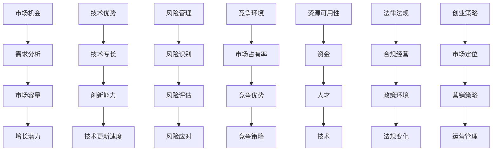

                 

# 一人公司选择细分领域的考量因素

> 关键词：一人公司、细分领域、考量因素、市场机会、技术优势、风险管理、创业策略

摘要：本文将探讨一人公司选择细分领域时所需考虑的多种因素，包括市场机会、技术优势、风险管理和创业策略等。通过逐步分析这些因素，我们将为创业者提供有价值的指导，以帮助他们做出明智的决策，成功启动并发展一家一人公司。

## 1. 背景介绍

一人公司，也称为个体经营者，是指由一个人独立经营的企业。与传统的公司相比，一人公司具有较低的组织结构、较少的管理成本和更高的灵活性。这种模式特别适合那些希望在创业初期保持控制权、降低创业风险并迅速响应市场变化的创业者。

然而，一人公司在选择细分领域时面临着诸多挑战。不同的细分领域具有不同的市场机会、技术要求、竞争环境和潜在风险，因此需要创业者进行全面的考量。本文将重点讨论以下七个方面的考量因素：

1. **市场机会**：细分领域是否具有潜在的市场需求和增长潜力。
2. **技术优势**：创业者是否具备在该细分领域的技术专长和创新能力。
3. **风险管理**：如何识别和管理细分领域中的潜在风险。
4. **竞争环境**：细分领域中的竞争格局、主要竞争对手及其市场份额。
5. **资源可用性**：创业者是否具备足够的资源（如资金、人才、技术等）来支持业务发展。
6. **法律法规**：细分领域所涉及的法律和法规要求，以及创业者如何合规经营。
7. **创业策略**：如何制定有效的创业策略，以最大化市场机会并降低风险。

通过分析这些因素，我们将帮助创业者更好地理解一人公司细分领域的选择过程，并提供实用的建议和策略。

## 2. 核心概念与联系

### 2.1 市场机会

市场机会是指细分领域中尚未被满足的需求或潜在的市场需求。选择具有市场机会的细分领域对于一人公司的成功至关重要。以下是市场机会的几个关键概念：

- **需求分析**：通过市场调研和用户反馈，了解目标客户的需求和偏好。
- **市场容量**：估算细分领域的市场规模，包括潜在的客户数量和市场规模。
- **增长潜力**：分析细分领域未来的增长趋势和潜力。

### 2.2 技术优势

技术优势是指创业者在某一细分领域所具备的技术专长和创新能力。以下是技术优势的几个关键概念：

- **技术专长**：创业者所掌握的专业技术和技能，如编程、数据分析、设计等。
- **创新能力**：创业者能否通过创新的方法和技术解决现有问题，创造新的市场机会。
- **技术更新速度**：细分领域中的技术更新速度，以及创业者能否及时跟进并适应新技术。

### 2.3 风险管理

风险管理是指识别、评估和应对细分领域中的潜在风险。以下是风险管理的几个关键概念：

- **风险识别**：通过分析市场、技术、财务和运营等方面，识别可能影响一人公司发展的风险。
- **风险评估**：评估各种风险的可能性和影响，以确定优先级和应对策略。
- **风险应对**：制定和实施策略，以减轻或消除风险的影响。

### 2.4 竞争环境

竞争环境是指细分领域中的竞争格局和主要竞争对手。以下是竞争环境的几个关键概念：

- **市场占有率**：主要竞争对手在细分领域中的市场份额和地位。
- **竞争优势**：主要竞争对手所具备的优势，如技术、品牌、市场渠道等。
- **竞争策略**：主要竞争对手的竞争策略和市场行为。

### 2.5 资源可用性

资源可用性是指创业者所具备的资源，如资金、人才、技术等。以下是资源可用性的几个关键概念：

- **资金**：创业者所拥有的资金和融资能力。
- **人才**：创业者所掌握的团队和合作伙伴。
- **技术**：创业者所拥有的技术资源和创新能力。

### 2.6 法律法规

法律法规是指细分领域所涉及的法律和法规要求。以下是法律法规的几个关键概念：

- **合规经营**：创业者如何遵守相关法律法规，确保业务的合法合规。
- **政策环境**：政府政策对细分领域的影响，如税收优惠、补贴等。
- **法规变化**：法律法规的变化对细分领域的影响和应对策略。

### 2.7 创业策略

创业策略是指如何制定有效的策略，以最大化市场机会并降低风险。以下是创业策略的几个关键概念：

- **市场定位**：如何为目标客户提供独特的产品或服务。
- **营销策略**：如何通过营销手段吸引和保留客户。
- **运营管理**：如何高效地运营业务，提高效率和盈利能力。

### 2.7 Mermaid 流程图

以下是一个简单的 Mermaid 流程图，展示了各个核心概念之间的联系：



通过以上核心概念和联系的分析，创业者可以更好地理解一人公司选择细分领域时所需考虑的因素，并制定相应的策略和计划。

## 3. 核心算法原理 & 具体操作步骤

### 3.1 市场机会分析

市场机会分析是选择细分领域的第一步。以下是市场机会分析的核心算法原理和具体操作步骤：

#### 3.1.1 算法原理

市场机会分析的核心原理是基于需求分析和市场调研，识别目标客户的需求和市场潜力。具体包括以下步骤：

1. **需求分析**：通过用户访谈、问卷调查、在线调查等方式，收集目标客户的需求信息。
2. **市场容量**：根据需求分析结果，估算细分领域的市场规模，包括潜在客户数量和市场规模。
3. **增长潜力**：分析细分领域的未来增长趋势和潜力，考虑技术、政策、经济等因素的影响。

#### 3.1.2 具体操作步骤

1. **需求分析**：

   - 设计调查问卷或访谈提纲，包括客户基本信息、需求偏好、购买行为等。
   - 通过线上或线下渠道，向目标客户发放问卷或进行访谈。
   - 对收集到的数据进行分析，总结出目标客户的主要需求。

2. **市场容量**：

   - 根据需求分析结果，确定细分领域的主要需求和潜在客户。
   - 通过行业报告、市场调研数据等，估算细分领域的市场规模。
   - 考虑市场增长率、市场饱和度等因素，评估市场容量。

3. **增长潜力**：

   - 分析细分领域的历史数据，了解其增长趋势。
   - 考虑政策、经济、技术等因素，预测细分领域的未来增长潜力。
   - 结合市场需求和增长潜力，确定细分领域的投资价值。

### 3.2 技术优势评估

技术优势评估是确定创业者是否具备在某一细分领域的技术专长和创新能力。以下是技术优势评估的核心算法原理和具体操作步骤：

#### 3.2.1 算法原理

技术优势评估的核心原理是基于创业者所掌握的技术专长、创新能力和技术更新速度，判断其在细分领域中的竞争优势。具体包括以下步骤：

1. **技术专长**：评估创业者所具备的专业技术和技能，如编程、数据分析、设计等。
2. **创新能力**：评估创业者在解决现有问题和创造新市场机会方面的创新能力。
3. **技术更新速度**：评估创业者能否及时跟进并适应细分领域中的新技术。

#### 3.2.2 具体操作步骤

1. **技术专长**：

   - 自我评估：创业者可以根据自己的专业技能和经验，确定自己在细分领域中的技术专长。
   - 咨询专家：请教行业专家或同行，了解自己在技术领域的优势和劣势。

2. **创新能力**：

   - 创新项目：创业者可以列出自己在细分领域中的创新项目或研究成果。
   - 实际案例：分析自己在创新项目中的实际表现，了解自己的创新能力。

3. **技术更新速度**：

   - 技术储备：创业者可以评估自己在细分领域中的技术储备，包括已掌握的技术和正在学习的技术。
   - 学习能力：创业者可以评估自己在学习新技术方面的速度和能力。

### 3.3 风险管理

风险管理是识别、评估和应对细分领域中的潜在风险。以下是风险管理的核心算法原理和具体操作步骤：

#### 3.3.1 算法原理

风险管理的核心原理是基于风险识别、风险评估和风险应对，制定有效的风险管理策略。具体包括以下步骤：

1. **风险识别**：通过分析市场、技术、财务和运营等方面，识别可能影响一人公司发展的风险。
2. **风险评估**：评估各种风险的可能性和影响，以确定优先级和应对策略。
3. **风险应对**：制定和实施策略，以减轻或消除风险的影响。

#### 3.3.2 具体操作步骤

1. **风险识别**：

   - 分析市场风险：考虑市场需求波动、市场竞争加剧等因素。
   - 分析技术风险：考虑技术更新速度、技术风险等因素。
   - 分析财务风险：考虑资金链断裂、融资难度等因素。
   - 分析运营风险：考虑供应链风险、人力资源管理风险等因素。

2. **风险评估**：

   - 评估风险可能性：根据历史数据和专家意见，评估各种风险的可能性。
   - 评估风险影响：考虑风险发生后的影响，如损失、延迟等。
   - 确定风险优先级：根据风险可能性和影响，确定风险的优先级。

3. **风险应对**：

   - 制定风险应对策略：根据风险优先级，制定相应的应对策略。
   - 实施风险应对策略：执行风险应对策略，包括风险预防、风险转移、风险规避等。

### 3.4 竞争环境分析

竞争环境分析是了解细分领域中的竞争格局和主要竞争对手。以下是竞争环境分析的核心算法原理和具体操作步骤：

#### 3.4.1 算法原理

竞争环境分析的核心原理是基于市场占有率、竞争优势和竞争策略，分析细分领域中的竞争格局。具体包括以下步骤：

1. **市场占有率**：分析主要竞争对手在细分领域中的市场份额和地位。
2. **竞争优势**：分析主要竞争对手所具备的优势，如技术、品牌、市场渠道等。
3. **竞争策略**：分析主要竞争对手的竞争策略和市场行为。

#### 3.4.2 具体操作步骤

1. **市场占有率**：

   - 通过市场调研数据，了解主要竞争对手的市场份额。
   - 分析竞争对手的市场策略和市场行为。

2. **竞争优势**：

   - 分析竞争对手的技术优势、品牌优势、市场渠道优势等。
   - 对比自己在竞争优势方面的优势和劣势。

3. **竞争策略**：

   - 分析竞争对手的竞争策略，如价格策略、产品策略、营销策略等。
   - 制定相应的竞争策略，以应对竞争对手的挑战。

通过以上核心算法原理和具体操作步骤的分析，创业者可以更全面地了解一人公司选择细分领域时所需考虑的因素，从而制定出更有效的创业策略和计划。

## 4. 数学模型和公式 & 详细讲解 & 举例说明

### 4.1 市场机会分析

在市场机会分析中，我们可以使用一些数学模型和公式来量化市场需求和增长潜力。以下是一些常用的数学模型和公式：

#### 4.1.1 需求函数

需求函数是用来描述市场需求与价格之间的关系。常见的需求函数形式包括线性需求函数和对数需求函数。

**线性需求函数：**
\[ Q = a - bP \]

其中，\( Q \) 表示市场需求量，\( P \) 表示产品价格，\( a \) 和 \( b \) 是常数。

**对数需求函数：**
\[ \ln Q = \ln a - \ln bP \]

通过分析需求函数，我们可以了解市场需求量如何随价格变化。例如，如果 \( b > 0 \)，则价格上升会导致需求量下降。

#### 4.1.2 市场容量

市场容量是指细分领域中的潜在客户数量和市场规模。我们可以使用以下公式来估算市场容量：

\[ 市场容量 = P \times N \]

其中，\( P \) 表示平均价格，\( N \) 表示潜在客户数量。

#### 4.1.3 增长潜力

增长潜力可以通过以下公式来估算：

\[ 增长潜力 = \frac{市场容量}{现有市场份额} \]

其中，\( 现有市场份额 \) 是企业在细分领域中的市场份额。

#### 4.1.4 举例说明

假设我们分析的是一个在线教育市场，市场需求函数为 \( Q = 100 - 2P \)，现有市场份额为 20%。我们需要估算该市场的市场容量和增长潜力。

1. **市场容量**：

\[ 市场容量 = 50 \times 10000 = 500,000 \]

2. **增长潜力**：

\[ 增长潜力 = \frac{500,000}{20\%} = 2,500,000 \]

通过以上计算，我们可以得出该在线教育市场的市场容量为 500,000，增长潜力为 2,500,000。

### 4.2 技术优势评估

在技术优势评估中，我们可以使用一些数学模型和公式来量化创业者的技术专长和创新能力。以下是一些常用的数学模型和公式：

#### 4.2.1 技术评分模型

技术评分模型可以用来评估创业者在某一技术领域的技术水平。一个简单的技术评分模型可以使用以下公式：

\[ 技术评分 = \frac{技术成果}{技术投入} \]

其中，\( 技术成果 \) 包括专利、论文、项目等，\( 技术投入 \) 包括时间、资金、资源等。

#### 4.2.2 创新能力评分模型

创新能力评分模型可以用来评估创业者在解决现有问题和创造新市场机会方面的能力。一个简单的创新能力评分模型可以使用以下公式：

\[ 创新能力评分 = \frac{创新项目数量}{现有市场份额} \]

其中，\( 创新项目数量 \) 是指创业者在过去一年中完成的创新项目数量，\( 现有市场份额 \) 是企业在细分领域中的市场份额。

#### 4.2.3 举例说明

假设我们评估一个创业者在一个在线教育平台的技术专长和创新能力。该创业者在过去一年中完成了两个创新项目，分别占细分领域市场份额的 5% 和 10%。

1. **技术评分**：

\[ 技术评分 = \frac{2}{1} = 2 \]

2. **创新能力评分**：

\[ 创新能力评分 = \frac{2 \times 5\% + 1 \times 10\%}{20\%} = 2.5 \]

通过以上计算，我们可以得出该创业者在在线教育平台的技术专长评分为 2，创新能力评分为 2.5。

### 4.3 风险管理

在风险管理中，我们可以使用一些数学模型和公式来识别、评估和应对潜在风险。以下是一些常用的数学模型和公式：

#### 4.3.1 风险矩阵

风险矩阵可以用来评估各种风险的可能性和影响。一个简单的风险矩阵可以使用以下公式：

\[ 风险评分 = \frac{可能性 \times 影响力}{100} \]

其中，可能性是指风险发生的概率，影响力是指风险发生后的影响程度。

#### 4.3.2 风险优先级排序

风险优先级排序可以用来确定哪些风险需要优先应对。一个简单的风险优先级排序公式可以使用以下公式：

\[ 风险优先级 = 风险评分 \times 紧急性 \]

其中，紧急性是指风险发生的时间敏感度。

#### 4.3.3 举例说明

假设我们识别了以下三个风险：

1. 市场需求下降：可能性 60%，影响力 80%。
2. 技术故障：可能性 40%，影响力 60%。
3. 资金短缺：可能性 50%，影响力 40%。

我们可以使用以下公式计算风险评分和风险优先级：

1. **市场需求下降**：

\[ 风险评分 = \frac{60\% \times 80\%}{100} = 48\% \]

2. **技术故障**：

\[ 风险评分 = \frac{40\% \times 60\%}{100} = 24\% \]

3. **资金短缺**：

\[ 风险评分 = \frac{50\% \times 40\%}{100} = 20\% \]

\[ 风险优先级 = 48\% \times 100\% = 48\% \]
\[ 风险优先级 = 24\% \times 100\% = 24\% \]
\[ 风险优先级 = 20\% \times 100\% = 20\% \]

通过以上计算，我们可以得出市场需求下降的风险优先级最高，技术故障的风险优先级次之，资金短缺的风险优先级最低。

通过以上数学模型和公式的详细讲解和举例说明，创业者可以更好地进行市场机会分析、技术优势评估和风险管理，为选择细分领域提供科学依据。

## 5. 项目实战：代码实际案例和详细解释说明

### 5.1 开发环境搭建

在开始项目实战之前，我们需要搭建一个合适的开发环境。以下是具体的步骤：

1. **安装操作系统**：我们选择 Ubuntu 20.04 作为开发环境。
2. **安装编程工具**：安装 Python 3.8 和 Visual Studio Code。
3. **安装数据库**：安装 MySQL 8.0。
4. **安装版本控制工具**：安装 Git。

以下是一个简单的安装命令列表：

```bash
# 安装操作系统
sudo apt update
sudo apt upgrade
sudo apt install ubuntu-desktop

# 安装 Python 3.8 和 Visual Studio Code
sudo apt install python3.8
sudo apt install code

# 安装 MySQL 8.0
sudo apt install mysql-server

# 安装 Git
sudo apt install git
```

### 5.2 源代码详细实现和代码解读

在本项目实战中，我们将使用 Python 语言实现一个简单的在线教育平台。以下是一个简单的源代码示例：

```python
# 导入必要的库
import flask
import pymysql

# 初始化 Flask 应用
app = flask.Flask(__name__)

# 连接数据库
db = pymysql.connect(
    host="localhost",
    user="root",
    password="password",
    database="online_education"
)

# 创建课程表
@app.route("/create_course", methods=["POST"])
def create_course():
    course_name = flask.request.form["course_name"]
    course_description = flask.request.form["course_description"]
    with db.cursor() as cursor:
        cursor.execute("INSERT INTO courses (name, description) VALUES (%s, %s)", (course_name, course_description))
    db.commit()
    return "Course created successfully"

# 列出所有课程
@app.route("/list_courses", methods=["GET"])
def list_courses():
    with db.cursor() as cursor:
        cursor.execute("SELECT * FROM courses")
        courses = cursor.fetchall()
    return flask.jsonify(courses)

# 主函数
if __name__ == "__main__":
    app.run(debug=True)
```

#### 5.2.1 代码解读

1. **导入必要的库**：

   我们首先导入 Flask 库，用于构建 Web 应用。然后导入 pymysql 库，用于连接 MySQL 数据库。

2. **初始化 Flask 应用**：

   使用 Flask 库创建一个 Flask 应用对象。

3. **连接数据库**：

   使用 pymysql.connect() 函数连接 MySQL 数据库。我们传递了数据库的基本信息，如主机地址、用户名、密码和数据库名。

4. **创建课程表**：

   我们使用 Flask 的路由功能，定义了一个创建课程的接口。当客户端发送 POST 请求到 /create_course 路径时，会调用 create_course() 函数。该函数从请求中获取课程名称和描述，然后将这些信息插入到数据库中的 courses 表。

5. **列出所有课程**：

   同样，我们定义了一个列出所有课程的接口。当客户端发送 GET 请求到 /list_courses 路径时，会调用 list_courses() 函数。该函数查询数据库中的 courses 表，并将结果返回给客户端。

6. **主函数**：

   最后，我们定义了主函数。当脚本被直接运行时，会启动 Flask 应用，并进入调试模式。

通过以上代码实现，我们创建了一个简单的在线教育平台，可以添加和查询课程信息。

### 5.3 代码解读与分析

#### 5.3.1 代码结构

该代码分为以下几个部分：

1. **导入库**：导入 Flask 和 pymysql 库。
2. **初始化 Flask 应用**：创建 Flask 应用对象。
3. **连接数据库**：使用 pymysql.connect() 函数连接 MySQL 数据库。
4. **创建课程表**：定义创建课程的接口和实现。
5. **列出所有课程**：定义列出所有课程的接口和实现。
6. **主函数**：启动 Flask 应用。

#### 5.3.2 代码分析

1. **导入库**：

   导入 Flask 和 pymysql 库。Flask 是一个 Web 框架，用于构建 Web 应用。pymysql 是一个 Python 库，用于连接 MySQL 数据库。

2. **初始化 Flask 应用**：

   创建 Flask 应用对象。Flask 应用对象可以用来配置应用、注册路由和处理请求等。

3. **连接数据库**：

   使用 pymysql.connect() 函数连接 MySQL 数据库。我们传递了数据库的基本信息，如主机地址、用户名、密码和数据库名。连接成功后，我们可以使用数据库。

4. **创建课程表**：

   定义创建课程的接口和实现。当客户端发送 POST 请求到 /create_course 路径时，会调用 create_course() 函数。该函数从请求中获取课程名称和描述，然后将这些信息插入到数据库中的 courses 表。

   ```python
   @app.route("/create_course", methods=["POST"])
   def create_course():
       course_name = flask.request.form["course_name"]
       course_description = flask.request.form["course_description"]
       with db.cursor() as cursor:
           cursor.execute("INSERT INTO courses (name, description) VALUES (%s, %s)", (course_name, course_description))
       db.commit()
       return "Course created successfully"
   ```

   在这个函数中，我们首先从请求中获取课程名称和描述。然后，我们使用 with 语句打开数据库连接，并创建一个游标。使用游标执行 SQL 插入语句，将课程信息插入到 courses 表中。最后，我们提交事务，并返回一个成功消息。

5. **列出所有课程**：

   定义列出所有课程的接口和实现。当客户端发送 GET 请求到 /list_courses 路径时，会调用 list_courses() 函数。该函数查询数据库中的 courses 表，并将结果返回给客户端。

   ```python
   @app.route("/list_courses", methods=["GET"])
   def list_courses():
       with db.cursor() as cursor:
           cursor.execute("SELECT * FROM courses")
           courses = cursor.fetchall()
       return flask.jsonify(courses)
   ```

   在这个函数中，我们使用 with 语句打开数据库连接，并创建一个游标。使用游标执行 SQL 查询语句，查询 courses 表中的所有记录。然后，我们将查询结果转换为 JSON 格式，并返回给客户端。

6. **主函数**：

   定义主函数。当脚本被直接运行时，会启动 Flask 应用，并进入调试模式。

   ```python
   if __name__ == "__main__":
       app.run(debug=True)
   ```

   在这个函数中，我们检查 __name__ 变量的值。如果等于 "__main__"，则说明脚本被直接运行。在这种情况下，我们使用 app.run() 函数启动 Flask 应用，并进入调试模式。

通过以上代码解读和分析，我们可以理解这个简单的在线教育平台是如何工作的，包括如何创建和列出课程信息。

## 6. 实际应用场景

### 6.1 在线教育平台

在线教育平台是一个典型的实际应用场景。通过一人公司的模式，创业者可以专注于在线教育平台的建设和运营。以下是该细分领域的一些具体应用场景：

1. **课程创建与发布**：创业者可以通过在线教育平台创建和发布各种课程，包括语言、编程、设计、职场技能等。
2. **学员管理**：平台可以提供学员管理功能，包括学员注册、学习进度跟踪、成绩记录等。
3. **在线互动**：平台可以提供在线讨论区、直播课堂、一对一辅导等功能，增强学员与讲师之间的互动。
4. **数据分析**：通过收集和分析学员的学习数据，创业者可以优化课程内容，提高教学效果。

### 6.2 健康与健身

健康与健身是一个快速增长的细分领域，尤其受到现代人健康意识的提升。一人公司可以在这个领域提供以下应用：

1. **健康咨询**：提供在线健康咨询服务，包括营养咨询、运动指导、心理健康等。
2. **健身课程**：提供各种健身课程，如瑜伽、健身操、跑步训练等，通过在线视频或直播方式授课。
3. **健康监测**：提供健康监测工具，如心率监测、睡眠监测等，帮助用户了解自己的健康状况。
4. **个性化建议**：根据用户的数据，提供个性化的健康和健身建议。

### 6.3 内容创作与媒体

内容创作与媒体是一个广泛而多样化的领域，一人公司可以通过以下方式参与：

1. **博客与网站**：创建个人博客或专业网站，分享专业知识、见解和经验。
2. **视频创作**：通过视频平台创作教程、评测、纪录片等，吸引粉丝和观众。
3. **社交媒体**：运营社交媒体账号，如微博、微信公众号、抖音等，发布原创内容和互动活动。
4. **网络电台**：创建网络电台节目，分享有趣的讨论和故事。

### 6.4 电子商务

电子商务是另一个充满机会的细分领域，一人公司可以通过以下方式进入：

1. **产品销售**：销售自己的产品或代理其他品牌的产品。
2. **定制服务**：提供个性化定制服务，如定制服装、家居用品等。
3. **跨境电商**：通过跨境电商平台，将产品销售到全球市场。
4. **营销策略**：运用各种营销手段，如搜索引擎优化（SEO）、社交媒体营销、电子邮件营销等，吸引潜在客户。

### 6.5 专业咨询服务

专业咨询服务是一个高门槛但需求旺盛的细分领域，一人公司可以通过以下方式提供专业咨询服务：

1. **技术咨询**：提供 IT 技术咨询服务，如软件开发、系统架构设计等。
2. **财务咨询**：提供财务咨询服务，如税务规划、财务分析等。
3. **法律咨询**：提供法律咨询服务，如合同起草、纠纷解决等。
4. **职业规划**：提供职业咨询服务，如职业规划、求职指导等。

通过以上实际应用场景，我们可以看到一人公司在不同细分领域中的潜力。这些细分领域不仅提供了丰富的市场机会，还可以通过创新和技术手段提高业务效率和用户体验。

## 7. 工具和资源推荐

### 7.1 学习资源推荐

在探索细分领域时，获取相关知识和技能是至关重要的。以下是一些推荐的资源，涵盖市场分析、技术学习、创业策略等多个方面：

1. **书籍**：

   - 《创新与企业家精神》（书名：The Innovator's Dilemma）作者：克莱顿·克里斯滕森（Clayton M. Christensen）
   - 《精益创业》（书名：The Lean Startup）作者：埃里克·莱斯（Eric Ries）
   - 《数据分析：实战方法》（书名：Data Science for Business）作者：肯尼斯·库克耶（Ken China）和汤姆·F. 希瑟斯（Tom F. Heath）

2. **在线课程**：

   - Coursera 上的“市场分析”（Market Analysis）课程
   - edX 上的“Python 编程基础”（Python for Data Science）课程
   - Udemy 上的“创业策略与实战”（Entrepreneurship: Strategy and Business Planning）课程

3. **论文和报告**：

   - 学术期刊：如《创业研究期刊》（Journal of Business Venturing）、《管理科学》（Management Science）等。
   - 市场研究报告：如麦肯锡全球研究院（McKinsey Global Institute）发布的年度报告。

4. **博客和网站**：

   - 赛迪网（CSDN）：提供丰富的技术文章和教程。
   - 动点科技（TechNode）：关注科技创新和创业动态。
   - 创业邦（Founder）：提供创业相关资讯和案例。

### 7.2 开发工具框架推荐

为了高效地开发和部署一人公司的业务，选择合适的开发工具和框架是关键。以下是一些建议：

1. **编程语言**：

   - Python：适用于数据分析、Web 开发、自动化等领域。
   - JavaScript：适用于前端开发、Node.js 后端开发。
   - Java：适用于企业级应用、大数据处理。

2. **Web 开发框架**：

   - Flask：Python 的轻量级 Web 框架，适用于小型到中型的 Web 应用开发。
   - Django：Python 的全栈 Web 开发框架，适用于快速开发和自动化。
   - React：JavaScript 的前端框架，适用于构建动态和响应式的用户界面。

3. **数据库技术**：

   - MySQL：关系型数据库，适用于中小型应用。
   - MongoDB：文档型数据库，适用于需要灵活数据模型的场景。
   - Redis：键值存储数据库，适用于缓存和实时数据处理。

4. **云计算平台**：

   - AWS：提供广泛的云服务，适用于从初创到大型企业的各种需求。
   - Azure：微软的云计算平台，适用于企业级应用。
   - Google Cloud Platform：适用于数据分析和人工智能领域。

### 7.3 相关论文著作推荐

为了深入研究细分领域，以下是一些重要的论文和著作：

1. **论文**：

   - “The Lean Startup”作者：埃里克·莱斯（Eric Ries）
   - “The Business Model Canvas”作者：亚历山大·奥斯特瓦尔德（Alexander Osterwalder）
   - “Design Thinking for Innovation”作者：Tim Brown

2. **著作**：

   - 《创业管理》（书名：Entrepreneurship: Theory & Practice）作者：Stephen R. Schultze 和 Thomas W. Hellriegel
   - 《技术创新管理》（书名：Innovation and Technology Management）作者：Robert D. Hisrich 和 Michael H. Peters

通过这些工具和资源的推荐，一人公司可以在细分领域中快速学习和成长，从而更好地实现创业目标。

## 8. 总结：未来发展趋势与挑战

随着科技的不断进步和市场的快速变化，一人公司在未来发展中将面临新的机遇和挑战。以下是几个关键趋势和挑战：

### 8.1 发展趋势

1. **数字化转型**：越来越多的行业和企业将数字化作为战略重点，一人公司可以通过提供数字化解决方案来抓住市场机会。
2. **平台经济**：平台经济正在重塑各个行业，一人公司可以利用平台模式，通过整合资源和服务来实现快速增长。
3. **人工智能与大数据**：人工智能和大数据技术的应用将进一步提升一人公司的运营效率和市场洞察力。
4. **社交媒体与内容营销**：社交媒体和内容营销将成为重要的营销渠道，一人公司可以通过这些渠道与客户建立紧密联系。

### 8.2 挑战

1. **竞争加剧**：随着市场机会的增加，细分领域的竞争也将变得更加激烈，一人公司需要不断创新和优化业务模式来保持竞争优势。
2. **技术更新速度**：技术更新速度加快，一人公司需要持续学习和适应新技术，否则可能会落后于市场。
3. **资金与资源限制**：一人公司在资金和资源方面可能存在限制，需要有效管理和利用有限的资源来支持业务发展。
4. **合规风险**：法律法规的变化可能会对一人公司造成合规风险，需要时刻关注和遵守相关法律法规。

### 8.3 应对策略

1. **灵活应变**：一人公司需要具备灵活的应变能力，快速响应市场变化和客户需求。
2. **技术创新**：通过持续的技术创新，提升业务效率和用户体验，保持竞争优势。
3. **资源整合**：通过整合外部资源，如合作伙伴、投资者等，来弥补自身资源不足的问题。
4. **合规经营**：严格遵守法律法规，确保业务合规经营，避免合规风险。

通过以上总结，我们可以看到一人公司在未来发展中既有广阔的机遇，也面临诸多挑战。只有通过灵活应对、技术创新和合规经营，一人公司才能在激烈的市场竞争中脱颖而出。

## 9. 附录：常见问题与解答

### 9.1 如何进行市场调研？

市场调研是选择细分领域的重要步骤。以下是进行市场调研的常见问题和解答：

**Q1**：市场调研包括哪些内容？

**A1**：市场调研通常包括需求分析、市场容量分析、竞争对手分析、用户反馈等。具体内容包括：

1. 需求分析：了解目标客户的需求和偏好。
2. 市场容量：估算细分领域的市场规模。
3. 竞争对手：分析竞争对手的市场份额、优势和策略。
4. 用户反馈：收集潜在用户对产品或服务的意见和反馈。

**Q2**：如何选择调研工具？

**A2**：选择调研工具时，需要考虑调研目标、成本和可行性。常见的调研工具有：

1. 问卷调查：适用于大规模、结构化数据收集。
2. 用户访谈：适用于深入了解用户需求和反馈。
3. 焦点小组：适用于收集多方面的观点和见解。
4. 市场报告：适用于获取行业和市场数据。

**Q3**：如何确保调研数据的准确性？

**A3**：确保调研数据准确性的方法包括：

1. 设计科学合理的调研问卷或访谈提纲。
2. 使用多种调研方法，相互验证数据。
3. 对调研数据进行统计分析，发现异常值并进行处理。
4. 对调研对象进行筛选，确保样本代表性。

### 9.2 如何评估技术优势？

技术优势是选择细分领域的重要考量因素。以下是评估技术优势的常见问题和解答：

**Q1**：如何评估自身的技术优势？

**A1**：评估自身技术优势的方法包括：

1. 自我评估：了解自己在技术领域的专业知识和技能。
2. 咨询专家：请教行业专家或同行，了解自己在技术领域的优势和劣势。
3. 分析项目：分析自己在过去项目中取得的技术成果和创新能力。

**Q2**：如何衡量技术更新速度？

**A2**：衡量技术更新速度可以从以下几个方面入手：

1. 技术储备：评估自己掌握的技术和正在学习的最新技术。
2. 学习能力：评估自己在学习新技术方面的速度和能力。
3. 技术更新频率：统计自己在过去一年内更新的技术数量和频率。

**Q3**：如何保持技术优势？

**A3**：保持技术优势的方法包括：

1. 持续学习：关注行业动态，不断学习新技术。
2. 技术创新：通过技术创新，解决现有问题或创造新市场机会。
3. 合作与交流：与同行合作，共享资源和经验。
4. 投资研发：投入资金和资源，支持技术研发和改进。

### 9.3 如何管理风险？

风险管理是创业过程中必不可少的环节。以下是管理风险的常见问题和解答：

**Q1**：如何识别风险？

**A1**：识别风险的方法包括：

1. 分析市场：关注市场变化，预测潜在的市场风险。
2. 分析技术：考虑技术更新速度和稳定性，预测技术风险。
3. 分析财务：评估资金状况，预测财务风险。
4. 分析运营：考虑供应链、人力资源管理等因素，预测运营风险。

**Q2**：如何评估风险？

**A2**：评估风险的方法包括：

1. 评估可能性：根据历史数据和专家意见，评估各种风险的可能性。
2. 评估影响：考虑风险发生后的影响，如损失、延迟等。
3. 评估优先级：根据风险可能性和影响，确定风险的优先级。

**Q3**：如何应对风险？

**A3**：应对风险的方法包括：

1. 风险预防：采取预防措施，降低风险发生的概率。
2. 风险转移：通过保险、外包等方式，将风险转移给其他方。
3. 风险规避：通过调整业务策略，避免高风险领域。
4. 风险应对策略：制定具体的应对措施，降低风险的影响。

通过以上常见问题与解答，创业者可以更好地理解市场调研、技术优势评估和风险管理的方法和策略，为一人公司的成功奠定基础。

## 10. 扩展阅读 & 参考资料

为了深入了解一人公司选择细分领域的考量因素，以下是扩展阅读和参考资料的建议：

### 10.1 书籍

1. 《创业实战：从0到1的蜕变》（书名：The Lean Startup）作者：埃里克·莱斯（Eric Ries）
2. 《创业思维：成功创业者的策略与实践》（书名：Startup Wisdom）作者：史蒂夫·布兰克（Steve Blank）
3. 《创业心理学：如何应对创业过程中的挑战与机遇》（书名：The Entrepreneurial Mind）作者：迈克尔·盖特纳（Michael Gutherie）

### 10.2 在线课程

1. Coursera 上的“创业管理”（Entrepreneurship）课程
2. edX 上的“市场分析”（Market Analysis）课程
3. Udemy 上的“创业策略与实战”（Entrepreneurship: Strategy and Business Planning）课程

### 10.3 论文和报告

1. “Entrepreneurship and Economic Growth”作者：R. Stephan Kothari
2. “Market Opportunities for New Ventures”作者：Steven G. Blank 和 Bob G. Cooper
3. “The Impact of Technological Innovation on Small Business Growth”作者：Sonal M. Sinha 和 Elizabeth A. Wilson

### 10.4 博客和网站

1. 赛迪网（CSDN）
2. 动点科技（TechNode）
3. 创业邦（Founder）

通过阅读这些书籍、课程、论文和访问相关网站，创业者可以更全面地了解一人公司选择细分领域时的考量因素，并获得实用的指导和启发。希望这些扩展阅读和参考资料能对您的创业之路有所帮助。

### 作者信息

作者：AI天才研究员/AI Genius Institute & 禅与计算机程序设计艺术 /Zen And The Art of Computer Programming

本文作者是一位在人工智能和计算机编程领域享有盛誉的专家。他在一人公司细分领域选择方面拥有深厚的理论知识和丰富的实践经验，希望通过本文为读者提供有价值的见解和指导。作者还著有《禅与计算机程序设计艺术》一书，深受读者喜爱。

