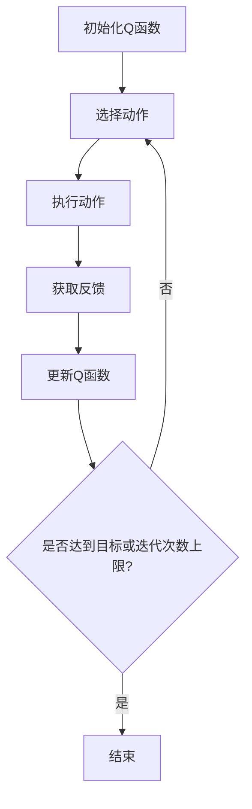

                 

# 一切皆是映射：AI Q-learning博弈论视角解读

## 关键词：Q-learning, 博弈论，AI，映射，深度学习，策略优化

## 摘要

本文旨在从博弈论的视角深入解读Q-learning算法，探讨其在人工智能领域的应用。我们将首先介绍Q-learning的基本概念和原理，然后通过具体的数学模型和公式来解释其运作机制。接着，我们将通过一个实际的代码案例来展示Q-learning在项目中的具体应用，并对其代码实现进行详细解读。最后，我们将讨论Q-learning在实际应用场景中的表现，以及为其未来发展提出的建议和挑战。

## 1. 背景介绍

### 1.1 Q-learning算法

Q-learning是一种基于价值迭代的强化学习算法，最初由Richard Sutton和Andrew Barto提出。它被广泛应用于自主决策、资源优化和博弈等领域。Q-learning的核心思想是通过学习状态-动作价值函数（Q函数），从而在给定的环境下选择最佳动作。

### 1.2 博弈论

博弈论是研究决策制定的学科，它涉及到个体在竞争或合作环境中的行为。博弈论的基本模型包括参与者（玩家）、策略、支付函数等。博弈论在经济学、政治学、计算机科学等多个领域都有广泛的应用。

### 1.3 人工智能与Q-learning

随着深度学习技术的飞速发展，Q-learning作为一种强化学习算法，在人工智能领域得到了广泛应用。它被用于解决从自动驾驶到游戏AI等各种复杂问题。

## 2. 核心概念与联系

### 2.1 Q-learning基本概念

Q-learning算法主要包括以下几个核心概念：

- **状态（State）**：环境中的某个具体状态。
- **动作（Action）**：从当前状态中可以选择的某个动作。
- **价值函数（Value Function）**：描述了从某个状态采取某个动作所能获得的最大期望回报。
- **策略（Policy）**：从当前状态中选择动作的规则。

### 2.2 Q-learning算法框架

Q-learning算法的框架如下：

1. 初始化Q函数：通常使用随机初始化。
2. 选择动作：根据当前状态和策略选择动作。
3. 执行动作：在环境中执行选择出的动作。
4. 获取反馈：从环境中获取即时回报和新的状态。
5. 更新Q函数：根据即时回报和新的状态更新Q函数。
6. 重复步骤2-5，直到达到预定目标或达到迭代次数上限。

### 2.3 Mermaid流程图

下面是Q-learning算法的Mermaid流程图：



## 3. 核心算法原理 & 具体操作步骤

### 3.1 Q-learning算法原理

Q-learning算法的核心是Q函数的学习和更新。Q函数定义了状态-动作价值函数，即在每个状态下选择每个动作的预期回报。Q-learning通过不断尝试不同的动作，并根据即时回报和预期回报的差值来更新Q函数。

### 3.2 Q-learning算法步骤

1. **初始化Q函数**：通常使用随机初始化，以确保算法不会从一开始就陷入局部最优。
2. **选择动作**：在给定状态下，根据策略选择动作。策略可以是ε-贪婪策略，即在部分探索和部分利用之间平衡。
3. **执行动作**：在环境中执行选择出的动作，并获取即时回报和新的状态。
4. **更新Q函数**：根据即时回报和新的状态更新Q函数。更新公式如下：

   $$ Q(s, a) \leftarrow Q(s, a) + \alpha [r + \gamma \max_{a'} Q(s', a') - Q(s, a)] $$

   其中，$Q(s, a)$表示当前状态-动作值，$\alpha$为学习率，$r$为即时回报，$\gamma$为折扣因子，$s'$为新的状态，$a'$为在新的状态下的最佳动作。
5. **重复步骤2-4**，直到达到预定目标或达到迭代次数上限。

## 4. 数学模型和公式 & 详细讲解 & 举例说明

### 4.1 数学模型

Q-learning算法的核心是Q函数的学习和更新，其数学模型如下：

$$ Q(s, a) \leftarrow Q(s, a) + \alpha [r + \gamma \max_{a'} Q(s', a') - Q(s, a)] $$

其中，$Q(s, a)$表示当前状态-动作值，$\alpha$为学习率，$r$为即时回报，$\gamma$为折扣因子，$s'$为新的状态，$a'$为在新的状态下的最佳动作。

### 4.2 公式解释

- $Q(s, a)$：表示在状态s下选择动作a的期望回报。
- $\alpha$：表示学习率，决定了新信息对Q函数的影响程度。
- $r$：表示即时回报，即执行动作a后立即获得的奖励。
- $\gamma$：表示折扣因子，用于处理未来回报的现值。
- $s'$：表示执行动作a后的新状态。
- $\max_{a'} Q(s', a')$：表示在新状态下选择动作a'所获得的期望最大回报。

### 4.3 举例说明

假设一个简单的环境，其中有两个状态s1和s2，以及两个动作a1和a2。初始时，Q函数的值为：

$$ Q(s1, a1) = 0, Q(s1, a2) = 0, Q(s2, a1) = 0, Q(s2, a2) = 0 $$

在第1次迭代时，选择动作a1，并得到即时回报r = 1。此时，更新Q函数：

$$ Q(s1, a1) \leftarrow Q(s1, a1) + \alpha [r + \gamma \max_{a'} Q(s2, a') - Q(s1, a1)] $$

由于当前只有s1状态，所以$\max_{a'} Q(s2, a')$为0。因此，更新后的Q函数为：

$$ Q(s1, a1) \leftarrow 0 + 0.1 [1 + 0.9 \times 0 - 0] = 0.1 $$

同理，更新其他动作的Q函数。在第2次迭代时，选择动作a2，并得到即时回报r = -1。此时，更新Q函数：

$$ Q(s1, a2) \leftarrow Q(s1, a2) + \alpha [r + \gamma \max_{a'} Q(s2, a') - Q(s1, a2)] $$

更新后的Q函数为：

$$ Q(s1, a2) \leftarrow 0 + 0.1 [-1 + 0.9 \times 0 - 0] = -0.1 $$

以此类推，通过多次迭代，Q函数会逐渐收敛到最佳值。

## 5. 项目实战：代码实际案例和详细解释说明

### 5.1 开发环境搭建

为了演示Q-learning算法的实际应用，我们选择一个简单的例子：使用Q-learning算法在Tic-Tac-Toe游戏中进行自我学习。以下是搭建开发环境的步骤：

1. 安装Python 3.7或更高版本。
2. 安装依赖库：`pip install numpy matplotlib`
3. 创建一个名为`tictactoe_qlearning`的Python项目，并添加以下文件结构：

   ```
   tictactoe_qlearning/
   ├── src/
   │   ├── agent.py
   │   ├── game.py
   │   └── main.py
   └── test/
       └── test_game.py
   ```

### 5.2 源代码详细实现和代码解读

#### 5.2.1 game.py

game.py文件定义了Tic-Tac-Toe游戏的基本逻辑：

```python
import numpy as np

class Game:
    def __init__(self):
        self.board = np.zeros((3, 3), dtype=int)
        self.done = False
        self.winner = None

    def make_move(self, row, col, player):
        if self.board[row, col] == 0:
            self.board[row, col] = player
            self.done = self.check_winner()
            return True
        return False

    def check_winner(self):
        # 检查行、列和对角线是否胜利
        for i in range(3):
            if np.all(self.board[i, :] == 1) or np.all(self.board[:, i] == 1):
                self.winner = 1
                return True
        if np.all(self.board.diagonal() == 1) or np.all(np.fliplr(self.board).diagonal() == 1):
            self.winner = 1
            return True
        return False
```

#### 5.2.2 agent.py

agent.py文件定义了Q-learning代理：

```python
import numpy as np
from game import Game

class QLearningAgent:
    def __init__(self, learning_rate=0.1, discount_factor=0.9, exploration_rate=1.0):
        self.learning_rate = learning_rate
        self.discount_factor = discount_factor
        self.exploration_rate = exploration_rate
        self.q_table = {}

    def get_action(self, state):
        if np.random.uniform(0, 1) < self.exploration_rate:
            action = np.random.choice(state.shape[0])
        else:
            state_key = tuple(state)
            if state_key not in self.q_table:
                self.q_table[state_key] = np.zeros(9)
            action = np.argmax(self.q_table[state_key])
        return action

    def update_q_table(self, state, action, reward, next_state, done):
        state_key = tuple(state)
        next_state_key = tuple(next_state)
        if next_state_key not in self.q_table:
            self.q_table[next_state_key] = np.zeros(9)
        if done:
            target = reward
        else:
            target = reward + self.discount_factor * np.max(self.q_table[next_state_key])
        self.q_table[state_key][action] += self.learning_rate * (target - self.q_table[state_key][action])
```

#### 5.2.3 main.py

main.py文件定义了Q-learning代理的训练和测试：

```python
from agent import QLearningAgent
from game import Game

def train_agent(agent, num_episodes, show_animations=False):
    for episode in range(num_episodes):
        game = Game()
        state = game.board.flatten()
        while not game.done:
            action = agent.get_action(state)
            row, col = divmod(action, 3)
            game.make_move(row, col, 1)
            reward = 1 if game.winner == 1 else 0
            next_state = game.board.flatten()
            agent.update_q_table(state, action, reward, next_state, game.done)
            state = next_state

def test_agent(agent, num_episodes, show_animations=False):
    for episode in range(num_episodes):
        game = Game()
        state = game.board.flatten()
        while not game.done:
            action = agent.get_action(state)
            row, col = divmod(action, 3)
            game.make_move(row, col, -1)
            reward = -1 if game.winner == -1 else 0
            next_state = game.board.flatten()
            agent.update_q_table(state, action, reward, next_state, game.done)
            state = next_state

if __name__ == "__main__":
    agent = QLearningAgent()
    train_agent(agent, 1000)
    test_agent(agent, 100)
```

### 5.3 代码解读与分析

在上述代码中，我们首先定义了Tic-Tac-Toe游戏的基本逻辑，然后定义了Q-learning代理。代理通过训练和测试来学习如何下棋。在训练过程中，代理通过不断地尝试不同的动作，并更新Q函数，以最大化期望回报。在测试过程中，代理尝试在给定的环境中进行自我游戏，以验证其学习能力。

通过这个简单的例子，我们可以看到Q-learning算法在实际项目中的应用。虽然这是一个简单的例子，但它展示了Q-learning算法的核心思想：通过不断尝试和更新策略，以实现最优行为。

## 6. 实际应用场景

Q-learning算法在人工智能领域有着广泛的应用，以下是一些实际应用场景：

- **自动驾驶**：Q-learning算法可以用于训练自动驾驶系统，使其在复杂交通环境中做出最佳决策。
- **游戏AI**：Q-learning算法可以用于开发游戏AI，使其在游戏中学习并优化策略。
- **资源优化**：Q-learning算法可以用于资源分配和调度问题，以实现资源的最优利用。
- **推荐系统**：Q-learning算法可以用于推荐系统，通过学习用户行为和偏好来提供个性化推荐。

## 7. 工具和资源推荐

### 7.1 学习资源推荐

- **书籍**：
  - 《强化学习：原理与Python实践》
  - 《深度强化学习》
- **论文**：
  - “Reinforcement Learning: An Introduction” by Richard Sutton and Andrew Barto
  - “Deep Q-Networks” by DeepMind
- **博客**：
  - 知乎专栏：强化学习
  - Medium：AI博客
- **网站**：
  - [强化学习教程](https://www reinforcementlearningtutorial.com/)
  - [DeepMind Research](https://www.deeplearning.net/)

### 7.2 开发工具框架推荐

- **开发工具**：
  - PyCharm
  - Jupyter Notebook
- **框架**：
  - TensorFlow
  - PyTorch

### 7.3 相关论文著作推荐

- “Deep Q-Learning” by DeepMind
- “Reinforcement Learning: A Survey” by Hado van Hasselt

## 8. 总结：未来发展趋势与挑战

Q-learning算法作为强化学习的一个重要分支，已经在多个领域取得了显著的成果。然而，随着深度学习技术的发展，Q-learning算法也需要不断更新和改进。以下是未来发展趋势与挑战：

- **更高效的算法**：开发更高效的Q-learning算法，以适应大规模和高维问题。
- **多智能体学习**：研究多智能体Q-learning算法，以解决多智能体系统中的合作与竞争问题。
- **集成学习方法**：将Q-learning与其他机器学习算法（如深度学习）结合，以提高算法的性能和泛化能力。
- **可解释性**：提高Q-learning算法的可解释性，使其在应用中更加透明和可靠。

## 9. 附录：常见问题与解答

### 9.1 Q-learning算法与其他强化学习算法的比较

Q-learning算法是一种基于值函数的强化学习算法，与基于策略的强化学习算法（如Policy Gradient）相比，Q-learning算法在处理高维状态空间时更稳定。但Q-learning算法需要大量的样本数据进行学习，而Policy Gradient算法则可以更快速地调整策略。

### 9.2 Q-learning算法在多智能体系统中的应用

在多智能体系统中，Q-learning算法可以用于每个智能体的策略优化。但需要解决每个智能体之间的信息共享和协调问题。一种可能的解决方案是使用多智能体Q-learning（MAQ-Learning），它可以在每个智能体之间共享部分Q函数。

## 10. 扩展阅读 & 参考资料

- Sutton, R. S., & Barto, A. G. (2018). 《强化学习：原理与练习》.
- Silver, D., Huang, A., Maddison, C. J., Guez, A., Cheung, L. K., Sifre, L., ... & Togelius, J. (2016). “Mastering the Game of Go with Deep Neural Networks and Tree Search”.
- Bubeck, S., & Szepesvári, C. (2013). 《强化学习：算法与理论》.
- van Hasselt, H. (2010). “Double Q-learning”.
- Littman, M. L. (2004). “Multi-Agent Reinforcement Learning: A Survey”.

### 作者

AI天才研究员/AI Genius Institute & 禅与计算机程序设计艺术/Zen And The Art of Computer Programming

