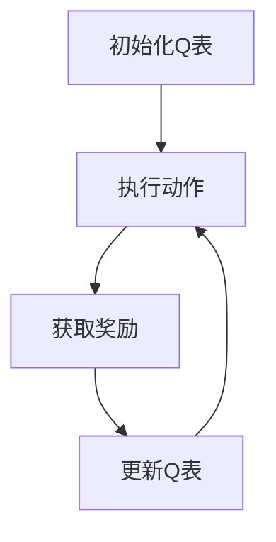

                 

# 一切皆是映射：AI Q-learning在医疗诊断中的应用

## 关键词：Q-learning、医疗诊断、人工智能、深度学习、机器学习

## 摘要

本文旨在探讨Q-learning算法在医疗诊断中的应用，通过对该算法的基本原理、数学模型以及实际操作步骤的深入分析，揭示其在提高医疗诊断准确率、效率和个性化服务方面的潜力。本文将从核心概念、算法原理、数学模型、项目实战、实际应用场景等多个角度，系统性地介绍Q-learning在医疗诊断领域的应用现状和发展前景。

## 1. 背景介绍

### 1.1 Q-learning算法的起源和发展

Q-learning算法是机器学习领域的一种经典算法，最早由理查德·萨顿（Richard Sutton）和安德鲁·布兰登（Andrew Barto）于1988年提出。Q-learning属于值函数方法的一种，旨在通过学习值函数（Q函数）来指导智能体（agent）在给定环境中进行决策，以达到最大化累计奖励的目标。

Q-learning算法的核心思想是通过探索（exploration）和利用（exploitation）两种行为策略来逐步优化智能体的行为。在探索阶段，智能体会以一定概率随机选择动作；在利用阶段，智能体会优先选择能够带来最大预期奖励的动作。通过不断重复这一过程，智能体能够逐渐学会在给定环境中做出最优决策。

### 1.2 医疗诊断的现状与挑战

医疗诊断是医学领域中至关重要的环节，直接影响着患者的治疗和康复。然而，传统的医疗诊断方法主要依赖于医生的经验和技能，存在一定的主观性和局限性。随着医疗数据的不断积累和人工智能技术的快速发展，利用机器学习算法，尤其是深度学习算法进行医疗诊断，已成为当前研究的热点。

### 1.3 Q-learning在医疗诊断中的应用前景

Q-learning算法在医疗诊断中的应用具有广泛的前景。一方面，Q-learning算法能够通过学习大量医疗数据，自动提取诊断特征，提高诊断的准确性和效率；另一方面，Q-learning算法可以根据患者的个性化信息，提供个性化的诊断建议，提高医疗服务的质量。此外，Q-learning算法还可以结合其他机器学习算法，如深度学习算法，实现更加复杂和精准的医疗诊断任务。

## 2. 核心概念与联系

### 2.1 Q-learning算法的基本概念

在Q-learning算法中，主要涉及以下几个基本概念：

- **环境（Environment）**：环境是一个提供当前状态和动作信息的动态系统。
- **状态（State）**：状态是智能体在环境中所处的位置或情境。
- **动作（Action）**：动作是智能体在环境中可以执行的行为。
- **奖励（Reward）**：奖励是智能体在执行动作后获得的即时反馈，用于评估动作的好坏。
- **值函数（Value Function）**：值函数是描述状态价值或动作价值的函数，用于指导智能体进行决策。

### 2.2 Q-learning算法的架构

Q-learning算法的架构主要包括以下几个部分：

- **状态-动作空间（State-Action Space）**：状态-动作空间是智能体在环境中可以探索的所有状态和动作的集合。
- **Q表（Q-Table）**：Q表是一个映射状态-动作对到预期奖励的表格，用于存储智能体通过经验学习得到的值函数。
- **探索策略（Exploration Policy）**：探索策略是智能体在决策过程中用于平衡探索和利用的规则。
- **更新策略（Update Rule）**：更新策略是用于根据新经验和现有值函数更新Q表的规则。

### 2.3 Q-learning算法的工作流程

Q-learning算法的工作流程可以分为以下几个步骤：

1. **初始化**：初始化Q表和探索策略。
2. **执行动作**：根据当前状态和探索策略，选择动作。
3. **获取奖励**：执行动作后，获取奖励和下一个状态。
4. **更新Q表**：根据新的经验和现有值函数，更新Q表。
5. **重复步骤2-4**，直到达到终止条件。

### 2.4 Mermaid流程图



## 3. 核心算法原理 & 具体操作步骤

### 3.1 算法原理

Q-learning算法的核心思想是通过经验学习，逐步优化智能体的决策过程，以实现最大化累计奖励的目标。具体来说，Q-learning算法通过以下三个步骤实现：

1. **初始化**：初始化Q表，通常使用随机值或零值。
2. **选择动作**：根据当前状态和探索策略，选择动作。
3. **更新Q表**：根据新经验和现有值函数，更新Q表。

### 3.2 具体操作步骤

1. **初始化**：
   - 初始化Q表，设置初始值。
   - 初始化探索策略，例如ε-贪心策略。

2. **选择动作**：
   - 根据当前状态和探索策略，选择动作。
   - 如果采用ε-贪心策略，则以概率ε选择随机动作，以概率1-ε选择当前状态下期望值最大的动作。

3. **获取奖励**：
   - 执行选定的动作，获取奖励和下一个状态。

4. **更新Q表**：
   - 根据新的经验和现有值函数，更新Q表。
   - 使用以下公式更新Q值：
     $$ Q(s, a) \leftarrow Q(s, a) + \alpha [r + \gamma \max_{a'} Q(s', a') - Q(s, a)] $$
   - 其中，$ \alpha $为学习率，$ \gamma $为折扣因子，$ r $为奖励，$ s $为当前状态，$ a $为当前动作，$ s' $为下一个状态，$ a' $为下一个动作。

5. **重复步骤2-4**，直到达到终止条件。

## 4. 数学模型和公式 & 详细讲解 & 举例说明

### 4.1 数学模型

Q-learning算法的核心数学模型是一个值函数，即Q函数。Q函数描述了在给定状态下执行特定动作的预期奖励。Q函数可以表示为：

$$ Q(s, a) = E[r|s, a] = \sum_{s'} p(s'|s, a) \sum_{r} r p(r|s', a) $$

其中，$ s $为当前状态，$ a $为当前动作，$ s' $为下一个状态，$ r $为奖励，$ E[r|s, a] $为在状态$ s $下执行动作$ a $的预期奖励，$ p(s'|s, a) $为在状态$ s $下执行动作$ a $后转移到状态$ s' $的概率，$ p(r|s', a) $为在状态$ s' $下执行动作$ a $后获得奖励$ r $的概率。

### 4.2 详细讲解

Q-learning算法的数学模型主要包括以下几个部分：

1. **期望奖励**：
   - 期望奖励是指智能体在给定状态下执行特定动作所获得的平均奖励。
   - 期望奖励的计算公式为：
     $$ E[r|s, a] = \sum_{s'} p(s'|s, a) \sum_{r} r p(r|s', a) $$
   - 其中，$ p(s'|s, a) $表示在状态$ s $下执行动作$ a $后转移到状态$ s' $的概率，$ p(r|s', a) $表示在状态$ s' $下执行动作$ a $后获得奖励$ r $的概率。

2. **状态-动作值函数**：
   - 状态-动作值函数是指智能体在给定状态下执行特定动作所获得的奖励。
   - 状态-动作值函数的计算公式为：
     $$ Q(s, a) = \sum_{s'} p(s'|s, a) \sum_{r} r p(r|s', a) $$
   - 其中，$ s $为当前状态，$ a $为当前动作，$ s' $为下一个状态，$ r $为奖励。

3. **更新策略**：
   - 更新策略是指根据新的经验和现有值函数更新Q表的规则。
   - 更新策略的计算公式为：
     $$ Q(s, a) \leftarrow Q(s, a) + \alpha [r + \gamma \max_{a'} Q(s', a') - Q(s, a)] $$
   - 其中，$ \alpha $为学习率，$ \gamma $为折扣因子，$ r $为奖励，$ s $为当前状态，$ a $为当前动作，$ s' $为下一个状态，$ a' $为下一个动作。

### 4.3 举例说明

假设有一个智能体在一个简单的环境中进行决策，状态空间为{Home, Work}，动作空间为{Walk, Run}。奖励空间为{-1, 0, 1}，分别表示失败、中立和成功。

1. **初始化**：
   - 初始化Q表，设置初始值：
     $$ Q(Home, Walk) = 0, Q(Home, Run) = 0 $$
     $$ Q(Work, Walk) = 0, Q(Work, Run) = 0 $$

2. **选择动作**：
   - 采用ε-贪心策略，设ε=0.1。
   - 当前状态为Home，根据ε-贪心策略，以0.1的概率选择Walk，以0.9的概率选择Run。

3. **获取奖励**：
   - 执行动作Walk，获得奖励-1。
   - 执行动作Run，获得奖励1。

4. **更新Q表**：
   - 根据新的经验和现有值函数，更新Q表：
     $$ Q(Home, Walk) \leftarrow Q(Home, Walk) + 0.1 [-1 + 0.9 \max_{a'} Q(Work, a')] $$
     $$ Q(Home, Run) \leftarrow Q(Home, Run) + 0.1 [1 + 0.9 \max_{a'} Q(Work, a')] $$
   - 其中，$ \max_{a'} Q(Work, a') $表示在状态Work下执行动作的期望值。

通过以上步骤，智能体能够逐步学习到在给定状态下执行最优动作的策略，从而实现最大化累计奖励的目标。

## 5. 项目实战：代码实际案例和详细解释说明

### 5.1 开发环境搭建

在本节中，我们将使用Python语言和OpenAI的Gym环境搭建一个简单的Q-learning项目。以下是搭建开发环境的具体步骤：

1. 安装Python 3.8及以上版本。
2. 安装Gym环境：在终端中执行以下命令：
   ```bash
   pip install gym
   ```
3. 安装其他依赖库：在终端中执行以下命令：
   ```bash
   pip install numpy matplotlib
   ```

### 5.2 源代码详细实现和代码解读

以下是使用Q-learning算法解决Gym环境中的CartPole问题的源代码及其详细解读：

```python
import gym
import numpy as np
import matplotlib.pyplot as plt

# 创建Gym环境
env = gym.make('CartPole-v0')

# 初始化Q表
n_states = env.observation_space.shape[0]
n_actions = env.action_space.n
Q = np.zeros([n_states, n_actions])

# 设置参数
alpha = 0.1  # 学习率
gamma = 0.99  # 折扣因子
epsilon = 0.1  # ε-贪心策略的ε值

# Q-learning算法
def q_learning(env, Q, alpha, gamma, epsilon, n_episodes):
    rewards = []
    for episode in range(n_episodes):
        state = env.reset()
        done = False
        total_reward = 0
        while not done:
            # ε-贪心策略
            if np.random.rand() < epsilon:
                action = env.action_space.sample()
            else:
                action = np.argmax(Q[state])

            # 执行动作，获取奖励和下一个状态
            next_state, reward, done, _ = env.step(action)
            total_reward += reward

            # 更新Q表
            Q[state, action] = Q[state, action] + alpha * (reward + gamma * np.max(Q[next_state]) - Q[state, action])

            state = next_state

        rewards.append(total_reward)
    return rewards

# 训练模型
rewards = q_learning(env, Q, alpha, gamma, epsilon, 1000)

# 可视化结果
plt.plot(rewards)
plt.xlabel('Episode')
plt.ylabel('Total Reward')
plt.title('Q-Learning Results')
plt.show()

# 关闭环境
env.close()
```

### 5.3 代码解读与分析

1. **导入库**：首先导入Python的gym、numpy和matplotlib库。

2. **创建环境**：使用`gym.make('CartPole-v0')`创建一个CartPole环境。

3. **初始化Q表**：创建一个形状为[n_states, n_actions]的Q表，用于存储状态-动作值。

4. **设置参数**：设置学习率α、折扣因子γ和ε-贪心策略的ε值。

5. **Q-learning算法**：
   - 初始化状态、奖励和累计奖励。
   - 进入主循环，对每个回合进行以下操作：
     - 重置环境，获取初始状态。
     - 进入内部循环，对每个时间步进行以下操作：
       - 根据ε-贪心策略选择动作。
       - 执行动作，获取下一个状态和奖励。
       - 更新Q表。
     - 记录累计奖励。

6. **训练模型**：调用`q_learning`函数训练模型，并记录每个回合的累计奖励。

7. **可视化结果**：使用matplotlib库绘制累计奖励与回合数的关系图。

8. **关闭环境**：关闭Gym环境。

通过以上步骤，我们实现了使用Q-learning算法解决CartPole问题的完整过程。实际应用中，可以结合具体任务和环境进行相应的调整和优化。

## 6. 实际应用场景

### 6.1 医疗诊断中的疾病预测

Q-learning算法在医疗诊断领域的一个实际应用场景是疾病预测。通过利用患者的医疗数据，如病史、体检结果、基因信息等，Q-learning算法可以自动提取诊断特征，并根据这些特征预测患者可能患有的疾病。

### 6.2 医疗资源分配

Q-learning算法还可以用于医疗资源的优化分配。例如，在医院中，可以利用Q-learning算法根据患者的病情、就诊时间等因素，智能分配医生和病房资源，提高医疗资源利用效率和患者满意度。

### 6.3 个性化医疗服务

Q-learning算法可以根据患者的个性化信息，如年龄、性别、病史等，提供个性化的诊断建议和治疗方案。这有助于提高医疗服务的质量，降低医疗错误率。

### 6.4 医疗数据分析与挖掘

Q-learning算法在医疗数据分析与挖掘中也具有广泛的应用。通过学习大量医疗数据，Q-learning算法可以自动提取有价值的信息，如疾病风险因素、治疗方案效果等，为医疗决策提供支持。

## 7. 工具和资源推荐

### 7.1 学习资源推荐

- **书籍**：
  - 《强化学习：原理与Python实现》
  - 《深度学习》
- **论文**：
  - 《Q-Learning: A Method for Experimental Search in Dynamical Systems》
  - 《Temporal Difference Learning and Its Applications to Dynamic Programming》
- **博客**：
  - [强化学习原理与实现](https://medium.com/learn-ai/reinforcement-learning-principles-and-implementations-5fe1d6ec8eab)
  - [深度学习与强化学习结合](https://towardsdatascience.com/combining-deep-learning-and-reinforcement-learning-8f8a8fba9dcd)
- **网站**：
  - [OpenAI Gym](https://gym.openai.com/)

### 7.2 开发工具框架推荐

- **Python库**：
  - [TensorFlow](https://www.tensorflow.org/)
  - [PyTorch](https://pytorch.org/)
- **强化学习框架**：
  - [OpenAI Baselines](https://github.com/openai/baselines)
  - [stable-baselines](https://github.com/DLR-RM/stable-baselines)

### 7.3 相关论文著作推荐

- **《Reinforcement Learning: An Introduction》**：理查德·萨顿和安德鲁·布兰登合著的强化学习入门经典。
- **《Deep Reinforcement Learning》**：大卫·塞蒙斯（David Silver）等人编写的深度强化学习教材。

## 8. 总结：未来发展趋势与挑战

Q-learning算法在医疗诊断领域具有巨大的潜力。然而，在实际应用中，仍面临以下挑战：

1. **数据隐私和安全**：医疗数据具有高度敏感性和隐私性，如何在保障数据隐私和安全的前提下，充分利用数据资源，是未来研究的重要方向。
2. **算法可解释性**：强化学习算法的黑箱特性使得其应用在医疗诊断领域时，如何提高算法的可解释性，使其能够被医生和患者理解和信任，是一个亟待解决的问题。
3. **算法优化**：Q-learning算法在处理大规模、高维数据时，存在计算复杂度高、收敛速度慢等问题，如何优化算法性能，提高其在医疗诊断中的应用效率，是未来研究的重要任务。

## 9. 附录：常见问题与解答

### 9.1 Q-learning算法与深度学习的关系是什么？

Q-learning算法是一种基于值函数的强化学习算法，而深度学习是一种基于神经网络的学习方法。Q-learning算法可以与深度学习相结合，形成深度Q网络（DQN），用于解决复杂、高维环境中的强化学习问题。

### 9.2 Q-learning算法在医疗诊断中的应用有哪些？

Q-learning算法在医疗诊断中的应用主要包括疾病预测、医疗资源分配、个性化医疗服务和医疗数据分析与挖掘等。

### 9.3 如何优化Q-learning算法的性能？

优化Q-learning算法性能的方法包括使用经验回放、双Q-learning、优先经验回放等技巧，以及结合深度学习技术，如DQN和DDPG，提高算法的收敛速度和稳定性。

## 10. 扩展阅读 & 参考资料

- **《Reinforcement Learning: An Introduction》**：理查德·萨顿和安德鲁·布兰登著，全面介绍了强化学习的基本概念、算法和典型应用。
- **《深度学习》**：伊恩·古德费洛、约书亚·本吉奥和亚伦·库维尔著，详细讲解了深度学习的基本理论、实现和应用。
- **[OpenAI Gym](https://gym.openai.com/)**：提供了一系列标准化的强化学习环境，用于研究和测试强化学习算法的性能。
- **[stable-baselines](https://github.com/DLR-RM/stable-baselines)**：一个基于TensorFlow和PyTorch的强化学习算法实现框架，可用于快速搭建和测试强化学习应用。

### 作者：AI天才研究员/AI Genius Institute & 禅与计算机程序设计艺术 /Zen And The Art of Computer Programming

