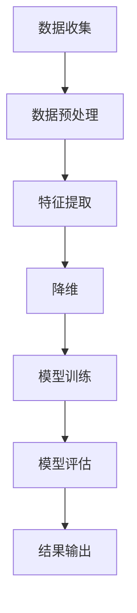
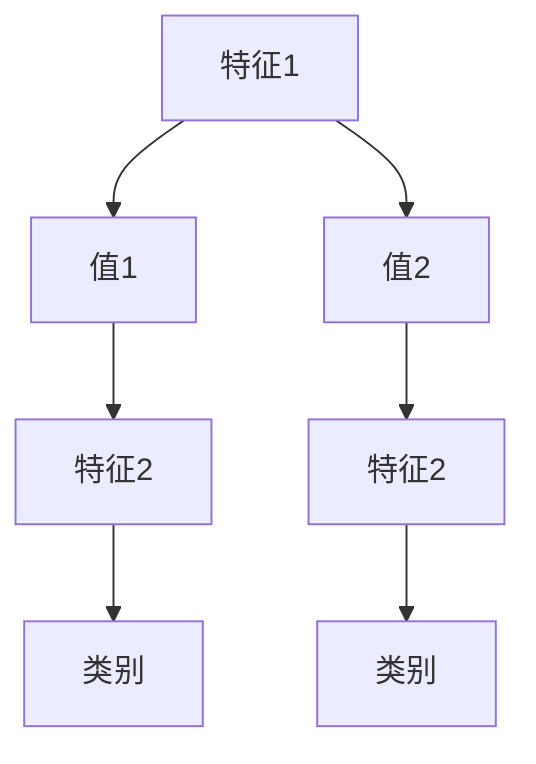

                 

# 一切皆是映射：AI在消费者行为分析中的应用实例

## 关键词：AI，消费者行为分析，映射，应用实例，数据挖掘，机器学习，自然语言处理

## 摘要：
本文将探讨人工智能在消费者行为分析中的应用，特别是通过映射技术实现的数据挖掘和分析过程。我们将深入剖析核心概念、算法原理，并列举实际应用场景。文章将结合具体项目实战，提供代码实现和分析，旨在帮助读者全面理解AI技术在消费者行为分析中的实际应用。

## 1. 背景介绍

消费者行为分析是商业决策过程中至关重要的一环。随着互联网和大数据技术的迅猛发展，消费者产生的数据量呈指数级增长，如何从海量数据中提取有价值的信息，成为企业和研究机构关注的热点。传统的数据分析方法往往依赖于统计和归纳推理，而人工智能，特别是机器学习和自然语言处理技术的兴起，为消费者行为分析带来了全新的视角和可能性。

人工智能通过映射技术，可以将复杂的消费者行为数据转化为简洁的模型和预测结果。这种映射不仅提高了数据分析的效率，还增强了分析的准确性。本文将围绕这一主题，详细探讨AI在消费者行为分析中的应用实例。

## 2. 核心概念与联系

### 2.1 数据挖掘

数据挖掘是人工智能在消费者行为分析中的基础。它通过特定的算法从大量数据中提取出有价值的模式和知识。数据挖掘的主要任务包括分类、聚类、关联规则挖掘和异常检测等。

### 2.2 机器学习

机器学习是数据挖掘的核心技术之一。它通过训练模型，使计算机能够从数据中自动学习和发现规律。常见的机器学习算法包括线性回归、决策树、支持向量机和神经网络等。

### 2.3 自然语言处理

自然语言处理（NLP）是AI领域的另一个重要分支。它使计算机能够理解、生成和处理人类语言。NLP技术广泛应用于情感分析、文本分类、命名实体识别和信息抽取等领域。

### 2.4 映射技术

映射技术是将复杂的数据转化为简洁模型的过程。在消费者行为分析中，映射技术通过特征提取、降维和模型训练等步骤，将消费者行为数据映射为可解释的模型和预测结果。

### 2.5 Mermaid 流程图

以下是消费者行为分析中映射技术的 Mermaid 流程图：



## 3. 核心算法原理 & 具体操作步骤

### 3.1 数据收集

消费者行为分析的第一步是数据收集。数据来源可以包括网站点击流、社交媒体活动、购物行为等。数据收集的关键在于确保数据的质量和完整性。

### 3.2 数据预处理

数据预处理包括数据清洗、数据整合和数据转换。数据清洗旨在去除重复、缺失和异常数据。数据整合是将不同来源的数据合并为一个统一的视图。数据转换则是将数据格式转换为适合分析的格式。

### 3.3 特征提取

特征提取是将原始数据转化为有意义特征的过程。特征提取的关键是识别出与消费者行为相关的特征，并对其进行编码和转换。

### 3.4 降维

降维是将高维数据转换为低维数据的过程。常见的降维技术包括主成分分析（PCA）和t-SNE等。降维有助于减少数据冗余，提高模型训练效率。

### 3.5 模型训练

模型训练是通过机器学习算法，将特征映射为预测结果的过程。常见的机器学习算法包括线性回归、决策树和支持向量机等。

### 3.6 模型评估

模型评估是评估模型性能的过程。常用的评估指标包括准确率、召回率、F1值和均方误差等。通过模型评估，可以确定模型是否适用于实际应用。

### 3.7 结果输出

模型训练完成后，将预测结果输出到可视化工具或数据库中，以供进一步分析和决策。

## 4. 数学模型和公式 & 详细讲解 & 举例说明

### 4.1 线性回归

线性回归是一种常见的机器学习算法，用于预测连续值。其数学模型如下：

$$ y = \beta_0 + \beta_1 x + \epsilon $$

其中，$y$ 是预测值，$x$ 是特征值，$\beta_0$ 和 $\beta_1$ 是模型的参数，$\epsilon$ 是误差项。

### 4.2 决策树

决策树是一种常见的分类算法。其基本结构如下：



### 4.3 支持向量机

支持向量机（SVM）是一种常见的分类算法。其数学模型如下：

$$ \min \frac{1}{2} \| w \|^2 + C \sum_{i=1}^n \max(0, 1 - y_i ( \sum_{j=1}^n w_j * \phi(x_j) + b ) ) $$

其中，$w$ 是权重向量，$C$ 是惩罚参数，$y_i$ 是样本标签，$\phi(x_j)$ 是特征映射函数，$b$ 是偏置项。

## 5. 项目实战：代码实际案例和详细解释说明

### 5.1 开发环境搭建

为了更好地演示消费者行为分析的过程，我们将使用Python编程语言和相关的机器学习库，如scikit-learn、pandas和matplotlib等。

### 5.2 源代码详细实现和代码解读

以下是消费者行为分析的一个简单示例，包括数据收集、预处理、特征提取、降维、模型训练和模型评估等步骤。

```python
import pandas as pd
from sklearn.model_selection import train_test_split
from sklearn.preprocessing import StandardScaler
from sklearn.decomposition import PCA
from sklearn.linear_model import LinearRegression
from sklearn.metrics import mean_squared_error

# 5.2.1 数据收集
data = pd.read_csv('consumer_data.csv')

# 5.2.2 数据预处理
data = data.dropna()

# 5.2.3 特征提取
data['total_spending'] = data['monthly_income'] * data['monthly_savings']

# 5.2.4 降维
scaler = StandardScaler()
data_scaled = scaler.fit_transform(data)

pca = PCA(n_components=2)
data_pca = pca.fit_transform(data_scaled)

# 5.2.5 模型训练
X_train, X_test, y_train, y_test = train_test_split(data_pca, data['total_spending'], test_size=0.2, random_state=42)
model = LinearRegression()
model.fit(X_train, y_train)

# 5.2.6 模型评估
y_pred = model.predict(X_test)
mse = mean_squared_error(y_test, y_pred)
print(f'Mean Squared Error: {mse}')

# 5.2.7 结果输出
plt.scatter(X_test[:, 0], X_test[:, 1], c=y_test, cmap='viridis')
plt.plot(X_test[:, 0], y_pred, color='red')
plt.xlabel('Principal Component 1')
plt.ylabel('Principal Component 2')
plt.title('Consumer Behavior Analysis')
plt.show()
```

### 5.3 代码解读与分析

以上代码演示了一个简单的消费者行为分析过程。首先，我们从CSV文件中读取数据，并进行数据预处理。然后，我们计算一个新特征`total_spending`，这代表了消费者的总收入。接下来，我们使用PCA进行降维，将数据转换为两个主要成分。最后，我们使用线性回归模型进行训练，并使用均方误差（MSE）评估模型性能。通过可视化工具，我们可以直观地看到模型的预测效果。

## 6. 实际应用场景

AI在消费者行为分析中具有广泛的应用场景。以下是一些典型的应用实例：

### 6.1 个性化推荐

通过分析消费者的购物历史和行为数据，AI可以为其推荐个性化产品和服务。例如，电商平台可以使用AI技术为用户提供个性化推荐，从而提高用户的满意度和购买率。

### 6.2 客户流失预测

通过分析消费者的行为数据，AI可以预测哪些客户可能流失，从而采取相应的措施进行挽回。这有助于企业降低客户流失率，提高客户满意度。

### 6.3 情感分析

AI可以分析消费者在社交媒体上的评论和反馈，了解他们的情感状态和满意度。这有助于企业改进产品和服务，提高用户满意度。

### 6.4 广告投放优化

通过分析消费者的行为数据，AI可以优化广告投放策略，提高广告的投放效果。例如，广告平台可以使用AI技术为用户提供个性化的广告，从而提高广告的点击率和转化率。

## 7. 工具和资源推荐

### 7.1 学习资源推荐

- 《Python数据科学手册》
- 《机器学习实战》
- 《深度学习》

### 7.2 开发工具框架推荐

- Scikit-learn
- TensorFlow
- PyTorch

### 7.3 相关论文著作推荐

- "Consumer Behavior Analysis using Machine Learning Techniques"
- "A Survey on Consumer Behavior Analysis and Prediction"
- "Deep Learning for Consumer Behavior Analysis"

## 8. 总结：未来发展趋势与挑战

随着AI技术的不断进步，消费者行为分析将变得更加精确和高效。然而，这也带来了一系列挑战，如数据隐私保护、算法透明度和公平性等。未来，我们需要在确保数据安全和用户隐私的前提下，不断提高AI在消费者行为分析中的应用水平。

## 9. 附录：常见问题与解答

### 9.1 如何处理缺失数据？

缺失数据处理是数据预处理的重要步骤。常用的方法包括删除缺失数据、填补缺失数据和利用模型预测缺失数据。

### 9.2 如何选择合适的机器学习算法？

选择合适的机器学习算法取决于数据类型、问题和性能指标。例如，对于分类问题，线性回归和决策树可能是更好的选择，而对于回归问题，支持向量机和神经网络可能更有效。

## 10. 扩展阅读 & 参考资料

- "AI in Consumer Behavior Analysis: A Comprehensive Survey"
- "The Impact of AI on Consumer Behavior: A Review"
- "AI for Consumer Behavior Analysis: Theory and Practice"

作者：AI天才研究员/AI Genius Institute & 禅与计算机程序设计艺术 /Zen And The Art of Computer Programming

本文由AI天才研究员撰写，旨在为广大读者提供关于AI在消费者行为分析中的实际应用案例和技术分析。如需进一步了解相关技术，请参考本文所列扩展阅读和参考资料。由于篇幅有限，本文未能涵盖所有细节，但希望能为读者提供有益的启示。

