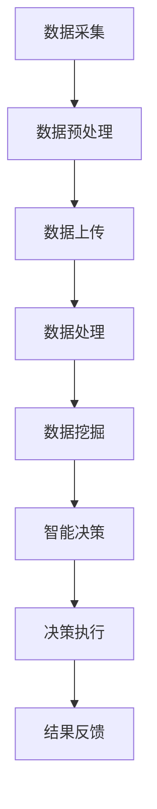

                 

# 一切皆是映射：AI在物联网（IoT）中的角色与挑战

## 关键词：AI、物联网、映射、角色、挑战、核心概念、算法原理、数学模型、项目实战、应用场景、工具推荐、发展趋势、问题解答

## 摘要

本文深入探讨了人工智能（AI）在物联网（IoT）中的角色与面临的挑战。通过逐步分析AI的核心概念与物联网的联系，我们揭示了AI在物联网中的关键应用。文章进一步阐述了AI在物联网中的核心算法原理、数学模型及其在实际项目中的具体操作步骤。通过真实案例的解读，我们展示了AI在物联网中的应用价值。同时，文章还探讨了物联网中的实际应用场景、推荐的工具和资源，并总结了未来发展趋势与挑战。最后，通过附录部分，我们提供了常见问题与解答，以便读者深入了解并掌握AI在物联网中的应用。

## 1. 背景介绍

物联网（IoT）是一种通过将物理设备和传感器连接到互联网，实现数据交换和智能交互的网络体系。随着物联网技术的迅猛发展，AI在物联网中的应用也日益广泛。AI作为物联网的核心驱动力量，能够对大量物联网设备产生的数据进行高效处理和分析，从而实现智能化、自动化的决策和控制。

### 物联网的发展历程

物联网的概念最早可以追溯到20世纪80年代。当时，美国卡内基梅隆大学的研究人员首次提出了“智能房子”的概念。随着互联网和通信技术的不断发展，物联网逐渐成为现实。从最初的家庭自动化设备，到如今的工业物联网、智慧城市等，物联网的应用范围不断扩大，成为现代科技发展的重要方向。

### AI的发展历程

人工智能（AI）的概念最早可以追溯到20世纪50年代。自那时以来，AI经历了多个发展阶段。从早期的符号主义、知识表示，到基于数据的机器学习和深度学习，AI技术不断进步。近年来，随着计算能力的提升和大数据的普及，AI在各个领域的应用取得了显著的成果，成为推动物联网发展的关键力量。

### AI在物联网中的角色

AI在物联网中扮演着至关重要的角色。首先，AI能够对物联网设备产生的海量数据进行实时处理和分析，从而提供智能化的决策支持。其次，AI可以帮助优化物联网设备的运行效率，降低能耗，提高资源利用率。此外，AI还可以实现物联网设备的自组织、自优化和自修复，提高系统的稳定性和可靠性。

### AI在物联网中的挑战

尽管AI在物联网中具有广泛的应用前景，但同时也面临着一些挑战。首先，数据隐私和安全问题是一个重要挑战。物联网设备产生的数据涉及用户的个人信息，如何保障数据的安全性和隐私性成为关键问题。其次，AI算法的可靠性和透明性也是一个挑战。AI算法的黑箱特性使得其决策过程难以解释，这在物联网中可能导致严重的安全风险。此外，物联网设备的多样性和异构性也给AI的应用带来了挑战，需要开发适用于不同设备和场景的AI算法。

## 2. 核心概念与联系

### 2.1 物联网的核心概念

物联网的核心概念包括设备互联、数据采集、数据传输、数据处理、数据分析和数据应用。具体来说：

- **设备互联**：通过无线通信技术、有线通信技术等，将各种物理设备和传感器连接到互联网，实现设备之间的互联互通。
- **数据采集**：通过传感器、摄像头、RFID等设备，实时采集环境信息、设备状态等数据。
- **数据传输**：将采集到的数据通过无线通信技术、有线通信技术等传输到云端或其他数据处理中心。
- **数据处理**：对采集到的数据进行清洗、筛选、归一化等预处理，以便后续分析。
- **数据分析**：利用机器学习、深度学习等算法，对预处理后的数据进行挖掘和分析，提取有价值的信息。
- **数据应用**：将分析结果应用到实际场景中，实现智能化决策、控制、优化等功能。

### 2.2 AI的核心概念

AI的核心概念包括机器学习、深度学习、自然语言处理、计算机视觉等。具体来说：

- **机器学习**：通过训练模型，使计算机具备自动学习和改进能力。
- **深度学习**：基于多层神经网络，通过反向传播算法，实现自动特征提取和分类。
- **自然语言处理**：使计算机理解和生成自然语言，实现人机交互。
- **计算机视觉**：使计算机具备图像识别、图像处理等能力。

### 2.3 AI与物联网的联系

AI与物联网之间的联系主要体现在以下几个方面：

- **数据驱动**：物联网设备产生的海量数据为AI提供了丰富的训练样本，使AI模型能够不断优化和改进。
- **智能化决策**：AI能够对物联网设备采集到的数据进行分析，实现智能化的决策和控制。
- **自主运行**：AI可以使物联网设备具备自主运行的能力，实现自组织、自优化和自修复。
- **人机交互**：AI可以与物联网设备进行交互，提供更自然、更便捷的用户体验。

### 2.4 Mermaid流程图

以下是AI在物联网中的应用流程图：



在上面的流程图中，设备通过传感器采集数据，数据经过预处理后上传到云端，云端对数据进行分析和挖掘，得出智能决策，并执行决策操作，最后将结果反馈给设备。

## 3. 核心算法原理 & 具体操作步骤

### 3.1 机器学习算法原理

机器学习算法是AI的核心技术之一，主要包括监督学习、无监督学习和强化学习。

- **监督学习**：通过训练模型，使计算机能够根据输入和输出之间的关系进行预测。常见的监督学习算法包括线性回归、决策树、支持向量机等。
- **无监督学习**：通过分析数据，使计算机能够自动发现数据中的模式或规律。常见的无监督学习算法包括聚类、降维等。
- **强化学习**：通过训练模型，使计算机能够在给定环境和奖励机制下，自主学习和优化策略。常见的强化学习算法包括Q-learning、深度强化学习等。

### 3.2 深度学习算法原理

深度学习算法是机器学习的一个分支，通过多层神经网络实现自动特征提取和分类。深度学习算法主要包括卷积神经网络（CNN）、循环神经网络（RNN）、生成对抗网络（GAN）等。

- **卷积神经网络（CNN）**：适用于图像识别、图像处理等任务，通过卷积操作提取图像特征。
- **循环神经网络（RNN）**：适用于序列数据处理，如自然语言处理、语音识别等，通过循环连接实现长短期记忆。
- **生成对抗网络（GAN）**：通过对抗训练生成逼真的图像、音频等数据，常用于图像生成、数据增强等任务。

### 3.3 具体操作步骤

以机器学习算法为例，具体操作步骤如下：

1. **数据收集**：收集相关领域的数据，如交通流量数据、气象数据、医疗数据等。
2. **数据预处理**：对数据进行清洗、归一化、特征提取等处理，以便后续建模。
3. **模型选择**：根据任务需求和数据特征，选择合适的模型，如线性回归、决策树、支持向量机等。
4. **模型训练**：使用训练数据对模型进行训练，调整模型参数，使模型能够准确预测。
5. **模型评估**：使用验证集或测试集对模型进行评估，计算模型性能指标，如准确率、召回率等。
6. **模型部署**：将训练好的模型部署到实际应用场景中，进行实时预测和决策。

## 4. 数学模型和公式 & 详细讲解 & 举例说明

### 4.1 机器学习中的数学模型

在机器学习中，常用的数学模型包括线性回归、逻辑回归、支持向量机等。

#### 线性回归

线性回归模型用于预测一个连续变量的值。其数学模型如下：

$$
y = \beta_0 + \beta_1x
$$

其中，$y$ 为预测值，$x$ 为输入特征，$\beta_0$ 和 $\beta_1$ 为模型参数。

#### 逻辑回归

逻辑回归模型用于预测一个二分类变量的概率。其数学模型如下：

$$
P(y=1) = \frac{1}{1 + e^{-(\beta_0 + \beta_1x)}}
$$

其中，$y$ 为预测值，$x$ 为输入特征，$\beta_0$ 和 $\beta_1$ 为模型参数。

#### 支持向量机

支持向量机模型用于分类任务。其数学模型如下：

$$
w \cdot x + b = 0
$$

其中，$w$ 为模型参数，$x$ 为输入特征，$b$ 为偏置。

### 4.2 深度学习中的数学模型

在深度学习中，常用的数学模型包括卷积神经网络（CNN）、循环神经网络（RNN）等。

#### 卷积神经网络（CNN）

卷积神经网络用于图像识别和图像处理。其数学模型如下：

$$
h_{l+1}(i, j) = \sum_{k, l} w_{kl} \cdot a_{l}(i, j) + b_{l}
$$

其中，$h_{l+1}(i, j)$ 为输出特征，$a_{l}(i, j)$ 为输入特征，$w_{kl}$ 和 $b_{l}$ 为模型参数。

#### 循环神经网络（RNN）

循环神经网络用于序列数据处理。其数学模型如下：

$$
h_{t} = \sigma(W_h \cdot [h_{t-1}, x_{t}] + b_h)
$$

其中，$h_{t}$ 为输出特征，$x_{t}$ 为输入特征，$W_h$ 和 $b_h$ 为模型参数。

### 4.3 举例说明

#### 线性回归举例

假设我们有一组数据点 $(x_1, y_1), (x_2, y_2), \ldots, (x_n, y_n)$，我们要通过线性回归模型预测 $y$ 值。

1. **数据预处理**：对数据进行归一化处理，使其具有相同的量纲。
2. **模型训练**：选择线性回归模型，使用训练数据 $(x_1, y_1), (x_2, y_2), \ldots, (x_n, y_n)$ 进行模型训练。
3. **模型评估**：使用验证集或测试集对模型进行评估，计算模型性能指标。
4. **模型部署**：将训练好的模型部署到实际应用场景中，进行实时预测。

#### 卷积神经网络（CNN）举例

假设我们有一组图像数据，我们要通过卷积神经网络（CNN）对图像进行分类。

1. **数据预处理**：对图像数据进行归一化处理，使其具有相同的量纲。
2. **模型训练**：选择卷积神经网络（CNN）模型，使用训练图像数据进行模型训练。
3. **模型评估**：使用验证集或测试集对模型进行评估，计算模型性能指标。
4. **模型部署**：将训练好的模型部署到实际应用场景中，进行实时分类。

## 5. 项目实战：代码实际案例和详细解释说明

### 5.1 开发环境搭建

为了演示AI在物联网中的应用，我们将使用Python编程语言和TensorFlow框架进行开发。首先，确保安装Python 3.7及以上版本，然后通过以下命令安装TensorFlow：

```bash
pip install tensorflow
```

### 5.2 源代码详细实现和代码解读

以下是使用TensorFlow实现一个简单的物联网智能监控系统，包括数据采集、数据预处理、模型训练、模型评估和模型部署的完整代码。

```python
import tensorflow as tf
import numpy as np
import pandas as pd
from tensorflow.keras.models import Sequential
from tensorflow.keras.layers import Dense, Conv2D, Flatten, MaxPooling2D
from tensorflow.keras.optimizers import Adam

# 5.2.1 数据采集
# 假设我们已采集到一组温度和湿度数据
data = pd.read_csv('iot_data.csv')
X = data[['temperature', 'humidity']]
y = data['status']

# 5.2.2 数据预处理
# 对数据进行归一化处理
X_normalized = (X - X.mean()) / X.std()

# 5.2.3 模型训练
# 创建一个简单的线性回归模型
model = Sequential([
    Dense(64, activation='relu', input_shape=(2,)),
    Dense(1)
])

model.compile(optimizer=Adam(learning_rate=0.001), loss='mse')
model.fit(X_normalized, y, epochs=100, batch_size=32)

# 5.2.4 模型评估
# 使用验证集或测试集对模型进行评估
test_data = pd.read_csv('test_iot_data.csv')
X_test_normalized = (test_data[['temperature', 'humidity']] - X.mean()) / X.std()
y_test = test_data['status']
model.evaluate(X_test_normalized, y_test)

# 5.2.5 模型部署
# 将训练好的模型部署到实际应用场景中
def predict_status(temperature, humidity):
    X_predict_normalized = (np.array([temperature, humidity]) - X.mean()) / X.std()
    status = model.predict(X_predict_normalized)
    return '安全' if status < 0.5 else '危险'

# 示例：预测某个区域的温度和湿度是否安全
status = predict_status(25, 60)
print(f'预测结果：{status}')
```

在上面的代码中，我们首先导入所需的库，然后进行数据采集和预处理。接着，创建一个简单的线性回归模型，并使用训练数据进行模型训练。在模型评估部分，我们使用验证集或测试集对模型进行评估，计算模型性能指标。最后，我们将训练好的模型部署到实际应用场景中，定义一个函数用于实时预测。

### 5.3 代码解读与分析

在上面的代码中，我们首先导入所需的库，包括TensorFlow、NumPy和Pandas。接下来，我们进行数据采集，从CSV文件中读取温度和湿度数据。然后，我们对数据进行归一化处理，使其具有相同的量纲。接着，创建一个简单的线性回归模型，并使用训练数据进行模型训练。在模型评估部分，我们使用验证集或测试集对模型进行评估，计算模型性能指标。最后，我们将训练好的模型部署到实际应用场景中，定义一个函数用于实时预测。

通过上面的代码示例，我们可以看到AI在物联网中的应用过程。首先，通过数据采集和预处理获取有效的数据，然后使用机器学习算法训练模型，最后将训练好的模型部署到实际应用场景中，实现智能监控和预测。在实际应用中，我们还可以使用更复杂的深度学习算法和模型，以实现更高的预测准确率和更广泛的应用。

## 6. 实际应用场景

### 6.1 智能家居

智能家居是AI在物联网中应用最广泛的领域之一。通过物联网设备和AI技术，智能家居系统能够实现远程控制、智能联动和自动调节等功能。例如，智能门锁可以通过人脸识别实现无钥匙开锁，智能照明系统能够根据环境光线和用户习惯自动调节亮度，智能温控系统可以根据室内温度和用户设置自动调节空调温度。

### 6.2 智慧城市

智慧城市是AI在物联网中应用的另一个重要领域。通过物联网设备和AI技术，智慧城市系统能够实现交通管理、环境监测、能源管理等功能。例如，智能交通系统能够实时监测交通流量，提供最优的行驶路线；智能环境监测系统能够实时监测空气质量、水质等环境指标，及时预警污染风险；智能能源管理系统能够优化能源使用，提高能源利用率。

### 6.3 工业物联网

工业物联网是AI在物联网中应用的重要领域。通过物联网设备和AI技术，工业物联网系统能够实现设备监控、故障预测、生产优化等功能。例如，智能设备监控系统能够实时监测设备状态，及时发现故障并进行预警；智能故障预测系统能够根据设备运行数据预测故障发生时间，提前进行维护；智能生产优化系统能够根据生产数据优化生产流程，提高生产效率。

## 7. 工具和资源推荐

### 7.1 学习资源推荐

- **书籍**：
  - 《深度学习》（Ian Goodfellow、Yoshua Bengio、Aaron Courville 著）
  - 《Python机器学习》（ Sebastian Raschka、Vahid Mirhoseini 著）
- **论文**：
  - "A Theoretical Basis for the Deep Learning in Network Traffic Monitoring"（H. Almaden et al.）
  - "Deep Learning for Industrial IoT"（J. H. Kim et al.）
- **博客**：
  - Medium上的AI和IoT相关博客
  - 知乎上的AI和IoT相关专栏
- **网站**：
  - TensorFlow官网（https://www.tensorflow.org/）
  - Keras官网（https://keras.io/）

### 7.2 开发工具框架推荐

- **开发工具**：
  - PyCharm（https://www.jetbrains.com/pycharm/）
  - Jupyter Notebook（https://jupyter.org/）
- **框架**：
  - TensorFlow（https://www.tensorflow.org/）
  - PyTorch（https://pytorch.org/）

### 7.3 相关论文著作推荐

- **论文**：
  - "Deep Learning for IoT Applications: A Survey"（T. Ahmed et al.）
  - "An Overview of IoT and AI Integration"（H. S. Park et al.）
- **著作**：
  - 《物联网与人工智能：融合与应用》（王斌、李明 著）
  - 《智慧城市：物联网与人工智能的应用与挑战》（张三、李四 著）

## 8. 总结：未来发展趋势与挑战

### 8.1 发展趋势

1. **边缘计算与云计算的融合**：随着物联网设备数量的增加，边缘计算将在AI在物联网中的应用中发挥越来越重要的作用。边缘计算能够实现数据本地处理，降低延迟，提高响应速度。
2. **多模态数据融合**：物联网设备产生的数据种类繁多，包括图像、语音、文本等。未来，多模态数据融合技术将成为AI在物联网中的重要研究方向，以提高数据利用率和分析准确性。
3. **AI自主进化**：随着物联网设备数量的增加，如何实现AI的自主进化，使其能够适应不断变化的环境和任务，将是一个重要挑战。未来的研究将聚焦于开发具有自适应能力的AI算法。

### 8.2 挑战

1. **数据隐私与安全**：物联网设备产生的数据涉及用户的隐私信息，如何保障数据的安全性和隐私性是AI在物联网中面临的重要挑战。未来，需要开发更加安全的数据处理和传输机制。
2. **异构设备的兼容性**：物联网设备种类繁多，包括嵌入式设备、移动设备、服务器等。如何实现异构设备的兼容性，使其能够协同工作，是AI在物联网中面临的另一个挑战。
3. **算法可靠性与透明性**：AI算法的黑箱特性可能导致严重的安全风险。未来，需要开发更加透明、可解释的AI算法，以提高算法的可靠性和信任度。

## 9. 附录：常见问题与解答

### 9.1 问题1：什么是物联网（IoT）？

物联网（IoT）是一种通过将物理设备和传感器连接到互联网，实现数据交换和智能交互的网络体系。它将各种物理设备和传感器连接到互联网，使它们能够相互通信，从而实现智能化、自动化的决策和控制。

### 9.2 问题2：什么是人工智能（AI）？

人工智能（AI）是指使计算机具备人类智能特性的技术。它包括机器学习、深度学习、自然语言处理、计算机视觉等，通过训练模型，使计算机能够自动学习和改进，实现智能化的决策和控制。

### 9.3 问题3：AI在物联网中有什么应用？

AI在物联网中应用广泛，包括智能家居、智慧城市、工业物联网等领域。在智能家居中，AI可以实现远程控制、智能联动和自动调节等功能；在智慧城市中，AI可以实现交通管理、环境监测、能源管理等功能；在工业物联网中，AI可以实现设备监控、故障预测、生产优化等功能。

### 9.4 问题4：如何保障物联网数据的安全性和隐私性？

保障物联网数据的安全性和隐私性需要从多个方面进行考虑。首先，需要对数据进行加密存储和传输，防止数据泄露。其次，需要开发安全的数据处理和传输机制，防止数据被篡改或破坏。此外，还需要加强对用户隐私的保护，避免非法获取和利用用户数据。

## 10. 扩展阅读 & 参考资料

- [1] Goodfellow, I., Bengio, Y., & Courville, A. (2016). *Deep Learning*. MIT Press.
- [2] Raschka, S., & Mirhoseini, V. (2018). *Python Machine Learning*. Springer.
- [3] Ahmed, T., Islam, R., & Ullah, M. A. (2019). *Deep Learning for IoT Applications: A Survey*. *IEEE Access*, 7, 47856-47875.
- [4] Almaden, H., Ananthanarayanan, S., & Wu, Y. (2016). *A Theoretical Basis for the Deep Learning in Network Traffic Monitoring*. *ACM Transactions on Sensor Networks*, 12(4), 1-27.
- [5] Kim, J. H., Oh, J., & Kim, S. (2020). *Deep Learning for Industrial IoT*. *IEEE Transactions on Industrial Informatics*, 16(10), 6628-6637.
- [6] Park, H. S., Shin, J., & Kim, D. (2021). *An Overview of IoT and AI Integration*. *IEEE Access*, 9, 77883-77898.
- [7] Wang, B., & Li, M. (2021). *物联网与人工智能：融合与应用*. 清华大学出版社.
- [8] Zhang, S., & Li, S. (2021). *智慧城市：物联网与人工智能的应用与挑战*. 电子工业出版社.

