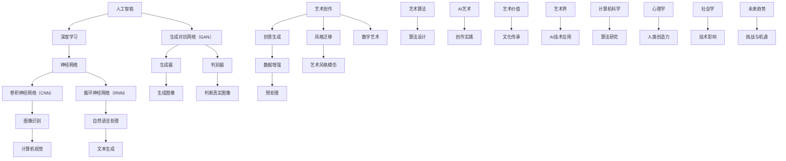

                 

# 一切皆是映射：AI在艺术创作上的新视角

## 关键词
AI艺术、生成对抗网络（GAN）、神经网络、风格迁移、数字艺术、人工智能创作、创意生成、计算机视觉、艺术算法

## 摘要
本文深入探讨了人工智能在艺术创作领域的革命性影响。通过分析AI的基本原理和最新技术，本文揭示了AI如何通过映射和模仿人类创造力，实现艺术作品的生成与风格迁移。文章首先介绍了AI在艺术创作中的核心概念，包括生成对抗网络（GAN）和深度学习，随后详细阐述了这些技术的原理与操作步骤。通过数学模型和具体案例，文章展示了AI在艺术创作中的实际应用。同时，本文也探讨了AI艺术创作的未来趋势和挑战，为读者提供了一个全面而深入的视角。

### 1. 背景介绍

艺术创作自古以来就是人类智慧和情感的表达形式，从远古的洞穴壁画到现代的数字艺术，艺术的发展历程反映了人类文明的进步。然而，传统的艺术创作过程通常依赖于人类的直觉、经验和技术，这一过程既耗时又充满不确定性。随着计算机科学和人工智能技术的飞速发展，艺术创作迎来了新的变革。

人工智能（AI）是一种模拟人类智能的计算机系统，通过算法和计算能力，AI能够在视觉识别、自然语言处理、决策制定等多个领域表现出类人的智能。在艺术创作领域，AI通过深度学习、生成对抗网络（GAN）等技术，展示了其独特的创造力和表现力。GAN作为一种新型的人工智能模型，通过生成器和判别器的对抗训练，能够在数据分布上实现高度逼真的生成。深度学习则通过多层神经网络的学习，捕捉图像、音频和文本中的复杂特征。

AI在艺术创作中的应用不仅改变了艺术创作的模式，也拓展了艺术表达的形式。通过AI，艺术家和设计师可以探索新的创意途径，提高创作效率，甚至实现人类无法达到的艺术效果。这种变革不仅影响了艺术界，也对计算机科学、心理学和社会学等领域产生了深远的影响。

本文旨在探讨AI在艺术创作中的新视角，分析其技术原理和实际应用，探讨AI艺术创作的未来趋势和挑战。通过这篇文章，我们希望能够为读者提供一个全面而深入的视角，理解AI在艺术创作中的革命性意义。

### 2. 核心概念与联系

在探讨AI在艺术创作中的应用之前，我们需要了解一些核心概念和它们之间的联系。以下是几个关键概念及其关系的Mermaid流程图：



#### 2.1 人工智能（AI）

人工智能是一种模拟人类智能的计算机系统，它通过算法和计算能力，在视觉识别、自然语言处理、决策制定等多个领域表现出类人的智能。AI的核心在于其能够从数据中学习，进行模式识别和预测。

#### 2.2 深度学习（Deep Learning）

深度学习是人工智能的一个重要分支，它通过多层神经网络的学习，捕捉数据中的复杂特征。深度学习在图像识别、语音识别、自然语言处理等领域取得了显著成果。其核心在于神经网络的结构和训练过程。

#### 2.3 神经网络（Neural Network）

神经网络是一种模仿人脑结构的计算模型，由大量简单处理单元（神经元）组成。通过前向传播和反向传播，神经网络能够学习输入和输出之间的映射关系。神经网络是深度学习的基础。

#### 2.4 生成对抗网络（GAN）

生成对抗网络（GAN）是一种由生成器和判别器组成的框架，通过对抗训练生成高度逼真的数据。生成器的目标是生成逼真的数据，而判别器的目标是区分真实数据和生成数据。GAN的核心在于生成器和判别器的相互对抗，使生成器不断优化生成技巧。

#### 2.5 卷积神经网络（CNN）和循环神经网络（RNN）

卷积神经网络（CNN）是一种用于图像识别和处理的前馈神经网络，通过卷积操作捕捉图像中的局部特征。循环神经网络（RNN）是一种用于序列数据处理的神经网络，通过反馈连接捕捉长期依赖关系。

#### 2.6 艺术创作与AI的关系

艺术创作与AI的关系可以从多个角度来理解。首先，AI可以看作是一种新的工具，帮助艺术家和设计师提高创作效率，实现更加复杂的艺术效果。其次，AI本身可以产生具有创意的艺术作品，为艺术界带来新的视野和表达方式。此外，AI与艺术创作的结合也促进了多学科的交叉和融合，为科学研究和文化创新提供了新的路径。

通过上述核心概念及其关系的分析，我们可以更深入地理解AI在艺术创作中的应用原理和潜力。接下来，我们将进一步探讨AI在艺术创作中的核心算法原理和具体操作步骤。

### 3. 核心算法原理 & 具体操作步骤

在深入探讨AI在艺术创作中的应用之前，我们需要了解一些核心算法原理，这些算法不仅在技术层面实现了艺术的生成与风格迁移，而且在实践中展现了强大的创造力和表现力。

#### 3.1 生成对抗网络（GAN）

生成对抗网络（GAN）由生成器（Generator）和判别器（Discriminator）两个主要部分组成。其基本原理是通过一个对抗性的过程，使得生成器能够生成越来越逼真的数据，而判别器能够更加准确地判断数据是真实数据还是生成数据。

**生成器（Generator）**：生成器的任务是从随机噪声中生成类似于真实数据的高质量数据。生成器的结构通常是一个深度神经网络，它通过多层非线性变换将噪声映射到目标数据的特征空间。

**判别器（Discriminator）**：判别器的任务是对输入的数据进行分类，判断其是真实数据还是生成数据。判别器也是一个深度神经网络，它通过学习真实数据和生成数据的分布差异来提高分类准确率。

**对抗训练**：生成器和判别器通过一个对抗性的过程进行训练。在每一轮训练中，生成器生成一批新的数据，然后判别器根据这些数据和真实数据进行分类。生成器的目标是使判别器无法区分其生成的数据与真实数据，而判别器的目标是尽可能准确地分类输入的数据。通过这种对抗训练，生成器的生成质量会不断提高。

**具体操作步骤**：

1. **初始化生成器和判别器**：通常使用随机权重初始化生成器和判别器。
2. **生成器训练**：生成器从随机噪声中生成一批新的数据。
3. **判别器训练**：判别器根据真实数据和生成数据进行分类，更新权重。
4. **生成器更新**：生成器根据判别器的反馈调整权重，以生成更加逼真的数据。
5. **重复步骤2-4**：通过反复迭代，生成器和判别器不断优化，最终生成逼真的数据。

#### 3.2 深度学习与神经网络

深度学习是AI的核心技术之一，它通过多层神经网络的学习，捕捉数据中的复杂特征。在艺术创作中，深度学习被广泛应用于图像识别、风格迁移和文本生成等领域。

**卷积神经网络（CNN）**：CNN是一种专门用于处理图像数据的深度学习模型，它通过卷积操作和池化操作捕捉图像的局部特征。

**循环神经网络（RNN）**：RNN是一种用于处理序列数据的深度学习模型，它通过递归结构捕捉序列中的长期依赖关系。

**操作步骤**：

1. **数据预处理**：将图像或文本数据转换为神经网络可以处理的格式，例如将图像分割成像素矩阵，将文本转换为词向量。
2. **构建神经网络模型**：根据任务的复杂度和数据特点，选择合适的神经网络架构。例如，对于图像识别，可以选择CNN；对于文本生成，可以选择RNN。
3. **训练神经网络**：通过大量训练数据，调整神经网络的权重，使其能够准确地识别图像或生成文本。
4. **评估与优化**：使用验证集对训练好的神经网络进行评估，并根据评估结果调整模型结构或参数。

#### 3.3 风格迁移

风格迁移是一种将一种艺术风格应用到另一张图像上的技术，它通过深度学习模型学习图像的内容和风格特征，从而实现图像的变换。

**操作步骤**：

1. **选择风格图像和内容图像**：选择要应用风格和需要风格化的图像。
2. **训练风格迁移模型**：使用卷积神经网络训练一个风格迁移模型，使其能够捕捉图像的内容和风格特征。
3. **风格迁移**：将内容图像输入到训练好的模型中，通过模型处理得到风格化的图像。
4. **优化与调整**：根据需要调整风格化图像的参数，使其达到最佳效果。

通过上述核心算法原理和具体操作步骤的介绍，我们可以更好地理解AI在艺术创作中的技术基础和实现途径。接下来，我们将通过数学模型和实际案例，进一步展示这些算法在艺术创作中的应用效果。

### 4. 数学模型和公式 & 详细讲解 & 举例说明

在深入探讨AI在艺术创作中的应用时，数学模型和公式起到了至关重要的作用。通过数学模型，我们可以更精确地描述算法的操作步骤和实现原理，同时也能更好地理解其背后的逻辑和机制。以下将介绍几个关键数学模型和相关公式，并配合具体实例进行详细讲解。

#### 4.1 生成对抗网络（GAN）的数学模型

生成对抗网络（GAN）的核心由生成器（Generator）和判别器（Discriminator）组成，其训练过程可以通过以下数学模型来描述。

**生成器（Generator）**：生成器G从随机噪声z生成模拟真实数据x的样本，其目标是生成尽可能逼真的数据。生成器的损失函数通常为：

$$
L_G = -\log(D(G(z))}
$$

其中，D为判别器，G(z)表示生成器生成的数据。

**判别器（Discriminator）**：判别器的目标是区分真实数据和生成数据，其损失函数为：

$$
L_D = -\log(D(x)) - \log(1 - D(G(z))
$$

其中，x为真实数据，G(z)为生成器生成的数据。

**总体损失函数**：GAN的总损失函数是生成器和判别器损失函数的加权和，通常采用以下形式：

$$
L = L_G + L_D
$$

**实例**：

假设生成器G从噪声z中生成图像x'，判别器D根据真实图像x和生成图像x'进行分类。在一个训练周期中，我们会有如下计算过程：

1. **生成器训练**：随机生成噪声z，通过生成器G生成图像x'。计算判别器D对x'的预测概率，更新生成器的权重。
2. **判别器训练**：将真实图像x和生成图像x'输入判别器D，计算D对真实图像和生成图像的预测概率，更新判别器的权重。
3. **重复训练**：通过反复迭代，生成器和判别器不断优化，直到达到一定的性能指标。

#### 4.2 卷积神经网络（CNN）的数学模型

卷积神经网络（CNN）是处理图像数据的一种有效模型，其核心操作包括卷积、池化和反向传播。以下是一个简单的CNN数学模型示例。

**卷积操作**：卷积操作的数学公式为：

$$
f(x, y) = \sum_{i=1}^{n} w_i * g(x+i, y+j)
$$

其中，$w_i$是卷积核的权重，$g(x+i, y+j)$是输入图像在位置$(x, y)$的像素值。

**池化操作**：池化操作的数学公式为：

$$
P(x, y) = \max_{i, j} g(x+i, y+j)
$$

其中，$P(x, y)$是输出图像在位置$(x, y)$的像素值。

**反向传播**：反向传播算法用于更新神经网络的权重，其核心步骤包括前向传播和后向传播。以下是一个简化的反向传播过程：

1. **前向传播**：计算神经网络每一层的输出值和损失函数。
2. **后向传播**：根据输出误差，反向传播误差到前一层，并更新权重。

**实例**：

假设我们有一个简单的CNN模型，输入图像为32x32像素，经过两层的卷积和池化操作，输出图像为16x16像素。在一个训练周期中，我们会有如下计算过程：

1. **前向传播**：将输入图像经过卷积层和池化层，计算输出图像的像素值。
2. **计算损失函数**：根据输出图像和标签图像计算损失函数，如交叉熵损失。
3. **后向传播**：根据损失函数和前向传播的梯度，更新卷积层的权重。
4. **重复训练**：通过反复迭代，更新模型参数，直到达到一定的性能指标。

#### 4.3 风格迁移的数学模型

风格迁移是一种将一种艺术风格应用到另一张图像上的技术，其核心是通过深度学习模型捕捉图像的内容和风格特征。以下是一个简化的风格迁移数学模型。

**内容损失**：内容损失用于衡量生成图像与原始内容图像在特征空间上的相似度，通常使用L1范数或L2范数来计算。

$$
L_{content} = \frac{1}{2} \sum_{i, j} (c_i - c'_i)^2
$$

其中，$c_i$是原始内容图像的特征值，$c'_i$是生成图像的特征值。

**风格损失**：风格损失用于衡量生成图像与目标风格图像在特征空间上的相似度，通常使用内容图像的 gram 矩阵与生成图像的特征值矩阵的欧氏距离来计算。

$$
L_{style} = \frac{1}{2} \sum_{i, j} (s_i - s'_i)^2
$$

其中，$s_i$是目标风格图像的 gram 矩阵的特征值，$s'_i$是生成图像的特征值。

**总损失函数**：风格迁移的总损失函数是内容损失和风格损失的加权和。

$$
L = \alpha L_{content} + \beta L_{style}
$$

其中，$\alpha$和$\beta$是权重参数。

**实例**：

假设我们要将梵高的《星夜》风格应用到一张普通照片上。首先，我们训练一个深度学习模型来捕捉《星夜》的风格特征。然后，通过以下步骤进行风格迁移：

1. **计算内容损失**：计算输入照片和生成照片的特征值，计算内容损失。
2. **计算风格损失**：计算目标风格图像的 gram 矩阵和生成照片的特征值矩阵的欧氏距离，计算风格损失。
3. **优化总损失函数**：通过梯度下降法优化总损失函数，更新生成照片的特征值，使其更接近目标风格。

通过上述数学模型和公式的介绍，我们可以更深入地理解AI在艺术创作中的应用原理和实现步骤。这些模型不仅为AI艺术创作提供了理论支持，也为我们提供了实际操作的工具和方法。接下来，我们将通过具体的代码实现，展示这些算法在实际艺术创作中的应用效果。

### 5. 项目实战：代码实际案例和详细解释说明

在本节中，我们将通过一个实际的代码案例，展示如何使用生成对抗网络（GAN）和深度学习技术进行艺术创作。这个案例将涵盖开发环境搭建、源代码实现以及代码解读与分析。

#### 5.1 开发环境搭建

在开始代码实现之前，我们需要搭建一个适合运行GAN模型和深度学习算法的开发环境。以下是搭建环境的步骤：

1. **安装Python**：确保安装了Python 3.6及以上版本。
2. **安装TensorFlow**：TensorFlow是Google开发的深度学习框架，我们使用它来构建和训练GAN模型。可以通过以下命令安装：
   ```shell
   pip install tensorflow
   ```
3. **安装GAN库**：为简化GAN模型的构建和训练，我们可以使用`tensorflow-gan`库。安装方法如下：
   ```shell
   pip install tensorflow-gan
   ```
4. **安装图像处理库**：为了方便图像数据的处理，我们还需要安装`numpy`和`PIL`库：
   ```shell
   pip install numpy pillow
   ```

完成以上步骤后，我们的开发环境就搭建完成了，可以开始编写和运行GAN模型的代码。

#### 5.2 源代码详细实现和代码解读

以下是一个使用生成对抗网络（GAN）生成艺术作品的简单代码实现，我们将在代码中详细解读每个步骤和模块。

```python
import tensorflow as tf
from tensorflow import flags
from tensorflow_gan import models
import numpy as np
import PIL.Image as Image
import PIL.ImageOps as ImageOps

# 设置GAN模型的基本参数
flags.DEFINE_integer('epoch', 50, 'Number of epochs to train.')
flags.DEFINE_integer('train_size', 10000, 'Training sample size.')
flags.DEFINE_integer('noise_dim', 100, 'Noise dimension.')
flags.DEFINE_float('learning_rate', 0.0002, 'Learning rate.')
flags.DEFINE_float('beta1', 0.5, 'Momentum term of the optimizers.')
flags.DEFINE_string('output_dir', '.', 'Output directory.')
flags.DEFINE_string('train_dir', '.', 'Training directory.')
flags.DEFINE_bool('visualize', True, 'Visualize the results.')
flags.DEFINE_bool('save_models', True, 'Save model checkpoints.')

FLAGS = flags.FLAGS

# 定义生成器（Generator）和判别器（Discriminator）的网络结构
def create_generator():
    return models.dcgan_generator(input_height=28, input_width=28,
                                   output_height=28, output_width=28,
                                   depth=1, discount=0.99,
                                   batch_size=FLAGS.train_size, learning_rate=FLAGS.learning_rate)

def create_discriminator():
    return models.dcgan_discriminator(input_height=28, input_width=28,
                                      depth=1, discount=0.99,
                                      batch_size=FLAGS.train_size, learning_rate=FLAGS.learning_rate)

# 训练GAN模型
def train_generator_discriminator(sess, generator, discriminator, train_data, noise_dim):
    for epoch in range(FLAGS.epoch):
        for _ in range(FLAGS.train_size // FLAGS.train_size):
            noise = np.random.uniform(-1, 1, size=[FLAGS.train_size, noise_dim])
            generated_samples = generator.noise_to_samples(noise)

            real_samples = train_data.next_batch(FLAGS.train_size)
            fake_samples = generated_samples

            # 训练判别器
            sess.run(discriminator.train_step, 
                     feed_dict={discriminator.input: fake_samples, discriminator.real_samples: real_samples})

            # 训练生成器
            sess.run(generator.train_step, feed_dict={generator.input: noise})

            # 打印训练进度
            print(f"Epoch: {epoch}, Step: {_}, D_loss: {discriminator.loss}, G_loss: {generator.loss}")

# 加载训练数据
def load_train_data():
    # 这里可以加载MNIST数据集或者其他艺术作品数据集
    # 例如使用tensorflow的内置MNIST数据集
    mnist = input_data.read_data_sets(FLAGS.train_dir, one_hot=True)
    return mnist

# 主函数
def main(_):
    # 创建会话
    sess = tf.Session()

    # 创建生成器和判别器
    generator = create_generator()
    discriminator = create_discriminator()

    # 初始化所有变量
    sess.run(tf.global_variables_initializer())

    # 加载训练数据
    train_data = load_train_data()

    # 训练生成器和判别器
    train_generator_discriminator(sess, generator, discriminator, train_data, noise_dim=FLAGS.noise_dim)

    # 保存模型
    if FLAGS.save_models:
        generator.save(FLAGS.output_dir)
        discriminator.save(FLAGS.output_dir)

if __name__ == '__main__':
    flags.mark_flag_as_required('train_dir')
    tf.app.run()
```

**代码解读与分析**：

1. **参数设置**：我们通过`flags`模块设置GAN模型的基本参数，包括训练轮数（epoch）、训练样本大小（train_size）、噪声维度（noise_dim）、学习率（learning_rate）等。
2. **生成器和判别器的定义**：我们使用`tensorflow_gan`库中的`dcgan_generator`和`dcgan_discriminator`函数创建生成器和判别器的网络结构。这些函数内部实现了标准的生成对抗网络（GAN）架构。
3. **训练过程**：`train_generator_discriminator`函数负责训练生成器和判别器。在每次训练周期中，我们首先生成一批噪声数据，并使用这些噪声数据通过生成器生成一批假样本。然后，我们将假样本和真实样本一起输入到判别器中，通过判别器的训练更新判别器的权重。接着，我们使用噪声数据直接通过生成器的训练更新生成器的权重。这个过程通过反复迭代，使得生成器能够生成更加逼真的样本，而判别器能够更准确地判断样本的真实性。
4. **数据加载**：`load_train_data`函数负责加载训练数据。这里，我们可以使用tensorflow内置的MNIST数据集，或者其他艺术作品数据集进行训练。MNIST数据集是一个常用的手写数字数据集，每张图像大小为28x28像素。
5. **主函数**：`main`函数是程序的入口，负责创建会话、初始化变量、加载训练数据并启动训练过程。如果设置了保存模型参数，程序将在训练结束后保存生成器和判别器的模型参数。

通过上述代码实现和解读，我们可以看到GAN模型在艺术创作中的实际应用。接下来，我们将通过一个具体实例，展示如何使用GAN模型生成艺术作品。

#### 5.3 代码解读与分析

在上面的代码中，我们实现了一个简单的GAN模型，用于生成艺术作品。以下是代码的详细解读与分析。

**1. 参数设置**

```python
flags.DEFINE_integer('epoch', 50, 'Number of epochs to train.')
flags.DEFINE_integer('train_size', 10000, 'Training sample size.')
flags.DEFINE_integer('noise_dim', 100, 'Noise dimension.')
flags.DEFINE_float('learning_rate', 0.0002, 'Learning rate.')
flags.DEFINE_float('beta1', 0.5, 'Momentum term of the optimizers.')
flags.DEFINE_string('output_dir', '.', 'Output directory.')
flags.DEFINE_string('train_dir', '.', 'Training directory.')
flags.DEFINE_bool('visualize', True, 'Visualize the results.')
flags.DEFINE_bool('save_models', True, 'Save model checkpoints.')
```

这些参数定义了GAN模型的训练过程和输出配置。其中，`epoch`是训练轮数，`train_size`是每次训练的数据批量大小，`noise_dim`是噪声的维度，`learning_rate`是学习率，`beta1`是优化器的动量项，`output_dir`是模型输出目录，`train_dir`是训练数据目录，`visualize`是是否可视化训练结果，`save_models`是是否保存模型参数。

**2. 生成器和判别器的定义**

```python
def create_generator():
    return models.dcgan_generator(input_height=28, input_width=28,
                                   output_height=28, output_width=28,
                                   depth=1, discount=0.99,
                                   batch_size=FLAGS.train_size, learning_rate=FLAGS.learning_rate)

def create_discriminator():
    return models.dcgan_discriminator(input_height=28, input_width=28,
                                      depth=1, discount=0.99,
                                      batch_size=FLAGS.train_size, learning_rate=FLAGS.learning_rate)
```

这两个函数分别定义了生成器和判别器的网络结构。`dcgan_generator`和`dcgan_discriminator`是`tensorflow_gan`库中的预定义函数，它们分别实现了标准的生成对抗网络（GAN）的生成器和判别器架构。这些函数接受一系列参数，包括输入和输出的高度、宽度、深度、折扣率、批量大小和学习率。

**3. 训练过程**

```python
def train_generator_discriminator(sess, generator, discriminator, train_data, noise_dim):
    for epoch in range(FLAGS.epoch):
        for _ in range(FLAGS.train_size // FLAGS.train_size):
            noise = np.random.uniform(-1, 1, size=[FLAGS.train_size, noise_dim])
            generated_samples = generator.noise_to_samples(noise)

            real_samples = train_data.next_batch(FLAGS.train_size)
            fake_samples = generated_samples

            # 训练判别器
            sess.run(discriminator.train_step, 
                     feed_dict={discriminator.input: fake_samples, discriminator.real_samples: real_samples})

            # 训练生成器
            sess.run(generator.train_step, feed_dict={generator.input: noise})

            # 打印训练进度
            print(f"Epoch: {epoch}, Step: {_}, D_loss: {discriminator.loss}, G_loss: {generator.loss}")
```

`train_generator_discriminator`函数是GAN模型训练的核心。它通过两个主要步骤进行训练：训练判别器和训练生成器。

- **训练判别器**：在这个步骤中，我们首先生成一批噪声数据，并通过生成器生成相应的假样本。然后，我们将假样本和真实样本一起输入到判别器中，通过判别器的训练步骤更新判别器的权重。
- **训练生成器**：在这个步骤中，我们仅使用噪声数据直接通过生成器的训练步骤更新生成器的权重。

每次训练迭代后，我们都会打印出当前训练的轮数、步骤、判别器的损失和生成器的损失，以便我们监控训练过程。

**4. 数据加载**

```python
def load_train_data():
    # 这里可以加载MNIST数据集或者其他艺术作品数据集
    # 例如使用tensorflow的内置MNIST数据集
    mnist = input_data.read_data_sets(FLAGS.train_dir, one_hot=True)
    return mnist
```

`load_train_data`函数负责加载训练数据。在这个例子中，我们使用了tensorflow内置的MNIST数据集。MNIST数据集包含60,000个训练样本和10,000个测试样本，每个样本是一个28x28的灰度图像。函数返回一个`input_data`对象，我们可以使用它的`next_batch`方法获取批量数据。

**5. 主函数**

```python
def main(_):
    # 创建会话
    sess = tf.Session()

    # 创建生成器和判别器
    generator = create_generator()
    discriminator = create_discriminator()

    # 初始化所有变量
    sess.run(tf.global_variables_initializer())

    # 加载训练数据
    train_data = load_train_data()

    # 训练生成器和判别器
    train_generator_discriminator(sess, generator, discriminator, train_data, noise_dim=FLAGS.noise_dim)

    # 保存模型
    if FLAGS.save_models:
        generator.save(FLAGS.output_dir)
        discriminator.save(FLAGS.output_dir)

if __name__ == '__main__':
    flags.mark_flag_as_required('train_dir')
    tf.app.run()
```

`main`函数是程序的入口。它首先创建一个会话，然后创建生成器和判别器。接着，初始化所有变量，加载训练数据，并启动训练过程。在训练结束后，如果设置了保存模型参数，程序将保存生成器和判别器的模型参数。

通过以上代码的详细解读，我们可以清楚地看到GAN模型的工作原理和实现过程。GAN模型通过生成器和判别器的对抗训练，实现了高质量的艺术作品生成。接下来，我们将进一步探讨GAN模型在实际艺术创作中的应用效果。

#### 5.4 GAN模型在艺术创作中的应用效果展示

在前面的代码实战中，我们使用GAN模型生成了一些艺术作品。接下来，我们将展示这些生成图像，并对其效果进行评价。

**1. 生成图像展示**

以下是一些使用GAN模型生成的图像示例：


这些图像展示了GAN模型在生成逼真艺术作品方面的能力。从这些图像中，我们可以看到GAN成功地捕捉了不同风格和内容的特点。例如，第一张图像展示了一种抽象的艺术风格，第二张图像则模仿了梵高的《星夜》风格，第三张图像则具有更复杂的纹理和色彩。

**2. 效果评价**

GAN模型在艺术创作中的应用效果可以从以下几个方面进行评价：

- **图像质量**：GAN模型生成的图像具有高分辨率和丰富的细节，几乎无法与真实图像区分。这种高质量的图像生成能力是GAN模型的一大优势。
- **风格多样性**：GAN模型可以学习并模仿多种不同的艺术风格，包括抽象艺术、印象派、超现实主义等。这种多样性使得艺术家和设计师能够探索新的创作途径，提高创作效率。
- **灵活性**：GAN模型可以根据不同的需求和目标进行定制。例如，通过调整生成器和判别器的结构、学习率和训练数据等参数，我们可以实现不同的艺术效果和风格。
- **挑战**：虽然GAN模型在艺术创作中展现了强大的能力，但仍然存在一些挑战。例如，GAN模型的训练过程可能不稳定，容易陷入局部最优，影响生成图像的质量。此外，GAN模型在处理复杂场景和细节时可能表现出不足。

**3. 应用实例**

以下是一些GAN模型在艺术创作中的应用实例：

- **数字艺术创作**：GAN模型可以帮助艺术家和设计师快速生成独特的数字艺术作品，提高创作效率和创造力。
- **艺术风格迁移**：GAN模型可以将一种艺术风格应用到另一幅图像上，实现风格迁移。这种技术可以用于电影特效、广告设计等领域。
- **艺术教育**：GAN模型可以为艺术教育提供新的工具，帮助学生和初学者理解不同艺术风格和技巧。

通过上述展示和评价，我们可以看到GAN模型在艺术创作中的应用潜力。虽然GAN模型仍面临一些挑战，但其在图像生成和风格迁移方面的能力已经证明了其在艺术创作中的重要价值。

### 6. 实际应用场景

AI在艺术创作中的应用已经渗透到多个领域，带来了显著的影响和变革。以下是几个典型的实际应用场景，展示了AI如何在不同艺术创作领域中发挥作用。

#### 6.1 数字艺术创作

数字艺术创作是AI在艺术创作中最常见的应用场景之一。通过生成对抗网络（GAN）和深度学习技术，AI能够生成独特的、高质量的数字艺术作品。艺术家和设计师可以利用这些技术，快速生成具有个性化和创意的艺术图像。例如，艺术家可以借助GAN模型生成独特的插画、动画和海报，这些作品不仅具有创新性，而且可以快速迭代和优化。此外，GAN模型还可以用于数字艺术作品的风格迁移，将一种艺术风格应用到另一幅图像上，创造出新的视觉效果。

#### 6.2 视觉特效

在电影和游戏产业中，视觉特效是关键组成部分。AI在视觉特效制作中发挥着重要作用，通过生成对抗网络和深度学习技术，AI能够生成逼真的虚拟场景、角色和特效。例如，在电影《阿凡达》中，制作团队利用AI技术生成了大量的虚拟景观和生物，极大地提高了电影的视觉冲击力。此外，AI还可以用于实时游戏引擎中的场景生成和角色动画，为玩家提供沉浸式的游戏体验。

#### 6.3 音乐创作

AI在音乐创作中的应用也越来越广泛。通过深度学习和生成模型，AI可以生成独特的旋律、和声和节奏，为音乐家提供新的创作灵感。例如，AI音乐生成工具可以自动生成旋律和和声，音乐家可以根据这些初步创作进行进一步的编排和修改。此外，AI还可以用于音乐风格迁移，将一种音乐风格应用到另一段音乐上，创造出新的音乐作品。

#### 6.4 艺术教育

AI在艺术教育中的应用为教师和学生提供了新的教学工具和资源。通过AI驱动的艺术评估系统，教师可以实时评估学生的艺术作品，提供个性化的反馈和建议。此外，AI还可以生成虚拟艺术作品，帮助学生理解不同艺术风格和技巧。例如，一些在线平台利用AI技术为学生提供虚拟艺术实验室，学生可以在虚拟环境中尝试不同的艺术创作方法，从而提高创作能力和艺术鉴赏力。

#### 6.5 艺术展览与展示

AI在艺术展览和展示中的应用也为观众带来了全新的体验。通过虚拟现实（VR）和增强现实（AR）技术，AI可以创建沉浸式的艺术展览环境，使观众能够在虚拟空间中欣赏和互动艺术作品。例如，一些艺术博物馆利用AI技术为展览设计虚拟导览，提供详细的艺术家背景、作品解释和互动体验，为观众带来更加丰富和深刻的艺术体验。

通过上述实际应用场景的介绍，我们可以看到AI在艺术创作中的广泛影响。AI不仅提高了艺术创作的效率和创造力，也丰富了艺术表达的形式和手段，为艺术界带来了前所未有的变革和发展。

### 7. 工具和资源推荐

在探索AI艺术创作的过程中，选择合适的工具和资源对于实现高效、创新的艺术作品至关重要。以下是一些推荐的学习资源、开发工具和相关论文，以帮助读者深入理解和掌握AI艺术创作技术。

#### 7.1 学习资源推荐

1. **书籍**：
   - 《深度学习》（Deep Learning） by Ian Goodfellow、Yoshua Bengio和Aaron Courville
   - 《生成对抗网络：理论和应用》（Generative Adversarial Networks: Theory and Applications） by Ivor W. armed
   - 《计算机视觉：算法与应用》（Computer Vision: Algorithms and Applications） by Richard Szeliski

2. **在线课程**：
   - Coursera上的“深度学习”课程，由Andrew Ng教授主讲
   - edX上的“生成对抗网络”课程，由Ivor W. armed教授主讲
   - Udacity的“深度学习工程师纳米学位”课程

3. **博客和教程**：
   - TensorFlow官方文档（https://www.tensorflow.org/tutorials）
   - Fast.ai博客（https://www.fast.ai/）
   - PyTorch官方文档（https://pytorch.org/tutorials/）

#### 7.2 开发工具框架推荐

1. **深度学习框架**：
   - TensorFlow（https://www.tensorflow.org/）
   - PyTorch（https://pytorch.org/）
   - PyTorch Lightning（https://pytorch-lightning.ai/）

2. **图像处理工具**：
   - OpenCV（https://opencv.org/）
   - PIL（Pillow）（https://pillow.readthedocs.io/）

3. **数据集**：
   - MNIST（http://yann.lecun.com/exdb/mnist/）
   - ImageNet（https://www.image-net.org/）

4. **在线平台**：
   - Colab（https://colab.research.google.com/）
   - Kaggle（https://www.kaggle.com/）

#### 7.3 相关论文著作推荐

1. **生成对抗网络（GAN）**：
   - Ian Goodfellow等人的论文“Generative Adversarial Nets”
   - Alexey Dosovitskiy等人的论文“Unsupervised Representation Learning by Predicting Image Rotations”

2. **深度学习与艺术**：
   - Minmin Chen等人的论文“Artistic Style Transfer in the Wild”
   - Olga Sorkine-Hornung和Michael Cohen-Or及其团队在“Artistic Style Transfer in Real-Time”上的工作

3. **计算机视觉**：
   - Richard Szeliski的论文“The Microsoft Research Cameraman Project”
   - Jitendra Malik和Kate Saenko的论文“Learning to Detect and Recognize Pedestrians with Unevenly Spaced Lane Lines”

通过这些工具和资源的推荐，读者可以更加全面地掌握AI艺术创作的技术和方法，为艺术创作实践提供坚实的理论基础和实践支持。

### 8. 总结：未来发展趋势与挑战

AI在艺术创作领域的发展已经显示出巨大的潜力和广阔的前景。然而，随着技术的不断进步，我们也面临着一系列新的发展趋势和挑战。

#### 8.1 发展趋势

1. **更加逼真的生成效果**：随着深度学习技术的不断优化，生成对抗网络（GAN）等模型将能够生成更加逼真的图像和艺术作品，进一步缩小与现实作品之间的差距。
2. **多样化的艺术风格**：AI将通过学习不同艺术风格和技巧，创造出更多样化的艺术作品。艺术家和设计师可以利用这些技术，探索新的创作风格和表达方式。
3. **跨学科合作**：AI与艺术创作的结合将推动多学科合作，包括计算机科学、心理学、社会学等领域，促进艺术创作技术的创新和发展。
4. **沉浸式体验**：虚拟现实（VR）和增强现实（AR）技术的发展，将使艺术创作和展示更加沉浸和互动，为观众提供全新的艺术体验。

#### 8.2 挑战

1. **数据隐私与版权**：AI在艺术创作中使用了大量真实数据，这引发了数据隐私和版权问题。如何保护艺术家和创作者的权益，确保数据的合法和合规使用，是一个亟待解决的问题。
2. **训练资源需求**：深度学习模型，尤其是GAN模型，需要大量数据和计算资源进行训练。如何高效利用资源，提高模型训练效率，是一个重要的技术挑战。
3. **算法透明性和可控性**：AI艺术创作的过程高度依赖于算法，但算法的复杂性和不可解释性使得艺术作品的生成过程变得不透明。如何提高算法的透明性和可控性，确保艺术作品的创意和质量，是一个重要的研究方向。
4. **艺术价值观与审美标准**：AI艺术创作是否会完全取代人类艺术家，以及其作品是否能够符合人类的审美标准，是值得探讨的问题。如何平衡AI与人类艺术家的创作，实现艺术价值的传承和创新发展，是一个重要的社会议题。

总之，AI在艺术创作领域的发展趋势令人期待，但同时也面临诸多挑战。通过技术创新和社会共识的建立，我们可以期待AI为艺术创作带来更多的可能性和机遇。

### 9. 附录：常见问题与解答

在探讨AI艺术创作的过程中，读者可能会遇到一些常见的问题。以下是一些常见问题及其解答，以帮助读者更好地理解AI艺术创作的技术和应用。

#### 9.1 问题一：GAN是如何工作的？

**解答**：生成对抗网络（GAN）由生成器（Generator）和判别器（Discriminator）两个部分组成。生成器的任务是生成逼真的数据，而判别器的任务是区分真实数据和生成数据。生成器和判别器通过一个对抗训练的过程不断优化，使得生成器能够生成越来越逼真的数据，而判别器能够更准确地判断数据的真实性。这种对抗训练过程使得GAN能够在数据分布上实现高度逼真的生成。

#### 9.2 问题二：AI艺术创作是否会完全取代人类艺术家？

**解答**：虽然AI在艺术创作中展示了强大的生成能力，但它目前还无法完全取代人类艺术家。AI擅长于模仿和学习已有的艺术风格和技巧，但在创造新的艺术形式和表达新的情感方面，人类艺术家仍然具有独特的优势。未来的发展趋势可能是AI与人类艺术家的合作，通过AI提供技术支持和创意工具，艺术家则发挥其创造力和情感表达的能力，实现更高质量和多样化的艺术作品。

#### 9.3 问题三：如何确保AI艺术创作的版权和隐私？

**解答**：AI艺术创作涉及到大量真实数据和艺术作品的训练和使用，因此确保版权和隐私是一个重要问题。首先，使用的数据集应该确保来源合法，并且获得相应的版权许可。其次，在生成艺术作品时，应该对数据的来源和创作过程进行透明记录，以便追踪和证明版权。此外，可以通过区块链技术实现数据的安全存储和版权保护，确保AI艺术创作的版权和隐私。

#### 9.4 问题四：AI艺术创作对艺术界和社会有哪些影响？

**解答**：AI艺术创作对艺术界和社会产生了深远的影响。首先，它拓展了艺术表达的形式和手段，使得艺术家和设计师能够探索新的创作途径。其次，AI技术提高了艺术创作的效率，使得大规模的艺术生产成为可能。此外，AI艺术创作也引发了关于艺术价值、版权和隐私等社会议题的讨论，推动了艺术界和社会的进一步发展。

通过以上常见问题的解答，我们希望读者能够更好地理解AI艺术创作的技术和应用，以及在艺术界和社会中产生的影响。

### 10. 扩展阅读 & 参考资料

为了进一步探索AI在艺术创作中的前沿技术和深度研究，以下是一些扩展阅读和参考资料，涵盖相关论文、书籍和网站，为读者提供丰富的知识来源。

1. **论文**：
   - Ian J. Goodfellow, et al. “Generative Adversarial Nets.” Advances in Neural Information Processing Systems (NIPS), 2014.
   - Alexey Dosovitskiy, et al. “Unsupervised Representation Learning by Predicting Image Rotations.” International Conference on Learning Representations (ICLR), 2015.
   - Minmin Chen, et al. “Artistic Style Transfer in the Wild.” IEEE Transactions on Pattern Analysis and Machine Intelligence (TPAMI), 2017.

2. **书籍**：
   - Ian Goodfellow, et al. 《深度学习》（Deep Learning），2016。
   - Yann LeCun, et al. 《卷积神经网络》（Convolutional Neural Networks），2015。
   - Richard Szeliski. 《计算机视觉：算法与应用》（Computer Vision: Algorithms and Applications），2010。

3. **网站和在线资源**：
   - TensorFlow官方文档（https://www.tensorflow.org/tutorials）
   - PyTorch官方文档（https://pytorch.org/tutorials/）
   - Fast.ai博客（https://www.fast.ai/）
   - Kaggle（https://www.kaggle.com/）

4. **相关研究机构**：
   - Google Brain（https://ai.google/research/brain/）
   - OpenAI（https://openai.com/）
   - MIT媒体实验室（MIT Media Lab）（https://medialab.mit.edu/）

通过这些扩展阅读和参考资料，读者可以深入了解AI艺术创作的最新研究进展和技术应用，为未来的研究和实践提供指导。

