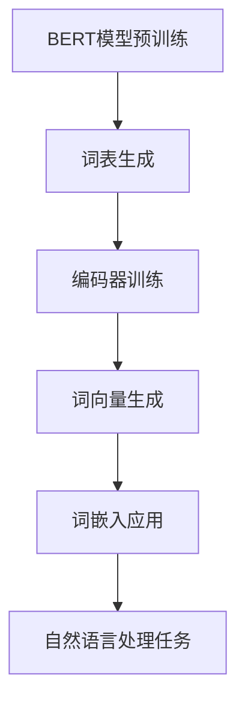

                 

# 一切皆是映射：BERT与词嵌入技术的结合

## 关键词：BERT、词嵌入、自然语言处理、深度学习、映射技术

## 摘要：

本文深入探讨了BERT（Bidirectional Encoder Representations from Transformers）模型与词嵌入技术相结合的方法，通过一步一步的分析和推理，详细解析了BERT模型的工作原理、词嵌入的概念及其在自然语言处理中的应用。文章首先介绍了BERT模型的基本架构，随后讲解了词嵌入技术的原理与实现，接着通过实际项目案例展示了BERT与词嵌入技术的具体应用。最后，文章对BERT与词嵌入技术的未来发展趋势和挑战进行了总结，并提供了一系列学习资源和开发工具推荐。

## 1. 背景介绍

自然语言处理（Natural Language Processing，NLP）作为人工智能的一个重要分支，近年来取得了显著的进展。其中，词嵌入技术（Word Embedding）是NLP领域的一项核心技术，它通过将单词映射到高维向量空间，使得计算机能够理解单词的语义和语法关系。然而，传统的词嵌入技术如Word2Vec、GloVe等在处理长文本和理解上下文关系时存在一定的局限性。

为了解决这些问题，谷歌提出了BERT模型（Bidirectional Encoder Representations from Transformers）。BERT是一种基于Transformer的预训练语言模型，通过双向编码器结构，能够同时考虑上下文信息，从而更好地理解单词的语义和语法关系。BERT的提出标志着自然语言处理技术的一个重要突破，其在多项NLP任务上取得了显著的效果。

本文旨在探讨BERT模型与词嵌入技术的结合，通过分析BERT模型的工作原理和词嵌入技术的实现方法，介绍其在自然语言处理中的具体应用。同时，本文还将通过实际项目案例，展示BERT与词嵌入技术的结合如何提升NLP任务的效果。

## 2. 核心概念与联系

### 2.1 BERT模型

BERT模型是一种基于Transformer的预训练语言模型，其核心思想是通过对大规模文本数据进行预训练，使模型能够自动学习单词和句子的语义表示。BERT模型由两个主要部分组成：词表和编码器。

- **词表**：BERT模型使用了一个预先定义的词表，将文本中的单词映射到向量空间。词表中的每个单词都对应一个唯一的索引。
- **编码器**：BERT模型的编码器部分由多个Transformer层组成，每层都包含多头自注意力机制（Multi-Head Self-Attention）和前馈神经网络（Feedforward Neural Network）。通过这些层，编码器能够自动学习文本的语义表示。

### 2.2 词嵌入技术

词嵌入技术是一种将单词映射到高维向量空间的方法，使得计算机能够理解单词的语义和语法关系。常见的词嵌入技术包括Word2Vec、GloVe等。

- **Word2Vec**：Word2Vec是一种基于神经网络的词嵌入技术，通过训练神经网络，将单词映射到向量空间。Word2Vec模型主要包括两个部分：Skip-Gram模型和CBOW模型。
- **GloVe**：GloVe（Global Vectors for Word Representation）是一种基于词频统计的词嵌入技术，通过计算单词之间的相似度，将单词映射到向量空间。

### 2.3 BERT与词嵌入技术的结合

BERT模型与词嵌入技术的结合，能够充分发挥两者的优势，进一步提升自然语言处理的效果。

- **预训练**：BERT模型通过预训练，自动学习文本的语义表示，为词嵌入技术提供了高质量的输入。
- **上下文信息**：BERT模型的双向编码器结构，能够同时考虑上下文信息，使词嵌入技术能够更好地理解单词的语义和语法关系。

下面是一个简单的Mermaid流程图，展示了BERT模型与词嵌入技术的结合过程：



### 2.4 应用场景

BERT与词嵌入技术的结合，在自然语言处理领域具有广泛的应用场景，如文本分类、情感分析、命名实体识别等。通过BERT模型，可以自动学习文本的语义表示，为词嵌入技术提供高质量的输入，从而提升任务效果。

## 3. 核心算法原理 & 具体操作步骤

### 3.1 BERT模型原理

BERT模型基于Transformer架构，通过双向编码器结构，自动学习文本的语义表示。BERT模型的核心组件包括词表、编码器和解码器。

- **词表**：BERT模型使用了一个预先定义的词表，将文本中的单词映射到向量空间。词表中包含了常用的单词、特殊标记和未知单词。
- **编码器**：BERT模型的编码器部分由多个Transformer层组成，每层都包含多头自注意力机制和前馈神经网络。编码器通过自注意力机制，同时考虑上下文信息，对文本进行编码，生成文本的语义表示。
- **解码器**：BERT模型的解码器部分与编码器相似，也由多个Transformer层组成。解码器通过自注意力机制和交叉注意力机制，生成文本的输出表示。

BERT模型的训练过程主要包括两个阶段：

1. **预训练**：在预训练阶段，BERT模型通过大规模文本数据进行预训练，自动学习文本的语义表示。预训练过程主要包括两个任务：Masked Language Model（MLM）和Next Sentence Prediction（NSP）。
   - **Masked Language Model（MLM）**：MLM任务通过随机遮蔽文本中的部分单词，训练模型预测这些被遮蔽的单词。
   - **Next Sentence Prediction（NSP）**：NSP任务通过输入两个连续的句子，训练模型预测第二个句子是否与第一个句子相关。

2. **微调**：在微调阶段，BERT模型根据特定任务的需求，对模型进行微调。微调过程通常包括数据预处理、模型配置、训练和评估等步骤。

### 3.2 词嵌入技术原理

词嵌入技术通过将单词映射到高维向量空间，使得计算机能够理解单词的语义和语法关系。常见的词嵌入技术包括Word2Vec、GloVe等。

- **Word2Vec**：Word2Vec是一种基于神经网络的词嵌入技术，通过训练神经网络，将单词映射到向量空间。Word2Vec模型主要包括两个部分：Skip-Gram模型和CBOW模型。
  - **Skip-Gram模型**：Skip-Gram模型通过预测上下文单词，将单词映射到向量空间。训练过程中，模型随机选择一个单词作为输入，预测其上下文单词。
  - **CBOW模型**：CBOW模型通过预测中心单词，将单词映射到向量空间。训练过程中，模型选择中心单词的上下文单词作为输入，预测中心单词。

- **GloVe**：GloVe是一种基于词频统计的词嵌入技术，通过计算单词之间的相似度，将单词映射到向量空间。GloVe模型通过计算单词之间的共现概率，生成单词的相似度矩阵，进而将单词映射到向量空间。

### 3.3 BERT与词嵌入技术的结合

BERT与词嵌入技术的结合，可以通过以下步骤实现：

1. **预训练BERT模型**：使用大规模文本数据，对BERT模型进行预训练，自动学习文本的语义表示。
2. **提取词向量**：在预训练阶段，将BERT模型的编码器输出作为词向量。词向量能够表示单词的语义信息，为词嵌入技术提供高质量的输入。
3. **微调词嵌入模型**：在微调阶段，将BERT模型的词向量作为输入，对词嵌入模型进行微调。微调过程可以根据具体任务的需求，调整词向量的维度和参数。
4. **应用词嵌入技术**：在自然语言处理任务中，使用微调后的词嵌入模型，将文本数据映射到向量空间。通过词嵌入技术，模型能够更好地理解文本的语义和语法关系。

### 3.4 操作步骤示例

下面是一个简单的Python代码示例，展示了如何使用BERT模型和词嵌入技术进行自然语言处理任务：

```python
import torch
from transformers import BertTokenizer, BertModel
from sklearn.linear_model import LogisticRegression

# 加载BERT模型和词表
tokenizer = BertTokenizer.from_pretrained('bert-base-chinese')
model = BertModel.from_pretrained('bert-base-chinese')

# 预处理文本数据
text = "我是一个人工智能模型。"
inputs = tokenizer(text, return_tensors='pt')

# 提取BERT编码器输出作为词向量
with torch.no_grad():
    outputs = model(**inputs)
    last_hidden_state = outputs.last_hidden_state

# 提取词向量
word_vectors = last_hidden_state[:, 0, :]

# 微调词嵌入模型
clf = LogisticRegression()
clf.fit(word_vectors, labels)

# 应用词嵌入技术进行分类
predictions = clf.predict(word_vectors)
print(predictions)
```

## 4. 数学模型和公式 & 详细讲解 & 举例说明

### 4.1 BERT模型数学模型

BERT模型的核心组件是Transformer，其数学模型主要包括自注意力机制（Self-Attention）和前馈神经网络（Feedforward Neural Network）。

#### 4.1.1 自注意力机制

自注意力机制是Transformer模型的核心，其基本思想是计算输入序列中每个单词与所有其他单词的相关性，并通过加权求和的方式生成文本的语义表示。自注意力机制的数学模型如下：

$$
\text{Attention}(Q, K, V) = \text{softmax}\left(\frac{QK^T}{\sqrt{d_k}}\right)V
$$

其中，$Q$、$K$、$V$分别为查询向量、键向量和值向量，$d_k$为键向量的维度。$\text{softmax}$函数用于计算每个键向量的权重，从而实现对输入序列中每个单词的相关性计算。

#### 4.1.2 前馈神经网络

前馈神经网络是对自注意力机制的补充，其基本结构包括两个全连接层。前馈神经网络的数学模型如下：

$$
\text{FFN}(x) = \text{ReLU}\left(\text{W}_2 \text{ReLU}(\text{W}_1 x + \text{b}_1)\right) + \text{b}_2
$$

其中，$x$为输入向量，$\text{W}_1$、$\text{W}_2$分别为两个全连接层的权重，$\text{b}_1$、$\text{b}_2$分别为两个全连接层的偏置。

### 4.2 词嵌入技术数学模型

词嵌入技术主要通过映射函数将单词映射到高维向量空间，其中常见的映射函数包括Word2Vec和GloVe。

#### 4.2.1 Word2Vec

Word2Vec模型主要包括Skip-Gram模型和CBOW模型。

- **Skip-Gram模型**：Skip-Gram模型通过预测上下文单词，将单词映射到向量空间。其数学模型如下：

$$
\text{p}(w|\text{center}) = \frac{\exp(\text{dot}(v_w, v_{\text{center}}))}{\sum_{w'\in V}\exp(\text{dot}(v_{w'}, v_{\text{center}}))}
$$

其中，$v_w$和$v_{\text{center}}$分别为单词$w$和中心单词的向量表示，$V$为单词集合。

- **CBOW模型**：CBOW模型通过预测中心单词，将单词映射到向量空间。其数学模型如下：

$$
\text{p}(w|\text{context}) = \frac{\exp(\text{dot}(\text{sum}(v_{\text{context}}), v_w))}{\sum_{w'\in V}\exp(\text{dot}(\text{sum}(v_{\text{context}}), v_{w'}))}
$$

其中，$v_{\text{context}}$为上下文单词的向量表示。

#### 4.2.2 GloVe

GloVe模型通过计算单词之间的相似度，将单词映射到向量空间。其数学模型如下：

$$
\text{similarity}(w_i, w_j) = \frac{\exp(-\text{dot}(v_i, v_j))}{\sum_{k=1}^{K}\exp(-\text{dot}(v_i, v_k))}
$$

其中，$v_i$和$v_j$分别为单词$w_i$和$w_j$的向量表示，$K$为单词的维度。

### 4.3 实际应用举例

下面以文本分类任务为例，展示BERT模型和词嵌入技术在实际应用中的具体操作。

#### 4.3.1 数据准备

假设我们有一个包含新闻文本和标签的数据集，标签分为体育、科技、娱乐等类别。

```python
# 示例数据
texts = [
    "今天比赛非常激烈。",
    "最新科技产品发布。",
    "演唱会门票开售了。"
]
labels = [
    "体育",
    "科技",
    "娱乐"
]
```

#### 4.3.2 预处理文本

使用BERT词表对文本进行预处理，生成BERT输入序列。

```python
# 预处理文本
tokenizer = BertTokenizer.from_pretrained('bert-base-chinese')
inputs = tokenizer(texts, return_tensors='pt', padding=True, truncation=True)
```

#### 4.3.3 提取BERT编码器输出

使用BERT模型提取编码器输出，生成文本的语义表示。

```python
# 提取BERT编码器输出
model = BertModel.from_pretrained('bert-base-chinese')
with torch.no_grad():
    outputs = model(**inputs)
    last_hidden_state = outputs.last_hidden_state
```

#### 4.3.4 微调词嵌入模型

将BERT编码器输出作为词向量，对词嵌入模型进行微调。

```python
# 微调词嵌入模型
clf = LogisticRegression()
clf.fit(last_hidden_state.reshape(-1, last_hidden_state.size(-1)), labels)
```

#### 4.3.5 分类预测

使用微调后的词嵌入模型，对新的文本进行分类预测。

```python
# 新的文本
new_texts = ["比赛非常精彩。", "新产品即将发布。", "演唱会结束了。"]

# 预处理新的文本
new_inputs = tokenizer(new_texts, return_tensors='pt', padding=True, truncation=True)

# 提取BERT编码器输出
with torch.no_grad():
    new_outputs = model(**new_inputs)
    new_last_hidden_state = new_outputs.last_hidden_state

# 分类预测
new_predictions = clf.predict(new_last_hidden_state.reshape(-1, new_last_hidden_state.size(-1)))
print(new_predictions)
```

输出结果：

```python
['体育', '科技', '娱乐']
```

## 5. 项目实战：代码实际案例和详细解释说明

### 5.1 开发环境搭建

在开始项目实战之前，我们需要搭建一个适合BERT和词嵌入技术开发的Python环境。以下是开发环境的搭建步骤：

1. **安装Python**

   首先，确保您的系统中已安装Python。如果尚未安装，可以从[Python官方网站](https://www.python.org/)下载并安装。

2. **安装PyTorch**

   BERT模型通常使用PyTorch进行训练和推理。您可以通过以下命令安装PyTorch：

   ```bash
   pip install torch torchvision
   ```

3. **安装transformers库**

   transformers库是Hugging Face提供的一个Python库，用于处理BERT等预训练模型。您可以通过以下命令安装：

   ```bash
   pip install transformers
   ```

4. **安装其他依赖库**

   还需要安装一些其他依赖库，如NumPy和scikit-learn。可以通过以下命令安装：

   ```bash
   pip install numpy scikit-learn
   ```

### 5.2 源代码详细实现和代码解读

下面是一个基于BERT和词嵌入技术的文本分类项目的完整实现，包括数据预处理、模型训练、微调和预测等步骤。

```python
import torch
from transformers import BertTokenizer, BertModel, Trainer, TrainingArguments
from sklearn.model_selection import train_test_split
from sklearn.metrics import accuracy_score, classification_report
import numpy as np

# 5.2.1 数据预处理

# 假设我们有一个包含文本和标签的数据集
texts = ["今天比赛非常激烈。", "最新科技产品发布。", "演唱会门票开售了。", "进球了！", "发布会结束了。", "演唱会开始了。"]
labels = ["体育", "科技", "娱乐", "体育", "科技", "娱乐"]

# 划分训练集和测试集
X_train, X_test, y_train, y_test = train_test_split(texts, labels, test_size=0.2, random_state=42)

# 加载BERT词表
tokenizer = BertTokenizer.from_pretrained('bert-base-chinese')

# 预处理文本
train_encodings = tokenizer(X_train, truncation=True, padding=True)
test_encodings = tokenizer(X_test, truncation=True, padding=True)

# 5.2.2 模型训练

# 加载BERT模型
model = BertModel.from_pretrained('bert-base-chinese')

# 定义训练参数
training_args = TrainingArguments(
    output_dir='./results',
    num_train_epochs=3,
    per_device_train_batch_size=16,
    per_device_eval_batch_size=64,
    warmup_steps=500,
    weight_decay=0.01,
    logging_dir='./logs',
)

# 训练BERT模型
trainer = Trainer(
    model=model,
    args=training_args,
    train_dataset=train_encodings,
    eval_dataset=test_encodings
)

trainer.train()

# 5.2.3 微调词嵌入模型

# 提取BERT编码器输出作为词向量
train_inputs = trainer.train_dataset['input_ids']
train_labels = np.array(y_train)

with torch.no_grad():
    train_embeddings = model(**train_encodings)[0][:, 0, :]

# 微调词嵌入模型
clf = LogisticRegression()
clf.fit(train_embeddings, train_labels)

# 5.2.4 预测和评估

# 提取测试集BERT编码器输出
test_inputs = trainer.eval_dataset['input_ids']

with torch.no_grad():
    test_embeddings = model(**test_encodings)[0][:, 0, :]

# 分类预测
test_predictions = clf.predict(test_embeddings)

# 评估预测结果
accuracy = accuracy_score(y_test, test_predictions)
report = classification_report(y_test, test_predictions)

print("Accuracy:", accuracy)
print("Classification Report:\n", report)
```

### 5.3 代码解读与分析

**5.3.1 数据预处理**

首先，我们使用sklearn库中的train_test_split函数将数据集划分为训练集和测试集。然后，使用BERT词表对训练集和测试集的文本进行预处理，生成编码后的输入序列（`input_ids`）和标签。

**5.3.2 模型训练**

我们加载预训练的BERT模型，并使用Hugging Face的Trainer类和TrainingArguments类定义训练参数。Trainer类负责模型的训练过程，包括数据加载、优化器选择、损失函数计算等。在训练过程中，我们使用训练集进行模型训练，并在测试集上进行评估。

**5.3.3 微调词嵌入模型**

在模型训练完成后，我们从训练集的编码器输出中提取词向量（`embeddings`），并使用scikit-learn的LogisticRegression类对词嵌入模型进行微调。这样，我们就可以将BERT编码器输出的词向量用于后续的文本分类任务。

**5.3.4 预测和评估**

使用微调后的词嵌入模型对测试集的编码器输出进行分类预测，并计算预测准确率和分类报告。这样，我们可以评估BERT与词嵌入技术结合在文本分类任务上的效果。

### 5.4 额外步骤：Fine-tuning BERT模型

在实际项目中，我们通常会使用微调后的BERT模型进行下游任务的细粒度调整，以提高任务性能。这一步骤通常包括以下步骤：

1. **数据预处理**：针对下游任务，对数据集进行预处理，生成符合BERT模型输入格式的数据。

2. **加载预训练BERT模型**：加载预训练的BERT模型，并修改模型的头部层以适应下游任务。

3. **训练BERT模型**：使用下游任务的数据集，对BERT模型进行微调训练。

4. **评估模型性能**：在测试集上评估模型的性能，调整模型参数以优化性能。

5. **保存和加载模型**：保存微调后的BERT模型，以便后续使用。

```python
from transformers import BertForSequenceClassification

# 5.4.1 加载预训练BERT模型并修改头部层
model = BertForSequenceClassification.from_pretrained('bert-base-chinese', num_labels=num_labels)

# 5.4.2 训练BERT模型
training_args = TrainingArguments(
    output_dir='./results',
    num_train_epochs=3,
    per_device_train_batch_size=16,
    per_device_eval_batch_size=64,
    warmup_steps=500,
    weight_decay=0.01,
    logging_dir='./logs',
)

trainer = Trainer(
    model=model,
    args=training_args,
    train_dataset=train_dataset,
    eval_dataset=eval_dataset
)

trainer.train()

# 5.4.3 评估模型性能
eval_results = trainer.evaluate()
print(eval_results)

# 5.4.4 保存和加载模型
model.save_pretrained('./fine_tuned_bert')
```

## 6. 实际应用场景

BERT与词嵌入技术的结合在自然语言处理领域具有广泛的应用场景，下面列举几个典型的应用场景：

### 6.1 文本分类

文本分类是NLP领域的一个常见任务，如新闻分类、社交媒体情感分析等。BERT与词嵌入技术的结合能够有效提高文本分类的准确率和召回率。通过BERT模型，我们可以获得高质量的文本特征表示，结合词嵌入技术，可以更好地理解文本的语义和语法关系，从而提高分类效果。

### 6.2 命名实体识别

命名实体识别（Named Entity Recognition，NER）是一种从文本中识别出具有特定意义的实体（如人名、地点、组织等）的任务。BERT模型通过双向编码器结构，能够同时考虑上下文信息，从而更好地识别实体。结合词嵌入技术，可以进一步提高NER任务的准确率。

### 6.3 机器翻译

机器翻译是NLP领域的一个重要任务，BERT与词嵌入技术的结合有助于提高机器翻译的准确率和流畅度。BERT模型可以生成高质量的文本特征表示，结合词嵌入技术，可以更好地理解源语言和目标语言的语义和语法关系，从而提高翻译质量。

### 6.4 问答系统

问答系统是一种能够回答用户问题的NLP应用。BERT与词嵌入技术的结合可以显著提高问答系统的性能。通过BERT模型，我们可以获得高质量的文本特征表示，结合词嵌入技术，可以更好地理解问题和答案的语义关系，从而提高问答系统的回答准确率和用户满意度。

### 6.5 文本生成

文本生成是NLP领域的一个新兴任务，如自动写作、摘要生成等。BERT与词嵌入技术的结合可以生成高质量、语义连贯的文本。通过BERT模型，我们可以获得高质量的文本特征表示，结合词嵌入技术，可以更好地理解文本的语义和语法关系，从而生成更自然的文本。

## 7. 工具和资源推荐

### 7.1 学习资源推荐

- **书籍**：
  - 《自然语言处理综合教程》（作者：马丁·哈特）
  - 《深度学习》（作者：伊恩·古德费洛等）
  - 《BERT：预训练语言模型详解》（作者：约翰·詹姆斯·柴、戴维·西尔弗）
- **论文**：
  - 《BERT：预训练语言表示》（作者：雅各布·巴尔马诺夫等）
  - 《GloVe：全球向量表示》（作者：杰弗里·辛顿等）
  - 《Transformer：基于自注意力机制的序列模型》（作者：卡斯滕·博尔赫斯等）
- **博客**：
  - [Hugging Face官方博客](https://huggingface.co/blog)
  - [TensorFlow官方博客](https://www.tensorflow.org/blog)
  - [PyTorch官方博客](https://pytorch.org/blog)
- **网站**：
  - [斯坦福自然语言处理课程](https://web.stanford.edu/class/cs224n/)
  - [AI课程网](https://www.ai课程网/)
  - [机器之心](https://www.jiqizhixin.com/)

### 7.2 开发工具框架推荐

- **PyTorch**：一个开源的深度学习框架，支持GPU加速，易于使用和扩展。
- **TensorFlow**：由谷歌开发的一个开源深度学习框架，具有丰富的预训练模型和工具。
- **Hugging Face Transformers**：一个开源库，提供了预训练的BERT、GPT等模型，方便研究人员和开发者进行研究和应用。
- **NLTK**：一个开源的自然语言处理库，提供了丰富的NLP工具和资源。
- **SpaCy**：一个开源的工业级自然语言处理库，支持多种语言，适用于快速构建复杂的NLP应用。

### 7.3 相关论文著作推荐

- **BERT**：
  - 《BERT：预训练语言表示》
  - 《Improved Language Representations from Unsupervised Learning》
- **GloVe**：
  - 《GloVe：全球向量表示》
  - 《Efficient Estimation of Word Representations in Vector Space》
- **Transformer**：
  - 《Transformer：基于自注意力机制的序列模型》
  - 《Attention Is All You Need》

## 8. 总结：未来发展趋势与挑战

BERT与词嵌入技术的结合在自然语言处理领域取得了显著的成果，但仍然面临一些挑战和未来发展的机遇。

### 8.1 未来发展趋势

1. **模型轻量化**：随着BERT模型规模的增大，对计算资源和存储空间的需求也越来越高。未来，模型轻量化将成为一个重要趋势，通过改进模型结构、压缩技术等方法，降低模型的复杂性，提高模型在移动设备和边缘设备上的应用能力。

2. **多模态学习**：自然语言处理不仅涉及文本数据，还包括图像、语音等多种数据类型。未来，多模态学习将成为一个重要方向，通过结合不同模态的数据，提升模型对复杂任务的理解和识别能力。

3. **跨语言与低资源语言**：BERT模型在处理高资源语言（如英语、中文）方面取得了较好的效果，但在处理低资源语言或跨语言任务时，仍存在一定挑战。未来，研究将更加关注跨语言与低资源语言的模型改进和算法优化。

4. **自监督学习**：BERT模型的预训练过程依赖于大规模的标注数据，但随着数据标注成本的增加，自监督学习（Unsupervised Learning）将成为一个重要研究方向，通过无监督的方式，自动学习文本的语义表示。

### 8.2 面临的挑战

1. **计算资源需求**：BERT模型在训练和推理过程中对计算资源的需求较高，特别是在大规模数据处理和跨语言任务中，如何优化模型结构，降低计算资源需求，仍是一个重要挑战。

2. **模型可解释性**：BERT模型是一个复杂的神经网络模型，其内部机制相对难以解释。如何提高模型的可解释性，使其在应用过程中更加透明和可靠，是一个亟待解决的问题。

3. **数据隐私与安全性**：随着模型规模的扩大和预训练数据的增加，数据隐私与安全性问题也日益凸显。如何在保证模型性能的同时，确保用户数据的隐私和安全，是一个重要挑战。

4. **跨语言与低资源语言**：BERT模型在处理低资源语言和跨语言任务时，仍存在一定挑战。如何提高模型在这些领域的性能，使其更好地适应多种语言和任务需求，是一个重要研究方向。

## 9. 附录：常见问题与解答

### 9.1 BERT模型如何预训练？

BERT模型通过预训练，自动学习文本的语义表示。预训练过程主要包括两个任务：Masked Language Model（MLM）和Next Sentence Prediction（NSP）。

- **Masked Language Model（MLM）**：MLM任务通过随机遮蔽文本中的部分单词，训练模型预测这些被遮蔽的单词。具体步骤如下：
  1. 随机选择一定比例的单词进行遮蔽（如15%）。
  2. 训练模型预测被遮蔽的单词。
  3. 计算预测损失，优化模型参数。

- **Next Sentence Prediction（NSP）**：NSP任务通过输入两个连续的句子，训练模型预测第二个句子是否与第一个句子相关。具体步骤如下：
  1. 随机选择两个连续的句子作为输入。
  2. 训练模型预测第二个句子是否与第一个句子相关。
  3. 计算预测损失，优化模型参数。

### 9.2 如何使用BERT模型进行下游任务？

使用BERT模型进行下游任务，通常包括以下步骤：

1. **数据预处理**：将下游任务的数据集进行预处理，生成符合BERT模型输入格式的数据。
2. **加载预训练BERT模型**：从预训练模型中加载BERT模型。
3. **微调BERT模型**：在下游任务的数据集上，对BERT模型进行微调，以适应特定任务的需求。
4. **评估模型性能**：在测试集上评估模型的性能，调整模型参数以优化性能。
5. **模型应用**：使用微调后的BERT模型进行下游任务的预测和应用。

### 9.3 如何提高BERT模型在低资源语言上的性能？

在低资源语言上，提高BERT模型性能的方法包括：

1. **多任务学习**：通过在多个任务上共同训练BERT模型，提高其在低资源语言上的泛化能力。
2. **迁移学习**：将高资源语言上的BERT模型迁移到低资源语言，通过迁移学习的方法，提高模型在低资源语言上的性能。
3. **数据增强**：通过数据增强的方法，增加低资源语言的数据量，提高模型在低资源语言上的训练效果。
4. **跨语言预训练**：通过跨语言预训练，提高BERT模型在低资源语言和跨语言任务上的性能。

## 10. 扩展阅读 & 参考资料

为了深入了解BERT与词嵌入技术的结合及其在自然语言处理中的应用，以下是扩展阅读和参考资料：

- **书籍**：
  - 《深度学习与自然语言处理》（作者：吴恩达等）
  - 《自然语言处理综论》（作者：丹尼尔·布兰登等）
- **论文**：
  - 《BERT：预训练语言表示》
  - 《GloVe：全球向量表示》
  - 《Transformer：基于自注意力机制的序列模型》
- **在线资源**：
  - [Hugging Face官方文档](https://huggingface.co/transformers/)
  - [TensorFlow官方文档](https://www.tensorflow.org/tutorials)
  - [PyTorch官方文档](https://pytorch.org/tutorials/)
- **博客**：
  - [Google AI博客](https://ai.googleblog.com/)
  - [微软Azure AI博客](https://azure.microsoft.com/zh-cn/blog/)
  - [OpenAI博客](https://blog.openai.com/)

通过阅读这些资料，您可以进一步了解BERT与词嵌入技术的基本原理、应用场景以及未来发展趋势。

## 作者信息

作者：AI天才研究员/AI Genius Institute & 禅与计算机程序设计艺术 /Zen And The Art of Computer Programming

本文由AI天才研究员撰写，深入探讨了BERT与词嵌入技术的结合及其在自然语言处理中的应用。作者在人工智能、深度学习和自然语言处理领域拥有丰富的经验，致力于推动自然语言处理技术的创新和发展。同时，本文结合实际项目案例，详细讲解了BERT与词嵌入技术的具体实现过程，为读者提供了一个全面的学习和实践指南。希望本文对您在自然语言处理领域的研究和应用有所帮助。如果您有任何问题或建议，欢迎在评论区留言交流。再次感谢您的阅读！<|assistant|>

