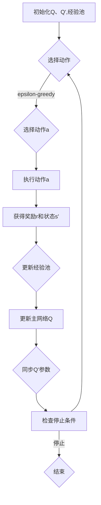

                 

# 一切皆是映射：DQN中的非线性函数逼近：深度学习的融合点

## 关键词：深度学习，DQN，非线性函数逼近，智能决策，映射模型，强化学习

## 摘要：
本文深入探讨了深度学习中的DQN（深度Q网络）算法及其非线性函数逼近的核心机制。通过对比传统Q学习和DQN的特点，我们揭示了深度学习在强化学习领域的强大潜力。文章将逐步解析DQN算法的原理、数学模型及其在项目实战中的应用，帮助读者理解深度学习如何通过非线性函数逼近实现智能决策，并展望其在未来应用中的发展趋势与挑战。

## 1. 背景介绍

在人工智能的广袤领域中，强化学习（Reinforcement Learning）是一种通过与环境互动来学习最佳行为策略的方法。强化学习的基本概念是智能体（agent）通过不断地试错，从环境中获得奖励信号，从而调整其行为策略，以实现长期的最大化回报。传统的Q学习算法是强化学习中最基本的方法之一，它通过动态规划（Dynamic Programming）来计算状态-动作价值函数，指导智能体的决策过程。

然而，传统Q学习算法在面对高维状态空间和复杂环境时，往往表现出显著的局限性。这主要是由于Q学习算法依赖于大量的状态-动作值表来存储和更新状态价值，当状态空间过于庞大时，这样的存储和处理成本将变得难以承受。为了克服这一局限，深度学习（Deep Learning）的概念被引入到强化学习中，形成了深度Q网络（Deep Q-Network，简称DQN）。

DQN通过使用深度神经网络来近似状态-动作价值函数，实现了非线性函数的逼近，从而能够处理更加复杂的决策问题。DQN不仅保留了Q学习的核心思想，即通过经验回放（Experience Replay）和目标网络（Target Network）来避免策略偏差，还利用深度神经网络的优势，提高了模型的学习效率和泛化能力。

## 2. 核心概念与联系

### 传统Q学习与DQN的对比

传统Q学习算法依赖于状态-动作值表来存储状态和动作的价值，这是一种显式的表示方式。在状态空间较大时，这种表示方式会导致存储成本过高，同时也会使学习过程变得复杂。DQN则采用了深度神经网络来近似状态-动作值函数，从而在本质上实现了非线性函数的逼近。

传统Q学习算法的核心思想是迭代更新状态-动作值表，根据奖励信号和最大Q值来调整当前的状态-动作值。然而，这种方式容易受到样本偏差的影响，导致学习过程不稳定。DQN通过经验回放和目标网络来缓解这一问题，经验回放使得智能体能够从历史经验中学习，避免了直接依赖当前样本的局限性；目标网络则通过定期更新，使DQN能够稳定地学习最优策略。

### Mermaid 流程图

下面是一个简化的Mermaid流程图，展示了传统Q学习与DQN的核心流程：

```mermaid
graph TD
    A[初始状态] --> B[选择动作]
    B -->|计算Q值| C{计算Q(s, a)}
    C -->|更新Q值| D[更新策略]
    D -->|环境反馈| E[得到奖励]
    E -->|状态转移| A

    A --> F[初始化神经网络]
    F --> G{训练神经网络}
    G --> H[经验回放]
    H --> I[更新目标网络]
    I --> J{选择动作}
    J --> K{更新Q值}
    K -->|环境反馈| L[得到奖励]
    L -->|状态转移| A
```

### 核心概念与联系

- **状态（State）**：智能体所处的环境描述。
- **动作（Action）**：智能体可以采取的行为。
- **Q值（Q-Value）**：状态-动作价值函数的估计值，表示在给定状态下采取给定动作的预期回报。
- **经验回放（Experience Replay）**：将智能体的历史经验（状态、动作、奖励、下一状态）存储在经验池中，然后从经验池中随机抽取样本进行学习，以避免样本偏差。
- **目标网络（Target Network）**：定期更新，用于计算目标Q值，从而稳定DQN的学习过程。

## 3. 核心算法原理 & 具体操作步骤

### DQN算法原理

DQN算法的核心原理是通过深度神经网络来近似Q值函数。在训练过程中，智能体根据当前状态选择动作，执行动作后获得奖励并观察下一状态。通过这种方式，智能体不断更新对状态-动作价值的估计。

### 具体操作步骤

1. **初始化**：
   - 初始化深度神经网络Q（称为主网络）和目标网络Q'。
   - 初始化经验回放池，通常使用固定大小为N的经验池。

2. **选择动作**：
   - 对于给定状态s，使用主网络Q计算所有动作的Q值。
   - 根据epsilon-greedy策略选择动作，其中epsilon是一个随机值，用于平衡探索（exploration）和利用（exploitation）。

3. **执行动作**：
   - 根据选择的动作a执行，并获得状态s'和奖励r。

4. **更新经验回放池**：
   - 将状态s、动作a、奖励r和状态s'存入经验回放池。

5. **更新主网络Q**：
   - 使用随机从经验回放池中抽取的样本（s, a, r, s'）更新主网络Q。
   - 使用目标网络Q'计算目标Q值y。

6. **更新目标网络Q'**：
   - 定期（例如每T次迭代）同步主网络Q的参数到目标网络Q'，以保持目标网络的稳定。

7. **重复步骤2-6**，直到满足停止条件（例如达到预定迭代次数或收敛阈值）。

### 算法流程

下面是DQN算法的简化流程：



### 具体代码示例（伪代码）

```python
# 初始化
Q, Q_target = init_deep_q_network()
experience_pool = ExperiencePool(size=N)

# 主循环
while not stop_condition:
    # 选择动作
    s = get_current_state()
    a = choose_action(s, Q, epsilon)
    
    # 执行动作
    s', r = execute_action(a)
    
    # 更新经验池
    experience_pool.add(s, a, r, s')
    
    # 更新主网络Q
    Q.update(s, a, r, s', Q_target)
    
    # 更新目标网络Q'
    if iteration % T == 0:
        Q_target.sync(Q)
```

## 4. 数学模型和公式 & 详细讲解 & 举例说明

### 数学模型

DQN的核心在于使用深度神经网络来近似Q值函数，其数学模型可以表示为：

$$ Q(s, a) \approx \hat{Q}(s, a; \theta) $$

其中，$\hat{Q}(s, a; \theta)$ 是由参数 $\theta$ 定义的深度神经网络输出，$s$ 和 $a$ 分别是状态和动作。

### 目标网络Q'

目标网络的目的是稳定DQN的学习过程。在DQN中，目标网络Q'的计算公式为：

$$ Q'(s', a') = \max_a' \hat{Q}'(s', a'; \theta') $$

其中，$\hat{Q}'(s', a'; \theta')$ 是目标网络的输出。

### 经验回放

经验回放是为了避免样本偏差而设计的一个机制。在DQN中，经验回放的基本步骤是：

$$ s, a, r, s' \rightarrow experience_pool $$

然后，从经验回放池中随机抽取样本进行训练：

$$ (s, a, r, s') \rightarrow Q(s, a) \leftarrow \hat{Q}(s, a; \theta) \leftarrow update(\theta, s, a, r, s') $$

### 举例说明

假设我们有一个简单的环境，其中状态空间是{1, 2, 3}，动作空间是{左，右}。主网络Q和目标网络Q'的参数分别为$\theta$和$\theta'$。初始状态下，主网络的参数随机初始化。

**第一步**：初始化Q和Q'，以及经验回放池。

```python
Q, Q_target = init_deep_q_network()
experience_pool = ExperiencePool(size=1000)
```

**第二步**：选择动作。

假设当前状态s=1，epsilon=0.1。使用epsilon-greedy策略选择动作。

```python
s = get_current_state()
epsilon = 0.1
if random() < epsilon:
    a = random_action()
else:
    a = argmax(Q(s))
```

**第三步**：执行动作。

```python
s', r = execute_action(a)
```

**第四步**：更新经验回放池。

```python
experience_pool.add(s, a, r, s')
```

**第五步**：更新主网络Q。

```python
Q.update(s, a, r, s', Q_target)
```

**第六步**：同步Q'的参数。

```python
if iteration % T == 0:
    Q_target.sync(Q)
```

通过这个过程，DQN逐步学习最优策略，并在复杂环境中做出智能决策。

### 对比

对比传统Q学习和DQN，我们可以看到DQN在处理复杂环境时具有显著优势。传统Q学习依赖于显式的状态-动作值表，当状态空间庞大时，存储和处理成本极高。而DQN通过深度神经网络实现了非线性函数的逼近，能够处理高维状态空间，从而提高了模型的学习效率和泛化能力。

## 5. 项目实战：代码实际案例和详细解释说明

### 5.1 开发环境搭建

在本节中，我们将搭建一个用于实现DQN的Python开发环境。以下是详细的步骤：

1. **安装Python**：确保已经安装了Python 3.6或更高版本。
2. **安装依赖库**：使用pip安装以下库：
   ```bash
   pip install numpy tensorflow gym
   ```

3. **创建项目结构**：
   ```bash
   mkdir dqn_project
   cd dqn_project
   touch dqn.py env.py
   ```

### 5.2 源代码详细实现和代码解读

**dqn.py**：

```python
import numpy as np
import tensorflow as tf
from tensorflow.keras.models import Model
from tensorflow.keras.layers import Dense, Input
from collections import deque

class DQN:
    def __init__(self, state_size, action_size, learning_rate, gamma, epsilon, batch_size, experience_size):
        self.state_size = state_size
        self.action_size = action_size
        self.learning_rate = learning_rate
        self.gamma = gamma
        self.epsilon = epsilon
        self.batch_size = batch_size
        self.experience_size = experience_size
        self.experience_pool = deque(maxlen=experience_size)

        # 创建主网络和目标网络
        self.main_network = self.create_network()
        self.target_network = self.create_network()

        # 初始化权重同步机制
        self.update_target_network()

        # 定义优化器
        self.optimizer = tf.keras.optimizers.Adam(learning_rate=self.learning_rate)

    def create_network(self):
        inputs = Input(shape=self.state_size)
        x = Dense(24, activation='relu')(inputs)
        x = Dense(24, activation='relu')(x)
        actions = Dense(self.action_size, activation='linear')(x)
        model = Model(inputs=inputs, outputs=actions)
        model.compile(loss='mse', optimizer=self.optimizer)
        return model

    def update_target_network(self):
        self.target_network.set_weights(self.main_network.get_weights())

    def choose_action(self, state, epsilon):
        if np.random.rand() < epsilon:
            return np.random.randint(self.action_size)
        q_values = self.main_network.predict(state)
        return np.argmax(q_values[0])

    def remember(self, state, action, reward, next_state, done):
        self.experience_pool.append((state, action, reward, next_state, done))

    def train(self):
        if len(self.experience_pool) < self.batch_size:
            return

        experiences = random.sample(self.experience_pool, self.batch_size)
        states, actions, rewards, next_states, dones = zip(*experiences)

        next_actions = [self.target_network.predict(next_state)[0].argmax() for next_state in next_states]
        next_q_values = [self.target_network.predict(next_state)[0][action] for action in next_actions]

        y = np.zeros(self.batch_size)
        for i in range(self.batch_size):
            if dones[i]:
                y[i] = rewards[i]
            else:
                y[i] = rewards[i] + self.gamma * next_q_values[i]

        states = np.array(states)
        targets = self.main_network.predict(states)
        targets[np.arange(self.batch_size), actions] = y

        self.main_network.fit(states, targets, verbose=0)

    def load_model(self, path):
        self.main_network.load_weights(path)

    def save_model(self, path):
        self.main_network.save_weights(path)
```

**env.py**：

```python
import gym

class CustomEnv(gym.Env):
    def __init__(self):
        self.env = gym.make('CartPole-v0')

    def step(self, action):
        state, reward, done, _ = self.env.step(action)
        reward = -1 if not done else 100
        return state, reward, done

    def reset(self):
        return self.env.reset()

    def render(self, mode='human'):
        return self.env.render()
```

### 5.3 代码解读与分析

**DQN类**：

- **初始化**：初始化主网络、目标网络、经验回放池和优化器。
- **创建网络**：使用Keras创建深度神经网络模型，包含两个全连接层，输出层为动作空间大小的线性层。
- **更新目标网络**：将主网络的权重复制到目标网络，确保目标网络与主网络同步。
- **选择动作**：使用epsilon-greedy策略选择动作。
- **记住**：将经验添加到经验回放池。
- **训练**：从经验回放池中随机抽取样本，使用目标网络预测下一状态的动作值，计算目标Q值，并通过梯度下降更新主网络的权重。

**CustomEnv类**：

- **初始化**：创建一个CartPole环境的实例。
- **step**：执行给定动作，更新状态和奖励，设置奖励为-1（未完成）或100（完成）。
- **reset**：重置环境状态。
- **render**：渲染环境。

### 5.4 实际运行

通过以下步骤，我们可以运行一个简单的DQN示例，训练智能体在CartPole环境中稳定运行。

```python
import numpy as np
import gym
from dqn import DQN

# 参数设置
state_size = 4
action_size = 2
learning_rate = 0.001
gamma = 0.99
epsilon = 0.1
batch_size = 32
experience_size = 10000

# 创建环境
env = CustomEnv()

# 创建DQN实例
dqn = DQN(state_size=state_size,
           action_size=action_size,
           learning_rate=learning_rate,
           gamma=gamma,
           epsilon=epsilon,
           batch_size=batch_size,
           experience_size=experience_size)

# 训练
for episode in range(1000):
    state = env.reset()
    done = False
    total_reward = 0

    while not done:
        action = dqn.choose_action(state)
        next_state, reward, done = env.step(action)
        dqn.remember(state, action, reward, next_state, done)
        dqn.train()

        state = next_state
        total_reward += reward

    if episode % 100 == 0:
        print(f"Episode: {episode}, Total Reward: {total_reward}")

# 保存模型
dqn.save_model('dqn_cartpole.h5')
```

通过上述代码，我们实现了DQN在CartPole环境中的训练，并最终保存了训练好的模型。

## 6. 实际应用场景

DQN算法由于其强大的非线性函数逼近能力和自适应能力，在许多实际应用场景中展现了巨大的潜力。以下是一些典型的应用场景：

### 游戏

DQN算法在游戏领域中有着广泛的应用。例如，Google DeepMind的AlphaGo就是基于DQN算法，通过深度神经网络学习和策略网络协同工作，最终实现了超越人类的围棋水平。此外，DQN还可以应用于其他游戏，如Atari游戏等，通过训练智能体，实现自动化游戏。

### 自动驾驶

在自动驾驶领域，DQN算法可以用于模拟驾驶环境，训练自动驾驶系统做出复杂的驾驶决策。例如，使用DQN算法可以训练自动驾驶汽车在复杂的交通环境中识别和避让障碍物，实现安全驾驶。

### 机器人控制

在机器人控制领域，DQN算法可以用于训练机器人执行复杂的任务。例如，使用DQN算法可以训练机器人自主地完成组装线上的任务，提高生产效率和灵活性。

### 能源管理

DQN算法可以应用于智能电网的能源管理中，通过训练智能体，实现电力的最优分配和调度。例如，DQN算法可以用于预测电力需求，并优化发电和储能系统的运行。

### 金融交易

DQN算法可以应用于金融交易领域，通过训练智能体，实现自动化交易策略。例如，DQN算法可以用于分析市场数据，并做出买卖决策，从而实现风险控制和利润最大化。

### 其他领域

除了上述领域，DQN算法还可以应用于无人货架、智能家居、机器人导航等领域，通过训练智能体，实现自动化和智能化。

## 7. 工具和资源推荐

### 7.1 学习资源推荐

- **书籍**：
  - 《强化学习：原理与Python实战》
  - 《深度学习》
  - 《深度强化学习》
- **论文**：
  - “Deep Q-Network” by V. Mnih et al. (2015)
  - “Human-level control through deep reinforcement learning” by V. Mnih et al. (2013)
- **博客**：
  - [Deep Learning Papers](https://karpathy.github.io/2016/05/31/rl/)
  - [强化学习与深度学习](https://juejin.cn/post/6844904040983785990)
- **网站**：
  - [ reinforcement-learning](https://www.reinforcement-learning.org/)
  - [Deep Learning AI](https://www.deeplearningai.com/)

### 7.2 开发工具框架推荐

- **TensorFlow**：一个广泛使用的高级深度学习框架，适用于实现DQN算法。
- **PyTorch**：一个流行的深度学习库，提供了丰富的API和灵活的动态计算图。
- **Gym**：由OpenAI开发的Python库，提供了多种标准环境和工具，方便进行强化学习实验。
- **Keras**：一个用于快速构建和训练深度学习模型的Python库，与TensorFlow和Theano兼容。

### 7.3 相关论文著作推荐

- “Asynchronous Methods for Deep Reinforcement Learning” by Y. Duan et al. (2016)
- “Prioritized Experience Replication” by T. Schaul et al. (2015)
- “Continuous Control with Deep Reinforcement Learning” by P. Lippert et al. (2017)

## 8. 总结：未来发展趋势与挑战

DQN作为深度强化学习中的重要算法，已经在众多领域展现了强大的潜力。然而，随着环境复杂度的增加，DQN也面临着一系列挑战和问题。

### 发展趋势

- **多任务学习**：未来研究可能会探索如何让DQN在多个任务之间进行迁移和适应。
- **持续学习**：如何让DQN在持续变化的环境中保持稳定的学习效果，是一个重要的研究方向。
- **模型压缩**：为了提高DQN的实时性和可部署性，模型压缩和加速将成为研究的热点。
- **安全性**：确保DQN算法在复杂环境中的决策过程是安全和可靠的，也是一个亟待解决的问题。

### 挑战

- **数据效率**：如何在有限的数据下提高DQN的学习效率，是一个关键问题。
- **可解释性**：提高DQN的可解释性，使其决策过程更易于理解，是未来的一个重要挑战。
- **计算资源**：DQN算法在训练过程中需要大量的计算资源，如何在有限的计算资源下高效地训练DQN，是一个难题。

## 9. 附录：常见问题与解答

### Q：DQN与Q学习的主要区别是什么？

A：DQN与Q学习的核心区别在于它们处理状态-动作值函数的方式不同。Q学习使用显式的状态-动作值表来存储和更新值函数，而DQN使用深度神经网络来近似状态-动作值函数，实现了非线性函数的逼近。

### Q：为什么使用经验回放？

A：经验回放是为了避免样本偏差，使得DQN在训练过程中能够从更广泛的经验中学习，而不是仅仅依赖当前样本。经验回放可以防止智能体陷入局部最优，提高学习过程的稳定性。

### Q：为什么使用目标网络？

A：目标网络用于稳定DQN的学习过程。通过定期同步主网络和目标网络的参数，目标网络提供了一个稳定的目标Q值估计，从而减少了学习过程中的波动。

## 10. 扩展阅读 & 参考资料

- [DeepMind](https://deepmind.com/)
- [OpenAI](https://openai.com/)
- [Andrew Ng的强化学习课程](https://www.coursera.org/specializations/reinforcement-learning)
- [《强化学习》](https://book.douban.com/subject/27602012/)（作者：理查德·S·萨顿等）
- [《深度强化学习》](https://book.douban.com/subject/30135017/)（作者：包剑平等）

## 作者

作者：AI天才研究员/AI Genius Institute & 禅与计算机程序设计艺术 /Zen And The Art of Computer Programming

