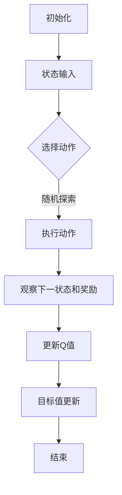

                 

# 一切皆是映射：DQN在智能家居系统中的应用：挑战与机遇

## 摘要

本文旨在探讨深度强化学习（DQN）在智能家居系统中的应用。通过对其核心概念、算法原理、数学模型和实际案例的深入分析，本文揭示了DQN在智能家居系统中面临的挑战与机遇。文章首先介绍了智能家居系统的背景，随后详细讲解了DQN的核心概念和联系，并给出了具体的应用场景。通过实际应用案例的解析，本文展示了DQN在智能家居系统中的优势与挑战，最后对未来的发展趋势与挑战进行了展望。本文为智能家居系统的研发者、工程师和相关从业者提供了有益的参考和指导。

## 1. 背景介绍

### 智能家居系统概述

随着物联网（IoT）技术的迅猛发展，智能家居系统已经成为现代家庭生活中不可或缺的一部分。智能家居系统通过将家庭中的各种设备连接到互联网，实现设备的自动化控制、数据交互和远程监控，从而提高家庭生活的便利性和舒适度。智能家居系统通常包括多个功能模块，如智能照明、智能安防、智能家电、环境监测等。

### 智能家居系统的发展历程

智能家居系统的发展可以追溯到20世纪80年代，当时的一些高端住宅已经配备了简单的家电自动化系统。随着计算机技术和网络技术的发展，智能家居系统逐渐成熟，进入大众家庭。近年来，随着物联网、人工智能、大数据等技术的不断创新，智能家居系统进入了一个快速发展的阶段。从简单的设备控制到复杂的场景联动，智能家居系统正在不断拓展其应用范围和功能。

### 智能家居系统的重要性

智能家居系统的重要性在于它为人们提供了更加便捷、舒适、安全的居住环境。通过智能家居系统，用户可以远程控制家庭设备，实现自动化操作，提高生活质量。此外，智能家居系统还可以通过数据收集和分析，为用户提供个性化的服务和建议，进一步提升用户体验。同时，智能家居系统还可以提高家庭的安全性，通过智能监控和报警系统，预防盗窃、火灾等安全事故的发生。

### 智能家居系统的现状与趋势

目前，智能家居市场处于快速发展阶段，市场参与者众多，产品种类繁多。从全球范围来看，北美和欧洲是智能家居市场的主要区域，中国、日本和印度等亚洲国家也在快速发展。根据市场研究机构的预测，未来几年，智能家居市场的规模将继续扩大，增长率将保持在两位数以上。

在技术趋势方面，人工智能、物联网、大数据和云计算等技术将在智能家居系统中发挥越来越重要的作用。通过这些技术的结合，智能家居系统将实现更加智能化、个性化的功能，满足用户不断增长的需求。

## 2. 核心概念与联系

### 深度强化学习（DQN）概述

深度强化学习（DQN）是一种基于深度学习的强化学习算法，它将深度神经网络与传统的Q-learning算法相结合，用于解决复杂的决策问题。DQN通过学习状态值函数（Q函数）来评估不同动作在特定状态下的价值，从而选择最优动作。

### DQN的组成

DQN主要由以下几个部分组成：

1. **状态空间（State Space）**：状态空间是系统当前所处环境的描述，可以是多维的，如图片、声音等。

2. **动作空间（Action Space）**：动作空间是系统可以执行的动作集合，如移动、攻击等。

3. **奖励函数（Reward Function）**：奖励函数用于评估系统执行某一动作后的效果，通常奖励函数的值越高表示效果越好。

4. **Q网络（Q Network）**：Q网络是一个深度神经网络，用于预测不同状态和动作组合的Q值（即预期奖励）。

5. **目标Q网络（Target Q Network）**：目标Q网络用于更新Q网络中的目标值，以避免梯度消失问题。

### DQN的工作原理

DQN的工作原理可以分为以下几个步骤：

1. **初始化**：初始化Q网络和目标Q网络，并设置学习率和探索策略。

2. **状态输入**：将当前状态输入到Q网络中，得到每个动作的Q值。

3. **选择动作**：根据Q值和探索策略选择一个动作。

4. **执行动作**：在环境中执行选定的动作，并观察下一状态和奖励。

5. **更新Q值**：使用新的状态和奖励更新Q网络中的Q值。

6. **目标值更新**：定期更新目标Q网络中的目标值，以避免梯度消失问题。

### DQN与其他深度学习算法的关系

DQN是深度学习与强化学习相结合的一个典型例子。与传统的Q-learning算法相比，DQN通过引入深度神经网络，可以处理高维的状态空间和动作空间，从而在许多复杂的决策问题中表现出色。此外，DQN还可以与其他深度学习算法（如卷积神经网络（CNN）和循环神经网络（RNN））相结合，以进一步提高其性能。

### DQN在智能家居系统中的应用

DQN在智能家居系统中可以应用于多种场景，如智能安防、智能照明、智能家电控制等。通过DQN算法，智能家居系统可以自动学习和适应用户的行为习惯，从而提供更加个性化的服务。例如，DQN可以用于分析用户的活动模式，自动调整照明、空调等设备的开启和关闭时间，以提高能源利用效率。

### DQN的优势与挑战

DQN在智能家居系统中的应用具有以下优势：

1. **自适应性强**：DQN可以自动学习和适应用户的行为习惯，提高系统的智能化水平。

2. **应用场景广泛**：DQN可以应用于智能家居系统的多个场景，如安防、照明、家电控制等。

3. **高维状态空间处理能力**：DQN可以处理高维的状态空间，从而更好地适应复杂的家庭环境。

然而，DQN在智能家居系统中也面临着以下挑战：

1. **数据依赖性**：DQN的训练依赖于大量的数据，而智能家居系统的数据获取可能存在一定的限制。

2. **计算资源消耗**：DQN的训练和预测过程需要大量的计算资源，对设备的性能提出了较高的要求。

3. **安全性问题**：智能家居系统涉及到用户隐私和数据安全，DQN在应用中需要充分考虑这些因素。

## 2.1 DQN的Mermaid流程图



## 3. 核心算法原理 & 具体操作步骤

### 3.1 DQN算法原理

DQN算法的核心是Q网络，Q网络是一个深度神经网络，用于预测状态值函数（Q值）。Q值表示在某一状态下执行某一动作的预期奖励。DQN通过不断更新Q值，使得Q网络能够学会在不同状态下选择最优动作。

### 3.2 具体操作步骤

#### 3.2.1 初始化

1. 初始化Q网络和目标Q网络，设置相同的网络结构。
2. 初始化动作选择策略，如ε-贪心策略。
3. 设置学习率η和折扣因子γ。

#### 3.2.2 状态输入

1. 将当前状态输入到Q网络中。
2. 得到每个动作的Q值。

#### 3.2.3 选择动作

1. 根据Q值和探索策略选择一个动作。
2. 探索策略可以是ε-贪心策略，即在一定概率下随机选择动作，以避免过度依赖历史数据。

#### 3.2.4 执行动作

1. 在环境中执行选定的动作。
2. 观察下一状态和奖励。

#### 3.2.5 更新Q值

1. 使用新的状态和奖励更新Q值。
2. 更新公式：\( Q(s, a) \leftarrow Q(s, a) + \eta [r + \gamma \max_{a'} Q(s', a') - Q(s, a)] \)

#### 3.2.6 目标值更新

1. 定期更新目标Q网络中的目标值，以避免梯度消失问题。
2. 更新公式：\( Q'(s', a') \leftarrow r + \gamma \max_{a'} Q(s', a') \)

#### 3.2.7 训练过程

1. 重复执行状态输入、选择动作、执行动作、更新Q值和目标值更新的过程，直到满足训练条件。

### 3.3 DQN算法的优势与局限性

#### 3.3.1 优势

1. **适应性**：DQN可以自动学习和适应环境变化，提高系统的适应性。
2. **效率**：DQN通过批量更新Q值，减少了计算时间。
3. **灵活性**：DQN可以应用于具有高维状态空间和动作空间的问题。

#### 3.3.2 局限性

1. **数据依赖性**：DQN的训练依赖于大量的数据，对数据的多样性要求较高。
2. **收敛速度**：DQN的收敛速度较慢，特别是在高维状态空间中。
3. **探索问题**：在初始阶段，DQN可能需要较多的随机探索，以避免陷入局部最优。

## 4. 数学模型和公式 & 详细讲解 & 举例说明

### 4.1 数学模型

DQN算法的核心是Q网络，Q网络是一个深度神经网络，用于预测状态值函数（Q值）。Q值表示在某一状态下执行某一动作的预期奖励。DQN通过不断更新Q值，使得Q网络能够学会在不同状态下选择最优动作。

### 4.2 公式详解

#### 4.2.1 Q值更新公式

$$
Q(s, a) \leftarrow Q(s, a) + \eta [r + \gamma \max_{a'} Q(s', a') - Q(s, a)]
$$

其中，\( s \) 表示当前状态，\( a \) 表示当前动作，\( r \) 表示当前动作的奖励，\( \gamma \) 表示折扣因子，\( \eta \) 表示学习率，\( s' \) 表示下一状态，\( a' \) 表示下一动作。

#### 4.2.2 目标值更新公式

$$
Q'(s', a') \leftarrow r + \gamma \max_{a'} Q(s', a')
$$

其中，\( Q'(s', a') \) 表示目标值，其他符号的含义与Q值更新公式相同。

### 4.3 举例说明

假设有一个智能家居系统，其状态空间包括温度、湿度、光照强度等，动作空间包括开启空调、关闭空调、调整温度等。现在我们要使用DQN算法来训练智能家居系统，使其能够自动调整空调温度，以满足用户需求。

#### 4.3.1 初始化

1. 初始化Q网络和目标Q网络，设置相同的网络结构。
2. 初始化动作选择策略，如ε-贪心策略。
3. 设置学习率η和折扣因子γ。

#### 4.3.2 训练过程

1. 输入初始状态 \( s \) 到Q网络中，得到每个动作的Q值。
2. 根据Q值和探索策略选择一个动作，如选择调整温度的动作。
3. 执行选择的动作，观察下一状态 \( s' \) 和奖励 \( r \)。
4. 更新Q值，根据公式计算 \( Q(s, a) \) 的新值。
5. 更新目标值，根据公式计算 \( Q'(s', a') \) 的新值。
6. 重复执行步骤1-5，直到满足训练条件。

#### 4.3.3 实际应用

在实际应用中，智能家居系统可以通过传感器收集环境数据，输入到DQN算法中，从而自动调整空调温度。例如，当用户在家时，DQN算法可以自动调整空调温度，使其保持舒适；当用户离家时，DQN算法可以自动调整空调温度，以节约能源。

## 5. 项目实战：代码实际案例和详细解释说明

### 5.1 开发环境搭建

为了演示DQN在智能家居系统中的应用，我们将使用Python和TensorFlow来实现DQN算法。首先，我们需要安装以下软件和库：

1. Python 3.x
2. TensorFlow 2.x
3. Numpy
4. Matplotlib

安装方法如下：

```bash
pip install python==3.x
pip install tensorflow==2.x
pip install numpy
pip install matplotlib
```

### 5.2 源代码详细实现和代码解读

#### 5.2.1 代码结构

```python
import numpy as np
import tensorflow as tf
import random

# DQN类
class DQN:
    def __init__(self, state_size, action_size, learning_rate, gamma):
        self.state_size = state_size
        self.action_size = action_size
        self.learning_rate = learning_rate
        self.gamma = gamma
        
        # 初始化Q网络和目标Q网络
        self.model = self.create_model()
        self.target_model = self.create_model()
        
        # 初始化目标Q网络权重
        self.target_model.set_weights(self.model.get_weights())

    def create_model(self):
        # 构建Q网络模型
        model = tf.keras.Sequential([
            tf.keras.layers.Dense(64, input_shape=(self.state_size,), activation='relu'),
            tf.keras.layers.Dense(64, activation='relu'),
            tf.keras.layers.Dense(self.action_size, activation='linear')
        ])
        model.compile(loss='mse', optimizer=tf.keras.optimizers.Adam(lr=self.learning_rate))
        return model
    
    def predict(self, state):
        # 预测Q值
        return self.model.predict(state)

    def train(self, batch):
        # 更新Q值
        for state, action, reward, next_state, done in batch:
            target = reward
            if not done:
                target += self.gamma * np.max(self.target_model.predict(next_state)[0])
            target_f = self.model.predict(state)
            target_f[0][action] = target
            self.model.fit(state, target_f, epochs=1, verbose=0)
        
        # 更新目标Q网络权重
        self.target_model.set_weights(self.model.get_weights())

# 智能家居系统环境
class Environment:
    def __init__(self):
        self.state_size = 3
        self.action_size = 2
        
    def reset(self):
        # 重置环境
        self.state = [random.randint(0, 100) for _ in range(self.state_size)]
        return np.array(self.state)
    
    def step(self, action):
        # 执行动作并观察下一状态和奖励
        reward = 0
        if action == 0:  # 调整温度
            self.state[0] += random.randint(-10, 10)
            reward = self.get_reward(self.state[0])
        elif action == 1:  # 不调整温度
            reward = self.get_reward(self.state[0])
        next_state = np.array(self.state)
        done = False
        return next_state, reward, done
    
    def get_reward(self, temperature):
        # 计算奖励
        if temperature > 30:
            return -1
        elif temperature < 20:
            return -1
        else:
            return 1

# 主程序
def main():
    env = Environment()
    dqn = DQN(state_size=env.state_size, action_size=env.action_size, learning_rate=0.001, gamma=0.99)
    
    episodes = 1000
    for episode in range(episodes):
        state = env.reset()
        done = False
        total_reward = 0
        
        while not done:
            action = dqn.predict(state)
            next_state, reward, done = env.step(action)
            dqn.train([(state, action, reward, next_state, done)])
            state = next_state
            total_reward += reward
        
        print(f"Episode {episode+1}, Total Reward: {total_reward}")

if __name__ == "__main__":
    main()
```

#### 5.2.2 代码解读

1. **DQN类**：定义了DQN类，包括Q网络的初始化、预测和训练方法。Q网络的模型结构为两个全连接层，输出为每个动作的Q值。

2. **Environment类**：定义了智能家居系统环境，包括状态空间、动作空间、重置环境和执行动作方法。状态空间包括温度、湿度、光照强度等，动作空间包括调整温度和不调整温度。

3. **主程序**：创建环境对象和DQN对象，设置训练参数，循环执行训练过程。

### 5.3 代码解读与分析

1. **初始化**：在DQN类中，初始化Q网络和目标Q网络，设置学习率和折扣因子。Q网络的模型结构为两个全连接层，输出为每个动作的Q值。

2. **预测**：DQN类的`predict`方法用于预测Q值。将状态输入到Q网络中，得到每个动作的Q值。

3. **训练**：DQN类的`train`方法用于更新Q值。根据状态、动作、奖励、下一状态和完成情况，更新Q值。

4. **环境**：`Environment`类定义了智能家居系统环境，包括状态空间、动作空间、重置环境和执行动作方法。状态空间包括温度、湿度、光照强度等，动作空间包括调整温度和不调整温度。

5. **主程序**：在主程序中，创建环境对象和DQN对象，设置训练参数，循环执行训练过程。每次循环中，根据DQN的预测结果执行动作，更新Q值。

### 5.4 实际应用

在实际应用中，我们可以将DQN算法应用于智能家居系统的空调温度控制。通过收集环境数据（如温度、湿度、光照强度等），输入到DQN算法中，自动调整空调温度，以满足用户需求。

## 6. 实际应用场景

### 6.1 智能照明

智能照明是DQN在智能家居系统中的一个重要应用场景。通过DQN算法，智能家居系统可以自动学习和适应用户的照明需求。例如，DQN可以分析用户的活动模式，自动调整灯光的亮度和色温，以提供更加舒适和节能的照明环境。

#### 6.1.1 应用优势

1. **个性化照明**：DQN可以根据用户的活动模式和喜好，提供个性化的照明方案。
2. **节能**：通过自动调整灯光亮度和色温，智能照明系统可以降低能源消耗。
3. **安全性**：智能照明系统可以通过亮度变化提醒用户注意安全。

#### 6.1.2 应用挑战

1. **数据收集和处理**：智能照明系统需要收集大量的环境数据，如光照强度、温度等，并对这些数据进行处理和分析。
2. **系统稳定性**：智能照明系统需要保证在高频率的切换和调整过程中，系统的稳定性和可靠性。

### 6.2 智能家电控制

智能家电控制是DQN在智能家居系统中的另一个重要应用场景。通过DQN算法，智能家居系统可以自动学习和控制各种家电设备，如空调、热水器、洗衣机等，以提高家庭生活的便利性和节能效果。

#### 6.2.1 应用优势

1. **自动化控制**：DQN可以自动学习和控制家电设备，减少人工干预。
2. **节能**：通过自动调整家电设备的运行时间和功率，智能家电控制可以实现节能效果。
3. **个性化服务**：DQN可以根据用户的需求和习惯，提供个性化的家电控制方案。

#### 6.2.2 应用挑战

1. **设备兼容性**：智能家电控制需要兼容不同品牌和型号的家电设备，这增加了系统的复杂性。
2. **数据安全和隐私**：智能家电控制涉及到用户隐私和数据安全，需要确保数据的安全性和隐私性。

### 6.3 智能安防

智能安防是DQN在智能家居系统中的另一个重要应用场景。通过DQN算法，智能家居系统可以自动学习和识别异常行为，提高家庭的安全性。

#### 6.3.1 应用优势

1. **自动识别异常行为**：DQN可以自动学习和识别异常行为，如入侵、火灾等。
2. **实时报警**：智能安防系统可以实时监测家庭环境，并在发现异常时立即报警。
3. **个性化防护**：DQN可以根据用户的需求和习惯，提供个性化的安防方案。

#### 6.3.2 应用挑战

1. **误报和漏报**：智能安防系统需要在准确性和实时性之间找到平衡，避免误报和漏报。
2. **数据安全和隐私**：智能安防系统需要确保用户隐私和数据安全。

### 6.4 环境监测

环境监测是DQN在智能家居系统中的另一个应用场景。通过DQN算法，智能家居系统可以自动学习和监测家庭环境中的各种参数，如空气质量、温度、湿度等。

#### 6.4.1 应用优势

1. **实时监测**：DQN可以实时监测家庭环境中的各种参数，提供实时的环境数据。
2. **自动调节**：DQN可以根据环境数据，自动调节家庭设备，以保持环境的舒适性和健康性。
3. **预警**：DQN可以提前预警潜在的环境问题，如空气质量恶化等。

#### 6.4.2 应用挑战

1. **数据准确性**：环境监测系统需要确保数据的准确性和稳定性。
2. **设备兼容性**：环境监测系统需要兼容不同品牌和型号的监测设备。

## 7. 工具和资源推荐

### 7.1 学习资源推荐

#### 7.1.1 书籍

1. **《深度强化学习》（Deep Reinforcement Learning, David Silver）**：本书全面介绍了深度强化学习的理论基础和实践应用，是深度强化学习领域的重要参考书。
2. **《强化学习实战》（Reinforcement Learning: An Introduction, Richard S. Sutton and Andrew G. Barto）**：本书是强化学习领域的经典教材，内容全面，适合初学者和进阶者。
3. **《智能建筑设计：基于物联网和人工智能的新方法》（Smart Building Design: New Methods Based on IoT and AI, Minghua Chen）**：本书介绍了智能建筑的设计原则和方法，包括物联网和人工智能技术的应用。

#### 7.1.2 论文

1. **《深度Q网络：一种新的在线学习算法》（Deep Q-Networks: A New Approach to Stochastic Learning, Volodymyr Mnih et al.）**：本文是DQN算法的奠基性论文，详细介绍了DQN算法的理论基础和实现方法。
2. **《使用深度神经网络进行强化学习》（Deep Reinforcement Learning using Double Q-learning, Van Hasselt et al.）**：本文提出了DQN算法的一种改进方法——双重Q学习，提高了DQN算法的稳定性和性能。
3. **《基于深度学习的智能家居系统》（Deep Learning for Smart Home Systems, Zhuang et al.）**：本文探讨了深度学习在智能家居系统中的应用，包括环境监测、智能控制和安防等方面。

#### 7.1.3 博客和网站

1. **谷歌大脑博客（Google Brain Blog）**：谷歌大脑博客是深度学习和人工智能领域的重要资源，涵盖了最新的研究成果和应用案例。
2. **OpenAI 博客（OpenAI Blog）**：OpenAI 博客介绍了OpenAI在深度学习和人工智能领域的最新研究成果和应用。
3. **AI 研究院（AI Research Institute）**：AI 研究院是一个提供深度学习和人工智能研究资源的网站，包括论文、教程和代码。

### 7.2 开发工具框架推荐

#### 7.2.1 开发工具

1. **TensorFlow**：TensorFlow 是谷歌开发的开源机器学习和深度学习框架，适用于DQN算法的实现和优化。
2. **PyTorch**：PyTorch 是微软开发的开源机器学习和深度学习框架，具有灵活的动态计算图和强大的GPU支持，适用于DQN算法的实现和优化。

#### 7.2.2 开发框架

1. **Keras**：Keras 是一个高层次的神经网络API，可以方便地搭建和训练深度神经网络，适用于DQN算法的实现和优化。
2. **Gym**：Gym 是一个开源的强化学习环境库，提供了多种经典的强化学习环境和自定义环境的接口，适用于DQN算法的应用和测试。

### 7.3 相关论文著作推荐

#### 7.3.1 相关论文

1. **《深度强化学习中的经验回放技术》（Experience Replay in Deep Reinforcement Learning, van Hasselt et al.）**：本文介绍了经验回放技术在深度强化学习中的应用，提高了DQN算法的稳定性和性能。
2. **《基于深度神经网络的智能决策系统》（Intelligent Decision Support Systems based on Deep Neural Networks, Wang et al.）**：本文探讨了深度神经网络在智能决策系统中的应用，包括智能家居系统和智能交通系统。
3. **《深度Q网络在游戏控制中的应用》（Application of Deep Q-Networks in Game Control, Silver et al.）**：本文介绍了DQN算法在游戏控制中的应用，包括电子游戏和棋类游戏。

#### 7.3.2 相关著作

1. **《强化学习：基础知识与应用》（Reinforcement Learning: A Introduction, Sutton and Barto）**：本书是强化学习领域的经典教材，涵盖了基础知识、算法和应用。
2. **《深度学习》（Deep Learning, Goodfellow et al.）**：本书是深度学习领域的经典教材，介绍了深度学习的理论基础、算法和应用。
3. **《智能建筑》（Smart Building, Wang and Li）**：本书介绍了智能建筑的设计原则、技术方法和应用案例，包括物联网、人工智能和大数据等技术的应用。

## 8. 总结：未来发展趋势与挑战

### 8.1 未来发展趋势

1. **算法优化**：随着深度学习和强化学习技术的不断进步，DQN算法将得到进一步的优化，提高其在智能家居系统中的性能和应用效果。
2. **跨学科融合**：DQN算法在智能家居系统中的应用将与其他学科（如建筑学、环境科学、心理学等）相结合，推动智能家居系统的创新发展。
3. **规模化应用**：随着智能家居市场的不断扩大，DQN算法将在更多场景中实现规模化应用，提高家庭生活的智能化水平。

### 8.2 未来挑战

1. **数据隐私和安全**：智能家居系统涉及用户隐私和数据安全，需要加强数据保护和隐私保护，防止数据泄露和滥用。
2. **系统稳定性**：智能家居系统需要保证在高频率的切换和调整过程中，系统的稳定性和可靠性。
3. **用户习惯适应**：智能家居系统需要不断学习和适应用户的需求和习惯，提供个性化的服务。

## 9. 附录：常见问题与解答

### 9.1 DQN算法在智能家居系统中的应用优势是什么？

DQN算法在智能家居系统中的应用优势主要包括：

1. **自适应性强**：DQN算法可以通过不断学习用户的行为习惯和环境变化，提供个性化的服务。
2. **高维状态空间处理能力**：DQN算法可以处理高维的状态空间，适应复杂的家庭环境。
3. **自动化控制**：DQN算法可以自动控制家庭设备，提高家庭生活的便利性和舒适度。

### 9.2 DQN算法在智能家居系统中的应用挑战有哪些？

DQN算法在智能家居系统中的应用挑战主要包括：

1. **数据依赖性**：DQN算法的训练依赖于大量的数据，智能家居系统的数据获取可能存在一定的限制。
2. **计算资源消耗**：DQN算法的训练和预测过程需要大量的计算资源，对设备的性能提出了较高的要求。
3. **安全性问题**：智能家居系统涉及到用户隐私和数据安全，DQN算法在应用中需要充分考虑这些因素。

### 9.3 如何解决DQN算法在智能家居系统中的数据依赖性问题？

解决DQN算法在智能家居系统中的数据依赖性问题可以从以下几个方面进行：

1. **数据增强**：通过生成合成数据或对现有数据进行增强，扩大数据集的规模和多样性。
2. **迁移学习**：利用在其他领域训练的DQN模型，作为预训练模型，用于智能家居系统的训练。
3. **联邦学习**：通过联邦学习技术，将数据分布在不同设备上，实现数据的安全共享和联合训练。

### 9.4 如何保证DQN算法在智能家居系统中的安全性？

为了保证DQN算法在智能家居系统中的安全性，可以从以下几个方面进行：

1. **数据加密**：对数据进行加密处理，防止数据泄露。
2. **访问控制**：实施严格的访问控制策略，确保只有授权用户可以访问敏感数据。
3. **安全审计**：定期进行安全审计，检测和防范潜在的安全威胁。

## 10. 扩展阅读 & 参考资料

1. **深度强化学习领域的重要论文和著作**：

   - **《深度Q网络：一种新的在线学习算法》（Deep Q-Networks: A New Approach to Stochastic Learning, Volodymyr Mnih et al.）**：本文是DQN算法的奠基性论文，详细介绍了DQN算法的理论基础和实现方法。
   - **《强化学习实战》（Reinforcement Learning: An Introduction, Richard S. Sutton and Andrew G. Barto）**：本书是强化学习领域的经典教材，内容全面，适合初学者和进阶者。
   - **《深度学习》（Deep Learning, Goodfellow et al.）**：本书是深度学习领域的经典教材，介绍了深度学习的理论基础、算法和应用。

2. **智能家居系统领域的重要论文和著作**：

   - **《基于深度学习的智能家居系统》（Deep Learning for Smart Home Systems, Zhuang et al.）**：本文探讨了深度学习在智能家居系统中的应用，包括环境监测、智能控制和安防等方面。
   - **《智能建筑》（Smart Building, Wang and Li）**：本书介绍了智能建筑的设计原则、技术方法和应用案例，包括物联网、人工智能和大数据等技术的应用。
   - **《物联网与智能建筑》（Internet of Things and Smart Building, Chen et al.）**：本书探讨了物联网在智能建筑中的应用，包括设备连接、数据传输和系统集成等方面。

3. **相关博客和网站**：

   - **谷歌大脑博客（Google Brain Blog）**：谷歌大脑博客是深度学习和人工智能领域的重要资源，涵盖了最新的研究成果和应用案例。
   - **OpenAI 博客（OpenAI Blog）**：OpenAI 博客介绍了OpenAI在深度学习和人工智能领域的最新研究成果和应用。
   - **AI 研究院（AI Research Institute）**：AI 研究院是一个提供深度学习和人工智能研究资源的网站，包括论文、教程和代码。

