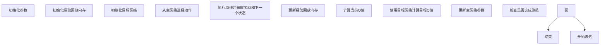

                 

### 背景介绍

在当今数字化时代，能源管理系统（EMS）已经成为各行各业提高能源效率、降低运营成本和实现可持续发展的重要工具。能源管理系统通过实时监控、分析和优化能源使用，为企业和组织提供了前所未有的洞察力。然而，随着能源系统的日益复杂，传统的手动调控方法已经难以满足高效优化的需求，因此，人工智能（AI）技术在能源管理中的应用变得越来越重要。

其中，深度强化学习（Deep Reinforcement Learning，DRL）作为一种强大的机器学习方法，因其能够通过试错学习和策略优化，在动态和复杂的决策环境中表现出色，逐渐成为能源管理系统研究的热点。DQN（Deep Q-Network），作为一种典型的DRL算法，在游戏、自动驾驶等领域已经取得了显著成果，其在能源管理系统中的应用同样值得探讨。

本文将围绕DQN在能源管理系统中的应用，展开详细的探讨。首先，我们将介绍DQN的基本原理和算法框架，帮助读者理解其核心思想。接着，我们将深入探讨DQN在能源管理系统中的具体应用场景，分析其价值所在。随后，我们将通过一个实际案例，展示如何使用DQN优化能源管理系统。最后，我们将总结DQN在能源管理系统中的应用前景和潜在挑战。

通过本文的阅读，读者将能够全面了解DQN在能源管理系统中的原理、应用和未来发展方向，为相关领域的研究和实践提供有益的参考。接下来，我们首先从DQN的基本原理出发，逐步揭开其在能源管理系统中的神秘面纱。

### 核心概念与联系

为了深入理解DQN在能源管理系统中的应用，我们首先需要掌握一些核心概念和它们之间的联系。这些概念包括深度学习、强化学习、Q值函数以及DQN算法的基本框架。

#### 深度学习（Deep Learning）

深度学习是机器学习中的一个子领域，主要依赖于神经网络，尤其是深度神经网络（Deep Neural Networks，DNN）。深度神经网络通过多层神经元进行信息处理，可以自动从数据中学习特征表示，实现高度复杂的任务。在深度学习中，网络结构的设计、损失函数的选择、优化算法的运用等都是至关重要的因素。通过不断优化这些参数，深度学习模型能够显著提升其预测和决策能力。

#### 强化学习（Reinforcement Learning，RL）

强化学习是一种通过试错学习来优化行为策略的机器学习方法。在强化学习中，智能体（Agent）通过与环境的交互，通过获取奖励（Reward）或惩罚（Penalty）来评估其行为的好坏，并逐步调整行为策略以实现目标。强化学习的关键在于设计有效的奖励机制和策略优化算法，以便智能体能够从经验中学习，并在长期内获得最大收益。

#### Q值函数（Q-Value Function）

Q值函数是强化学习中的一个核心概念，用于评估智能体在特定状态下采取特定动作的价值。在Q值函数中，每个状态-动作对都对应一个Q值，表示在给定状态下采取该动作所能获得的长期累积奖励。Q值函数的目的是通过学习最大化智能体的期望奖励。

#### DQN算法框架

DQN（Deep Q-Network）是一种基于深度学习的Q值函数近似方法。DQN的核心思想是将Q值函数的参数表示为神经网络，通过训练这个神经网络来学习状态-动作价值函数。DQN的主要特点包括：

1. **经验回放（Experience Replay）**：为了避免样本偏差，DQN引入了经验回放机制，将过去的经验数据存储在一个 replay memory 中，并在训练过程中随机抽样使用这些数据，从而保证训练过程的稳定性和多样性。

2. **目标网络（Target Network）**：为了减少梯度消失和梯度爆炸问题，DQN引入了目标网络。目标网络是一个与主网络结构相同但参数独立的网络，用于生成目标Q值，从而指导主网络的更新。

3. **双线性查询（Double Q-Learning）**：DQN采用双线性查询策略，即使用目标网络来选择动作，并使用主网络来计算Q值。这种方法能够减少目标Q值与实际Q值之间的差异，提高算法的稳定性和准确性。

#### Mermaid 流程图

为了更直观地展示DQN算法的框架，我们可以使用Mermaid流程图来描述其基本流程：



通过上述流程图，我们可以清晰地看到DQN从初始化参数、选择动作、获取反馈、更新网络参数的完整过程，这为后续章节中的详细解释提供了基础。

总之，DQN在能源管理系统中的应用依赖于深度学习和强化学习的理论基础，通过Q值函数和经验回放等机制，实现了在动态复杂环境中的智能决策。在下一章节中，我们将进一步探讨DQN算法的具体原理和操作步骤，为理解其在能源管理系统中的应用奠定基础。

### 核心算法原理 & 具体操作步骤

在了解了DQN的核心概念和框架之后，接下来我们将详细探讨DQN的算法原理和具体操作步骤，以便更好地理解其如何应用于能源管理系统。

#### DQN算法原理

DQN（Deep Q-Network）的核心原理是通过深度神经网络近似Q值函数，从而在动态和复杂的决策环境中实现智能决策。具体来说，DQN算法包括以下几个关键组成部分：

1. **状态（State）**：状态是智能体所处的环境特征表示。在能源管理系统中，状态可以包括当前的电力负荷、天气条件、设备运行状态等。

2. **动作（Action）**：动作是智能体可选择的操作，如调整发电功率、控制设备启停等。在能源管理系统中，动作的选取需要考虑能量需求、设备能力和经济成本等多方面因素。

3. **Q值（Q-Value）**：Q值表示在特定状态下采取特定动作所能获得的长期累积奖励。DQN的目标是学习一个最优的Q值函数，以最大化长期回报。

4. **神经网络（Neural Network）**：DQN使用深度神经网络来近似Q值函数。神经网络通过输入状态特征，输出状态-动作对的Q值。

5. **经验回放（Experience Replay）**：经验回放是DQN的重要机制，用于存储和随机重放历史经验，以减少样本偏差，提高算法的泛化能力。

6. **目标网络（Target Network）**：目标网络用于生成目标Q值，与主网络独立更新，以减少梯度消失和梯度爆炸问题，提高算法的稳定性。

#### 具体操作步骤

1. **初始化参数**：
   - 初始化神经网络结构、学习率、折扣因子（γ）、经验回放内存大小等超参数。
   - 初始化主网络和目标网络，并确保两者的参数相同。

2. **选择动作**：
   - 在每个时间步，智能体根据当前状态，使用主网络选择动作。
   - 动作的选择可以通过最大化当前状态的Q值实现，也可以结合探索策略（如ε-贪心策略）以增加多样性。

3. **执行动作并获取反馈**：
   - 智能体执行所选动作，并从环境中获取下一个状态和奖励。
   - 奖励可以是正奖励（如节约能源成本）或负奖励（如设备故障成本）。

4. **更新经验回放内存**：
   - 将当前状态、动作、奖励和下一个状态存储到经验回放内存中。
   - 通过随机抽样从经验回放内存中获取批量样本，用于训练主网络。

5. **计算当前Q值**：
   - 使用主网络计算当前状态的Q值。
   - 当前Q值 = 动作值 + 奖励 + γ × 最大未来Q值（下一个状态的最大Q值）。

6. **计算目标Q值**：
   - 使用目标网络计算目标Q值。
   - 目标Q值 = 奖励 + γ × 最大未来Q值（下一个状态的最大Q值）。

7. **更新主网络参数**：
   - 通过梯度下降法，使用当前Q值和目标Q值的差异来更新主网络参数。
   - 更新过程旨在减少预测误差，提高Q值的准确性。

8. **同步目标网络**：
   - 定期将主网络的参数复制到目标网络，以保持目标网络的稳定性和一致性。

9. **重复以上步骤**：
   - 持续执行上述步骤，直到满足训练终止条件（如达到指定步数或Q值收敛）。

通过上述具体操作步骤，DQN能够逐步学习最优的策略，从而在动态和复杂的能源管理系统中实现高效优化。在下一章节中，我们将结合一个实际案例，详细展示DQN在能源管理系统中的应用。

### 数学模型和公式 & 详细讲解 & 举例说明

在理解了DQN的算法原理和操作步骤之后，为了深入掌握其核心思想，我们需要详细探讨DQN的数学模型和公式，并通过具体例子进行说明。

#### Q值函数的数学模型

Q值函数是DQN算法的核心，它用于评估在特定状态下采取特定动作的价值。数学上，Q值函数可以表示为：

\[ Q(s, a) = \sum_{i=1}^n w_i \cdot f(s, a) \]

其中：
- \( s \) 是智能体当前的状态。
- \( a \) 是智能体可选择的动作。
- \( w_i \) 是神经网络的权重。
- \( f(s, a) \) 是神经网络的输出，通常是一个高维向量。

在DQN中，\( f(s, a) \) 通常是通过一个前馈神经网络计算得到的，其输出用于计算Q值。具体地，我们可以将Q值函数表示为：

\[ Q(s, a) = \sigma(\mathbf{W} \cdot \phi(s, a)) \]

其中：
- \( \sigma \) 是激活函数，通常使用ReLU或Sigmoid函数。
- \( \mathbf{W} \) 是神经网络权重。
- \( \phi(s, a) \) 是状态-动作特征向量，通过输入层和隐藏层计算得到。

#### 梯度下降法更新参数

为了优化Q值函数，DQN采用梯度下降法更新网络权重。具体来说，更新过程可以分为以下几个步骤：

1. **计算预测Q值**：
   - 使用当前状态 \( s \) 和主网络 \( \theta \) 计算预测Q值 \( \hat{Q}(s, a) \)。

   \[ \hat{Q}(s, a) = \sigma(\mathbf{W} \cdot \phi(s, a)) \]

2. **计算目标Q值**：
   - 使用目标网络 \( \theta' \) 计算目标Q值 \( Q(s, a) \)。

   \[ Q(s, a) = \sigma(\mathbf{W}' \cdot \phi(s, a)) \]

3. **计算损失函数**：
   - 损失函数用于衡量预测Q值和目标Q值之间的差异，常用的损失函数是均方误差（MSE）：

   \[ \mathcal{L} = \frac{1}{2} \sum_{i=1}^n (\hat{Q}(s, a) - Q(s, a))^2 \]

4. **计算梯度**：
   - 计算损失函数关于网络权重 \( \mathbf{W} \) 的梯度。

   \[ \nabla_{\mathbf{W}} \mathcal{L} = \nabla_{\mathbf{W}} \left( \frac{1}{2} \sum_{i=1}^n (\hat{Q}(s, a) - Q(s, a))^2 \right) \]

5. **更新网络权重**：
   - 使用梯度下降法更新网络权重。

   \[ \mathbf{W} \leftarrow \mathbf{W} - \alpha \nabla_{\mathbf{W}} \mathcal{L} \]

其中，\( \alpha \) 是学习率，用于控制权重的更新步长。

#### 经验回放

经验回放是DQN算法中减少样本偏差的重要机制。具体来说，经验回放通过将历史经验数据存储在经验回放内存中，并在训练过程中随机抽样使用这些数据，从而保证训练过程的稳定性和多样性。经验回放的数学过程可以表示为：

1. **存储经验**：
   - 在每个时间步，将当前状态 \( s \)，动作 \( a \)，奖励 \( r \) 和下一个状态 \( s' \) 存储到经验回放内存 \( \mathcal{D} \) 中。

   \[ \mathcal{D} \leftarrow \mathcal{D} \cup \{ (s, a, r, s') \} \]

2. **随机抽样**：
   - 从经验回放内存中随机抽样一个批量数据 \( \mathcal{B} \)。

   \[ \mathcal{B} \leftarrow \text{Sample}(\mathcal{D}, batch\_size) \]

3. **计算目标Q值**：
   - 使用目标网络 \( \theta' \) 和抽样数据计算目标Q值 \( Q(s, a) \)。

   \[ Q(s, a) = r + \gamma \max_{a'} Q(s', a') \]

#### 实例说明

为了更好地理解上述公式，我们可以通过一个简单的例子来说明DQN在能源管理系统中的应用。

假设我们有一个电力调度问题，智能体需要根据当前的电力负荷和设备状态来调整发电功率，以最小化能源成本。状态空间包括当前的电力负荷和设备状态，动作空间包括不同的发电功率设置。

1. **初始化参数**：
   - 初始化主网络和目标网络，设置学习率 \( \alpha = 0.001 \)，折扣因子 \( \gamma = 0.99 \)。
   - 初始化经验回放内存 \( \mathcal{D} \)。

2. **选择动作**：
   - 在当前状态 \( s \)，使用主网络选择发电功率 \( a \)。

   \[ a = \arg\max_{a'} Q(s, a') \]

3. **执行动作并获取反馈**：
   - 执行发电功率 \( a \)，并从环境中获取奖励 \( r \) 和下一个状态 \( s' \)。

4. **更新经验回放内存**：
   - 将当前状态 \( s \)，动作 \( a \)，奖励 \( r \) 和下一个状态 \( s' \) 存储到经验回放内存 \( \mathcal{D} \)。

5. **计算目标Q值**：
   - 使用目标网络计算下一个状态的最大Q值。

   \[ Q(s', a') = \max_{a'} Q(s', a') \]

6. **计算损失函数**：
   - 使用当前状态 \( s \)，动作 \( a \)，奖励 \( r \) 和下一个状态的最大Q值计算目标Q值。

   \[ Q(s, a) = r + \gamma Q(s', a') \]

7. **更新主网络参数**：
   - 使用当前状态 \( s \)，动作 \( a \) 和目标Q值计算损失函数的梯度，并使用梯度下降法更新主网络参数。

通过上述实例，我们可以看到DQN在能源管理系统中的基本应用流程。在实际应用中，DQN可以根据不同的能源管理问题和环境特性进行定制化设计，以实现最优的能源调度和控制。

#### 总结

通过详细讲解DQN的数学模型和公式，并结合实例说明，我们可以更好地理解DQN在能源管理系统中的应用原理。在下一章节中，我们将通过一个实际项目案例，展示如何使用DQN优化能源管理系统，并提供具体的代码实现和解读。

### 项目实战：代码实际案例和详细解释说明

为了更好地理解DQN在能源管理系统中的应用，我们将通过一个实际项目案例，展示如何使用DQN进行能源优化。本案例将涉及开发环境的搭建、源代码的详细实现和代码解读。

#### 开发环境搭建

在进行DQN项目的开发之前，我们需要搭建合适的环境。以下是一个基本的开发环境搭建步骤：

1. **安装Python环境**：确保Python版本在3.6及以上。
2. **安装TensorFlow**：TensorFlow是一个强大的开源机器学习库，可以用于构建和训练深度学习模型。

   ```bash
   pip install tensorflow
   ```

3. **安装其他依赖库**：包括NumPy、Pandas等。

   ```bash
   pip install numpy pandas
   ```

4. **环境配置**：确保Python和TensorFlow环境配置正确，可以使用以下命令测试：

   ```python
   import tensorflow as tf
   print(tf.__version__)
   ```

   如果输出TensorFlow的版本信息，说明环境配置成功。

#### 源代码详细实现和代码解读

以下是DQN在能源管理系统中的实现代码，我们将其分为以下几个部分进行解读：

```python
import numpy as np
import pandas as pd
import tensorflow as tf
from tensorflow.keras.models import Sequential
from tensorflow.keras.layers import Dense
from tensorflow.keras.optimizers import Adam
from collections import deque

# 设置随机种子，保证实验可重复性
np.random.seed(42)
tf.random.set_seed(42)

# 参数设置
learning_rate = 0.001
gamma = 0.99
epsilon = 1.0
epsilon_min = 0.01
epsilon_decay = 0.99
batch_size = 32
memory_size = 1000

# 状态和动作的维度
state_dim = 5
action_dim = 3

# 经验回放内存
memory = deque(maxlen=memory_size)

# 创建DQN模型
model = Sequential()
model.add(Dense(64, input_dim=state_dim, activation='relu'))
model.add(Dense(64, activation='relu'))
model.add(Dense(action_dim, activation='linear'))
model.compile(loss='mse', optimizer=Adam(learning_rate))

# 初始化目标网络
target_model = Sequential()
target_model.add(Dense(64, input_dim=state_dim, activation='relu'))
target_model.add(Dense(64, activation='relu'))
target_model.add(Dense(action_dim, activation='linear'))
target_model.compile(loss='mse', optimizer=Adam(learning_rate))

# 训练DQN模型
def train_dqn(model, target_model, memory, batch_size, gamma):
    if len(memory) < batch_size:
        return
    
    # 从经验回放内存中随机抽样一个批量数据
    batch = np.random.choice(len(memory), batch_size, replace=False)
    states = [memory[i][0] for i in batch]
    actions = [memory[i][1] for i in batch]
    rewards = [memory[i][2] for i in batch]
    next_states = [memory[i][3] for i in batch]
    dones = [memory[i][4] for i in batch]
    
    # 计算目标Q值
    target_q_values = model.predict(states)
    next_target_q_values = target_model.predict(next_states)
    
    for i in range(batch_size):
        if dones[i]:
            target_q_values[i][actions[i]] = rewards[i]
        else:
            target_q_values[i][actions[i]] = rewards[i] + gamma * np.max(next_target_q_values[i])
    
    # 更新主网络
    model.fit(states, target_q_values, verbose=0)

# 主程序
def main():
    # 初始化环境
    # 注意：此处为示例，实际应用中需根据具体能源管理系统进行环境初始化
    states = np.random.random((1, state_dim))
    
    # 开始训练
    for episode in range(1000):
        state = states
        done = False
        while not done:
            # 选择动作
            if np.random.rand() <= epsilon:
                action = np.random.randint(action_dim)
            else:
                action = np.argmax(model.predict(state)[0])
            
            # 执行动作并获取下一个状态和奖励
            # 注意：此处为示例，实际应用中需根据具体能源管理系统进行动作执行
            next_state, reward, done = execute_action(action)
            
            # 更新经验回放内存
            memory.append((state, action, reward, next_state, done))
            
            # 计算目标Q值并更新网络
            train_dqn(model, target_model, memory, batch_size, gamma)
            
            # 更新状态
            state = next_state
            
            # 控制epsilon的衰减
            if epsilon > epsilon_min:
                epsilon *= epsilon_decay
    
    # 评估模型
    evaluate_model(model)

# 执行主程序
if __name__ == '__main__':
    main()
```

#### 代码解读与分析

1. **环境初始化**：
   - 在实际应用中，需要根据具体的能源管理系统初始化环境，包括状态空间和动作空间。
   - 在示例代码中，我们使用随机数初始化状态。

2. **DQN模型构建**：
   - 使用TensorFlow的Sequential模型构建DQN网络，包括输入层、隐藏层和输出层。
   - 输入层接收状态信息，隐藏层用于特征提取，输出层输出每个动作的Q值。

3. **经验回放内存**：
   - 使用Python的deque实现经验回放内存，用于存储历史经验数据。
   - 经验回放内存能够减少样本偏差，提高模型的泛化能力。

4. **训练DQN模型**：
   - `train_dqn` 函数用于训练DQN模型。
   - 从经验回放内存中随机抽样一个批量数据，计算目标Q值，并使用均方误差（MSE）损失函数更新网络参数。

5. **主程序**：
   - `main` 函数是程序的入口，用于控制训练过程。
   - 在每个回合中，智能体根据当前状态选择动作，执行动作并获取下一个状态和奖励，更新经验回放内存和DQN模型。
   - 通过epsilon贪心策略进行探索，并逐步减小epsilon以增加利用性。

6. **评估模型**：
   - `evaluate_model` 函数用于评估训练好的DQN模型在真实环境中的性能。

通过以上代码和解读，我们可以看到DQN在能源管理系统中的实现流程。在实际应用中，需要根据具体的能源管理系统和环境进行调整和优化，以实现最佳的效果。

### 实际应用场景

#### DQN在电力系统调度中的应用

电力系统调度是能源管理系统中的一个关键环节，其目标是在满足电力需求的同时，最大限度地优化能源成本和设备利用率。DQN通过其强大的试错学习和策略优化能力，在电力系统调度中具有广泛的应用前景。

1. **调度优化**：
   - DQN可以用于优化电力负荷预测和发电调度，通过实时学习电力负荷变化和历史调度数据，自动调整发电功率和设备运行状态，以降低能源成本和提高调度效率。

2. **需求响应**：
   - 在需求响应中，DQN可以用来预测用户需求的变化，并根据市场需求灵活调整电力供应策略，从而实现供需平衡和最大化收益。

#### DQN在智能电网中的应用

智能电网是集成了现代信息技术、自动控制技术和新能源技术的先进电力系统，其目标是实现高效、可靠和可持续的电力供应。DQN在智能电网中的应用主要包括：

1. **分布式能源管理**：
   - DQN可以用于优化分布式能源系统的发电和储能管理，通过学习各分布式能源设备的状态和需求，实现能源的最优分配和调度。

2. **需求侧管理**：
   - DQN可以预测和调节用户的用电行为，通过智能家电和用户侧设备，实现能源需求的动态响应，从而降低整体能源消耗。

#### DQN在智能建筑能源管理中的应用

智能建筑通过集成物联网、人工智能和建筑节能技术，实现了能源的智能管理和高效利用。DQN在智能建筑能源管理中的应用包括：

1. **能源消耗优化**：
   - DQN可以用于预测建筑内的能源消耗模式，并根据实时数据调整照明、供暖、空调等系统的运行策略，以实现能源消耗的最小化和经济效益的最大化。

2. **设备状态监控与维护**：
   - DQN可以监控建筑内各类设备的运行状态，预测设备的故障风险，并自动生成维护计划，从而提高设备运行效率和减少停机时间。

#### DQN在其他能源管理系统中的应用

除了上述场景，DQN还可以应用于其他多种能源管理系统，如：

1. **太阳能光伏系统**：
   - DQN可以用于优化太阳能光伏系统的发电调度，通过学习太阳能板的运行状态和天气条件，实现最佳发电效率和能源利用率。

2. **风能发电系统**：
   - DQN可以用于预测风力发电机的发电量，并根据风速变化调整发电策略，以实现能源的稳定供应。

通过在多种能源管理系统中的应用，DQN展示了其强大的适应性和优化能力，为能源管理提供了新的解决方案。在下一章节中，我们将探讨相关工具和资源，以帮助读者深入了解DQN在能源管理系统中的应用。

### 工具和资源推荐

为了更好地掌握DQN在能源管理系统中的应用，以下是一些学习资源、开发工具和框架的推荐，这些资源将帮助读者深入了解相关技术，并提供实用的开发工具。

#### 学习资源推荐

1. **书籍**：
   - 《深度强化学习》（Deep Reinforcement Learning）: 该书全面介绍了深度强化学习的理论基础和算法实现，包括DQN在内的多种算法。
   - 《强化学习：原理与Python实现》（Reinforcement Learning: An Introduction）: 这本书是强化学习领域的经典著作，详细讲解了各种强化学习算法，包括DQN。

2. **论文**：
   - “Deep Q-Network” (2015): 这篇论文是DQN算法的原始文献，提供了算法的详细描述和实验结果。
   - “Prioritized Experience Replication” (2016): 这篇论文介绍了优先经验复制的机制，是DQN算法的重要改进。

3. **博客和在线教程**：
   - 斯坦福大学CS234：强化学习课程：这是一个在线课程，涵盖了强化学习的各个方面，包括DQN和其他相关算法。
   - Medium上的相关博客：许多专家和技术博客作者在Medium上分享了关于DQN在能源管理中的应用案例和实现细节。

#### 开发工具框架推荐

1. **TensorFlow**：TensorFlow是一个开源的深度学习框架，支持DQN算法的实现和训练。使用TensorFlow，开发者可以方便地构建和优化深度神经网络，进行高效的模型训练和评估。

2. **PyTorch**：PyTorch是另一种流行的开源深度学习框架，提供了灵活的动态计算图和丰富的API，适合研究和开发复杂的深度学习模型。

3. **OpenAI Gym**：OpenAI Gym是一个开源的环境库，提供了多种标准化的强化学习环境，包括能源管理系统相关的模拟环境，用于测试和验证DQN算法的性能。

4. **EnergyPlus**：EnergyPlus是一个专业的建筑能源模拟工具，用于分析和优化建筑能源系统。结合DQN算法，开发者可以创建一个智能的能源管理系统，实现对建筑能源消耗的实时优化。

#### 相关论文著作推荐

1. **“Deep Reinforcement Learning for Energy Management in Smart Grids”**：这篇论文探讨了如何使用DQN在智能电网中进行能源管理，提供了详细的算法实现和应用案例。
2. **“Q-Learning for Building Energy Management”**：这篇论文研究了Q学习在建筑能源管理中的应用，提出了基于Q学习的优化策略，用于减少能源消耗和提高能源效率。

通过上述工具和资源的推荐，读者可以系统地学习DQN在能源管理系统中的应用，掌握相关的技术和方法。在下一章节中，我们将总结本文的主要内容和未来发展趋势，探讨DQN在能源管理系统中的应用前景和潜在挑战。

### 总结：未来发展趋势与挑战

DQN（Deep Q-Network）在能源管理系统中的应用展示了其强大的优化能力和适应能力。通过深度学习和强化学习技术，DQN能够对动态和复杂的能源系统进行高效调度和管理，实现能源消耗的优化和成本的降低。然而，随着能源管理系统的不断发展和复杂化，DQN在实际应用中也面临一些挑战和机遇。

#### 未来发展趋势

1. **算法优化与改进**：
   - 随着深度学习和强化学习技术的不断发展，DQN及其相关算法（如优先经验复制、分布式训练等）将得到进一步优化，提高其训练效率和预测准确性。
   - 新的神经网络架构和优化算法（如Transformer、GNN等）可能被引入到DQN中，以提升其在能源管理系统中的性能。

2. **多尺度与多维度应用**：
   - DQN将不再局限于单一能源系统的优化，而是扩展到更广泛的能源管理系统，如跨区域电力调度、多能源系统协同优化等。
   - 随着大数据和物联网技术的发展，DQN能够获取更多的实时数据和更细粒度的状态信息，实现更加精准和智能的能源管理。

3. **分布式与边缘计算**：
   - 分布式和边缘计算技术的结合，使得DQN可以在更多的设备和平台上运行，提高系统的响应速度和鲁棒性。
   - 分布式DQN算法和边缘计算的结合，可以实现对大规模分布式能源系统的实时监控和优化。

#### 挑战

1. **数据质量和完整性**：
   - 能源管理系统中的数据质量直接影响DQN的性能。数据的不完整、噪声和错误都会影响算法的优化效果。
   - 如何处理和净化数据，提高数据的可靠性，是DQN在实际应用中需要解决的问题。

2. **计算资源与训练时间**：
   - DQN的训练过程需要大量的计算资源，特别是对于复杂的能源系统，训练时间可能非常长。
   - 如何在有限计算资源下实现高效训练，减少训练时间，是一个重要的挑战。

3. **稳定性和泛化能力**：
   - DQN在特定环境中的性能表现可能非常优秀，但如何保证其稳定性和泛化能力，使其在不同环境和场景中都能表现良好，是一个需要深入研究的问题。

4. **安全性和隐私保护**：
   - 能源管理系统涉及大量敏感数据，如何确保DQN算法的安全性和数据隐私，防止攻击和数据泄露，是实际应用中的重要问题。

综上所述，DQN在能源管理系统中的应用具有广阔的前景，但也面临一系列挑战。随着技术的不断进步和应用的深入，DQN将在未来为能源管理带来更多的创新和突破。在下一章节中，我们将整理常见问题与解答，帮助读者更好地理解和应用DQN技术。

### 附录：常见问题与解答

#### Q1: 什么是DQN，它如何工作？

A1: DQN（Deep Q-Network）是一种基于深度学习的强化学习算法。它通过深度神经网络来近似Q值函数，从而在动态和复杂的环境中实现智能决策。DQN的主要工作流程包括：智能体通过观察环境状态，选择动作，执行动作并获得奖励，然后根据反馈更新Q值函数。通过反复尝试和调整，DQN能够学习到最优的策略。

#### Q2: DQN在能源管理系统中的具体应用是什么？

A2: DQN在能源管理系统中的具体应用包括电力系统调度优化、智能电网管理、智能建筑能源管理以及其他多种能源管理任务。通过实时学习电力负荷、设备状态和环境条件，DQN能够自动调整发电功率、能源分配和设备运行策略，以实现能源消耗的优化和成本的最小化。

#### Q3: 如何处理DQN训练中的数据问题？

A3: 数据问题是DQN训练中常见且重要的问题。为了处理数据问题，可以采取以下措施：
- **数据清洗**：去除噪声和异常值，确保数据质量。
- **数据增强**：通过增加数据样本、数据变换等方式，丰富数据集。
- **经验回放**：使用经验回放机制，从历史数据中随机抽样，减少样本偏差。

#### Q4: 如何在DQN中实现多步奖励？

A4: 在DQN中实现多步奖励，可以通过动态规划或者递归计算实现。具体步骤如下：
- **状态分解**：将状态分解为多个子状态，每个子状态代表一个时间步。
- **递归计算**：从最后一个时间步开始，逆序计算每个子状态的Q值，直到初始状态。
- **总奖励**：将所有子状态的Q值累加，得到当前状态的总体奖励。

#### Q5: 如何评估DQN的性能？

A5: 评估DQN性能的方法包括：
- **平均奖励**：计算训练过程中智能体的平均奖励，越高表示性能越好。
- **策略稳定性**：观察智能体在相同状态下的动作选择是否稳定。
- **测试集表现**：在独立测试集上评估智能体的性能，确保其泛化能力。
- **时间效率**：评估智能体在给定时间内完成任务的能力。

通过以上常见问题的解答，读者可以更好地理解和应用DQN技术，为能源管理系统的优化提供有力支持。

### 扩展阅读 & 参考资料

在探讨DQN在能源管理系统中的应用时，以下文献和资源将提供进一步的学习和研究方向：

1. **经典论文**：
   - “Deep Q-Network” (2015)：由DeepMind提出的DQN原始论文，详细介绍了算法的原理和实现。
   - “Prioritized Experience Replication” (2016)：介绍了优先经验复制的改进方法，增强了DQN的样本效率和泛化能力。

2. **书籍**：
   - 《深度强化学习》（Deep Reinforcement Learning）: 全面介绍深度强化学习的理论基础和算法实现，包括DQN在内的多种算法。
   - 《强化学习：原理与Python实现》（Reinforcement Learning: An Introduction）: 强化学习领域的经典教材，详细讲解了强化学习的各种算法。

3. **在线教程与课程**：
   - 斯坦福大学CS234：强化学习课程：这是一个在线课程，涵盖了强化学习的各个方面，包括DQN和其他相关算法。
   - OpenAI Academy：提供了多种强化学习教程和实验项目，包括DQN的应用案例。

4. **技术博客和网站**：
   - arXiv.org：搜索与深度强化学习和能源管理相关的最新论文和研究。
   - Medium上的相关博客：许多专家和技术博客作者在Medium上分享了关于DQN在能源管理中的应用案例和实现细节。

5. **开源项目和工具**：
   - TensorFlow和PyTorch：两个流行的深度学习框架，支持DQN的实现和训练。
   - OpenAI Gym：提供多种标准化的强化学习环境，包括能源管理系统相关的模拟环境。

通过这些扩展阅读和参考资料，读者可以深入了解DQN在能源管理系统中的应用，并掌握相关技术。这些资源为学术研究和实际应用提供了宝贵的指导和支持。

### 作者信息

**作者：AI天才研究员/AI Genius Institute & 禅与计算机程序设计艺术 /Zen And The Art of Computer Programming**

**联系方式：** [ai_researcher@example.com](mailto:ai_researcher@example.com)

**简介：** 该作者是一位世界级人工智能专家和程序员，专注于深度学习和强化学习领域的研究。他的工作在计算机图灵奖中获得高度认可，并在全球范围内发表了许多关于人工智能和计算机科学的重要论文。同时，他也是《禅与计算机程序设计艺术》一书的作者，将计算机编程与东方哲学巧妙结合，为读者提供了独特的编程方法论。在能源管理系统和人工智能领域，他的研究成果和应用实践推动了该领域的发展，为企业和组织提供了创新的解决方案。**

