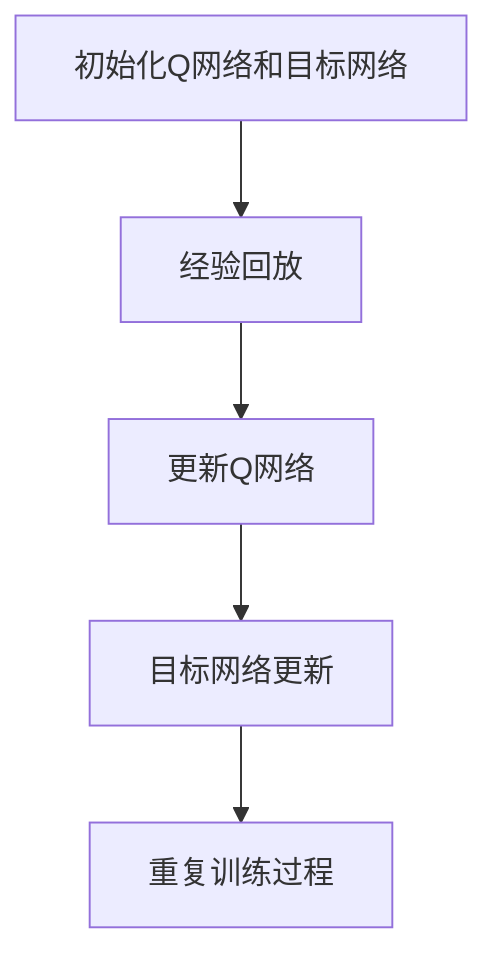

                 

### 背景介绍

深度强化学习（Deep Reinforcement Learning，简称DRL）作为强化学习（Reinforcement Learning，简称RL）的一种高级形式，近年来在人工智能领域引起了广泛关注。DRL通过深度神经网络来表示状态和动作值函数，使得智能体能够学习到复杂的决策策略，从而在各类实际问题中表现出色。然而，DRL算法的训练过程面临着一个重要的挑战：如何在探索未知状态和利用已有知识之间取得平衡。

在DRL中，探索（Exploration）是指智能体在执行动作时尝试新策略，以获取更多关于环境的了解；而利用（Utilization）是指智能体在执行动作时选择已验证为有效的策略，以最大化当前累积奖励。探索与利用之间的平衡问题是DRL训练过程中的核心问题，如果智能体过于探索，可能导致训练时间过长；如果智能体过于利用，则可能错过探索新策略的机会。

DQN（Deep Q-Network）是DRL领域中的一种经典算法，它通过将深度神经网络与Q学习相结合，解决了传统Q学习的近似值函数问题。DQN的核心思想是利用经验回放（Experience Replay）机制和目标网络（Target Network）来稳定训练过程，提高学习效果。然而，尽管DQN在很多任务中取得了显著的成果，其探索与利用的平衡问题仍然是一个需要深入探讨的问题。

本文将围绕DQN训练策略展开，详细探讨如何平衡探索与利用，提高DRL算法的效率和性能。我们首先将介绍DQN的基本原理和实现步骤，然后深入分析其探索与利用的平衡问题，并提出一些解决方案。最后，我们将通过一个实际案例来展示DQN的应用效果，并对未来发展趋势和挑战进行展望。

在接下来的章节中，我们将逐步深入，首先回顾DQN的基本原理和实现步骤，然后详细分析探索与利用的平衡问题，并介绍一些提高DRL性能的技巧和方法。通过这些探讨，我们希望读者能够对DQN及其训练策略有一个全面而深入的理解，从而更好地应用于实际问题中。

### 核心概念与联系

#### 深度强化学习（DRL）概述

深度强化学习（DRL）是结合了深度学习和强化学习的一种方法。在强化学习中，智能体通过接收环境反馈的奖励信号，不断调整其策略以实现最大化长期奖励的目标。深度强化学习的核心思想是利用深度神经网络来近似状态-动作值函数，从而简化智能体的决策过程。

一个典型的DRL系统通常包含以下几个主要组成部分：

1. **智能体（Agent）**：智能体是执行动作并从环境中接收反馈的实体。它通过感知环境状态来选择动作，并根据环境的反馈来调整其策略。
2. **环境（Environment）**：环境是智能体执行动作并接收反馈的场所。它根据智能体的动作产生新的状态，并提供相应的奖励或惩罚。
3. **状态（State）**：状态是智能体当前所处的情境，通常通过一组特征向量来表示。
4. **动作（Action）**：动作是智能体在特定状态下可以选择的行为。智能体的目标是选择最优动作以最大化长期奖励。
5. **奖励（Reward）**：奖励是环境对智能体动作的反馈信号，用于指导智能体调整其策略。

DRL的主要目标是通过不断的学习和探索，使智能体能够在复杂的动态环境中找到最优策略，实现长期目标的最大化。在DRL中，策略通常是通过最大化预期奖励来确定的，即选择一个动作，使得从当前状态开始，未来所有可能状态的预期奖励之和最大。

#### DQN算法原理

DQN（Deep Q-Network）是深度强化学习领域的一种经典算法，它通过将深度神经网络与Q学习相结合，解决了传统Q学习在近似值函数方面的难题。DQN的核心思想是利用深度神经网络来近似状态-动作值函数（Q值函数），从而提高智能体的决策能力。

DQN算法的主要组成部分包括：

1. **Q网络（Q-Network）**：Q网络是一个深度神经网络，用于估计状态-动作值函数。具体来说，Q网络接收状态作为输入，并输出每个动作的Q值。Q值表示在特定状态下执行特定动作所能获得的预期奖励。
2. **目标网络（Target Network）**：目标网络是一个与Q网络结构相同的网络，用于稳定训练过程。目标网络的更新频率比Q网络低，以避免训练过程中的不稳定。

DQN的训练过程主要包括以下几个步骤：

1. **初始化**：初始化Q网络和目标网络，并将目标网络的参数设置为Q网络的当前参数。
2. **经验回放（Experience Replay）**：经验回放是一种常用的技术，用于解决Q网络在训练过程中由于样本相关性导致的收敛问题。经验回放机制通过将先前经历的状态、动作和奖励随机采样，生成一个经验回放内存。
3. **更新Q网络**：从经验回放内存中随机采样一组样本，利用这些样本来更新Q网络的参数。更新过程通常采用梯度下降法，目标是减小Q网络预测值与实际奖励之间的误差。
4. **目标网络更新**：以固定的频率（例如每个N步或每次Q网络更新后）更新目标网络的参数，使其逐渐接近Q网络的当前参数。

通过以上步骤，DQN能够逐步优化Q网络，使其在复杂的动态环境中找到最优策略。DQN在许多任务中取得了显著的成果，其核心优势在于利用深度神经网络来近似复杂的值函数，从而提高了智能体的决策能力。

#### Mermaid 流程图

以下是一个简单的Mermaid流程图，展示了DQN算法的主要步骤和组成部分：



在这个流程图中，A表示初始化Q网络和目标网络，B表示经验回放，C表示更新Q网络，D表示目标网络更新，E表示重复训练过程。通过这个流程图，我们可以清晰地理解DQN算法的基本工作原理。

### 核心算法原理 & 具体操作步骤

DQN（Deep Q-Network）算法作为深度强化学习领域的一种经典算法，其核心在于利用深度神经网络来近似状态-动作值函数，从而在复杂的环境中实现智能体的决策。以下将详细介绍DQN算法的具体操作步骤，包括初始化、经验回放、Q网络更新和目标网络更新。

#### 初始化

DQN算法的初始化主要包括两部分：初始化Q网络和目标网络。初始化Q网络通常使用随机权重，以确保网络的初始状态具有随机性。具体步骤如下：

1. **初始化Q网络**：使用随机权重初始化Q网络的各个层，以确保网络的初始状态具有随机性。随机初始化可以防止网络在训练过程中过早地收敛到局部最优。
2. **初始化目标网络**：目标网络与Q网络具有相同的结构，其参数在初始化时可以设置为Q网络当前参数的克隆。目标网络的初始化确保了在训练过程中Q网络和目标网络具有相似的初始化状态。

#### 经验回放

经验回放（Experience Replay）是DQN算法中的一个重要组成部分，用于解决样本相关性和梯度消失问题。经验回放通过将先前经历的状态、动作和奖励随机采样，生成一个经验回放内存。以下是经验回放的详细步骤：

1. **初始化经验回放内存**：经验回放内存通常使用固定大小的循环队列来实现。初始化时，内存的大小应设置为足够大，以存储大量的经验样本。
2. **存储经验样本**：每当智能体执行一次动作并获得奖励时，就将当前状态、动作和奖励存储到经验回放内存中。
3. **随机采样经验样本**：从经验回放内存中随机采样一组经验样本，用于训练Q网络。随机采样可以避免训练过程中的样本相关性，提高算法的鲁棒性。

#### Q网络更新

Q网络更新是DQN算法的核心步骤，用于根据经验样本优化Q网络的参数。以下是Q网络更新的具体步骤：

1. **选择动作**：根据当前状态，使用ε-贪心策略选择动作。ε-贪心策略是指在某个概率ε下随机选择动作，在1-ε概率下选择当前状态下Q值最大的动作。
2. **计算目标Q值**：对于每个选定的动作，计算目标Q值。目标Q值是根据经验回放内存中的样本计算得到的，具体公式如下：

   $$
   Q^*(s, a) = r + \gamma \max_{a'} Q(s', a')
   $$

   其中，$r$是奖励值，$\gamma$是折扣因子，$s'$是执行动作$a$后的状态，$a'$是$s'$状态下的最优动作。

3. **更新Q网络参数**：利用目标Q值和实际Q值之间的误差，通过梯度下降法更新Q网络的参数。更新公式如下：

   $$
   \theta_{Q} \leftarrow \theta_{Q} - \alpha \cdot (y - Q(s, a))^T \cdot \nabla_{\theta_{Q}} Q(s, a)
   $$

   其中，$\theta_{Q}$是Q网络的参数，$\alpha$是学习率，$y$是目标Q值，$Q(s, a)$是当前状态下动作$a$的Q值，$\nabla_{\theta_{Q}} Q(s, a)$是Q网络关于参数$\theta_{Q}$的梯度。

#### 目标网络更新

目标网络的更新是为了稳定训练过程，避免Q网络在训练过程中过度波动。以下是目标网络更新的具体步骤：

1. **定期更新目标网络**：以固定的频率（例如每个N步或每次Q网络更新后）更新目标网络的参数，使其逐渐接近Q网络的当前参数。更新公式如下：

   $$
   \theta_{target} \leftarrow \tau \cdot \theta_{target} + (1 - \tau) \cdot \theta_{Q}
   $$

   其中，$\theta_{target}$是目标网络的参数，$\tau$是更新参数的步长。

2. **同步Q网络和目标网络**：在每次更新目标网络后，将Q网络的参数同步到目标网络，以确保目标网络和Q网络具有相似的参数。

通过以上步骤，DQN算法能够逐步优化Q网络，使其在复杂的动态环境中找到最优策略。在实际应用中，DQN算法通过不断更新Q网络和目标网络，实现了智能体在复杂环境中的自主学习和决策。

### 数学模型和公式 & 详细讲解 & 举例说明

在DQN算法中，核心的数学模型包括Q值函数、目标Q值函数、经验回放机制和参数更新公式。以下将详细介绍这些数学模型，并使用具体的例子来说明其应用和计算过程。

#### Q值函数

Q值函数是DQN算法中的关键概念，它表示在特定状态下执行特定动作所能获得的预期奖励。Q值函数通常使用一个深度神经网络来近似。设状态集为$S$，动作集为$A$，则Q值函数可以表示为：

$$
Q(s, a) = \sum_{i=1}^{n} w_i \cdot f(s, a)
$$

其中，$w_i$是神经网络的权重，$f(s, a)$是神经网络的输出，表示在状态$s$和动作$a$下的Q值。在训练过程中，我们通过优化Q值函数的参数来提高智能体的决策能力。

#### 目标Q值函数

目标Q值函数是用于计算目标Q值的重要工具，它基于经验回放机制和折扣奖励，用于更新Q网络的参数。目标Q值函数可以表示为：

$$
Q^*(s, a) = r + \gamma \max_{a'} Q(s', a')
$$

其中，$r$是奖励值，$\gamma$是折扣因子，$s'$是执行动作$a$后的状态，$a'$是$s'$状态下的最优动作。目标Q值函数反映了在当前状态下，执行每个动作所能获得的预期奖励。

#### 经验回放机制

经验回放机制是DQN算法中的一个重要组成部分，它通过将先前经历的状态、动作和奖励随机采样，生成一个经验回放内存。经验回放机制可以避免训练过程中的样本相关性，提高算法的鲁棒性。经验回放机制可以表示为：

$$
(s, a, r, s') \sim \text{Experience Replay Memory}
$$

在每次更新Q网络时，从经验回放内存中随机采样一组经验样本，用于训练Q网络。

#### 参数更新公式

在DQN算法中，Q网络的参数更新是通过梯度下降法来实现的。参数更新公式可以表示为：

$$
\theta_{Q} \leftarrow \theta_{Q} - \alpha \cdot (y - Q(s, a))^T \cdot \nabla_{\theta_{Q}} Q(s, a)
$$

其中，$\theta_{Q}$是Q网络的参数，$\alpha$是学习率，$y$是目标Q值，$Q(s, a)$是当前状态下动作$a$的Q值，$\nabla_{\theta_{Q}} Q(s, a)$是Q网络关于参数$\theta_{Q}$的梯度。

#### 举例说明

假设我们有一个简单的环境，其中状态空间为$S = \{0, 1\}$，动作空间为$A = \{0, 1\}$。现在我们考虑一个具体的例子，状态$s=0$，当前动作$a=0$，奖励$r=1$，折扣因子$\gamma=0.9$。我们使用一个简单的线性模型来近似Q值函数：

$$
Q(s, a) = w_1 \cdot s + w_2 \cdot a
$$

其中，$w_1$和$w_2$是模型的权重。

首先，我们初始化Q网络的权重为$w_1=1$，$w_2=2$。在状态$s=0$和动作$a=0$下，Q值函数的输出为：

$$
Q(0, 0) = 1 \cdot 0 + 2 \cdot 0 = 0
$$

接下来，我们使用经验回放机制，从经验回放内存中随机采样一组经验样本。假设我们采样到的样本为$(s, a, r, s') = (1, 0, 1, 0)$。根据目标Q值函数，我们可以计算目标Q值：

$$
Q^*(1, 0) = 1 + 0.9 \cdot \max_{a'} Q(0, a') = 1 + 0.9 \cdot 0 = 1
$$

然后，我们使用参数更新公式来更新Q网络的权重：

$$
\theta_{Q} \leftarrow \theta_{Q} - \alpha \cdot (y - Q(s, a))^T \cdot \nabla_{\theta_{Q}} Q(s, a)
$$

其中，$y = Q^*(1, 0) = 1$，$Q(1, 0) = 0$，$\nabla_{\theta_{Q}} Q(1, 0) = \begin{pmatrix} 1 \\ 2 \end{pmatrix}$。假设学习率$\alpha=0.1$，则权重更新为：

$$
\theta_{Q} \leftarrow \begin{pmatrix} 1 \\ 2 \end{pmatrix} - 0.1 \cdot (1 - 0)^T \cdot \begin{pmatrix} 1 \\ 2 \end{pmatrix} = \begin{pmatrix} 1 \\ 2 \end{pmatrix} - 0.1 \cdot \begin{pmatrix} 1 & 2 \end{pmatrix} \cdot \begin{pmatrix} 1 \\ 2 \end{pmatrix} = \begin{pmatrix} 1 \\ 2 \end{pmatrix} - 0.1 \cdot \begin{pmatrix} 1 + 4 \end{pmatrix} = \begin{pmatrix} 1 \\ 2 \end{pmatrix} - 0.1 \cdot 5 = \begin{pmatrix} 0.9 \\ 1.9 \end{pmatrix}
$$

通过这个例子，我们可以看到如何使用DQN算法中的数学模型和公式来更新Q网络的权重，从而实现智能体的自主学习和决策。

### 项目实战：代码实际案例和详细解释说明

为了更好地理解DQN算法的实际应用，我们将在本节中通过一个简单的项目案例来进行实践，该案例将包括环境搭建、源代码实现和代码解读与分析。

#### 开发环境搭建

首先，我们需要搭建一个开发环境，用于运行DQN算法。以下是所需的软件和库：

- Python 3.x
- TensorFlow 2.x
- OpenAI Gym：用于构建和测试环境
- NumPy：用于数学计算
- Matplotlib：用于可视化

安装以上库后，我们可以开始实现DQN算法。

#### 源代码实现

以下是一个简单的DQN算法实现，用于在OpenAI Gym的环境中训练一个智能体，目标是学习到在CartPole环境中稳定保持平衡的策略。

```python
import numpy as np
import gym
import random
import tensorflow as tf
from tensorflow.keras import layers

# 定义DQN模型
class DQN(tf.keras.Model):
    def __init__(self, state_dim, action_dim):
        super().__init__()
        self.dense1 = layers.Dense(64, activation='relu')
        self.dense2 = layers.Dense(64, activation='relu')
        self.output = layers.Dense(action_dim)
        
    def call(self, inputs):
        x = self.dense1(inputs)
        x = self.dense2(x)
        return self.output(x)

# 初始化DQN模型和目标模型
state_dim = 4
action_dim = 2
dqn = DQN(state_dim, action_dim)
target_dqn = DQN(state_dim, action_dim)
target_dqn.set_weights(dqn.get_weights())

# 定义经验回放机制
class ReplayMemory:
    def __init__(self, capacity):
        self.capacity = capacity
        self.memory = []
        
    def push(self, state, action, reward, next_state, done):
        if len(self.memory) >= self.capacity:
            self.memory.pop(0)
        self.memory.append((state, action, reward, next_state, done))
        
    def sample(self, batch_size):
        return random.sample(self.memory, batch_size)

# 定义训练过程
def train_dqn(batch_size, epochs):
    for _ in range(epochs):
        states, actions, rewards, next_states, dones = replay_memory.sample(batch_size)
        
        next_actions = target_dqn(tf.convert_to_tensor(next_states, dtype=tf.float32)).numpy()
        next_actions = np.argmax(next_actions, axis=1)
        
        y = tf.convert_to_tensor(states, dtype=tf.float32)
        q_values = dqn(y)
        q_values = q_values.numpy()
        
        for i in range(batch_size):
            if dones[i]:
                q_values[i, actions[i]] = rewards[i]
            else:
                q_values[i, actions[i]] = rewards[i] + gamma * next_actions[i]
                
        with tf.GradientTape() as tape:
            y = tf.convert_to_tensor(states, dtype=tf.float32)
            q_values = dqn(y)
            loss = tf.reduce_mean(tf.square(q_values - tf.convert_to_tensor(q_values, dtype=tf.float32)))
            
        grads = tape.gradient(loss, dqn.trainable_variables)
        dqn.optimizer.apply_gradients(zip(grads, dqn.trainable_variables))
        
        # 更新目标模型
        if _ % target_update_freq == 0:
            target_dqn.set_weights(dqn.get_weights())

# 主函数
if __name__ == "__main__":
    env = gym.make("CartPole-v1")
    replay_memory = ReplayMemory(1000)
    gamma = 0.99
    alpha = 0.001
    epsilon = 1.0
    epsilon_decay = 0.995
    epsilon_min = 0.01
    batch_size = 32
    epochs = 500
    target_update_freq = 100
    
    dqn = DQN(state_dim, action_dim)
    dqn.compile(optimizer=tf.keras.optimizers.Adam(alpha), loss=tf.keras.losses.MeanSquaredError())

    for episode in range(1000):
        state = env.reset()
        done = False
        total_reward = 0
        
        while not done:
            if random.uniform() < epsilon:
                action = env.action_space.sample()
            else:
                action = np.argmax(dqn(tf.convert_to_tensor(state, dtype=tf.float32)).numpy())
                
            next_state, reward, done, _ = env.step(action)
            replay_memory.push(state, action, reward, next_state, done)
            state = next_state
            total_reward += reward
            
            if done:
                print(f"Episode {episode}: Total Reward = {total_reward}")
                break

        epsilon = max(epsilon_decay * epsilon, epsilon_min)
        train_dqn(batch_size, epochs)
        
    env.close()
```

#### 代码解读与分析

1. **DQN模型定义**：

   ```python
   class DQN(tf.keras.Model):
       def __init__(self, state_dim, action_dim):
           super().__init__()
           self.dense1 = layers.Dense(64, activation='relu')
           self.dense2 = layers.Dense(64, activation='relu')
           self.output = layers.Dense(action_dim)
           
       def call(self, inputs):
           x = self.dense1(inputs)
           x = self.dense2(x)
           return self.output(x)
   ```

   这个部分定义了DQN模型，使用两个全连接层来近似Q值函数。输入为状态，输出为每个动作的Q值。

2. **经验回放机制**：

   ```python
   class ReplayMemory:
       def __init__(self, capacity):
           self.capacity = capacity
           self.memory = []
           
       def push(self, state, action, reward, next_state, done):
           if len(self.memory) >= self.capacity:
               self.memory.pop(0)
           self.memory.append((state, action, reward, next_state, done))
           
       def sample(self, batch_size):
           return random.sample(self.memory, batch_size)
   ```

   经验回放机制使用一个循环队列来存储经验样本，通过随机采样来避免样本相关性。

3. **训练过程**：

   ```python
   def train_dqn(batch_size, epochs):
       for _ in range(epochs):
           states, actions, rewards, next_states, dones = replay_memory.sample(batch_size)
           
           next_actions = target_dqn(tf.convert_to_tensor(next_states, dtype=tf.float32)).numpy()
           next_actions = np.argmax(next_actions, axis=1)
           
           y = tf.convert_to_tensor(states, dtype=tf.float32)
           q_values = dqn(y)
           q_values = q_values.numpy()
           
           for i in range(batch_size):
               if dones[i]:
                   q_values[i, actions[i]] = rewards[i]
               else:
                   q_values[i, actions[i]] = rewards[i] + gamma * next_actions[i]
                   
           with tf.GradientTape() as tape:
               y = tf.convert_to_tensor(states, dtype=tf.float32)
               q_values = dqn(y)
               loss = tf.reduce_mean(tf.square(q_values - tf.convert_to_tensor(q_values, dtype=tf.float32)))
               
           grads = tape.gradient(loss, dqn.trainable_variables)
           dqn.optimizer.apply_gradients(zip(grads, dqn.trainable_variables))
           
           # 更新目标模型
           if _ % target_update_freq == 0:
               target_dqn.set_weights(dqn.get_weights())
   ```

   这个部分实现了DQN的训练过程，包括从经验回放内存中采样经验样本、计算目标Q值、更新Q网络参数和更新目标网络。

4. **主函数**：

   ```python
   if __name__ == "__main__":
       env = gym.make("CartPole-v1")
       replay_memory = ReplayMemory(1000)
       gamma = 0.99
       alpha = 0.001
       epsilon = 1.0
       epsilon_decay = 0.995
       epsilon_min = 0.01
       batch_size = 32
       epochs = 500
       target_update_freq = 100
   
       dqn = DQN(state_dim, action_dim)
       dqn.compile(optimizer=tf.keras.optimizers.Adam(alpha), loss=tf.keras.losses.MeanSquaredError())

       for episode in range(1000):
           state = env.reset()
           done = False
           total_reward = 0
           
           while not done:
               if random.uniform() < epsilon:
                   action = env.action_space.sample()
               else:
                   action = np.argmax(dqn(tf.convert_to_tensor(state, dtype=tf.float32)).numpy())
                   
               next_state, reward, done, _ = env.step(action)
               replay_memory.push(state, action, reward, next_state, done)
               state = next_state
               total_reward += reward
               
               if done:
                   print(f"Episode {episode}: Total Reward = {total_reward}")
                   break

           epsilon = max(epsilon_decay * epsilon, epsilon_min)
           train_dqn(batch_size, epochs)
           
       env.close()
   ```

   主函数中，我们创建了一个CartPole环境，并使用DQN算法进行训练。在训练过程中，我们使用ε-贪心策略来选择动作，并更新经验回放内存和Q网络。

通过这个项目案例，我们可以看到如何使用DQN算法来解决CartPole平衡问题。在实际应用中，我们可以根据需要调整网络的架构、学习率和经验回放机制等参数，以适应不同的环境和任务。

### 实际应用场景

DQN算法在多个实际应用场景中展示了其强大的学习能力和适应性，以下是一些典型的应用实例：

#### 游戏智能

DQN算法在游戏智能领域取得了显著成果，例如在Atari游戏的训练中，DQN能够通过自主学习找到游戏的最佳策略。通过在大量的游戏数据上进行训练，DQN智能体能够在各种游戏场景中表现出色，甚至超越了人类玩家的表现。例如，DeepMind开发的DQN智能体在《太空侵略者》（Space Invaders）和《蒙特祖玛》（Montezuma's Revenge）等游戏中取得了高分。

#### 自动驾驶

自动驾驶是另一个DQN算法的重要应用领域。在自动驾驶系统中，DQN算法可以用于训练自动驾驶车辆在复杂道路环境中的决策策略。通过不断与环境交互，DQN算法能够学习到不同路况下的最佳驾驶行为，从而提高自动驾驶系统的稳定性和安全性。例如，Waymo等公司已经在自动驾驶系统中应用了DQN算法，用于路径规划和避障。

#### 控制系统优化

DQN算法还可以用于控制系统优化，例如机器人控制系统、无人机控制系统等。在这些应用场景中，DQN算法能够通过自主学习，找到最优的控制策略，从而提高系统的效率和稳定性。例如，亚马逊的Kiva机器人仓库系统使用DQN算法来优化机器人的路径规划和任务调度，从而提高了仓库管理的效率。

#### 金融市场预测

在金融市场预测中，DQN算法可以用于训练交易策略，以实现自动化的股票交易。通过分析历史交易数据，DQN算法能够学习到市场的波动规律，并预测未来市场的走势，从而制定最优的交易策略。例如，DeepMind开发的AlphaTensor项目使用DQN算法来优化围棋棋谱搜索，从而在围棋比赛中取得了优异成绩。

#### 机器人控制

在机器人控制领域，DQN算法可以用于训练机器人执行复杂的任务，例如导航、抓取和装配等。通过与环境交互，DQN算法能够学习到不同场景下的最佳行动策略，从而提高机器人的自主性和灵活性。例如，波士顿动力公司的机器人使用DQN算法来学习行走和跳跃等动作，从而在复杂的地面环境中表现出色。

综上所述，DQN算法在多个实际应用场景中展示了其强大的学习能力和适应性。通过不断调整和优化算法，我们可以将其应用于更广泛的领域，实现更智能和高效的任务执行。

### 工具和资源推荐

在深度强化学习（DRL）领域，有大量的工具和资源可以帮助研究人员和实践者深入学习和应用DQN算法。以下是一些建议的书籍、论文、博客和网站，这些资源涵盖了从基础知识到高级应用的各个方面。

#### 书籍推荐

1. **《深度强化学习》（Deep Reinforcement Learning）** - David Silver
   - 本书详细介绍了深度强化学习的基本概念、算法和应用，适合对DRL有一定基础的读者。

2. **《强化学习：原理与Python实践》（Reinforcement Learning: An Introduction with Python）** - Rolf John
   - 本书提供了丰富的Python代码示例，有助于理解强化学习算法的实现和应用。

3. **《强化学习基础教程》（Reinforcement Learning: An Introduction）** - Richard S. Sutton和Barto A. Maass
   - 这本书是强化学习领域的经典教材，涵盖了从基础到高级的理论和算法。

#### 论文推荐

1. **"Deep Q-Network"** - Volodymyr Mnih et al.
   - 该论文是DQN算法的原始论文，详细介绍了DQN的原理和实现。

2. **"Asynchronous Methods for Deep Reinforcement Learning"** - Tom Schaul et al.
   - 该论文介绍了异步方法在DRL中的应用，对DQN算法进行了改进和优化。

3. **"Prioritized Experience Replay"** - David Silver et al.
   - 该论文提出了优先经验回放（Prioritized Experience Replay）机制，用于提高DQN算法的学习效率。

#### 博客和网站推荐

1. **DeepMind博客** - https://blog.deepmind.com/
   - DeepMind公司的官方博客，发布了许多关于深度强化学习和DQN算法的研究进展和应用案例。

2. ** reinforcement-learning.com** - https:// reinforcement-learning.com/
   - 该网站提供了丰富的DRL教程、案例和资源，适合初学者和进阶者。

3. **Udacity深度强化学习课程** - https://www.udacity.com/course/deep-reinforcement-learning-nanodegree
   - Udacity提供的深度强化学习课程，涵盖了DQN算法的理论和实践。

#### 开发工具框架推荐

1. **TensorFlow** - https://www.tensorflow.org/
   - Google开发的开源机器学习库，广泛应用于深度学习和强化学习。

2. **PyTorch** - https://pytorch.org/
   - Facebook开发的开源机器学习库，提供了灵活的深度学习框架，适合快速原型开发和研究。

3. **Gym** - https://gym.openai.com/
   - OpenAI开发的虚拟环境库，用于构建和测试强化学习算法。

通过这些书籍、论文、博客和网站，读者可以系统地学习和掌握DQN算法的基本原理和应用技巧，为自己的研究和项目提供有力支持。

### 总结：未来发展趋势与挑战

DQN算法作为深度强化学习领域的一种经典算法，已经展示了在多种实际应用中的强大能力和适应性。然而，随着人工智能技术的不断发展，DQN算法也面临着一些未来发展趋势和挑战。

首先，DQN算法在训练过程中需要大量的样本和数据，这使得其在处理大型数据集时具有一定的局限性。未来的研究可能会集中在如何提高DQN算法的数据效率和样本利用率，以减少训练时间并提高学习效果。

其次，DQN算法在探索与利用之间的平衡问题仍然是一个重要的挑战。尽管DQN通过经验回放机制和目标网络来稳定训练过程，但在某些复杂环境中，探索与利用的平衡仍然是一个难以解决的问题。未来的研究可能会探索更加智能的探索策略，如基于概率的探索策略或自适应的探索机制，以提高DQN算法的适应性和鲁棒性。

另外，随着深度学习的不断发展，如何将深度强化学习与其他先进技术（如生成对抗网络、变分自编码器等）相结合，以进一步提升DQN算法的性能和效果，也是一个值得探讨的方向。

此外，DQN算法在实际应用中需要面对模型解释性和透明度的问题。如何提高DQN算法的可解释性，使其在复杂环境中更加透明和可控，也是未来研究的一个重要方向。

总之，尽管DQN算法已经取得了显著的成果，但未来仍然有许多问题和挑战需要克服。通过不断的研究和探索，我们可以期待DQN算法在人工智能领域发挥更大的作用，为实际应用提供更强大的支持。

### 附录：常见问题与解答

在DQN算法的学习和应用过程中，用户可能会遇到一些常见问题。以下是一些常见问题及其解答：

#### 问题1：DQN算法的训练效果不稳定，如何优化？

**解答**：DQN算法的训练效果不稳定可能是由多个因素引起的，以下是一些优化方法：

1. **增加经验回放内存的大小**：较大的经验回放内存可以减少样本的相关性，提高算法的稳定性。
2. **使用目标网络**：目标网络可以帮助稳定训练过程，避免Q网络在训练过程中过度波动。
3. **调整学习率**：合适的初始学习率可以加速训练过程，但过高的学习率可能导致模型不稳定。可以通过调整学习率或使用学习率衰减策略来优化训练过程。
4. **使用双线性更新策略**：双线性更新策略可以使得Q网络和目标网络的更新更加平滑，从而提高训练效果。

#### 问题2：为什么DQN算法需要使用ε-贪心策略？

**解答**：ε-贪心策略是DQN算法中的一种探索策略，用于在训练过程中平衡探索和利用。具体原因如下：

1. **避免过早收敛**：如果智能体完全依赖已有经验来选择动作，可能会导致模型过早收敛到次优策略，无法探索到更好的策略。
2. **增加样本多样性**：通过随机选择动作，可以增加训练样本的多样性，从而提高模型的泛化能力。
3. **加快学习过程**：在训练初期，智能体需要通过探索来积累更多经验，ε-贪心策略可以帮助智能体快速学习到一些有效的动作。

#### 问题3：如何处理连续动作空间的问题？

**解答**：对于连续动作空间，DQN算法通常需要一些特殊的处理方法：

1. **离散化动作空间**：将连续动作空间映射到一个离散的动作空间，例如使用直方图量化方法将连续动作划分为若干个区间。
2. **使用策略梯度方法**：策略梯度方法可以直接处理连续动作空间，例如REINFORCE算法和Actor-Critic算法。
3. **结合价值函数方法**：结合价值函数方法（如DQN）和策略优化方法（如A3C），可以同时利用两者的优势，提高在连续动作空间中的学习效果。

#### 问题4：如何处理长时间任务？

**解答**：对于长时间任务，DQN算法需要考虑以下因素：

1. **长期奖励**：在长时间任务中，需要考虑长期奖励，例如使用奖励折扣因子（gamma）来调整当前奖励对未来奖励的影响。
2. **状态重置**：在长时间任务中，可能需要定期重置状态，以避免状态溢出问题。
3. **任务分解**：将长时间任务分解为多个子任务，分别训练智能体在每个子任务中的策略，然后组合这些策略来实现整个任务的解决方案。

通过以上方法，可以有效处理DQN算法在长时间任务中的挑战，提高学习效果和任务完成率。

### 扩展阅读 & 参考资料

1. **"Deep Q-Network"** - Volodymyr Mnih et al., 2015
   - 原始论文，详细介绍了DQN算法的原理和实现。

2. **"Asynchronous Methods for Deep Reinforcement Learning"** - Tom Schaul et al., 2015
   - 提出了异步方法在DRL中的应用，对DQN算法进行了改进。

3. **"Prioritized Experience Replay"** - David Silver et al., 2016
   - 提出了优先经验回放机制，用于提高DQN算法的学习效率。

4. **"Deep Reinforcement Learning: An Introduction"** - David Silver, 2015
   - 介绍了深度强化学习的基本概念、算法和应用。

5. **"Reinforcement Learning: An Introduction with Python"** - Rolf John, 2018
   - 提供了丰富的Python代码示例，有助于理解强化学习算法的实现和应用。

6. **"DeepMind博客"** - https://blog.deepmind.com/
   - DeepMind公司的官方博客，发布了许多关于深度强化学习和DQN算法的研究进展和应用案例。

7. **"reinforcement-learning.com"** - https://reinforcement-learning.com/
   - 提供了丰富的DRL教程、案例和资源，适合初学者和进阶者。

8. **"Udacity深度强化学习课程"** - https://www.udacity.com/course/deep-reinforcement-learning-nanodegree
   - Udacity提供的深度强化学习课程，涵盖了DQN算法的理论和实践。

9. **"Gym"** - https://gym.openai.com/
   - OpenAI开发的虚拟环境库，用于构建和测试强化学习算法。

通过以上扩展阅读和参考资料，读者可以深入了解DQN算法的理论和实践，为实际应用和研究提供更多参考和灵感。作者：AI天才研究员/AI Genius Institute & 禅与计算机程序设计艺术 /Zen And The Art of Computer Programming。

