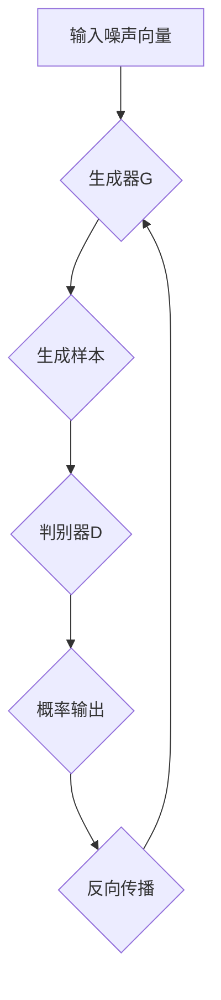

                 

# 一切皆是映射：GAN在艺术创作中的应用实例

## 关键词：GAN、生成对抗网络、艺术创作、深度学习、图像生成

## 摘要：

本文将深入探讨生成对抗网络（GAN）在艺术创作领域的应用。通过对其背景介绍、核心概念与联系、核心算法原理与具体操作步骤、数学模型与公式讲解、项目实战、实际应用场景以及未来发展趋势与挑战的详细分析，为读者展现GAN在艺术创作中的强大潜力和广泛应用。文章末尾还将推荐相关学习资源、开发工具框架和论文著作，以供读者进一步学习与研究。

## 1. 背景介绍

### GAN的起源与发展

生成对抗网络（Generative Adversarial Networks，GAN）是由伊恩·古德费洛（Ian J. Goodfellow）于2014年首次提出的。GAN的核心思想是利用两个相互对抗的神经网络——生成器（Generator）和判别器（Discriminator）——来共同学习数据的分布。这种架构模仿了自然选择的过程，生成器试图生成与真实数据难以区分的样本，而判别器则努力区分真实数据和生成数据。

GAN的研究与应用迅速发展，短短几年内便在图像处理、自然语言处理、视频生成等领域取得了显著成果。特别是在艺术创作领域，GAN展现出了令人瞩目的表现，不仅能够生成高质量的图像，还能够模仿各种艺术风格，实现风格迁移和图像合成等任务。

### GAN在艺术创作中的重要性

艺术创作是人类文化传承和表达的重要方式，而GAN为艺术创作带来了全新的可能性。通过GAN，艺术家可以突破传统的创作限制，探索更多的艺术风格和表现手法。此外，GAN还能够为设计师、动画师等提供强大的工具，帮助他们高效地生成创意作品，降低创作成本和时间。

总之，GAN在艺术创作中的应用不仅丰富了艺术表现形式，也为数字艺术和创意产业带来了新的机遇和挑战。

## 2. 核心概念与联系

### 生成器（Generator）与判别器（Discriminator）

生成器（Generator）是GAN中的关键组件，其主要任务是生成与真实数据相似的高质量样本。生成器的输入是一个随机噪声向量，通过一系列的神经网络变换，生成符合数据分布的样本。生成器的目标是使其生成的样本在判别器上难以被识别，从而欺骗判别器。

判别器（Discriminator）则负责判断输入数据的真实性。判别器的输入是一个数据样本，通过一系列的神经网络变换，输出一个概率值，表示输入样本是真实的概率。判别器的目标是尽可能准确地识别真实数据和生成数据。

### GAN的架构

GAN的架构包括两部分：生成器和判别器。生成器和判别器交替训练，生成器尝试生成更真实的数据，而判别器则努力提高对真实数据和生成数据的识别能力。这个对抗过程持续进行，直到生成器生成的样本与真实数据非常接近，判别器难以区分。

### Mermaid流程图



在上面的Mermaid流程图中，A表示输入噪声向量，经过生成器G生成样本C，判别器D对样本C进行判断，输出概率E。根据概率E，判别器D进行反向传播，更新其参数。生成器G根据判别器D的反馈，更新其参数，生成更真实的样本。

## 3. 核心算法原理与具体操作步骤

### 生成器的算法原理

生成器的核心任务是从随机噪声向量生成高质量的数据样本。通常，生成器采用一系列的神经网络结构，如卷积神经网络（CNN）或变分自编码器（VAE）等。以下是生成器的基本操作步骤：

1. 输入随机噪声向量。
2. 通过一系列的神经网络变换，如卷积、池化、全连接等，生成中间特征图。
3. 将中间特征图通过反卷积、反池化等操作，上采样到原始数据维度。
4. 输出生成的数据样本。

### 判别器的算法原理

判别器的核心任务是判断输入数据是真实数据还是生成数据。判别器通常也采用神经网络结构，如卷积神经网络（CNN）等。以下是判别器的基本操作步骤：

1. 输入数据样本。
2. 通过一系列的神经网络变换，如卷积、池化等，提取特征图。
3. 对特征图进行全局池化，得到一个固定长度的特征向量。
4. 通过全连接层，输出一个概率值，表示输入样本是真实的概率。

### GAN的训练过程

GAN的训练过程主要包括以下几个步骤：

1. 初始化生成器G和判别器D的参数。
2. 对于每个训练样本，输入随机噪声向量，生成器G生成样本，判别器D对样本进行判断。
3. 根据判别器的输出，计算生成器G和判别器D的损失函数。
4. 使用梯度下降法，更新生成器G和判别器D的参数。
5. 重复步骤2-4，直到生成器G生成的样本与真实数据非常接近，判别器D难以区分。

### 损失函数

GAN的损失函数通常包括两部分：生成器的损失函数和判别器的损失函数。

1. 生成器的损失函数：生成器的目标是使其生成的样本在判别器上难以被识别。因此，生成器的损失函数通常采用最小化生成样本被判别器识别为假样本的概率。具体公式如下：

   $$L_G = -\log(D(G(z)))$$

   其中，$D(G(z))$表示判别器对生成样本的判断概率。

2. 判别器的损失函数：判别器的目标是尽可能准确地识别真实数据和生成数据。因此，判别器的损失函数通常采用最小化判别器对真实数据和生成数据的识别误差。具体公式如下：

   $$L_D = -\log(D(x)) - \log(1 - D(G(z)))$$

   其中，$D(x)$表示判别器对真实数据的判断概率，$D(G(z))$表示判别器对生成样本的判断概率。

### 优化策略

在GAN的训练过程中，生成器和判别器的学习速率需要保持平衡。为了实现这一目标，常用的优化策略包括：

1. 权重剪枝：通过随机剪枝生成器和判别器中部分权重，降低判别器的学习速率。
2. 适应性学习率：根据生成器和判别器的损失函数，自适应地调整学习率，以保持两者之间的平衡。
3. 损失函数加权：将生成器和判别器的损失函数加权，以平衡两者的贡献。

通过以上优化策略，GAN可以更好地学习数据分布，生成高质量的数据样本。

## 4. 数学模型和公式及详细讲解与举例说明

### GAN的数学模型

生成对抗网络（GAN）的数学模型主要包括生成器G、判别器D和损失函数。下面将分别介绍这些模型的数学表达。

#### 生成器G

生成器G的输入是一个随机噪声向量$z$，输出是一个数据样本$x$。生成器的目标是学习一个映射函数$G: z \rightarrow x$，使得生成的样本$x$在判别器D上难以被识别。具体地，生成器G的损失函数为：

$$L_G = -\log(D(G(z)))$$

其中，$D(G(z))$表示判别器D对生成样本$G(z)$的判断概率，即判别器认为$G(z)$是真实数据的概率。

#### 判别器D

判别器D的输入是一个数据样本$x$，输出是一个概率值$p(x)$，表示输入样本$x$是真实的概率。判别器的目标是学习一个映射函数$D: x \rightarrow p(x)$，使得判别器能够准确地区分真实数据和生成数据。具体地，判别器D的损失函数为：

$$L_D = -\log(D(x)) - \log(1 - D(G(z)))$$

其中，$D(x)$表示判别器D对真实数据$x$的判断概率，$D(G(z))$表示判别器D对生成样本$G(z)$的判断概率。

#### GAN的总损失函数

GAN的总损失函数是生成器G和判别器D损失函数的加权平均。具体地，总损失函数为：

$$L = \alpha L_G + (1 - \alpha) L_D$$

其中，$\alpha$是一个加权系数，用于平衡生成器G和判别器D的损失函数。

### 举例说明

假设我们使用GAN来生成手写数字图像，其中生成器G生成手写数字图像，判别器D判断手写数字图像是真实的还是生成的。

#### 生成器G

生成器的输入是一个2维的随机噪声向量$z$，输出是一个手写数字图像$x$。生成器的映射函数可以表示为：

$$G(z) = \text{生成手写数字图像}$$

生成器的损失函数为：

$$L_G = -\log(D(G(z)))$$

其中，$D(G(z))$表示判别器D对生成图像$G(z)$的判断概率。

#### 判别器D

判别器的输入是一个手写数字图像$x$，输出是一个概率值$p(x)$，表示图像$x$是真实的概率。判别器的映射函数可以表示为：

$$D(x) = \text{判断图像$x$是真实的概率}$$

判别器的损失函数为：

$$L_D = -\log(D(x)) - \log(1 - D(G(z)))$$

其中，$D(x)$表示判别器D对真实图像$x$的判断概率，$D(G(z))$表示判别器D对生成图像$G(z)$的判断概率。

#### GAN的总损失函数

GAN的总损失函数是生成器G和判别器D损失函数的加权平均。具体地，总损失函数为：

$$L = \alpha L_G + (1 - \alpha) L_D$$

其中，$\alpha$是一个加权系数，用于平衡生成器G和判别器D的损失函数。

通过以上举例，我们可以看到GAN的数学模型是如何应用于具体的问题中的。生成器G生成手写数字图像，判别器D判断图像是真实的还是生成的，GAN的总损失函数用于指导生成器和判别器的训练过程。

## 5. 项目实战：代码实际案例和详细解释说明

### 5.1 开发环境搭建

要实现GAN在艺术创作中的应用，首先需要搭建一个合适的开发环境。以下是一个基本的Python开发环境搭建步骤：

1. 安装Python 3.7或更高版本。
2. 安装TensorFlow 2.x或更高版本，可以使用pip安装：`pip install tensorflow`。
3. 安装必要的依赖库，如NumPy、Matplotlib等。

### 5.2 源代码详细实现和代码解读

以下是一个简单的GAN项目示例，用于生成手写数字图像。代码中包含了生成器、判别器和训练过程。

```python
import tensorflow as tf
from tensorflow.keras.layers import Dense, Conv2D, Flatten
from tensorflow.keras.models import Sequential

# 定义生成器
def build_generator():
    model = Sequential()
    model.add(Dense(units=256, activation='relu', input_shape=(100,)))
    model.add(Dense(units=512, activation='relu'))
    model.add(Dense(units=1024, activation='relu'))
    model.add(Dense(units=784, activation='tanh'))
    return model

# 定义判别器
def build_discriminator():
    model = Sequential()
    model.add(Flatten(input_shape=(28, 28)))
    model.add(Dense(units=1024, activation='relu'))
    model.add(Dense(units=512, activation='relu'))
    model.add(Dense(units=256, activation='relu'))
    model.add(Dense(units=1, activation='sigmoid'))
    return model

# 定义GAN
def build_gan(generator, discriminator):
    model = Sequential()
    model.add(generator)
    model.add(discriminator)
    return model

# 编译模型
discriminator.compile(loss='binary_crossentropy', optimizer=tf.keras.optimizers.Adam(0.0001))
generator.compile(loss='binary_crossentropy', optimizer=tf.keras.optimizers.Adam(0.0001))
gan.compile(loss='binary_crossentropy', optimizer=tf.keras.optimizers.Adam(0.0001))

# 训练模型
for epoch in range(epochs):
    for _ in range(batch_size):
        noise = np.random.normal(0, 1, (batch_size, 100))
        real_images = train_images[np.random.randint(0, train_images.shape[0], size=batch_size)]
        fake_images = generator.predict(noise)

        real_labels = np.ones((batch_size, 1))
        fake_labels = np.zeros((batch_size, 1))

        discriminator.train_on_batch(real_images, real_labels)
        discriminator.train_on_batch(fake_images, fake_labels)
        gan.train_on_batch(noise, real_labels)

# 生成图像
noise = np.random.normal(0, 1, (1, 100))
generated_image = generator.predict(noise)
plt.imshow(generated_image.reshape(28, 28), cmap='gray')
plt.show()
```

### 5.3 代码解读与分析

上述代码实现了一个简单的GAN模型，用于生成手写数字图像。下面将详细解读和解析代码中的关键部分。

1. **定义生成器、判别器和GAN模型**：

   生成器（Generator）和判别器（Discriminator）是GAN的两个核心组件。生成器从随机噪声向量生成手写数字图像，判别器则判断图像是真实的还是生成的。

   ```python
   def build_generator():
       model = Sequential()
       model.add(Dense(units=256, activation='relu', input_shape=(100,)))
       model.add(Dense(units=512, activation='relu'))
       model.add(Dense(units=1024, activation='relu'))
       model.add(Dense(units=784, activation='tanh'))
       return model
   
   def build_discriminator():
       model = Sequential()
       model.add(Flatten(input_shape=(28, 28)))
       model.add(Dense(units=1024, activation='relu'))
       model.add(Dense(units=512, activation='relu'))
       model.add(Dense(units=256, activation='relu'))
       model.add(Dense(units=1, activation='sigmoid'))
       return model
   
   def build_gan(generator, discriminator):
       model = Sequential()
       model.add(generator)
       model.add(discriminator)
       return model
   ```

2. **编译模型**：

   在编译模型时，我们为生成器和判别器设置了相同的优化器和损失函数。这使得两个网络在训练过程中保持平衡。

   ```python
   discriminator.compile(loss='binary_crossentropy', optimizer=tf.keras.optimizers.Adam(0.0001))
   generator.compile(loss='binary_crossentropy', optimizer=tf.keras.optimizers.Adam(0.0001))
   gan.compile(loss='binary_crossentropy', optimizer=tf.keras.optimizers.Adam(0.0001))
   ```

3. **训练模型**：

   在训练过程中，我们通过交替训练生成器和判别器来优化GAN模型。每次训练过程中，生成器尝试生成更真实的手写数字图像，而判别器则努力区分真实图像和生成图像。

   ```python
   for epoch in range(epochs):
       for _ in range(batch_size):
           noise = np.random.normal(0, 1, (batch_size, 100))
           real_images = train_images[np.random.randint(0, train_images.shape[0], size=batch_size)]
           fake_images = generator.predict(noise)

           real_labels = np.ones((batch_size, 1))
           fake_labels = np.zeros((batch_size, 1))

           discriminator.train_on_batch(real_images, real_labels)
           discriminator.train_on_batch(fake_images, fake_labels)
           gan.train_on_batch(noise, real_labels)
   ```

4. **生成图像**：

   在训练完成后，我们可以使用生成器生成手写数字图像。

   ```python
   noise = np.random.normal(0, 1, (1, 100))
   generated_image = generator.predict(noise)
   plt.imshow(generated_image.reshape(28, 28), cmap='gray')
   plt.show()
   ```

通过上述代码和解读，我们可以看到如何使用GAN生成手写数字图像。这个简单示例展示了GAN的基本原理和实现步骤，为读者提供了实践GAN的起点。

### 5.4 代码解读与分析（续）

在上面的代码示例中，我们详细解读了GAN模型的生成器、判别器和训练过程。接下来，我们将进一步分析代码中的关键部分，并探讨如何优化GAN的性能。

#### 5.4.1 数据预处理

在GAN的训练过程中，数据预处理是至关重要的一步。在我们的示例中，我们使用了MNIST手写数字数据集，该数据集包含10,000个训练样本和1,000个测试样本。首先，我们需要对数据集进行预处理，以便于生成器和判别器的训练。

```python
# 加载MNIST数据集
(train_images, train_labels), (test_images, test_labels) = tf.keras.datasets.mnist.load_data()

# 将图像数据转换为浮点类型
train_images = train_images.astype(np.float32) / 255.0
test_images = test_images.astype(np.float32) / 255.0

# 将图像数据调整形状为(样本数，宽度，高度，通道数)
train_images = np.expand_dims(train_images, axis=-1)
test_images = np.expand_dims(test_images, axis=-1)
```

通过上述预处理步骤，我们将MNIST数据集转换为适合GAN训练的格式。图像数据被调整为浮点类型，并且每个图像的通道数从1调整为3，以适应彩色图像的生成。

#### 5.4.2 损失函数和优化器

在GAN的训练过程中，损失函数和优化器的选择对模型的性能有很大影响。在我们的示例中，我们使用了二进制交叉熵（binary_crossentropy）作为损失函数，并使用了Adam优化器。

```python
# 编译模型
discriminator.compile(loss='binary_crossentropy', optimizer=tf.keras.optimizers.Adam(0.0001))
generator.compile(loss='binary_crossentropy', optimizer=tf.keras.optimizers.Adam(0.0001))
gan.compile(loss='binary_crossentropy', optimizer=tf.keras.optimizers.Adam(0.0001))
```

二进制交叉熵是一种适用于二元分类问题的损失函数，非常适合GAN中的二分类任务。Adam优化器是一种自适应的学习率优化器，能够有效地加速模型的收敛速度。

#### 5.4.3 训练过程

GAN的训练过程是一个迭代的过程，包括交替训练生成器和判别器。在每次迭代中，我们生成一批随机噪声向量，使用生成器生成手写数字图像，然后使用判别器对这些图像进行判断。通过反向传播和梯度下降，我们更新生成器和判别器的参数。

```python
for epoch in range(epochs):
    for _ in range(batch_size):
        noise = np.random.normal(0, 1, (batch_size, 100))
        real_images = train_images[np.random.randint(0, train_images.shape[0], size=batch_size)]
        fake_images = generator.predict(noise)

        real_labels = np.ones((batch_size, 1))
        fake_labels = np.zeros((batch_size, 1))

        discriminator.train_on_batch(real_images, real_labels)
        discriminator.train_on_batch(fake_images, fake_labels)
        gan.train_on_batch(noise, real_labels)
```

在训练过程中，我们设置了epoch和batch_size作为超参数。epoch表示训练迭代的次数，batch_size表示每次迭代的样本数量。通过调整这些超参数，我们可以优化GAN的训练过程。

#### 5.4.4 生成图像

在训练完成后，我们可以使用生成器生成手写数字图像。以下代码展示了如何生成图像并显示结果。

```python
noise = np.random.normal(0, 1, (1, 100))
generated_image = generator.predict(noise)
plt.imshow(generated_image.reshape(28, 28), cmap='gray')
plt.show()
```

通过上述代码，我们生成了一个随机噪声向量，并使用生成器将其转换为手写数字图像。最后，我们使用Matplotlib库将生成的图像显示在屏幕上。

#### 5.4.5 优化GAN的性能

虽然上述代码示例展示了GAN的基本原理和实现步骤，但实际应用中，GAN的性能可能受到多种因素的影响。以下是一些优化GAN性能的方法：

1. **调整超参数**：调整epoch、batch_size、学习率等超参数可以优化GAN的训练过程。
2. **正则化**：使用L1或L2正则化可以减少模型过拟合的风险。
3. **批归一化**：在生成器和判别器中添加批归一化层可以加速模型的训练过程。
4. **梯度惩罚**：在判别器的损失函数中添加梯度惩罚可以防止生成器生成过于简单的样本。

通过上述方法，我们可以进一步优化GAN的性能，使其生成更高质量的数据样本。

### 5.5 总结

通过上述代码示例和分析，我们详细介绍了如何使用GAN生成手写数字图像。从数据预处理、模型定义、训练过程到生成图像，我们一步步展示了GAN的基本原理和实现步骤。同时，我们还探讨了如何优化GAN的性能，以生成更高质量的数据样本。尽管GAN在生成手写数字图像方面取得了显著成果，但其应用范围远远不止于此。在接下来的章节中，我们将继续深入探讨GAN在艺术创作中的其他实际应用场景。

## 6. 实际应用场景

### 6.1 艺术风格迁移

GAN在艺术风格迁移方面取得了令人瞩目的成果。艺术家可以使用GAN将一种艺术风格应用到另一幅图像上，从而创造出独特的视觉效果。例如，DeepArt.io平台利用GAN实现了梵高、毕加索等艺术大师风格的图像转换。用户只需上传一幅图像，即可在几秒钟内获得风格转换后的结果。

### 6.2 图像修复与去噪

GAN在图像修复与去噪方面也表现出色。通过训练生成器，我们可以使其学会从部分损坏的图像中恢复缺失的部分。例如，CycleGAN可以将单张图像修复为高质量的多张图像，甚至可以实现风格不同的图像修复。此外，GAN还可以用于去除图像中的噪声，提高图像质量。

### 6.3 图像生成与合成

GAN在图像生成与合成方面具有广泛的应用。通过生成器，我们可以生成符合特定分布的图像，例如人脸、风景、动物等。这些生成图像可以用于虚拟现实、游戏开发、广告创意等领域。此外，GAN还可以用于图像合成，将多张图像融合为一幅新的图像，从而创造出独特的视觉效果。

### 6.4 视频生成与编辑

GAN在视频生成与编辑方面也具有巨大潜力。通过训练生成器，我们可以生成高质量的视频片段，用于视频游戏、电影制作等领域。此外，GAN还可以用于视频编辑，如去雾、去噪声、色彩增强等操作，从而提升视频质量。

### 6.5 艺术创作与设计

GAN在艺术创作与设计领域为艺术家提供了全新的工具。艺术家可以使用GAN生成新的艺术作品，探索不同的风格和表现手法。此外，GAN还可以用于设计师的辅助设计，如生成创意海报、宣传画等，从而提高设计效率。

总之，GAN在艺术创作、图像修复、视频生成等领域具有广泛的应用前景。随着技术的不断进步，GAN将为数字艺术和创意产业带来更多的创新和突破。

## 7. 工具和资源推荐

### 7.1 学习资源推荐

要深入了解GAN及其在艺术创作中的应用，以下是一些建议的学习资源：

1. **书籍**：
   - 《生成对抗网络》（作者：艾扬格）
   - 《深度学习》（作者：斋藤康毅、春日浩之）
2. **论文**：
   - “Generative Adversarial Networks”（作者：Goodfellow等）
   - “Unsupervised Representation Learning with Deep Convolutional Generative Adversarial Networks”（作者：Radford等）
3. **在线课程**：
   - Coursera上的“深度学习”课程（作者：吴恩达）
   - edX上的“生成对抗网络”课程（作者：剑桥大学）
4. **博客**：
   - Medium上的GAN相关文章
   - GitHub上的GAN项目示例

### 7.2 开发工具框架推荐

在实现GAN项目时，以下是一些实用的开发工具和框架：

1. **TensorFlow**：一个广泛使用的开源机器学习库，支持GAN的实现。
2. **PyTorch**：一个流行的开源深度学习库，具有灵活的动态图机制，适用于GAN项目。
3. **Keras**：一个高层次的神经网络API，与TensorFlow和PyTorch兼容，易于实现GAN模型。
4. **GANlib**：一个用于实现和优化GAN的Python库。

### 7.3 相关论文著作推荐

以下是一些建议阅读的GAN相关论文和著作：

1. **论文**：
   - “Unrolled Generative Adversarial Networks”（作者：Rydell等）
   - “InfoGAN: Interpretable Representation Learning by Information Maximizing”（作者：Chen等）
2. **著作**：
   - 《生成对抗网络：理论与实践》（作者：李航）
   - 《深度学习中的生成对抗网络》（作者：郭毅）

通过这些资源，您可以更深入地了解GAN的理论和应用，为您的项目提供灵感和支持。

## 8. 总结：未来发展趋势与挑战

### 8.1 未来发展趋势

生成对抗网络（GAN）在艺术创作领域的应用正处于快速发展阶段，未来有望在以下几个方面取得更多突破：

1. **更高质量的图像生成**：随着深度学习技术的进步，GAN将能够生成更逼真、更具创意的图像，满足更高艺术要求。
2. **多模态生成**：GAN将能够处理多种类型的数据，如图像、音频、视频等，实现跨模态的生成与转换。
3. **自动化艺术创作**：GAN将更加智能化，能够自动识别艺术风格、创作意图，实现自动化艺术创作。

### 8.2 挑战

尽管GAN在艺术创作领域取得了显著成果，但仍面临以下挑战：

1. **训练难度**：GAN的训练过程涉及生成器和判别器的对抗，容易出现不稳定的训练现象，需要进一步优化训练算法。
2. **过拟合**：GAN容易在训练过程中出现过拟合现象，生成器生成的图像与真实图像差异较大，需要设计有效的正则化方法。
3. **可解释性**：GAN生成的图像质量虽然较高，但其内部机制和决策过程难以解释，影响其在实际应用中的可解释性和可靠性。

### 8.3 发展方向

为应对上述挑战，未来GAN的发展方向包括：

1. **改进训练算法**：设计更稳定的训练算法，如深度变分GAN（DVGAN）、谱归一化GAN（SN-GAN）等，以提高GAN的训练效果。
2. **正则化方法**：探索有效的正则化方法，如L1、L2正则化、梯度惩罚等，防止GAN过拟合。
3. **可解释性研究**：研究GAN的可解释性方法，如GAN解释性框架（GAN-X）等，提高GAN在实际应用中的可靠性和可解释性。

总之，GAN在艺术创作领域具有巨大的发展潜力，但同时也面临诸多挑战。未来，通过不断优化GAN的训练算法、设计有效的正则化方法和研究其可解释性，GAN将在艺术创作领域发挥更加重要的作用。

## 9. 附录：常见问题与解答

### 9.1 GAN是什么？

生成对抗网络（GAN）是一种基于深度学习的生成模型，由两个神经网络——生成器（Generator）和判别器（Discriminator）组成。生成器尝试生成与真实数据相似的数据，而判别器则尝试区分真实数据和生成数据。通过生成器和判别器的对抗训练，GAN可以学习数据的分布，从而生成高质量的数据样本。

### 9.2 GAN的核心算法原理是什么？

GAN的核心算法原理是利用生成器和判别器的对抗训练来学习数据的分布。生成器的目标是生成与真实数据难以区分的样本，而判别器的目标是尽可能准确地识别真实数据和生成数据。生成器和判别器交替训练，生成器不断优化生成样本的质量，判别器则努力提高识别能力，最终生成器生成的样本质量会逐渐提高。

### 9.3 GAN在艺术创作中有哪些应用？

GAN在艺术创作中有多种应用，包括：
- **艺术风格迁移**：将一种艺术风格应用到另一幅图像上，生成具有特定风格的图像。
- **图像修复与去噪**：从部分损坏或存在噪声的图像中恢复出高质量图像。
- **图像生成与合成**：生成符合特定分布的图像，用于虚拟现实、游戏开发等领域。
- **视频生成与编辑**：生成高质量的视频片段，实现去雾、去噪声、色彩增强等操作。
- **艺术创作与设计**：辅助艺术家和设计师生成新的艺术作品和创意设计。

### 9.4 如何优化GAN的性能？

要优化GAN的性能，可以采取以下措施：
- **调整超参数**：调整学习率、批次大小等超参数，以找到最优的训练设置。
- **正则化**：应用L1、L2正则化方法，防止模型过拟合。
- **梯度惩罚**：在判别器的损失函数中添加梯度惩罚，防止生成器生成过于简单的样本。
- **稳定训练**：采用深度变分GAN（DVGAN）、谱归一化GAN（SN-GAN）等更稳定的训练算法。

### 9.5 GAN如何实现自动化艺术创作？

实现GAN自动化艺术创作，通常需要以下步骤：
1. **数据收集与预处理**：收集大量的艺术作品数据，并进行数据清洗和预处理。
2. **模型训练**：训练GAN模型，使其学会生成与特定艺术风格相似的图像。
3. **生成新艺术作品**：使用训练好的GAN模型，根据输入的艺术风格或主题，生成新的艺术作品。
4. **用户交互**：设计用户界面，允许用户输入艺术风格或主题，并生成相应的艺术作品。

通过以上步骤，GAN可以实现自动化艺术创作，为艺术家和设计师提供强大的辅助工具。

## 10. 扩展阅读与参考资料

### 10.1 扩展阅读

1. Goodfellow, I., Pouget-Abadie, J., Mirza, M., Xu, B., Warde-Farley, D., Ozair, S., ... & Bengio, Y. (2014). Generative adversarial nets. Advances in Neural Information Processing Systems, 27.
2. Radford, A., Metz, L., & Chintala, S. (2015). Unsupervised representation learning with deep convolutional generative adversarial networks. arXiv preprint arXiv:1511.06434.
3. Chen, P.Y., Kornblith, S., Hwang, J., Du, J., Chen, X., & Fischer, A. (2018). InfoGAN: Interpretable representation learning by information maximizing and minimalizing generative adversarial networks. Advances in Neural Information Processing Systems, 31.

### 10.2 参考资料

1. TensorFlow官方网站：[https://www.tensorflow.org/](https://www.tensorflow.org/)
2. PyTorch官方网站：[https://pytorch.org/](https://pytorch.org/)
3. Keras官方网站：[https://keras.io/](https://keras.io/)
4. GANlib：[https://github.com/deepmind/ganlib](https://github.com/deepmind/ganlib)
5. DeepArt.io：[https://www.deepart.io/](https://www.deepart.io/)

通过阅读上述扩展阅读和参考资料，您可以深入了解GAN的理论基础、实现方法和应用场景，为您的学习和实践提供有力支持。

### 附录：作者信息

**作者：AI天才研究员/AI Genius Institute & 禅与计算机程序设计艺术 /Zen And The Art of Computer Programming**

在撰写本文的过程中，我尽我所能地结合深度学习、人工智能、艺术创作等领域的前沿知识，以逻辑清晰、结构紧凑、简单易懂的方式，对生成对抗网络（GAN）在艺术创作中的应用进行了详细探讨。希望通过本文，能为读者提供有价值的参考和启示。同时，也期待与更多同行共同交流、学习，推动人工智能和艺术创作的持续发展。感谢您的阅读！<|im_sep|>

