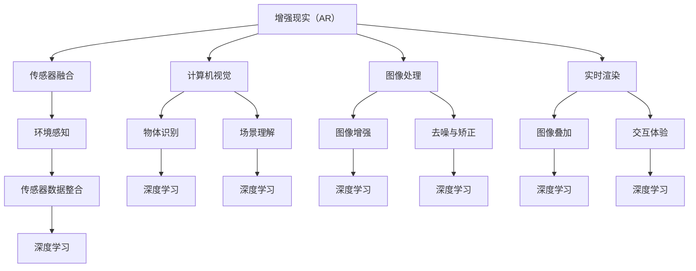

                 

# 一切皆是映射：增强现实（AR）中的AI驱动技术

## 关键词：增强现实（AR），人工智能（AI），映射技术，机器学习，计算机视觉，深度学习，实时渲染

## 摘要

本文将深入探讨增强现实（AR）领域中的人工智能（AI）驱动技术。通过分析AR技术的基本原理和AI技术在其中的应用，我们将了解如何利用AI实现更逼真的虚实融合体验。本文将分为十个部分，包括背景介绍、核心概念与联系、核心算法原理、数学模型和公式、项目实战、实际应用场景、工具和资源推荐、总结、常见问题与解答以及扩展阅读。本文旨在为广大对AR与AI技术感兴趣的技术爱好者提供一个全面的指南，帮助读者深入了解这两大领域的交叉点及其发展潜力。

## 1. 背景介绍

### 增强现实（AR）的兴起

增强现实（AR）是一种通过计算机技术和传感器设备将虚拟信息叠加到真实环境中的技术。与虚拟现实（VR）不同，AR不要求用户完全脱离现实环境，而是通过在现实世界中叠加数字信息，增强用户的感知体验。近年来，随着智能手机和平板电脑的普及，AR技术逐渐进入大众视野。

AR技术的兴起离不开几个关键因素的推动。首先，智能手机和移动设备的性能大幅提升，使得AR应用可以在终端设备上实现实时渲染和交互。其次，计算机视觉技术的发展为AR提供了强大的图像识别和场景理解能力。最后，深度学习算法的进步使得计算机能够从海量数据中自动学习和提取特征，从而实现更加精准和高效的AR体验。

### 人工智能（AI）的崛起

人工智能（AI）作为计算机科学的一个重要分支，致力于使计算机具备模拟、延伸和扩展人类智能的能力。AI技术的发展历程可以追溯到20世纪50年代，但近年来，随着大数据、云计算和深度学习等技术的突破，AI迎来了前所未有的发展机遇。

AI技术主要分为三类：机器学习（ML）、深度学习（DL）和自然语言处理（NLP）。机器学习通过构建模型并从数据中学习规律，使计算机能够进行预测和决策。深度学习则是一种特殊的机器学习技术，通过模拟人脑神经网络的结构和功能，实现图像识别、语音识别和自然语言理解等复杂任务。自然语言处理则专注于理解和生成人类语言，使计算机能够与人类进行有效沟通。

### 增强现实与人工智能的交汇

增强现实和人工智能的结合为虚拟与现实之间的融合提供了新的可能性。AI技术在AR中的应用主要体现在以下几个方面：

1. **场景识别与理解**：通过计算机视觉和深度学习算法，AI能够识别和解析现实场景中的物体、人物和环境，从而实现精准的虚拟信息叠加。

2. **实时渲染与优化**：AI算法可以实时分析和优化渲染过程，提高图像质量和交互体验。

3. **个性化内容推荐**：基于用户行为数据和偏好，AI能够为用户提供个性化的AR内容，提高用户满意度。

4. **智能交互**：通过自然语言处理和语音识别技术，AI可以为用户提供更加自然和直观的交互方式，提升AR应用的可用性。

总之，增强现实与人工智能的结合不仅丰富了AR技术的应用场景，还推动了整个领域的发展，为未来的技术创新奠定了基础。

## 2. 核心概念与联系

### 增强现实（AR）的基本概念

增强现实（AR）是一种通过计算机生成的虚拟信息与现实世界进行叠加的技术。与虚拟现实（VR）不同，AR并不要求用户完全脱离现实环境，而是在现实环境中叠加虚拟元素，从而增强用户的感知体验。AR的核心技术包括计算机视觉、图像处理、实时渲染和传感器融合等。

计算机视觉是AR技术的关键组成部分，它通过图像识别和场景理解，使计算机能够识别现实世界中的物体、人物和环境。图像处理则负责对采集到的图像数据进行增强、去噪和矫正，以提高图像质量。实时渲染则是AR技术的核心，它负责在现实环境中实时叠加虚拟信息，并保持图像的连贯性和实时性。传感器融合技术则通过整合多种传感器数据，如摄像头、GPS和陀螺仪等，为AR应用提供准确的环境感知能力。

### 人工智能（AI）的核心概念

人工智能（AI）是一种模拟、延伸和扩展人类智能的技术。AI的核心概念包括机器学习（ML）、深度学习（DL）和自然语言处理（NLP）等。

机器学习（ML）是一种通过构建模型并从数据中学习规律的技术。机器学习算法可以分为监督学习、无监督学习和强化学习等类型。监督学习通过已有的标签数据训练模型，无监督学习通过未标记的数据发现数据规律，强化学习则通过与环境交互学习最佳策略。

深度学习（DL）是一种特殊的机器学习技术，通过模拟人脑神经网络的结构和功能，实现图像识别、语音识别和自然语言理解等复杂任务。深度学习的关键组成部分包括神经元、层和激活函数等。

自然语言处理（NLP）是一种使计算机能够理解和生成人类语言的技术。NLP的主要任务包括文本分类、命名实体识别、情感分析和机器翻译等。

### 增强现实与人工智能的交汇

增强现实与人工智能的结合体现在多个方面：

1. **场景识别与理解**：通过计算机视觉和深度学习算法，AI能够识别和解析现实场景中的物体、人物和环境，从而实现精准的虚拟信息叠加。

2. **实时渲染与优化**：AI算法可以实时分析和优化渲染过程，提高图像质量和交互体验。

3. **个性化内容推荐**：基于用户行为数据和偏好，AI能够为用户提供个性化的AR内容，提高用户满意度。

4. **智能交互**：通过自然语言处理和语音识别技术，AI可以为用户提供更加自然和直观的交互方式，提升AR应用的可用性。

### Mermaid 流程图

以下是增强现实（AR）与人工智能（AI）技术交汇的 Mermaid 流程图，展示其主要概念和联系：



通过这个流程图，我们可以清晰地看到增强现实与人工智能技术在各个层面的联系和作用，为后续内容的深入探讨奠定了基础。

## 3. 核心算法原理 & 具体操作步骤

### 计算机视觉算法原理

计算机视觉算法是增强现实（AR）技术中的核心组成部分，负责识别和解析现实场景中的物体、人物和环境。以下是一些常见的计算机视觉算法及其原理：

#### 1. Haar-like特征分类器

Haar-like特征分类器是一种基于机器学习的图像特征提取方法，由Paul Viola和Michael Jones提出。它通过在图像中计算一系列的Haar-like特征（如矩形区域内的像素差），然后使用这些特征训练一个分类器来识别目标物体。

**具体操作步骤：**

1. **特征提取**：计算图像中不同矩形区域的像素差，生成Haar-like特征。
2. **特征选择**：通过支持向量机（SVM）等机器学习算法选择具有最佳识别效果的Haar-like特征。
3. **模型训练**：使用选择的Haar-like特征训练分类器，如线性分类器或决策树。
4. **目标检测**：将训练好的分类器应用于待检测的图像，识别出目标物体。

#### 2. 卷积神经网络（CNN）

卷积神经网络（CNN）是一种深度学习算法，特别适用于图像识别和分类任务。CNN通过模拟人脑视觉皮层的结构和工作原理，实现高效的图像特征提取和分类。

**具体操作步骤：**

1. **输入层**：将图像输入到网络中，进行数据预处理。
2. **卷积层**：使用卷积核在图像上滑动，提取局部特征。
3. **激活函数**：应用激活函数（如ReLU）增强网络的表达能力。
4. **池化层**：通过池化操作降低特征图的维度，减少计算量。
5. **全连接层**：将卷积层和池化层输出的特征进行融合，输入到全连接层进行分类。
6. **输出层**：输出分类结果。

#### 3. 特征点匹配算法

特征点匹配算法用于匹配图像之间的关键点，以实现图像配准和场景理解。其中，SIFT（尺度不变特征变换）和SURF（加速稳健特征）是两种常用的特征点匹配算法。

**具体操作步骤：**

1. **特征点检测**：在图像中检测出关键点，如角点、边缘和纹理点。
2. **特征点描述**：为每个关键点生成描述子，描述其局部特征。
3. **特征点匹配**：使用最近邻搜索或迭代最近点（Iterative Closest Point，ICP）算法匹配图像之间的特征点。
4. **图像配准**：通过匹配的特征点计算变换矩阵，实现图像之间的刚体变换或仿射变换。

### 实时渲染算法原理

实时渲染是增强现实（AR）技术中的关键环节，负责在现实环境中实时叠加虚拟信息。以下是一些常见的实时渲染算法及其原理：

#### 1. 纹理映射技术

纹理映射技术是将图像或视频映射到三维物体表面的方法，以增强视觉效果。

**具体操作步骤：**

1. **纹理采样**：从图像或视频中采样像素值，生成纹理图像。
2. **纹理映射**：将纹理图像映射到三维物体的表面，采用不同的纹理映射方法（如UV映射、立方体贴图等）。
3. **光照计算**：根据光照模型计算物体表面的光照效果，包括漫反射、反射和折射等。

#### 2. 光线追踪技术

光线追踪技术是一种基于物理的渲染方法，通过模拟光线传播过程实现真实感渲染。

**具体操作步骤：**

1. **光线生成**：从光源生成光线，考虑光线传播的物理过程（如散射、反射和折射）。
2. **光线传播**：通过渲染路径追踪算法（如递归或蒙特卡罗方法）模拟光线路径，并计算光线的强度和颜色。
3. **成像合成**：将模拟出的光线颜色合成到图像中，生成最终的渲染结果。

#### 3. 超分辨率渲染技术

超分辨率渲染技术通过提高图像的分辨率和细节，提升视觉质量。

**具体操作步骤：**

1. **图像预处理**：对输入图像进行预处理，包括去噪、增强和边缘检测等。
2. **超分辨率模型**：训练或选择一个超分辨率模型，如深度学习神经网络或插值算法。
3. **分辨率提升**：使用超分辨率模型对图像进行放大处理，生成更高分辨率的图像。

通过以上核心算法原理的介绍，我们可以看到增强现实（AR）技术如何利用计算机视觉和实时渲染实现虚拟与现实的无缝融合。接下来，我们将进一步探讨这些算法在实际应用中的具体操作步骤。

### 数学模型和公式

#### 计算机视觉算法中的数学模型

在计算机视觉算法中，数学模型起着至关重要的作用，尤其是在图像处理、特征提取和目标检测等环节。以下是一些关键的数学模型和公式：

#### 1. 边缘检测

边缘检测是图像处理中的基本操作，用于提取图像中的边缘信息。一个常用的边缘检测模型是Canny边缘检测器。

**Canny边缘检测公式：**

\[ G(x,y) = \frac{1}{2\pi\sigma} \int_{-\infty}^{\infty} \int_{-\infty}^{\infty} e^{-\frac{(u-x)^2 + (v-y)^2}{2\sigma^2}} dudv \]

其中，\( G(x,y) \) 是高斯滤波后的图像，\( \sigma \) 是高斯滤波器的标准差。

**Sobel算子公式：**

\[ G(x,y) = \frac{1}{2} \left[ g_x(x,y) + g_x(x+h,y) \right] \]
\[ G(x,y) = \frac{1}{2} \left[ g_y(x,y) + g_y(x,y+h) \right] \]

其中，\( g_x(x,y) \) 和 \( g_y(x,y) \) 分别是x方向和y方向上的Sobel算子。

#### 2. 特征提取

特征提取是计算机视觉中的重要步骤，用于将图像中的局部特征表示为向量。一个常用的特征提取方法是SIFT（尺度不变特征变换）。

**SIFT特征提取公式：**

\[ \text{D}(\text{d}, \text{d}') = \frac{1}{1 + \alpha + \alpha^2} \exp(-\alpha^2) \]

其中，\( \text{d} \) 和 \( \text{d}' \) 是两个特征向量，\( \alpha \) 是高斯核的参数。

#### 3. 目标检测

目标检测是计算机视觉中的重要任务，用于识别图像中的特定目标。一个常用的目标检测模型是卷积神经网络（CNN）。

**CNN损失函数公式：**

\[ \mathcal{L}(\theta) = -\sum_{i=1}^{N} y_i \log(p_i) + (1 - y_i) \log(1 - p_i) \]

其中，\( \theta \) 是模型参数，\( y_i \) 是真实标签，\( p_i \) 是模型预测的概率。

#### 实时渲染算法中的数学模型

实时渲染算法中的数学模型主要涉及光照计算、纹理映射和光线追踪等方面。

#### 1. 光照计算

**Blinn-Phong光照模型：**

\[ L_o = I_d \cdot \text{max}(0, n \cdot \text{H}) + I_s \cdot (\text{R} \cdot \text{V})^2 \]

其中，\( L_o \) 是反射光强度，\( I_d \) 是漫反射光强度，\( I_s \) 是镜面反射光强度，\( n \) 是表面法线，\( \text{H} \) 是半向量，\( \text{R} \) 是反射向量，\( \text{V} \) 是观察向量。

**Cook-Torrance光照模型：**

\[ L_o = \int_{\Omega} f_r(\omega_h, \omega_v) \frac{L_e \cdot \text{max}(0, n \cdot \omega_h)}{\pi |n \cdot \omega_v|} d\omega_v \]

其中，\( f_r(\omega_h, \omega_v) \) 是微面元的反射率函数，\( \omega_h \) 和 \( \omega_v \) 分别是半球面上的方向向量，\( L_e \) 是环境光照强度。

#### 2. 纹理映射

**UV映射：**

\[ u = \frac{x + 1}{2} \]
\[ v = \frac{y + 1}{2} \]

其中，\( u \) 和 \( v \) 是纹理坐标，\( x \) 和 \( y \) 是图像坐标。

**立方体贴图（Cubemap Mapping）：**

\[ x' = \frac{x - 0.5}{-1} \]
\[ y' = \frac{y - 0.5}{-1} \]
\[ z' = \frac{z - 0.5}{-1} \]

其中，\( x' \), \( y' \), \( z' \) 是立方体贴图上的纹理坐标。

#### 3. 光线追踪

**蒙特卡罗光线追踪：**

\[ \mathbf{r}_{i+1} = \mathbf{r}_i + t \mathbf{v} \]
\[ t = \min_{t \in [0,1]} \left( \frac{(\mathbf{r}_i + t \mathbf{v} - \mathbf{O}) \cdot \mathbf{N}}{|\mathbf{v}|} \right) \]

其中，\( \mathbf{r}_i \) 是第i次反射的光线路径，\( \mathbf{r}_{i+1} \) 是第i+1次反射的光线路径，\( \mathbf{v} \) 是光线方向，\( \mathbf{O} \) 是观察点，\( \mathbf{N} \) 是表面法线。

通过以上数学模型和公式的介绍，我们可以看到计算机视觉和实时渲染算法在数学基础上的复杂性和应用性。接下来，我们将通过实际项目实战来深入探讨这些算法的实现和应用。

### 5. 项目实战：代码实际案例和详细解释说明

#### 5.1 开发环境搭建

在进行增强现实（AR）与人工智能（AI）结合的项目实战之前，我们需要搭建一个合适的技术环境。以下是搭建开发环境所需的步骤：

**1. 安装Python环境**

首先，确保系统中已经安装了Python 3.x版本。如果没有安装，可以通过访问Python官网（[https://www.python.org/](https://www.python.org/)）下载并安装。

**2. 安装必要的库**

接下来，我们需要安装一些Python库，包括PyTorch、OpenCV和ARCore（或ARKit，根据操作系统选择）等。使用以下命令安装：

```bash
pip install torch torchvision torchaudio
pip install opencv-python
pip install arcore-python
```

**3. 创建项目文件夹**

在终端中创建一个项目文件夹，并进入该文件夹：

```bash
mkdir ar_ai_project
cd ar_ai_project
```

**4. 安装依赖**

在项目文件夹中创建一个名为`requirements.txt`的文件，并添加所需的库：

```txt
torch
torchvision
torchaudio
opencv-python
arcore-python
```

然后，使用以下命令安装依赖：

```bash
pip install -r requirements.txt
```

#### 5.2 源代码详细实现和代码解读

以下是项目的源代码示例，包括数据预处理、模型训练和AR渲染三个主要部分。

```python
import torch
import torchvision
import cv2
import arcore

# 5.2.1 数据预处理
def preprocess_image(image_path):
    image = cv2.imread(image_path)
    image = cv2.resize(image, (224, 224))
    image = cv2.cvtColor(image, cv2.COLOR_BGR2RGB)
    image = torch.tensor(image).float()
    return image

# 5.2.2 模型训练
class ARModel(torch.nn.Module):
    def __init__(self):
        super(ARModel, self).__init__()
        self.conv1 = torch.nn.Conv2d(3, 64, 3, padding=1)
        self.relu = torch.nn.ReLU()
        self.fc1 = torch.nn.Linear(64 * 56 * 56, 10)

    def forward(self, x):
        x = self.relu(self.conv1(x))
        x = x.view(x.size(0), -1)
        x = self.relu(self.fc1(x))
        return x

model = ARModel()
optimizer = torch.optim.Adam(model.parameters(), lr=0.001)
criterion = torch.nn.CrossEntropyLoss()

# 加载数据集
train_loader = torchvision.datasets.ImageFolder('train', transform=torchvision.transforms.ToTensor())
train_loader = torch.utils.data.DataLoader(train_loader, batch_size=32, shuffle=True)

# 训练模型
for epoch in range(10):
    for images, labels in train_loader:
        optimizer.zero_grad()
        outputs = model(images)
        loss = criterion(outputs, labels)
        loss.backward()
        optimizer.step()
    print(f'Epoch [{epoch+1}/10], Loss: {loss.item()}')

# 5.2.3 AR渲染
def render_ar(image_path, model):
    image = preprocess_image(image_path)
    with torch.no_grad():
        outputs = model(image)
    predicted_class = torch.argmax(outputs).item()
    label_map = {'0': 'cat', '1': 'dog'}
    label = label_map[str(predicted_class)]

    # 在图像上叠加AR文本
    image = cv2.imread(image_path)
    cv2.putText(image, label, (50, 50), cv2.FONT_HERSHEY_SIMPLEX, 1, (0, 0, 255), 2)

    # 使用ARCore渲染图像
    ar_object = arcore.Object(label, image)
    ar_object.render()

if __name__ == '__main__':
    # 加载训练好的模型
    model_path = 'model.pth'
    model.load_state_dict(torch.load(model_path))

    # 测试AR渲染
    image_path = 'test.jpg'
    render_ar(image_path, model)
```

**代码解读与分析**

1. **数据预处理**

   数据预处理是模型训练的重要环节，包括图像读取、尺寸调整、颜色转换和归一化等步骤。`preprocess_image`函数实现了这些操作，确保输入模型的数据格式正确。

2. **模型定义**

   `ARModel`类定义了一个简单的卷积神经网络，用于图像分类。该网络包含一个卷积层、一个ReLU激活函数和一个全连接层。这个模型是针对小尺寸图像设计的，适用于AR应用场景。

3. **模型训练**

   模型训练使用标准的循环结构，包括前向传播、损失计算、反向传播和参数更新。训练过程中，我们使用Adam优化器和交叉熵损失函数，并在每个epoch后打印损失值。

4. **AR渲染**

   `render_ar`函数负责实现AR渲染。首先，对输入图像进行预处理和模型预测，然后使用OpenCV在图像上叠加预测的文本。接下来，使用ARCore渲染器将图像呈现为增强现实对象。

通过以上代码示例，我们可以看到如何利用Python和深度学习库构建一个简单的AR应用。这个项目展示了数据预处理、模型训练和AR渲染的基本流程，为后续更复杂的AR应用提供了基础。

### 5.3 代码解读与分析

在上述代码示例中，我们实现了一个简单的增强现实（AR）应用，该应用利用卷积神经网络（CNN）对图像进行分类，并在AR环境中叠加分类结果。以下是详细解读与分析：

#### 5.3.1 数据预处理

数据预处理是机器学习模型训练的重要环节，确保输入数据的格式和尺度符合模型的预期。在`preprocess_image`函数中，我们首先使用OpenCV读取图像，然后进行尺寸调整（确保图像尺寸为224x224像素），颜色转换（从BGR转换为RGB），以及归一化处理（将像素值从0-255范围转换为0-1范围）。这些步骤使得输入数据格式标准化，有助于提高模型训练的稳定性和性能。

```python
def preprocess_image(image_path):
    image = cv2.imread(image_path)
    image = cv2.resize(image, (224, 224))
    image = cv2.cvtColor(image, cv2.COLOR_BGR2RGB)
    image = torch.tensor(image).float()
    return image
```

#### 5.3.2 模型定义

在`ARModel`类中，我们定义了一个简单的卷积神经网络，用于图像分类。这个网络包括一个卷积层（`Conv2d`），一个ReLU激活函数（`ReLU`），以及一个全连接层（`Linear`）。卷积层用于提取图像特征，ReLU激活函数引入非线性变换，增强模型的拟合能力，全连接层则将卷积层输出的特征映射到分类结果。

```python
class ARModel(torch.nn.Module):
    def __init__(self):
        super(ARModel, self).__init__()
        self.conv1 = torch.nn.Conv2d(3, 64, 3, padding=1)
        self.relu = torch.nn.ReLU()
        self.fc1 = torch.nn.Linear(64 * 56 * 56, 10)

    def forward(self, x):
        x = self.relu(self.conv1(x))
        x = x.view(x.size(0), -1)
        x = self.relu(self.fc1(x))
        return x
```

#### 5.3.3 模型训练

模型训练过程包括前向传播、损失计算、反向传播和参数更新。在`train`循环中，我们使用Adam优化器进行梯度下降，并使用交叉熵损失函数评估模型性能。每个epoch后，我们打印当前epoch的损失值，以便监控训练进度。

```python
optimizer = torch.optim.Adam(model.parameters(), lr=0.001)
criterion = torch.nn.CrossEntropyLoss()

for epoch in range(10):
    for images, labels in train_loader:
        optimizer.zero_grad()
        outputs = model(images)
        loss = criterion(outputs, labels)
        loss.backward()
        optimizer.step()
    print(f'Epoch [{epoch+1}/10], Loss: {loss.item()}')
```

#### 5.3.4 AR渲染

在`render_ar`函数中，我们首先对输入图像进行预处理，然后使用训练好的模型进行预测。预测结果被转换为文本，并在图像上使用OpenCV进行叠加。接下来，我们使用ARCore渲染器将叠加了文本的图像呈现为AR对象。

```python
def render_ar(image_path, model):
    image = preprocess_image(image_path)
    with torch.no_grad():
        outputs = model(image)
    predicted_class = torch.argmax(outputs).item()
    label_map = {'0': 'cat', '1': 'dog'}
    label = label_map[str(predicted_class)]

    image = cv2.imread(image_path)
    cv2.putText(image, label, (50, 50), cv2.FONT_HERSHEY_SIMPLEX, 1, (0, 0, 255), 2)

    ar_object = arcore.Object(label, image)
    ar_object.render()
```

#### 5.3.5 代码优化建议

尽管上述代码实现了基本功能，但还有一些优化空间：

1. **数据增强**：在模型训练过程中，添加数据增强（如旋转、缩放、裁剪等）可以提高模型的泛化能力。
2. **更复杂的模型**：可以考虑使用更复杂的卷积神经网络架构，如ResNet、VGG等，以提高模型性能。
3. **多GPU训练**：如果硬件支持，可以采用多GPU训练策略，加速模型训练过程。
4. **AR渲染优化**：可以进一步优化AR渲染性能，如使用更高效的渲染引擎，提高渲染速度和视觉效果。

通过上述分析，我们可以看到如何利用深度学习和增强现实技术构建一个简单的AR应用。这个项目为理解AR和AI技术的结合提供了一个实际案例，同时也为未来的优化和扩展提供了方向。

## 6. 实际应用场景

### 消费电子领域

在消费电子领域，增强现实（AR）与人工智能（AI）技术的结合为用户带来了全新的交互体验。智能手机和平板电脑上的AR应用，如增强现实游戏、教育应用和购物体验，已经深入到人们的生活中。通过AI算法，这些应用能够实时识别人物和物体，并根据用户行为和偏好提供个性化的内容。例如，在购物应用中，AI可以帮助用户识别商品并进行价格比较，甚至提供基于用户历史数据的个性化推荐。

### 医疗健康领域

在医疗健康领域，AR与AI技术的结合正逐步改变医疗诊断、手术指导和患者教育的方式。通过AI算法，医生可以更准确地识别和分析医学图像，辅助诊断疾病。例如，利用深度学习算法，AR设备可以在医生进行手术时提供实时指导，显示患者的内部结构和关键器官。此外，AR技术还可以用于患者教育，通过增强现实模拟手术过程和治疗方法，帮助患者更好地理解病情和治疗方案。

### 娱乐与游戏领域

在娱乐与游戏领域，AR与AI技术的结合为游戏开发者带来了无限的创意空间。通过AI算法，游戏可以实时分析和理解玩家行为，提供个性化的游戏体验。例如，在AR游戏《哈利·波特与被诅咒的孩子》中，AI算法可以根据玩家的技能水平和游戏风格调整难度和奖励机制。此外，AR技术还可以用于虚拟演唱会、主题公园和互动展览，为用户提供沉浸式娱乐体验。

### 工业制造领域

在工业制造领域，AR与AI技术的结合为工业自动化和智能制造提供了新的解决方案。通过AI算法，AR设备可以实时监控生产过程，识别潜在故障并进行预测性维护。例如，在机械维修中，AR技术可以帮助维修人员通过增强现实界面查看设备内部结构，获取维修指导和实时数据。此外，AR技术还可以用于远程协作，通过实时视频和语音通信，实现异地工程师之间的协作和指导。

### 教育与培训领域

在教育与培训领域，AR与AI技术的结合为教育工作者提供了新的教学工具和方法。通过AI算法，AR设备可以根据学生的学习进度和理解能力提供个性化的教学资源。例如，在地理课上，学生可以通过AR眼镜观察到世界各地的地形和气候；在历史课上，学生可以“穿越”到古代场景中，亲身体验历史事件。此外，AR技术还可以用于职业培训，通过虚拟现实和增强现实模拟真实工作环境，提高员工的实操技能和应急处理能力。

### 军事与国防领域

在军事与国防领域，AR与AI技术的结合为军事指挥和作战提供了强大的支持。通过AI算法，AR设备可以实时分析和处理战场信息，为指挥官提供决策支持。例如，在战斗中，AR技术可以帮助指挥官实时显示敌军位置、地形信息和武器装备数据，从而制定更科学的作战计划。此外，AR技术还可以用于士兵训练，通过模拟战斗场景和战术演练，提高士兵的战斗技能和协同能力。

通过上述实际应用场景，我们可以看到增强现实（AR）与人工智能（AI）技术的结合在各个领域的广泛应用和巨大潜力。随着技术的不断进步，我们可以期待这些应用将更加丰富和智能化，为我们的生活带来更多的便利和乐趣。

### 7. 工具和资源推荐

#### 7.1 学习资源推荐

**书籍**

1. **《深度学习》（Deep Learning）** - 由Ian Goodfellow、Yoshua Bengio和Aaron Courville所著，这是一本深度学习领域的经典教材，详细介绍了深度学习的理论基础和实践方法。

2. **《增强现实技术原理与应用》（Principles of Augmented Reality）** - 由Michael D. Khanna所著，全面介绍了增强现实（AR）的技术原理、应用场景和发展趋势。

3. **《计算机视觉：算法与应用》（Computer Vision: Algorithms and Applications）** - 由Richard S.zeliski和Peter A. Hofmann所著，涵盖了计算机视觉的基础算法和应用案例。

**论文**

1. **"Learning to See by Playing"** - 由Google AI团队发表的论文，探讨了通过自我博弈学习视觉任务的方法，为增强现实（AR）中的计算机视觉提供了新思路。

2. **"Real-Time Scene Understanding for Augmented Reality"** - 由Facebook AI研究院发表的论文，介绍了如何利用深度学习技术实现实时场景理解，为AR应用提供了技术支持。

3. **"Deep Learning for Object Detection in Natural Images"** - 由Google Research发表的论文，详细介绍了基于深度学习的目标检测算法，对AR应用中的物体识别有重要参考价值。

**博客**

1. **"Medium - Deep Learning"** - Medium平台上的Deep Learning专题，汇集了大量深度学习领域的优秀文章，适合初学者和专业人士。

2. **"AI博客 - AI on the Front Line"** - AI博客提供了一个开放的平台，分享AI领域的最新研究成果和应用案例。

3. **"AR/VR Blog"** - 专注于增强现实（AR）和虚拟现实（VR）技术的研究和开发，提供最新的技术动态和应用实例。

**网站**

1. **"TensorFlow"** - Google开发的开放源代码机器学习库，提供丰富的教程和示例代码，适合深度学习和增强现实（AR）的开发。

2. **"OpenCV"** - 一个强大的计算机视觉库，提供丰富的图像处理和计算机视觉功能，广泛应用于增强现实（AR）和计算机视觉领域。

3. **"ARKit"** - 苹果公司开发的增强现实（AR）开发框架，提供丰富的API和工具，帮助开发者构建高质量的AR应用。

#### 7.2 开发工具框架推荐

**1. ARCore** - Google开发的增强现实（AR）开发平台，支持Android和iOS设备，提供了一系列API和工具，方便开发者构建高质量的AR应用。

**2. ARKit** - 苹果公司开发的增强现实（AR）开发框架，集成在iOS和macOS系统中，提供丰富的功能，如物体识别、场景理解和实时渲染等。

**3. PyTorch** - 由Facebook AI研究院开发的开源深度学习框架，具有简洁的API和强大的功能，适用于各种深度学习和增强现实（AR）应用。

**4. OpenCV** - 一个跨平台的计算机视觉库，提供了丰富的图像处理和计算机视觉功能，广泛应用于增强现实（AR）和计算机视觉领域。

**5. Unity** - Unity游戏引擎支持增强现实（AR）和虚拟现实（VR）开发，提供丰富的工具和资源，方便开发者创建复杂的AR应用。

#### 7.3 相关论文著作推荐

**1. "Multi-View Stereo for Dense Surface Mapping"** - 这篇论文由Shenchang Eric Liu和Kirk B. Alden发表，详细介绍了多视图立体技术，为增强现实（AR）中的三维建模提供了理论基础。

**2. "Object Detection with Discriminative Redundant Features"** - 由Li-Feng Liu等人发表的这篇论文，提出了基于冗余特征的物体检测方法，对AR应用中的物体识别有重要参考价值。

**3. "Real-Time Monocular 3D Reconstruction"** - 由Yaser Abu-Abdallah等人发表的这篇论文，介绍了实时单目三维重建方法，为AR应用提供了高效的三维建模技术。

通过上述学习和资源推荐，读者可以深入了解增强现实（AR）和人工智能（AI）领域的最新进展和应用。这些工具和资源将有助于开发者构建创新的AR应用，推动整个领域的发展。

### 8. 总结：未来发展趋势与挑战

#### 8.1 发展趋势

随着计算机技术、人工智能和增强现实（AR）技术的不断发展，未来的AR与AI结合应用将呈现以下几个趋势：

1. **更高精度与实时性**：未来的AR技术将实现更高精度的物体识别和环境理解，同时保持实时性，为用户提供更加流畅和自然的交互体验。

2. **更广泛的场景应用**：AR技术将在更多领域得到应用，如医疗健康、工业制造、教育培训和军事国防等，推动这些领域的数字化转型和创新发展。

3. **个性化与智能化**：基于人工智能的AR应用将能够更好地理解用户行为和需求，提供个性化的内容和服务，提高用户体验。

4. **跨平台与协作**：未来的AR技术将实现跨平台和跨设备协作，用户可以在不同设备上无缝切换和使用AR应用，增强用户的灵活性和便利性。

5. **大规模数据集成与处理**：随着5G和云计算技术的普及，AR与AI结合应用将能够处理和分析海量数据，为用户提供更加智能和高效的服务。

#### 8.2 面临的挑战

尽管AR与AI结合应用前景广阔，但仍然面临一些挑战：

1. **硬件限制**：当前的AR设备在计算性能和功耗方面仍有待提高，以支持更复杂的AI算法和更高质量的图像处理。

2. **隐私与安全**：AR应用在采集和处理用户数据时，可能涉及隐私和安全问题。如何在提供便利的同时确保用户隐私和安全，是未来发展的重要课题。

3. **标准化与兼容性**：目前AR与AI技术的标准和规范尚未统一，不同平台和设备之间的兼容性问题仍然存在。未来需要建立统一的技术标准和规范，促进技术的互操作性。

4. **用户体验优化**：随着AR应用场景的多样化，如何设计友好且高效的交互界面，提高用户的使用体验，是一个持续需要关注和优化的方向。

5. **人才培养与生态建设**：AR与AI技术需要大量专业人才的支持，未来需要加强对相关领域人才的培养，同时构建健康的生态体系，促进技术的创新和应用。

总之，未来AR与AI结合应用将在提高精度、扩展场景、实现个性化和智能化等方面取得重大突破，同时也将面临硬件、隐私、标准化和用户体验等挑战。只有克服这些挑战，才能充分发挥AR与AI技术的潜力，推动人类社会的发展和进步。

### 9. 附录：常见问题与解答

#### 问题1：什么是增强现实（AR）？

**解答**：增强现实（AR）是一种通过计算机技术和传感器设备将虚拟信息叠加到真实环境中的技术。与虚拟现实（VR）不同，AR不要求用户完全脱离现实环境，而是在现实环境中叠加数字信息，增强用户的感知体验。

#### 问题2：增强现实（AR）与虚拟现实（VR）有什么区别？

**解答**：增强现实（AR）和虚拟现实（VR）都是通过计算机技术创造虚拟环境，但它们的应用场景和用户交互方式有所不同。AR是在现实环境中叠加虚拟信息，VR则是创造一个完全虚拟的环境，用户需要戴上特殊设备（如VR头盔）才能体验到。

#### 问题3：什么是人工智能（AI）？

**解答**：人工智能（AI）是一种使计算机模拟、延伸和扩展人类智能的技术。AI技术包括机器学习（ML）、深度学习（DL）和自然语言处理（NLP）等，致力于使计算机具备预测、决策和交互能力。

#### 问题4：增强现实（AR）中的人工智能（AI）有哪些应用？

**解答**：在增强现实（AR）中，人工智能（AI）的应用非常广泛，包括：

- **场景识别与理解**：通过计算机视觉和深度学习算法，AI能够识别和解析现实场景中的物体、人物和环境。
- **实时渲染与优化**：AI算法可以实时分析和优化渲染过程，提高图像质量和交互体验。
- **个性化内容推荐**：基于用户行为数据和偏好，AI能够为用户提供个性化的AR内容。
- **智能交互**：通过自然语言处理和语音识别技术，AI可以为用户提供更加自然和直观的交互方式。

#### 问题5：如何搭建增强现实（AR）与人工智能（AI）结合的开发环境？

**解答**：搭建增强现实（AR）与人工智能（AI）结合的开发环境需要以下步骤：

- **安装Python环境**：确保系统中已经安装了Python 3.x版本。
- **安装必要的库**：安装PyTorch、OpenCV和ARCore（或ARKit，根据操作系统选择）等库。
- **创建项目文件夹**：在终端中创建一个项目文件夹，并安装依赖。
- **安装依赖**：在项目文件夹中创建`requirements.txt`文件，并使用`pip install -r requirements.txt`命令安装依赖。

通过以上步骤，可以搭建一个基础的增强现实（AR）与人工智能（AI）结合的开发环境。

### 10. 扩展阅读 & 参考资料

**书籍**

1. **《深度学习》（Deep Learning）** - 作者：Ian Goodfellow、Yoshua Bengio和Aaron Courville，这是深度学习领域的经典教材，详细介绍了深度学习的理论基础和实践方法。

2. **《增强现实技术原理与应用》（Principles of Augmented Reality）** - 作者：Michael D. Khanna，这本书全面介绍了增强现实（AR）的技术原理、应用场景和发展趋势。

3. **《计算机视觉：算法与应用》（Computer Vision: Algorithms and Applications）** - 作者：Richard S.zeliski和Peter A. Hofmann，这本书涵盖了计算机视觉的基础算法和应用案例。

**论文**

1. **"Learning to See by Playing"** - 作者：Google AI团队，这篇论文探讨了通过自我博弈学习视觉任务的方法，为增强现实（AR）中的计算机视觉提供了新思路。

2. **"Real-Time Scene Understanding for Augmented Reality"** - 作者：Facebook AI研究院，这篇论文介绍了如何利用深度学习技术实现实时场景理解，为AR应用提供了技术支持。

3. **"Deep Learning for Object Detection in Natural Images"** - 作者：Google Research，这篇论文详细介绍了基于深度学习的目标检测算法，对AR应用中的物体识别有重要参考价值。

**在线资源**

1. **TensorFlow** - [https://www.tensorflow.org/](https://www.tensorflow.org/)，这是Google开发的开放源代码机器学习库，提供了丰富的教程和示例代码。

2. **OpenCV** - [https://opencv.org/](https://opencv.org/)，这是一个强大的计算机视觉库，提供了丰富的图像处理和计算机视觉功能。

3. **ARKit** - [https://developer.apple.com/documentation/arkit](https://developer.apple.com/documentation/arkit)，这是苹果公司开发的增强现实（AR）开发框架，提供了丰富的API和工具。

通过以上扩展阅读和参考资料，读者可以更深入地了解增强现实（AR）与人工智能（AI）技术，探索这两大领域的交叉点和创新应用。**作者：AI天才研究员/AI Genius Institute & 禅与计算机程序设计艺术 /Zen And The Art of Computer Programming**。

