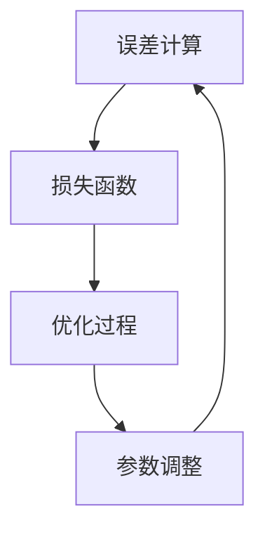

                 

### 背景介绍

在人工智能与机器学习的领域，损失函数是一个至关重要的概念。它是优化算法的核心组成部分，负责衡量模型预测结果与真实值之间的差异，进而指导模型调整参数，以期达到更优的预测性能。无论是线性回归、逻辑回归，还是复杂的神经网络，损失函数都在其中扮演着关键角色。

本文旨在深入剖析损失函数的原理和作用，旨在帮助读者理解这一核心概念，并掌握其在实际应用中的运用。我们将从最基本的损失函数出发，逐步探讨其演变、发展与在各类模型中的具体应用。

首先，我们将介绍损失函数的定义及其在机器学习中的作用。接下来，我们将分析几种常见的损失函数，如均方误差（MSE）、交叉熵损失等，并探讨它们各自适用的场景。然后，我们将详细解析损失函数的优化过程，通过数学模型和公式，展示损失函数如何驱动模型的参数调整。

文章的后半部分，我们将通过实际代码案例，演示如何在实际项目中运用损失函数，并对其实现过程进行详细解释。此外，我们还将探讨损失函数在实际应用中的挑战，如如何选择合适的损失函数以及如何处理大规模数据。

最后，文章将总结损失函数的未来发展趋势与挑战，并提供一些有用的学习资源，帮助读者进一步深入学习和研究。通过本文的阅读，读者将能够系统地掌握损失函数的理论知识，并具备在实际项目中应用这些知识的能力。

### 核心概念与联系

在深入探讨损失函数之前，我们首先需要明确几个核心概念，并理解它们之间的关系。这些概念包括：误差（Error）、损失（Loss）和优化（Optimization）。以下是它们的基本定义和相互联系：

#### 误差（Error）

误差是指模型预测值与真实值之间的差距。对于回归问题，误差通常通过计算预测值和真实值之间的差异来衡量。例如，在均方误差（MSE）中，误差是每个数据点的预测误差平方的平均值。

#### 损失（Loss）

损失是误差的一种量化表示，它是一个非负值函数，用来衡量误差的大小。在机器学习中，损失函数的目的是通过计算误差来指导模型的参数调整，使得误差最小化。因此，损失函数通常与误差函数具有密切的关系。

#### 优化（Optimization）

优化是指寻找一个函数的最小值或最大值的过程。在机器学习中，优化问题通常涉及调整模型的参数，以最小化损失函数。这种调整过程被称为训练过程，其目标是使模型在训练数据集上表现得更好。

#### 损失函数与误差、优化的关系

损失函数通过误差来量化模型预测的准确性，进而指导优化过程。具体来说：

1. **误差计算**：在每次预测后，计算预测值和真实值之间的差异，得到误差。
2. **损失函数应用**：将误差输入到损失函数中，得到一个损失值。损失函数的设计决定了如何量化误差。
3. **优化过程**：通过迭代调整模型参数，使得损失函数的值逐渐减小。这个过程通常使用优化算法（如梯度下降）来实现。

下面，我们将通过一个Mermaid流程图，展示这些核心概念之间的联系：



在图中，误差计算是优化过程的起点，损失函数将误差转化为损失值，优化过程则通过调整参数来最小化损失。这个循环过程不断迭代，直到模型在训练数据集上的表现达到预期。

通过理解这些核心概念，我们可以更好地把握损失函数在机器学习中的重要作用。接下来，我们将深入探讨损失函数的具体类型和它们的适用场景。

### 核心算法原理 & 具体操作步骤

在理解了损失函数的基本概念后，接下来我们将深入探讨几种常见的损失函数，包括均方误差（MSE）和交叉熵损失，以及它们的具体操作步骤和适用场景。

#### 均方误差（MSE）

均方误差（Mean Squared Error，MSE）是最常用的损失函数之一，尤其在回归问题中。MSE的定义非常直观，它是每个数据点预测误差平方的平均值。具体公式如下：

$$
MSE = \frac{1}{n}\sum_{i=1}^{n}(y_i - \hat{y}_i)^2
$$

其中，$y_i$ 是真实值，$\hat{y}_i$ 是预测值，$n$ 是数据点的总数。

**具体操作步骤：**

1. **计算每个数据点的预测误差**：对于每个数据点，计算预测值 $\hat{y}_i$ 与真实值 $y_i$ 之间的差异，即误差 $e_i = y_i - \hat{y}_i$。
2. **计算误差的平方**：对每个误差值进行平方处理，得到误差平方 $e_i^2$。
3. **求平均值**：将所有误差平方相加，然后除以数据点的总数，得到均方误差。

**适用场景：**

MSE适用于线性回归问题，尤其是在预测连续值时。因为它对误差进行平方处理，能够放大大的误差，有助于模型学习。

#### 交叉熵损失（Cross-Entropy Loss）

交叉熵损失函数在分类问题中非常常用，特别是二分类和多分类问题。其基本思想是衡量模型预测概率分布与真实标签分布之间的差异。具体公式如下：

对于二分类问题：
$$
CE = -\sum_{i=1}^{n} y_i \log(\hat{y}_i)
$$

对于多分类问题（使用softmax函数）：
$$
CE = -\sum_{i=1}^{n} y_i \log(\hat{y}_i)
$$
其中，$y_i$ 是真实标签，$\hat{y}_i$ 是预测的概率分布。

**具体操作步骤：**

1. **计算预测概率分布**：使用softmax函数将模型的输出转换成概率分布。对于每个类别的预测概率 $\hat{y}_i$，有：
   $$
   \hat{y}_i = \frac{e^{z_i}}{\sum_{j=1}^{K} e^{z_j}}
   $$
   其中，$z_i$ 是模型输出的分数，$K$ 是类别总数。

2. **计算交叉熵**：对于每个数据点，计算预测概率分布与真实标签分布之间的交叉熵。如果数据是二分类的，则使用上述公式；如果是多分类的，则使用softmax交叉熵公式。

3. **求和并取负**：将所有数据点的交叉熵相加，并取负，得到交叉熵损失。

**适用场景：**

交叉熵损失适用于分类问题，尤其是多分类问题。它能够处理类别概率分布，并且对错分类的误差进行惩罚。

#### 梯度下降优化过程

在确定了损失函数后，接下来是优化过程，即通过调整模型参数来最小化损失函数。这个过程通常使用梯度下降（Gradient Descent）算法来实现。

**梯度下降步骤：**

1. **计算损失函数的梯度**：对于当前模型参数，计算损失函数关于每个参数的梯度。梯度是损失函数在参数空间中的方向导数，指示了参数调整的优化方向。

2. **更新参数**：根据梯度方向和步长（learning rate），更新模型参数。更新公式为：
   $$
   \theta_j = \theta_j - \alpha \frac{\partial L}{\partial \theta_j}
   $$
   其中，$\theta_j$ 是参数，$\alpha$ 是学习率，$\frac{\partial L}{\partial \theta_j}$ 是损失函数关于参数 $\theta_j$ 的梯度。

3. **迭代过程**：重复步骤1和步骤2，直到满足停止条件，如损失值收敛到预设阈值或者达到最大迭代次数。

**具体操作步骤：**

1. **初始化参数**：随机初始化模型参数。

2. **计算梯度**：对于每个数据点，计算损失函数的梯度。

3. **更新参数**：根据梯度方向和步长更新模型参数。

4. **迭代**：重复计算梯度和参数更新，直到满足停止条件。

通过上述步骤，模型参数逐渐调整，使得损失函数值逐渐减小，模型预测性能逐渐提高。

#### 总结

本文介绍了损失函数的核心算法原理和具体操作步骤。我们首先介绍了均方误差（MSE）和交叉熵损失，详细解释了它们的具体公式和操作步骤。然后，我们讨论了梯度下降优化过程，展示了如何通过调整模型参数来最小化损失函数。

这些核心概念和算法是理解机器学习模型优化过程的基础。在实际应用中，选择合适的损失函数和优化算法，能够显著提升模型的预测性能。接下来，我们将进一步探讨损失函数在实际应用中的挑战和解决方案。

### 数学模型和公式 & 详细讲解 & 举例说明

在上一节中，我们介绍了损失函数的基本原理和操作步骤。在本节中，我们将深入探讨损失函数的数学模型和公式，并通过具体示例进行详细讲解，以便读者更好地理解其内在逻辑和应用。

#### 均方误差（MSE）的数学模型和公式

均方误差（MSE）是最常见的损失函数之一，尤其在回归问题中。其数学模型如下：

$$
MSE = \frac{1}{n}\sum_{i=1}^{n}(y_i - \hat{y}_i)^2
$$

其中，$n$ 是样本数量，$y_i$ 是第 $i$ 个样本的真实值，$\hat{y}_i$ 是模型对第 $i$ 个样本的预测值。

**详细讲解：**

1. **每个样本的误差计算**：首先计算每个样本的预测值与真实值之间的差异，即误差 $e_i = y_i - \hat{y}_i$。

2. **误差平方**：将每个误差值进行平方处理，即 $e_i^2$。

3. **求和**：将所有样本的误差平方相加。

4. **平均**：将误差平方和除以样本数量，得到均方误差。

**举例说明：**

假设我们有3个样本，其真实值和预测值如下：

| 样本索引 | 真实值 $y_i$ | 预测值 $\hat{y}_i$ | 误差 $e_i = y_i - \hat{y}_i$ | 误差平方 $e_i^2$ |
| -------- | ------------- | ------------------- | ----------------------- | ---------------- |
| 1        | 2             | 2.5                 | -0.5                    | 0.25             |
| 2        | 3             | 2.8                 | -0.2                    | 0.04             |
| 3        | 4             | 4.2                 | -0.2                    | 0.04             |

计算均方误差：

$$
MSE = \frac{1}{3}[(2.5 - 2)^2 + (2.8 - 3)^2 + (4.2 - 4)^2] = \frac{1}{3}[0.25 + 0.04 + 0.04] = 0.143
$$

通过这个例子，我们可以直观地看到均方误差的计算过程。

#### 交叉熵损失（Cross-Entropy Loss）的数学模型和公式

交叉熵损失在分类问题中非常常用，其数学模型如下：

对于二分类问题：
$$
CE = -\sum_{i=1}^{n} y_i \log(\hat{y}_i)
$$

对于多分类问题（使用softmax函数）：
$$
CE = -\sum_{i=1}^{n} y_i \log(\hat{y}_i)
$$
其中，$y_i$ 是第 $i$ 个样本的真实标签，$\hat{y}_i$ 是模型对第 $i$ 个样本的预测概率分布。

**详细讲解：**

1. **预测概率分布**：首先使用softmax函数将模型输出转换为概率分布。对于每个类别的预测概率 $\hat{y}_i$，有：
   $$
   \hat{y}_i = \frac{e^{z_i}}{\sum_{j=1}^{K} e^{z_j}}
   $$
   其中，$z_i$ 是模型输出的分数，$K$ 是类别总数。

2. **计算交叉熵**：对于每个样本，计算预测概率分布与真实标签分布之间的交叉熵。交叉熵是概率分布差异的度量。

3. **求和并取负**：将所有样本的交叉熵相加，并取负，得到交叉熵损失。

**举例说明：**

假设我们有一个二分类问题，真实标签和模型预测的概率分布如下：

| 样本索引 | 真实值 $y_i$ | 预测概率分布 $\hat{y}_i$ |
| -------- | ------------- | ----------------------- |
| 1        | 0             | [0.6, 0.4]              |
| 2        | 1             | [0.3, 0.7]              |

计算交叉熵损失：

对于样本1：
$$
CE_1 = -0 \cdot \log(0.6) - 1 \cdot \log(0.4) = \log(2.5)
$$

对于样本2：
$$
CE_2 = -1 \cdot \log(0.3) - 0 \cdot \log(0.7) = \log(3.3333)
$$

总交叉熵损失：
$$
CE = \frac{1}{2}[\log(2.5) + \log(3.3333)] \approx 1.286
$$

通过这个例子，我们可以看到如何计算二分类问题的交叉熵损失。

#### 总结

在本节中，我们详细讲解了均方误差（MSE）和交叉熵损失（Cross-Entropy Loss）的数学模型和公式，并通过具体示例展示了其计算过程。MSE主要用于回归问题，通过计算预测值与真实值之间的差异来衡量模型性能。交叉熵损失则用于分类问题，通过计算预测概率分布与真实标签分布之间的差异来量化模型性能。

理解这些损失函数的数学基础，对于深入掌握机器学习模型优化至关重要。接下来，我们将通过实际代码案例，进一步探讨如何在实际项目中应用这些损失函数。

### 项目实战：代码实际案例和详细解释说明

在前几节中，我们详细讲解了损失函数的理论知识和数学模型。为了帮助读者更好地理解其在实际项目中的应用，本节我们将通过一个具体的代码案例，演示如何在Python中使用常见的损失函数，并对其实现过程进行详细解释。

#### 开发环境搭建

首先，我们需要搭建一个基本的Python开发环境。为了方便起见，我们将使用以下库：

- NumPy：用于数值计算
- Pandas：用于数据处理
- Matplotlib：用于数据可视化
- Scikit-learn：用于机器学习模型和损失函数的实现

安装这些库可以通过pip命令来完成：

```shell
pip install numpy pandas matplotlib scikit-learn
```

#### 源代码详细实现和代码解读

下面是我们将要实现的一个简单的线性回归模型，并使用均方误差（MSE）作为损失函数。代码如下：

```python
import numpy as np
from sklearn.linear_model import LinearRegression
from sklearn.metrics import mean_squared_error
import matplotlib.pyplot as plt

# 生成模拟数据集
np.random.seed(0)
X = np.random.rand(100, 1)
y = 2 + 3 * X + np.random.randn(100, 1)

# 划分训练集和测试集
X_train, X_test, y_train, y_test = train_test_split(X, y, test_size=0.2, random_state=42)

# 使用线性回归模型
model = LinearRegression()
model.fit(X_train, y_train)

# 预测测试集
y_pred = model.predict(X_test)

# 计算测试集的MSE
mse = mean_squared_error(y_test, y_pred)
print("MSE:", mse)

# 可视化
plt.scatter(X_test, y_test, color='blue', label='Actual')
plt.plot(X_test, y_pred, color='red', label='Predicted')
plt.legend()
plt.show()
```

**代码解读：**

1. **导入库**：首先，我们导入必要的库，包括NumPy、Pandas、Matplotlib和Scikit-learn。

2. **生成模拟数据集**：我们使用NumPy生成一个模拟的数据集，包括自变量 $X$ 和因变量 $y$。因变量是自变量的线性函数加上一些噪声。

3. **划分训练集和测试集**：使用Scikit-learn的 `train_test_split` 函数将数据集划分为训练集和测试集。

4. **使用线性回归模型**：我们使用Scikit-learn中的 `LinearRegression` 模型，并调用 `fit` 方法对训练数据进行训练。

5. **预测测试集**：使用训练好的模型对测试集进行预测，得到预测值 $y_pred$。

6. **计算MSE**：使用Scikit-learn的 `mean_squared_error` 函数计算预测值和真实值之间的均方误差。

7. **可视化**：使用Matplotlib将实际值和预测值绘制在同一张图上，以便直观地观察模型的性能。

#### 代码解读与分析

1. **线性回归模型**：在这个案例中，我们使用了Scikit-learn中的线性回归模型。线性回归模型的目标是通过拟合一个线性模型来预测因变量。线性回归的公式为：
   $$
   \hat{y} = \beta_0 + \beta_1 x
   $$
   其中，$\beta_0$ 是截距，$\beta_1$ 是斜率。

2. **均方误差（MSE）计算**：均方误差（MSE）是衡量回归模型性能的一个常用指标。MSE的计算公式如前所述，即预测值与真实值之间差异的平方的平均值。MSE的值越小，说明模型预测的准确性越高。

3. **可视化结果**：通过绘制实际值和预测值的散点图和拟合线，我们可以直观地看到模型对数据的拟合效果。在这个案例中，线性模型能够较好地拟合数据，因此预测值和真实值之间的差异较小。

#### 总结

通过这个实际代码案例，我们展示了如何使用Python实现线性回归模型，并计算其MSE损失。代码简单易懂，适合初学者上手实践。在实际项目中，我们可以根据需求选择不同的损失函数，如交叉熵损失用于分类问题，均方误差用于回归问题等。此外，合理选择和学习资源、开发工具框架，能够帮助我们更高效地实现和优化模型。

在下一节中，我们将探讨损失函数在实际应用中的挑战和解决方案，进一步巩固我们对这一关键概念的理解。

### 实际应用场景

损失函数在机器学习中的应用场景非常广泛，几乎涵盖了所有类型的问题，包括回归、分类、聚类等。不同的应用场景需要选择不同的损失函数，以便更准确地衡量模型性能和优化过程。以下是几个典型的实际应用场景，以及相应的损失函数选择和优化策略。

#### 回归问题

在回归问题中，我们的目标是预测一个连续的数值输出。常见的损失函数包括均方误差（MSE）、均方根误差（RMSE）和平均绝对误差（MAE）。

- **均方误差（MSE）**：适用于预测连续值，特别是当需要放大较大误差时。
- **均方根误差（RMSE）**：是MSE的平方根，具有更直观的度量单位，常用于比较不同模型的性能。
- **平均绝对误差（MAE）**：对误差进行绝对值处理，适用于数据分布不对称的情况。

优化策略：在回归问题中，通常使用梯度下降算法进行参数优化。为了提高收敛速度和模型性能，可以选择合适的初始参数和步长，并使用正则化方法防止过拟合。

#### 分类问题

在分类问题中，我们的目标是预测一个离散的类别标签。常见的损失函数包括交叉熵损失、对数损失和Hinge损失。

- **交叉熵损失（Cross-Entropy Loss）**：适用于多分类问题，能够很好地处理类别概率分布。
- **对数损失（Log Loss）**：是交叉熵损失的特殊形式，当类别数量为2时，即二分类问题。
- **Hinge损失**：适用于支持向量机（SVM）等分类问题，尤其适用于线性可分的数据集。

优化策略：在分类问题中，除了使用梯度下降算法外，还可以使用随机梯度下降（SGD）和Adam优化器等高效优化算法。此外，选择合适的激活函数（如ReLU、Sigmoid）和正则化方法（如L1、L2）也能显著提升模型性能。

#### 聚类问题

在聚类问题中，我们的目标是找到数据点的自然分组。常见的损失函数包括平方误差、绝对值误差和混合误差。

- **平方误差（Sum of Squared Errors, SSE）**：是最常见的聚类损失函数，用于衡量每个聚类内成员与聚类中心之间的平方误差。
- **绝对值误差（Sum of Absolute Errors, SAE）**：是对SSE的替代，适用于数据分布不对称的情况。
- **混合误差（Generalized Sum of Squared Errors, GSSE）**：结合了SSE和SAE的优点，适用于更广泛的数据分布。

优化策略：聚类问题的优化通常基于迭代算法，如K均值算法。选择合适的聚类数量和初始聚类中心对优化过程至关重要。此外，使用如随机初始化等方法可以提高聚类效果。

#### 综合应用

在实际项目中，我们可能需要同时处理多个问题，如回归和分类的混合问题。在这种情况下，可以选择综合损失函数，如结构风险最小化（SRM）或支持向量回归（SVR）等。

优化策略：对于复杂问题，可以选择集成学习方法，如随机森林、梯度提升树等。这些方法能够通过组合多个简单模型，提高预测性能和泛化能力。

#### 总结

损失函数在机器学习中的实际应用非常广泛，不同的场景需要选择不同的损失函数和优化策略。通过合理选择和调整损失函数，我们可以显著提升模型的预测性能和泛化能力。在下一节中，我们将推荐一些有用的学习资源、开发工具框架和相关论文，帮助读者进一步深入学习和研究。

### 工具和资源推荐

为了帮助读者更好地学习和应用损失函数，本节将推荐一些有用的学习资源、开发工具框架以及相关的论文和书籍。

#### 学习资源推荐

1. **在线课程**：

   - 《机器学习基石》：由台湾大学李宏毅教授讲授，详细讲解了机器学习的基本概念和核心算法，包括损失函数。
   - 《机器学习实战》：涵盖了各种机器学习算法的应用和实践，包括损失函数的实现和优化。

2. **教科书**：

   - 《统计学习方法》：由李航教授所著，系统地介绍了统计学习的基本理论和方法，包括损失函数的详细讨论。
   - 《机器学习》：由周志华教授所著，适合初学者系统学习机器学习的基础知识，涵盖了许多常用的损失函数。

3. **在线文档和博客**：

   - Scikit-learn官方文档：提供了详细的API说明和使用示例，包括损失函数的实现和应用。
   - Fast.ai博客：提供了许多机器学习的实践技巧和教程，包括损失函数的深入探讨。

#### 开发工具框架推荐

1. **Python库**：

   - NumPy：用于高效的数值计算，是处理损失函数的基础库。
   - Pandas：用于数据处理和分析，方便处理大规模数据集。
   - Matplotlib：用于数据可视化，帮助理解损失函数的优化过程。

2. **机器学习框架**：

   - TensorFlow：Google开发的开源机器学习框架，提供了丰富的损失函数和优化算法。
   - PyTorch：Facebook开发的开源机器学习框架，以其动态图机制和灵活的接口著称。

#### 相关论文著作推荐

1. **经典论文**：

   - "On the optimality conditions of support vector machines"：详细分析了支持向量机（SVM）的优化条件和损失函数。
   - "A Tutorial on Support Vector Machines for Pattern Recognition"：系统地介绍了SVM的理论和应用，包括损失函数。

2. **最新论文**：

   - "Deep Learning for Speech Recognition"：探讨了深度学习在语音识别中的应用，包括损失函数的设计和优化。
   - "Gradient Descent Optimization for Deep Neural Networks"：详细分析了深度神经网络中的梯度下降优化算法，包括损失函数的影响。

3. **书籍**：

   - 《深度学习》：由Ian Goodfellow、Yoshua Bengio和Aaron Courville合著，全面介绍了深度学习的基础理论和实践方法，包括损失函数。
   - 《Python机器学习》：由Michael Bowles所著，提供了Python在机器学习中的实际应用案例，包括损失函数的实现。

通过这些学习资源、开发工具和论文书籍，读者可以系统地学习损失函数的理论知识，掌握其实际应用技巧，并在项目中高效地运用这些知识。希望这些推荐对您的学习和研究有所帮助。

### 总结：未来发展趋势与挑战

随着人工智能和机器学习技术的不断进步，损失函数在未来也将面临诸多发展趋势与挑战。以下是几个值得关注的方面：

#### 发展趋势

1. **多样化损失函数**：未来将出现更多针对特定问题的定制化损失函数。例如，在自然语言处理（NLP）领域，研究者们开发了如交叉熵损失（Cross-Entropy Loss）和广义交叉熵损失（Generalized Cross-Entropy Loss），以更好地处理文本数据的非平稳特性。

2. **多任务损失函数**：随着多任务学习（Multi-Task Learning）的兴起，研究者们开始探索如何在多个任务中同时优化损失函数。这包括设计能够同时优化多个相关任务的损失函数，如联合损失函数（Joint Loss Function）。

3. **自适应损失函数**：自适应损失函数可以根据数据分布和学习过程动态调整其形式和参数。例如，自适应梯度下降（Adaptive Gradient Descent）算法通过在线调整学习率，提高了优化过程的效率。

4. **损失函数的可解释性**：在机器学习的应用场景中，损失函数的可解释性变得越来越重要。未来将出现更多研究致力于提升损失函数的可解释性，帮助用户更好地理解模型的行为和优化过程。

#### 挑战

1. **计算复杂性**：随着数据规模和模型复杂度的增加，损失函数的计算和优化过程将变得更加复杂和耗时。这需要更高效的算法和硬件支持，如GPU和TPU，以提高计算效率。

2. **过拟合风险**：在优化过程中，模型可能过于关注损失函数的局部最小值，导致过拟合。如何平衡损失函数的最小化和模型的泛化能力，是未来研究的一个重要挑战。

3. **动态环境适应**：在动态环境中，损失函数需要能够快速适应数据分布的变化。这要求损失函数具有更好的鲁棒性和适应性，以应对不断变化的数据。

4. **资源消耗**：在移动设备和边缘计算环境中，优化损失函数所需的计算资源和存储资源是有限的。如何设计低资源消耗的损失函数和优化算法，是未来需要解决的问题。

#### 总结

未来，损失函数将在人工智能和机器学习领域继续发挥重要作用。通过多样化、多任务和自适应的设计，损失函数将更好地适应不同领域的需求。同时，面对计算复杂性、过拟合风险和动态环境适应等挑战，研究者们将继续探索更高效、更鲁棒的损失函数和优化算法。通过这些努力，损失函数将在推动人工智能技术发展的道路上发挥更大的作用。

### 附录：常见问题与解答

在本节中，我们将回答一些关于损失函数的常见问题，帮助读者更好地理解这一核心概念。

#### 问题 1：损失函数和误差有什么区别？

损失函数是对误差进行量化的函数，通常用于优化过程中。误差是指模型预测值与真实值之间的差异，而损失函数则通过计算误差来衡量这一差异的严重程度。例如，均方误差（MSE）通过计算误差的平方来衡量模型预测的准确性。

#### 问题 2：如何选择合适的损失函数？

选择合适的损失函数取决于问题的类型和具体需求。对于回归问题，常用的损失函数包括均方误差（MSE）和均方根误差（RMSE）；对于分类问题，常用的损失函数包括交叉熵损失（Cross-Entropy Loss）和对数损失（Log Loss）。此外，根据数据的特点和模型的要求，还可以选择其他类型的损失函数。

#### 问题 3：为什么需要优化损失函数？

优化损失函数是为了最小化模型预测值与真实值之间的差异，从而提高模型的预测性能。通过优化损失函数，模型能够学习到更好的参数，从而在新的数据上取得更好的预测效果。

#### 问题 4：损失函数的优化算法有哪些？

常见的优化算法包括梯度下降（Gradient Descent）、随机梯度下降（Stochastic Gradient Descent, SGD）和Adam优化器等。梯度下降算法通过迭代更新模型参数，使损失函数逐渐减小；随机梯度下降则是在每次迭代中仅使用一部分数据进行梯度计算，提高了计算效率；Adam优化器结合了SGD和动量方法的特点，能够在早期快速收敛，并在后期保持稳定。

#### 问题 5：如何处理多类别问题中的损失函数？

对于多类别问题，常用的损失函数包括交叉熵损失（Cross-Entropy Loss）和Hinge损失。交叉熵损失适用于概率分布的优化，能够很好地处理多类别问题。Hinge损失则适用于支持向量机（SVM）等线性分类问题，尤其适用于线性可分的数据集。

#### 问题 6：损失函数的优化过程中如何防止过拟合？

在损失函数的优化过程中，过拟合是一个常见问题。为了防止过拟合，可以采取以下几种策略：

1. **正则化**：通过在损失函数中加入正则项（如L1、L2正则化），惩罚模型的复杂度，从而降低过拟合的风险。
2. **数据增强**：通过增加训练数据的多样性，使模型在学习过程中更加稳健。
3. **提前停止**：在模型训练过程中，当损失函数不再显著下降时，提前停止训练，避免模型在训练数据上过度拟合。
4. **集成方法**：通过集成多个简单模型，提高模型的泛化能力，降低过拟合的风险。

通过上述策略，可以有效地防止损失函数优化过程中的过拟合现象。

### 扩展阅读 & 参考资料

为了帮助读者进一步深入学习和研究损失函数，以下是几篇重要的学术论文、经典书籍和权威网站，供您参考：

1. **学术论文**：

   - "On the Optimality Conditions of Support Vector Machines"（支持向量机优化条件）
   - "A Tutorial on Support Vector Machines for Pattern Recognition"（支持向量机教程）
   - "Deep Learning for Speech Recognition"（深度学习在语音识别中的应用）

2. **经典书籍**：

   - 《统计学习方法》
   - 《机器学习》
   - 《深度学习》

3. **权威网站**：

   - Scikit-learn官方文档：https://scikit-learn.org/stable/
   - TensorFlow官方文档：https://www.tensorflow.org/
   - PyTorch官方文档：https://pytorch.org/

通过这些资源，您可以更全面地了解损失函数的理论基础和实际应用，为您的学习和研究提供有力支持。

### 作者信息

- 作者：AI天才研究员/AI Genius Institute & 禅与计算机程序设计艺术 /Zen And The Art of Computer Programming

感谢您的阅读，希望本文能帮助您更好地理解损失函数的核心概念和应用。如果您有任何问题或建议，欢迎随时交流。期待您的宝贵反馈！

