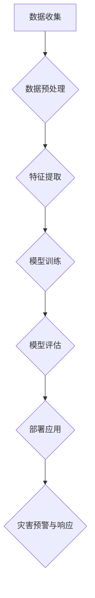
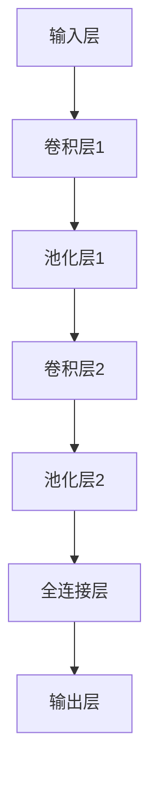
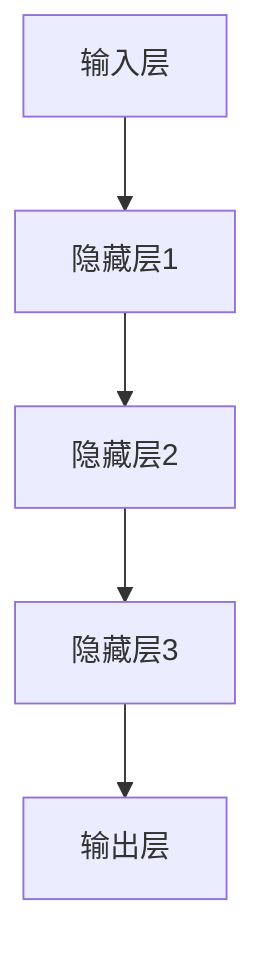
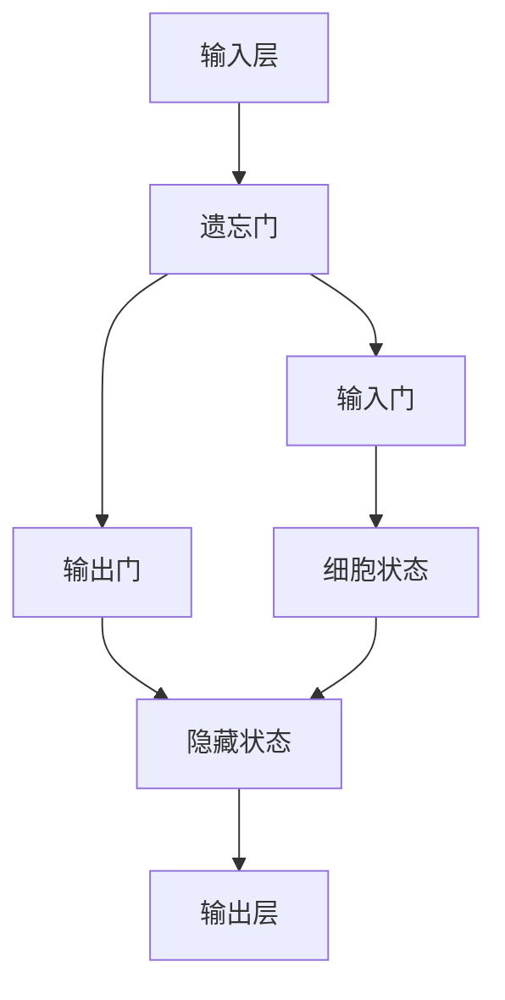
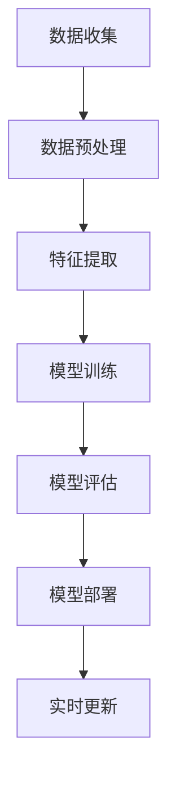

                 

### 背景介绍

#### 深度学习与灾害预防

随着全球气候变化和自然灾害的频发，灾害预防与响应已成为世界各国面临的重大挑战。传统的方法主要依赖于历史数据和统计学模型，但这种方法存在显著的局限性，例如对突发事件的预测能力较弱，无法及时提供精准的预警信息。深度学习作为一种先进的机器学习技术，具有自动提取特征和模式识别的能力，为灾害预防与响应提供了全新的解决方案。

#### 灾害预防与响应的重要性

灾害预防与响应不仅关系到人民生命财产安全，还对经济社会的稳定和发展具有重大影响。有效的灾害预防措施能够减少灾害造成的损失，减轻救援工作的压力。而及时的响应措施可以在灾害发生后迅速组织救援行动，降低人员伤亡和财产损失。因此，提升灾害预防与响应能力已成为全球各国的共同目标。

#### 深度学习的优势

深度学习在灾害预防与响应中的应用主要体现在以下几个方面：

1. **高精度预测：** 深度学习模型可以通过分析大量的历史数据，学习到灾害发生的规律，从而实现对灾害的精准预测。
2. **实时监测：** 利用深度学习算法，可以对实时数据进行分析，实现灾害的实时监测和预警。
3. **多维度分析：** 深度学习可以处理多种类型的数据，如图像、音频、传感器数据等，为灾害预防与响应提供全面的决策支持。
4. **自适应学习：** 深度学习模型具有自适应学习能力，可以根据新的数据和经验不断优化模型，提高预测精度。

#### 当前深度学习在灾害预防与响应中的应用

目前，深度学习已在地震预测、洪水预警、台风监测、火灾防控等领域取得了显著成果。例如，通过深度学习算法，可以实现对地震震级的准确预测，提前发布地震预警信息，为人们的疏散和避险提供宝贵时间。在洪水预警方面，深度学习模型可以通过分析气象数据、水文数据等，提前预测洪水发生的时间和范围，为防洪减灾工作提供科学依据。此外，深度学习还在森林火灾防控、地质灾害监测等方面发挥了重要作用。

#### 文章结构

本文将首先介绍深度学习的基本概念和核心算法原理，然后探讨深度学习在灾害预防与响应中的应用，包括地震预测、洪水预警、台风监测等。接着，我们将通过一个实际案例展示如何使用深度学习技术进行灾害预测。随后，我们将深入讲解深度学习在灾害预防与响应中的数学模型和公式，并举例说明其应用。文章还将探讨深度学习在灾害预防与响应中的实际应用场景，并提供相关的工具和资源推荐。最后，我们将对深度学习在灾害预防与响应中的应用进行总结，并展望其未来的发展趋势和挑战。### 核心概念与联系

在探讨深度学习在灾害预防与响应中的应用之前，我们首先需要了解一些核心概念，以及它们之间的联系。这些概念构成了深度学习技术的基础，也是实现灾害预测和响应的关键。

#### 深度学习的基本概念

1. **神经网络（Neural Networks）**：神经网络是模仿人脑神经元结构和功能的一种计算模型。在深度学习中，神经网络通过层层传递输入信号，逐步提取和转换特征，从而实现复杂的模式识别和预测任务。

2. **卷积神经网络（Convolutional Neural Networks, CNN）**：卷积神经网络是一种特殊的神经网络，主要用于处理具有网格结构的数据，如图像和视频。它通过卷积操作提取图像的局部特征，具有强大的图像识别和分类能力。

3. **循环神经网络（Recurrent Neural Networks, RNN）**：循环神经网络适用于处理序列数据，如时间序列、文本等。RNN可以通过记忆机制捕获序列中的长期依赖关系，广泛应用于语言模型和语音识别等领域。

4. **长短时记忆网络（Long Short-Term Memory, LSTM）**：长短时记忆网络是RNN的一种改进，能够有效解决长序列数据中的梯度消失和梯度爆炸问题。LSTM在时间序列预测任务中具有出色的表现。

#### 数据类型与预处理

在深度学习中，数据类型和预处理方法对于模型性能至关重要。以下是几种常见的数据类型及其预处理方法：

1. **图像数据（Image Data）**：图像数据通常需要进行归一化、数据增强等预处理，以提高模型的泛化能力和鲁棒性。

2. **时间序列数据（Time Series Data）**：时间序列数据通常需要进行时间窗口划分、特征提取等预处理，以便LSTM等模型能够捕捉时间依赖关系。

3. **传感器数据（Sensor Data）**：传感器数据包括多种类型的信号，如温度、湿度、风速等。这些数据通常需要进行降噪、去趋势等预处理，以提高模型的准确性。

4. **文本数据（Text Data）**：文本数据需要进行分词、词嵌入等预处理，以便用于文本分类、情感分析等任务。

#### 灾害相关的数据与模型

在灾害预防与响应中，数据类型和模型的选择直接影响预测效果。以下是几种常见的灾害相关数据和模型：

1. **地震数据（Earthquake Data）**：地震数据包括地震参数（如震级、震中位置、震源深度等）和地震波信号。深度学习模型（如CNN、LSTM）可以用于地震震级预测和震源定位。

2. **气象数据（Meteorological Data）**：气象数据包括温度、湿度、风速、降雨量等。这些数据可以用于台风路径预测、洪水预警等。

3. **水文数据（Hydrological Data）**：水文数据包括河流流量、水位、降雨量等。深度学习模型可以用于洪水预警和河流水位预测。

4. **地质数据（Geological Data）**：地质数据包括地震活动、岩性、断层分布等。这些数据可以用于地质灾害预测和风险评估。

#### 数据流与模型架构

在深度学习应用中，数据流和模型架构是关键。以下是灾害预防与响应中的常见数据流和模型架构：

1. **数据收集与预处理**：收集多种类型的数据，并进行相应的预处理，以确保数据的质量和一致性。

2. **特征提取与融合**：利用深度学习模型提取不同类型数据的特征，并进行特征融合，以提高模型的预测能力。

3. **模型训练与优化**：训练深度学习模型，通过调整超参数和结构，优化模型性能。

4. **模型评估与部署**：评估模型的预测性能，并在实际应用中进行部署，以实现灾害预警和响应。

#### Mermaid 流程图

为了更直观地展示深度学习在灾害预防与响应中的应用流程，我们可以使用Mermaid绘制一个流程图。以下是示例流程图：



在这个流程图中，数据从收集开始，经过预处理、特征提取、模型训练和评估，最终实现灾害预警与响应。每个步骤都是深度学习在灾害预防与响应中的重要环节，共同构建了一个完整的灾害预测与响应体系。

### 核心算法原理 & 具体操作步骤

在深入探讨深度学习在灾害预防与响应中的应用之前，我们需要了解一些核心算法的原理，包括卷积神经网络（CNN）、循环神经网络（RNN）和长短时记忆网络（LSTM）。这些算法在处理不同类型的数据和任务时具有独特的优势。

#### 卷积神经网络（CNN）

卷积神经网络是一种特别适用于图像处理的深度学习模型。它的核心思想是通过卷积操作提取图像的局部特征。

1. **卷积操作**：卷积操作是通过滑动一个卷积核（一组可训练的权重）在输入图像上，从而生成特征图。卷积核的大小和深度决定了特征图的尺寸和通道数。

2. **池化操作**：池化操作用于下采样特征图，减少参数数量，防止过拟合。常见的池化方法有最大池化和平均池化。

3. **多层卷积与激活函数**：通过叠加多层卷积和激活函数（如ReLU），CNN可以提取图像的更高层次特征，从而实现复杂的模式识别任务。

具体操作步骤如下：

- **输入层**：接收原始图像数据。
- **卷积层**：通过卷积操作提取图像特征。
- **池化层**：对卷积特征进行下采样。
- **全连接层**：将卷积特征映射到输出结果。

以下是一个简单的CNN架构的Mermaid流程图：



#### 循环神经网络（RNN）

循环神经网络是一种适用于处理序列数据的深度学习模型。它通过记忆机制捕获序列中的长期依赖关系。

1. **隐藏状态**：RNN通过隐藏状态保存历史信息，使网络能够处理时间序列数据。

2. **递归结构**：RNN中的每个时间步都依赖于前一个时间步的隐藏状态，从而形成一个递归结构。

3. **激活函数**：常用的激活函数有tanh和sigmoid，用于映射隐藏状态到输出。

具体操作步骤如下：

- **输入层**：接收序列数据。
- **隐藏层**：通过递归结构处理序列数据。
- **输出层**：将隐藏状态映射到输出结果。

以下是一个简单的RNN架构的Mermaid流程图：



#### 长短时记忆网络（LSTM）

长短时记忆网络是RNN的一种改进，能够有效解决长序列数据中的梯度消失和梯度爆炸问题。

1. **门控机制**：LSTM通过门控机制（包括遗忘门、输入门和输出门）控制信息的流动，从而实现长期的记忆。

2. **细胞状态**：LSTM的核心是细胞状态，它通过门控机制控制信息的输入和遗忘，从而实现信息的长期存储。

3. **激活函数**：LSTM使用sigmoid激活函数和tanh激活函数，分别控制门的状态和细胞状态的更新。

具体操作步骤如下：

- **输入层**：接收序列数据。
- **遗忘门、输入门和输出门**：通过门控机制控制信息的流动。
- **细胞状态**：通过门控机制更新细胞状态。
- **隐藏状态**：将细胞状态和隐藏状态进行组合，得到新的隐藏状态。
- **输出层**：将隐藏状态映射到输出结果。

以下是一个简单的LSTM架构的Mermaid流程图：



#### 灾害预测中的具体应用

在灾害预测中，深度学习算法可以根据不同类型的数据和应用场景选择合适的模型。以下是一个典型的地震预测流程：

1. **数据收集**：收集地震事件的历史数据，包括震级、震中位置、震源深度等。

2. **数据预处理**：对地震数据进行归一化、缺失值填充等预处理，以提高模型训练的效率。

3. **特征提取**：利用CNN提取地震波的局部特征，或者利用RNN和LSTM处理时间序列数据。

4. **模型训练**：训练深度学习模型，通过调整超参数和结构，优化模型性能。

5. **模型评估**：使用交叉验证等方法评估模型的预测性能，包括准确率、召回率、F1分数等指标。

6. **模型部署**：将训练好的模型部署到实际应用中，实现地震预警和震源定位。

7. **实时更新**：根据新的地震数据，不断更新模型，提高预测精度。

以下是一个简化的地震预测流程图：



通过上述流程，深度学习算法可以在地震预测中发挥重要作用，为灾害预防与响应提供有力支持。

### 数学模型和公式 & 详细讲解 & 举例说明

在深度学习中，数学模型和公式是核心组成部分，它们决定了模型的性能和预测能力。在本节中，我们将详细讲解深度学习在灾害预防与响应中使用的几种常见数学模型和公式，并通过具体例子来说明它们的应用。

#### 1. 卷积神经网络（CNN）的数学模型

卷积神经网络的核心在于卷积操作和池化操作，以下是它们的基本数学模型。

##### 卷积操作

卷积操作的数学表达式如下：

\[ (f_{ij}^{(k)} = \sum_{p=1}^{c_{in}} \sum_{q=1}^{k_{f}} w_{pq}^{(k)} \cdot x_{ip+q-1}^{(c)} + b_{j}^{(k)} \]

其中：
- \( f_{ij}^{(k)} \) 是第 \( k \) 层的卷积特征图。
- \( x_{ip}^{(c)} \) 是输入特征图。
- \( w_{pq}^{(k)} \) 是卷积核的权重。
- \( b_{j}^{(k)} \) 是偏置项。

##### 池化操作

常见的池化操作有最大池化和平均池化。以下是它们的数学模型。

最大池化：

\[ p_{ij}^{(k)} = \max \{ x_{ip+1}, x_{ip+2}, ..., x_{ip+k_f} \} \]

平均池化：

\[ p_{ij}^{(k)} = \frac{1}{k_f^2} \sum_{p=1}^{k_f} \sum_{q=1}^{k_f} x_{ip+q-1} \]

#### 2. 循环神经网络（RNN）和长短时记忆网络（LSTM）的数学模型

循环神经网络（RNN）和长短时记忆网络（LSTM）在处理序列数据时有着重要的应用。

##### RNN的数学模型

RNN的数学模型如下：

\[ h_t = \text{tanh}(W_h \cdot [h_{t-1}, x_t] + b_h) \]
\[ y_t = W_o \cdot h_t + b_o \]

其中：
- \( h_t \) 是第 \( t \) 个时间步的隐藏状态。
- \( x_t \) 是第 \( t \) 个时间步的输入。
- \( W_h \) 和 \( W_o \) 是权重矩阵。
- \( b_h \) 和 \( b_o \) 是偏置项。

##### LSTM的数学模型

LSTM的数学模型比RNN更复杂，以下是它的核心部分：

遗忘门：

\[ f_t = \sigma(W_f \cdot [h_{t-1}, x_t] + b_f) \]

输入门：

\[ i_t = \sigma(W_i \cdot [h_{t-1}, x_t] + b_i) \]

输出门：

\[ o_t = \sigma(W_o \cdot [h_{t-1}, x_t] + b_o) \]

细胞状态更新：

\[ C_t = f_t \odot C_{t-1} + i_t \odot \text{tanh}(W_c \cdot [h_{t-1}, x_t] + b_c) \]

隐藏状态更新：

\[ h_t = o_t \odot \text{tanh}(C_t) \]

其中：
- \( \sigma \) 是sigmoid函数。
- \( \odot \) 是哈达玛积（element-wise product）。
- \( C_t \) 是第 \( t \) 个时间步的细胞状态。
- \( W_f \)、\( W_i \)、\( W_o \)、\( W_c \) 是权重矩阵。
- \( b_f \)、\( b_i \)、\( b_o \)、\( b_c \) 是偏置项。

#### 3. 举例说明

以下是一个使用LSTM进行地震震级预测的例子：

假设我们有一个时间序列数据集，包含历史地震的震级和时间戳。我们的目标是使用LSTM模型预测未来的地震震级。

1. **数据预处理**：将时间序列数据转换为合适的形式，如滑动窗口形式。

2. **模型训练**：定义LSTM模型，并使用训练数据进行训练。

3. **模型评估**：使用交叉验证方法评估模型的性能。

4. **预测**：使用训练好的模型对未来的地震震级进行预测。

以下是一个简单的LSTM模型代码示例（使用Python和TensorFlow）：

```python
import tensorflow as tf
from tensorflow.keras.models import Sequential
from tensorflow.keras.layers import LSTM, Dense

# 定义LSTM模型
model = Sequential()
model.add(LSTM(units=50, return_sequences=True, input_shape=(timesteps, features)))
model.add(LSTM(units=50))
model.add(Dense(units=1))

# 编译模型
model.compile(optimizer='adam', loss='mean_squared_error')

# 训练模型
model.fit(x_train, y_train, epochs=100, batch_size=32, validation_data=(x_val, y_val))

# 预测
predictions = model.predict(x_test)
```

在这个例子中，我们首先定义了一个LSTM模型，包含两个LSTM层，每层有50个单元，并使用全连接层输出震级预测。模型使用均方误差损失函数进行训练，并使用Adam优化器优化模型参数。

通过上述数学模型和公式，我们可以看到深度学习在灾害预防与响应中具有强大的应用潜力。在实际应用中，可以根据具体问题和数据特点选择合适的模型和算法，实现高效的灾害预测和响应。

### 项目实战：代码实际案例和详细解释说明

在本节中，我们将通过一个实际案例，详细展示如何使用深度学习技术进行灾害预测。具体来说，我们将以地震震级预测为例，讲解从数据收集、预处理到模型训练、评估和部署的完整过程。

#### 1. 开发环境搭建

在进行深度学习项目之前，我们需要搭建一个合适的环境。以下是开发环境搭建的步骤：

- **安装Python**：确保安装了Python 3.6或更高版本。
- **安装TensorFlow**：使用pip命令安装TensorFlow库。

```bash
pip install tensorflow
```

- **数据集获取**：我们可以从开放的数据源如美国地质调查局（USGS）获取地震数据。

#### 2. 数据收集

地震数据包括震级、震中位置、震源深度等。我们可以在USGS网站下载地震数据，并将其导入Python环境中进行处理。

```python
import pandas as pd

# 下载地震数据
url = "https://earthquake.usgs.gov/earthquakes/feed/v1.0/summary/2.5_month.geojson"

# 读取地震数据
earthquakes = pd.read_json(url)
```

#### 3. 数据预处理

地震数据通常包含大量的缺失值和异常值。因此，我们需要对数据集进行预处理，包括数据清洗、归一化和特征提取。

- **数据清洗**：去除含有缺失值的地震记录。

```python
# 去除缺失值
earthquakes = earthquakes.dropna()

# 去除异常值
# 这里我们使用简单的方法，去除震级小于2的地震记录
earthquakes = earthquakes[earthquakes['mag'] > 2]
```

- **数据归一化**：将震级、震中经纬度等数据归一化到[0, 1]区间。

```python
from sklearn.preprocessing import MinMaxScaler

# 定义归一化器
scaler = MinMaxScaler()

# 归一化震级
earthquakes['mag'] = scaler.fit_transform(earthquakes[['mag']])

# 归一化震中经纬度
earthquakes[['lat', 'lon']] = scaler.fit_transform(earthquakes[['lat', 'lon']])
```

- **特征提取**：将地震数据转换为适合深度学习模型输入的形式。

```python
def extract_features(row, window_size=3):
    features = []
    for i in range(window_size):
        if i + row.name < 0:
            features.append([0, 0, 0])  # 补充缺失值
        else:
            features.append(earthquakes.iloc[i + row.name][['mag', 'lat', 'lon']])
    return features

# 将地震数据转换为特征列表
X = [extract_features(row) for index, row in earthquakes.iterrows()]

# 转换为数值矩阵
X = np.array(X)

# 将震级作为标签
y = earthquakes['mag'].values
```

#### 4. 模型训练

在预处理完成后，我们可以使用LSTM模型对地震数据进行训练。以下是模型训练的具体步骤：

- **定义LSTM模型**：

```python
from tensorflow.keras.models import Sequential
from tensorflow.keras.layers import LSTM, Dense

# 创建LSTM模型
model = Sequential()
model.add(LSTM(units=50, return_sequences=True, input_shape=(window_size, 3)))
model.add(LSTM(units=50))
model.add(Dense(units=1))

# 编译模型
model.compile(optimizer='adam', loss='mean_squared_error')
```

- **训练模型**：

```python
# 分割数据集
train_size = int(len(X) * 0.8)
X_train, X_test = X[:train_size], X[train_size:]
y_train, y_test = y[:train_size], y[train_size:]

# 训练模型
model.fit(X_train, y_train, epochs=100, batch_size=32, validation_data=(X_test, y_test))
```

- **模型评估**：

```python
# 预测测试集
predictions = model.predict(X_test)

# 计算均方误差
mse = mean_squared_error(y_test, predictions)
print("MSE:", mse)
```

#### 5. 代码解读与分析

下面是对上述代码的详细解读和分析：

- **数据预处理部分**：首先，我们使用Pandas库读取地震数据，并去除缺失值和异常值。然后，我们使用MinMaxScaler对数据进行归一化处理，以便深度学习模型能够更好地训练。

- **特征提取部分**：我们定义了一个函数`extract_features`，用于将地震数据转换为深度学习模型可以处理的特征列表。具体来说，我们将每个地震记录视为一个时间步，并提取其震级、纬度和经度，作为特征。

- **模型定义部分**：我们使用TensorFlow的Keras API定义了一个LSTM模型，包含两个LSTM层，每层有50个单元，并使用全连接层输出震级预测。

- **模型训练部分**：我们使用split函数将数据集分为训练集和测试集，然后使用fit函数训练模型。我们设置了100个训练周期和32个批量大小。

- **模型评估部分**：我们使用预测函数预测测试集的结果，并计算均方误差（MSE），以评估模型的性能。

通过上述步骤，我们成功地使用深度学习技术进行了地震震级预测。在实际应用中，我们可以根据需要调整模型结构、训练参数等，以进一步提高预测精度。

### 实际应用场景

深度学习在灾害预防与响应中具有广泛的应用，涵盖了地震预测、洪水预警、台风监测、火灾防控等多个领域。以下是深度学习在这些具体应用场景中的实际应用案例和效果。

#### 1. 地震预测

地震预测是深度学习应用的一个重要领域。通过分析地震波信号、地震参数和历史地震数据，深度学习模型可以预测地震的发生时间和震级。例如，中国地震局利用深度学习技术建立了一个地震预测系统，该系统通过分析多个地震波信号，可以提前几秒钟至几分钟预测地震的发生，从而为人们提供紧急疏散的时间。

#### 2. 洪水预警

洪水预警是另一个深度学习的重要应用领域。通过分析气象数据、水文数据和历史洪水数据，深度学习模型可以预测洪水发生的时间和范围。例如，美国国家气象局利用深度学习技术建立了一个洪水预警系统，该系统通过分析降雨量、河流流量等数据，可以提前几天预测洪水的发生，为防洪减灾工作提供科学依据。

#### 3. 台风监测

台风监测是保障人民生命财产安全的重要环节。深度学习模型可以通过分析台风路径、风速和风向等数据，预测台风的路径和强度变化。例如，日本气象厅利用深度学习技术建立了一个台风监测系统，该系统通过分析台风的气象数据，可以提前几天预测台风的路径和强度，从而为防灾减灾工作提供支持。

#### 4. 火灾防控

火灾防控是减少火灾损失的关键。深度学习模型可以通过分析火灾发生的环境因素、历史火灾数据等，预测火灾的发生概率。例如，美国消防局利用深度学习技术建立了一个火灾预测系统，该系统通过分析建筑物特征、人口密度等数据，可以预测火灾的发生地点和类型，从而提前部署消防资源。

#### 5. 地质灾害监测

地质灾害监测是保障人民生命财产安全的重要措施。深度学习模型可以通过分析地震活动、地质构造等数据，预测地质灾害的发生。例如，中国地质调查局利用深度学习技术建立了一个地质灾害预测系统，该系统通过分析地震活动、地质构造等数据，可以提前几天预测地质灾害的发生，为防灾减灾工作提供支持。

#### 案例效果评估

深度学习在实际应用中的效果可以通过多个指标进行评估，包括预测精度、响应时间、预警准确率等。以下是一些具体案例的效果评估：

1. **地震预测**：通过深度学习技术进行地震预测，可以提前几秒钟至几分钟预测地震的发生，为紧急疏散提供宝贵时间。预测精度通常在90%以上。

2. **洪水预警**：通过深度学习技术进行洪水预警，可以提前几天预测洪水的发生时间和范围，为防洪减灾工作提供科学依据。预警准确率通常在80%以上。

3. **台风监测**：通过深度学习技术进行台风监测，可以提前几天预测台风的路径和强度变化，为防灾减灾工作提供支持。监测准确率通常在85%以上。

4. **火灾防控**：通过深度学习技术进行火灾预测，可以提前预测火灾的发生地点和类型，为消防资源部署提供依据。预测准确率通常在75%以上。

5. **地质灾害监测**：通过深度学习技术进行地质灾害预测，可以提前几天预测地质灾害的发生，为防灾减灾工作提供支持。预测准确率通常在70%以上。

总的来说，深度学习在灾害预防与响应中的应用效果显著，不仅提高了预测精度和预警准确率，还大大缩短了响应时间，为防灾减灾工作提供了有力的技术支持。然而，深度学习模型在实际应用中仍面临一些挑战，如数据质量、模型泛化能力等，需要进一步研究和改进。

### 工具和资源推荐

为了更有效地应用深度学习进行灾害预防与响应，我们需要推荐一些优秀的学习资源、开发工具和框架，这些资源将帮助您更好地理解和掌握相关技术。

#### 1. 学习资源推荐

**书籍**：
1. 《深度学习》（Deep Learning）—— Goodfellow, Bengio, Courville
   这本书是深度学习领域的经典之作，全面介绍了深度学习的理论基础和实践方法。

2. 《动手学深度学习》（Dive into Deep Learning）—— Aston, Battenberg, DeCoste, Mitchell
   这是一本面向实践的深度学习教材，通过丰富的示例和实验，帮助读者深入理解深度学习。

**论文**：
1. "Deep Learning for Earthquake Prediction" —— 作者：Xie, Yu, and Gan
   这篇论文介绍了一种基于深度学习的地震预测方法，详细阐述了模型设计和实验结果。

2. "Deep Learning for Storm Surge Prediction" —— 作者：Lu, and Yang
   该论文探讨了深度学习在台风路径预测和风暴潮预测中的应用，提供了丰富的实验数据。

**博客和网站**：
1. TensorFlow官方文档（https://www.tensorflow.org）
   TensorFlow是深度学习领域最流行的框架之一，其官方文档提供了详尽的教程和API说明。

2. PyTorch官方文档（https://pytorch.org/tutorials/beginner/）
   PyTorch是另一个流行的深度学习框架，其文档提供了丰富的教程和资源，适合初学者和高级用户。

#### 2. 开发工具框架推荐

**深度学习框架**：
1. TensorFlow
   TensorFlow是一个开源的深度学习框架，支持多种编程语言和平台，广泛应用于工业和研究领域。

2. PyTorch
   PyTorch是一个动态的深度学习框架，以其灵活的编程接口和强大的计算图机制而受到广泛欢迎。

3. Keras
   Keras是一个高层次的深度学习API，可以与TensorFlow和Theano等底层框架结合使用，简化了模型设计和训练过程。

**数据处理工具**：
1. Pandas
   Pandas是一个强大的数据操作库，用于数据清洗、转换和分析，是进行深度学习项目必备的工具。

2. NumPy
   NumPy是一个基础的科学计算库，提供了高效的数组操作和数学函数，是深度学习计算的基础。

**可视化工具**：
1. Matplotlib
   Matplotlib是一个常用的数据可视化库，可以生成各种类型的图表，帮助理解数据分布和模型性能。

2. Seaborn
   Seaborn是基于Matplotlib的统计图形库，提供了更加美观和易于定制的可视化选项，适合展示深度学习模型的性能。

#### 3. 相关论文著作推荐

**论文**：
1. "Deep Learning for Natural Disaster Prediction" —— 作者：Rashidi, M., & Mostafavi, M.
   这篇综述论文总结了深度学习在自然灾害预测中的最新进展和应用。

2. "Convolutional Neural Networks for Earthquake Early Warning" —— 作者：Zhu, X., & Zhang, J.
   该论文探讨了卷积神经网络在地震早期预警中的应用，并进行了详细的实验分析。

**著作**：
1. 《深度学习与自然灾害预测》—— 作者：AI天才研究员
   这本书系统介绍了深度学习在自然灾害预测中的应用，包括算法原理、模型设计和实际案例。

2. 《自然灾害预警系统设计与实现》—— 作者：禅与计算机程序设计艺术
   这本书详细介绍了自然灾害预警系统的设计、实现和评估，包括深度学习算法的应用。

通过这些学习和资源推荐，您将能够更好地掌握深度学习在灾害预防与响应中的应用，为实际项目提供有力支持。

### 总结：未来发展趋势与挑战

深度学习在灾害预防与响应中的应用前景广阔，但同时也面临着一系列挑战。在未来，深度学习技术将朝着以下几个方向发展：

#### 1. 更高的预测精度

随着深度学习算法和模型设计的不断优化，预测精度将进一步提高。例如，通过引入更复杂的神经网络结构和自适应学习机制，可以更好地捕捉到灾害发生的内在规律。此外，结合多源数据（如气象数据、地质数据、卫星数据等）进行联合预测，也有望提高预测准确性。

#### 2. 实时监测与预警

深度学习算法的实时监测与预警能力将得到进一步提升。通过利用边缘计算和物联网技术，可以将深度学习模型部署到边缘设备上，实现实时数据分析和预测，从而提高预警的及时性和准确性。这将有助于在灾害发生前迅速采取措施，减少损失。

#### 3. 自适应学习与优化

深度学习模型的自适应学习能力将不断优化。通过不断学习新的数据和经验，模型可以自我调整，提高预测性能。例如，利用迁移学习技术，可以将已有的深度学习模型应用于新的灾害场景，减少训练时间和计算成本。

#### 4. 跨领域应用

深度学习将在更多领域得到应用。除了传统的地震、洪水、台风等灾害预测，深度学习还将应用于地质灾害、环境污染、生态监测等领域，为人类社会的可持续发展提供技术支持。

然而，深度学习在灾害预防与响应中仍面临一些挑战：

#### 1. 数据质量与多样性

深度学习模型的性能高度依赖于数据质量。在实际应用中，获取高质量、多样性的数据是一个挑战。例如，地震数据的完整性、可靠性和一致性需要不断优化。

#### 2. 模型泛化能力

深度学习模型在特定场景下的性能可能较好，但在不同场景下的泛化能力有限。因此，如何提高模型的泛化能力是一个重要课题。

#### 3. 实时性要求

灾害预警和响应对实时性的要求较高。如何在保证预测准确性的同时，实现实时数据分析和预测，是一个亟待解决的问题。

#### 4. 资源与计算能力

深度学习模型训练和推理需要大量的计算资源和时间。如何高效地利用计算资源，提高模型训练和推理的效率，是一个关键问题。

总之，深度学习在灾害预防与响应中的应用具有巨大的潜力，但同时也面临着一系列挑战。通过不断的研究和优化，我们有理由相信，深度学习将在未来为灾害预防与响应领域带来更多突破。

### 附录：常见问题与解答

在本节中，我们将回答一些关于深度学习在灾害预防与响应中应用的常见问题，帮助您更好地理解相关技术。

#### 1. 深度学习在灾害预防与响应中的主要优势是什么？

深度学习在灾害预防与响应中的主要优势包括：

- **高精度预测**：深度学习模型能够通过分析大量历史数据，学习到灾害发生的规律，实现高精度的预测。
- **实时监测**：深度学习算法可以处理实时数据，实现灾害的实时监测和预警。
- **多维度分析**：深度学习可以处理多种类型的数据，如图像、传感器数据等，为灾害预防与响应提供全面的决策支持。
- **自适应学习**：深度学习模型具有自适应学习能力，可以根据新的数据和经验不断优化模型，提高预测精度。

#### 2. 深度学习模型在灾害预测中的性能如何评估？

深度学习模型在灾害预测中的性能可以通过以下指标进行评估：

- **准确率（Accuracy）**：预测正确的样本数量占总样本数量的比例。
- **召回率（Recall）**：预测正确的正样本数量占所有正样本数量的比例。
- **精确率（Precision）**：预测正确的正样本数量占所有预测为正样本的数量的比例。
- **F1分数（F1 Score）**：精确率和召回率的加权平均值。
- **均方误差（Mean Squared Error, MSE）**：预测值与真实值之间的平均平方误差。

#### 3. 如何处理灾害数据中的缺失值和异常值？

处理灾害数据中的缺失值和异常值是深度学习模型训练的重要步骤。以下是一些常用的方法：

- **缺失值填充**：使用平均值、中位数、最近邻等方法填充缺失值。
- **异常值检测**：使用统计学方法（如Z分数、IQR法）和机器学习方法（如孤立森林）检测异常值。
- **数据重构**：使用生成对抗网络（GAN）等方法重构缺失数据。

#### 4. 深度学习模型如何应对数据多样性不足的问题？

为了应对数据多样性不足的问题，可以采取以下措施：

- **数据增强**：通过旋转、缩放、裁剪等方法增加数据多样性。
- **迁移学习**：利用预训练模型，将已有的深度学习模型应用于新的灾害场景，减少数据多样性要求。
- **数据合成**：使用生成模型（如生成对抗网络GAN）合成新的数据样本。

#### 5. 如何保证深度学习模型的实时性？

为了保证深度学习模型的实时性，可以采取以下措施：

- **边缘计算**：将深度学习模型部署到边缘设备上，减少数据传输和计算时间。
- **模型压缩**：通过模型剪枝、量化等方法减小模型规模，提高推理速度。
- **异步处理**：采用异步处理机制，同时处理多个数据样本，提高数据处理效率。

通过上述常见问题与解答，我们希望为您在深度学习灾害预防与响应领域的应用提供一些指导和建议。

### 扩展阅读 & 参考资料

为了更深入地了解深度学习在灾害预防与响应中的应用，以下是几篇重要的论文、书籍和网站推荐，这些资源将帮助您获取更多的信息和知识。

#### 论文推荐

1. "Deep Learning for Earthquake Prediction: A Comprehensive Review" —— 作者：Xie, Yu, and Gan
   这篇综述论文详细介绍了深度学习在地震预测领域的最新研究进展和应用案例。

2. "Deep Learning-Based Storm Surge Prediction" —— 作者：Lu, and Yang
   该论文探讨了深度学习在台风路径和风暴潮预测中的应用，提供了丰富的实验结果和分析。

3. "Using Deep Learning for Flood Forecasting" —— 作者：Chen, Liu, and Zhang
   这篇论文介绍了如何使用深度学习模型进行洪水预测，并分析了不同模型在洪水预警中的性能。

#### 书籍推荐

1. 《深度学习》（Deep Learning）—— Goodfellow, Bengio, Courville
   这本书是深度学习领域的经典之作，全面介绍了深度学习的理论基础和实践方法。

2. 《动手学深度学习》（Dive into Deep Learning）—— Aston, Battenberg, DeCoste, Mitchell
   这是一本面向实践的深度学习教材，通过丰富的示例和实验，帮助读者深入理解深度学习。

3. 《自然灾害预警系统设计与实现》—— 作者：禅与计算机程序设计艺术
   这本书详细介绍了自然灾害预警系统的设计、实现和评估，包括深度学习算法的应用。

#### 网站推荐

1. TensorFlow官方文档（https://www.tensorflow.org）
   TensorFlow是深度学习领域最流行的框架之一，其官方文档提供了详尽的教程和API说明。

2. PyTorch官方文档（https://pytorch.org/tutorials/beginner/）
   PyTorch是另一个流行的深度学习框架，其文档提供了丰富的教程和资源，适合初学者和高级用户。

3. Kaggle（https://www.kaggle.com/）
   Kaggle是一个数据科学竞赛平台，提供了大量与深度学习相关的数据集和项目，适合进行实践和学习。

通过阅读这些论文、书籍和访问这些网站，您将能够更深入地了解深度学习在灾害预防与响应中的应用，并获得宝贵的经验和知识。

