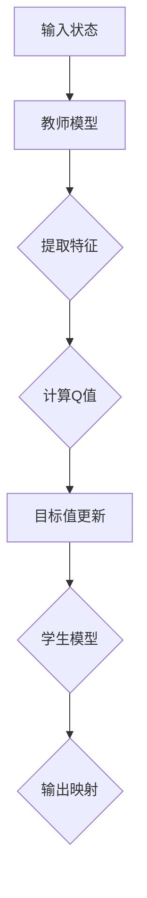

                 

# 一切皆是映射：深度强化学习中的知识蒸馏：DQN的案例实践

> **关键词：** 深度强化学习，知识蒸馏，DQN，映射，算法实践。

> **摘要：** 本文将深入探讨深度强化学习中的知识蒸馏技术，以DQN（Deep Q-Network）为例，分析其在实际应用中的操作步骤和实现细节。通过本文，读者将了解知识蒸馏在提升模型性能和泛化能力上的作用，并掌握其在深度强化学习中的具体应用。

## 1. 背景介绍

### 1.1 深度强化学习概述

深度强化学习（Deep Reinforcement Learning，DRL）是深度学习和强化学习的结合，它利用神经网络来学习策略，从而实现自主决策。强化学习通过奖励机制引导智能体学习，而深度学习的引入则使得智能体能够处理复杂的输入和输出。

### 1.2 DQN算法

DQN（Deep Q-Network）是由DeepMind在2015年提出的一种深度强化学习算法。它利用深度神经网络来估计Q值函数，Q值表示在某个状态下采取某个动作的预期回报。DQN通过经验回放和目标网络来克服样本偏差和缓解目标值函数不稳定的问题。

### 1.3 知识蒸馏的概念

知识蒸馏（Knowledge Distillation）是一种模型压缩技术，旨在将一个复杂的大型模型（教师模型）的知识传递给一个较小的模型（学生模型）。知识蒸馏的目的是减少模型的参数数量，降低计算复杂度，同时保持或提高模型的表现。

## 2. 核心概念与联系

### 2.1 DQN算法原理

DQN算法的核心是Q值函数，Q值函数是一个从状态到动作的映射，表示在某个状态下采取某个动作的预期回报。通过训练，DQN可以学习到最优策略。

### 2.2 知识蒸馏的映射

在知识蒸馏过程中，教师模型是复杂的大型模型，学生模型是经过压缩的小型模型。知识蒸馏通过以下映射来实现：

- **特征映射**：将教师模型中的特征提取器传递给学生模型，使得学生模型能够捕捉到教师模型所学习到的特征。
- **输出映射**：将教师模型的输出（例如，分类概率分布）传递给学生模型，使得学生模型能够学习到教师模型的决策过程。

### 2.3 Mermaid流程图



## 3. 核心算法原理 & 具体操作步骤

### 3.1 教师模型的训练

教师模型首先在一个大型数据集上进行预训练，以学习到丰富的知识和特征。

### 3.2 学生模型的初始化

学生模型初始化为一个小型的神经网络，其结构可以根据实际需求进行设计。

### 3.3 知识蒸馏的过程

1. **特征映射**：学生模型从教师模型中提取特征提取器，并将其集成到自己的模型中。
2. **输出映射**：学生模型学习教师模型的输出，例如分类概率分布，从而学习到教师模型的决策过程。
3. **目标函数**：学生模型的目标是使其输出的Q值尽可能接近教师模型的Q值。

### 3.4 模型的迭代训练

学生模型在迭代过程中不断更新其参数，以最小化目标函数的损失。通过迭代，学生模型逐渐接近教师模型的表现。

## 4. 数学模型和公式 & 详细讲解 & 举例说明

### 4.1 Q值函数

Q值函数是一个从状态到动作的映射，表示在某个状态下采取某个动作的预期回报。其数学公式为：

$$
Q(s, a) = \sum_{s'} P(s' | s, a) \cdot R(s', a) + \gamma \cdot \max_{a'} Q(s', a')
$$

其中，$s$表示状态，$a$表示动作，$s'$表示下一个状态，$R$表示回报，$\gamma$表示折扣因子。

### 4.2 知识蒸馏的目标函数

知识蒸馏的目标函数通常采用交叉熵损失函数，其数学公式为：

$$
L = -\sum_{i=1}^{N} \sum_{j=1}^{M} y_j \cdot \log(\hat{y}_j)
$$

其中，$N$表示样本数量，$M$表示类别数量，$y_j$表示教师模型在某个样本上的真实标签，$\hat{y}_j$表示学生模型在相同样本上的预测概率。

### 4.3 举例说明

假设我们有一个简单的游戏环境，其中有两个状态（$s_1$和$s_2$）和两个动作（$a_1$和$a_2$）。教师模型和学生在这些状态和动作上的Q值分别为：

$$
\begin{align*}
Q_{\text{teacher}}(s_1, a_1) &= 0.5 \\
Q_{\text{teacher}}(s_1, a_2) &= 0.3 \\
Q_{\text{teacher}}(s_2, a_1) &= 0.4 \\
Q_{\text{teacher}}(s_2, a_2) &= 0.6 \\
Q_{\text{student}}(s_1, a_1) &= 0.4 \\
Q_{\text{student}}(s_1, a_2) &= 0.2 \\
Q_{\text{student}}(s_2, a_1) &= 0.3 \\
Q_{\text{student}}(s_2, a_2) &= 0.5 \\
\end{align*}
$$

通过知识蒸馏，学生模型的Q值将逐渐接近教师模型的Q值。在训练过程中，学生模型将不断更新其参数，以最小化知识蒸馏的目标函数。

## 5. 项目实战：代码实际案例和详细解释说明

### 5.1 开发环境搭建

在开始之前，我们需要搭建一个合适的开发环境。以下是搭建环境的基本步骤：

1. 安装Python（版本3.6以上）
2. 安装TensorFlow和Keras
3. 安装OpenAI Gym，用于模拟环境

```bash
pip install tensorflow
pip install keras
pip install gym
```

### 5.2 源代码详细实现和代码解读

以下是一个简单的DQN和知识蒸馏的代码实现：

```python
import numpy as np
import random
import tensorflow as tf
from keras.models import Model
from keras.layers import Input, Dense, Flatten
from keras.optimizers import Adam
from gym import env

# DQN模型
class DQN:
    def __init__(self, state_size, action_size):
        self.state_size = state_size
        self.action_size = action_size
        self.memory = []
        self.gamma = 0.99
        self.epsilon = 1.0
        self.epsilon_min = 0.01
        self.epsilon_decay = 0.99
        self.learning_rate = 0.001

        self.model = self._build_model()
        self.target_model = self._build_model()
        self.target_model.set_weights(self.model.get_weights())

    def _build_model(self):
        state_input = Input(shape=(self.state_size,))
        flat = Flatten()(state_input)
        dense = Dense(24, activation='relu')(flat)
        actions = Dense(self.action_size, activation='linear')(dense)
        model = Model(inputs=state_input, outputs=actions)
        model.compile(loss='mse', optimizer=Adam(self.learning_rate))
        return model

    def remember(self, state, action, reward, next_state, done):
        self.memory.append((state, action, reward, next_state, done))

    def act(self, state):
        if np.random.rand() <= self.epsilon:
            return random.randrange(self.action_size)
        q_values = self.model.predict(state)
        return np.argmax(q_values[0])

    def replay(self, batch_size):
        minibatch = random.sample(self.memory, batch_size)
        for state, action, reward, next_state, done in minibatch:
            target = reward
            if not done:
                target = reward + self.gamma * np.amax(self.target_model.predict(next_state)[0])
            target_f = self.model.predict(state)
            target_f[0][action] = target
            self.model.fit(state, target_f, epochs=1, verbose=0)

    def load(self, name):
        self.model.load_weights(name)

    def save(self, name):
        self.model.save_weights(name)

# 环境设置
env = gym.make("CartPole-v0")
state_size = env.observation_space.shape[0]
action_size = env.action_space.n
dqn = DQN(state_size, action_size)

# 训练过程
for episode in range(1000):
    state = env.reset()
    state = np.reshape(state, [1, state_size])
    for time_steps in range(500):
        action = dqn.act(state)
        next_state, reward, done, _ = env.step(action)
        next_state = np.reshape(next_state, [1, state_size])
        dqn.remember(state, action, reward, next_state, done)
        state = next_state

        if done:
            print("Episode{} finished after {} time steps".format(episode + 1, time_steps + 1))
            break
        if dqn.epsilon > dqn.epsilon_min:
            dqn.epsilon *= dqn.epsilon_decay

env.close()
```

### 5.3 代码解读与分析

1. **模型定义**：DQN类定义了一个深度神经网络模型，用于估计Q值。模型使用了一个全连接层，并使用均方误差作为损失函数，使用Adam优化器进行训练。
2. **记忆存储**：DQN使用记忆存储来保存状态、动作、奖励、下一个状态和是否结束的信息，以供后续的回放和训练使用。
3. **动作选择**：DQN使用ε-贪婪策略进行动作选择。在ε的概率下，随机选择动作；在其他概率下，选择使Q值最大的动作。
4. **回放和训练**：DQN使用经验回放池来存储和重放过去的经验，以避免样本偏差。在每次回放过程中，DQN更新其模型参数，以最小化Q值的误差。
5. **训练过程**：在训练过程中，DQN使用ε-贪婪策略探索环境，同时逐渐减少ε的值，以在探索和利用之间取得平衡。

## 6. 实际应用场景

知识蒸馏在深度强化学习中的应用具有广泛的前景。以下是一些实际应用场景：

1. **游戏智能体**：在游戏领域中，知识蒸馏可以用于快速训练高效的智能体，从而在短时间内实现高性能的决策。
2. **无人驾驶**：在无人驾驶领域，知识蒸馏可以帮助将复杂的大型模型压缩为小型模型，从而提高计算效率和实时性。
3. **机器人控制**：在机器人控制领域，知识蒸馏可以用于将复杂的环境模型压缩为小型模型，从而实现高效的控制策略。
4. **强化学习应用**：在强化学习的各种应用场景中，知识蒸馏可以帮助提高模型的泛化能力，从而在新的任务上取得更好的性能。

## 7. 工具和资源推荐

### 7.1 学习资源推荐

1. **书籍**：
   - 《深度强化学习》（Deep Reinforcement Learning）
   - 《强化学习手册》（Reinforcement Learning: An Introduction）
2. **论文**：
   - “Prioritized Experience Replication” by Tommy Laursen, Frederic stumpf and Thomas Lampe
   - “Unifying Policy Gradient Methods” by Michael L. Littman
3. **博客**：
   - [深度强化学习博客](https://blog.deeplearning.ai/boosting-deep-reinforcement-learning-with-knowledge-distillation/)
   - [强化学习研究博客](https://rlai.group/)
4. **网站**：
   - [强化学习教程](https://spinningup.openai.com/en/latest/)
   - [TensorFlow官方文档](https://www.tensorflow.org/)

### 7.2 开发工具框架推荐

1. **TensorFlow**：用于构建和训练深度强化学习模型。
2. **Keras**：用于简化TensorFlow的使用。
3. **PyTorch**：另一个流行的深度学习框架，适用于构建和训练强化学习模型。
4. **Gym**：用于创建和测试强化学习环境的开源库。

### 7.3 相关论文著作推荐

1. **“DQN: Dueling Network Architectures for Deep Q-Learning” by Van Hasselt et al.**
2. **“Prioritized Experience Replication” by Tommy Laursen, Frederic stumpf and Thomas Lampe**
3. **“Unifying Policy Gradient Methods” by Michael L. Littman**

## 8. 总结：未来发展趋势与挑战

知识蒸馏作为一种有效的模型压缩技术，在深度强化学习中展现了巨大的潜力。然而，它也面临着一些挑战：

1. **模型选择**：如何选择合适的教师模型和学生模型是知识蒸馏成功的关键。
2. **训练效率**：知识蒸馏通常涉及大量的迭代训练，如何提高训练效率是一个重要的研究方向。
3. **泛化能力**：如何确保学生模型在新的任务上具有强大的泛化能力是一个重要挑战。
4. **安全性**：在安全关键领域，如何确保知识蒸馏过程不会泄露敏感信息也是一个重要问题。

未来，随着深度强化学习和知识蒸馏技术的不断发展，我们可以期待更多的创新和突破。

## 9. 附录：常见问题与解答

### 9.1 什么是知识蒸馏？

知识蒸馏是一种模型压缩技术，旨在将一个复杂的大型模型（教师模型）的知识传递给一个较小的模型（学生模型）。通过知识蒸馏，学生模型可以学习到教师模型的决策过程和特征提取能力。

### 9.2 DQN算法中的ε-贪婪策略是什么？

ε-贪婪策略是一种在探索和利用之间取得平衡的策略。在ε的概率下，智能体随机选择动作（探索）；在其他概率下，智能体选择使Q值最大的动作（利用）。ε的值随着训练的进行逐渐减小，以在探索和利用之间取得平衡。

### 9.3 知识蒸馏的目标函数是什么？

知识蒸馏的目标函数通常采用交叉熵损失函数。目标函数衡量的是学生模型的输出与学生模型的实际输出之间的差异，通过最小化目标函数，学生模型可以学习到教师模型的知识。

## 10. 扩展阅读 & 参考资料

1. 《深度强化学习》（Deep Reinforcement Learning） - Richard S. Sutton and Andrew G. Barto
2. 《强化学习手册》（Reinforcement Learning: An Introduction） - Richard S. Sutton and Andrew G. Barto
3. “Prioritized Experience Replication” by Tommy Laursen, Frederic stumpf and Thomas Lampe
4. “Unifying Policy Gradient Methods” by Michael L. Littman
5. [深度强化学习博客](https://blog.deeplearning.ai/boosting-deep-reinforcement-learning-with-knowledge-distillation/)
6. [强化学习研究博客](https://rlai.group/)
7. [强化学习教程](https://spinningup.openai.com/en/latest/)
8. [TensorFlow官方文档](https://www.tensorflow.org/)

