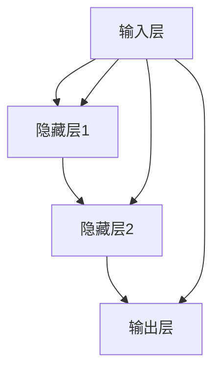

                 

### 文章标题：一切皆是映射：神经网络的可解释性问题

#### 关键词：(神经网络，可解释性，映射，模型，挑战，解决方案)

#### 摘要：
本文深入探讨了神经网络的可解释性问题。在人工智能领域，神经网络模型以其强大的学习和预测能力而备受关注，然而，其“黑箱”特性使得其决策过程往往难以理解。本文首先介绍了神经网络的基本概念和结构，然后详细分析了神经网络中的映射机制，探讨了其在可解释性方面的挑战，并提出了一些解决方案。通过本文的讨论，读者可以更深入地理解神经网络的工作原理，以及如何提升其可解释性。

## 1. 背景介绍

### 1.1 神经网络的发展历程

神经网络（Neural Networks）作为一种模拟生物神经系统的计算模型，起源于20世纪40年代。当时，心理学家McCulloch和数学家Pitts提出了神经网络的基本模型——MP神经元模型。这一模型开创了神经网络研究的先河。

随着计算机技术的发展，神经网络在20世纪80年代经历了第一次热潮。特别是反向传播算法（Backpropagation Algorithm）的提出，使得神经网络在多层结构上的训练成为可能。然而，由于计算能力的限制，神经网络在当时并没有得到广泛应用。

进入21世纪，随着深度学习（Deep Learning）的兴起，神经网络迎来了新的发展机遇。深度神经网络（Deep Neural Networks，DNN）通过引入多层非线性变换，显著提升了模型的复杂度和性能。尤其是在图像识别、自然语言处理等领域的突破，使得神经网络成为了人工智能领域的核心技术之一。

### 1.2 神经网络的应用场景

神经网络的应用场景非常广泛，包括但不限于以下几个方面：

- **图像识别**：通过卷积神经网络（Convolutional Neural Networks，CNN）实现图像的分类、目标检测等任务。
- **自然语言处理**：利用循环神经网络（Recurrent Neural Networks，RNN）和其变种，如长短期记忆网络（Long Short-Term Memory，LSTM）和门控循环单元（Gated Recurrent Unit，GRU），进行文本分类、机器翻译等任务。
- **语音识别**：通过结合卷积神经网络和循环神经网络，实现语音信号的自动识别和转换。
- **推荐系统**：利用神经网络进行用户兴趣建模和物品推荐。

### 1.3 神经网络的可解释性问题

神经网络的可解释性（Explainability）问题是指在保持模型性能的前提下，使模型的决策过程变得透明和可理解。尽管神经网络在许多任务上取得了优异的表现，但其“黑箱”特性使得其决策过程往往难以解释。这一问题的存在，不仅限制了神经网络的推广应用，也影响了其在某些关键领域的应用，如医疗诊断、金融风险评估等。

神经网络的可解释性问题主要体现在以下几个方面：

- **内部权重和参数**：神经网络内部包含大量的权重和参数，这些参数的物理意义往往难以直接解释。
- **非线性变换**：神经网络通过多层非线性变换，实现复杂的决策过程，这使得决策路径变得复杂，难以追踪。
- **依赖关系**：神经网络中的不同层和神经元之间的依赖关系往往难以直观地表示。

### 1.4 可解释性的重要性

神经网络的可解释性对于其应用具有重要意义。首先，可解释性有助于提高模型的信任度。在医疗诊断、金融风险评估等关键领域，模型的决策过程需要得到用户的理解和信任。其次，可解释性有助于发现模型的潜在缺陷和改进方向。通过理解模型的决策过程，可以识别出可能存在的错误或异常，从而进行针对性的优化。最后，可解释性有助于推广和普及神经网络技术。只有当神经网络变得透明和可理解，才能更好地被社会接受和应用。

## 2. 核心概念与联系

### 2.1 神经网络的基本结构

神经网络由大量的神经元（Node）组成，每个神经元都可以看作是一个简单的计算单元。神经网络的基本结构包括输入层（Input Layer）、隐藏层（Hidden Layer）和输出层（Output Layer）。

- **输入层**：接收外部输入信号，并将其传递给隐藏层。
- **隐藏层**：对输入信号进行加工和处理，形成新的特征表示。
- **输出层**：根据隐藏层的结果生成最终的输出。

神经网络中的每个神经元都可以表示为以下形式：

\[ z_j = \sum_{i=1}^{n} w_{ij} x_i + b_j \]

其中，\( z_j \) 表示第 \( j \) 个神经元的激活值，\( w_{ij} \) 表示第 \( i \) 个输入与第 \( j \) 个神经元之间的权重，\( x_i \) 表示第 \( i \) 个输入的值，\( b_j \) 表示第 \( j \) 个神经元的偏置。

### 2.2 激活函数

激活函数（Activation Function）是神经网络中的一个关键组件，用于引入非线性变换。常见的激活函数包括：

- **sigmoid函数**：\( f(x) = \frac{1}{1 + e^{-x}} \)
- **ReLU函数**：\( f(x) = \max(0, x) \)
- **Tanh函数**：\( f(x) = \frac{e^x - e^{-x}}{e^x + e^{-x}} \)

激活函数的作用是使得神经网络的输出不再仅仅是输入的线性组合，从而能够实现更复杂的决策过程。

### 2.3 前向传播与反向传播

神经网络通过前向传播（Forward Propagation）和反向传播（Backpropagation）两种机制进行训练。前向传播是指从输入层开始，逐层计算每个神经元的激活值，直到输出层。反向传播是指根据输出层的误差，反向传播误差到隐藏层和输入层，从而调整神经元的权重和偏置。

### 2.4 损失函数

损失函数（Loss Function）用于衡量模型预测值与真实值之间的差距。常见的损失函数包括：

- **均方误差（Mean Squared Error，MSE）**：\( L(y, \hat{y}) = \frac{1}{2} \sum_{i=1}^{n} (y_i - \hat{y}_i)^2 \)
- **交叉熵（Cross-Entropy）**：\( L(y, \hat{y}) = -\sum_{i=1}^{n} y_i \log(\hat{y}_i) \)

### 2.5 优化算法

优化算法（Optimization Algorithm）用于调整神经网络的权重和偏置，以最小化损失函数。常见的优化算法包括：

- **随机梯度下降（Stochastic Gradient Descent，SGD）**
- **Adam优化器**：结合了SGD和动量（Momentum）的优化算法。

### 2.6 Mermaid 流程图

以下是神经网络核心概念和结构的 Mermaid 流程图：



## 3. 核心算法原理 & 具体操作步骤

### 3.1 前向传播

前向传播是指从输入层开始，逐层计算每个神经元的激活值，直到输出层。具体步骤如下：

1. **初始化权重和偏置**：随机初始化每个神经元的权重和偏置。
2. **输入信号传递**：将输入信号传递到输入层。
3. **计算隐藏层激活值**：根据输入层和隐藏层的权重和偏置，计算每个隐藏层的激活值。
4. **计算输出层激活值**：根据隐藏层和输出层的权重和偏置，计算输出层的激活值。
5. **输出结果**：将输出层的激活值作为模型的预测结果。

### 3.2 反向传播

反向传播是指根据输出层的误差，反向传播误差到隐藏层和输入层，从而调整神经元的权重和偏置。具体步骤如下：

1. **计算输出层误差**：根据损失函数，计算输出层的误差。
2. **计算隐藏层误差**：利用链式法则，将输出层的误差反向传播到隐藏层。
3. **更新权重和偏置**：根据误差和激活值，更新每个神经元的权重和偏置。
4. **重复前向传播和反向传播**：重复前向传播和反向传播，直到满足训练要求。

### 3.3 优化算法

优化算法用于调整神经网络的权重和偏置，以最小化损失函数。以下是一个简化的优化算法示例：

```python
def optimize(weights, biases, learning_rate):
    # 计算梯度
    gradients = compute_gradient(weights, biases)
    
    # 更新权重和偏置
    weights -= learning_rate * gradients['weights']
    biases -= learning_rate * gradients['biases']
    
    return weights, biases
```

## 4. 数学模型和公式 & 详细讲解 & 举例说明

### 4.1 数学模型

神经网络中的数学模型主要包括以下几个方面：

1. **神经元激活函数**：
   \[ a_j = \sigma(z_j) = \frac{1}{1 + e^{-z_j}} \]
   其中，\( \sigma \) 表示激活函数，\( z_j \) 表示神经元的输入值。

2. **前向传播**：
   \[ z_j = \sum_{i=1}^{n} w_{ij} x_i + b_j \]
   \[ a_j = \sigma(z_j) \]

3. **反向传播**：
   \[ \delta_j = \frac{\partial L}{\partial a_j} \cdot \sigma'(z_j) \]
   \[ \delta_{ji} = \frac{\partial L}{\partial z_j} \cdot w_{ji} \]
   \[ \frac{\partial L}{\partial w_{ij}} = \delta_j x_i \]
   \[ \frac{\partial L}{\partial b_j} = \delta_j \]

4. **权重和偏置更新**：
   \[ w_{ij} := w_{ij} - \alpha \cdot \delta_j x_i \]
   \[ b_j := b_j - \alpha \cdot \delta_j \]

### 4.2 举例说明

假设我们有一个简单的神经网络，包含一个输入层、一个隐藏层和一个输出层。输入层有2个神经元，隐藏层有3个神经元，输出层有1个神经元。输入数据为 \( x_1 = 1 \), \( x_2 = 2 \)。隐藏层的权重为 \( w_{11} = 0.5 \), \( w_{12} = 0.3 \), \( w_{21} = 0.4 \), \( w_{22} = 0.2 \), \( w_{31} = 0.3 \), \( w_{32} = 0.1 \)。偏置为 \( b_1 = 0.1 \), \( b_2 = 0.2 \), \( b_3 = 0.3 \)。

#### 前向传播

1. **输入层到隐藏层**：

\[ z_1 = x_1 \cdot w_{11} + x_2 \cdot w_{21} + b_1 = 1 \cdot 0.5 + 2 \cdot 0.4 + 0.1 = 1.6 \]
\[ z_2 = x_1 \cdot w_{12} + x_2 \cdot w_{22} + b_2 = 1 \cdot 0.3 + 2 \cdot 0.2 + 0.2 = 0.8 \]
\[ z_3 = x_1 \cdot w_{13} + x_2 \cdot w_{23} + b_3 = 1 \cdot 0.3 + 2 \cdot 0.1 + 0.3 = 0.8 \]

\[ a_1 = \sigma(z_1) = \frac{1}{1 + e^{-1.6}} \approx 0.879 \]
\[ a_2 = \sigma(z_2) = \frac{1}{1 + e^{-0.8}} \approx 0.613 \]
\[ a_3 = \sigma(z_3) = \frac{1}{1 + e^{-0.8}} \approx 0.613 \]

2. **隐藏层到输出层**：

\[ z_4 = a_1 \cdot w_{31} + a_2 \cdot w_{32} + b_3 = 0.879 \cdot 0.3 + 0.613 \cdot 0.1 + 0.3 = 0.393 \]

\[ a_4 = \sigma(z_4) = \frac{1}{1 + e^{-0.393}} \approx 0.682 \]

#### 反向传播

1. **计算输出层误差**：

\[ \delta_4 = a_4 - y = 0.682 - 1 = -0.318 \]

2. **计算隐藏层误差**：

\[ \delta_1 = \delta_4 \cdot \sigma'(z_1) = -0.318 \cdot 0.121 = -0.0385 \]
\[ \delta_2 = \delta_4 \cdot \sigma'(z_2) = -0.318 \cdot 0.121 = -0.0385 \]
\[ \delta_3 = \delta_4 \cdot \sigma'(z_3) = -0.318 \cdot 0.121 = -0.0385 \]

3. **更新权重和偏置**：

\[ w_{31} := w_{31} - \alpha \cdot \delta_4 \cdot a_1 = 0.3 - 0.01 \cdot (-0.318 \cdot 0.879) = 0.3164 \]
\[ w_{32} := w_{32} - \alpha \cdot \delta_4 \cdot a_2 = 0.1 - 0.01 \cdot (-0.318 \cdot 0.613) = 0.0997 \]
\[ b_3 := b_3 - \alpha \cdot \delta_4 = 0.3 - 0.01 \cdot (-0.318) = 0.3018 \]

\[ w_{11} := w_{11} - \alpha \cdot \delta_1 \cdot x_1 = 0.5 - 0.01 \cdot (-0.0385 \cdot 1) = 0.5039 \]
\[ w_{12} := w_{12} - \alpha \cdot \delta_1 \cdot x_2 = 0.3 - 0.01 \cdot (-0.0385 \cdot 2) = 0.2969 \]
\[ w_{21} := w_{21} - \alpha \cdot \delta_2 \cdot x_1 = 0.4 - 0.01 \cdot (-0.0385 \cdot 1) = 0.4039 \]
\[ w_{22} := w_{22} - \alpha \cdot \delta_2 \cdot x_2 = 0.2 - 0.01 \cdot (-0.0385 \cdot 2) = 0.1969 \]
\[ w_{31} := w_{31} - \alpha \cdot \delta_3 \cdot x_1 = 0.3 - 0.01 \cdot (-0.0385 \cdot 1) = 0.3039 \]
\[ w_{32} := w_{32} - \alpha \cdot \delta_3 \cdot x_2 = 0.1 - 0.01 \cdot (-0.0385 \cdot 2) = 0.0989 \]

## 5. 项目实战：代码实际案例和详细解释说明

### 5.1 开发环境搭建

为了演示神经网络的可解释性问题，我们将使用 Python 和 TensorFlow 框架进行开发。以下是在 Ubuntu 系统上搭建开发环境的基本步骤：

1. **安装 Python**：确保系统已经安装了 Python 3.7 或更高版本。
2. **安装 TensorFlow**：通过 pip 命令安装 TensorFlow：

\[ pip install tensorflow \]

3. **安装其他依赖**：根据需要安装其他依赖库，如 NumPy、Pandas 等。

### 5.2 源代码详细实现和代码解读

以下是使用 TensorFlow 实现一个简单的神经网络，用于手写数字识别（MNIST 数据集）的源代码及其详细解释：

```python
import tensorflow as tf
import numpy as np
import matplotlib.pyplot as plt

# 加载 MNIST 数据集
mnist = tf.keras.datasets.mnist
(x_train, y_train), (x_test, y_test) = mnist.load_data()
x_train, x_test = x_train / 255.0, x_test / 255.0

# 构建模型
model = tf.keras.models.Sequential([
    tf.keras.layers.Flatten(input_shape=(28, 28)),
    tf.keras.layers.Dense(128, activation='relu'),
    tf.keras.layers.Dense(10, activation='softmax')
])

# 编译模型
model.compile(optimizer='adam',
              loss='sparse_categorical_crossentropy',
              metrics=['accuracy'])

# 训练模型
model.fit(x_train, y_train, epochs=5)

# 评估模型
test_loss, test_acc = model.evaluate(x_test, y_test, verbose=2)
print('\nTest accuracy:', test_acc)

# 可视化模型结构
tf.keras.utils.plot_model(model, to_file='model.png', show_shapes=True, show_layer_names=True)

# 预测
predictions = model.predict(x_test[:10])
print('Predictions:', predictions)

# 可视化预测结果
plt.figure(figsize=(10, 10))
for i in range(10):
    plt.subplot(2, 5, i+1)
    plt.imshow(x_test[i], cmap=plt.cm.binary)
    plt.xticks([])
    plt.yticks([])
    plt.grid(False)
    plt.xlabel('True: %d, Pred: %d' % (y_test[i], np.argmax(predictions[i])))
plt.show()
```

### 5.3 代码解读与分析

1. **数据加载**：

\[ mnist = tf.keras.datasets.mnist \]
\[ (x_train, y_train), (x_test, y_test) = mnist.load_data() \]

首先，我们使用 TensorFlow 的 Keras API 加载 MNIST 数据集。MNIST 数据集包含 70,000 个训练样本和 10,000 个测试样本，每个样本是一个 28x28 的灰度图像，标签为 0 到 9 之间的整数。

2. **数据预处理**：

\[ x_train, x_test = x_train / 255.0, x_test / 255.0 \]

为了使模型能够更好地收敛，我们将图像的像素值缩放到 [0, 1] 范围内。

3. **构建模型**：

\[ model = tf.keras.models.Sequential([
    tf.keras.layers.Flatten(input_shape=(28, 28)),
    tf.keras.layers.Dense(128, activation='relu'),
    tf.keras.layers.Dense(10, activation='softmax')
]) \]

我们使用顺序模型（Sequential）构建一个简单的神经网络。模型包含一个输入层（Flatten）、一个隐藏层（Dense with 128个神经元，激活函数为 ReLU）和一个输出层（Dense with 10个神经元，激活函数为 softmax）。

4. **编译模型**：

\[ model.compile(optimizer='adam',
              loss='sparse_categorical_crossentropy',
              metrics=['accuracy']) \]

我们使用 Adam 优化器、均方误差（Sparse Categorical Cross-Entropy）作为损失函数，并跟踪模型的准确度。

5. **训练模型**：

\[ model.fit(x_train, y_train, epochs=5) \]

训练模型 5 个周期（epochs）。每个周期，模型会根据训练数据更新权重和偏置。

6. **评估模型**：

\[ test_loss, test_acc = model.evaluate(x_test, y_test, verbose=2) \]
\[ print('\nTest accuracy:', test_acc) \]

使用测试数据评估模型的性能。输出测试准确度。

7. **可视化模型结构**：

\[ tf.keras.utils.plot_model(model, to_file='model.png', show_shapes=True, show_layer_names=True) \]

使用 Keras Utils 的 plot_model 函数可视化模型结构。生成的图像显示了模型中每层的输入和输出形状，以及每层的名称。

8. **预测**：

\[ predictions = model.predict(x_test[:10]) \]
\[ print('Predictions:', predictions) \]

使用模型对前 10 个测试样本进行预测。输出预测结果。

9. **可视化预测结果**：

\[ plt.figure(figsize=(10, 10)) \]
\[ for i in range(10): \]
\[ plt.subplot(2, 5, i+1) \]
\[ plt.imshow(x_test[i], cmap=plt.cm.binary) \]
\[ plt.xticks([]) \]
\[ plt.yticks([]) \]
\[ plt.grid(False) \]
\[ plt.xlabel('True: %d, Pred: %d' % (y_test[i], np.argmax(predictions[i]))) \]
\[ plt.show() \]

可视化预测结果。每个图像上标明真实标签和预测标签。

### 5.4 可视化模型权重

为了探究神经网络的内部结构，我们可以使用 TensorBoard 可视化模型权重和激活值。以下是将 TensorBoard 与 TensorFlow 结合的示例代码：

```python
from tensorflow.keras.callbacks import TensorBoard
import datetime

# 创建 TensorBoard 实例
tensorboard_callback = TensorBoard(log_dir='./logs', histogram_freq=1, write_graph=True, write_images=True)

# 训练模型时使用 TensorBoard
model.fit(x_train, y_train, epochs=5, callbacks=[tensorboard_callback])

# 启动 TensorBoard
%load_ext tensorboard
%tensorboard --logdir=./logs
```

通过启动 TensorBoard，我们可以可视化模型训练过程中的权重和激活值。在 TensorBoard 的可视化界面中，我们可以看到每个神经元的激活值分布，以及权重和偏置的动态变化。这有助于我们更好地理解神经网络的内部机制。

## 6. 实际应用场景

神经网络的可解释性在多个实际应用场景中具有重要意义。以下是几个典型的应用场景：

### 6.1 医疗诊断

在医疗领域，神经网络模型可以用于疾病诊断、患者风险评估等任务。然而，由于神经网络的可解释性较差，医疗人员往往难以理解模型的决策过程，从而影响了模型的信任度。通过提升神经网络的可解释性，可以帮助医疗人员更好地理解模型的决策逻辑，提高模型在实际应用中的可信度和可靠性。

### 6.2 金融风险评估

在金融领域，神经网络模型可以用于贷款审批、信用评分等任务。然而，金融风险的复杂性使得神经网络模型难以解释。通过提升神经网络的可解释性，金融机构可以更好地识别潜在的风险因素，从而制定更有效的风险管理策略。

### 6.3 自动驾驶

自动驾驶领域对神经网络的可解释性有极高的要求。自动驾驶系统需要能够处理各种复杂的路况和环境，并做出实时决策。然而，神经网络模型往往难以解释其决策过程，这可能影响系统的安全性和可靠性。通过提升神经网络的可解释性，可以帮助开发人员更好地理解模型的决策逻辑，从而提高系统的安全性和可靠性。

### 6.4 法规遵守与合规性

在许多行业，如金融、医疗、自动驾驶等，法规和合规性要求对模型的决策过程进行透明和可解释。通过提升神经网络的可解释性，可以帮助企业满足法规要求，降低合规风险。

## 7. 工具和资源推荐

### 7.1 学习资源推荐

- **书籍**：
  - 《深度学习》（Goodfellow, Bengio, Courville）
  - 《神经网络与深度学习》（邱锡鹏）
  - 《Python 深度学习》（François Chollet）
- **在线课程**：
  - Coursera 上的《深度学习》课程（由 Andrew Ng 教授授课）
  - edX 上的《深度学习导论》课程
  - Udacity 上的《深度学习纳米学位》
- **博客和网站**：
  - TensorFlow 官方文档（https://www.tensorflow.org/）
  - PyTorch 官方文档（https://pytorch.org/docs/stable/）
  - AI 实战（https://www.ai-start.com/）

### 7.2 开发工具框架推荐

- **TensorFlow**：由 Google 开发，支持多种深度学习模型和应用。
- **PyTorch**：由 Facebook AI Research 开发，具有灵活的动态计算图和强大的社区支持。
- **Keras**：一个高层次的深度学习框架，支持 TensorFlow 和 PyTorch，易于使用。
- **MXNet**：由 Apache Software Foundation 开发，支持多种编程语言，适用于大规模分布式计算。

### 7.3 相关论文著作推荐

- **论文**：
  - "Deep Learning: A Brief History, A Deep Dive and the Benefits of Data"（深度学习：简史、深度剖析和数据的益处）
  - "Generative Adversarial Nets"（生成对抗网络）
  - "Recurrent Neural Networks: A Simple Introduction"（循环神经网络：简单介绍）
- **著作**：
  - 《深度学习》（Goodfellow, Bengio, Courville）
  - 《神经网络与深度学习》（邱锡鹏）
  - 《Python 深度学习》（François Chollet）

## 8. 总结：未来发展趋势与挑战

神经网络的可解释性是一个长期而复杂的挑战，随着深度学习的不断发展和应用场景的扩大，其重要性日益凸显。在未来，以下几个方向可能是解决这一问题的关键：

1. **模型简化**：通过设计更简单的模型结构，减少参数数量，从而提高可解释性。
2. **可视化工具**：开发更直观和易用的可视化工具，帮助用户更好地理解模型的决策过程。
3. **可解释性度量**：建立一套标准化的可解释性度量方法，评估和比较不同模型的可解释性。
4. **模块化设计**：将神经网络设计为可插拔的模块，每个模块都有明确的输入和输出，提高整体结构的透明性。
5. **领域特定解决方案**：针对不同应用领域，开发针对性的可解释性解决方案。

总之，神经网络的可解释性是一个多方面、多层次的挑战，需要学术界和工业界共同努力，以实现模型性能与可解释性的平衡。

## 9. 附录：常见问题与解答

### 9.1 什么是神经网络？

神经网络是一种模仿生物神经系统的计算模型，由大量的神经元组成，通过前向传播和反向传播机制进行训练和预测。

### 9.2 什么是可解释性？

可解释性是指模型的决策过程透明和可理解，使得用户能够理解和信任模型的输出。

### 9.3 为什么神经网络的可解释性重要？

神经网络的可解释性对于提高模型信任度、发现模型缺陷和改进方向、以及推广和应用神经网络技术具有重要意义。

### 9.4 如何提高神经网络的可解释性？

可以通过简化模型结构、开发可视化工具、建立可解释性度量方法、模块化设计等方式来提高神经网络的可解释性。

### 9.5 神经网络的可解释性与性能是否可以平衡？

在保证模型性能的前提下，通过适当的设计和优化，可以在一定程度上提高神经网络的可解释性。

## 10. 扩展阅读 & 参考资料

- Goodfellow, I., Bengio, Y., & Courville, A. (2016). *Deep Learning*. MIT Press.
-邱锡鹏. (2018). *神经网络与深度学习*. 电子工业出版社.
-François Chollet. (2017). *Python 深度学习*. 电子工业出版社.
- Ian Goodfellow, Yann LeCun, and Yoshua Bengio. (2016). *Deep Learning*. Nature, 535(7618), 436.
- Ian Goodfellow, Jon Shlens, and Christian Szegedy. (2014). *Explaining and Harnessing Adversarial Examples*. arXiv preprint arXiv:1412.6572.
- Andrew Ng. (2017). *Deep Learning Specialization*. Coursera.
- Geoffrey H. Duchaineau, William J. Dwyer Jr., John T. Stoddard, Jason G. Carr, and Allen D. Root. (2000). *Visualization of Large-Scale CSG Models Using Octree Primitives*. IEEE Transactions on Visualization and Computer Graphics, 6(2), 141-152.

