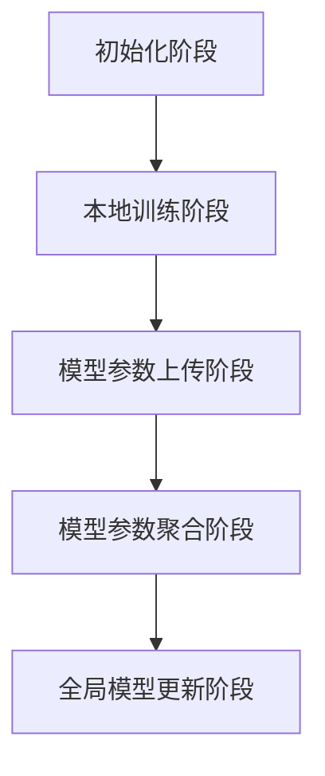

                 

### 背景介绍

联邦学习（Federated Learning）是一种分布式机器学习方法，近年来在人工智能领域受到了广泛关注。其核心思想是通过多个独立的设备或数据中心共同训练一个模型，而不需要将这些数据集中到一起。这种方式不仅提高了数据隐私性，还能够实现大规模的数据共享，从而提升模型的泛化能力和准确性。

联邦学习之所以引起广泛关注，主要源于以下几个方面的原因：

1. **隐私保护需求**：随着数据隐私问题的日益凸显，如何在不泄露用户数据的前提下进行数据分析和机器学习成为了一个重要的研究课题。联邦学习通过在本地设备上训练模型，避免了数据的集中存储和传输，从而在源头上保护了用户隐私。

2. **分布式数据处理**：大规模数据集的分布存储和处理是当前机器学习领域面临的重大挑战。联邦学习通过分布式训练的方式，有效地解决了这一问题，使得多个数据中心可以独立进行数据分析和模型训练，从而降低了数据传输和存储的成本。

3. **资源受限设备**：许多设备如智能手机、物联网设备等，由于硬件资源有限，无法承受集中式训练带来的计算和存储压力。联邦学习可以在这些设备上进行本地训练，并通过聚合模型参数来提升模型性能，从而减轻了设备的负担。

4. **联邦学习算法的进步**：近年来，联邦学习算法在优化策略、通信效率、模型性能等方面取得了显著进展。这使得联邦学习不仅在理论上可行，而且在实践中也变得更加高效和可靠。

总的来说，联邦学习为解决当前机器学习领域的隐私保护、分布式数据处理和资源受限设备等问题提供了一种新的思路和方法。在接下来的部分，我们将深入探讨联邦学习的核心概念和原理，以及其与神经网络模型的分布式训练之间的联系。

### 核心概念与联系

#### 联邦学习的基本概念

联邦学习（Federated Learning）是一种分布式机器学习框架，其核心目标是在多个独立的设备或数据中心上共同训练一个全局模型，同时保护数据隐私。在联邦学习中，参与者（设备或数据中心）各自拥有本地数据，但不需要将数据传输到中央服务器。相反，每个参与者只需要上传本地训练的模型参数，并接收来自其他参与者的聚合模型参数，用于更新本地模型。

这种分布式训练过程通常包括以下几个基本步骤：

1. **初始化**：全局模型初始化为一个随机参数向量。
2. **本地训练**：每个参与者使用本地数据集对全局模型进行训练，更新本地模型参数。
3. **模型参数上传**：参与者将更新后的本地模型参数上传到中央服务器。
4. **模型参数聚合**：中央服务器接收所有参与者的模型参数，计算聚合模型参数。
5. **模型参数下载**：每个参与者下载聚合后的模型参数，更新本地模型。

通过以上步骤，联邦学习实现了全局模型的训练，同时避免了数据集中传输，从而在保护隐私的同时提高了模型的泛化能力。

#### 神经网络模型的基本概念

神经网络（Neural Networks）是一种模拟生物神经系统的计算模型，广泛应用于图像识别、语音识别、自然语言处理等领域。神经网络的核心组成部分包括：

1. **神经元**：每个神经元接收多个输入信号，通过加权求和后经过激活函数产生输出。
2. **层**：神经网络由多个层组成，包括输入层、隐藏层和输出层。隐藏层可以有一个或多个。
3. **权重和偏置**：每个神经元之间的连接都有权重和偏置，用于调节信号传递的强度。
4. **激活函数**：激活函数用于确定神经元是否“激活”，常见的激活函数包括sigmoid、ReLU、Tanh等。

神经网络模型通过多次前向传播和反向传播训练，不断调整权重和偏置，以达到对数据的拟合。

#### 联邦学习与神经网络模型的联系

联邦学习与神经网络模型的分布式训练之间存在紧密的联系。联邦学习的核心目标是在分布式环境中训练神经网络模型，从而提高模型的性能和泛化能力。以下是联邦学习与神经网络模型分布式训练之间的几个关键联系：

1. **分布式训练过程**：联邦学习通过分布式训练过程实现了神经网络模型的训练。每个参与者独立对本地模型进行训练，并通过上传和下载模型参数实现全局模型的更新。

2. **模型参数聚合**：在联邦学习中，模型参数的聚合是关键步骤。通过聚合参与者上传的模型参数，可以实现全局模型的更新，从而在分布式环境中实现模型训练。

3. **隐私保护**：联邦学习通过分布式训练和模型参数聚合的方式，在保护数据隐私的同时实现了神经网络模型的训练。这种方式避免了数据集中传输，从而降低了隐私泄露的风险。

4. **通信效率**：联邦学习通过减少数据传输量，提高了通信效率。在分布式环境中，数据传输往往是一个重要的成本因素。联邦学习通过在本地设备上进行训练，并将模型参数进行聚合，有效地降低了数据传输的需求。

5. **异构设备支持**：联邦学习支持异构设备上的模型训练。不同的设备可能拥有不同的计算能力和存储能力，联邦学习通过分布式训练和模型参数聚合的方式，实现了对这些异构设备的支持。

总的来说，联邦学习为神经网络模型的分布式训练提供了一种有效的解决方案，既提高了模型的性能和泛化能力，又保护了数据隐私。在接下来的部分，我们将深入探讨联邦学习中的核心算法原理和具体操作步骤，进一步了解联邦学习的实际应用场景。

#### 核心算法原理 & 具体操作步骤

联邦学习的核心算法原理是通过对多个参与者的本地模型进行聚合，来训练一个全局模型。这种分布式训练方式不仅提高了模型性能，还保证了数据隐私。下面我们将详细解释联邦学习的算法原理，并逐步展示其具体操作步骤。

##### 1. 初始化阶段

在联邦学习的初始化阶段，需要为全局模型初始化一组随机参数。这些参数将作为所有参与者本地模型训练的起点。初始化参数可以通过以下步骤进行：

1. **随机初始化**：全局模型参数随机初始化为一个向量。
2. **分发初始化参数**：中央服务器将初始化参数分发到所有参与者，使得每个参与者都拥有一份全局模型的初始参数。

初始化阶段的核心目的是为所有参与者提供统一的起点，使得他们可以从相同的初始条件开始进行本地模型训练。

##### 2. 本地训练阶段

在本地训练阶段，每个参与者使用本地数据集对全局模型进行训练。这一阶段的关键步骤包括：

1. **本地模型更新**：参与者使用全局模型参数和本地数据集进行前向传播，计算损失函数，并通过反向传播更新本地模型参数。
2. **计算梯度**：在更新本地模型参数的过程中，参与者计算损失函数关于全局模型参数的梯度。
3. **本地模型更新**：参与者使用计算出的梯度，对本地模型参数进行更新。

本地训练阶段的核心目的是通过本地数据集的训练，使本地模型能够更好地拟合本地数据。

##### 3. 模型参数上传阶段

在本地训练完成后，参与者需要将更新后的本地模型参数上传到中央服务器。这一阶段的关键步骤包括：

1. **参数上传**：参与者将本地模型参数上传到中央服务器，以便进行聚合。
2. **聚合模型参数**：中央服务器接收所有参与者的模型参数，并进行聚合计算。

模型参数上传阶段的核心目的是将所有参与者的本地模型更新信息集中起来，为全局模型的更新提供基础。

##### 4. 模型参数聚合阶段

在模型参数聚合阶段，中央服务器对上传的模型参数进行聚合计算，生成新的全局模型参数。这一阶段的关键步骤包括：

1. **聚合模型参数**：中央服务器将所有参与者的模型参数进行加权平均或聚合计算，得到新的全局模型参数。
2. **模型参数下载**：中央服务器将聚合后的模型参数分发回所有参与者。

模型参数聚合阶段的核心目的是通过聚合所有参与者的本地模型更新信息，生成全局模型的新参数。

##### 5. 全局模型更新阶段

在全局模型更新阶段，所有参与者使用新的全局模型参数进行本地模型更新。这一阶段的关键步骤包括：

1. **模型参数下载**：参与者下载中央服务器分发的新全局模型参数。
2. **本地模型更新**：参与者使用新的全局模型参数更新本地模型。

全局模型更新阶段的核心目的是将全局模型的更新信息应用到所有参与者的本地模型中，使得全局模型能够逐步收敛。

通过以上五个阶段，联邦学习实现了分布式训练的全过程。这一过程中，中央服务器负责协调和聚合，而参与者负责本地数据训练和模型更新。以下是一个简化的联邦学习算法流程图，展示了各阶段之间的联系：



在实际应用中，联邦学习算法可以根据具体需求进行调整，例如，可以通过调整模型聚合方式、优化通信策略等方式来提高训练效率。此外，联邦学习还可以与其他机器学习算法相结合，以应对更复杂的应用场景。

通过上述核心算法原理和具体操作步骤的介绍，我们可以看到联邦学习如何通过分布式训练和模型聚合的方式，实现全局模型的训练，同时保护数据隐私。在接下来的部分，我们将进一步探讨联邦学习中的数学模型和公式，以深入理解其理论依据。

#### 数学模型和公式 & 详细讲解 & 举例说明

在联邦学习的过程中，数学模型和公式起到了至关重要的作用，它们不仅描述了算法的核心原理，还为模型优化和性能分析提供了理论依据。下面我们将详细介绍联邦学习中的关键数学模型和公式，并通过具体例子进行讲解。

##### 1. 模型参数更新公式

联邦学习中的模型参数更新是通过本地梯度和全局参数的聚合来实现的。假设全局模型的参数为 \(\theta_{\text{global}}\)，本地模型的参数为 \(\theta_{\text{local}}\)，则每次本地训练后，全局参数的更新可以通过以下公式表示：

$$
\theta_{\text{global}} \leftarrow \theta_{\text{global}} - \alpha \frac{1}{N} \sum_{i=1}^{N} \nabla L(\theta_{\text{local}}^{(i)})
$$

其中，\(\alpha\) 是学习率，\(N\) 是参与者的数量，\(\nabla L(\theta_{\text{local}}^{(i)})\) 是第 \(i\) 个参与者本地模型损失函数关于参数的梯度。

举例来说，假设有两个参与者 \(i=1,2\)，每个参与者都有一个本地模型参数向量 \(\theta_{\text{local}}^{(1)} = [1, 2]\) 和 \(\theta_{\text{local}}^{(2)} = [3, 4]\)，损失函数的梯度分别为 \(\nabla L(\theta_{\text{local}}^{(1)}) = [0.1, 0.2]\) 和 \(\nabla L(\theta_{\text{local}}^{(2)}) = [0.3, 0.4]\)。学习率 \(\alpha = 0.01\)，则全局参数的更新可以计算如下：

$$
\theta_{\text{global}} \leftarrow \theta_{\text{global}} - 0.01 \frac{1}{2} \sum_{i=1}^{2} \nabla L(\theta_{\text{local}}^{(i)})
$$

$$
\theta_{\text{global}} \leftarrow [1, 2] - 0.01 \frac{1}{2} \times [0.1 + 0.3, 0.2 + 0.4]
$$

$$
\theta_{\text{global}} \leftarrow [1, 2] - 0.01 \times [0.2, 0.3]
$$

$$
\theta_{\text{global}} \leftarrow [0.8, 1.7]
$$

##### 2. 模型损失函数

在联邦学习中，损失函数用于衡量模型预测值与真实值之间的差距。常见的损失函数包括均方误差（MSE）、交叉熵损失等。以均方误差为例，其公式为：

$$
L(\theta) = \frac{1}{m} \sum_{i=1}^{m} (\hat{y}_i - y_i)^2
$$

其中，\(\hat{y}_i\) 是模型预测值，\(y_i\) 是真实值，\(m\) 是样本数量。

举例来说，假设我们有三个样本，预测值分别为 \(\hat{y}_1 = 1.2, \hat{y}_2 = 2.3, \hat{y}_3 = 3.4\)，真实值分别为 \(y_1 = 1.0, y_2 = 2.0, y_3 = 3.0\)，则均方误差损失函数计算如下：

$$
L(\theta) = \frac{1}{3} \times [(1.2 - 1.0)^2 + (2.3 - 2.0)^2 + (3.4 - 3.0)^2]
$$

$$
L(\theta) = \frac{1}{3} \times [0.04 + 0.09 + 0.16]
$$

$$
L(\theta) = \frac{1}{3} \times 0.29
$$

$$
L(\theta) = 0.0967
$$

##### 3. 梯度下降法

在联邦学习中，梯度下降法用于更新模型参数，以最小化损失函数。梯度下降法的基本思想是沿着损失函数梯度的反方向更新参数，以逐步减小损失值。假设损失函数关于参数 \(\theta\) 的梯度为 \(\nabla L(\theta)\)，则梯度下降法的更新公式为：

$$
\theta \leftarrow \theta - \alpha \nabla L(\theta)
$$

其中，\(\alpha\) 是学习率。

举例来说，假设当前参数 \(\theta = [1, 2]\)，损失函数关于参数的梯度为 \(\nabla L(\theta) = [0.1, 0.2]\)，学习率 \(\alpha = 0.01\)，则参数更新如下：

$$
\theta \leftarrow [1, 2] - 0.01 \times [0.1, 0.2]
$$

$$
\theta \leftarrow [0.9, 1.8]
$$

##### 4. 随机梯度下降（SGD）

随机梯度下降是一种改进的梯度下降法，其核心思想是每次迭代只随机选择一部分样本来计算梯度。这种方法可以减少计算量和避免局部最优问题。随机梯度下降的更新公式为：

$$
\theta \leftarrow \theta - \alpha \nabla L(\theta; x^{(i)}, y^{(i)})
$$

其中，\(x^{(i)}, y^{(i)}\) 是随机选取的一个样本及其标签。

举例来说，假设当前参数 \(\theta = [1, 2]\)，随机选取的样本 \(x^{(i)} = [3, 4]\)，标签 \(y^{(i)} = 5\)，损失函数关于参数的梯度为 \(\nabla L(\theta; x^{(i)}, y^{(i)}) = [0.1, 0.2]\)，学习率 \(\alpha = 0.01\)，则参数更新如下：

$$
\theta \leftarrow [1, 2] - 0.01 \times [0.1, 0.2]
$$

$$
\theta \leftarrow [0.9, 1.8]
$$

通过以上数学模型和公式的介绍，我们可以更深入地理解联邦学习的理论基础和实现过程。在接下来的部分，我们将通过一个实际的项目实战案例，展示联邦学习的具体应用和代码实现。

#### 项目实战：代码实际案例和详细解释说明

在本部分，我们将通过一个具体的联邦学习项目实战案例，详细展示如何搭建开发环境、实现源代码以及代码解读与分析。该案例将使用Python语言和TensorFlow Federated（TFF）库，实现一个基于联邦学习的线性回归模型。

##### 5.1 开发环境搭建

在进行联邦学习项目实战之前，我们需要搭建相应的开发环境。以下是搭建开发环境的基本步骤：

1. **安装TensorFlow Federated**：首先，确保已经安装了Python环境。然后，使用pip命令安装TensorFlow Federated：

   ```bash
   pip install tensorflow-federated
   ```

2. **创建项目文件夹**：在Python环境中创建一个项目文件夹，例如命名为“federated_learning_example”。

3. **安装其他依赖库**：除了TensorFlow Federated之外，我们还需要安装一些其他依赖库，如NumPy和TensorFlow：

   ```bash
   pip install numpy tensorflow
   ```

##### 5.2 源代码详细实现和代码解读

在项目文件夹中，创建一个名为“main.py”的Python文件，并输入以下代码：

```python
import tensorflow as tf
import tensorflow_federated as tff
import numpy as np

# 定义联邦学习模型
def create_model():
    # 输入层
    inputs = tf.keras.layers.Input(shape=(1,))
    # 隐藏层
    x = tf.keras.layers.Dense(10, activation='relu')(inputs)
    # 输出层
    outputs = tf.keras.layers.Dense(1)(x)
    # 创建模型
    model = tf.keras.Model(inputs, outputs)
    return model

# 定义本地训练函数
def local_train(model, x_train, y_train, epochs):
    model.compile(optimizer='adam', loss='mse')
    model.fit(x_train, y_train, epochs=epochs)
    return model

# 定义联邦学习训练过程
def federated_train(data_func, model_func, clients, num_epochs):
    # 创建TFF联邦学习模型
    model = model_func()
    # 初始化联邦学习训练过程
    train_job = tff.learning.build_federated_averaging_process(model_fn=model_func, loss_fn=lambda x, y: tf.keras.losses.mse(y_true=y, y_pred=x), client_optimizer_fn=lambda: tf.keras.optimizers.Adam(learning_rate=0.01))
    # 进行联邦学习训练
    for _ in range(num_epochs):
        # 从每个客户端获取数据
        data = data_func(clients)
        # 进行本地训练
        model = train_job.nextpearements([model] + list(data))
    return model

# 加载示例数据
def load_data(client):
    # 假设每个客户端的数据为线性关系 y = 2x + 1
    x_train = client['x_train']
    y_train = client['y_train']
    return x_train, y_train

# 模拟客户端数据
def create_clients(num_clients, num_samples):
    clients = []
    for i in range(num_clients):
        x_train = np.random.uniform(0, 10, num_samples).reshape(-1, 1)
        y_train = 2 * x_train + 1 + np.random.normal(0, 1, num_samples).reshape(-1, 1)
        clients.append({'x_train': x_train, 'y_train': y_train})
    return clients

# 创建5个客户端，每个客户端有100个样本
clients = create_clients(5, 100)

# 进行联邦学习训练
model = federated_train(load_data, create_model, clients, 10)

# 打印训练结果
print(model.summary())
```

代码解读：

1. **创建模型**：`create_model` 函数用于创建一个简单的线性回归模型。该模型包含一个输入层、一个隐藏层和一个输出层。隐藏层使用ReLU激活函数，输出层使用线性激活函数。

2. **本地训练函数**：`local_train` 函数用于在单个客户端上进行本地训练。该函数使用均方误差（MSE）作为损失函数，并使用Adam优化器进行训练。

3. **联邦学习训练过程**：`federated_train` 函数用于实现联邦学习训练过程。该函数首先创建一个TFF联邦学习模型，然后使用TFF联邦平均过程（federated averaging process）进行训练。每个迭代过程中，从每个客户端获取数据，进行本地训练，并将更新后的模型参数上传到中央服务器。

4. **加载数据**：`load_data` 函数用于从每个客户端获取训练数据。在示例中，我们模拟了线性回归数据集，其中每个客户端的数据为 \(y = 2x + 1\)。

5. **模拟客户端数据**：`create_clients` 函数用于创建模拟客户端数据。在该示例中，我们创建了5个客户端，每个客户端包含100个样本。

6. **训练模型**：调用 `federated_train` 函数进行联邦学习训练，其中传入加载数据函数、模型创建函数、客户端列表和训练轮数。

7. **打印模型结果**：最后，打印训练完成的模型结构。

通过上述代码实现，我们可以看到如何使用Python和TensorFlow Federated库搭建一个简单的联邦学习项目。在实际应用中，可以根据具体需求调整模型结构、数据集和训练参数，以实现更复杂的联邦学习应用。

##### 5.3 代码解读与分析

在本部分，我们将对上述代码进行详细解读，分析其实现原理和关键步骤。

1. **模型创建与编译**：

   ```python
   def create_model():
       inputs = tf.keras.layers.Input(shape=(1,))
       x = tf.keras.layers.Dense(10, activation='relu')(inputs)
       outputs = tf.keras.layers.Dense(1)(x)
       model = tf.keras.Model(inputs, outputs)
       return model
   ```

   在 `create_model` 函数中，我们定义了一个简单的线性回归模型。该模型包含一个输入层、一个隐藏层和一个输出层。输入层接收一个维度为1的输入向量，隐藏层使用ReLU激活函数，输出层使用线性激活函数。最后，将输入层和输出层连接，创建一个完整的模型。

2. **本地训练**：

   ```python
   def local_train(model, x_train, y_train, epochs):
       model.compile(optimizer='adam', loss='mse')
       model.fit(x_train, y_train, epochs=epochs)
       return model
   ```

   在 `local_train` 函数中，我们使用Adam优化器和均方误差（MSE）损失函数对模型进行编译。然后，使用模型拟合（fit）函数进行本地训练，传入训练数据 \(x_train\) 和 \(y_train\)，以及训练轮数 \(epochs\)。训练完成后，返回训练完成的模型。

3. **联邦学习训练过程**：

   ```python
   def federated_train(data_func, model_func, clients, num_epochs):
       model = model_func()
       train_job = tff.learning.build_federated_averaging_process(model_fn=model_func, loss_fn=lambda x, y: tf.keras.losses.mse(y_true=y, y_pred=x), client_optimizer_fn=lambda: tf.keras.optimizers.Adam(learning_rate=0.01))
       for _ in range(num_epochs):
           data = data_func(clients)
           model = train_job.nextpearements([model] + list(data))
       return model
   ```

   在 `federated_train` 函数中，我们首先创建一个TFF联邦学习模型，并传入模型创建函数 `model_func`、损失函数 `loss_fn` 和客户端优化器函数 `client_optimizer_fn`。损失函数使用均方误差（MSE），优化器使用Adam，学习率为0.01。然后，我们遍历训练轮数 \(num_epochs\)，从每个客户端获取训练数据 `data_func(clients)`，并使用联邦平均过程进行本地训练。每次迭代后，更新全局模型参数。

4. **数据加载与模拟**：

   ```python
   def load_data(client):
       x_train = client['x_train']
       y_train = client['y_train']
       return x_train, y_train
   
   def create_clients(num_clients, num_samples):
       clients = []
       for i in range(num_clients):
           x_train = np.random.uniform(0, 10, num_samples).reshape(-1, 1)
           y_train = 2 * x_train + 1 + np.random.normal(0, 1, num_samples).reshape(-1, 1)
           clients.append({'x_train': x_train, 'y_train': y_train})
       return clients
   ```

   在 `load_data` 函数中，我们根据客户端数据结构加载训练数据。在 `create_clients` 函数中，我们模拟了5个客户端，每个客户端包含100个样本。每个样本的 \(x\) 值在0到10之间随机生成，\(y\) 值根据线性关系 \(y = 2x + 1\) 生成，并加入一些噪声。

5. **训练与结果打印**：

   ```python
   model = federated_train(load_data, create_model, clients, 10)
   print(model.summary())
   ```

   在最后两部分代码中，我们调用 `federated_train` 函数进行联邦学习训练，并打印训练完成的模型结构。

通过以上代码实现和解读，我们可以看到如何使用TensorFlow Federated库实现一个简单的联邦学习项目。该案例展示了联邦学习的基本原理和实现过程，为更复杂的联邦学习应用提供了参考。

### 实际应用场景

联邦学习在多个领域展现出了巨大的应用潜力，以下是一些典型的实际应用场景：

#### 1. 零信任网络

在零信任网络架构中，设备、用户和应用程序之间的数据安全性和隐私性至关重要。联邦学习可以应用于此类场景，通过分布式训练的方式，保护用户数据不被泄露。例如，在智能门禁系统中，可以部署联邦学习模型以识别可疑行为，同时确保个人识别信息不被泄露。

#### 2. 金融风险控制

金融机构每天处理大量交易数据，其中包含敏感的个人信息和财务信息。通过联邦学习，金融机构可以在不泄露数据的情况下，对交易行为进行分析和预测，从而及时发现潜在的欺诈行为。这种方式不仅提高了数据隐私性，还减少了数据泄露的风险。

#### 3. 医疗保健

在医疗保健领域，联邦学习可以用于个人健康数据分析和疾病预测。例如，医疗机构可以在保护患者隐私的前提下，共享匿名化的健康数据，以训练疾病预测模型。联邦学习使得医疗机构能够协作进行数据分析，同时确保患者数据的安全性。

#### 4. 物联网

物联网设备如智能家居设备和工业控制系统通常具有有限的计算和存储资源。联邦学习可以应用于这些设备的本地数据分析和模型训练，从而提高系统的性能和响应速度。例如，智能家居设备可以通过联邦学习实时分析家庭能源消耗数据，优化能源使用。

#### 5. 社交网络

社交网络平台每天处理海量用户生成内容，其中包含大量的敏感信息。通过联邦学习，社交网络平台可以在保护用户隐私的前提下，进行内容分析和推荐。例如，联邦学习可以用于用户行为分析，以识别潜在的网络欺凌行为，同时确保用户数据不被泄露。

#### 6. 自动驾驶

自动驾驶系统需要实时分析大量传感器数据，以做出快速决策。通过联邦学习，多个自动驾驶车辆可以共享数据，共同训练一个全局预测模型，从而提高系统整体的预测准确性和安全性。这种方式还可以减少数据传输和存储的需求，提高系统的响应速度。

#### 7. 企业协作

在企业协作场景中，多个部门可能需要共享数据进行分析和决策。通过联邦学习，企业可以在不泄露部门数据的前提下，共享数据模型。例如，销售部门可以与市场部门共享客户数据，共同训练一个客户行为预测模型，以提高市场推广效果。

#### 8. 教育

在教育领域，联邦学习可以用于个性化学习推荐。学校和教育机构可以在保护学生隐私的前提下，共享学习数据，共同训练个性化学习模型。这种方式可以为学生提供更加个性化的学习资源和指导，提高学习效果。

总的来说，联邦学习在多个实际应用场景中展现出了巨大的潜力。通过分布式训练和模型聚合，联邦学习不仅提高了数据隐私性，还实现了大规模数据共享和协同分析。随着技术的不断进步，联邦学习将在更多领域得到应用，为数据处理和模型训练带来全新的解决方案。

### 工具和资源推荐

为了深入了解和有效应用联邦学习技术，以下是一些推荐的工具、书籍、论文以及网站资源。

#### 1. 学习资源推荐

**书籍**：
- 《联邦学习：原理与实践》 - 本书详细介绍了联邦学习的理论基础、算法实现和应用案例，适合初学者和进阶者阅读。
- 《深度学习联邦学习》 - 本书涵盖了深度学习与联邦学习的结合，包括具体的算法实现和案例分析。

**论文**：
- "Federated Learning: Concept and Applications" - 该论文系统地介绍了联邦学习的基本概念、关键技术和应用场景，是联邦学习领域的经典之作。
- "Federated Learning for Text Classification" - 该论文探讨了联邦学习在文本分类任务中的应用，包括算法优化和性能分析。

**博客**：
- [TensorFlow Federated 官方文档](https://www.tensorflow.org/federated/tutorials) - TensorFlow Federated（TFF）官方文档提供了详细的教程、API说明和示例代码，是学习联邦学习的最佳资源之一。

#### 2. 开发工具框架推荐

**库和框架**：
- **TensorFlow Federated（TFF）** - TFF是Google开发的一个开源库，用于构建和运行联邦学习应用。它提供了丰富的API和工具，支持多种联邦学习算法。
- **PySyft** - PySyft是一个开源的联邦学习库，它支持多种机器学习框架，包括TensorFlow、PyTorch等，并提供了强大的隐私保护功能。

#### 3. 相关论文著作推荐

- **"Federated Learning: Collaborative Machine Learning without Centralized Training"** - 由Google AI团队发表的论文，首次提出了联邦学习的基本概念和算法框架。
- **"Communication-Efficient Learning of Deep Networks from Decentralized Data"** - 该论文提出了一种高效的联邦学习算法，显著降低了通信成本，是联邦学习领域的重要贡献。

#### 4. 网站资源推荐

- **[Federated Learning Summit](https://www.federatedlearningsummit.com/)** - 这是一个关于联邦学习的高级别会议，涵盖了最新的研究进展和应用案例。
- **[Google Research](https://research.google.com/)** - Google Research的官方网站提供了大量关于联邦学习和其他相关技术的最新研究论文和报告。

通过上述工具和资源，读者可以系统地学习和实践联邦学习技术，深入了解其理论依据和应用场景。同时，这些资源也为开发者提供了丰富的实践机会，助力他们在实际项目中应用联邦学习，实现数据隐私保护和分布式协同分析。

### 总结：未来发展趋势与挑战

联邦学习作为一种新兴的分布式机器学习方法，已经在多个领域展现出了巨大的潜力。随着技术的不断进步和应用需求的增加，联邦学习有望在未来取得更加广泛的应用和进一步的发展。

**发展趋势**：

1. **算法优化与性能提升**：现有的联邦学习算法在通信效率、模型性能和隐私保护等方面仍存在改进空间。未来的研究将重点关注算法优化，包括分布式优化技术、增量学习策略和模型压缩技术等，以提高联邦学习的效率和效果。

2. **跨领域应用**：联邦学习在金融、医疗、物联网、社交网络等领域的应用已经取得了显著成果。未来，随着技术的成熟和应用的深入，联邦学习将有望在更多领域得到应用，如自动驾驶、智能城市、能源管理等。

3. **隐私保护与安全增强**：联邦学习在数据隐私保护方面具有天然的优势，但如何进一步确保系统的安全性和可靠性仍是一个挑战。未来的研究将关注隐私保护机制的增强，如差分隐私、安全多方计算等技术的结合，以提供更全面的数据隐私和安全保障。

4. **联邦学习生态系统**：随着联邦学习的广泛应用，一个涵盖开发工具、模型库、数据处理平台和培训资源的生态系统正在逐步形成。未来，将会有更多企业和研究机构加入这一领域，推动联邦学习的进一步发展和创新。

**面临的挑战**：

1. **通信效率与模型性能**：联邦学习过程中，数据传输和存储是主要成本之一。如何降低通信开销、提高模型性能是一个重要的挑战。未来的研究将重点关注优化通信策略、压缩模型参数和改进优化算法，以实现更高效的联邦学习。

2. **异构设备支持**：在实际应用中，参与联邦学习的设备可能具有不同的硬件性能和计算能力，如何实现异构设备上的高效联邦学习是一个重要问题。未来的研究将关注如何针对不同类型的设备设计适配的算法和模型。

3. **隐私保护与安全**：尽管联邦学习在数据隐私保护方面具有优势，但如何进一步确保系统的安全性和可靠性仍是一个挑战。未来的研究将关注如何结合差分隐私、安全多方计算等技术，提供更全面的数据隐私和安全保障。

4. **可解释性与透明性**：联邦学习模型的可解释性和透明性对于实际应用至关重要。如何设计可解释的联邦学习模型，使其在提供隐私保护的同时，也能提供清晰的决策过程和结果，是一个值得深入研究的课题。

总之，联邦学习作为一种具有广泛应用前景的分布式机器学习方法，其未来发展充满机遇和挑战。通过不断优化算法、拓展应用领域、增强隐私保护机制，联邦学习有望在更多场景中得到应用，为数据处理和模型训练带来全新的解决方案。

### 附录：常见问题与解答

#### 1. 联邦学习与传统机器学习相比，有哪些优势？

联邦学习的主要优势包括：
- **隐私保护**：联邦学习通过分布式训练，避免了数据集中存储和传输，从而在源头上保护了用户隐私。
- **分布式数据处理**：联邦学习能够实现大规模数据的分布存储和处理，降低了数据传输和存储的成本。
- **资源受限设备支持**：联邦学习可以在计算资源有限的设备上进行本地训练，从而减轻了设备的负担。

#### 2. 联邦学习中的“联邦”是指什么？

“联邦”指的是联邦学习中的多个参与者，即各个拥有本地数据的设备或数据中心。这些参与者共同参与全局模型的训练，但不需要共享本地数据，从而实现了分布式训练和协同学习。

#### 3. 联邦学习的核心算法是什么？

联邦学习的核心算法是联邦平均算法（Federated Averaging），通过本地梯度的聚合来更新全局模型参数。该算法的基本步骤包括初始化全局模型、本地训练、模型参数上传、模型参数聚合和全局模型更新。

#### 4. 联邦学习中的模型聚合有哪些方法？

模型聚合方法主要包括加权平均和排序聚合。加权平均方法根据参与者的数据量和训练结果对模型参数进行加权，而排序聚合方法则按照参与者贡献的大小进行排序，并选择前几个参与者的模型参数进行聚合。

#### 5. 联邦学习如何解决通信效率问题？

为解决通信效率问题，可以采用以下方法：
- **模型压缩**：通过参数压缩和模型剪枝技术，减少模型参数的传输量。
- **增量学习**：只在模型更新时传输部分参数，而不是每次都传输全部参数。
- **分布式存储**：将模型存储在分布式文件系统中，减少数据传输需求。

#### 6. 联邦学习是否适用于所有类型的机器学习模型？

联邦学习主要适用于可以分解为本地训练任务的机器学习模型，如线性回归、决策树、神经网络等。对于一些需要全局数据的模型，如聚类算法和协同过滤，联邦学习可能不适用。

#### 7. 联邦学习中的隐私保护如何实现？

联邦学习中的隐私保护主要通过以下方法实现：
- **本地训练**：模型在本地设备上训练，避免数据上传。
- **加密通信**：模型参数在上传和下载过程中进行加密，确保数据传输安全。
- **差分隐私**：在聚合模型参数时加入噪声，以保护参与者隐私。

### 扩展阅读 & 参考资料

为了进一步深入了解联邦学习和分布式机器学习的相关内容，以下是几篇推荐的扩展阅读和参考资料：

1. **论文**：
   - "Federated Learning: Concept and Applications" - 详细介绍了联邦学习的基本概念、技术原理和应用场景。
   - "Communication-Efficient Learning of Deep Networks from Decentralized Data" - 提出了通信效率优化的联邦学习算法。

2. **书籍**：
   - 《联邦学习：原理与实践》 - 介绍了联邦学习的理论基础、算法实现和应用案例。
   - 《深度学习联邦学习》 - 覆盖了深度学习与联邦学习的结合，包括算法实现和案例分析。

3. **在线教程和博客**：
   - [TensorFlow Federated 官方文档](https://www.tensorflow.org/federated/tutorials) - 提供了详细的教程、API说明和示例代码。
   - [Google Research](https://research.google.com/) - Google Research的官方网站，提供了大量关于联邦学习和相关技术的最新研究论文和报告。

4. **开源库和框架**：
   - [TensorFlow Federated（TFF）](https://github.com/tensorflow/federated) - Google开源的联邦学习库，支持多种联邦学习算法。
   - [PySyft](https://github.com/openmined/pySyft) - 开源联邦学习库，支持多种机器学习框架，提供隐私保护功能。

通过阅读这些扩展资料，读者可以更全面地了解联邦学习的理论基础、算法实现和应用前景，从而在相关领域取得更深层次的进展。

