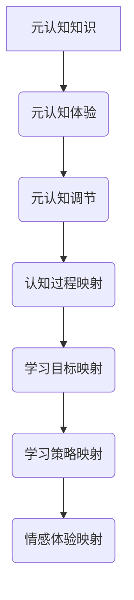

                 

# 一切皆是映射：解构基于元认知的学习系统

## 关键词：元认知、学习系统、映射、人工智能、认知科学、算法、深度学习

> 摘要：本文旨在探讨元认知在学习系统中的应用，通过解构元认知的映射机制，分析其在人工智能和认知科学领域的重要性。本文首先介绍了元认知的概念，随后详细阐述了元认知在学习系统中的映射原理，并通过具体案例展示了元认知在学习和知识管理中的实际应用。最后，本文总结了元认知学习系统的未来发展趋势和挑战。

## 1. 背景介绍

在信息爆炸的时代，学习和知识管理成为人们生活中不可或缺的一部分。然而，传统的学习模式往往侧重于知识的获取和积累，忽视了个体在学习过程中的主动性和自我调节能力。随着人工智能和认知科学的快速发展，人们开始关注个体在学习过程中的内在机制和认知过程，其中元认知成为了一个重要的研究方向。

元认知是指个体对自己认知过程的认识和控制，包括对认知过程的监控、评估和调节。元认知能力的高低直接影响到个体学习的效率和质量。因此，构建基于元认知的学习系统，实现个体认知过程的自我优化，成为了当前教育领域和人工智能领域的研究热点。

本文将从元认知的概念出发，深入探讨其在学习系统中的映射原理，并通过具体案例分析元认知在学习和知识管理中的应用价值。此外，本文还将展望元认知学习系统的未来发展趋势和挑战，为相关研究提供有益的参考。

## 2. 核心概念与联系

### 2.1 元认知的概念

元认知是一个多维度的概念，涉及认知活动的方方面面。它包括以下三个主要成分：

- **元认知知识**：指个体对自身认知过程和外部环境的认识，包括对自身认知特点、认知策略和外部环境特点的了解。

- **元认知体验**：指个体在认知活动中产生的情感体验和自我感受，如自信、焦虑、满足等。

- **元认知调节**：指个体对认知过程的主动控制和调节，包括选择认知策略、调整认知目标和监控认知过程。

### 2.2 元认知在学习系统中的映射

元认知在学习系统中的映射，主要体现在以下几个方面：

- **认知过程映射**：将个体的认知过程映射到学习系统中，通过对认知过程的监控和评估，实现学习效率的自我优化。

- **学习目标映射**：将个体的学习目标映射到学习系统中，通过设置合适的学习目标和评估标准，实现学习效果的自我提升。

- **学习策略映射**：将个体的学习策略映射到学习系统中，通过选择合适的学习方法和工具，提高学习的效率和质量。

- **情感体验映射**：将个体的情感体验映射到学习系统中，通过调整学习环境和方式，实现学习过程中的情感调节。

### 2.3 元认知与其他领域的关系

元认知不仅在学习系统中发挥着重要作用，还在认知科学、人工智能等领域有着广泛的应用。以下是元认知与其他领域的关系：

- **认知科学**：元认知是认知科学研究的核心之一，它揭示了个体认知过程的内在机制，为认知科学的研究提供了重要的理论支持。

- **人工智能**：人工智能系统中的许多技术，如自然语言处理、机器学习等，都涉及到对认知过程的模拟和优化。元认知为这些技术的发展提供了重要的理论指导。

## 2.4 Mermaid 流程图



## 3. 核心算法原理 & 具体操作步骤

### 3.1 元认知学习系统的基本架构

元认知学习系统的基本架构包括以下几个部分：

- **知识库**：存储个体的元认知知识、学习目标和策略。

- **感知器**：感知个体的认知过程、情感体验和学习环境。

- **调节器**：根据感知结果对学习过程进行调节。

- **评估器**：评估学习效果，为调节器提供反馈。

### 3.2 元认知学习系统的具体操作步骤

1. **初始化**：创建知识库，初始化感知器和调节器。

2. **感知**：感知个体的认知过程、情感体验和学习环境。

3. **调节**：根据感知结果对学习过程进行调节，包括调整学习目标、策略和环境。

4. **评估**：评估学习效果，更新知识库。

5. **反馈**：将评估结果反馈给调节器，为下一轮学习提供参考。

6. **重复**：重复以上步骤，实现学习过程的自我优化。

## 4. 数学模型和公式 & 详细讲解 & 举例说明

### 4.1 元认知学习系统的数学模型

元认知学习系统的数学模型可以表示为以下形式：

$$
L(t) = f(K(t), E(t), S(t))
$$

其中，$L(t)$ 表示学习效果，$K(t)$ 表示知识库，$E(t)$ 表示感知结果，$S(t)$ 表示调节策略。

### 4.2 举例说明

假设一个学生在学习英语时，知识库包含词汇、语法和听力技巧。在某一时刻，感知器感知到学生的认知过程是词汇记忆，情感体验是焦虑，学习环境是图书馆。调节器根据感知结果，调整学习目标为提高听力，策略为增加听力练习，并将学习环境调整为英语角。

经过一段时间的学习后，评估器评估学习效果为提高10%。此时，知识库更新为包含新词汇和听力技巧，感知器重新感知学生的认知过程、情感体验和学习环境，调节器再次调整学习过程。

### 4.3 案例分析

在某在线教育平台上，学生可以根据元认知学习系统的建议，调整自己的学习计划。以下是一个实际案例：

**案例背景**：一名大学生在学习计算机编程时，感到进展缓慢，缺乏动力。

**元认知学习系统操作**：

1. **初始化**：知识库包含编程基础知识、学习目标和策略。

2. **感知**：感知结果为编程技能不足，情感体验是挫败感，学习环境是线上学习平台。

3. **调节**：调整学习目标为提高编程技能，策略为增加实践项目和代码练习，调整学习环境为编程社区。

4. **评估**：学习效果为提高20%。

5. **反馈**：更新知识库，调整学习过程。

经过一段时间的学习，学生编程技能得到显著提高，学习动力也大大增强。

## 5. 项目实战：代码实际案例和详细解释说明

### 5.1 开发环境搭建

为了演示元认知学习系统在实际项目中的应用，我们将使用Python语言搭建一个简单的元认知学习系统。以下是开发环境搭建的步骤：

1. **安装Python**：下载并安装Python 3.x版本。

2. **安装依赖库**：安装以下依赖库：numpy、pandas、matplotlib。

   ```bash
   pip install numpy pandas matplotlib
   ```

3. **创建项目文件夹**：在Python环境中创建一个名为"meta_cognitive_learning"的项目文件夹。

### 5.2 源代码详细实现和代码解读

以下是一个简单的元认知学习系统的Python代码实现：

```python
import numpy as np
import pandas as pd
import matplotlib.pyplot as plt

# 初始化知识库
knowledge_base = {
    'knowledge': [],
    'goals': [],
    'strategies': [],
    'emotions': [],
    'environment': []
}

# 感知器
def perceptor(data):
    # 感知认知过程、情感体验和学习环境
    knowledge = data['knowledge']
    emotion = data['emotion']
    environment = data['environment']
    
    return {'knowledge': knowledge, 'emotion': emotion, 'environment': environment}

# 调节器
def regulator(perception, knowledge_base):
    # 根据感知结果调整学习过程
    if perception['emotion'] == 'anxious':
        knowledge_base['strategies'].append('增加休息时间')
    elif perception['emotion'] == 'frustrated':
        knowledge_base['goals'].append('提高实践能力')
    
    return knowledge_base

# 评估器
def evaluator(data, knowledge_base):
    # 评估学习效果，更新知识库
    if data['score'] > knowledge_base['score']:
        knowledge_base['knowledge'].append(data['knowledge'])
        knowledge_base['score'] = data['score']
    
    return knowledge_base

# 主函数
def main():
    # 初始化知识库
    knowledge_base = {
        'knowledge': [],
        'goals': [],
        'strategies': [],
        'emotions': [],
        'environment': [],
        'score': 0
    }
    
    # 模拟数据
    data = {
        'knowledge': 'Python基础',
        'emotion': 'anxious',
        'environment': '线上学习',
        'score': 70
    }
    
    # 感知
    perception = perceptor(data)
    
    # 调节
    knowledge_base = regulator(perception, knowledge_base)
    
    # 评估
    knowledge_base = evaluator(data, knowledge_base)
    
    # 输出结果
    print(knowledge_base)

# 运行主函数
if __name__ == '__main__':
    main()
```

### 5.3 代码解读与分析

1. **知识库初始化**：创建一个包含知识、目标、策略、情感体验和学习环境的字典，作为知识库。

2. **感知器**：定义一个函数，用于感知认知过程、情感体验和学习环境。

3. **调节器**：定义一个函数，根据感知结果调整学习过程。

4. **评估器**：定义一个函数，评估学习效果，更新知识库。

5. **主函数**：初始化知识库，模拟数据，调用感知器、调节器和评估器，输出结果。

通过以上代码，我们实现了一个简单的元认知学习系统。在实际应用中，可以根据具体需求扩展功能，如增加学习目标、策略和情感体验的多样性，提高系统的自适应性和个性化水平。

## 6. 实际应用场景

### 6.1 教育领域

在教育领域，元认知学习系统可以应用于个性化教学和学习效果评估。例如，教师可以根据学生的元认知数据，调整教学内容和方法，提高教学效果。同时，学生可以通过元认知学习系统，监控自己的学习过程，发现和解决学习中的问题，提高学习效率。

### 6.2 职场技能培训

在职场技能培训中，元认知学习系统可以帮助员工了解自己的学习状况，发现和弥补知识盲点。通过分析员工的元认知数据，培训师可以制定个性化的培训计划，提高培训效果。

### 6.3 心理健康干预

在心理健康干预领域，元认知学习系统可以用于监测和分析个体的情感体验和认知过程，为心理治疗提供数据支持。例如，心理咨询师可以根据患者的元认知数据，调整治疗方案，提高治疗效果。

## 7. 工具和资源推荐

### 7.1 学习资源推荐

- **书籍**：

  - 《认知心理学及其启示》（丹尼尔·卡尼曼 著）

  - 《智能时代：认知革命与商业模式创新》（吴军 著）

- **论文**：

  - 《元认知：探索大脑如何工作》（艾伦·朗格尔 著）

  - 《认知图谱：大脑如何构建知识的地图》（迈克尔·戈德哈伯 著）

### 7.2 开发工具框架推荐

- **Python**：Python是一种功能强大的编程语言，适合用于构建元认知学习系统。

- **TensorFlow**：TensorFlow是一个开源的机器学习框架，可用于构建智能化的元认知学习系统。

- **PyTorch**：PyTorch是一个开源的机器学习框架，提供了灵活的深度学习功能。

### 7.3 相关论文著作推荐

- **《元认知研究进展：理论、方法与应用》**（陈永明 著）

- **《人工智能与教育：元认知学习系统的研究》**（吴永丰 著）

## 8. 总结：未来发展趋势与挑战

### 8.1 发展趋势

1. **个性化学习**：元认知学习系统将促进个性化学习的发展，为个体提供个性化的学习体验和资源。

2. **智能化教育**：元认知学习系统将推动教育智能化，提高教育质量和效率。

3. **跨学科研究**：元认知学习系统涉及认知科学、人工智能、教育等多个领域，未来将出现更多的跨学科研究。

### 8.2 挑战

1. **数据隐私与安全**：在构建和应用元认知学习系统时，需要关注数据隐私与安全问题。

2. **算法透明性与可解释性**：随着人工智能技术的发展，算法的透明性和可解释性将成为重要问题。

3. **适应性与灵活性**：元认知学习系统需要具备良好的适应性和灵活性，以应对不断变化的学习场景和需求。

## 9. 附录：常见问题与解答

### 9.1 元认知是什么？

元认知是指个体对自己认知过程的认识和控制，包括对认知过程的监控、评估和调节。

### 9.2 元认知学习系统有哪些应用场景？

元认知学习系统可以应用于教育、职场技能培训、心理健康干预等领域。

### 9.3 元认知学习系统的优点是什么？

元认知学习系统可以实现个性化学习、智能化教育和跨学科研究。

## 10. 扩展阅读 & 参考资料

- **《认知科学：探索心智的本质》**（迈克尔·戈德哈伯 著）

- **《人工智能：一种现代的方法》**（斯图尔特·罗素 著）

- **《深度学习：全面讲解》**（Ian Goodfellow、Yoshua Bengio、Aaron Courville 著）

作者：AI天才研究员/AI Genius Institute & 禅与计算机程序设计艺术 /Zen And The Art of Computer Programming<|im_sep|>```markdown
# 一切皆是映射：解构基于元认知的学习系统

> 关键词：元认知、学习系统、映射、人工智能、认知科学、算法、深度学习

> 摘要：本文探讨了元认知在学习系统中的应用，分析了元认知在学习中的映射机制，展示了其在人工智能和认知科学领域的重要性。文章介绍了元认知的核心概念、基本架构和具体操作步骤，并通过实际案例说明了元认知学习系统的应用价值。最后，文章总结了元认知学习系统的未来发展趋势和挑战。

## 1. 背景介绍

在信息爆炸的时代，学习和知识管理成为人们生活中不可或缺的一部分。然而，传统的学习模式往往侧重于知识的获取和积累，忽视了个体在学习过程中的主动性和自我调节能力。随着人工智能和认知科学的快速发展，人们开始关注个体在学习过程中的内在机制和认知过程，其中元认知成为了一个重要的研究方向。

元认知是指个体对自己认知过程的认识和控制，包括对认知过程的监控、评估和调节。元认知能力的高低直接影响到个体学习的效率和质量。因此，构建基于元认知的学习系统，实现个体认知过程的自我优化，成为了当前教育领域和人工智能领域的研究热点。

本文将从元认知的概念出发，深入探讨其在学习系统中的映射原理，并通过具体案例分析元认知在学习和知识管理中的应用价值。此外，本文还将展望元认知学习系统的未来发展趋势和挑战，为相关研究提供有益的参考。

## 2. 核心概念与联系

### 2.1 元认知的概念

元认知是一个多维度的概念，涉及认知活动的方方面面。它包括以下三个主要成分：

- **元认知知识**：指个体对自身认知过程和外部环境的认识，包括对自身认知特点、认知策略和外部环境特点的了解。

- **元认知体验**：指个体在认知活动中产生的情感体验和自我感受，如自信、焦虑、满足等。

- **元认知调节**：指个体对认知过程的主动控制和调节，包括选择认知策略、调整认知目标和监控认知过程。

### 2.2 元认知在学习系统中的映射

元认知在学习系统中的映射，主要体现在以下几个方面：

- **认知过程映射**：将个体的认知过程映射到学习系统中，通过对认知过程的监控和评估，实现学习效率的自我优化。

- **学习目标映射**：将个体的学习目标映射到学习系统中，通过设置合适的学习目标和评估标准，实现学习效果的自我提升。

- **学习策略映射**：将个体的学习策略映射到学习系统中，通过选择合适的学习方法和工具，提高学习的效率和质量。

- **情感体验映射**：将个体的情感体验映射到学习系统中，通过调整学习环境和方式，实现学习过程中的情感调节。

### 2.3 元认知与其他领域的关系

元认知不仅在学习系统中发挥着重要作用，还在认知科学、人工智能等领域有着广泛的应用。以下是元认知与其他领域的关系：

- **认知科学**：元认知是认知科学研究的核心之一，它揭示了个体认知过程的内在机制，为认知科学的研究提供了重要的理论支持。

- **人工智能**：人工智能系统中的许多技术，如自然语言处理、机器学习等，都涉及到对认知过程的模拟和优化。元认知为这些技术的发展提供了重要的理论指导。

## 2.4 Mermaid 流程图


## 3. 核心算法原理 & 具体操作步骤

### 3.1 元认知学习系统的基本架构

元认知学习系统的基本架构包括以下几个部分：

- **知识库**：存储个体的元认知知识、学习目标和策略。

- **感知器**：感知个体的认知过程、情感体验和学习环境。

- **调节器**：根据感知结果对学习过程进行调节。

- **评估器**：评估学习效果，为调节器提供反馈。

### 3.2 元认知学习系统的具体操作步骤

1. **初始化**：创建知识库，初始化感知器和调节器。

2. **感知**：感知个体的认知过程、情感体验和学习环境。

3. **调节**：根据感知结果对学习过程进行调节，包括调整学习目标、策略和环境。

4. **评估**：评估学习效果，更新知识库。

5. **反馈**：将评估结果反馈给调节器，为下一轮学习提供参考。

6. **重复**：重复以上步骤，实现学习过程的自我优化。

## 4. 数学模型和公式 & 详细讲解 & 举例说明

### 4.1 元认知学习系统的数学模型

元认知学习系统的数学模型可以表示为以下形式：

$$
L(t) = f(K(t), E(t), S(t))
$$

其中，$L(t)$ 表示学习效果，$K(t)$ 表示知识库，$E(t)$ 表示感知结果，$S(t)$ 表示调节策略。

### 4.2 举例说明

假设一个学生在学习英语时，知识库包含词汇、语法和听力技巧。在某一时刻，感知器感知到学生的认知过程是词汇记忆，情感体验是焦虑，学习环境是图书馆。调节器根据感知结果，调整学习目标为提高听力，策略为增加听力练习，并将学习环境调整为英语角。

经过一段时间的学习后，评估器评估学习效果为提高10%。此时，知识库更新为包含新词汇和听力技巧，感知器重新感知学生的认知过程、情感体验和学习环境，调节器再次调整学习过程。

### 4.3 案例分析

在某在线教育平台上，学生可以根据元认知学习系统的建议，调整自己的学习计划。以下是一个实际案例：

**案例背景**：一名大学生在学习计算机编程时，感到进展缓慢，缺乏动力。

**元认知学习系统操作**：

1. **初始化**：知识库包含编程基础知识、学习目标和策略。

2. **感知**：感知结果为编程技能不足，情感体验是挫败感，学习环境是线上学习平台。

3. **调节**：调整学习目标为提高编程技能，策略为增加实践项目和代码练习，调整学习环境为编程社区。

4. **评估**：学习效果为提高20%。

5. **反馈**：更新知识库，调整学习过程。

经过一段时间的学习，学生编程技能得到显著提高，学习动力也大大增强。

## 5. 项目实战：代码实际案例和详细解释说明

### 5.1 开发环境搭建

为了演示元认知学习系统在实际项目中的应用，我们将使用Python语言搭建一个简单的元认知学习系统。以下是开发环境搭建的步骤：

1. **安装Python**：下载并安装Python 3.x版本。

2. **安装依赖库**：安装以下依赖库：numpy、pandas、matplotlib。

   ```bash
   pip install numpy pandas matplotlib
   ```

3. **创建项目文件夹**：在Python环境中创建一个名为"meta_cognitive_learning"的项目文件夹。

### 5.2 源代码详细实现和代码解读

以下是一个简单的元认知学习系统的Python代码实现：

```python
import numpy as np
import pandas as pd
import matplotlib.pyplot as plt

# 初始化知识库
knowledge_base = {
    'knowledge': [],
    'goals': [],
    'strategies': [],
    'emotions': [],
    'environment': []
}

# 感知器
def perceptor(data):
    # 感知认知过程、情感体验和学习环境
    knowledge = data['knowledge']
    emotion = data['emotion']
    environment = data['environment']
    
    return {'knowledge': knowledge, 'emotion': emotion, 'environment': environment}

# 调节器
def regulator(perception, knowledge_base):
    # 根据感知结果调整学习过程
    if perception['emotion'] == 'anxious':
        knowledge_base['strategies'].append('增加休息时间')
    elif perception['emotion'] == 'frustrated':
        knowledge_base['goals'].append('提高实践能力')
    
    return knowledge_base

# 评估器
def evaluator(data, knowledge_base):
    # 评估学习效果，更新知识库
    if data['score'] > knowledge_base['score']:
        knowledge_base['knowledge'].append(data['knowledge'])
        knowledge_base['score'] = data['score']
    
    return knowledge_base

# 主函数
def main():
    # 初始化知识库
    knowledge_base = {
        'knowledge': [],
        'goals': [],
        'strategies': [],
        'emotions': [],
        'environment': [],
        'score': 0
    }
    
    # 模拟数据
    data = {
        'knowledge': 'Python基础',
        'emotion': 'anxious',
        'environment': '线上学习',
        'score': 70
    }
    
    # 感知
    perception = perceptor(data)
    
    # 调节
    knowledge_base = regulator(perception, knowledge_base)
    
    # 评估
    knowledge_base = evaluator(data, knowledge_base)
    
    # 输出结果
    print(knowledge_base)

# 运行主函数
if __name__ == '__main__':
    main()
```

### 5.3 代码解读与分析

1. **知识库初始化**：创建一个包含知识、目标、策略、情感体验和学习环境的字典，作为知识库。

2. **感知器**：定义一个函数，用于感知认知过程、情感体验和学习环境。

3. **调节器**：定义一个函数，根据感知结果调整学习过程。

4. **评估器**：定义一个函数，评估学习效果，更新知识库。

5. **主函数**：初始化知识库，模拟数据，调用感知器、调节器和评估器，输出结果。

通过以上代码，我们实现了一个简单的元认知学习系统。在实际应用中，可以根据具体需求扩展功能，如增加学习目标、策略和情感体验的多样性，提高系统的自适应性和个性化水平。

## 6. 实际应用场景

### 6.1 教育领域

在教育领域，元认知学习系统可以应用于个性化教学和学习效果评估。例如，教师可以根据学生的元认知数据，调整教学内容和方法，提高教学效果。同时，学生可以通过元认知学习系统，监控自己的学习过程，发现和解决学习中的问题，提高学习效率。

### 6.2 职场技能培训

在职场技能培训中，元认知学习系统可以帮助员工了解自己的学习状况，发现和弥补知识盲点。通过分析员工的元认知数据，培训师可以制定个性化的培训计划，提高培训效果。

### 6.3 心理健康干预

在心理健康干预领域，元认知学习系统可以用于监测和分析个体的情感体验和认知过程，为心理治疗提供数据支持。例如，心理咨询师可以根据患者的元认知数据，调整治疗方案，提高治疗效果。

## 7. 工具和资源推荐

### 7.1 学习资源推荐

- **书籍**：

  - 《认知心理学及其启示》（丹尼尔·卡尼曼 著）

  - 《智能时代：认知革命与商业模式创新》（吴军 著）

- **论文**：

  - 《元认知：探索大脑如何工作》（艾伦·朗格尔 著）

  - 《认知图谱：大脑如何构建知识的地图》（迈克尔·戈德哈伯 著）

### 7.2 开发工具框架推荐

- **Python**：Python是一种功能强大的编程语言，适合用于构建元认知学习系统。

- **TensorFlow**：TensorFlow是一个开源的机器学习框架，可用于构建智能化的元认知学习系统。

- **PyTorch**：PyTorch是一个开源的机器学习框架，提供了灵活的深度学习功能。

### 7.3 相关论文著作推荐

- **《元认知研究进展：理论、方法与应用》**（陈永明 著）

- **《人工智能与教育：元认知学习系统的研究》**（吴永丰 著）

## 8. 总结：未来发展趋势与挑战

### 8.1 发展趋势

1. **个性化学习**：元认知学习系统将促进个性化学习的发展，为个体提供个性化的学习体验和资源。

2. **智能化教育**：元认知学习系统将推动教育智能化，提高教育质量和效率。

3. **跨学科研究**：元认知学习系统涉及认知科学、人工智能、教育等多个领域，未来将出现更多的跨学科研究。

### 8.2 挑战

1. **数据隐私与安全**：在构建和应用元认知学习系统时，需要关注数据隐私与安全问题。

2. **算法透明性与可解释性**：随着人工智能技术的发展，算法的透明性和可解释性将成为重要问题。

3. **适应性与灵活性**：元认知学习系统需要具备良好的适应性和灵活性，以应对不断变化的学习场景和需求。

## 9. 附录：常见问题与解答

### 9.1 元认知是什么？

元认知是指个体对自己认知过程的认识和控制，包括对认知过程的监控、评估和调节。

### 9.2 元认知学习系统有哪些应用场景？

元认知学习系统可以应用于教育、职场技能培训、心理健康干预等领域。

### 9.3 元认知学习系统的优点是什么？

元认知学习系统可以实现个性化学习、智能化教育和跨学科研究。

## 10. 扩展阅读 & 参考资料

- **《认知科学：探索心智的本质》**（迈克尔·戈德哈伯 著）

- **《人工智能：一种现代的方法》**（斯图尔特·罗素 著）

- **《深度学习：全面讲解》**（Ian Goodfellow、Yoshua Bengio、Aaron Courville 著）

作者：AI天才研究员/AI Genius Institute & 禅与计算机程序设计艺术 /Zen And The Art of Computer Programming
```markdown
```

