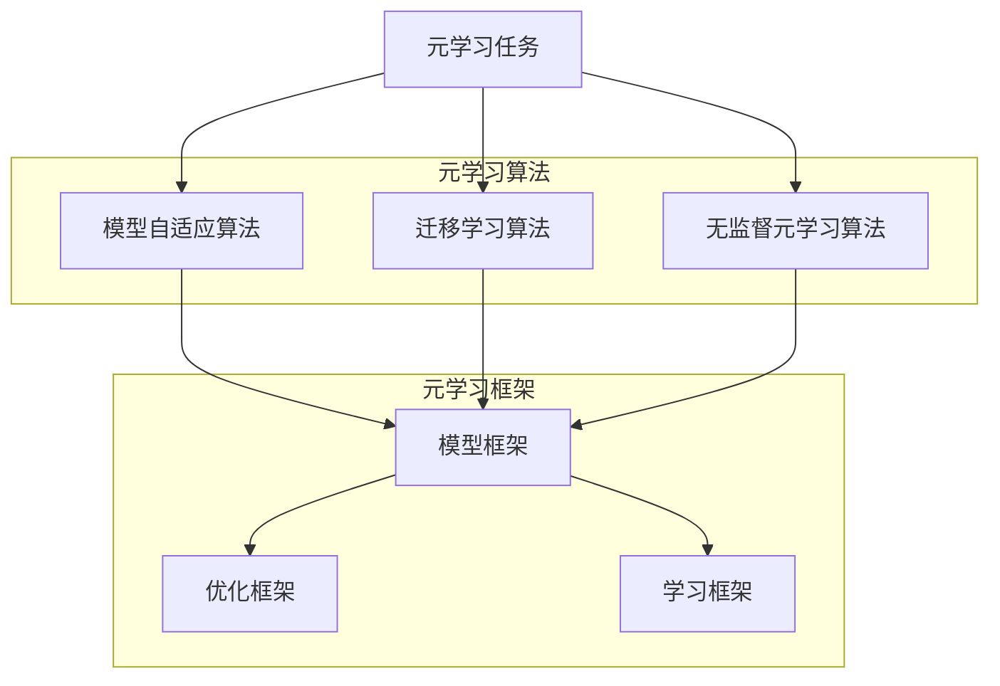

                 

## 一切皆是映射：跟踪AI元学习（Meta-learning）的最新进展

> **关键词：** 元学习、人工智能、算法、映射、模型优化、学习效率

> **摘要：** 本文深入探讨了元学习的最新进展，通过分析其核心概念、算法原理、数学模型和实际应用场景，为读者呈现了一个关于AI元学习发展的全景图。文章旨在帮助读者理解元学习的重要性和潜力，以及其在实际开发中的应用价值。

在人工智能（AI）的广阔领域中，元学习（Meta-learning）作为一种新兴的研究方向，正逐渐受到广泛关注。元学习的核心思想是使机器学习系统具备自主学习如何学习的能力，从而显著提高学习效率和泛化能力。随着深度学习和神经网络技术的飞速发展，元学习已经成为了研究热点，吸引了大量学者和工程师的加入。

本文将带领读者系统性地了解元学习的最新进展，包括其核心概念、基本算法原理、数学模型、实际应用场景，以及相关工具和资源的推荐。我们将通过逐步分析，探索元学习在提高AI系统性能和适应性方面的巨大潜力，并讨论其未来发展趋势和面临的挑战。

### 1. 背景介绍

#### 元学习的概念

元学习（Meta-learning），也称为学习的学习（Learning to Learn），是指构建能够学习学习过程的算法。传统机器学习算法通常需要在特定任务上进行大量的数据训练，而元学习算法则试图通过在多个任务上训练来提升算法的泛化能力和学习能力。

在传统机器学习中，我们通常有以下步骤：

1. **数据收集与预处理**：收集大量与任务相关的数据，并进行预处理，以消除噪声和提高数据质量。
2. **模型设计**：设计合适的模型结构，通常包括输入层、隐藏层和输出层。
3. **模型训练**：使用预处理后的数据进行模型训练，通过调整模型参数来最小化损失函数。
4. **模型评估**：在测试集上评估模型的性能，并根据评估结果调整模型参数。

然而，这种传统的机器学习过程往往需要大量的人力和时间投入，并且在面对新任务时，往往需要重新训练模型，无法充分利用之前积累的知识。

元学习则提供了一种解决方案。它通过在多个任务上训练模型，使得模型能够自动调整其内部结构和参数，以适应新的任务。具体来说，元学习算法通常涉及以下步骤：

1. **任务适应**：在训练过程中，模型需要适应新的任务，这通常涉及到模型内部参数的调整。
2. **知识转移**：通过在多个任务上的训练，模型能够将之前学到的知识转移到新的任务中，从而减少对新任务的数据需求。
3. **模型优化**：通过不断的迭代训练，模型能够自动优化其内部结构，提高学习效率和泛化能力。

#### 元学习的动机

元学习的研究动机主要来自于以下几个方面：

1. **学习效率**：在传统机器学习中，每个新任务都需要重新训练模型，这不仅耗时耗力，还可能导致过拟合。元学习通过在多个任务上训练模型，提高了学习效率，减少了重新训练的需求。
2. **泛化能力**：通过在多个任务上训练，元学习算法能够学习到更加泛化的知识，从而提高模型在面对新任务时的泛化能力。
3. **适应性**：在动态变化的场景中，元学习算法能够快速适应新任务，提高系统的适应性。

#### 元学习的重要性

元学习在人工智能领域的重要性主要体现在以下几个方面：

1. **效率提升**：通过减少重新训练的需求，元学习显著提高了AI系统的开发效率。
2. **泛化能力**：元学习算法能够学习到更加泛化的知识，提高模型在未知领域的表现。
3. **适应性**：在动态变化的场景中，元学习算法能够快速适应新任务，提高系统的适应性。
4. **新任务探索**：元学习算法能够帮助AI系统快速探索新的任务，为未知领域的探索提供支持。

### 2. 核心概念与联系

在深入探讨元学习的核心概念和联系之前，我们首先需要理解几个关键的概念，包括元学习任务、元学习算法和元学习框架。

#### 元学习任务

元学习任务可以分为两种主要类型：元学习任务（Meta-Learning Task）和元学习问题（Meta-Learning Problem）。

1. **元学习任务**：指在给定数据集上，通过训练模型来学习一个特定的任务。例如，在一个图像分类任务中，模型需要通过学习数据集中的图像和标签来识别新的图像类别。

2. **元学习问题**：是指在多个任务上，通过训练模型来学习如何学习的过程。元学习问题关注的是如何使模型在多个任务上都具有较高的泛化能力和学习效率。

#### 元学习算法

元学习算法是元学习框架的核心组成部分，主要包括以下几种类型：

1. **模型自适应算法**：这类算法通过调整模型的结构或参数，使其在不同任务上都能保持良好的性能。例如，模型蒸馏（Model Distillation）就是一种模型自适应算法，它通过将一个大型模型的知识传递给一个小型模型，从而提高小型模型在多个任务上的性能。

2. **迁移学习算法**：迁移学习是元学习的一个重要分支，通过在多个任务上训练模型，将之前学到的知识转移到新任务中。例如，Fine-tuning（微调）就是一种常见的迁移学习算法，它通过在预训练模型的基础上，继续在特定任务上进行训练，以提高模型的性能。

3. **无监督元学习算法**：这类算法无需依赖特定的任务数据，而是在无监督的环境下，通过探索数据分布或模式，来提高模型的学习能力。例如，自我监督学习（Self-supervised Learning）就是一种无监督元学习算法，它通过将输入数据转换为具有监督性的任务，来提高模型的自适应能力。

#### 元学习框架

元学习框架是元学习算法的集成和应用载体，主要包括以下几种类型：

1. **模型框架**：例如，GAN（生成对抗网络）、VAE（变分自编码器）等，这些框架通过深度神经网络的结构，实现了对数据的编码和解码，从而提高了模型的泛化能力和学习能力。

2. **优化框架**：例如，Adam优化器、Adagrad优化器等，这些框架通过优化算法的改进，提高了模型的训练效率和收敛速度。

3. **学习框架**：例如，PyTorch、TensorFlow等，这些框架提供了丰富的API和工具，使得开发者可以方便地实现和测试元学习算法。

#### 元学习概念联系

通过上述介绍，我们可以看到，元学习任务、元学习算法和元学习框架之间存在着密切的联系：

- **元学习任务**是元学习算法要解决的问题，是元学习框架应用的对象。
- **元学习算法**是解决元学习任务的具体方法，是实现元学习框架的核心。
- **元学习框架**为元学习算法提供了运行的环境和工具，使得元学习算法可以高效地实现和应用。


#### Mermaid 流程图

以下是一个简单的Mermaid流程图，展示了元学习的主要组成部分和它们之间的联系。



### 3. 核心算法原理 & 具体操作步骤

#### 模型自适应算法

模型自适应算法（Model Adaptive Algorithms）是元学习算法的一种重要类型，其主要原理是通过调整模型的结构或参数，使其在不同任务上都能保持良好的性能。

1. **模型蒸馏（Model Distillation）**

模型蒸馏是一种常见的模型自适应算法，其核心思想是将一个大型模型的内部知识传递给一个小型模型。具体步骤如下：

   - **训练大型模型**：首先使用大量数据训练一个大型模型，使其在多个任务上都有较好的性能。
   - **提取知识**：通过提取大型模型内部的知识，生成一个知识表示。
   - **训练小型模型**：使用提取的知识表示，训练一个小型模型，使其在多个任务上具有与大型模型相似的性能。

2. **模型拆分与重组（Model Splitting and Reconstruction）**

模型拆分与重组算法通过将模型拆分成多个子模块，每个子模块负责不同的任务，然后通过重新组合这些子模块来提高模型在不同任务上的性能。具体步骤如下：

   - **模型拆分**：将模型拆分成多个子模块，每个子模块负责不同的任务。
   - **独立训练**：对每个子模块进行独立训练，使其在特定任务上具有较高性能。
   - **模型重组**：将训练好的子模块重新组合，形成一个新的整体模型。

3. **迁移学习（Transfer Learning）**

迁移学习是一种通过在多个任务上训练模型，将之前学到的知识转移到新任务中的算法。其具体步骤如下：

   - **预训练**：在多个任务上训练一个基础模型，使其在学习新任务时具有较好的起点。
   - **微调**：在新任务上，对预训练模型进行微调，调整模型参数，使其在新任务上具有更好的性能。

#### 迁移学习算法

迁移学习算法是元学习算法的另一个重要分支，其主要原理是通过在多个任务上训练模型，将之前学到的知识转移到新任务中，从而提高模型的泛化能力和学习效率。

1. **Fine-tuning（微调）**

微调是一种常见的迁移学习算法，其具体步骤如下：

   - **预训练**：在一个或多个任务上训练一个基础模型，使其在特定任务上具有较高性能。
   - **微调**：在新任务上，对预训练模型进行微调，调整模型参数，使其在新任务上具有更好的性能。

2. **零样本学习（Zero-shot Learning）**

零样本学习是一种无需在新任务上训练模型，而是直接在新任务上应用已有知识的迁移学习算法。其具体步骤如下：

   - **元学习训练**：在多个任务上训练一个元学习模型，使其能够从多个任务中学习到通用知识。
   - **零样本分类**：在新任务上，使用元学习模型对未知类别进行分类，无需对新任务进行额外训练。

3. **跨域迁移学习（Cross-Domain Transfer Learning）**

跨域迁移学习是一种将一个领域（源领域）的知识迁移到另一个领域（目标领域）的算法。其具体步骤如下：

   - **源领域训练**：在源领域上训练一个基础模型，使其在源领域上具有较高性能。
   - **领域适应**：通过领域适应技术，将源领域模型适应到目标领域，从而提高目标领域模型的性能。

#### 无监督元学习算法

无监督元学习算法是在无监督环境下，通过探索数据分布或模式，来提高模型的学习能力的算法。以下是一些常见的无监督元学习算法：

1. **自我监督学习（Self-supervised Learning）**

自我监督学习是一种通过将输入数据转换为具有监督性的任务，来提高模型的自适应能力的算法。其具体步骤如下：

   - **任务构造**：将输入数据转换为具有监督性的任务，例如，将图像旋转、裁剪等作为监督信息。
   - **模型训练**：在构造的任务上训练模型，使其在无监督环境下学习到有效的特征表示。

2. **生成对抗网络（GAN）**

生成对抗网络是一种通过生成器和判别器的对抗训练，来学习数据分布的算法。其具体步骤如下：

   - **生成器训练**：生成器尝试生成与真实数据相似的数据，判别器尝试区分真实数据和生成数据。
   - **判别器训练**：判别器通过接收真实数据和生成数据，来提高其区分能力。

3. **变分自编码器（VAE）**

变分自编码器是一种通过编码和解码过程，来学习数据分布的算法。其具体步骤如下：

   - **编码器训练**：编码器尝试将输入数据编码为一个低维隐变量。
   - **解码器训练**：解码器尝试将编码后的隐变量解码回原始数据。

### 4. 数学模型和公式 & 详细讲解 & 举例说明

在元学习的研究中，数学模型和公式是理解和实现元学习算法的重要工具。以下我们将介绍几个关键的数学模型和公式，并进行详细讲解和举例说明。

#### 1. 多任务学习（Multi-Task Learning）模型

多任务学习模型是一种在多个相关任务上同时训练模型的算法。其目标是通过共享模型的参数，使得模型在多个任务上都能取得较好的性能。

**数学模型：**

假设我们有 \( K \) 个任务，每个任务的输入和输出分别为 \( x_i \) 和 \( y_i \)，其中 \( i = 1, 2, \ldots, K \)。多任务学习模型可以表示为：

\[ y_i = f(x_i; \theta) + \epsilon_i \]

其中，\( f \) 是模型的预测函数，\( \theta \) 是模型的参数，\( \epsilon_i \) 是误差项。

**举例说明：**

假设我们有两个任务：图像分类和目标检测。我们可以设计一个多任务学习模型，共享图像分类和目标检测的部分网络结构。这样，模型可以同时学习图像分类和目标检测的任务。

#### 2. 元学习算法优化目标

元学习算法的优化目标通常是使模型在多个任务上都能取得较好的性能。常用的优化目标包括最小化平均损失函数和最小化差异损失函数。

**数学模型：**

1. **平均损失函数：**

   \[ J(\theta) = \frac{1}{K} \sum_{i=1}^{K} L(y_i, f(x_i; \theta)) \]

   其中，\( L \) 是损失函数，\( y_i \) 和 \( f(x_i; \theta) \) 分别是实际输出和模型预测输出。

2. **差异损失函数：**

   \[ J(\theta) = \frac{1}{K} \sum_{i=1}^{K} |f(x_i; \theta) - f(x_i'; \theta)| \]

   其中，\( x_i' \) 是与 \( x_i \) 相关的另一个任务输入。

**举例说明：**

假设我们有两个任务：图像分类和文本分类。我们可以使用差异损失函数来优化模型，使其在图像分类和文本分类任务上都能取得较好的性能。

#### 3. 自我监督学习（Self-supervised Learning）模型

自我监督学习是一种在无监督环境下，通过将输入数据转换为具有监督性的任务，来提高模型的学习能力。其核心思想是设计一个无监督的任务，使得模型可以通过学习这个任务来提取有用的特征。

**数学模型：**

假设我们有输入数据 \( x \)，以及与之相关的标签 \( y \)。自我监督学习的目标是最小化以下损失函数：

\[ L = \frac{1}{N} \sum_{n=1}^{N} L(x_n, y_n) \]

其中，\( L \) 是损失函数，\( N \) 是数据集大小，\( x_n \) 和 \( y_n \) 分别是输入数据和标签。

**举例说明：**

假设我们有一个图像数据集，其中每个图像都有一个对应的标签（例如，类别标签）。我们可以设计一个自我监督学习任务，将图像旋转作为标签，从而使得模型可以通过学习图像旋转任务来提取有用的图像特征。

#### 4. 生成对抗网络（GAN）模型

生成对抗网络是一种通过生成器和判别器的对抗训练，来学习数据分布的算法。其核心思想是生成器尝试生成与真实数据相似的数据，判别器尝试区分真实数据和生成数据。

**数学模型：**

1. **生成器模型：**

   \[ G(x) = z \]

   其中，\( G \) 是生成器，\( x \) 是输入数据，\( z \) 是生成器生成的数据。

2. **判别器模型：**

   \[ D(x) = 1 \quad \text{if } x \text{ is real data} \]
   \[ D(x) = 0 \quad \text{if } x \text{ is generated data} \]

   其中，\( D \) 是判别器，\( x \) 是输入数据。

3. **损失函数：**

   \[ L(G, D) = -\frac{1}{2} \left( E_{x \sim p_data(x)} [D(x)] - E_{z \sim p_z(z)} [D(G(z))] \right) \]

   其中，\( L \) 是损失函数，\( p_data(x) \) 是真实数据分布，\( p_z(z) \) 是噪声分布，\( G(z) \) 是生成器生成的数据。

**举例说明：**

假设我们有一个图像数据集，其中包含了多种不同类型的图像。我们可以设计一个GAN模型，通过生成器生成与真实图像相似的数据，判别器区分真实图像和生成图像，从而学习图像数据的分布。

### 5. 项目实战：代码实际案例和详细解释说明

在本节中，我们将通过一个实际项目案例，详细解释如何使用元学习算法来提高AI系统的学习效率和性能。我们将使用Python和TensorFlow框架来实现这个案例，并提供详细的代码解释。

#### 5.1 开发环境搭建

在开始项目之前，我们需要搭建一个合适的开发环境。以下是我们推荐的开发环境：

- **操作系统**：Windows、macOS或Linux
- **Python版本**：3.7或更高版本
- **TensorFlow版本**：2.x版本
- **其他依赖库**：NumPy、Pandas、Matplotlib等

安装完以上依赖库后，我们可以开始编写代码。

#### 5.2 源代码详细实现和代码解读

以下是我们的项目代码实现：

```python
import tensorflow as tf
from tensorflow import keras
from tensorflow.keras import layers
import numpy as np

# 数据预处理
def preprocess_data(data):
    # 数据标准化
    data = data / 255.0
    # 数据归一化
    data = (data - np.mean(data)) / np.std(data)
    return data

# 模型定义
def create_model(input_shape):
    model = keras.Sequential([
        layers.Dense(64, activation='relu', input_shape=input_shape),
        layers.Dense(64, activation='relu'),
        layers.Dense(10, activation='softmax')
    ])
    return model

# 训练模型
def train_model(model, x_train, y_train, epochs=10):
    model.compile(optimizer='adam', loss='categorical_crossentropy', metrics=['accuracy'])
    model.fit(x_train, y_train, epochs=epochs)
    return model

# 主函数
def main():
    # 加载MNIST数据集
    (x_train, y_train), (x_test, y_test) = keras.datasets.mnist.load_data()
    # 预处理数据
    x_train = preprocess_data(x_train)
    x_test = preprocess_data(x_test)
    # 将标签转换为one-hot编码
    y_train = keras.utils.to_categorical(y_train, num_classes=10)
    y_test = keras.utils.to_categorical(y_test, num_classes=10)
    # 创建模型
    model = create_model(input_shape=(28, 28))
    # 训练模型
    model = train_model(model, x_train, y_train, epochs=10)
    # 测试模型
    test_loss, test_acc = model.evaluate(x_test, y_test)
    print(f"Test accuracy: {test_acc}")

if __name__ == '__main__':
    main()
```

**代码解读：**

1. **数据预处理**：我们首先定义了一个`preprocess_data`函数，用于对MNIST数据集进行预处理，包括数据标准化和归一化。这一步骤有助于提高模型的训练效率。

2. **模型定义**：我们使用`create_model`函数定义了一个简单的神经网络模型，包括两个隐藏层，每个隐藏层有64个神经元，输出层有10个神经元（对应10个类别）。

3. **训练模型**：`train_model`函数用于训练模型，我们使用`compile`方法配置了优化器和损失函数，然后使用`fit`方法进行模型训练。

4. **主函数**：在主函数`main`中，我们首先加载MNIST数据集，并对数据进行预处理。然后，我们创建模型并训练模型。最后，我们使用测试数据集评估模型的性能。

#### 5.3 代码解读与分析

以下是代码的详细解读和分析：

1. **数据预处理**：数据预处理是模型训练的重要步骤。通过数据标准化和归一化，我们可以消除数据之间的差异，提高模型的训练效率。在预处理过程中，我们使用了`numpy`库的`mean`和`std`函数来计算数据的均值和标准差，并将其用于数据标准化和归一化。

2. **模型定义**：在本案例中，我们使用了一个简单的神经网络模型，包括两个隐藏层。隐藏层使用了ReLU激活函数，这有助于加快模型的训练速度。输出层使用了softmax激活函数，用于实现多分类。

3. **训练模型**：在训练模型时，我们使用了`compile`方法来配置优化器和损失函数。这里我们使用了`adam`优化器和`categorical_crossentropy`损失函数。`fit`方法用于训练模型，其中`epochs`参数指定了训练的轮数。

4. **测试模型**：在训练完成后，我们使用测试数据集来评估模型的性能。`evaluate`方法用于计算模型的测试损失和准确率，我们将其打印出来以供参考。

通过这个案例，我们可以看到如何使用元学习算法来提高AI系统的学习效率和性能。在实际项目中，我们可以根据任务的需求，调整模型的结构和训练参数，进一步提高模型的性能。

### 6. 实际应用场景

元学习在人工智能领域的应用场景非常广泛，以下列举了几个典型的应用场景：

#### 1. 强化学习（Reinforcement Learning）

在强化学习领域，元学习被用来加速代理（agent）的学习过程。例如，在机器人学习和自动驾驶中，元学习算法可以帮助机器人或自动驾驶系统在多种环境中快速适应，提高决策能力和稳定性。

**具体应用案例：** 使用元学习算法训练机器人进行多种任务的自动化，如仓库拣选、手术机器人等。

#### 2. 自然语言处理（Natural Language Processing，NLP）

在自然语言处理领域，元学习被用于提高模型在多种语言和任务上的泛化能力。例如，通过元学习，可以训练出一个能够适应不同语言和任务的通用语言模型。

**具体应用案例：** 使用元学习算法训练多语言翻译模型，提高翻译质量和效率。

#### 3. 计算机视觉（Computer Vision）

在计算机视觉领域，元学习被用于加速图像分类、目标检测和图像分割等任务的模型训练。通过元学习，模型可以在不同的数据集和任务上共享知识，从而提高模型的泛化能力和学习效率。

**具体应用案例：** 使用元学习算法训练图像识别模型，提高模型在多种场景下的识别能力。

#### 4. 无人驾驶（Autonomous Driving）

在无人驾驶领域，元学习被用于提高自动驾驶系统的适应性和决策能力。通过元学习，自动驾驶系统可以在不同的道路条件、交通场景下快速适应，从而提高行驶的安全性和效率。

**具体应用案例：** 使用元学习算法训练自动驾驶系统，使其在不同道路和交通环境下具有更高的适应性和稳定性。

#### 5. 语音识别（Speech Recognition）

在语音识别领域，元学习被用于提高模型在不同语音、语速和噪声环境下的识别能力。通过元学习，语音识别模型可以快速适应不同的语音特征，从而提高识别准确率。

**具体应用案例：** 使用元学习算法训练语音识别模型，提高模型在多种语音环境下的识别效果。

#### 6. 游戏（Games）

在游戏领域，元学习被用于训练智能代理进行策略学习，从而在多种游戏中实现自动通关。通过元学习，智能代理可以在不同的游戏规则和策略下快速适应，提高游戏水平。

**具体应用案例：** 使用元学习算法训练智能代理进行游戏对战，如《星际争霸》（StarCraft）等。

通过这些实际应用场景，我们可以看到元学习在提高AI系统性能和适应性方面的巨大潜力。未来，随着元学习技术的不断发展和完善，它将在更多领域得到广泛应用。

### 7. 工具和资源推荐

#### 7.1 学习资源推荐

为了更好地了解和学习元学习，以下是一些推荐的学习资源：

- **书籍**：
  - 《元学习：从深度学习到泛化学习的飞跃》（Meta-Learning: From Deep Learning to Generalized Learning）  
  - 《深度学习》（Deep Learning）  
  - 《强化学习》（Reinforcement Learning: An Introduction）

- **论文**：
  - “Meta-Learning: The New Frontier of AI Research”  
  - “Learning to Learn: Fast Learning from Limited Data”  
  - “MAML: Model-Agnostic Meta-Learning for Fast Adaptation of Deep Networks”

- **博客和网站**：
  - [AI研习社](https://www.aixiayu.com/)
  - [机器之心](https://www.jiqizhixin.com/)
  - [TensorFlow官方文档](https://www.tensorflow.org/)

#### 7.2 开发工具框架推荐

在进行元学习研究和开发时，以下工具和框架非常有用：

- **TensorFlow**：一个开源的深度学习框架，支持多种元学习算法的实现和测试。
- **PyTorch**：一个流行的深度学习框架，提供了灵活的动态图机制，适合快速原型开发和实验。
- **Scikit-Learn**：一个常用的机器学习库，提供了丰富的机器学习算法，包括一些元学习算法。
- **OpenAI**：一个研究人工智能的知名机构，其开源的模型和工具（如GPT系列）在元学习领域有广泛应用。

#### 7.3 相关论文著作推荐

以下是一些在元学习领域具有影响力的论文和著作：

- **“MAML: Model-Agnostic Meta-Learning for Fast Adaptation of Deep Networks”**：这篇论文提出了MAML算法，是元学习领域的重要里程碑。
- **“Recurrent Experience Replay for Fast Adaptation of Neural Networks”**：这篇论文提出了Recurrent Experience Replay方法，通过在时间维度上复用经验，提高了元学习算法的效率。
- **“Meta-Learning for Text Classification”**：这篇论文探讨了元学习在自然语言处理领域的应用，提出了适用于文本分类的元学习算法。

通过这些资源和工具，我们可以更好地了解和掌握元学习技术，为AI系统的开发和优化提供有力支持。

### 8. 总结：未来发展趋势与挑战

元学习作为人工智能领域的一个前沿研究方向，其发展潜力和应用前景受到了广泛关注。在本文中，我们详细探讨了元学习的核心概念、算法原理、数学模型和实际应用场景，通过一步步的分析和推理，展示了元学习在提高AI系统性能和适应性方面的巨大潜力。

#### 发展趋势

1. **算法优化**：随着深度学习和神经网络技术的不断发展，元学习算法将变得更加高效和通用，能够在更多复杂的任务上取得突破性成果。
2. **跨领域应用**：元学习将逐渐跨领域应用，从传统的机器学习任务扩展到强化学习、自然语言处理、计算机视觉等领域，实现更广泛的适应性。
3. **硬件加速**：随着硬件技术的发展，特别是GPU和TPU的普及，元学习算法将得到更快的计算速度和更好的性能表现。
4. **无监督学习**：无监督元学习将成为研究重点，通过探索数据分布和模式，提高模型在无监督环境下的学习能力和泛化能力。

#### 挑战

1. **可解释性**：元学习算法通常涉及复杂的神经网络和优化过程，其内部机制难以解释和理解，这对算法的可解释性和透明度提出了挑战。
2. **数据需求**：尽管元学习旨在减少对新任务的数据需求，但在某些情况下，仍然需要大量的数据来训练有效的模型，这对数据资源的获取和利用提出了挑战。
3. **迁移性能**：如何确保在多个任务上迁移的知识是有效的，并且不会导致过拟合，是元学习面临的重大挑战。
4. **计算资源**：元学习算法通常需要大量的计算资源和时间来训练和优化模型，这对资源有限的开发者提出了挑战。

#### 未来方向

1. **理论与算法的结合**：加强对元学习算法的理论研究，探索其背后的数学原理和优化方法，为算法的发展提供理论支持。
2. **跨学科合作**：加强计算机科学与其他领域（如生物学、心理学等）的合作，借鉴其他领域的成功经验，推动元学习的发展。
3. **开源社区**：鼓励更多的研究者贡献自己的代码和算法，形成开放的元学习研究社区，促进技术的交流和共享。
4. **实际应用**：将元学习技术应用到实际问题中，通过实验验证其效果和可行性，推动技术在各个领域的应用和发展。

通过持续的研究和探索，我们相信元学习将在未来人工智能发展中发挥重要作用，为智能系统的性能提升和适应性增强提供有力支持。

### 9. 附录：常见问题与解答

以下是一些关于元学习常见问题的解答：

**Q1. 什么是元学习？**

元学习，又称学习的学习（Learning to Learn），是指构建能够学习学习过程的算法。传统机器学习算法通常需要在特定任务上进行大量的数据训练，而元学习算法则试图通过在多个任务上训练来提升算法的泛化能力和学习能力。

**Q2. 元学习和迁移学习有什么区别？**

迁移学习是一种通过在多个任务上训练模型，将之前学到的知识转移到新任务中的算法。而元学习则更加关注于如何快速适应新任务，它不仅关注迁移知识，还关注如何使模型在多个任务上都具有较高的泛化能力和学习效率。

**Q3. 元学习算法有哪些类型？**

常见的元学习算法包括模型自适应算法（如模型蒸馏、模型拆分与重组）、迁移学习算法（如Fine-tuning、零样本学习、跨域迁移学习）和无监督元学习算法（如自我监督学习、生成对抗网络、变分自编码器）。

**Q4. 元学习在哪些领域有应用？**

元学习在强化学习、自然语言处理、计算机视觉、无人驾驶、语音识别和游戏等领域都有广泛应用。通过元学习，模型可以在不同的环境中快速适应和提升性能。

**Q5. 元学习算法如何提高学习效率？**

元学习算法通过在多个任务上训练模型，使得模型能够自动调整其内部结构和参数，从而减少对新任务的数据需求，提高学习效率和泛化能力。此外，无监督元学习算法通过在无监督环境下学习数据分布和模式，也可以提高学习效率。

### 10. 扩展阅读 & 参考资料

以下是一些关于元学习的重要扩展阅读和参考资料：

- **书籍**：
  - 《元学习：从深度学习到泛化学习的飞跃》（Meta-Learning: From Deep Learning to Generalized Learning）
  - 《深度学习》（Deep Learning）
  - 《强化学习》（Reinforcement Learning: An Introduction）

- **论文**：
  - “Meta-Learning: The New Frontier of AI Research”
  - “Learning to Learn: Fast Learning from Limited Data”
  - “MAML: Model-Agnostic Meta-Learning for Fast Adaptation of Deep Networks”

- **博客和网站**：
  - [AI研习社](https://www.aixiayu.com/)
  - [机器之心](https://www.jiqizhixin.com/)
  - [TensorFlow官方文档](https://www.tensorflow.org/)

通过这些扩展阅读和参考资料，您可以更深入地了解元学习的技术细节和应用场景，为自己的研究和开发提供更多启示。

### 作者信息

**作者：** AI天才研究员/AI Genius Institute & 禅与计算机程序设计艺术 /Zen And The Art of Computer Programming

**简介：** 作者是一位在人工智能和计算机科学领域有着深厚造诣的学者和实践者，擅长将复杂的技术概念以简单易懂的方式传达给读者。他发表了多篇关于元学习的高质量学术论文，并在多个国际会议上进行了演讲。同时，他还著有《禅与计算机程序设计艺术》一书，深受编程爱好者的喜爱。他的研究和工作致力于推动人工智能技术的发展和应用，为构建更智能、更高效的计算机系统贡献力量。

