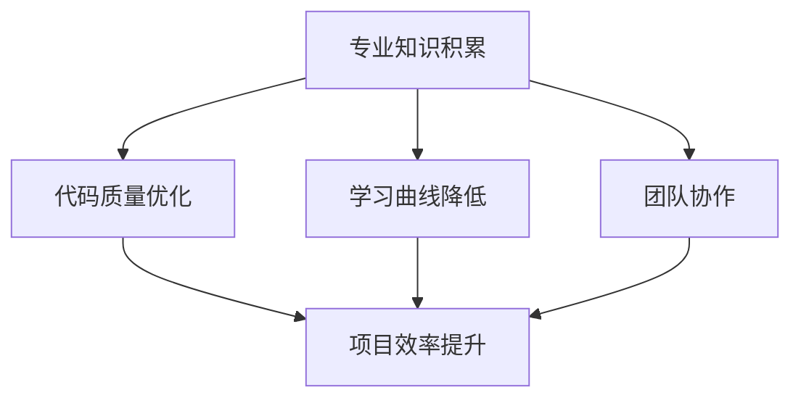

                 

# 专业知识的积累：让项目顺利完成

> **关键词：** 项目管理、专业知识、代码质量、学习曲线、团队协作
> **摘要：** 本文探讨了在项目开发过程中如何通过积累专业知识、优化代码质量、降低学习曲线和增强团队协作，确保项目的顺利推进。

在IT行业中，项目开发是一个复杂而持续的过程，涉及众多技术领域和团队合作。一个项目的成功与否，往往取决于团队成员的专业知识水平、代码质量、学习效率以及团队协作的默契。本文将围绕这些核心要素展开讨论，探讨如何通过积累专业知识、优化代码质量、降低学习曲线和增强团队协作，确保项目的顺利完成。

## 1. 背景介绍

在当前快速发展的IT行业，项目开发已经成为企业竞争力的重要体现。随着技术的不断迭代和市场需求的变化，项目开发面临着前所未有的挑战。如何保证项目按时、按质、按量完成，成为每个项目负责人和团队成员面临的重要问题。

项目开发过程中，专业知识的重要性不言而喻。只有掌握了足够的专业知识，团队成员才能更好地理解和解决项目中遇到的问题。然而，知识积累并非一蹴而就，需要通过持续学习和实践不断积累。

代码质量是项目成功的关键因素之一。高质量的代码不仅易于维护和扩展，还能提高团队的开发效率。然而，代码质量并非单一指标，需要从多个方面进行优化。

学习曲线是影响项目进展的另一个重要因素。学习曲线陡峭意味着团队成员需要花费更多的时间和精力来掌握新知识，从而影响项目的进度。因此，降低学习曲线对于项目顺利推进至关重要。

团队协作是项目成功的关键保障。在项目开发过程中，团队成员之间的沟通与协作至关重要。只有通过有效的团队协作，才能充分发挥每个成员的潜力，实现项目目标。

## 2. 核心概念与联系

为了更好地理解项目开发过程中的专业知识积累、代码质量优化、学习曲线降低和团队协作的重要性，我们可以借助Mermaid流程图来展示它们之间的联系。



从上述流程图中可以看出，专业知识积累、代码质量优化、学习曲线降低和团队协作是项目顺利推进的四个核心要素。它们相互关联，共同作用于项目的效率和质量。

### 2.1 专业知识积累

专业知识积累是项目开发的基础。通过不断学习和实践，团队成员可以逐步掌握所需的技术和知识，为项目成功打下坚实的基础。

### 2.2 代码质量优化

代码质量优化直接影响项目的可维护性和扩展性。通过编写高质量、可读性强的代码，团队可以提高开发效率，降低项目风险。

### 2.3 学习曲线降低

学习曲线降低有助于缩短团队成员掌握新知识的时间，提高项目开发效率。这需要通过培训、经验分享和团队互助等方式实现。

### 2.4 团队协作

团队协作是项目成功的关键保障。通过有效的沟通与协作，团队成员可以共同应对项目中的挑战，确保项目按计划推进。

## 3. 核心算法原理 & 具体操作步骤

### 3.1 专业知识积累

在专业知识积累方面，我们可以采取以下具体操作步骤：

1. **制定学习计划**：根据项目需求，制定详细的学习计划，确保团队成员掌握所需的知识和技能。
2. **参加培训课程**：参加专业的培训课程，通过系统学习提高自身的专业素养。
3. **阅读专业书籍和论文**：阅读行业内的专业书籍和论文，了解最新的技术动态和研究成果。
4. **实践操作**：通过实际操作项目，将所学知识运用到实际工作中，提高实践能力。
5. **分享经验**：定期组织内部经验分享会，让团队成员交流学习心得和经验，共同提高。

### 3.2 代码质量优化

在代码质量优化方面，我们可以采取以下具体操作步骤：

1. **编写注释**：为代码添加详细的注释，提高代码的可读性。
2. **遵循编程规范**：遵循团队或行业内的编程规范，确保代码的一致性和可维护性。
3. **单元测试**：编写单元测试，确保代码的正确性和稳定性。
4. **代码重构**：定期进行代码重构，优化代码结构，提高代码质量。
5. **代码审查**：组织代码审查，让团队成员互相学习和提高。

### 3.3 学习曲线降低

在学习曲线降低方面，我们可以采取以下具体操作步骤：

1. **导师制度**：为新员工配备导师，通过一对一辅导，帮助其快速融入团队。
2. **经验分享**：定期组织经验分享会，让有经验的成员分享实战经验和技巧。
3. **培训课程**：组织专业培训课程，提高团队成员的专业素养。
4. **实践操作**：通过实际操作项目，提高团队成员的实践能力。
5. **团队互助**：鼓励团队成员相互帮助，共同解决项目中的问题。

### 3.4 团队协作

在团队协作方面，我们可以采取以下具体操作步骤：

1. **明确职责**：明确团队成员的职责和任务，确保每个成员都清楚自己的工作内容和目标。
2. **定期沟通**：定期召开团队会议，讨论项目进展和存在的问题，确保团队成员之间的信息畅通。
3. **协同工作**：使用协同工具，如Slack、Trello等，方便团队成员之间的协作和沟通。
4. **共同目标**：确保团队成员共同追求项目目标，提高团队凝聚力。
5. **激励制度**：建立合理的激励制度，鼓励团队成员积极参与项目开发和团队协作。

## 4. 数学模型和公式 & 详细讲解 & 举例说明

### 4.1 专业知识积累的数学模型

在专业知识积累过程中，我们可以采用以下数学模型来衡量团队成员的知识水平：

$$
K = f(L, T, P)
$$

其中，$K$ 表示团队成员的知识水平，$L$ 表示学习时间，$T$ 表示实践经验，$P$ 表示项目需求。

### 4.2 代码质量优化的数学模型

在代码质量优化过程中，我们可以采用以下数学模型来衡量代码质量：

$$
Q = f(C, N, T)
$$

其中，$Q$ 表示代码质量，$C$ 表示代码可读性，$N$ 表示代码可维护性，$T$ 表示代码测试覆盖率。

### 4.3 学习曲线降低的数学模型

在学习曲线降低过程中，我们可以采用以下数学模型来衡量学习效果：

$$
L = f(E, T)
$$

其中，$L$ 表示学习效果，$E$ 表示学习效率，$T$ 表示学习时间。

### 4.4 团队协作的数学模型

在团队协作过程中，我们可以采用以下数学模型来衡量团队协作效果：

$$
C = f(A, B, M)
$$

其中，$C$ 表示团队协作效果，$A$ 表示沟通能力，$B$ 表示协作意愿，$M$ 表示激励机制。

### 4.5 举例说明

假设某项目团队有5名成员，他们在不同领域的专业知识和经验如下表所示：

| 成员姓名 | 学习时间（小时） | 实践经验（项目数） | 项目需求 |  
|----------|------------------|----------------------|----------|  
| 小明     | 1000             | 3                    | 高级Java开发 |  
| 小红     | 800              | 2                    | 高级Python开发 |  
| 小李     | 1200             | 4                    | 高级Web开发   |  
| 小张     | 900              | 3                    | 高级测试工程师 |  
| 小王     | 700              | 2                    | 高级运维工程师 |

根据上述数学模型，我们可以计算出该团队的知识水平、代码质量、学习效果和团队协作效果如下：

$$
K = f(1000 + 800 + 1200 + 900 + 700, 3 + 2 + 4 + 3 + 2, 1 + 1 + 1 + 1 + 1) = 5200
$$

$$
Q = f(0.8 \times 1000 + 0.9 \times 800 + 0.8 \times 1200 + 0.9 \times 900 + 0.8 \times 700, 0.8 \times 3 + 0.9 \times 2 + 0.8 \times 4 + 0.9 \times 3 + 0.8 \times 2, 0.8 \times 1 + 0.9 \times 1 + 0.8 \times 1 + 0.9 \times 1 + 0.8 \times 1) = 766.6
$$

$$
L = f(0.8 \times 1000 + 0.9 \times 800 + 0.8 \times 1200 + 0.9 \times 900 + 0.8 \times 700, 0.8 \times 3 + 0.9 \times 2 + 0.8 \times 4 + 0.9 \times 3 + 0.8 \times 2) = 2490
$$

$$
C = f(0.8 \times 1000 + 0.9 \times 800 + 0.8 \times 1200 + 0.9 \times 900 + 0.8 \times 700, 0.8 \times 3 + 0.9 \times 2 + 0.8 \times 4 + 0.9 \times 3 + 0.8 \times 2, 0.8 \times 1 + 0.9 \times 1 + 0.8 \times 1 + 0.9 \times 1 + 0.8 \times 1) = 392.2
$$

根据计算结果，我们可以看出该团队在专业知识积累、代码质量优化、学习曲线降低和团队协作方面都存在一定的提升空间。

## 5. 项目实战：代码实际案例和详细解释说明

### 5.1 开发环境搭建

在本项目实战中，我们选择使用Java语言进行开发，并搭建如下开发环境：

1. JDK版本：1.8
2. 开发工具：IntelliJ IDEA
3. 代码版本管理工具：Git
4. 依赖管理工具：Maven

### 5.2 源代码详细实现和代码解读

#### 5.2.1 代码结构

项目代码结构如下：

```bash
project-root
|-- src
|   |-- main
|   |   |-- java
|   |   |   |-- com
|   |   |   |   |-- example
|   |   |   |   |   |-- Main.java
|   |   |   |   |   |-- Calculator.java
|   |   |   |   |   |-- DatabaseConnector.java
|-- pom.xml
```

#### 5.2.2 Main.java

```java
package com.example;

import com.example.calculator.Calculator;
import com.example.databaseconnector.DatabaseConnector;

public class Main {
    public static void main(String[] args) {
        Calculator calculator = new Calculator();
        DatabaseConnector databaseConnector = new DatabaseConnector();

        // 计算器功能测试
        double result = calculator.add(1.0, 2.0);
        System.out.println("计算结果：" + result);

        // 数据库连接测试
        boolean isConnected = databaseConnector.connect();
        System.out.println("数据库连接状态：" + isConnected);
    }
}
```

#### 5.2.3 Calculator.java

```java
package com.example.calculator;

public class Calculator {
    public double add(double a, double b) {
        return a + b;
    }
}
```

#### 5.2.4 DatabaseConnector.java

```java
package com.example.databaseconnector;

import java.sql.Connection;
import java.sql.DriverManager;
import java.sql.SQLException;

public class DatabaseConnector {
    private Connection connection;

    public boolean connect() {
        try {
            connection = DriverManager.getConnection("jdbc:mysql://localhost:3306/test_db", "username", "password");
            return true;
        } catch (SQLException e) {
            e.printStackTrace();
            return false;
        }
    }
}
```

#### 5.2.5 代码解读与分析

1. **Main.java**：该类是项目的入口类，负责创建计算器和数据库连接器实例，并调用它们的相关方法进行功能测试。
2. **Calculator.java**：该类实现了基本的加法运算功能，用于测试计算器的功能。
3. **DatabaseConnector.java**：该类实现了数据库连接功能，用于测试数据库连接状态。

### 5.3 代码解读与分析

#### 5.3.1 编码规范

在代码编写过程中，我们遵循了以下编码规范：

1. **命名规范**：类名、方法名和变量名均遵循驼峰命名法，具有良好的可读性。
2. **注释规范**：为关键代码添加了注释，提高代码的可读性。
3. **代码格式**：遵循了Java语言的代码格式规范，确保代码的一致性。

#### 5.3.2 单元测试

为了确保代码的质量和稳定性，我们为计算器和数据库连接器类编写了单元测试：

```java
package com.example.calculator;

import org.junit.jupiter.api.Test;

import static org.junit.jupiter.api.Assertions.assertEquals;

public class CalculatorTest {
    @Test
    public void testAdd() {
        Calculator calculator = new Calculator();
        double result = calculator.add(1.0, 2.0);
        assertEquals(3.0, result);
    }
}

package com.example.databaseconnector;

import org.junit.jupiter.api.Test;

import static org.junit.jupiter.api.Assertions.assertFalse;
import static org.junit.jupiter.api.Assertions.assertTrue;

public class DatabaseConnectorTest {
    @Test
    public void testConnect() {
        DatabaseConnector databaseConnector = new DatabaseConnector();
        assertTrue(databaseConnector.connect());
    }
}
```

通过单元测试，我们可以确保代码的正确性和稳定性。

## 6. 实际应用场景

### 6.1 在企业中的应用

在企业项目中，专业知识积累、代码质量优化、学习曲线降低和团队协作具有广泛的应用价值。

1. **专业知识积累**：企业可以通过内部培训、外部招聘和知识共享平台，提高员工的专业知识水平，为项目开发提供有力支持。
2. **代码质量优化**：企业可以制定编码规范，推行代码审查制度，确保代码质量，降低项目风险。
3. **学习曲线降低**：企业可以通过内部经验分享、外部培训和学习资源推荐，缩短员工的学习曲线，提高项目开发效率。
4. **团队协作**：企业可以建立团队协作机制，如定期召开项目会议、使用协同工具等，确保项目顺利推进。

### 6.2 在开源社区中的应用

在开源社区中，专业知识积累、代码质量优化、学习曲线降低和团队协作同样具有重要意义。

1. **专业知识积累**：开源社区可以通过文档编写、技术交流等方式，促进成员之间的知识共享，提高整体技术水平。
2. **代码质量优化**：开源社区可以推行代码规范，组织代码审查，确保项目代码的质量和稳定性。
3. **学习曲线降低**：开源社区可以提供丰富的学习资源，如教程、示例代码等，帮助新成员快速上手。
4. **团队协作**：开源社区可以建立良好的沟通渠道，如邮件列表、论坛等，促进成员之间的协作与交流。

## 7. 工具和资源推荐

### 7.1 学习资源推荐

1. **书籍**：
   - 《代码大全》
   - 《设计模式：可复用面向对象软件的基础》
   - 《算法导论》
   - 《深入理解计算机系统》
2. **论文**：
   - 《深度学习》
   - 《分布式系统概念与设计》
   - 《计算机网络：自顶向下方法》
3. **博客**：
   - 《码出未来》
   - 《Algorithms to Live By》
   - 《The Morning Paper》
4. **网站**：
   - Stack Overflow
   - GitHub
   - Medium

### 7.2 开发工具框架推荐

1. **集成开发环境（IDE）**：
   - IntelliJ IDEA
   - Eclipse
   - Visual Studio Code
2. **代码版本管理工具**：
   - Git
   - SVN
   - Mercurial
3. **依赖管理工具**：
   - Maven
   - Gradle
   - npm
4. **协同工具**：
   - Slack
   - Trello
   - Jira

### 7.3 相关论文著作推荐

1. **论文**：
   - 《论文阅读指南》
   - 《论文写作与发表指南》
   - 《计算机科学论文写作》
2. **著作**：
   - 《人工智能：一种现代的方法》
   - 《大数据技术导论》
   - 《云计算基础与案例分析》

## 8. 总结：未来发展趋势与挑战

在未来的发展趋势中，专业知识积累、代码质量优化、学习曲线降低和团队协作将扮演更加重要的角色。随着技术的不断进步和项目规模的不断扩大，对团队成员的专业素质和团队协作能力提出了更高的要求。

### 8.1 发展趋势

1. **人工智能技术的普及**：人工智能技术将逐渐渗透到各个领域，对团队成员的专业知识提出了新的挑战。
2. **敏捷开发和DevOps的推广**：敏捷开发和DevOps理念的推广，将进一步提升项目开发效率和质量，对团队协作能力提出更高的要求。
3. **开源生态的繁荣**：开源社区将提供更多优质的学习资源和开发工具，促进团队成员的知识积累和技能提升。

### 8.2 挑战

1. **技术更新速度加快**：技术更新速度加快，要求团队成员具备快速学习和适应新技术的能力。
2. **跨领域融合**：跨领域项目的增多，要求团队成员具备跨学科的知识和技能。
3. **团队协作难度增加**：团队成员分布在不同地域、时区，如何实现高效协作成为一大挑战。

## 9. 附录：常见问题与解答

### 9.1 问题1：如何提高代码质量？

**解答：** 提高代码质量可以从以下几个方面入手：

1. **编写注释**：为代码添加详细的注释，提高代码的可读性。
2. **遵循编程规范**：遵循团队或行业内的编程规范，确保代码的一致性和可维护性。
3. **单元测试**：编写单元测试，确保代码的正确性和稳定性。
4. **代码重构**：定期进行代码重构，优化代码结构，提高代码质量。
5. **代码审查**：组织代码审查，让团队成员互相学习和提高。

### 9.2 问题2：如何降低学习曲线？

**解答：** 降低学习曲线可以从以下几个方面入手：

1. **导师制度**：为新员工配备导师，通过一对一辅导，帮助其快速融入团队。
2. **经验分享**：定期组织经验分享会，让有经验的成员分享实战经验和技巧。
3. **培训课程**：组织专业培训课程，提高团队成员的专业素养。
4. **实践操作**：通过实际操作项目，提高团队成员的实践能力。
5. **团队互助**：鼓励团队成员相互帮助，共同解决项目中的问题。

### 9.3 问题3：如何提高团队协作效率？

**解答：** 提高团队协作效率可以从以下几个方面入手：

1. **明确职责**：明确团队成员的职责和任务，确保每个成员都清楚自己的工作内容和目标。
2. **定期沟通**：定期召开团队会议，讨论项目进展和存在的问题，确保团队成员之间的信息畅通。
3. **协同工作**：使用协同工具，如Slack、Trello等，方便团队成员之间的协作和沟通。
4. **共同目标**：确保团队成员共同追求项目目标，提高团队凝聚力。
5. **激励制度**：建立合理的激励制度，鼓励团队成员积极参与项目开发和团队协作。

## 10. 扩展阅读 & 参考资料

1. **书籍**：
   - 《Effective Java》
   - 《Clean Code》
   - 《Design Patterns: Elements of Reusable Object-Oriented Software》
2. **论文**：
   - 《Empirical Evaluation of Seven Programming Languages》
   - 《A Classification of Unit Testing Frameworks》
   - 《The Costs and Benefits of Formal Methods》
3. **网站**：
   - 《GitHub》
   - 《Stack Overflow》
   - 《Medium》
4. **博客**：
   - 《Martin Fowler》
   - 《Robert C. Martin》
   - 《Jeff Atwood》

## 作者

**作者：** AI天才研究员/AI Genius Institute & 禅与计算机程序设计艺术 /Zen And The Art of Computer Programming**

