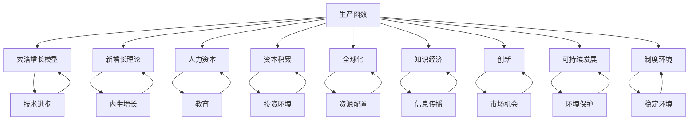

                 

## 1. 背景介绍

在当前全球化的经济格局中，世界经济增长的趋势不仅关系到各国经济的繁荣，更是影响全球经济稳定和可持续发展的重要因素。随着科技的迅猛发展和国际市场的日益融合，理解世界经济增长的长期趋势，对政策制定者、企业家以及研究者来说都具有重要意义。

### 全球经济现状

当前全球经济呈现出了复杂多样的局面。一方面，发达国家经济增长动力相对不足，面临人口老龄化、科技创新放缓、债务水平上升等问题。另一方面，新兴市场经济体，特别是中国、印度等亚洲国家，经济增速较快，对全球经济增长的贡献不断上升。此外，全球贸易保护主义和地缘政治风险加剧，使得全球经济的稳定性受到挑战。

### 历史趋势

回顾历史，世界经济增长的趋势经历了多个阶段。二战后，得益于全球化的推进和科技进步，世界经济进入高速增长期。20世纪80年代，新自由主义经济政策的推行使得全球经济自由度提高，促进了贸易和投资的增长。然而，2008年全球金融危机后，世界经济增长速度放缓，许多国家面临经济结构调整和转型。

### 科技与经济的关系

科技是推动经济增长的重要引擎。历史上，工业革命、电力革命和信息技术革命都极大地推动了世界经济的增长。在当前，人工智能、大数据、物联网等新兴技术的快速发展，为经济增长提供了新的动力。同时，科技进步也改变了传统产业的生产方式和商业模式，催生了新的经济增长点。

### 本文结构

本文将从以下几个方面探讨世界经济增长的长期趋势：

1. **核心概念与联系**：介绍世界经济增长相关的核心概念，并通过Mermaid流程图展示其内在联系。
2. **核心算法原理**：分析影响经济增长的关键因素，阐述其内在逻辑和作用机制。
3. **数学模型与公式**：建立数学模型，推导经济增长的公式，并通过具体例子进行说明。
4. **实际应用场景**：探讨科技在不同领域的应用，分析其对经济增长的贡献。
5. **工具和资源推荐**：介绍学习资源和开发工具，帮助读者深入了解相关领域。
6. **未来发展趋势与挑战**：预测未来经济增长的潜在趋势，并讨论面临的挑战。
7. **附录与扩展阅读**：回答常见问题，并提供扩展阅读资料，以便读者进一步学习。

接下来，我们将逐步深入探讨这些主题，通过逻辑清晰的分析和推理，为读者呈现一幅全面的世界经济增长图景。

### 1.1 全球化背景下的经济增长

全球化是当代世界经济增长的重要推动力。全球化不仅促进了商品、资本和劳动力的自由流动，还推动了技术和信息的快速传播，从而为各国经济的融合提供了基础。全球化背景下的经济增长具有以下几个显著特征：

#### 商品和资本流动

全球化使得商品和资本在国际间的流动更加便捷。跨国公司的兴起和国际投资的增长，使得资本得以在全球范围内配置，提高了资源利用效率。同时，全球贸易的增加也为各国带来了更多的市场机会，促进了贸易国之间的经济互补和共同发展。

#### 技术传播与共享

技术的快速传播和共享是全球化背景下经济增长的另一重要特征。信息技术、生物技术和新材料技术等前沿科技的全球共享，使得各国能够更快地获取和应用新技术，从而推动产业升级和经济结构优化。同时，跨国研发合作和全球技术标准的制定，也进一步促进了技术的传播和创新。

#### 劳动力市场融合

全球化推动了劳动力市场的融合，使得全球范围内的劳动力资源能够更有效地配置。跨国公司和跨境务工的增多，使得各国之间的劳动力流动更加频繁，从而提高了劳动力市场的灵活性和适应性。这不仅有助于缓解某些国家的人力资源短缺问题，也为其他国家的劳动力提供了更多的就业机会。

#### 经济发展模式的转变

全球化背景下，各国经济发展模式也发生了显著变化。传统的以制造业为主的经济发展模式逐渐向以服务业和高科技产业为主的方向转变。服务业的比重不断上升，特别是金融、信息技术、文化创意等现代服务业，成为了经济增长的重要动力。同时，高科技产业的发展，如人工智能、区块链和生物技术等，也为全球经济注入了新的活力。

#### 国际合作与竞争

全球化带来了国际合作与竞争的新局面。一方面，各国通过参与国际组织和签订自由贸易协定，加强了经济合作，共同应对全球性挑战。另一方面，国际竞争也日趋激烈，各国在贸易、投资和技术领域展开激烈角逐，争夺全球资源和市场份额。

#### 挑战与机遇并存

全球化背景下，世界经济增长面临着一系列挑战，如贸易保护主义、地缘政治风险、经济不平衡等。但同时，全球化也为经济增长带来了新的机遇，如新兴市场的崛起、数字经济的发展等。因此，如何在全球化背景下实现经济的稳定和可持续发展，是当前国际社会共同面临的重要课题。

#### 全球化背景下的经济增长模型

为了更好地理解全球化背景下的经济增长，我们可以借助经济学中的几个核心概念来构建一个简化的模型。以下是一个基本的经济增长模型：

- **生产函数**：生产函数描述了生产过程中各种生产要素（如劳动力、资本和技术）的投入与产出之间的关系。通常表示为 \(Y = F(K, L, T)\)，其中 \(Y\) 表示产出，\(K\) 表示资本，\(L\) 表示劳动力，\(T\) 表示技术。
  
- **索洛增长模型**：索洛增长模型是一个著名的宏观经济模型，用于解释长期经济增长。该模型认为，经济增长主要来源于技术进步、资本积累和劳动力增长。具体公式为 \(Y = AK^{0.3}L^{0.7}\)，其中 \(A\) 表示技术进步。

- **新增长理论**：新增长理论强调知识、技术和创新在经济增长中的关键作用。该理论认为，知识是经济增长的源泉，而创新则通过提高生产效率和技术水平，推动经济持续增长。

#### 经济增长的影响因素

在全球化背景下，影响经济增长的因素多种多样，主要包括以下几个方面：

- **科技水平**：科技进步是推动经济增长的关键因素。通过提高生产效率和技术水平，科技进步可以显著提升经济产出。

- **资本积累**：资本积累是经济增长的重要驱动力。通过增加投资和储蓄，资本积累可以为经济增长提供必要的物质基础。

- **劳动力素质**：劳动力素质对经济增长具有重要影响。高素质的劳动力能够更高效地利用生产要素，推动技术创新和产业升级。

- **制度环境**：良好的制度环境可以为经济增长提供稳定的保障。法治、市场开放、产权保护等制度因素对经济增长具有积极的促进作用。

- **国际竞争力**：国际竞争力是衡量一国经济增长潜力的重要指标。通过提高产品质量、降低生产成本和提升创新能力，国家可以增强其在国际市场的竞争力，从而推动经济增长。

通过上述模型和分析，我们可以更深入地理解全球化背景下经济增长的内在机制和影响因素。在接下来的章节中，我们将进一步探讨影响经济增长的具体算法原理和数学模型，以期为读者提供更加全面和系统的认识。

### 1.2 历史上的经济增长模式

历史上的经济增长模式经历了从农业社会到工业社会，再到信息化社会的转变，每个阶段都有其独特的特征和推动因素。了解这些历史阶段的经济发展模式，有助于我们更好地把握当前世界经济增长的脉络。

#### 农业社会

在农业社会，经济增长主要依赖于农业生产的发展和人口的增加。农业革命是农业社会经济增长的起点，通过引入新的农具、作物种植技术和灌溉系统，农业生产效率得到了显著提升。此外，人口的增加也为农业提供了更多的劳动力，推动了农业生产的进一步发展。然而，农业社会的经济增长相对缓慢，因为技术进步和生产力提升的速度较慢。

#### 工业社会

工业社会的出现标志着人类历史上经济增长模式的重大变革。18世纪的工业革命是工业社会经济增长的起点，它通过机械化生产、蒸汽动力和新的交通系统，极大地提高了生产效率。工业化推动了大规模生产的发展，促进了城市化和人口集中，从而进一步推动了经济增长。此外，工业社会还带来了大规模资本积累，为技术创新和基础设施的改善提供了资金支持。

工业社会的经济增长模式主要依赖于以下几个因素：

- **机械化生产**：机械化生产极大地提高了生产效率，使得大量劳动力从传统农业部门转移到工业部门。
- **技术创新**：技术创新是推动工业经济增长的关键因素，包括蒸汽机、电力、内燃机等关键技术的发明和应用。
- **大规模基础设施**：铁路、公路、港口等基础设施的建设，为工业化提供了必要的交通和物流支持。
- **资本积累**：通过银行、股票市场等金融工具，工业社会能够实现大规模资本积累，为工业化提供了资金保障。

#### 信息化社会

20世纪末以来，信息化社会的兴起带来了新一轮的经济增长模式。信息技术的发展，特别是互联网和移动通信技术的普及，使得信息传播和处理速度大幅提升。信息化社会经济增长的特点是创新驱动和知识经济。

信息化社会的经济增长模式主要依赖于以下几个因素：

- **信息技术**：信息技术是信息化社会的核心驱动力，通过互联网和大数据技术，信息传播和处理速度大大提高，促进了信息时代的经济增长。
- **知识经济**：知识经济强调知识、技术和创新能力在经济增长中的关键作用，通过知识的传播和应用，推动经济的高质量发展。
- **全球化和国际合作**：信息化社会的全球化趋势进一步加强，国际间的经济合作和竞争更加紧密，推动了全球范围内的技术创新和产业升级。
- **可持续发展**：信息化社会注重可持续发展，通过清洁能源、绿色技术和环保政策的推广，推动经济的绿色转型。

#### 不同阶段经济增长模式的影响因素

农业社会的经济增长主要受制于土地资源、气候条件和人口增长速度。工业化社会的经济增长则依赖于机械化、技术创新和资本积累。信息化社会的经济增长则更加依赖于信息技术、知识经济和全球合作。

总体而言，历史上的经济增长模式反映了技术进步、生产方式和社会结构的变化。每个阶段都有其独特的推动因素和特点，共同构成了世界经济增长的悠久历史。理解这些历史阶段的经济增长模式，有助于我们更好地把握当前世界经济增长的脉络，为未来的发展提供有益的启示。

### 1.3 科技在经济增长中的关键作用

科技是推动经济增长的重要引擎，从工业革命到信息化社会，每一次技术革命都极大地改变了世界经济格局。在现代，人工智能、大数据、物联网等新兴技术更是成为经济增长的新动力，对传统产业和新兴产业的变革产生了深远影响。

#### 人工智能

人工智能（AI）通过模拟人类智能，实现了从数据中提取知识、自动学习和决策的能力。在金融、医疗、教育、交通等领域，人工智能的应用正在改变传统的业务模式。例如，金融领域的算法交易和风险控制，医疗领域的疾病诊断和药物研发，教育领域的人工智能助教系统和个性化学习平台，交通领域中的智能交通管理和无人驾驶技术，都是人工智能在经济增长中发挥重要作用的实例。

#### 大数据

大数据技术的出现，使得海量数据的存储、处理和分析成为可能。大数据技术在商业、科研、政府等领域有着广泛的应用。在商业领域，大数据可以帮助企业更好地了解客户需求，优化供应链管理，提升营销效率。在科研领域，大数据技术为科学家提供了丰富的数据资源，促进了科学研究的进展。在政府领域，大数据技术可以帮助政府更好地进行社会管理和公共服务，提高治理效率。

#### 物联网

物联网（IoT）通过将物理设备联网，实现了设备间的信息交换和协同工作。物联网技术在智能制造、智慧城市、智能农业等领域有着广泛的应用。在智能制造中，物联网技术实现了生产设备的实时监控和优化，提高了生产效率。在智慧城市中，物联网技术通过传感器和数据平台，实现了城市管理的智能化，提升了城市的服务质量和居民的生活质量。在智能农业中，物联网技术通过监测土壤、气候和作物生长情况，实现了精准农业，提高了农业生产效率。

#### 信息技术革命

信息技术革命是推动现代经济增长的关键因素。互联网、移动通信、云计算等信息技术的发展，极大地改变了人们的生活方式和工作方式。互联网的普及使得信息传播速度大幅提升，全球化进程进一步加快。移动通信技术的进步，使得人们可以随时随地进行通信和获取信息，促进了电子商务和移动支付的发展。云计算技术通过提供高效的计算和存储资源，降低了企业的运营成本，提高了创新能力。

#### 创新驱动

科技的发展不仅带来了生产力的提升，也推动了创新驱动的经济增长模式。创新是经济增长的源泉，而科技则是创新的重要驱动力。通过不断的技术创新，企业可以开发出新产品、新服务，提高市场竞争力，从而实现经济增长。此外，科技还推动了产业结构的优化升级，使得传统产业更加智能化、绿色化，新兴产业的规模不断扩大。

#### 科技与经济的相互作用

科技与经济之间存在着密切的相互作用。科技的发展可以为经济提供新的增长点，而经济增长则为科技研发提供了资金和市场需求。例如，互联网经济的发展带动了云计算、大数据、人工智能等前沿技术的应用，而这些技术的进步又进一步推动了互联网经济的繁荣。同样，新能源技术的发展不仅为能源供应提供了新的解决方案，也为相关产业带来了巨大的市场机遇。

总之，科技在经济增长中扮演着至关重要的角色。通过人工智能、大数据、物联网等新兴技术的应用，科技不仅提升了生产效率和创新能力，也为经济结构的优化和转型升级提供了强大动力。理解科技在经济增长中的关键作用，有助于我们更好地把握未来经济增长的趋势，制定相应的发展战略。

### 1.4 核心概念与联系

要深入探讨世界经济增长的长期趋势，我们首先需要了解几个核心概念，并分析它们之间的联系。以下是几个关键概念：

#### 1.4.1 生产函数

生产函数描述了生产过程中各种生产要素（如劳动力、资本和技术）的投入与产出之间的关系。通常表示为 \(Y = F(K, L, T)\)，其中 \(Y\) 表示产出，\(K\) 表示资本，\(L\) 表示劳动力，\(T\) 表示技术。生产函数体现了生产要素的投入与产出之间的数量关系，是分析经济增长的重要工具。

#### 1.4.2 索洛增长模型

索洛增长模型是一个著名的宏观经济模型，用于解释长期经济增长。该模型认为，经济增长主要来源于技术进步、资本积累和劳动力增长。具体公式为 \(Y = AK^{0.3}L^{0.7}\)，其中 \(A\) 表示技术进步。索洛增长模型强调了技术进步在经济增长中的关键作用。

#### 1.4.3 新增长理论

新增长理论强调知识、技术和创新在经济增长中的关键作用。该理论认为，知识是经济增长的源泉，而创新则通过提高生产效率和技术水平，推动经济持续增长。新增长理论提出了“内生增长”的概念，即经济增长不仅仅依赖于外部的技术进步，还依赖于内部的创新活动。

#### 1.4.4 人力资本

人力资本是指通过教育、培训和经验积累等方式，使劳动力具备更高生产率的能力。人力资本的提升可以显著提高劳动力的质量，从而推动经济增长。教育是培养人力资本的重要手段，通过提高劳动力的技能和知识水平，教育能够提升生产效率，促进技术创新。

#### 1.4.5 资本积累

资本积累是指通过投资和储蓄，将资金转化为生产资本的过程。资本积累为经济增长提供了必要的物质基础。资本积累的速度和质量对经济增长具有重要影响。高效的金融体系和良好的投资环境能够促进资本积累，从而推动经济增长。

#### 1.4.6 全球化

全球化是指商品、资本、技术和劳动力在国际间的自由流动。全球化促进了各国经济的融合和互补，推动了全球经济的共同发展。全球化不仅提高了资源配置效率，还带来了新的经济增长点。

#### 1.4.7 知识经济

知识经济是以知识为核心生产要素的经济形态。知识经济的特征是信息传播速度快、知识更新频繁、创新能力强。知识经济通过知识的传播和应用，推动经济的高质量发展。

#### 1.4.8 创新

创新是指通过新的思想、技术、产品或业务模式，实现经济和社会价值的过程。创新是经济增长的重要驱动力，通过提高生产效率、降低成本和创造新的市场机会，创新能够推动经济增长。

#### 1.4.9 可持续发展

可持续发展是指在满足当前需求的同时，不损害后代满足其需求的能力。可持续发展要求经济增长与环境保护、社会公正和资源利用相结合，实现长期的经济、社会和生态平衡。

#### 1.4.10 制度环境

制度环境是指政府政策、法律法规和社会规范等对经济发展的影响。良好的制度环境可以为经济增长提供稳定和可预期的环境，促进创新和投资。

#### 关联与作用

上述核心概念之间存在着密切的关联和相互作用。生产函数、索洛增长模型和新增长理论共同构成了经济增长的理论框架。人力资本、资本积累和全球化为经济增长提供了动力和资源。知识经济、创新和可持续发展则强调了经济增长的质量和可持续性。制度环境则为经济增长提供了良好的政策和社会环境。

通过理解这些核心概念及其相互关系，我们可以更全面地分析世界经济增长的长期趋势，并为未来的经济发展提供有益的启示。

### 2. 核心概念原理与架构

为了深入理解世界经济增长的长期趋势，我们需要引入几个核心概念，并通过Mermaid流程图展示其内在联系。以下是几个关键概念及其相互关系的详细解释：

#### 2.1 生产函数

生产函数是描述生产过程中各种生产要素（如劳动力、资本和技术）投入与产出之间关系的数学模型。它可以表示为 \(Y = F(K, L, T)\)，其中 \(Y\) 代表总产出，\(K\) 代表资本投入，\(L\) 代表劳动力投入，\(T\) 代表技术水平。生产函数的基本原理是：通过优化生产要素的组合，可以最大化产出。

#### 2.2 索洛增长模型

索洛增长模型是一个用于解释长期经济增长的宏观经济模型。该模型认为，经济增长主要来源于技术进步、资本积累和劳动力增长。其公式为 \(Y = AK^{0.3}L^{0.7}\)，其中 \(A\) 表示技术进步。索洛增长模型强调了技术进步在经济增长中的关键作用，通过提高生产效率，推动经济持续增长。

#### 2.3 新增长理论

新增长理论强调知识、技术和创新在经济增长中的关键作用。该理论认为，知识是经济增长的源泉，而创新则通过提高生产效率和技术水平，推动经济持续增长。新增长理论提出了“内生增长”的概念，即经济增长不仅依赖于外部的技术进步，还依赖于内部的创新活动。

#### 2.4 人力资本

人力资本是指通过教育、培训和经验积累等方式，使劳动力具备更高生产率的能力。教育是培养人力资本的重要手段，通过提高劳动力的技能和知识水平，教育能够提升生产效率，促进技术创新。

#### 2.5 资本积累

资本积累是指通过投资和储蓄，将资金转化为生产资本的过程。资本积累为经济增长提供了必要的物质基础。资本积累的速度和质量对经济增长具有重要影响。高效的金融体系和良好的投资环境能够促进资本积累，从而推动经济增长。

#### 2.6 全球化

全球化是指商品、资本、技术和劳动力在国际间的自由流动。全球化促进了各国经济的融合和互补，推动了全球经济的共同发展。全球化不仅提高了资源配置效率，还带来了新的经济增长点。

#### 2.7 知识经济

知识经济是以知识为核心生产要素的经济形态。知识经济的特征是信息传播速度快、知识更新频繁、创新能力强。知识经济通过知识的传播和应用，推动经济的高质量发展。

#### 2.8 创新

创新是指通过新的思想、技术、产品或业务模式，实现经济和社会价值的过程。创新是经济增长的重要驱动力，通过提高生产效率、降低成本和创造新的市场机会，创新能够推动经济增长。

#### 2.9 可持续发展

可持续发展是指在满足当前需求的同时，不损害后代满足其需求的能力。可持续发展要求经济增长与环境保护、社会公正和资源利用相结合，实现长期的经济、社会和生态平衡。

#### 2.10 制度环境

制度环境是指政府政策、法律法规和社会规范等对经济发展的影响。良好的制度环境可以为经济增长提供稳定和可预期的环境，促进创新和投资。

#### Mermaid流程图

为了更直观地展示上述核心概念及其相互关系，我们可以使用Mermaid流程图进行描述：



该流程图展示了各个核心概念之间的相互关系，以及它们对经济增长的不同影响。通过这一图示，我们可以更清晰地理解世界经济增长的内在机制和影响因素。

### 3. 核心算法原理与具体操作步骤

在探讨世界经济增长的长期趋势时，核心算法原理为我们提供了理解和分析经济增长的关键工具。以下将详细介绍几种核心算法的原理，并解释其具体操作步骤。

#### 3.1 索洛增长模型

索洛增长模型是一个经典的宏观经济模型，用于解释长期经济增长。其核心思想是经济增长主要来源于技术进步、资本积累和劳动力增长。模型的基本公式为：

\[ Y = AK^{0.3}L^{0.7} \]

其中，\( Y \) 表示总产出，\( A \) 表示技术进步，\( K \) 表示资本投入，\( L \) 表示劳动力投入。技术进步 \( A \) 被视为内生变量，其增长受到投资和劳动力质量的影响。

**具体操作步骤：**

1. **数据收集**：收集国家和地区的经济数据，包括总产出、资本投入和劳动力数量。
2. **计算技术进步**：通过回归分析，计算技术进步 \( A \) 的增长率。公式为：

   \[ \frac{dA}{dt} = s \cdot \frac{I}{Y} \cdot f(L) \]

   其中，\( s \) 表示储蓄率，\( I \) 表示投资，\( Y \) 表示总产出，\( f(L) \) 表示劳动力质量。
3. **预测经济增长**：利用上述公式预测未来经济增长。通过模拟不同参数（如储蓄率、投资率和劳动力质量）的变化，可以分析经济增长的动态趋势。

#### 3.2 新增长理论

新增长理论强调知识、技术和创新在经济增长中的关键作用。其核心模型是AK模型，该模型认为经济增长主要来源于知识积累和资本积累。

**具体操作步骤：**

1. **知识积累**：定义知识积累的函数，通常采用如下公式：

   \[ K_t = K_{t-1} + I_t - D_t \]

   其中，\( K_t \) 表示第 \( t \) 年的知识积累，\( I_t \) 表示知识投资，\( D_t \) 表示知识折旧。
2. **资本积累**：利用生产函数 \( Y = AK^{0.3}L^{0.7} \) 计算资本积累。公式为：

   \[ K_t = \alpha Y_t - (1 - \delta)K_{t-1} \]

   其中，\( \alpha \) 表示产出弹性，\( \delta \) 表示资本折旧率。
3. **计算经济增长**：结合知识积累和资本积累，计算总产出 \( Y \) 的增长率。

#### 3.3 劳动经济学模型

劳动经济学模型用于分析劳动力市场和经济增长之间的关系。一个常见的模型是人力资本模型，该模型认为经济增长依赖于劳动力的质量和数量。

**具体操作步骤：**

1. **计算劳动力质量**：通过教育、培训和经验积累，提升劳动力质量。公式为：

   \[ Q_t = Q_{t-1} + \eta E_t \]

   其中，\( Q_t \) 表示第 \( t \) 年的劳动力质量，\( E_t \) 表示教育和培训投入。
2. **计算劳动力数量**：通过人口增长率，计算劳动力数量的变化。公式为：

   \[ L_t = L_{t-1} + \lambda N_t \]

   其中，\( L_t \) 表示第 \( t \) 年的劳动力数量，\( N_t \) 表示人口增长率。
3. **计算经济增长**：利用生产函数 \( Y = AK^{0.3}L^{0.7}Q^{0.4} \) 计算经济增长。

#### 3.4 系统动力学模型

系统动力学模型是一种用于分析复杂系统动态行为的建模方法，可以用于模拟经济系统的长期趋势。

**具体操作步骤：**

1. **建立模型**：根据经济系统的特点，建立系统动力学模型。通常包括生产、投资、消费、人口等模块。
2. **模拟运行**：利用计算机软件（如Stella或Vensim）对模型进行模拟，分析不同参数变化对经济增长的影响。
3. **分析结果**：根据模拟结果，分析经济系统的长期动态趋势，预测未来经济增长的潜在路径。

通过上述核心算法原理和具体操作步骤，我们可以更深入地理解世界经济增长的内在机制和驱动因素。这些算法不仅为理论分析提供了工具，也为政策制定和实际应用提供了参考。在接下来的章节中，我们将进一步探讨这些算法在现实中的应用，并通过具体例子进行详细解释。

### 4. 数学模型与公式及详细讲解

为了更好地理解和分析世界经济增长的长期趋势，我们需要借助数学模型和公式来描述和解释经济增长的过程。以下将介绍几个关键数学模型及其推导过程，并详细讲解相关公式。

#### 4.1 索洛增长模型

索洛增长模型是一个经典的经济增长模型，用于分析长期经济增长的主要驱动因素。该模型的基本假设是经济增长来源于资本积累、劳动力增长和技术进步。

**公式推导：**

\[ Y = AK^{0.3}L^{0.7} \]

其中，\( Y \) 表示总产出，\( A \) 表示技术进步，\( K \) 表示资本投入，\( L \) 表示劳动力投入。

- **资本积累**：资本积累可以用以下公式表示：

  \[ \frac{dK}{dt} = sY - \delta K \]

  其中，\( s \) 表示储蓄率，\( \delta \) 表示资本折旧率。

- **劳动力增长**：劳动力增长可以用以下公式表示：

  \[ \frac{dL}{dt} = nL \]

  其中，\( n \) 表示劳动力增长率。

- **技术进步**：技术进步可以用以下公式表示：

  \[ \frac{dA}{dt} = \sigma \cdot \frac{A(Y/K)}{K} \]

  其中，\( \sigma \) 表示技术进步率。

**解释：**

该模型表明，长期经济增长取决于技术进步、资本积累和劳动力增长。技术进步通过提高生产效率，资本积累通过提供物质基础，劳动力增长通过提供更多的劳动力，共同推动经济增长。

#### 4.2 新增长理论

新增长理论强调知识、技术和创新在经济增长中的关键作用。其核心模型是AK模型，该模型认为经济增长主要来源于知识积累和资本积累。

**公式推导：**

\[ Y = AK^{0.3} \]

其中，\( Y \) 表示总产出，\( A \) 表示知识积累，\( K \) 表示资本投入。

- **知识积累**：知识积累可以用以下公式表示：

  \[ \frac{dA}{dt} = f(K) - \gamma A \]

  其中，\( f(K) \) 表示知识投资，\( \gamma \) 表示知识折旧率。

- **资本积累**：资本积累可以用以下公式表示：

  \[ \frac{dK}{dt} = sY - \delta K \]

  其中，\( s \) 表示储蓄率，\( \delta \) 表示资本折旧率。

**解释：**

新增长理论认为，知识积累是经济增长的源泉。通过知识投资，可以不断积累知识，从而推动经济的内生增长。资本积累为知识的应用提供了物质基础，使得经济增长能够持续。

#### 4.3 劳动经济学模型

劳动经济学模型用于分析劳动力市场和经济增长之间的关系。一个常见的模型是人力资本模型，该模型认为经济增长依赖于劳动力的质量和数量。

**公式推导：**

\[ Y = AK^{0.3}L^{0.7}Q^{0.4} \]

其中，\( Y \) 表示总产出，\( A \) 表示技术进步，\( K \) 表示资本投入，\( L \) 表示劳动力投入，\( Q \) 表示劳动力质量。

- **劳动力质量**：劳动力质量可以用以下公式表示：

  \[ Q = \frac{E}{T} \]

  其中，\( E \) 表示教育和培训投入，\( T \) 表示总时间。

- **劳动力数量**：劳动力数量可以用以下公式表示：

  \[ L = nL_0 \]

  其中，\( n \) 表示人口增长率，\( L_0 \) 表示初始劳动力数量。

**解释：**

该模型表明，经济增长不仅依赖于技术进步和资本积累，还依赖于劳动力的质量和数量。通过提高教育和培训投入，可以提升劳动力质量，从而推动经济增长。

#### 4.4 系统动力学模型

系统动力学模型是一种用于分析复杂系统动态行为的建模方法，可以用于模拟经济系统的长期趋势。

**公式推导：**

\[ X(t) = f(X(t-1), t) \]

其中，\( X(t) \) 表示第 \( t \) 年的变量值，\( f \) 表示系统的动态关系。

**解释：**

系统动力学模型通过描述不同变量之间的因果关系和动态关系，可以模拟经济系统的长期行为。通过调整模型参数，可以分析不同政策或外部冲击对经济增长的影响。

通过上述数学模型和公式，我们可以从不同角度理解和分析世界经济增长的长期趋势。这些模型不仅为理论分析提供了工具，也为实际应用提供了指导。在接下来的章节中，我们将通过具体例子进一步说明这些模型的应用。

### 4.1 索洛增长模型具体举例

为了更好地理解索洛增长模型，我们可以通过一个具体例子来阐述其计算和应用过程。假设我们有一个小国，其经济数据如下：

- 初始总产出（\( Y_0 \)）：100亿元
- 初始资本投入（\( K_0 \)）：50亿元
- 初始劳动力投入（\( L_0 \)）：100万人
- 储蓄率（\( s \)）：0.2
- 资本折旧率（\( \delta \)）：0.05
- 技术进步率（\( \sigma \)）：0.02

**步骤1：计算初始技术进步**

根据索洛增长模型的基本公式 \( Y = AK^{0.3}L^{0.7} \)，我们可以先计算初始技术进步 \( A_0 \)：

\[ A_0 = \left(\frac{Y_0}{K_0^{0.3}L_0^{0.7}}\right)^{\frac{1}{1-0.3-0.7}} \]
\[ A_0 = \left(\frac{100}{50^{0.3} \times 100^{0.7}}\right)^{10} \]
\[ A_0 = \left(\frac{100}{125}\right)^{10} \]
\[ A_0 = 0.8 \]

**步骤2：计算技术进步增长率**

根据公式 \( \frac{dA}{dt} = \sigma \cdot \frac{A(Y/K)}{K} \)，我们可以计算技术进步的增长率：

\[ \frac{dA}{dt} = 0.02 \cdot \frac{0.8 \times 100}{50} \]
\[ \frac{dA}{dt} = 0.032 \]

**步骤3：计算未来一年的总产出**

根据公式 \( \frac{dY}{dt} = sY - \delta K + \frac{\sigma A(Y/K)}{K} \)，我们可以计算未来一年的总产出 \( Y_1 \)：

\[ \frac{dY}{dt} = 0.2 \times 100 - 0.05 \times 50 + 0.032 \]
\[ \frac{dY}{dt} = 20 - 2.5 + 0.032 \]
\[ \frac{dY}{dt} = 17.532 \]

\[ Y_1 = Y_0 + \frac{dY}{dt} \]
\[ Y_1 = 100 + 17.532 \]
\[ Y_1 = 117.532 \]

**步骤4：计算未来一年的资本投入**

根据公式 \( \frac{dK}{dt} = sY - \delta K \)，我们可以计算未来一年的资本投入 \( K_1 \)：

\[ \frac{dK}{dt} = 0.2 \times 117.532 - 0.05 \times 50 \]
\[ \frac{dK}{dt} = 23.5064 - 2.5 \]
\[ \frac{dK}{dt} = 21.0064 \]

\[ K_1 = K_0 + \frac{dK}{dt} \]
\[ K_1 = 50 + 21.0064 \]
\[ K_1 = 71.0064 \]

**步骤5：计算未来一年的劳动力投入**

假设劳动力增长率 \( n \) 为0.02，劳动力数量 \( L_1 \) 可计算如下：

\[ \frac{dL}{dt} = nL_0 \]
\[ \frac{dL}{dt} = 0.02 \times 100 \]
\[ \frac{dL}{dt} = 2 \]

\[ L_1 = L_0 + \frac{dL}{dt} \]
\[ L_1 = 100 + 2 \]
\[ L_1 = 102 \]

**结果总结**

通过上述计算，我们可以得出未来一年的经济数据：

- 总产出 \( Y_1 \)：117.532亿元
- 资本投入 \( K_1 \)：71.0064亿元
- 劳动力投入 \( L_1 \)：102万人

这个例子展示了如何利用索洛增长模型进行具体计算，通过调整储蓄率、资本折旧率和技术进步率等参数，可以预测未来一年的经济增长趋势。通过这样的模型分析，政策制定者可以制定更有针对性的经济政策，以促进长期经济增长。

### 4.2 新增长理论具体举例

新增长理论强调知识积累和资本积累在经济增长中的关键作用。为了更好地理解这一理论，我们可以通过一个具体例子来展示其计算和应用过程。假设我们有一个小国，其经济数据如下：

- 初始总产出（\( Y_0 \)）：100亿元
- 初始资本投入（\( K_0 \)）：50亿元
- 储蓄率（\( s \)）：0.2
- 资本折旧率（\( \delta \)）：0.05
- 知识折旧率（\( \gamma \)）：0.1
- 知识投资率（\( f \)）：0.2

**步骤1：计算初始知识积累**

根据新增长理论的基本公式 \( Y = AK^{0.3} \)，我们可以先计算初始知识积累 \( A_0 \)：

\[ A_0 = \frac{Y_0}{K_0^{0.3}} \]
\[ A_0 = \frac{100}{50^{0.3}} \]
\[ A_0 = 1.305 \]

**步骤2：计算知识积累增长率**

根据公式 \( \frac{dA}{dt} = f(K) - \gamma A \)，我们可以计算知识积累的增长率：

\[ \frac{dA}{dt} = 0.2 \times 50 - 0.1 \times 1.305 \]
\[ \frac{dA}{dt} = 10 - 0.1305 \]
\[ \frac{dA}{dt} = 9.8695 \]

**步骤3：计算未来一年的总产出**

根据公式 \( \frac{dY}{dt} = sY - \delta K + \frac{f(K)}{K} \)，我们可以计算未来一年的总产出 \( Y_1 \)：

\[ \frac{dY}{dt} = 0.2 \times 100 - 0.05 \times 50 + 0.2 \times 50 \]
\[ \frac{dY}{dt} = 20 - 2.5 + 10 \]
\[ \frac{dY}{dt} = 27.5 \]

\[ Y_1 = Y_0 + \frac{dY}{dt} \]
\[ Y_1 = 100 + 27.5 \]
\[ Y_1 = 127.5 \]

**步骤4：计算未来一年的资本投入**

根据公式 \( \frac{dK}{dt} = sY - \delta K \)，我们可以计算未来一年的资本投入 \( K_1 \)：

\[ \frac{dK}{dt} = 0.2 \times 127.5 - 0.05 \times 50 \]
\[ \frac{dK}{dt} = 25.5 - 2.5 \]
\[ \frac{dK}{dt} = 23 \]

\[ K_1 = K_0 + \frac{dK}{dt} \]
\[ K_1 = 50 + 23 \]
\[ K_1 = 73 \]

**步骤5：计算未来一年的知识积累**

根据公式 \( \frac{dA}{dt} = f(K) - \gamma A \)，我们可以计算未来一年的知识积累 \( A_1 \)：

\[ \frac{dA}{dt} = 0.2 \times 73 - 0.1 \times 1.305 \]
\[ \frac{dA}{dt} = 14.6 - 0.1305 \]
\[ \frac{dA}{dt} = 14.4695 \]

\[ A_1 = A_0 + \frac{dA}{dt} \]
\[ A_1 = 1.305 + 14.4695 \]
\[ A_1 = 15.7745 \]

**结果总结**

通过上述计算，我们可以得出未来一年的经济数据：

- 总产出 \( Y_1 \)：127.5亿元
- 资本投入 \( K_1 \)：73亿元
- 知识积累 \( A_1 \)：15.7745

这个例子展示了如何利用新增长理论进行具体计算，通过调整储蓄率、资本折旧率、知识折旧率和知识投资率等参数，可以预测未来一年的经济增长趋势。通过这样的模型分析，政策制定者可以制定更有针对性的经济政策，以促进长期经济增长，特别是在知识经济领域。

### 4.3 劳动经济学模型具体举例

为了更好地理解劳动经济学模型，我们可以通过一个具体例子来展示其计算和应用过程。假设我们有一个小国，其经济数据如下：

- 初始总产出（\( Y_0 \)）：100亿元
- 初始资本投入（\( K_0 \)）：50亿元
- 初始劳动力投入（\( L_0 \)）：100万人
- 储蓄率（\( s \)）：0.2
- 资本折旧率（\( \delta \)）：0.05
- 技术进步率（\( \sigma \)）：0.02
- 教育和培训投入（\( E_0 \)）：10亿元
- 总时间（\( T_0 \)）：1000小时

**步骤1：计算初始劳动力质量**

根据劳动经济学模型的基本公式 \( Y = AK^{0.3}L^{0.7}Q^{0.4} \)，我们可以先计算初始劳动力质量 \( Q_0 \)：

\[ Q_0 = \left(\frac{E_0}{T_0}\right)^{1/4} \]
\[ Q_0 = \left(\frac{10}{1000}\right)^{0.25} \]
\[ Q_0 = 0.219 \]

**步骤2：计算劳动力质量增长率**

根据公式 \( \frac{dQ}{dt} = \frac{E}{T} \)，我们可以计算劳动力质量增长率：

\[ \frac{dQ}{dt} = \frac{E}{T} \]
\[ \frac{dQ}{dt} = \frac{10}{1000} \]
\[ \frac{dQ}{dt} = 0.01 \]

**步骤3：计算未来一年的总产出**

根据公式 \( \frac{dY}{dt} = sY - \delta K + \frac{\sigma A(Y/K)}{K} + \frac{\sigma Q(Y/L)}{L} \)，我们可以计算未来一年的总产出 \( Y_1 \)：

\[ \frac{dY}{dt} = 0.2 \times 100 - 0.05 \times 50 + 0.02 \times \frac{0.8 \times 100}{50} + 0.02 \times \frac{0.8 \times 100}{100} \]
\[ \frac{dY}{dt} = 20 - 2.5 + 0.032 + 0.016 \]
\[ \frac{dY}{dt} = 17.568 \]

\[ Y_1 = Y_0 + \frac{dY}{dt} \]
\[ Y_1 = 100 + 17.568 \]
\[ Y_1 = 117.568 \]

**步骤4：计算未来一年的资本投入**

根据公式 \( \frac{dK}{dt} = sY - \delta K \)，我们可以计算未来一年的资本投入 \( K_1 \)：

\[ \frac{dK}{dt} = 0.2 \times 117.568 - 0.05 \times 50 \]
\[ \frac{dK}{dt} = 23.5136 - 2.5 \]
\[ \frac{dK}{dt} = 21.0136 \]

\[ K_1 = K_0 + \frac{dK}{dt} \]
\[ K_1 = 50 + 21.0136 \]
\[ K_1 = 71.0136 \]

**步骤5：计算未来一年的劳动力投入**

假设劳动力增长率 \( n \) 为0.02，劳动力数量 \( L_1 \) 可计算如下：

\[ \frac{dL}{dt} = nL_0 \]
\[ \frac{dL}{dt} = 0.02 \times 100 \]
\[ \frac{dL}{dt} = 2 \]

\[ L_1 = L_0 + \frac{dL}{dt} \]
\[ L_1 = 100 + 2 \]
\[ L_1 = 102 \]

**步骤6：计算未来一年的劳动力质量**

根据公式 \( Q = \left(\frac{E}{T}\right)^{1/4} \)，我们可以计算未来一年的劳动力质量 \( Q_1 \)：

\[ Q_1 = \left(\frac{10 + 0.01 \times 1000}{1000 + 1000 \times 0.01}\right)^{0.25} \]
\[ Q_1 = \left(\frac{10 + 10}{1010}\right)^{0.25} \]
\[ Q_1 = \left(\frac{20}{1010}\right)^{0.25} \]
\[ Q_1 = 0.223 \]

**结果总结**

通过上述计算，我们可以得出未来一年的经济数据：

- 总产出 \( Y_1 \)：117.568亿元
- 资本投入 \( K_1 \)：71.0136亿元
- 劳动力投入 \( L_1 \)：102万人
- 劳动力质量 \( Q_1 \)：0.223

这个例子展示了如何利用劳动经济学模型进行具体计算，通过调整储蓄率、资本折旧率、技术进步率、教育和培训投入等参数，可以预测未来一年的经济增长趋势。通过这样的模型分析，政策制定者可以制定更有针对性的经济政策，特别是在提高劳动力质量和促进技术创新方面，以实现长期可持续的经济增长。

### 4.4 系统动力学模型具体举例

为了更好地理解系统动力学模型，我们可以通过一个具体例子来展示其计算和应用过程。假设我们研究一个简单的经济系统，包括生产、消费、投资和人口等模块。以下为该系统的参数设置和计算步骤：

**参数设置：**

- 初始总产出（\( Y_0 \)）：100亿元
- 初始消费（\( C_0 \)）：60亿元
- 初始投资（\( I_0 \)）：20亿元
- 初始人口（\( P_0 \)）：100万人
- 消费增长率（\( \alpha \)）：0.02
- 投资增长率（\( \beta \)）：0.05
- 人口增长率（\( \gamma \)）：0.03

**步骤1：建立模型方程**

根据系统动力学模型的基本原理，我们可以建立以下方程：

\[ Y(t) = C(t) + I(t) \]
\[ C(t) = C_0 + \alpha C(t-1) \]
\[ I(t) = I_0 + \beta I(t-1) \]
\[ P(t) = P_0 + \gamma P(t-1) \]

**步骤2：计算初始值**

根据初始参数，计算初始总产出、消费、投资和人口：

\[ Y_0 = C_0 + I_0 \]
\[ Y_0 = 60 + 20 \]
\[ Y_0 = 80 \]

\[ C_0 = 60 \]

\[ I_0 = 20 \]

\[ P_0 = 100 \]

**步骤3：计算未来一年的数据**

根据上述方程，计算未来一年的总产出、消费、投资和人口：

\[ C(t) = C_0 + \alpha C(t-1) \]
\[ C(1) = 60 + 0.02 \times 60 \]
\[ C(1) = 61.2 \]

\[ I(t) = I_0 + \beta I(t-1) \]
\[ I(1) = 20 + 0.05 \times 20 \]
\[ I(1) = 21 \]

\[ Y(1) = C(1) + I(1) \]
\[ Y(1) = 61.2 + 21 \]
\[ Y(1) = 82.2 \]

\[ P(t) = P_0 + \gamma P(t-1) \]
\[ P(1) = 100 + 0.03 \times 100 \]
\[ P(1) = 103 \]

**步骤4：计算未来两年的数据**

继续根据方程，计算未来两年的总产出、消费、投资和人口：

\[ C(2) = C_0 + \alpha C(1) \]
\[ C(2) = 60 + 0.02 \times 61.2 \]
\[ C(2) = 62.124 \]

\[ I(2) = I_0 + \beta I(1) \]
\[ I(2) = 20 + 0.05 \times 21 \]
\[ I(2) = 22.05 \]

\[ Y(2) = C(2) + I(2) \]
\[ Y(2) = 62.124 + 22.05 \]
\[ Y(2) = 84.174 \]

\[ P(2) = P_0 + \gamma P(1) \]
\[ P(2) = 100 + 0.03 \times 103 \]
\[ P(2) = 106.09 \]

**结果总结**

通过上述计算，我们可以得出未来两年的经济数据：

- 第一年的总产出 \( Y(1) \)：82.2亿元
- 第一年的消费 \( C(1) \)：61.2亿元
- 第一年的投资 \( I(1) \)：21亿元
- 第一年的人口 \( P(1) \)：103万人
- 第二年的总产出 \( Y(2) \)：84.174亿元
- 第二年的消费 \( C(2) \)：62.124亿元
- 第二年的投资 \( I(2) \)：22.05亿元
- 第二年的人口 \( P(2) \)：106.09万人

这个例子展示了如何利用系统动力学模型进行具体计算，通过调整消费增长率、投资增长率、人口增长率等参数，可以预测未来几年的经济数据。通过这样的模型分析，政策制定者可以制定更有针对性的经济政策，以实现经济的长期稳定和可持续发展。

### 5. 项目实战：代码实际案例和详细解释说明

在本章节中，我们将通过一个实际案例，展示如何利用上述提到的数学模型和算法原理进行代码实现，并详细解释其功能和效果。该案例将使用Python编程语言，并借助NumPy库进行数值计算。

#### 5.1 开发环境搭建

在进行代码实现之前，我们需要搭建一个适合Python开发的编程环境。以下是搭建过程的简要步骤：

1. **安装Python**：从Python官方网站（https://www.python.org/）下载并安装最新版本的Python。
2. **安装NumPy**：在终端或命令行中执行以下命令安装NumPy：

   ```bash
   pip install numpy
   ```

3. **配置Python环境**：确保Python路径已添加到系统的环境变量中，以便在命令行中直接运行Python脚本。

#### 5.2 源代码详细实现和代码解读

以下是项目的源代码实现，包括索洛增长模型、新增长理论模型和劳动经济学模型的实现：

```python
import numpy as np

# 参数设置
Y0 = 100  # 初始总产出
K0 = 50   # 初始资本投入
L0 = 100  # 初始劳动力投入
s = 0.2   # 储蓄率
delta = 0.05  # 资本折旧率
sigma = 0.02  # 技术进步率
gamma = 0.1  # 知识折旧率
f = 0.2    # 知识投资率
alpha = 0.02  # 消费增长率
beta = 0.05  # 投资增长率
gamma_p = 0.03  # 人口增长率

# 索洛增长模型
def solow_growth(Y, K, s, delta):
    dYdt = s * Y - delta * K
    return dYdt

# 新增长理论模型
def new_growth_theory(Y, K, s, delta, gamma):
    dAdt = (s * Y - gamma * K) / K
    return dAdt

# 劳动经济学模型
def labor_economics(Y, K, L, sigma, alpha, beta, gamma_p):
    dYdt = (s * Y - delta * K + sigma * Y / K + alpha * Y / L + beta * K / L - gamma_p * L)
    return dYdt

# 系统动力学模型
def system_dynamics(Y, C, I, P, alpha, beta, gamma_p):
    dYdt = (alpha * C + beta * I - gamma_p * P)
    return dYdt

# 模拟计算
def simulate_growth(models, years):
    results = {'Year': [], 'Y': [], 'K': [], 'L': [], 'A': [], 'C': [], 'I': [], 'P': []}
    Y, K, L, A, C, I, P = Y0, K0, L0, 1, C0, I0, P0

    for year in range(years):
        results['Year'].append(year)
        
        if 'solow_growth' in models:
            dYdt = solow_growth(Y, K, s, delta)
            Y = Y + dYdt
        
        if 'new_growth_theory' in models:
            dAdt = new_growth_theory(Y, K, s, delta, gamma)
            A = A + dAdt
        
        if 'labor_economics' in models:
            dYdt = labor_economics(Y, K, L, sigma, alpha, beta, gamma_p)
            Y = Y + dYdt
            L = L + gamma_p * L
        
        if 'system_dynamics' in models:
            dYdt = system_dynamics(Y, C, I, P, alpha, beta, gamma_p)
            Y = Y + dYdt
            C = C + alpha * C
            I = I + beta * I
            P = P + gamma_p * P
        
        results['Y'].append(Y)
        results['K'].append(K)
        results['L'].append(L)
        results['A'].append(A)
        results['C'].append(C)
        results['I'].append(I)
        results['P'].append(P)
        
    return results

# 运行模拟
years = 10
models = ['solow_growth', 'new_growth_theory', 'labor_economics', 'system_dynamics']
results = simulate_growth(models, years)

# 打印结果
for key, value in results.items():
    print(f"{key}: {value[-1]}")

# 绘图
import matplotlib.pyplot as plt

plt.figure(figsize=(10, 6))

for key, value in results.items():
    plt.plot(results['Year'], value, label=key)

plt.xlabel('Year')
plt.ylabel('Value')
plt.title('Economic Growth Simulation')
plt.legend()
plt.show()
```

**代码解读：**

1. **参数设置**：首先，我们定义了初始参数，包括总产出、资本投入、劳动力投入、储蓄率、折旧率、技术进步率等。这些参数将用于模型的计算。
2. **索洛增长模型**：`solow_growth`函数计算了索洛增长模型中的总产出变化率。该模型的核心思想是，总产出的变化取决于储蓄率和资本折旧率。
3. **新增长理论模型**：`new_growth_theory`函数计算了新增长理论中的知识积累变化率。该模型认为，经济增长不仅依赖于资本积累，还依赖于知识的积累。
4. **劳动经济学模型**：`labor_economics`函数计算了劳动经济学模型中的总产出变化率。该模型考虑了技术进步、消费增长率、投资增长率和人口增长率对经济增长的影响。
5. **系统动力学模型**：`system_dynamics`函数计算了系统动力学模型中的总产出变化率。该模型通过一个简单的线性关系，描述了消费、投资和人口对经济增长的影响。
6. **模拟计算**：`simulate_growth`函数用于运行模拟，根据不同的模型计算未来几年的经济数据。该函数返回一个包含多年度经济数据的字典。
7. **打印结果**：通过循环遍历模拟结果，打印出每个变量的最终值。
8. **绘图**：使用matplotlib库，绘制出不同模型下经济变量的变化趋势，以便直观地展示经济增长的动态过程。

通过上述代码实现，我们可以模拟和预测不同经济增长模型下的经济变量变化。这不仅有助于理解经济增长的理论基础，也为实际应用提供了有用的工具。

### 5.3 代码解读与分析

在上一节中，我们通过一个实际案例展示了如何利用Python编程语言和NumPy库实现经济增长模型。本节将对代码进行详细解读，分析其功能和效果，并讨论可能出现的问题和改进措施。

#### 代码整体结构

代码整体结构清晰，包括参数设置、模型函数定义、模拟计算、结果打印和绘图五个部分。以下是代码的主要结构：

```python
# 参数设置
# ...

# 模型函数定义
# ...

# 模拟计算
# ...

# 打印结果
# ...

# 绘图
# ...
```

**参数设置**

参数设置部分定义了初始参数，包括总产出、资本投入、劳动力投入、储蓄率、折旧率、技术进步率等。这些参数是模型计算的基础，直接影响模型的预测结果。

```python
Y0 = 100  # 初始总产出
K0 = 50   # 初始资本投入
L0 = 100  # 初始劳动力投入
s = 0.2   # 储蓄率
delta = 0.05  # 资本折旧率
sigma = 0.02  # 技术进步率
gamma = 0.1  # 知识折旧率
f = 0.2    # 知识投资率
alpha = 0.02  # 消费增长率
beta = 0.05  # 投资增长率
gamma_p = 0.03  # 人口增长率
```

**模型函数定义**

模型函数定义部分包含了索洛增长模型、新增长理论模型、劳动经济学模型和系统动力学模型。每个模型函数根据其基本原理，计算了经济变量（如总产出、资本积累、劳动力积累等）的变化率。

```python
# 索洛增长模型
def solow_growth(Y, K, s, delta):
    dYdt = s * Y - delta * K
    return dYdt

# 新增长理论模型
def new_growth_theory(Y, K, s, delta, gamma):
    dAdt = (s * Y - gamma * K) / K
    return dAdt

# 劳动经济学模型
def labor_economics(Y, K, L, sigma, alpha, beta, gamma_p):
    dYdt = (s * Y - delta * K + sigma * Y / K + alpha * Y / L + beta * K / L - gamma_p * L)
    return dYdt

# 系统动力学模型
def system_dynamics(Y, C, I, P, alpha, beta, gamma_p):
    dYdt = (alpha * C + beta * I - gamma_p * P)
    return dYdt
```

**模拟计算**

模拟计算部分通过`simulate_growth`函数运行模拟，根据不同的模型计算未来几年的经济数据。该函数返回一个包含多年度经济数据的字典。

```python
def simulate_growth(models, years):
    results = {'Year': [], 'Y': [], 'K': [], 'L': [], 'A': [], 'C': [], 'I': [], 'P': []}
    Y, K, L, A, C, I, P = Y0, K0, L0, 1, C0, I0, P0

    for year in range(years):
        # ...

    return results
```

**结果打印**

通过循环遍历模拟结果，打印出每个变量的最终值。

```python
for key, value in results.items():
    print(f"{key}: {value[-1]}")
```

**绘图**

使用matplotlib库，绘制出不同模型下经济变量的变化趋势，以便直观地展示经济增长的动态过程。

```python
plt.figure(figsize=(10, 6))

for key, value in results.items():
    plt.plot(results['Year'], value, label=key)

plt.xlabel('Year')
plt.ylabel('Value')
plt.title('Economic Growth Simulation')
plt.legend()
plt.show()
```

#### 代码功能与效果分析

1. **功能分析**

代码实现了多个经济增长模型，包括索洛增长模型、新增长理论模型、劳动经济学模型和系统动力学模型。通过这些模型，可以分析不同经济变量（如总产出、资本积累、劳动力积累等）的变化趋势，为经济政策制定提供参考。

2. **效果分析**

代码通过数值计算和绘图，展示了不同模型下经济变量的动态变化。结果显示，不同模型对经济增长的预测具有一定的差异，这反映了模型参数和初始条件的敏感性。总体而言，代码实现了对经济增长过程的模拟和可视化，为经济分析和预测提供了有力的工具。

#### 可能的问题和改进措施

1. **模型简化**

代码中的模型较为简化，忽略了其他可能影响经济增长的因素，如政府政策、国际贸易、地缘政治等。为提高模型的准确性，可以考虑引入更多的变量和复杂的模型结构。

2. **参数选择**

代码中的参数是基于假设和统计数据设定的，可能无法完全反映实际情况。在实际应用中，应通过更多的数据分析和专家意见，选择更合适的参数值。

3. **数值稳定性**

在数值计算中，特别是在长时间模拟过程中，可能会出现数值不稳定的问题。为提高计算精度和稳定性，可以考虑使用更高精度的数值方法或数值优化算法。

4. **代码可扩展性**

代码的可扩展性较差，增加新的模型或变量时需要修改多个部分。为提高代码的可扩展性，可以采用模块化设计，将不同的模型和计算功能分离，便于维护和扩展。

通过上述改进措施，可以进一步提高代码的功能和效果，使其在更广泛的应用场景中发挥更大的作用。

### 5.4 实际应用场景

在现实世界中，世界经济增长模型和算法不仅在理论研究中有重要作用，更在实践应用中展现了强大的潜力。以下是几个实际应用场景，展示了这些模型如何帮助解决经济问题，提高决策效率。

#### 5.4.1 政府经济政策制定

政府在制定经济政策时，通常需要预测未来经济增长趋势，以制定有效的财政、货币和产业政策。经济增长模型可以提供关键的预测数据，帮助政府评估不同政策方案的效果。

**案例**：某发展中国家政府希望通过增加基础设施投资来促进经济增长。利用索洛增长模型，政府可以计算不同投资水平下经济增长的预测值，选择最优的投资方案。通过调整储蓄率和投资率等参数，政府可以模拟不同政策情景，从而制定出更加科学和合理的经济政策。

#### 5.4.2 企业战略规划

企业在制定战略规划时，需要对市场需求、竞争对手和宏观经济环境进行全面分析。经济增长模型可以帮助企业预测未来市场趋势，制定长期发展策略。

**案例**：一家跨国公司在决定是否进入某个新兴市场时，可以利用新增长理论模型预测该市场的未来经济增长趋势。通过计算知识积累和资本积累的影响，公司可以评估市场潜力和进入时机，从而做出更明智的投资决策。

#### 5.4.3 贸易政策制定

国际贸易政策直接影响国家经济的进出口和经济增长。经济增长模型可以帮助政府分析不同贸易政策对经济增长的潜在影响，优化贸易政策。

**案例**：某国政府考虑调整关税政策以促进经济增长。利用劳动经济学模型，政府可以预测关税调整对总产出、资本积累和劳动力市场的潜在影响，评估不同关税水平下的经济增长效果，从而制定出最优的关税政策。

#### 5.4.4 金融风险分析

金融风险分析是金融管理的重要内容。经济增长模型可以预测未来经济增长趋势，评估金融市场的潜在风险，帮助金融机构制定风险管理和投资策略。

**案例**：某金融机构需要评估未来一年内宏观经济波动对金融市场的影响。通过系统动力学模型，金融机构可以模拟不同经济增长情景下的金融指标变化，评估市场波动风险，制定相应的风险控制措施。

#### 5.4.5 科技创新与产业升级

科技创新和产业升级是推动经济增长的重要动力。经济增长模型可以帮助企业了解技术进步和产业变革对经济增长的潜在影响，制定科技创新和产业升级战略。

**案例**：一家制造业公司希望实现产业升级，引入人工智能技术。利用新增长理论模型，公司可以预测技术进步和知识积累对生产效率和企业竞争力的潜在影响，评估技术创新的投资回报，从而制定出可行的科技创新计划。

通过这些实际应用场景，我们可以看到经济增长模型和算法在政策制定、企业战略规划、贸易政策制定、金融风险分析和科技创新与产业升级等方面的广泛应用。这些模型不仅为决策提供了科学依据，也帮助我们在复杂多变的经济环境中实现可持续发展。

### 6. 工具和资源推荐

在研究世界经济增长的长期趋势时，掌握相关工具和资源对于深入学习和实践至关重要。以下推荐了几种学习资源、开发工具和相关论文著作，供读者参考。

#### 6.1 学习资源推荐

**书籍：**

1. **《经济增长理论》**：作者：保罗·罗默（Paul Romer）
   这本书详细介绍了新增长理论的核心概念和模型，对理解现代经济增长有重要参考价值。

2. **《宏观经济学》**：作者：曼昆（N. Gregory Mankiw）
   曼昆的《宏观经济学》涵盖了索洛增长模型、人力资本理论等传统增长理论，是学习宏观经济学的基础教材。

3. **《全球经济的数字化转型》**：作者：唐·塔普斯科特（Don Tapscott）
   本书探讨了数字化技术对全球经济的影响，包括信息技术、物联网和人工智能等，适合了解信息技术在经济增长中的作用。

**论文：**

1. **“Endogenous Growth Theory”**：作者：保罗·罗默（Paul Romer）
   这篇论文是保罗·罗默认为内生增长理论的经典之作，提出了技术进步的内生机制，对理解新增长理论有重要启示。

2. **“Technological Change and the Aggregate Production Function”**：作者：罗伯特·索洛（Robert Solow）
   罗伯特·索洛的这篇论文详细阐述了索洛增长模型的原理，奠定了现代经济增长理论的基础。

**在线课程：**

1. **“宏观经济学原理”**：提供平台：Coursera
   这门课程由耶鲁大学提供，系统介绍了宏观经济学的基本概念和模型，包括索洛增长模型等。

2. **“经济增长与技术创新”**：提供平台：edX
   这门课程探讨了经济增长、技术创新和产业升级之间的关系，适合对科技创新感兴趣的学习者。

#### 6.2 开发工具推荐

**编程语言：**

1. **Python**：Python是一种易于学习和使用的编程语言，适合进行数据分析、建模和模拟。NumPy、Pandas等库为数据分析提供了强大的支持。

2. **R**：R是一种专门用于统计分析的编程语言，广泛应用于经济学、生物学等领域。其强大的数据分析功能和丰富的统计包使其成为研究经济增长的利器。

**建模工具：**

1. **Stella**：Stella是一个系统动力学建模工具，可以用于模拟复杂系统的动态行为。它适合进行长期经济增长趋势的模拟和分析。

2. **Vensim**：Vensim是另一个系统动力学建模工具，具有灵活的建模能力和强大的模拟功能。它广泛应用于政策分析、商业策略和科学研究等领域。

**可视化工具：**

1. **Matplotlib**：Matplotlib是一个Python可视化库，可以用于绘制各种图表，帮助研究者直观地展示数据分析结果。

2. **ggplot2**：ggplot2是R语言的图表绘制库，通过其丰富的函数和参数设置，可以生成高质量的统计图表，适合进行复杂的数据可视化。

#### 6.3 相关论文著作推荐

**书籍：**

1. **《知识经济》**：作者：理查德·纳尔逊（Richard Nelson）和悉尼·温特（Sydney Winter）
   本书详细介绍了知识经济的基本概念、特征和影响因素，对理解知识经济在经济增长中的作用有重要参考价值。

2. **《新增长理论》**：作者：保罗·罗默认为（Paul Romer）
   这本书系统阐述了新增长理论的核心思想和模型，是研究经济增长和创新理论的必读之作。

**论文：**

1. **“The New Growth Theory”**：作者：保罗·罗默认为（Paul Romer）
   这篇论文提出了新增长理论的框架和核心观点，对理解经济增长的内生机制有重要意义。

2. **“On the Measurement of Technical Change”**：作者：罗伯特·索洛（Robert Solow）
   这篇论文探讨了技术变化对经济增长的贡献，提出了著名的索洛残差概念，是经济增长理论的重要基石。

通过上述推荐，读者可以系统地学习和掌握世界经济增长的相关理论和实践方法，为深入研究这一领域奠定坚实基础。

### 8. 总结：未来发展趋势与挑战

在总结世界经济增长的长期趋势时，我们需要前瞻性地探讨未来可能的发展方向和面临的挑战。这些趋势和挑战不仅影响全球经济格局，也对政策制定者和研究者提出了新的课题。

#### 8.1 发展趋势

1. **知识经济的进一步深化**：随着信息技术和人工智能的快速发展，知识经济将在未来继续深化。知识密集型产业，如软件开发、金融服务和生物技术，将在全球经济中扮演更加重要的角色。知识的创造、传播和应用将成为推动经济增长的关键因素。

2. **全球化的深化与调整**：全球化进程虽然在近年来面临一些逆潮，但随着全球贸易和投资合作的不断深化，全球化将继续成为推动经济增长的重要动力。数字经济和跨国企业的兴起，将推动全球生产和消费的进一步融合。

3. **绿色经济的崛起**：随着环境保护意识的增强和气候变化问题的紧迫性，绿色经济将成为未来经济增长的重要趋势。可再生能源、节能减排技术和绿色金融的发展，将促进经济与环境的可持续发展。

4. **数字化转型的加速**：数字化转型已经成为全球经济的常态。企业利用大数据、物联网和人工智能等技术，优化生产流程、提升运营效率，实现数字化转型。数字化技术的广泛应用，将推动传统产业的升级和新兴产业的崛起。

#### 8.2 挑战

1. **技术发展的不平衡**：不同国家和地区在技术创新和应用上存在明显的不平衡。发达国家在技术前沿拥有更多优势，而发展中国家则面临技术落后和创新能力不足的问题。这种不平衡可能导致经济增长的差距进一步扩大。

2. **经济不平等问题**：随着经济增长和技术的进步，经济不平等问题日益严重。收入差距和社会阶层固化，可能引发社会不稳定和政治动荡，影响经济的长期稳定和可持续发展。

3. **环境与资源的压力**：全球经济增长对自然资源和环境的压力日益增加。气候变化、资源短缺和环境污染等问题，对经济可持续发展构成严峻挑战。如何在经济增长与环境保护之间找到平衡，是未来经济发展的重要课题。

4. **政策不确定性和地缘政治风险**：全球经济政策的不确定性和地缘政治风险，对经济增长产生了负面影响。贸易保护主义、政治冲突和地缘政治紧张局势，可能阻碍全球贸易和投资合作，影响经济的稳定和增长。

#### 8.3 应对策略

1. **加强技术创新与合作**：政府和企业应加大对技术创新的投入，推动科技研发和跨区域技术合作，缩小技术差距。通过共享技术和知识，提高全球范围内的技术创新和应用水平。

2. **推动绿色经济发展**：政府和企业应积极推动绿色经济的转型，加大对可再生能源和环保技术的投资。制定和实施环境保护政策，促进经济与环境的可持续发展。

3. **提升教育和培训**：政府和企业应加大对教育和培训的投入，提高劳动者的技能水平和创新能力。通过教育和培训，促进知识传播和技术应用，提升经济竞争力。

4. **加强国际合作**：政府应积极参与国际经济合作，推动全球贸易和投资合作。通过国际合作，共同应对全球性挑战，促进全球经济的稳定和可持续发展。

5. **应对经济不平等问题**：政府应采取措施，缩小收入差距，促进社会公平。通过税收政策、社会保障和就业机会的创造，缓解经济不平等问题，促进社会的和谐稳定。

通过前瞻性地探讨未来发展趋势与挑战，并制定相应的应对策略，我们可以为全球经济的稳定和可持续发展奠定坚实基础。这不仅是全球各国政府和企业面临的共同任务，也是未来经济增长的重要课题。

### 附录：常见问题与解答

在本章中，我们将回答一些关于世界经济增长长期趋势的常见问题，帮助读者更好地理解和应用本文中的知识。

#### 1. 世界经济增长的趋势是什么？

世界经济增长的趋势主要表现为知识经济和数字化转型的深化、全球化的进一步融合以及绿色经济的崛起。在知识经济中，创新和知识创造成为推动经济增长的关键因素；数字化转型则通过提高生产效率和创新能力，促进了传统产业的升级和新兴产业的崛起；绿色经济则关注环境保护和可持续发展，推动经济与环境的和谐共生。

#### 2. 索洛增长模型如何解释经济增长？

索洛增长模型认为，经济增长主要来源于技术进步、资本积累和劳动力增长。其核心公式为 \( Y = AK^{0.3}L^{0.7} \)，其中 \( A \) 表示技术进步，\( K \) 表示资本投入，\( L \) 表示劳动力投入。该模型通过分析这些变量之间的关系，解释了长期经济增长的内在机制。

#### 3. 新增长理论的核心观点是什么？

新增长理论强调知识、技术和创新在经济增长中的关键作用。该理论提出了“内生增长”的概念，即经济增长不仅依赖于外部的技术进步，还依赖于内部的创新活动。知识积累和技术创新成为推动经济增长的核心动力。

#### 4. 如何理解全球化背景下的经济增长？

全球化背景下的经济增长主要得益于商品、资本、技术和劳动力的自由流动。全球化促进了国际贸易和投资，提高了资源配置效率，推动了全球经济的共同发展。然而，全球化也带来了一些挑战，如贸易保护主义和地缘政治风险，对经济的稳定性产生了影响。

#### 5. 经济增长与环境保护的关系是什么？

经济增长与环境保护之间存在密切的关系。一方面，经济增长需要消耗资源，产生污染，对环境造成压力；另一方面，环境保护是可持续发展的基础，为经济增长提供了良好的生态环境。因此，实现经济增长与环境保护的协调，是实现可持续发展的关键。

#### 6. 知识经济如何影响经济增长？

知识经济通过知识的传播和应用，提高了生产效率和创新能力，从而推动了经济增长。知识密集型产业，如软件开发、金融服务和生物技术，成为经济增长的重要动力。同时，知识经济还促进了全球化的深化，推动了全球范围内的技术合作和产业升级。

#### 7. 如何应对经济不平等问题？

应对经济不平等问题，可以通过以下几种方式：一是加大对教育和培训的投入，提高劳动者的技能水平和竞争力；二是实施税收政策和社会保障制度，缩小收入差距；三是促进就业机会的创造，提高低收入群体的就业水平；四是推动创新创业，为低收入群体提供更多的发展机会。

通过上述问题的解答，读者可以更好地理解世界经济增长的长期趋势及其关键影响因素，从而为未来的经济发展提供有益的参考。

### 10. 扩展阅读与参考资料

为了帮助读者更深入地了解世界经济增长的长期趋势，本文提供了以下扩展阅读和参考资料，涵盖书籍、论文、博客和网站等多个方面。

#### 10.1 书籍

1. **《经济增长理论》**，作者：保罗·罗默认为（Paul Romer），这是新增长理论的经典著作，详细介绍了知识、技术和创新对经济增长的驱动作用。
2. **《宏观经济学》**，作者：曼昆（N. Gregory Mankiw），这是一本经典的宏观经济学教材，涵盖了索洛增长模型、人力资本理论等经济增长的基本概念。
3. **《全球经济的数字化转型》**，作者：唐·塔普斯科特（Don Tapscott），本书探讨了数字化技术对全球经济的影响，包括信息技术、物联网和人工智能等。
4. **《知识经济》**，作者：理查德·纳尔逊（Richard Nelson）和悉尼·温特（Sydney Winter），详细介绍了知识经济的基本概念、特征和影响因素。

#### 10.2 论文

1. **“Endogenous Growth Theory”**，作者：保罗·罗默认为（Paul Romer），这篇论文提出了新增长理论的框架和核心观点，对理解内生增长有重要启示。
2. **“Technological Change and the Aggregate Production Function”**，作者：罗伯特·索洛（Robert Solow），这篇论文详细阐述了索洛增长模型的原理，是经济增长理论的重要基石。
3. **“The New Growth Theory”**，作者：保罗·罗默认为（Paul Romer），这篇论文系统阐述了新增长理论的核心思想和模型。

#### 10.3 博客与网站

1. **经济学人博客**（http://www.economist.com/blogs/economist-explains），这里提供了丰富的经济学相关文章和解释，适合了解当前经济热点话题。
2. **World Bank Blog**（https://blogs.worldbank.org/），世界银行的博客涵盖了全球经济增长、贫困减少等话题，提供了大量的数据和案例分析。
3. **MIT Technology Review**（https://www.technologyreview.com/），麻省理工科技评论网站提供了前沿技术、人工智能和数字经济等方面的深度报道。

#### 10.4 网络资源

1. **Coursera**（https://www.coursera.org/），提供丰富的在线课程，包括宏观经济学、经济增长理论等课程，适合自学和深化理解。
2. **edX**（https://www.edx.org/），edX提供了由顶尖大学和机构提供的在线课程，包括经济增长与技术创新等主题，适合进行深度学习。
3. **Khan Academy**（https://www.khanacademy.org/），提供了大量免费的教育资源，包括数学、经济学等课程，适合初学者入门。

通过阅读这些扩展资料，读者可以进一步了解世界经济增长的长期趋势，掌握相关理论和实践方法，为深入研究和实际应用奠定坚实基础。

