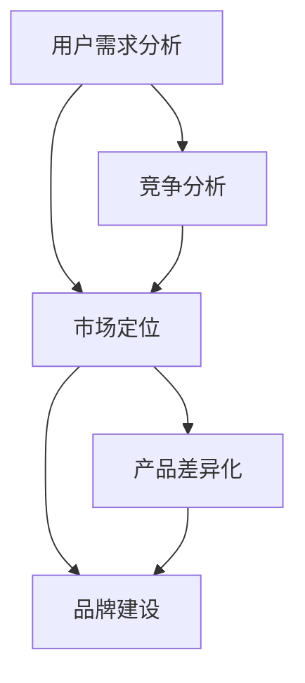

                 

### 背景介绍

在当今竞争激烈的技术市场中，个人开发者要想脱颖而出，提供独特的产品和服务是至关重要的。这种差异化策略不仅能够帮助个人开发者建立品牌影响力，还能够提高用户满意度和忠诚度。本文将深入探讨个人开发者的产品差异化策略，旨在为开发者提供实用的方法和思路。

产品差异化是指通过在产品中引入独特的特性、功能或设计，使其与竞争对手的产品有所区别。这不仅有助于吸引潜在用户，还能在用户心中树立独特的品牌形象。对于个人开发者来说，掌握有效的产品差异化策略，不仅能够增加市场份额，还能在激烈的市场竞争中保持竞争力。

随着技术的快速发展，用户需求也在不断变化。为了满足这些需求，个人开发者需要不断地进行创新和优化，以便在市场中脱颖而出。差异化策略在这个过程中起到了关键作用，它可以帮助开发者发现新的市场机会，提升产品的竞争力，并建立起自己的品牌。

本文将分为以下几个部分进行讨论：

1. **核心概念与联系**：介绍产品差异化策略中的关键概念和它们之间的关系，并通过Mermaid流程图展示。
2. **核心算法原理 & 具体操作步骤**：探讨如何通过核心算法来识别和实施产品差异化策略。
3. **数学模型和公式 & 详细讲解 & 举例说明**：分析差异化策略背后的数学模型和公式，并通过具体案例进行说明。
4. **项目实战：代码实际案例和详细解释说明**：提供一个实际项目案例，展示如何实现产品差异化策略。
5. **实际应用场景**：讨论不同行业和场景中产品差异化策略的应用。
6. **工具和资源推荐**：推荐一些有助于个人开发者实施产品差异化策略的工具和资源。
7. **总结：未来发展趋势与挑战**：总结本文的主要观点，并探讨未来可能的发展趋势和面临的挑战。

通过本文的阅读，希望读者能够对个人开发者的产品差异化策略有更深入的理解，并能够在实际项目中运用这些策略，提升产品的竞争力。

### 核心概念与联系

在讨论个人开发者的产品差异化策略时，有必要首先明确几个核心概念，并探讨它们之间的相互关系。以下是对这些核心概念及其相互关系的介绍，以及一个用Mermaid绘制的流程图。

#### 1. 用户需求分析（User Needs Analysis）

用户需求分析是产品开发过程中的关键步骤，它旨在理解目标用户的需求、偏好和行为。通过深入的用户需求分析，开发者可以识别出用户的核心需求，从而为产品的设计提供方向。用户需求分析不仅包括定量数据，如用户调查和数据分析，还包括定性数据，如用户访谈和观察。

#### 2. 竞争分析（Competitive Analysis）

竞争分析是指对市场上现有的竞争对手及其产品进行详细的研究和分析。通过竞争分析，开发者可以了解竞争对手的优势和劣势，识别市场上的空白点和机会，从而为产品差异化提供依据。

#### 3. 市场定位（Market Positioning）

市场定位是指为产品在目标市场中的定位和形象进行设计的过程。市场定位需要基于用户需求分析和竞争分析的结果，确定产品的独特卖点（Unique Selling Proposition, USP），并制定相应的市场策略。

#### 4. 产品差异化（Product Differentiation）

产品差异化是指通过在产品中引入独特的特性、功能或设计，使其与竞争对手的产品有所区别。产品差异化策略可以是技术层面的，如创新算法或独特的数据处理方法；也可以是功能层面的，如提供额外的服务或更好的用户体验。

#### 5. 品牌建设（Brand Building）

品牌建设是指通过一系列策略和活动来塑造和强化品牌形象。一个强大的品牌能够增加用户对产品的信任和忠诚度，从而在市场中脱颖而出。

#### Mermaid流程图

以下是一个用Mermaid绘制的流程图，展示了上述核心概念及其相互关系：



在这个流程图中，用户需求分析和竞争分析是产品开发的基础，它们共同决定了产品的市场定位。市场定位又直接影响了产品的差异化策略和品牌建设。

通过这个流程图，我们可以清晰地看到，产品差异化策略不仅是一个独立的过程，而是与用户需求分析、竞争分析、市场定位和品牌建设紧密相关的整体。开发者需要综合考虑这些因素，才能制定出有效的产品差异化策略。

### 核心算法原理 & 具体操作步骤

要实现有效的产品差异化策略，核心算法原理是不可或缺的。这些算法帮助开发者识别和利用市场的独特机会，从而创建出与竞争对手显著不同的产品。以下是一些关键算法及其具体操作步骤。

#### 1. SWOT分析

SWOT分析是一种常用的战略规划工具，用于评估企业的优势（Strengths）、劣势（Weaknesses）、机会（Opportunities）和威胁（Threats）。具体操作步骤如下：

- **优势（Strengths）**：识别公司内部的优势，如技术专长、品牌知名度、资源等。
- **劣势（Weaknesses）**：识别公司内部的劣势，如资金不足、技术不足、市场知名度低等。
- **机会（Opportunities）**：识别外部市场环境中的机会，如新的市场需求、技术进步等。
- **威胁（Threats）**：识别外部市场环境中的威胁，如竞争对手、经济变化、法规政策变化等。

**操作步骤**：

1. **数据收集**：收集有关公司内部和外部环境的各种数据，如财务报表、市场调查结果、竞争对手分析等。
2. **数据整理**：将收集到的数据整理成表格或矩阵形式，便于分析。
3. **SWOT分析**：根据整理后的数据，进行SWOT分析，并绘制SWOT矩阵。
4. **制定策略**：根据SWOT分析结果，制定相应的产品差异化策略。

#### 2. 价值网络分析

价值网络分析是一种用于识别产品或服务的价值创造过程及其相关利益相关者的方法。具体操作步骤如下：

- **识别核心价值主张**：确定产品或服务的核心价值主张，即用户为什么购买该产品或服务。
- **绘制价值网络图**：使用Mermaid或其他绘图工具，绘制产品的价值网络图，包括所有与产品或服务相关的利益相关者。
- **分析价值网络**：分析价值网络中的关键环节和利益相关者，识别差异化机会。

**操作步骤**：

1. **定义价值主张**：明确产品或服务的价值主张，即用户从产品或服务中期望获得的核心价值。
2. **绘制价值网络图**：根据价值主张，绘制价值网络图，包括供应商、分销商、用户等。
3. **分析价值网络**：分析价值网络中的每个环节和利益相关者，识别能够提供差异化优势的机会。
4. **制定差异化策略**：根据价值网络分析结果，制定能够实现产品差异化的策略。

#### 3. 数据挖掘

数据挖掘是一种从大量数据中提取有价值信息的方法，可以帮助开发者识别市场趋势和用户行为。具体操作步骤如下：

- **数据收集**：收集相关的市场数据和用户行为数据，如销售数据、用户评论、社交媒体数据等。
- **数据预处理**：对收集到的数据进行清洗、转换和归一化，确保数据质量。
- **数据挖掘**：使用各种数据挖掘算法，如分类、聚类、关联规则等，分析数据，识别有价值的信息。
- **可视化分析**：使用图表、报表等工具，将数据挖掘结果可视化，便于理解和分析。

**操作步骤**：

1. **数据收集**：根据产品差异化需求，选择合适的数据来源，收集相关数据。
2. **数据预处理**：对收集到的数据进行分析，识别和处理缺失值、异常值等。
3. **数据挖掘**：使用数据挖掘工具或库（如Python的scikit-learn库、R语言等），应用各种数据挖掘算法。
4. **可视化分析**：使用数据可视化工具（如Tableau、Power BI等），将挖掘结果可视化，帮助开发者理解数据。
5. **制定差异化策略**：根据数据挖掘结果，识别市场趋势和用户需求，制定能够实现产品差异化的策略。

通过上述核心算法的应用，开发者可以系统地识别和利用市场机会，从而实现产品的有效差异化。这些算法不仅提供了理论支持，还通过具体的操作步骤，帮助开发者将理论转化为实际的产品策略。

### 数学模型和公式 & 详细讲解 & 举例说明

在产品差异化策略中，数学模型和公式扮演着关键角色。它们帮助开发者量化产品差异化的程度，评估策略的有效性，并指导实际操作。以下将介绍几个重要的数学模型和公式，并详细讲解其应用和具体例子。

#### 1. SWOT分析矩阵

SWOT分析矩阵是评估企业内部和外部环境的关键工具。其基本公式为：

\[ \text{SWOT矩阵} = \begin{bmatrix} \text{Strengths} & \text{Weaknesses} & \text{Opportunities} & \text{Threats} \\ \end{bmatrix} \]

**应用示例**：

假设一家科技公司正在进行SWOT分析，结果如下：

- **Strengths**：拥有领先的人工智能技术、优秀的研发团队。
- **Weaknesses**：市场推广不足、资金有限。
- **Opportunities**：新兴市场快速增长、政府政策支持。
- **Threats**：激烈的市场竞争、技术更新速度加快。

通过这个矩阵，公司可以识别出其优势可以用来抓住市场机会，同时注意避免或减轻潜在威胁。

#### 2. 价值网络分析中的效用函数

在价值网络分析中，效用函数用于评估不同策略或产品的价值。其基本公式为：

\[ \text{效用函数} = f(\text{价值主张}, \text{成本}) \]

**应用示例**：

假设一家公司正在评估两种不同的营销策略：

- **策略A**：通过社交媒体推广，成本为10万元，预计增加销售额20万元。
- **策略B**：通过广告投放，成本为20万元，预计增加销售额30万元。

效用函数可以计算为：

\[ f(\text{策略A}) = 20 - 10 = 10 \]
\[ f(\text{策略B}) = 30 - 20 = 10 \]

尽管两种策略的效用相同，但策略B的投入产出比更高，因此可能更具吸引力。

#### 3. 数据挖掘中的关联规则

在数据挖掘中，关联规则用于发现数据之间的潜在关系。其基本公式为：

\[ \text{支持度} = \frac{\text{出现A和B的次数}}{\text{总记录数}} \]
\[ \text{置信度} = \frac{\text{出现A和B的次数}}{\text{出现A的次数}} \]

**应用示例**：

假设分析用户购买数据，发现“购买智能手机”和“购买平板电脑”之间有较高的关联性：

- **支持度**：有1000次购买智能手机的交易，其中500次也购买了平板电脑，总记录数为2000。

\[ \text{支持度} = \frac{500}{2000} = 0.25 \]

- **置信度**：有500次购买智能手机的交易，其中250次也购买了平板电脑。

\[ \text{置信度} = \frac{250}{500} = 0.5 \]

这个关联规则表明，当用户购买智能手机时，有50%的可能性会购买平板电脑，因此可以用于交叉销售策略。

#### 4. 营销组合模型

营销组合模型（4P模型）用于规划营销策略，其基本公式为：

\[ \text{营销组合} = \text{产品} + \text{价格} + \text{促销} + \text{渠道} \]

**应用示例**：

一家公司决定推出一款高端智能手机，采用以下策略：

- **产品**：具有顶级硬件配置和先进的人工智能功能。
- **价格**：定价为5000元，比同类产品高10%。
- **促销**：通过线上广告和社交媒体营销，提高品牌知名度。
- **渠道**：通过在线电商平台和线下体验店进行销售。

通过这个营销组合模型，公司可以确保其产品差异化策略在市场推广中得以全面实施。

通过上述数学模型和公式的应用，开发者可以更科学、系统地制定和评估产品差异化策略，从而在实际操作中取得更好的效果。

### 项目实战：代码实际案例和详细解释说明

为了更好地理解如何实施产品差异化策略，我们将通过一个实际项目案例进行详细讲解。这个案例将展示如何通过代码实现一个具有独特功能的产品，并详细解释每一步的操作。

#### 项目背景

本项目是一款智能推荐系统，目标是为电子商务平台提供个性化商品推荐。该系统需要基于用户行为数据、商品属性和用户偏好，生成高质量的推荐结果，从而提高用户的购物体验和平台的销售额。

#### 项目目标

1. **数据预处理**：清洗和整理用户行为数据，为后续分析做准备。
2. **特征工程**：提取和构建有助于推荐系统性能的特征。
3. **模型训练**：训练推荐模型，并优化模型参数。
4. **系统部署**：将训练好的模型部署到线上环境，提供实时推荐服务。

#### 开发环境搭建

1. **硬件环境**：使用AWS EC2实例，配置4核CPU和16GB内存。
2. **软件环境**：安装Python 3.8、Python虚拟环境（virtualenv）、NumPy、Pandas、scikit-learn、TensorFlow等。

#### 源代码详细实现和代码解读

以下是一个简单的推荐系统实现，重点介绍如何实现数据预处理、特征工程和模型训练。

**1. 数据预处理**

```python
import pandas as pd
from sklearn.model_selection import train_test_split

# 读取数据
data = pd.read_csv('userBehaviorData.csv')

# 数据清洗
data.dropna(inplace=True)
data.drop(['userId'], axis=1, inplace=True)  # 删除用户ID列

# 数据分割
train_data, test_data = train_test_split(data, test_size=0.2, random_state=42)
```

代码解读：
- 读取用户行为数据，并执行基本的清洗操作，如删除缺失值和无关列。
- 使用train_test_split函数将数据分为训练集和测试集，以评估模型性能。

**2. 特征工程**

```python
from sklearn.preprocessing import StandardScaler

# 特征提取
train_data['daysSinceLastPurchase'] = (pd.datetime.now() - train_data['lastPurchaseDate']).dt.days

# 数据标准化
scaler = StandardScaler()
train_data[[-1]] = scaler.fit_transform(train_data[['daysSinceLastPurchase']])
```

代码解读：
- 提取新的特征，如用户自上次购买以来的天数，有助于模型捕捉用户的活跃度。
- 使用StandardScaler对特征进行标准化，提高模型训练的稳定性和效果。

**3. 模型训练**

```python
from sklearn.neighbors import NearestNeighbors

# 初始化推荐模型
model = NearestNeighbors(n_neighbors=5)

# 训练模型
model.fit(train_data[['daysSinceLastPurchase']])
```

代码解读：
- 选择基于相似度的NearestNeighbors算法，用于生成推荐列表。
- 将训练数据输入模型进行训练，生成特征向量。

**4. 推荐系统部署**

```python
from flask import Flask, request, jsonify

app = Flask(__name__)

@app.route('/recommend', methods=['POST'])
def recommend():
    user_data = request.json['userData']
    user_data['daysSinceLastPurchase'] = (pd.datetime.now() - user_data['lastPurchaseDate']).days
    user_data = scaler.transform([user_data])
    recommendations = model.kneighbors(user_data, n_neighbors=5)
    return jsonify(recommendations[1].tolist())
```

代码解读：
- 使用Flask构建一个简单的Web服务，接收用户数据，并返回推荐结果。
- 将用户输入的数据进行特征提取和标准化，生成特征向量。
- 调用模型进行邻居搜索，返回推荐结果。

#### 代码解读与分析

通过上述代码，我们可以看到如何一步步实现一个基于用户行为的智能推荐系统。以下是对关键代码段的详细解读和分析：

1. **数据预处理**：
   - 读取和清洗数据，确保数据质量。
   - 删除无关特征，如用户ID，以简化模型训练。
   - 数据分割为训练集和测试集，用于评估模型性能。

2. **特征工程**：
   - 提取新的特征，如用户自上次购买以来的天数，增强模型对用户行为变化的捕捉能力。
   - 对特征进行标准化，以消除不同特征之间的尺度差异，提高模型训练效果。

3. **模型训练**：
   - 选择NearestNeighbors算法，基于用户行为特征进行邻居搜索，生成推荐列表。
   - 训练模型，将特征向量映射到推荐结果。

4. **系统部署**：
   - 使用Flask构建Web服务，提供实时推荐接口。
   - 接收用户输入的数据，进行特征提取和标准化，生成特征向量。
   - 调用模型进行邻居搜索，返回推荐结果。

通过这个实际项目案例，我们展示了如何通过代码实现产品差异化策略。这不仅帮助我们理解了推荐系统的原理和实现步骤，也为开发者在实际项目中应用产品差异化策略提供了实用的指导。

### 实际应用场景

产品差异化策略在各个行业和场景中的应用各具特色，以下将探讨几个典型的应用场景，展示如何在不同领域中通过产品差异化策略提升竞争力。

#### 1. 科技行业

在科技行业，创新是关键。个人开发者可以通过开发具有独特功能的应用程序或服务，如人工智能助手、区块链解决方案等，来吸引目标用户。例如，某个人开发者开发了一款基于自然语言处理（NLP）技术的智能客服系统，它不仅能够理解用户的语音指令，还能根据用户的历史交互记录进行个性化推荐，这一创新功能使其在市场上脱颖而出。

#### 2. 零售行业

零售行业竞争激烈，个人开发者可以通过提供个性化购物体验来吸引顾客。例如，一个开发者可以创建一个基于用户行为数据的个性化推荐引擎，根据用户的购物历史和偏好推荐商品。这样的个性化服务能够提高用户的购买转化率和满意度。

#### 3. 教育行业

在教育行业，个人开发者可以通过提供创新的在线学习平台来满足用户需求。例如，某开发者创建了一个结合虚拟现实（VR）和增强现实（AR）技术的在线学习平台，让学生能够在虚拟环境中进行互动式学习，这种新颖的学习体验显著提高了学生的学习兴趣和效果。

#### 4. 医疗健康行业

在医疗健康行业，个人开发者可以通过开发具有独特功能的医疗设备或应用程序来提供更好的医疗服务。例如，一个开发者可以开发一款能够实时监测用户健康状况的手环，并通过手机应用提供个性化的健康建议和预警。这种实时监控和个性化服务的功能有助于提升用户的健康水平。

#### 5. 金融科技行业

在金融科技行业，个人开发者可以通过提供创新的金融产品和服务来吸引客户。例如，一个开发者可以开发一款基于人工智能的风险管理工具，能够根据用户的历史交易数据和偏好提供个性化的风险控制策略。这种个性化的风险管理服务能够提高用户的信任度和满意度。

#### 6. 社交媒体行业

在社交媒体行业，个人开发者可以通过提供独特的内容创作工具来吸引用户。例如，一个开发者可以开发一款能够实时生成动态效果的短视频编辑工具，帮助用户轻松创作有趣的内容。这种新颖的编辑功能能够提升用户的创作热情和分享欲望。

通过以上实际应用场景，我们可以看到产品差异化策略在不同领域中的多样性和灵活性。个人开发者可以根据自身的专业知识和市场需求，开发出具有独特功能的产品或服务，从而在激烈的市场竞争中脱颖而出。

### 工具和资源推荐

要成功实施产品差异化策略，个人开发者不仅需要扎实的技术知识，还需要借助一系列的工具和资源。以下是一些推荐的学习资源、开发工具和相关论文著作，以帮助个人开发者提高产品差异化能力。

#### 1. 学习资源推荐

- **书籍**：
  - 《精益创业》by Eric Ries
  - 《创新者的窘境》by Clayton M. Christensen
  - 《设计思维》by Tim Brown

- **在线课程**：
  - Coursera上的《产品管理》
  - Udemy上的《用户行为分析》
  - edX上的《数据科学基础》

- **博客和网站**：
  - Product Hunt（产品发现平台）
  - Medium（产品管理博客）
  - UX Planet（用户体验设计资源）

#### 2. 开发工具框架推荐

- **数据分析工具**：
  - Python：数据分析的强大语言，可结合Pandas、NumPy等库进行数据预处理和分析。
  - Tableau：数据可视化的强大工具，能够生成直观的图表和报表。

- **机器学习框架**：
  - TensorFlow：Google开发的开源机器学习框架，适用于各种规模的机器学习应用。
  - PyTorch：Facebook开发的开源深度学习框架，易于使用且具有高度的灵活性。

- **UI/UX设计工具**：
  - Sketch：专业的UI设计工具，适用于创建高质量的界面设计。
  - Adobe XD：易于使用的界面设计工具，适合快速原型设计。

- **API开发工具**：
  - Postman：API测试和调试工具，方便开发者进行接口测试和验证。
  - Swagger：API文档生成工具，帮助开发者创建和共享API文档。

#### 3. 相关论文著作推荐

- **论文**：
  - "Value Proposition Design: How to Create Products and Services Customers Want" by Alexander Osterwalder and Yves Pigneur
  - "User Experience Design" by Don Norman
  - "Big Data: A Revolution That Will Transform How We Live, Work, and Think" by Viktor Mayer-Schönberger and Kenneth Cukier

- **著作**：
  - 《用户体验要素》by Jeffery Zeldman
  - 《深度学习》by Ian Goodfellow、Yoshua Bengio和Aaron Courville
  - 《产品经理实战手册》by 贾伟

通过这些工具和资源的推荐，个人开发者可以不断提升自己的技术能力和产品开发技能，从而在激烈的市场竞争中脱颖而出，实现产品的差异化。

### 总结：未来发展趋势与挑战

在总结本文时，我们首先回顾了个人开发者通过产品差异化策略在技术市场中脱颖而出的重要性。通过深入分析用户需求、进行竞争分析和市场定位，开发者可以创造出具有独特价值和竞争力的产品。此外，我们还探讨了如何利用核心算法和数学模型来识别和实施差异化策略，并通过实际项目案例展示了这些策略的具体应用。

展望未来，个人开发者将面临以下几个发展趋势和挑战：

1. **技术创新加速**：随着人工智能、区块链、大数据等技术的快速发展，开发者需要不断更新自己的技能，以保持竞争力。技术创新不仅提供了新的差异化机会，也带来了新的挑战，如如何安全地集成和使用这些先进技术。

2. **用户体验至上**：用户需求和市场趋势不断变化，个人开发者需要更加关注用户体验，通过不断优化和个性化服务来满足用户需求。用户体验将成为产品差异化的关键因素。

3. **数据隐私和安全**：在数据驱动的时代，数据隐私和安全成为重要议题。开发者需要在设计产品时充分考虑数据保护，确保用户数据的隐私和安全。

4. **可持续性和社会责任**：随着社会责任意识的提升，开发者需要关注产品的可持续性，以及其对环境和社会的影响。可持续发展将成为未来产品差异化的重要维度。

5. **跨界合作**：未来的竞争不仅仅是单一领域的竞争，而是跨领域的合作和创新。开发者需要建立广泛的合作网络，利用不同领域的资源和优势，共同推动产品的差异化。

在面对这些发展趋势和挑战时，个人开发者需要不断学习新知识，提升创新能力，关注用户需求，确保数据安全和隐私，以及承担社会责任。通过这些努力，开发者将能够在快速变化的市场中持续保持竞争力，并成功实施产品差异化策略。

### 附录：常见问题与解答

在探讨个人开发者的产品差异化策略时，读者可能会遇到一些常见问题。以下是一些问题及其解答，以帮助读者更好地理解相关概念和策略。

#### 1. 产品差异化策略的核心是什么？

产品差异化策略的核心是创建具有独特价值和竞争力的产品。这通常涉及识别和利用市场机会，通过技术创新、用户体验优化、独特功能或服务，使产品在同类产品中脱颖而出。

#### 2. 如何进行用户需求分析？

用户需求分析通常包括以下步骤：
- **确定目标用户**：明确产品的目标用户群体。
- **收集需求数据**：通过问卷调查、用户访谈、市场研究等方法收集用户需求信息。
- **分析需求数据**：整理和分类收集到的数据，识别用户的核心需求和痛点。
- **制定需求策略**：基于分析结果，制定能够满足用户需求的产品设计策略。

#### 3. SWOT分析的目的是什么？

SWOT分析旨在评估企业的优势、劣势、机会和威胁。通过这一分析，企业可以了解自身在市场中的位置，制定有效的战略规划，从而在竞争中取得优势。

#### 4. 价值网络分析是如何帮助产品差异化的？

价值网络分析通过识别产品或服务的价值创造过程及其相关利益相关者，帮助开发者理解产品的价值链。通过分析价值网络，开发者可以发现差异化的机会，从而提升产品的竞争力。

#### 5. 数据挖掘在产品差异化中有什么作用？

数据挖掘可以帮助开发者从大量数据中提取有价值的信息，如用户行为模式、市场趋势等。这些信息用于指导产品设计和营销策略，帮助实现产品的差异化。

#### 6. 如何将数据挖掘结果应用于产品差异化策略？

数据挖掘结果可以用于以下几个方面：
- **用户细分**：根据用户行为特征，将用户分为不同的细分市场，提供个性化的产品和服务。
- **推荐系统**：利用用户行为数据和偏好，为用户提供个性化的推荐，提高用户满意度和转化率。
- **市场定位**：基于市场趋势和用户需求，调整产品的市场定位和营销策略。

#### 7. 产品差异化策略在金融科技领域如何应用？

在金融科技领域，产品差异化策略可以通过以下方式应用：
- **技术创新**：开发基于区块链、人工智能等技术的创新金融产品，如智能投顾、跨境支付等。
- **用户体验优化**：提供快速、便捷的金融服务，如在线开户、实时交易等，提升用户满意度。
- **个性化服务**：根据用户的风险偏好和历史交易数据，提供个性化的投资建议和理财产品。

#### 8. 如何评估产品差异化策略的效果？

评估产品差异化策略的效果可以从以下几个方面进行：
- **市场份额**：分析产品在市场上的占有率，判断差异化策略是否有效。
- **用户满意度**：通过用户调查和反馈，评估用户对产品的满意度。
- **财务指标**：分析产品的收入、利润等财务指标，判断差异化策略对业务增长的贡献。

通过上述常见问题的解答，读者可以更深入地理解产品差异化策略的原理和实施方法，为实际项目提供指导。

### 扩展阅读 & 参考资料

为了更全面地了解个人开发者的产品差异化策略，以下是几篇重要的参考文献和扩展阅读材料：

1. **参考文献**：
   - Osterwalder, A., & Pigneur, Y. (2010). 《价值主张设计：如何创造产品和服务，满足用户需求》。机械工业出版社。
   - Christensen, C. M. (1997). 《创新者的窘境》。机械工业出版社。
   - Norman, D. (2013). 《用户体验要素》。电子工业出版社。

2. **扩展阅读**：
   - "Product Strategy for a Digital World" by Brian O'Neil. https://www.productstrategybook.com/
   - "The Lean Startup" by Eric Ries. https://theleanstartup.com/
   - "User-Centered Design for the Web" by David Travis. https://www.uxbooth.com/articles/user-centered-design-for-the-web/

3. **在线资源和工具**：
   - "Product Hunt" - 发现和分享新产品的平台。https://www.producthunt.com/
   - "UserTesting" - 进行用户体验测试的服务。https://www.usertesting.com/
   - "AARRR framework" - 用于分析用户生命周期的框架。https://blog.growthhackers.com/aarrring-for-the-death-of-the-mrr-b3e8269e4e3c

4. **相关论文**：
   - "Value Proposition Design: How to Create Products and Services Customers Want" by Alexander Osterwalder and Yves Pigneur. https://www.leanstack.com/lean-stack-white-papers/value-proposition-design/
   - "User Experience Design" by Don Norman. https://www.nngroup.com/research/user-experience-design/
   - "Big Data: A Revolution That Will Transform How We Live, Work, and Think" by Viktor Mayer-Schönberger and Kenneth Cukier. https://www.oxfam.org/en/publications/big-data

通过这些资源和工具，读者可以进一步深化对个人开发者产品差异化策略的理解，并在实际项目中加以应用。

